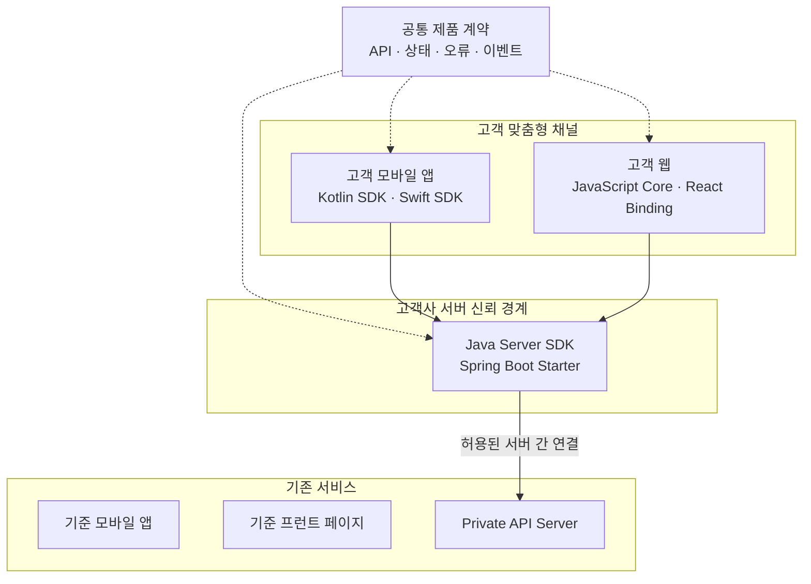
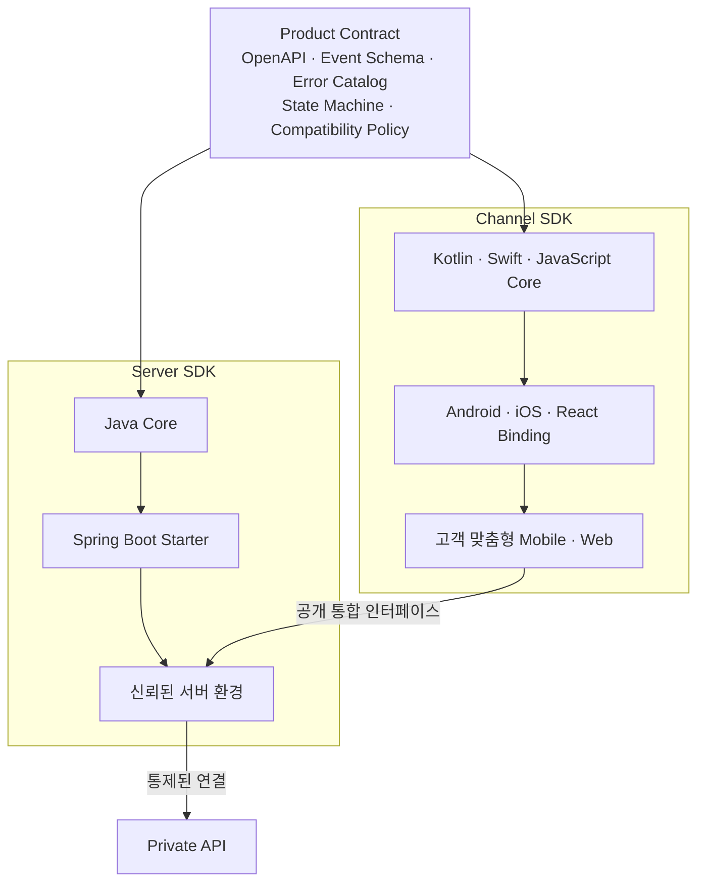
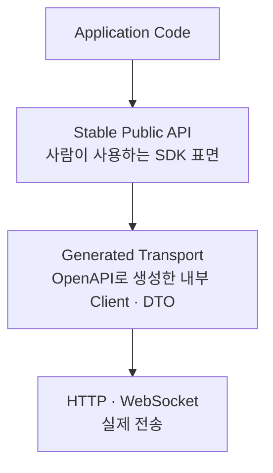
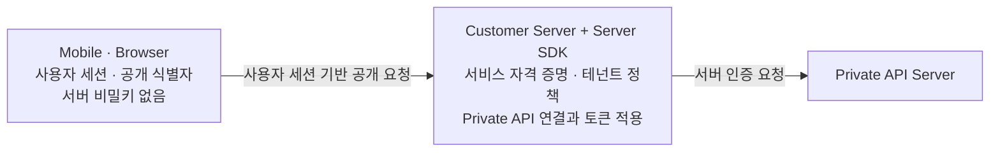
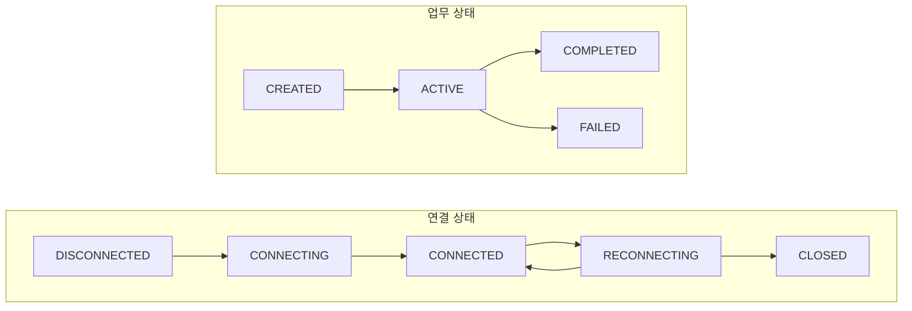
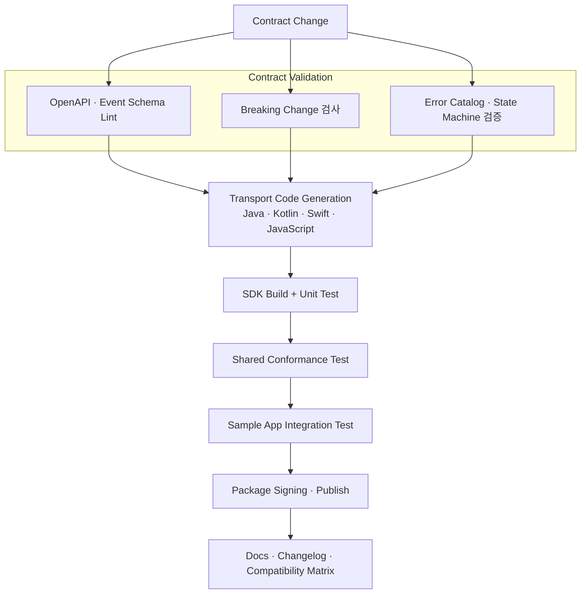

# 프라이빗 API를 보호하는 멀티플랫폼 SDK 아키텍처: Java·Kotlin·Swift·React 계약 설계

이미 운영 중인 API 서버와 웹 프런트 페이지, 모바일 앱이 있다고 가정해 보겠습니다. 표준 화면만 제공할 때는 이 세 구성요소만으로도 충분하지만, 고객사마다 업무 흐름·브랜드·화면 구성이 달라지면 하나의 UI를 그대로 제공하는 방식에는 한계가 생깁니다.

이 문제를 해결하기 위해 고객사가 자신의 요구에 맞는 채널을 구현할 수 있도록 다음 SDK를 제공할 수 있습니다.

- Android 애플리케이션을 위한 Kotlin Mobile SDK
- iOS 애플리케이션을 위한 Swift Mobile SDK
- 고객 맞춤형 웹을 위한 React·JavaScript Front SDK
- 고객사 서버 환경을 위한 Java Server SDK와 Spring Boot Starter

여기에는 중요한 네트워크 제약이 하나 더 있습니다. 핵심 API 서버가 프라이빗 망에 있어 모바일 앱이나 브라우저가 직접 접근할 수 없다면, 클라이언트 SDK만 제공해서는 통합이 완성되지 않습니다. 신뢰할 수 있는 서버 측 실행 환경에서 프라이빗 API 연결을 담당하는 Server SDK가 함께 필요합니다.

처음에는 각 플랫폼에서 HTTP API를 호출하는 얇은 래퍼(Wrapper)를 만들면 충분해 보입니다. 그러나 인증 갱신, 네트워크 재시도, 실시간 이벤트, 앱 생명주기, 오류 처리와 버전 호환성이 추가되면 SDK는 단순한 API 호출 코드가 아니라 **제품과 애플리케이션 사이의 실행 계약**이 됩니다.

이때 가장 어려운 문제는 언어가 다르다는 사실 자체가 아닙니다. 같은 기능이 플랫폼마다 조금씩 다른 이름·상태·오류·재시도 정책으로 구현되면서 **하나의 제품이 다섯 가지 의미로 갈라지는 것**이 진짜 문제입니다.

이 글은 Java·Spring Boot·Kotlin·Swift·React JavaScript SDK를 함께 설계할 때, 플랫폼의 장점을 살리면서도 제품 계약을 하나로 유지하는 방법을 정리합니다. 코드와 식별자는 공개 설명을 위한 합성 예시이며, 특정 고객사·회사·비공개 제품·내부 URL·계정·토큰을 포함하지 않습니다.

## 1. 작성 배경: 고객 맞춤형 채널과 프라이빗 API 사이에 안전한 경계를 만든다

이 아키텍처의 출발점은 “여러 언어를 지원하자”가 아닙니다. **기존 서비스의 기능은 유지하면서 고객사가 모바일 앱과 웹 화면을 자유롭게 구성하고, 동시에 프라이빗 API의 네트워크·인증 경계를 외부 채널에 노출하지 않는 것**이 목표입니다.



실제 연결 방식은 고객사의 배포 토폴로지와 보안 정책에 따라 달라질 수 있습니다. 다만 공통 원칙은 분명합니다. 모바일 앱과 브라우저 번들에는 프라이빗 API의 서버 자격 증명이나 내부 연결 정보를 넣지 않고, Server SDK가 신뢰 경계 안에서 인증·전송·오류 변환과 운영 정책을 담당합니다.

| 요구사항 | SDK 아키텍처의 대응 |
|---|---|
| 고객사별 UI·업무 흐름 구현 | Mobile·Front SDK가 기능 단위의 안정적인 공개 API 제공 |
| Android·iOS·웹의 동작 일관성 | 공통 API·상태·오류·이벤트 계약 적용 |
| 프라이빗 API 직접 노출 방지 | Java Server SDK가 신뢰된 서버 측 통합 경계 담당 |
| 고객사 서버의 빠른 적용 | Spring Boot Starter로 설정·Bean·관측 연동 자동화 |
| 제품 변경 시 통합 안정성 | 버전 호환성 표와 공통 적합성 테스트 운영 |

따라서 Mobile SDK, Front SDK와 Server SDK는 서로 독립된 라이브러리가 아니라 하나의 통합 경계를 역할별로 나눈 제품군입니다. 채널 SDK는 고객사의 구현 자유도를 높이고, Server SDK는 프라이빗 API의 보안과 운영 복잡성을 캡슐화합니다.

## 2. 멀티플랫폼 SDK의 핵심 문제는 코드 중복이 아니라 의미의 분기다

다섯 플랫폼에 같은 API 호출 코드를 복사하면 코드 중복은 눈에 잘 보입니다. 반면 **의미 중복과 의미 불일치**는 늦게 발견됩니다.

예를 들어 서버가 세션 생성을 다음과 같이 제공한다고 가정하겠습니다.

```text
POST /v1/sessions

요청:
  clientRequestId
  userId
  options

응답:
  sessionId
  status
  expiresAt
```

플랫폼별 구현이 독립적으로 진행되면 같은 기능이 다음처럼 갈라질 수 있습니다.

| 항목 | Java | Kotlin | Swift | React JavaScript |
|---|---|---|---|---|
| 메서드 | `createSession` | `startSession` | `openSession` | `connect` |
| 성공 상태 | `CREATED` | `READY` | `.active` | `"connected"` |
| 시간 값 | `Instant` | `Long` 밀리초 | `Date` | ISO 문자열 |
| 취소 | `Future.cancel` | Coroutine 취소 | `Task.cancel` | `AbortController` |
| 오류 | 예외 클래스 | `Result`·예외 혼합 | `throws` | Promise reject |
| 재시도 | SDK 내부 3회 | 호출자가 수행 | 미구현 | 무제한 재연결 |

각 구현만 보면 모두 그럴듯합니다. 하지만 애플리케이션 개발자는 플랫폼마다 다른 제품을 배우게 되고, 운영팀은 같은 장애를 서로 다른 로그와 오류 코드로 해석해야 합니다.

따라서 멀티플랫폼 SDK의 첫 번째 목표는 코드 재사용이 아닙니다.

> **같은 입력과 같은 서버 응답이 플랫폼마다 같은 의미로 해석되도록 만드는 것**

코드는 플랫폼별로 달라도 되지만, 상태 전이·오류 분류·재시도 조건·이벤트 순서·버전 정책은 같아야 합니다.

## 3. 전체 구조: 신뢰 경계를 지키면서 계약 코어와 플랫폼 어댑터를 분리한다

권장 구조는 **계약 코어(Contract Core)** 와 **플랫폼 어댑터(Platform Adapter)** 를 분리하는 것입니다.



각 층의 책임은 다음처럼 나눕니다.

| 층 | 책임 | 포함하지 않을 것 |
|---|---|---|
| Product Contract | API·이벤트·오류·상태·호환성의 진실의 원천 | 플랫폼 UI·스레드 구현 |
| Channel SDK Core | 요청 모델, 상태·이벤트 표현, 취소와 채널 정책 | 서버 비밀키, 프라이빗 API 직접 연결 |
| Server SDK Core | 서버 인증, 요청 직렬화, 응답 파싱, 오류·재시도 정책 | 고객 UI, Android Activity, React Component |
| Platform Adapter | 저장소·생명주기·스케줄러·네트워크 상태 연결 | 서버 계약 재정의 |
| Framework Binding | Spring Bean, Android Lifecycle, Swift Concurrency, React Hook 제공 | 별도의 제품 상태 모델 |
| Sample App | 올바른 통합 방법과 실패 복구 시연 | 내부 구현에 의존하는 우회 코드 |

이 구조에서 공통 코어는 반드시 하나의 언어로 공유할 필요가 없습니다. Java, Kotlin, Swift와 JavaScript가 각각 계약을 구현해도 됩니다. 중요한 것은 **공통 계약으로부터 생성·검증되고 동일한 적합성 테스트(Conformance Test)를 통과하는가**입니다. 또한 Channel SDK에서 프라이빗 API의 내부 DTO·Endpoint·인증 방식을 그대로 노출하지 않아야 Server SDK가 실질적인 경계 역할을 할 수 있습니다.

## 4. 진실의 원천: 사람의 기억이 아니라 기계가 읽는 계약

여러 SDK가 같은 의미를 유지하려면 계약을 문서 한 장이나 담당자의 기억에 맡겨서는 안 됩니다. 최소한 다음 네 가지를 기계가 읽을 수 있는 형식으로 관리해야 합니다.

```text
1. HTTP API Contract   : OpenAPI
2. Event Contract      : JSON Schema 또는 AsyncAPI 계열 스키마
3. Error Catalog       : 안정적인 machine code + retryability
4. State Machine       : 허용 상태와 전이 규칙
```

OpenAPI는 HTTP API를 기술하는 언어 독립적 인터페이스 설명입니다. 공식 사양을 기준으로 경로, 입력, 출력, 인증과 오류 응답을 명세하면 SDK 생성과 계약 테스트의 입력으로 사용할 수 있습니다. 다만 생성기가 만든 코드를 그대로 공개 API로 노출하면 생성기 버전 변경이 SDK 사용법까지 흔들 수 있으므로, 생성 코드는 내부 전송 계층에 두고 그 위에 안정적인 수동 공개 API를 제공하는 편이 안전합니다.



이렇게 하면 OpenAPI 생성기를 교체하거나 HTTP 라이브러리를 바꾸더라도 애플리케이션 코드가 직접 영향을 받지 않습니다.

### 3.1 계약 파일의 예

아래는 개념을 보여 주기 위한 축약된 OpenAPI 예시입니다.

```yaml
openapi: "3.1.0"
info:
  title: Session API
  version: "1.0.0"
paths:
  /v1/sessions:
    post:
      operationId: createSession
      parameters:
        - in: header
          name: Idempotency-Key
          required: true
          schema:
            type: string
      responses:
        "201":
          description: Session created
          content:
            application/json:
              schema:
                $ref: "#/components/schemas/Session"
        "409":
          description: State conflict
          content:
            application/problem+json:
              schema:
                $ref: "#/components/schemas/Problem"
components:
  schemas:
    Session:
      type: object
      required: [sessionId, status, expiresAt]
      properties:
        sessionId:
          type: string
        status:
          type: string
          enum: [CREATED, CONNECTING, ACTIVE, CLOSING, CLOSED, FAILED]
        expiresAt:
          type: string
          format: date-time
```

계약에서 주목할 부분은 메서드 이름보다 다음 요소입니다.

- `Idempotency-Key`가 필수라는 사실
- 상태 값의 허용 목록
- 시간 표현이 RFC 3339 계열 문자열이라는 사실
- 충돌 오류가 `application/problem+json`이라는 사실
- 성공과 실패의 HTTP 의미

SDK는 이 의미를 각 언어의 자연스러운 타입으로 옮겨야 합니다.

## 5. "같은 API"와 "같은 모양의 API"는 다르다

제품 계약은 같아야 하지만, 모든 언어에 똑같은 문법을 강요하면 오히려 사용하기 어려운 SDK가 됩니다.

```java
// Java
Session session = client.createSession(request);
```

```kotlin
// Kotlin
val session = client.createSession(request)
```

```swift
// Swift
let session = try await client.createSession(request)
```

```javascript
// JavaScript
const session = await client.createSession(request);
```

메서드의 **업무 의미**는 같지만 비동기 표현·오류 처리·취소 방식은 각 언어 관습을 따릅니다. Swift 공식 API 설계 지침도 호출 지점의 명확성을 우선하고, 짧은 이름 자체보다 사용 맥락에서 이해되는 API를 강조합니다.

멀티플랫폼 SDK의 일관성은 다음 두 층으로 나누어 판단하는 것이 좋습니다.

| 반드시 같아야 하는 것 | 플랫폼에 맞게 달라도 되는 것 |
|---|---|
| 업무 동작과 상태 전이 | 비동기 문법 |
| 필수·선택 입력의 의미 | Builder·Initializer·Named Argument |
| 오류 코드와 재시도 가능 여부 | Exception·Result·Promise 표현 |
| 이벤트 이름과 순서 | Listener·Flow·AsyncSequence·Callback |
| 인증·만료·갱신 정책 | 안전한 저장소 구현 |
| 호환성·폐기 정책 | 패키지 배포 방식 |

이 구분을 문서에 명시하면 "플랫폼 일관성"을 이유로 부자연스러운 API를 만들거나, 반대로 "플랫폼 관습"을 이유로 제품 의미를 바꾸는 일을 막을 수 있습니다.

## 6. 설정 계약: 필수값, 선택값과 기본값을 구분한다

SDK 초기화는 모든 플랫폼에서 가장 먼저 만나는 API입니다. 이 단계가 모호하면 운영 환경에서 잘못된 서버·테넌트·타임아웃으로 연결되는 문제가 생깁니다.

공통 설정 모델은 다음 세 부류로 나누는 것이 좋습니다.

### 5.1 필수 설정

- SDK 역할에 맞는 API 기준 URL
  - Mobile·Front SDK: 고객사 서버가 외부에 공개한 통합 Endpoint
  - Server SDK: 고객사 신뢰 경계에서만 접근 가능한 프라이빗 API Endpoint
- 인증 정보 공급자(Token Provider)
- 애플리케이션 또는 테넌트 식별자
- SDK를 사용하는 환경 구분

### 5.2 안전한 기본값을 둘 수 있는 설정

- 연결·읽기 타임아웃
- 재시도 최대 횟수와 Backoff
- 로그 수준
- 이벤트 버퍼 크기

### 5.3 호출자가 명시적으로 선택해야 하는 위험 설정

- 인증서 검증 완화
- 디버그 본문 로그
- 비암호화 전송
- 무제한 재시도
- 민감정보가 포함될 수 있는 원문 이벤트 수집

위험 설정은 기본값으로 켜지지 않아야 하며, 가능하면 운영 빌드에서 사용할 수 없도록 제한합니다.

```json
{
  "endpoint": "https://api.example.com",
  "tenantId": "tenant-demo",
  "timeouts": {
    "connectMs": 3000,
    "readMs": 15000
  },
  "retry": {
    "maxAttempts": 3,
    "baseDelayMs": 250,
    "maxDelayMs": 3000,
    "jitter": true
  },
  "logging": {
    "level": "INFO",
    "includePayload": false
  }
}
```

이 예시는 값 자체보다 **설정의 의미와 단위가 계약에 포함되어야 한다**는 점을 보여 줍니다. `timeout: 3`처럼 단위가 없는 설정은 플랫폼마다 초·밀리초로 다르게 해석될 수 있습니다.

여기서 `endpoint`는 모든 SDK가 같은 주소를 사용한다는 뜻이 아닙니다. 채널 SDK에는 고객사 서버의 공개 통합 Endpoint를 설정하고, 프라이빗 API 주소와 서버 자격 증명은 Server SDK가 실행되는 신뢰 경계 안에서만 설정합니다. 두 설정 객체의 필드 모양이 비슷하더라도 배포 대상과 비밀 수준은 분리해야 합니다.

## 7. 인증 계약: 토큰을 받는 방법과 보관하는 방법을 분리한다

SDK가 액세스 토큰을 직접 발급하는 구조와, 애플리케이션이 제공한 토큰을 API 요청에 적용하는 구조는 책임이 다릅니다. 일반적으로 SDK Core는 다음과 같은 **Token Provider 계약**에 의존하고, 실제 로그인 UI·Keychain·Android Keystore·서버 비밀 저장소는 애플리케이션 또는 플랫폼 어댑터가 담당하도록 분리하는 편이 좋습니다.

이번 구조에서는 인증 책임을 채널과 서버 경계로 한 번 더 나눕니다.



| 위치 | 보유할 수 있는 정보 | 보유하지 않아야 하는 정보 |
|---|---|---|
| Mobile SDK | 사용자 세션, 앱 설정, 공개 Client 식별자 | 서버 비밀키, 프라이빗 Endpoint 자격 증명 |
| Front SDK | 브라우저 세션, 공개 설정 | 장기 토큰, 서버용 Secret |
| Server SDK | 보안 저장소에서 주입된 서비스 자격 증명 | 코드·설정 예제에 하드코딩된 Secret |

프라이빗 망은 네트워크 접근을 제한하지만, 그것만으로 애플리케이션 수준의 인증과 인가를 대신하지는 않습니다. Server SDK는 허용된 연결 경로에서도 고객·테넌트·권한 범위를 확인하고 최소 권한의 자격 증명을 적용해야 합니다.

```text
TokenProvider
  getToken(context) -> token + expiresAt
  invalidate(token)

SDK Core
  1. 요청 전 토큰 획득
  2. 만료 여유를 적용
  3. Authorization 헤더 구성
  4. 인증 실패 시 한 번만 갱신 요청
  5. 실패 원인을 표준 오류로 반환
```

여기서 중요한 운영 원칙은 다음과 같습니다.

- 비밀키·관리자 토큰을 모바일 앱이나 JavaScript 번들에 넣지 않습니다.
- 액세스 토큰 원문을 로그에 남기지 않습니다.
- 여러 동시 요청이 401을 받더라도 토큰 갱신을 한 번으로 합칩니다(Single Flight).
- 토큰 갱신 실패와 네트워크 실패를 다른 오류 코드로 구분합니다.
- SDK가 토큰의 대상(audience)과 권한(scope)을 임의로 확대하지 않습니다.

서버용 Java SDK는 신뢰된 실행 환경에서 동작할 수 있지만, 브라우저·모바일 SDK는 사용자 단말에 배포됩니다. 따라서 "공통 인증 계약"은 같아도 **위협 모델은 플랫폼별로 다르다**는 점을 문서에 함께 적어야 합니다.

## 8. 오류 계약: 메시지가 아니라 코드와 속성으로 판단한다

SDK마다 다른 오류 문자열을 만들면 애플리케이션이 메시지 문구를 파싱하기 시작합니다. 번역이나 문구 수정만으로도 분기 로직이 깨집니다.

오류는 최소한 다음 정보를 공통으로 제공해야 합니다.

```json
{
  "type": "https://api.example.com/problems/rate-limited",
  "title": "Too many requests",
  "status": 429,
  "code": "RATE_LIMITED",
  "retryable": true,
  "retryAfterMs": 1500,
  "requestId": "req_example_001"
}
```

HTTP API의 기계 판독 가능한 오류 모델은 RFC 9457 Problem Details를 기반으로 설계할 수 있습니다. RFC 9457은 RFC 7807을 대체하며 `type`, `title`, `status`, `detail`, `instance` 같은 공통 필드를 정의합니다. 중요한 점은 `detail` 문장을 프로그램이 파싱하지 않고, 안정적인 `type` 또는 확장된 `code`를 기준으로 처리하는 것입니다.

SDK 내부 오류 분류는 다음처럼 통일할 수 있습니다.

| 분류 | 예 | 기본 재시도 |
|---|---|---|
| Configuration | endpoint 누락, 잘못된 옵션 | 금지 |
| Authentication | 토큰 없음·갱신 실패 | 조건부 |
| Authorization | 권한 부족 | 금지 |
| Validation | 잘못된 입력 | 금지 |
| Conflict | 상태 전이 충돌 | 업무 규칙에 따름 |
| RateLimit | 429, Retry-After | 허용 |
| Network | 연결 실패·일시적 DNS | 멱등 요청만 허용 |
| Server | 5xx | 제한적 허용 |
| Serialization | 계약과 다른 응답 | 금지·즉시 관측 |
| Cancelled | 호출자·생명주기 취소 | 금지 |

각 언어는 이 분류를 자연스럽게 표현합니다.

```java
// Java: SDK 예외 계층의 축약 예시
public abstract class SdkException extends RuntimeException {
    private final String code;
    private final boolean retryable;

    protected SdkException(
            String message,
            String code,
            boolean retryable
    ) {
        super(message);
        this.code = code;
        this.retryable = retryable;
    }

    public String code() {
        return code;
    }

    public boolean retryable() {
        return retryable;
    }
}
```

```swift
// Swift: SDK 오류 열거형의 개념 예시
enum SDKError: Error {
    case authentication(code: String)
    case rateLimited(retryAfter: Duration?)
    case network(underlying: Error)
    case cancelled
}
```

공개 오류 타입은 가능한 한 안정적으로 유지하고, 내부 HTTP 라이브러리의 예외를 그대로 외부에 노출하지 않습니다. 그래야 OkHttp, URLSession Wrapper, Fetch 구현을 교체해도 애플리케이션의 예외 처리가 깨지지 않습니다.

## 9. 비동기·취소 계약: 실행 결과뿐 아니라 중단 의미도 맞춘다

네트워크 SDK에서 비동기는 단순히 반환 타입의 차이가 아닙니다. 작업이 언제 시작되고, 누가 취소할 수 있으며, 취소 후 콜백이 더 도착하는지까지 계약에 포함됩니다.

| 플랫폼 | 권장 표현 | 반드시 문서화할 것 |
|---|---|---|
| Java | `CompletableFuture`, Reactive 타입 또는 동기 API 분리 | Executor, Blocking 여부, 취소 전파 |
| Kotlin | `suspend`, `Flow` | 구조적 동시성, Dispatcher, `CancellationException` |
| Swift | `async throws`, `AsyncSequence` | Actor 격리, `Task` 취소, MainActor 전달 |
| JavaScript | `Promise`, `AsyncIterable`, `AbortSignal` | Abort 적용 범위, 이벤트 정리, 브라우저 종료 |

Android 공식 Coroutine 권장사항은 Coroutine을 시작하는 계층과 수명 범위를 명확히 하고, 화면에만 필요한 작업은 호출자의 생명주기를 따르도록 안내합니다. 또한 취소를 가능하게 하는 `CancellationException`을 삼키지 않아야 합니다.

공통 취소 계약은 다음 질문에 답해야 합니다.

```text
1. 취소는 로컬 대기만 중단하는가, 서버 작업도 취소하는가?
2. 서버 취소 API가 실패하면 최종 상태는 무엇인가?
3. 취소 후 완료 이벤트가 늦게 도착할 수 있는가?
4. SDK를 close/dispose한 뒤 콜백이 실행될 수 있는가?
5. 취소는 오류 통계에 포함되는가?
```

권장 원칙은 **로컬 취소와 원격 취소를 다른 동작으로 구분하는 것**입니다.

```text
cancelWait()        현재 호출자의 대기와 구독만 취소
cancelOperation()   서버의 장기 실행 작업 취소를 요청
```

이 구분이 없으면 화면 전환으로 Coroutine이 취소되었을 뿐인데 서버의 중요한 작업까지 중단되거나, 반대로 사용자가 취소 버튼을 눌렀는데 화면만 닫히고 서버 작업은 계속될 수 있습니다.

## 10. 재시도 계약: SDK마다 세 번씩 재시도하지 않는다

재시도는 신뢰성을 높이지만 여러 계층에서 중첩되면 호출을 폭증시킵니다.


여기서 각 계층의 "3회"는 최초 요청을 포함한 **총 시도 횟수**입니다. 세 계층이 독립적으로 같은 정책을 적용하면 `3 × 3 × 3 = 27`건까지 증폭될 수 있습니다. "최대 재시도 3회"처럼 최초 요청을 제외한 표현을 쓴다면 총 시도는 4회가 되므로, 설정과 문서에서 `maxAttempts`와 `maxRetries`를 혼용하지 않아야 합니다. 따라서 재시도 소유자를 명확히 정해야 합니다.

### 9.1 자동 재시도가 가능한 조건

- GET·HEAD 같은 멱등 요청
- 멱등 키가 있는 생성 요청
- 전송 전 실패가 확실한 경우
- 429·일부 5xx처럼 계약이 허용한 일시 오류
- 서버가 `Retry-After` 또는 안전한 재시도 정보를 제공한 경우

### 9.2 자동 재시도를 금지할 조건

- 결제·발송·승인처럼 중복 부작용 위험이 있는 요청
- 서버가 요청을 받았는지 알 수 없는 비멱등 작업
- 인증·인가·입력 검증 실패
- 직렬화 계약 위반
- 호출자 취소

재시도 정책은 플랫폼별 구현이 아니라 제품 계약의 일부로 관리합니다.

```json
{
  "operation": "createSession",
  "idempotency": "required",
  "retryableStatus": [429, 502, 503, 504],
  "maxAttempts": 3,
  "backoff": "exponential-jitter",
  "respectRetryAfter": true
}
```

SDK는 재시도 횟수와 최종 실패 원인을 관측 정보에 남겨야 합니다. 그렇지 않으면 사용자는 요청을 한 번 보냈다고 생각하지만 운영 로그에는 여러 요청이 남고, 장애 원인을 찾기 어려워집니다.

## 11. 실시간 이벤트 계약: 연결 상태와 업무 이벤트를 분리한다

WebSocket·SSE·스트리밍 SDK에서는 이벤트 이름보다 **순서·중복·재연결 의미**가 중요합니다.



연결 상태와 업무 상태를 하나의 `status`로 합치면 네트워크가 잠시 끊긴 것과 서버 작업이 실패한 것을 구분할 수 없습니다.

권장 이벤트 envelope은 다음과 같습니다.

```json
{
  "eventId": "evt_example_001",
  "eventType": "session.status.changed",
  "eventVersion": 1,
  "occurredAt": "2026-07-31T02:10:00Z",
  "sequence": 42,
  "sessionId": "session_example_001",
  "payload": {
    "previousStatus": "CONNECTING",
    "status": "ACTIVE"
  }
}
```

각 필드의 역할을 계약으로 고정합니다.

- `eventId`: 중복 제거
- `eventType`: 이벤트 종류 식별
- `eventVersion`: Payload 호환성 판단
- `occurredAt`: 서버 발생 시각
- `sequence`: 같은 스트림 안의 순서 복구
- `sessionId`: 업무 객체 상관관계

재연결 시 SDK는 "연결 성공"만 알릴 것이 아니라 다음 정책을 명시해야 합니다.

- 마지막 수신 sequence 이후 재구독이 가능한가
- 누락 이벤트를 조회 API로 보충하는가
- 중복 이벤트가 다시 올 수 있는가
- 버퍼 초과 시 오래된 이벤트를 버리는가, 연결을 실패시키는가
- 구독 해제와 SDK 종료 시 리소스를 어떻게 정리하는가

React 공식 문서는 외부 시스템과 동기화하는 로직을 목적이 분명한 Custom Hook으로 감싸고, Effect 정리 함수에서 연결을 해제하는 패턴을 안내합니다. SDK도 같은 원칙으로 `useSessionEvents` 같은 구체적 Hook을 제공하고, 단순히 `useEffectOnce` 같은 범용 생명주기 우회 API는 제공하지 않는 편이 좋습니다.

## 12. 플랫폼별 공개 API는 관습적으로, 상태 의미는 동일하게

### 11.1 Java Server SDK

Java SDK는 서버 환경에서 장시간 재사용되는 Client를 전제로 설계합니다. 이 구조에서 Server SDK는 단순한 HTTP 편의 래퍼가 아니라, 고객사 서버가 프라이빗 API를 일관되고 안전하게 사용하는 **신뢰 경계의 구현체**입니다.

- Thread-safe Client
- 명시적인 Builder와 불변 설정
- 연결 풀·Executor의 소유권 문서화
- 동기 API와 비동기 API의 혼용 규칙
- `close()`가 필요한 자원의 명확한 수명
- 서버 자격 증명과 테넌트 정책의 중앙 적용
- 내부 전송 오류를 공개 오류 계약으로 변환
- 재시도·멱등성·관측성의 단일 소유권

```java
SdkClient client = SdkClient.builder()
        .endpoint(URI.create("https://api.example.com"))
        .tokenProvider(tokenProvider)
        .requestTimeout(Duration.ofSeconds(15))
        .build();
```

### 11.2 Spring Boot Starter

Spring Boot Starter는 고객사 서버에 Core SDK를 연결하는 통합 계층입니다. Spring Boot의 Auto-configuration은 클래스패스와 사용자 정의 Bean 여부 같은 조건을 보고 구성을 적용하며, 사용자가 같은 타입의 Bean을 직접 정의하면 기본 구성이 물러나는 방식을 권장합니다.

```text
sdk-java-core
  └─ 프레임워크 독립 Client

sdk-spring-boot-autoconfigure
  └─ @ConfigurationProperties
  └─ @AutoConfiguration
  └─ @ConditionalOnClass
  └─ @ConditionalOnMissingBean

sdk-spring-boot-starter
  └─ 필요한 의존성을 묶는 진입점
```

Starter가 업무 계약을 다시 구현하지 않고 Core SDK를 Bean으로 구성하는 데 집중해야 테스트와 호환성 관리가 쉬워집니다. 프라이빗 API의 인증 정보도 Starter의 기본값이나 샘플 파일에 넣지 않고, 고객사의 Secret Manager·환경별 보안 설정에서 주입받도록 설계합니다.

### 11.3 Android Kotlin SDK

Kotlin SDK는 Android 생명주기와 구조적 동시성을 존중합니다.

- 일회 요청은 `suspend`
- 지속 이벤트는 `Flow`
- SDK가 임의의 전역 Scope를 만들지 않음
- Main Thread에서 Blocking I/O를 수행하지 않음
- 화면 수명을 넘는 작업의 소유자를 명확히 함

```kotlin
val session = sdk.createSession(request)

sdk.observeSession(session.id)
    .collect { state ->
        render(state)
    }
```

### 11.4 iOS Swift SDK

Swift SDK는 호출 지점의 명확성, `async throws`, `AsyncSequence`와 명시적인 취소 의미를 활용할 수 있습니다.

```swift
let session = try await sdk.createSession(request)

for try await event in sdk.events(for: session.id) {
    await render(event)
}
```

UI 갱신이 필요한 콜백·상태 전달은 MainActor 경계를 문서화하고, 네트워크·파싱 작업 전체를 MainActor에서 수행하지 않도록 분리합니다.

### 11.5 React JavaScript SDK

React 통합은 Framework 독립 JavaScript Client와 React Binding을 분리합니다.

```text
@example/sdk-core
  createClient()
  createSession()
  subscribe()

@example/sdk-react
  SdkProvider
  useSdk()
  useSession()
  useSessionEvents()
```

```javascript
function SessionPanel({ sessionId }) {
  const { state, error, reconnect } = useSession(sessionId);

  if (error) {
    return <ErrorView error={error} onRetry={reconnect} />;
  }

  return <SessionStateView state={state} />;
}
```

React Component 안에서 전송 계층을 직접 만들지 않고 Provider나 명시적 Client 인스턴스로 주입하면 테스트·서버 사이드 렌더링·다중 테넌트 구성에 대응하기 쉽습니다.

## 13. 상태 모델: 문자열을 그대로 노출하지 않는다

서버의 상태 문자열을 SDK가 검증 없이 그대로 전달하면 서버 오타나 신규 상태가 애플리케이션 분기를 깨뜨릴 수 있습니다.

권장 전략은 두 가지를 함께 사용하는 것입니다.

1. 알려진 상태는 언어별 Enum·Sealed Type으로 제공
2. 미래 서버 상태를 처리할 `UNKNOWN(rawValue)` 경로를 제공

```text
Known:
  CREATED
  CONNECTING
  ACTIVE
  CLOSING
  CLOSED
  FAILED

Forward-compatible:
  UNKNOWN("PAUSED_BY_POLICY")
```

무조건 파싱 실패시키면 서버가 하위 호환 방식으로 상태를 추가해도 구버전 SDK가 전체 응답을 읽지 못합니다. 반대로 모든 값을 문자열로 두면 오타와 잘못된 상태 전이를 컴파일 시점에 잡을 수 없습니다.

상태 전이도 표로 관리합니다.

| 현재 | 허용되는 다음 상태 |
|---|---|
| CREATED | CONNECTING, CLOSED, FAILED |
| CONNECTING | ACTIVE, CLOSED, FAILED |
| ACTIVE | CLOSING, CLOSED, FAILED |
| CLOSING | CLOSED, FAILED |
| CLOSED | 없음 |
| FAILED | 정책에 따라 재시작 또는 종료 |

SDK가 서버를 대신해 업무 상태를 결정해서는 안 되지만, 명백히 불가능한 전이를 감지해 관측 로그와 진단 이벤트를 남길 수는 있습니다.

## 14. 버전 전략: 패키지 버전과 서버 API 버전을 분리한다

멀티플랫폼 환경에는 최소 세 가지 버전이 존재합니다.

```text
Server API Version     /v1, 계약의 서버 호환 범위
SDK Package Version    2.4.1, 각 언어 패키지 릴리스
Event Schema Version   eventVersion: 1, 이벤트 Payload 계약
```

이 세 버전을 하나로 묶으면 작은 SDK 버그 수정에도 API 버전을 올리거나, 이벤트 형식 변경이 패키지 Patch에 숨어 들어갈 수 있습니다.

Semantic Versioning은 공개 API를 먼저 선언하고 다음 규칙을 사용합니다.

- MAJOR: 하위 호환되지 않는 공개 API 변경
- MINOR: 하위 호환 기능 추가
- PATCH: 하위 호환 버그 수정

다만 네 SDK가 항상 같은 패키지 버전을 가져야 하는 것은 아닙니다. 플랫폼별 버그 수정 시점이 다를 수 있기 때문입니다. 대신 다음을 함께 관리하는 편이 실용적입니다.

```json
{
  "contractVersion": "2026-07-31",
  "compatibleSdkVersions": {
    "java": ">=2.3.0 <3.0.0",
    "kotlin": ">=1.8.0 <2.0.0",
    "swift": ">=1.6.0 <2.0.0",
    "javascript": ">=3.1.0 <4.0.0"
  }
}
```

중요한 것은 버전 번호를 맞추는 것이 아니라 **어떤 계약 버전을 구현하고 어떤 서버 범위와 호환되는지 선언하는 것**입니다.

## 15. 하위 호환 변경과 파괴적 변경을 구분한다

| 변경 | 일반적 판단 | 주의점 |
|---|---|---|
| 선택 응답 필드 추가 | 하위 호환 | 엄격 파서가 실패하지 않아야 함 |
| 선택 요청 필드 추가 | 하위 호환 | 기본 의미를 문서화 |
| Enum 값 추가 | 조건부 호환 | UNKNOWN 처리 필요 |
| 필수 요청 필드 추가 | 파괴적 | 새 API 버전 또는 단계적 전환 |
| 필드 타입 변경 | 파괴적 | 병행 필드·마이그레이션 필요 |
| 오류 메시지 변경 | 호환 | 앱이 문구를 파싱하지 않아야 함 |
| 오류 코드 의미 변경 | 파괴적 | 새 코드로 분리 |
| 이벤트 순서 변경 | 파괴적 가능 | 상태 머신·재처리 영향 검증 |
| 기본 타임아웃 축소 | 행동 변화 | 릴리스 노트와 영향 검증 |

특히 "새 Enum 값을 추가하는 것은 하위 호환"이라는 판단은 수신 SDK가 미지의 값을 처리할 수 있을 때만 맞습니다. 코드 생성기의 기본 설정이 미지 Enum을 파싱 오류로 처리한다면 서버의 단순 추가가 모든 구버전 앱의 장애가 됩니다.

## 16. 적합성 테스트: 각 SDK가 같은 계약을 구현했음을 증명한다

멀티플랫폼 SDK의 품질을 각 저장소의 단위 테스트 통과만으로 판단하면 부족합니다. 모든 SDK에 동일한 입력·응답·이벤트 벡터를 적용하는 **공통 적합성 테스트 묶음**이 필요합니다.

```text
conformance/
  requests/
    create-session-valid.json
    create-session-invalid.json
  responses/
    session-created.json
    unknown-status.json
    problem-rate-limited.json
  events/
    ordered-events.ndjson
    duplicate-events.ndjson
    sequence-gap.ndjson
  scenarios/
    token-refresh.yaml
    retry-idempotent.yaml
    cancel-local-only.yaml
```

각 SDK는 동일한 기대 결과를 만족해야 합니다.

| 테스트 | 기대 결과 |
|---|---|
| 미지 응답 필드 | 정상 무시 또는 보존 |
| 미지 상태 값 | `UNKNOWN(raw)` 변환 |
| 429 + Retry-After | 제한된 자동 재시도 |
| 400 Validation | 재시도 금지 |
| 같은 eventId 두 번 | 한 번만 전달 |
| sequence 누락 | Gap 진단 이벤트 발생 |
| 호출자 취소 | 추가 콜백·재시도 없음 |
| 토큰 만료 동시 요청 | 갱신 한 번만 수행 |
| SDK close 이후 이벤트 | 전달 금지 |

여기에 플랫폼별 테스트를 더합니다.

- Java: 동시 호출·Thread safety·Executor 종료
- Spring Boot: 조건부 Auto-configuration·사용자 Bean 우선
- Kotlin: Coroutine 취소·Dispatcher·Lifecycle 재구독
- Swift: Task 취소·Actor 격리·메모리 해제
- React: Strict Mode·Effect Cleanup·Provider 재마운트

적합성 테스트 결과를 릴리스 조건으로 사용하면 "Java SDK에서는 되는데 Swift SDK에서는 다르게 동작한다"는 문제를 배포 전에 발견할 수 있습니다.

## 17. 관측성 계약: 사용자의 로그를 오염시키지 않으면서 진단 가능하게

SDK는 애플리케이션 내부에서 동작하므로 로그를 너무 많이 남기면 사용자 시스템을 오염시키고, 너무 적게 남기면 장애를 진단할 수 없습니다.

공통 진단 필드는 다음 정도로 제한합니다.

```json
{
  "sdkName": "example-sdk-java",
  "sdkVersion": "2.4.1",
  "operation": "createSession",
  "requestId": "req_example_001",
  "attempt": 2,
  "durationMs": 438,
  "result": "RATE_LIMITED",
  "retryScheduled": true
}
```

기본 로그에서 제외할 항목도 명시합니다.

- 액세스·리프레시 토큰
- Authorization Header
- 원문 음성·문서·개인정보 Payload
- 전체 Request·Response Body
- 모바일 단말의 민감 식별자
- 서버 비밀키와 내부 Stack Trace

SDK는 자체 로거를 강제로 설치하기보다 플랫폼의 로깅·Telemetry 어댑터를 주입받도록 설계하는 편이 좋습니다. 호출자는 로그 수준과 수집 대상을 통제할 수 있어야 합니다.

## 18. 기술문서 구조: 시작하기보다 운영하기가 더 중요하다

SDK 문서는 다음 순서로 구성하면 사용자가 필요한 정보를 빠르게 찾을 수 있습니다.

```text
1. Quick Start
2. 설치와 지원 버전
3. 인증과 초기화
4. 핵심 API
5. 실시간 이벤트
6. 오류와 재시도
7. 생명주기와 종료
8. Thread·Coroutine·Actor·React 규칙
9. 보안·개인정보
10. Migration Guide
11. Troubleshooting
12. API Reference
13. Changelog
```

Quick Start만 있고 실패·종료·마이그레이션 문서가 없으면 데모는 빠르게 만들 수 있어도 운영 애플리케이션에는 적용하기 어렵습니다.

특히 다음 질문은 플랫폼별 통합 가이드에 반드시 답해야 합니다.

- Client는 Singleton인가, 요청마다 만드는가
- 앱이 Background로 이동하면 연결은 어떻게 되는가
- 네트워크가 바뀌면 재연결되는가
- 호출을 취소하면 서버 작업도 취소되는가
- SDK 업데이트 전에 어떤 호환성 표를 확인하는가
- 로그와 오류에서 고객 지원에 전달할 식별자는 무엇인가

## 19. 릴리스 파이프라인: 생성·검증·패키징·문서를 한 흐름으로 묶는다

권장 릴리스 흐름은 다음과 같습니다.



계약 변경과 SDK 릴리스를 같은 Pull Request에 모두 넣어야 한다는 뜻은 아닙니다. 대신 계약이 바뀌었을 때 영향받는 SDK와 호환성 테스트가 자동으로 식별되고, 아직 준비되지 않은 플랫폼은 호환성 표에서 명확히 제외되어야 합니다.

## 20. 도입 체크리스트

### 공통 계약

- [ ] OpenAPI·이벤트 스키마가 진실의 원천으로 관리된다.
- [ ] 상태 목록과 허용 전이가 문서화되어 있다.
- [ ] 오류 코드와 재시도 가능 여부가 플랫폼 공통이다.
- [ ] 시간·식별자·금액의 표현과 단위가 고정되어 있다.
- [ ] 미지 필드·미지 Enum을 처리할 Forward Compatibility 정책이 있다.

### 실행 정책

- [ ] 인증 토큰의 획득·보관 책임이 분리되어 있다.
- [ ] Mobile·Front SDK에 서버 비밀키와 프라이빗 연결 정보가 포함되지 않는다.
- [ ] Server SDK가 프라이빗 API 접근과 고객·테넌트 정책의 신뢰 경계를 담당한다.
- [ ] 자동 재시도 가능한 작업이 명시되어 있다.
- [ ] 멱등 키와 중복 부작용 방지 정책이 있다.
- [ ] 로컬 취소와 원격 작업 취소가 구분되어 있다.
- [ ] 연결 상태와 업무 상태가 분리되어 있다.

### 플랫폼 통합

- [ ] Java Client의 Thread safety와 자원 종료 규칙이 있다.
- [ ] Spring Boot Starter가 Core SDK를 재구현하지 않는다.
- [ ] Kotlin Coroutine·Flow가 호출자의 Lifecycle을 존중한다.
- [ ] Swift async/await·Task 취소·Actor 경계가 문서화되어 있다.
- [ ] React Hook이 Effect Cleanup과 재마운트를 안전하게 처리한다.

### 품질·릴리스

- [ ] 모든 SDK가 공통 적합성 테스트 벡터를 실행한다.
- [ ] 서버 API·SDK Package·Event Schema 버전이 분리되어 있다.
- [ ] 파괴적 변경을 자동 검사한다.
- [ ] Migration Guide와 Compatibility Matrix가 함께 배포된다.
- [ ] 토큰·개인정보·원문 Payload가 기본 로그에 남지 않는다.

## 21. 마무리: 고객 채널의 자유도와 프라이빗 API 보호를 함께 달성한다

Java, Kotlin, Swift와 JavaScript는 비동기 모델·오류 표현·생명주기·패키지 생태계가 다릅니다. 이 차이를 억지로 감추면 각 언어에서 사용하기 불편한 SDK가 됩니다. 반대로 각 플랫폼 팀이 제품 의미까지 자유롭게 해석하면 상태·오류·재시도·이벤트가 서로 달라집니다.

좋은 멀티플랫폼 SDK는 두 원칙을 동시에 지킵니다.

1. **제품 의미는 하나의 기계 판독 가능한 계약으로 고정한다.**
2. **그 계약은 각 플랫폼의 자연스러운 API 관습으로 번역한다.**

결국 SDK 아키텍처의 목적은 같은 코드를 최대한 공유하는 것이 아닙니다. 고객사가 Android·iOS·웹 화면을 자신의 요구에 맞게 구현하면서도, 서버·모바일·웹 개발자가 **같은 제품을 같은 의미로 사용하도록 만드는 것**입니다.

이때 Mobile·Front SDK는 고객 채널의 구현 자유도를 제공하고, Java·Spring Boot Server SDK는 직접 접근할 수 없는 프라이빗 API와 고객사 시스템 사이의 통제된 연결을 담당합니다. 이 두 축을 공통 계약과 적합성 테스트로 묶어야 사용자 경험, 보안 경계와 운영 안정성을 함께 유지할 수 있습니다.

다음 글에서는 이 구조를 서버 측에서 구체화해, 프라이빗 API 연결을 담당하는 Java SDK의 모듈 구성·Client 수명·동기/비동기 API·전송 계층·테스트 경계를 살펴봅니다.

## 22. 상호 참조 및 공식 참고 자료

### 시리즈 상호 참조

- [Java Security Gateway와 Python AI Orchestrator의 책임 분리](https://aiarchitect.tistory.com/5)
- [운영 가능한 AI Agent: Checkpoint·Retry·Idempotency·Outbox](https://aiarchitect.tistory.com/7)
- [폴리글랏 보안 계약 검증: Java↔Python Golden Vector와 Canonical Byte](https://aiarchitect.tistory.com/34)

### 공식 참고 자료

- [OpenAPI Specification](https://spec.openapis.org/oas/latest.html)
- [RFC 9457: Problem Details for HTTP APIs](https://www.rfc-editor.org/rfc/rfc9457.html)
- [Spring Boot: Creating Your Own Auto-configuration](https://docs.spring.io/spring-boot/reference/features/developing-auto-configuration.html)
- [Android Developers: Best practices for coroutines in Android](https://developer.android.com/kotlin/coroutines/coroutines-best-practices)
- [Swift.org: API Design Guidelines](https://www.swift.org/documentation/api-design-guidelines/)
- [React: Reusing Logic with Custom Hooks](https://react.dev/learn/reusing-logic-with-custom-hooks)
- [Semantic Versioning 2.0.0](https://semver.org/)

> 이 글은 2026년 7월 31일 기준 공개된 공식 사양과 문서를 바탕으로 작성했습니다. OpenAPI·Spring Boot·Android·Swift·React와 각 패키지 생태계는 변경될 수 있으므로 실제 구현 시 사용하는 버전의 공식 문서를 다시 확인해야 합니다.
