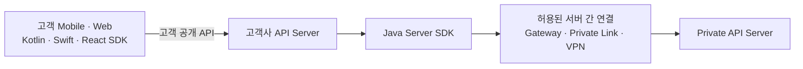
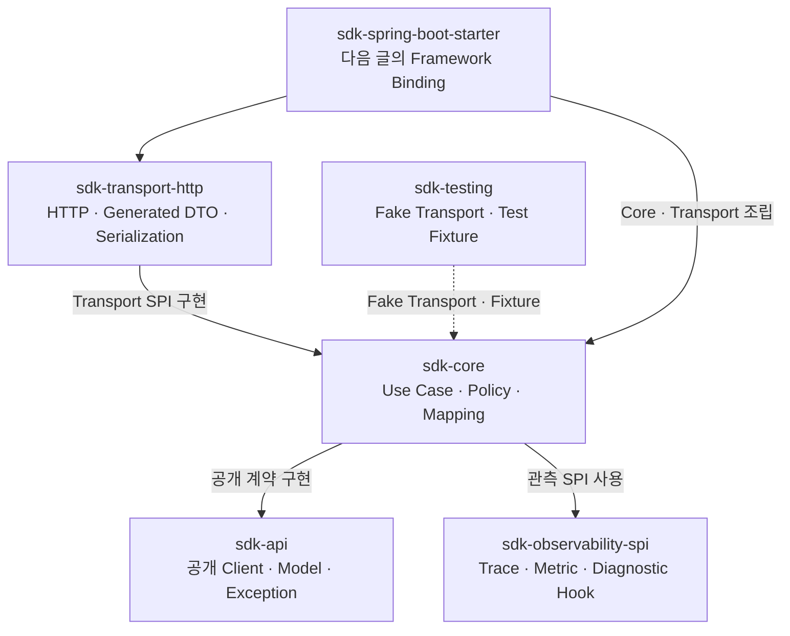
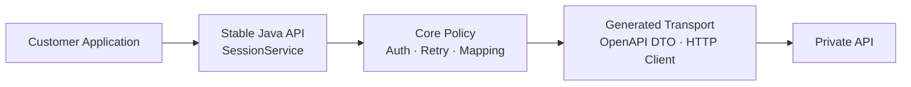
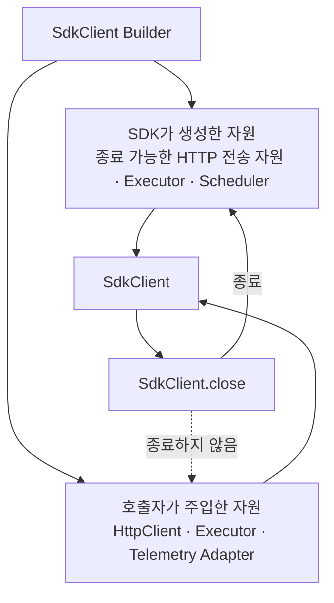
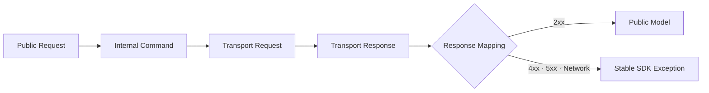
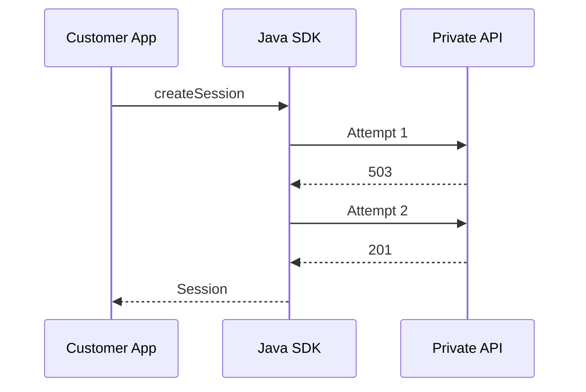

# Tistory 기술자료 초안

- 문서 ID: `BLOG-37`
- 상태: 공개 완료
- Tistory 상태: 공개
- 공개 URL: https://aiarchitect.tistory.com/41
- 분류: `엔터프라이즈 아키텍처`
- 권장 제목: `프라이빗 API를 연결하는 Java Server SDK 설계: 모듈·Client 수명·전송 계층`
- 검색 설명: `고객사 서버에서 프라이빗 API를 안전하게 사용하도록 Java Server SDK를 설계할 때 필요한 모듈 경계, 장수명 Client, 동기·비동기 API, 인증·재시도·오류·관측성 원칙을 정리합니다.`
- 권장 태그: `Java`, `Server SDK`, `API Client`, `Spring Boot`, `Private API`, `HttpClient`, `SDK 설계`, `엔터프라이즈 아키텍처`
- 권장 대표 이미지: `portfolio/architecture-diagrams/01-enterprise-ai-reference-architecture.svg`
- 도식 정책: `GitHub에는 Mermaid 원본을 유지하고, Tistory 게시 시 검증된 SVG 또는 PNG로 변환해 삽입`

---

# 프라이빗 API를 연결하는 Java Server SDK 설계: 모듈·Client 수명·전송 계층

앞선 글에서는 고객사가 Android·iOS 앱과 React 웹을 원하는 형태로 구현하면서도, 프라이빗 망의 API 서버를 직접 노출하지 않는 멀티플랫폼 SDK 구조를 살펴봤습니다.

이 구조에서 Java Server SDK는 단순한 HTTP 호출 편의 라이브러리가 아닙니다. 고객사 서버가 프라이빗 API를 사용할 때 필요한 인증, 테넌트 문맥, 오류 변환, 재시도, 멱등성, 타임아웃과 관측 정책을 한곳에서 적용하는 **신뢰 경계의 실행 구성요소**입니다.



구체적인 네트워크 기술은 배포 환경마다 달라질 수 있습니다. 중요한 원칙은 모바일 앱과 브라우저가 프라이빗 Endpoint나 서버 자격 증명을 직접 갖지 않고, 고객사 서버 안의 Java SDK가 통제된 경로를 통해 호출한다는 점입니다.

이 글은 이 역할을 수행하는 Java Server SDK의 공개 API, 모듈 구조, Client 수명, 동기·비동기 실행, 전송 계층과 테스트 경계를 공개 가능한 합성 예시로 정리합니다. 특정 고객사·회사·비공개 제품·내부 URL·실제 자격 증명은 포함하지 않습니다.

## 1. Server SDK는 HTTP Wrapper가 아니라 제품 경계다

HTTP Wrapper는 대개 다음 정도의 역할을 합니다.

```java
String body = http.post("/v1/sessions", json);
```

하지만 운영 환경의 Server SDK에는 훨씬 많은 결정이 들어갑니다.

- 어떤 자격 증명을 어느 요청에 적용할 것인가
- 고객·테넌트·사용자 문맥을 어떻게 전달할 것인가
- 어떤 요청을 자동 재시도할 수 있는가
- 생성 요청의 중복 부작용을 어떻게 막을 것인가
- HTTP 오류를 어떤 안정적인 Java 예외로 변환할 것인가
- 연결 풀과 실행 스레드는 누가 만들고 종료할 것인가
- 요청 제한시간과 전체 재시도 예산을 어떻게 계산할 것인가
- 고객 지원에 필요한 Request ID와 Trace를 어디까지 노출할 것인가

애플리케이션마다 이 결정을 다시 구현하면 같은 API를 사용해도 인증·재시도·오류 처리 방식이 달라집니다. SDK의 목적은 HTTP 문법을 숨기는 데 그치지 않고, **제품을 안전하게 사용하는 실행 규칙을 재사용 가능한 계약으로 고정하는 것**입니다.

## 2. 먼저 목표와 비목표를 고정한다

SDK가 모든 문제를 해결하려 하면 고객사 애플리케이션의 프레임워크와 업무 로직까지 침범하게 됩니다. 시작할 때 목표와 비목표를 함께 적는 편이 좋습니다.

| 목표 | 비목표 |
|---|---|
| 안정적인 Java 공개 API | 고객사의 Controller·UI 제공 |
| 프라이빗 API 전송 세부사항 캡슐화 | 고객사의 로그인 정책 결정 |
| 인증·오류·재시도·관측 정책 통일 | 네트워크 연결 자체를 자동 개통 |
| Thread-safe 장수명 Client | 호출마다 새 Client 생성 |
| 테스트 가능한 전송 추상화 | 내부 HTTP 라이브러리 타입 공개 |
| 버전 호환성 관리 | 서버 API와 SDK 버전을 하나로 강제 |

특히 Server SDK를 사용한다고 해서 프라이빗 망 연결이 자동으로 생기는 것은 아닙니다. 방화벽, DNS, 인증서, Private Link, VPN 또는 Gateway 같은 인프라 연결은 별도 배포 책임입니다. SDK는 **허용된 경로가 존재한다는 전제에서 애플리케이션 수준의 안전한 호출**을 담당합니다.

## 3. 모듈은 기능 수가 아니라 변경 이유로 나눈다

하나의 `sdk.jar`에 공개 모델, HTTP DTO, 인증, JSON Mapper, Retry 구현과 Spring 설정을 모두 넣으면 작은 변경도 전체 패키지에 영향을 줍니다. 권장하는 시작 구조는 다음과 같습니다.



화살표는 호출 흐름이 아니라 **컴파일·런타임 의존 방향**을 뜻합니다. `sdk-api`는 구현 모듈을 알지 않고, Core와 전송 구현을 조립하는 책임은 Starter 같은 최외곽 모듈에 둡니다.

### 3.1 `sdk-api`

고객 애플리케이션이 컴파일 시점에 직접 의존하는 표면입니다.

- `SdkClient`
- 업무 단위 Service Interface
- 요청·응답 공개 Model
- `RequestContext`
- 안정적인 예외 계층
- Builder와 설정 타입

이 모듈에는 특정 JSON 라이브러리의 Annotation, 생성된 OpenAPI DTO, JDK HTTP 구현 타입을 가능한 한 노출하지 않습니다.

### 3.2 `sdk-core`

제품 의미와 실행 정책을 구현합니다.

- 공개 요청을 내부 Command로 변환
- 인증과 테넌트 문맥 적용
- 타임아웃 예산 계산
- 재시도·멱등성 판단
- 전송 응답을 공개 Model과 예외로 변환
- 진단 이벤트 발행

### 3.3 `sdk-transport-http`

교체 가능성이 높은 전송 세부사항을 격리합니다.

- HTTP Request 생성
- Header·Body 직렬화
- OpenAPI 생성 DTO
- Status·Header·Body 수신
- 네트워크 예외 표준화

### 3.4 `sdk-observability-spi`

SDK가 특정 관측 Backend를 강제하지 않도록 작은 SPI를 둡니다. 고객 애플리케이션은 No-op, Micrometer, OpenTelemetry 등 자신의 운영 환경에 맞는 Adapter를 연결할 수 있습니다.

### 3.5 `sdk-testing`

SDK 사용자가 자신의 통합 코드를 실제 프라이빗 API 없이 테스트할 수 있도록 Fake Client, Fixture와 Contract Stub을 제공합니다. 테스트 도구를 운영 Runtime 의존성에 섞지 않는 것이 중요합니다.

## 4. 생성 코드를 공개 API로 바로 노출하지 않는다

OpenAPI는 언어 독립적인 HTTP API 인터페이스를 정의하고, 사람과 프로그램이 소스 코드나 네트워크 분석 없이 서비스 기능을 이해하도록 돕습니다. 따라서 전송 코드 생성과 계약 검증의 좋은 입력이 됩니다.

그러나 생성된 Client와 DTO를 그대로 SDK 공개 API로 노출하면 다음 문제가 생깁니다.

- 생성기 버전이 바뀌면 메서드와 타입 이름이 흔들릴 수 있음
- `nullable`, 날짜, Enum 표현이 생성기 정책에 종속됨
- 내부 Endpoint 구조가 고객 코드에 고정됨
- HTTP API 변경이 Java 공개 API 변경으로 바로 전파됨
- 생성 코드의 Annotation과 Runtime 의존성이 외부로 유출됨

권장 구조는 생성 코드를 내부 전송 계층에 두고 안정적인 공개 API로 감싸는 것입니다.



```java
public interface SessionService {
    Session create(
            CreateSessionRequest request,
            RequestContext context
    );
}
```

공개 `CreateSessionRequest`는 업무 의미가 안정적인 타입이고, 전송 계층의 `CreateSessionRequestDto`와는 Mapper로 분리합니다. 필드가 우연히 같더라도 두 타입의 변경 이유는 다릅니다.

## 5. Client는 요청마다 만들지 않고 장수명으로 재사용한다

JDK 21의 `java.net.http.HttpClient` 공식 문서는 한 번 생성된 Client가 불변이며 여러 요청에 사용할 수 있고, 자체 연결 풀을 관리해 연결을 재사용한다고 설명합니다. 요청마다 Client를 만들면 이러한 연결 재사용을 방해할 수 있습니다.

Server SDK도 같은 원칙을 공개 계약으로 명시합니다.

- `SdkClient`는 Thread-safe다.
- 설정은 생성 후 불변이다.
- 애플리케이션 또는 DI Container가 장수명으로 보관한다.
- 요청마다 생성하지 않는다.
- SDK가 소유한 자원은 `close()`에서 정리한다.

```java
SdkClient client = SdkClient.builder()
        .endpoint(URI.create("https://api.example.com"))
        .credentialProvider(credentialProvider)
        .connectTimeout(Duration.ofSeconds(3))
        .requestTimeout(Duration.ofSeconds(15))
        .build();

Session session = client.sessions().create(
        new CreateSessionRequest("user-example"),
        RequestContext.builder()
                .tenantId("tenant-example")
                .requestId(UUID.randomUUID().toString())
                .build()
);
```

여기서 `SdkClient`와 `SessionService`는 호출할 때마다 내부 상태를 바꾸지 않습니다. 요청별 값은 `RequestContext`와 요청 객체에 담습니다.

## 6. 자원 소유권을 생성 방식으로 구분한다

Client 수명에서 가장 자주 놓치는 부분은 “누가 만들었고 누가 닫는가”입니다.



권장 규칙은 단순합니다.

| 자원 | 생성자 | 종료 책임 |
|---|---|---|
| SDK가 생성한 종료 가능한 HTTP Client·Executor·Scheduler | SDK | SDK |
| 호출자가 주입한 HTTP Client·Executor·Telemetry | 호출자 | 호출자 |
| 요청별 InputStream | 계약에 명시 | 계약에 명시 |

```java
try (SdkClient client = SdkClient.builder()
        .endpoint(endpoint)
        .credentialProvider(credentials)
        .build()) {
    client.sessions().get("session-example", RequestContext.system());
}
```

짧은 CLI나 Batch에서는 `try-with-resources`가 자연스럽습니다. 반면 Spring Boot 같은 서버 애플리케이션에서는 Client를 Singleton Bean으로 만들고 Application Context 종료 시 한 번 닫습니다. 이 통합은 다음 글에서 다룹니다.

Java 버전에 따른 차이도 숨기지 않아야 합니다. Java 21의 JDK `HttpClient`는 `AutoCloseable`과 `close()`·`shutdown()`을 제공하지만, Java 17 API에는 명시적인 Client 종료 메서드가 없습니다. Java 17을 지원한다면 `SdkClient.close()`는 SDK가 실제로 소유한 종료 가능 자원, 예를 들어 Executor·Scheduler와 사용 중인 전송 구현의 자원만 닫아야 하며 런타임별 동작을 호환성 문서에 명시해야 합니다.

`close()`의 의미도 문서화해야 합니다.

- 신규 요청을 거부하는가
- 진행 중 요청을 기다리는가, 취소하는가
- 최대 종료 대기시간은 얼마인가
- 여러 번 호출해도 안전한가
- 종료 후 Service 객체를 호출하면 어떤 예외가 발생하는가

## 7. 동기 API와 비동기 API의 의미를 먼저 정의한다

JDK `HttpClient`는 Blocking `send`와 `CompletableFuture`를 반환하는 `sendAsync`를 모두 제공합니다. SDK도 두 방식을 제공할 수 있지만, 단순히 반환 타입만 바꾸면 부족합니다.

### 7.1 동기 API

```java
Session session = client.sessions()
        .create(request, context);
```

다음 내용을 문서화합니다.

- 호출 Thread를 Blocking하는가
- Interrupt를 어떻게 처리하는가
- 시간 초과 시 어떤 예외를 던지는가
- 응답 Body를 반환 전에 모두 소비하는가
- 재시도까지 포함한 최대 Blocking 시간은 얼마인가

### 7.2 비동기 API

```java
CompletableFuture<Session> future = client.sessionsAsync()
        .create(request, context);

future.whenComplete((session, error) -> {
    if (error != null) {
        handleFailure(error);
        return;
    }
    handleSuccess(session);
});
```

비동기 계약에는 다음이 추가됩니다.

- Completion Callback이 실행되는 Executor
- `CompletableFuture.cancel()`이 전송 취소로 이어지는지 여부
- SDK 종료 시 미완료 Future의 처리
- 재시도 중 취소가 들어오면 다음 시도를 중단하는지 여부
- 전송 예외가 `CompletionException` 안에서 어떻게 노출되는지

취소를 공개 계약으로 제공하려면 위 예시처럼 `CompletableFuture`를 반환하거나 별도의 `SdkCall`·`CancellationHandle`을 제공해야 합니다. `CompletionStage`만 노출하면 호출자가 `cancel()`을 호출할 수 없으므로 취소 가능 여부를 API와 문서가 일치하도록 설계합니다.

동기 메서드를 `ForkJoinPool.commonPool()`에 넣어 비동기처럼 보이게 만드는 방식은 피합니다. Blocking I/O가 공용 Pool을 점유하고, 호출자가 실행 자원을 통제하기 어렵기 때문입니다. 실제 비동기 전송을 사용하거나 전용 Executor의 소유권을 명확히 해야 합니다.

## 8. 전송 계층은 성공·실패의 원재료만 반환한다

전송 계층이 업무 예외까지 결정하면 HTTP 구현을 교체하기 어려워집니다. Transport는 다음과 같은 중립적인 결과를 반환할 수 있습니다.

```java
interface Transport {
    CompletionStage<TransportResponse> execute(
            TransportRequest request,
            CancellationToken cancellation
    );
}

record TransportResponse(
        int statusCode,
        Map<String, List<String>> headers,
        byte[] body
) {}
```

이 예시는 크기가 제한된 작은 JSON 응답을 전제로 합니다. 대용량 응답·파일·Streaming API에는 최대 크기, 소비·취소 방법과 종료 책임을 포함한 별도의 Streaming Body 추상화를 사용하고, 제한 없는 응답을 `byte[]`에 모두 적재하지 않습니다.

Core가 `TransportResponse`를 해석해 다음 단계로 변환합니다.



전송 라이브러리의 예외를 그대로 외부로 던지지 않습니다. 내부 구현을 JDK HttpClient에서 다른 구현으로 교체해도 고객 애플리케이션의 `catch` 문이 깨지지 않아야 합니다.

## 9. 인증 자격 증명과 요청 문맥을 분리한다

서비스 자격 증명과 업무 요청 문맥은 수명이 다릅니다.

```java
public interface CredentialProvider {
    CompletionStage<AccessCredential> resolveAsync(
            CredentialContext context
    );
    void invalidate(AccessCredential credential);
}
```

```java
public record RequestContext(
        String tenantId,
        String userId,
        String requestId,
        String traceParent
) {}
```

`CredentialProvider`는 장수명 Client 설정에 속하고, `RequestContext`는 요청마다 달라집니다. 비동기 호출 경로는 `resolveAsync()`를 조합해 자격 증명 갱신 중에도 호출 Thread를 숨겨서 Blocking하지 않습니다. 동기 Facade는 작업 전체 Deadline 안에서 같은 비동기 결과를 기다리며, 동시 Token Refresh는 Single Flight로 합칩니다.

| 구분 | 예 | 로그 원칙 |
|---|---|---|
| 서비스 자격 증명 | Access Token, mTLS Identity | 원문 금지 |
| 고객·테넌트 문맥 | Tenant ID | 정책에 따라 가명화 |
| 최종 사용자 문맥 | User ID | 최소 수집·Masking |
| 상관관계 정보 | Request ID, Trace Context | 진단용 허용 |

Mobile·Front SDK가 서버용 Secret을 갖지 않도록 하는 것만큼, Java SDK가 Secret을 설정 파일 예제나 예외 메시지에 흘리지 않는 것도 중요합니다.

## 10. Timeout은 하나의 숫자가 아니라 예산이다

운영 Client에는 최소 세 종류의 시간이 있습니다.

```text
Connect Timeout       연결 수립 제한
Attempt Timeout       한 번의 전송 제한
Operation Deadline    재시도를 포함한 전체 업무 제한
```

예를 들어 전체 Deadline이 10초인데 각 시도 Timeout이 8초이고 최대 3회 재시도라면 설정은 서로 모순입니다. Retry는 남은 전체 예산 안에서만 실행되어야 합니다.

```java
Duration remaining = deadline.remaining();
if (remaining.compareTo(minimumAttemptBudget) < 0) {
    throw new SdkTimeoutException(
            "Operation deadline exhausted",
            "OPERATION_DEADLINE_EXCEEDED"
    );
}
```

권장 우선순위는 다음과 같습니다.

1. 호출자가 요청별 Deadline을 지정
2. 없으면 Client의 기본 Operation Timeout 사용
3. 각 Attempt는 남은 예산보다 길 수 없음
4. Backoff도 전체 예산에서 차감
5. Deadline이 끝나면 추가 재시도 금지

## 11. Retry는 HTTP Method가 아니라 작업 의미로 결정한다

RFC 9110은 같은 요청을 여러 번 보내도 의도된 서버 효과가 한 번과 같은 메서드를 멱등하다고 정의합니다. 또한 비멱등 메서드는 실제 의미가 멱등하다고 알 수 있거나 원 요청이 적용되지 않았음을 감지할 수 있을 때가 아니면 자동 재시도하지 말 것을 권고합니다.

따라서 SDK는 `GET이면 재시도, POST면 금지` 같은 단순 규칙보다 작업 Metadata를 사용해야 합니다.

```java
record OperationPolicy(
        boolean idempotent,
        boolean idempotencyKeyRequired,
        int maxAttempts,
        Set<Integer> retryableStatuses
) {}
```

```text
getSession:
  idempotent = true
  maxAttempts = 3

createSession:
  idempotent = true only with Idempotency-Key
  maxAttempts = 3

approveAction:
  idempotent = false
  maxAttempts = 1
```

재시도 소유자도 하나로 정합니다. 고객 Gateway, Java SDK와 Private API가 모두 같은 요청을 자동 재시도하면 호출이 곱셈으로 늘어날 수 있습니다.

## 12. 오류는 안정적인 Java 예외 계층으로 변환한다

RFC 9457 Problem Details는 HTTP 오류 응답에 기계 판독 가능한 정보를 담기 위한 형식을 정의합니다. SDK는 `type`, `status`, `title`, `detail`, `instance`와 확장 `code`를 읽어 안정적인 예외로 변환할 수 있습니다.

```java
public abstract class SdkException extends RuntimeException {
    private final String code;
    private final boolean retryable;
    private final String requestId;

    protected SdkException(
            String message,
            String code,
            boolean retryable,
            String requestId,
            Throwable cause
    ) {
        super(message, cause);
        this.code = code;
        this.retryable = retryable;
        this.requestId = requestId;
    }

    public String code() {
        return code;
    }

    public boolean retryable() {
        return retryable;
    }

    public String requestId() {
        return requestId;
    }
}
```

| 오류 | 예외 | 자동 재시도 |
|---|---|---|
| 설정 오류 | `SdkConfigurationException` | 금지 |
| 인증 실패 | `SdkAuthenticationException` | 갱신 정책에 따라 |
| 권한 부족 | `SdkAuthorizationException` | 금지 |
| 입력 검증 | `SdkValidationException` | 금지 |
| 상태 충돌 | `SdkConflictException` | 업무 정책에 따라 |
| Rate Limit | `SdkRateLimitException` | `Retry-After`에 따라 |
| 네트워크 | `SdkNetworkException` | 멱등 작업만 |
| 서버 일시 오류 | `SdkServerException` | 제한적 허용 |
| 응답 계약 위반 | `SdkProtocolException` | 금지·즉시 관측 |
| 호출자 취소 | `SdkCancelledException` | 금지 |

사람용 `detail` 문구를 분기 조건으로 사용하지 않고 안정적인 `code`와 타입을 사용합니다.

## 13. 관측성은 논리 호출과 실제 전송 시도를 구분한다

재시도가 있는 Client에서는 사용자가 호출한 업무 작업 한 번과 실제 HTTP 전송 여러 번을 구분해야 합니다.



OpenTelemetry HTTP Semantic Conventions는 HTTP Client Span을 `CLIENT` 종류로 기록하고, 재전송 시 `http.request.resend_count`를 사용하는 방식을 설명합니다. 최초 전송에는 이 속성을 넣지 않고, 첫 번째 재전송부터 `1`, `2`처럼 재전송 횟수를 기록합니다.

SDK의 진단 정보는 다음처럼 나눌 수 있습니다.

- 논리 작업: `sdk.operation`, 최종 결과, 전체 지연시간
- 전송 시도: HTTP Method, Route Template, Status, Attempt
- 상관관계: Request ID, Trace ID
- 정책 결과: Retry 여부, Backoff, Deadline 잔여시간
- 오류: 안정적인 SDK Error Code

고카디널리티 원문 URI, Token, 전체 Request·Response Body와 개인정보 Payload는 기본 관측 정보에 넣지 않습니다.

## 14. 테스트는 실제 HTTP가 없어도 대부분 가능해야 한다

전송 계층을 분리하면 Core 정책을 Fake Transport로 검증할 수 있습니다.

```java
FakeTransport transport = FakeTransport.sequence(
        response(503, problem("TEMPORARY_UNAVAILABLE")),
        response(201, sessionJson("session-example"))
);

SdkClient client = TestSdkClient.builder()
        .transport(transport)
        .retryPolicy(fixedAttempts(2))
        .build();

Session result = client.sessions().create(request, context);

assertThat(result.id()).isEqualTo("session-example");
assertThat(transport.requestCount()).isEqualTo(2);
```

테스트 층은 다음처럼 구성합니다.

| 층 | 검증 대상 |
|---|---|
| Unit | Mapper, Timeout Budget, Retry 판단, 오류 변환 |
| Transport | Header·직렬화·Status·Body 수신 |
| Contract | OpenAPI 요청·응답과 생성 코드 일치 |
| Conformance | 다른 플랫폼 SDK와 같은 상태·오류 의미 |
| Integration | 실제 HTTP Stub과 연결 풀·취소·Deadline |
| Compatibility | 지원 서버 버전별 핵심 시나리오 |

필수 Negative Test도 포함합니다.

- Secret이 로그에 남지 않는가
- Tenant 문맥이 누락되면 전송 전에 실패하는가
- 비멱등 요청이 재시도되지 않는가
- Deadline 종료 후 추가 Attempt가 없는가
- 미지의 Enum과 추가 응답 필드를 안전하게 처리하는가
- `close()` 후 신규 요청이 거부되는가
- 호출자가 제공한 Executor를 SDK가 종료하지 않는가

## 15. Thread Safety는 선언이 아니라 상태 배치로 만든다

Thread-safe Client를 만들려면 요청마다 바뀌는 값을 공유 필드에 저장하지 않아야 합니다.

```java
// 잘못된 예: 동시 요청 사이에서 tenantId가 덮어써질 수 있다.
client.setTenantId("tenant-a");
client.sessions().get("session-1");
```

```java
// 권장 예: 요청 문맥을 불변 객체로 전달한다.
client.sessions().get(
        "session-1",
        RequestContext.forTenant("tenant-a")
);
```

공유할 수 있는 상태:

- 불변 설정
- Thread-safe 연결 풀
- Thread-safe Credential Cache
- 원자적으로 갱신되는 인증 상태
- 불변 Mapper와 Codec

요청 지역에 둘 상태:

- Tenant·User·Request ID
- Deadline과 Cancellation
- Retry Attempt
- 응답 Buffer
- 진단 Context

Token Refresh처럼 공유가 필요한 가변 상태는 여러 요청이 동시에 갱신하지 않도록 Single Flight 또는 명시적인 동시성 제어를 적용합니다.

## 16. 공개 API에는 호환성 예산이 필요하다

Server API와 Java SDK Package의 버전은 분리합니다.

```text
Private API Contract Version : 2026-07
Java SDK Version             : 2.4.0
Minimum Java Runtime         : 17
Tested Runtime               : 17, 21
```

공개 API에 다음 타입을 노출하면 교체 비용이 커집니다.

- 특정 HTTP Client의 Request·Response
- 특정 JSON 라이브러리의 Tree·Annotation
- 특정 Retry 라이브러리의 Context
- 특정 Telemetry SDK의 Span
- 생성기 전용 DTO

필요하면 SDK 자체의 작은 Interface와 Value Object를 공개하고, Adapter를 별도 모듈로 제공합니다.

## 17. 패키징과 의존성 정책도 제품 계약이다

Java SDK 소비자는 Maven 또는 Gradle로 패키지를 가져옵니다. 이때 의존성 충돌은 기능 오류만큼 큰 도입 장벽이 됩니다.

권장 원칙은 다음과 같습니다.

- 공개 API 모듈의 의존성을 최소화
- 구현 의존성은 외부 공개를 줄임
- 동일 라이브러리의 여러 버전을 임의로 강제하지 않음
- BOM 또는 Version Catalog용 정보를 제공
- Java 최소 버전과 테스트 버전을 명시
- 서명, Checksum과 변경 이력을 함께 배포
- CVE 대응 범위와 지원 종료 정책을 공개

SDK 사용자가 내부 전송 라이브러리를 직접 참조해야 정상 동작하는 구조라면 모듈 경계가 새고 있다는 신호입니다.

## 18. 구현 체크리스트

### 공개 API

- [ ] 공개 Model과 전송 DTO가 분리되어 있다.
- [ ] 특정 HTTP·JSON 구현 타입이 공개 API에 노출되지 않는다.
- [ ] `SdkClient`의 Thread Safety가 문서화되어 있다.
- [ ] 동기·비동기·취소 의미가 정의되어 있다.
- [ ] 오류는 안정적인 코드와 예외 계층으로 제공된다.

### 수명과 자원

- [ ] Client를 요청마다 생성하지 않는다.
- [ ] SDK 소유 자원과 호출자 소유 자원이 구분된다.
- [ ] `close()`의 진행 중 요청 처리 정책이 있다.
- [ ] 호출자가 주입한 Executor를 SDK가 임의로 종료하지 않는다.
- [ ] 응답 Body와 Stream의 종료 책임이 명확하다.

### 보안과 정책

- [ ] Mobile·Browser에 서버 Secret이 전달되지 않는다.
- [ ] Credential과 요청별 Tenant 문맥이 분리되어 있다.
- [ ] Secret·Token·원문 Payload가 기본 로그에서 제외된다.
- [ ] 비멱등 요청은 자동 재시도되지 않는다.
- [ ] 멱등 키와 Deadline이 전체 재시도에 유지된다.

### 품질과 운영

- [ ] Fake Transport로 Core 정책을 테스트할 수 있다.
- [ ] OpenAPI 계약 테스트와 파괴적 변경 검사가 있다.
- [ ] 논리 호출과 실제 전송 Attempt를 구분해 관측한다.
- [ ] 지원 Java·API·SDK 버전 표가 있다.
- [ ] Migration Guide와 Changelog가 패키지와 함께 배포된다.

## 19. 마무리: 좋은 Server SDK는 연결 세부사항보다 책임을 캡슐화한다

프라이빗 API를 연결하는 Java SDK의 가치는 HTTP 요청 코드를 줄이는 데만 있지 않습니다.

1. 고객사 서버와 프라이빗 API 사이의 신뢰 경계를 명확히 합니다.
2. 인증·테넌트·오류·재시도·관측 정책을 일관되게 적용합니다.
3. 장수명 Thread-safe Client와 명시적인 자원 소유권으로 운영 안정성을 높입니다.
4. 생성 코드와 전송 구현을 공개 API에서 격리해 호환성 비용을 줄입니다.
5. Fake Transport와 공통 계약 테스트로 실제 망에 접속하지 않고도 대부분의 통합을 검증하게 합니다.

결국 좋은 Server SDK는 네트워크 세부사항을 숨기는 Wrapper가 아니라, **고객사가 프라이빗 서비스를 안전하고 예측 가능하게 사용할 수 있도록 제품 책임을 캡슐화한 실행 계약**입니다.

다음 글인 [고객사 서버에 SDK를 연결하는 Spring Boot Starter](https://aiarchitect.tistory.com/38)에서는 이 Java Core SDK를 고객사 Spring Boot 애플리케이션에 연결합니다. `@ConfigurationProperties`, 조건부 Auto-configuration, 사용자 Bean 우선권, Secret 주입과 Context 종료 시 Client 정리를 구체적으로 살펴봅니다.

## 20. 상호 참조 및 공식 참고 자료

### 시리즈 상호 참조

- [프라이빗 API를 보호하는 멀티플랫폼 SDK 아키텍처](https://aiarchitect.tistory.com/40)
- [고객사 서버에 SDK를 연결하는 Spring Boot Starter](https://aiarchitect.tistory.com/38)
- [Java Security Gateway와 Python AI Orchestrator의 책임 분리](https://aiarchitect.tistory.com/5)
- [운영 가능한 AI Agent: Checkpoint·Retry·Idempotency·Outbox](https://aiarchitect.tistory.com/7)

### 공식 참고 자료

- [Java SE 21: java.net.http.HttpClient](https://docs.oracle.com/en/java/javase/21/docs/api/java.net.http/java/net/http/HttpClient.html)
- [OpenAPI Specification](https://spec.openapis.org/oas/latest.html)
- [RFC 9110: HTTP Semantics — Idempotent Methods](https://www.rfc-editor.org/rfc/rfc9110.html#name-idempotent-methods)
- [RFC 9457: Problem Details for HTTP APIs](https://www.rfc-editor.org/rfc/rfc9457.html)
- [OpenTelemetry: Semantic Conventions for HTTP Spans](https://opentelemetry.io/docs/specs/semconv/http/http-spans/)

> 이 글은 2026년 7월 31일 기준 공개된 공식 사양과 문서를 바탕으로 작성했습니다. Java, OpenAPI와 OpenTelemetry 사양은 변경될 수 있으므로 실제 구현 시 사용하는 버전의 공식 문서를 다시 확인해야 합니다.
