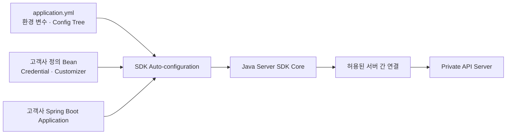
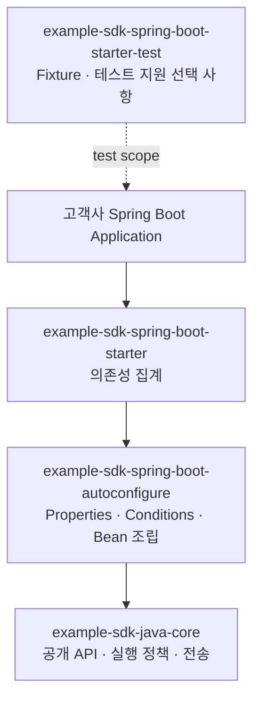
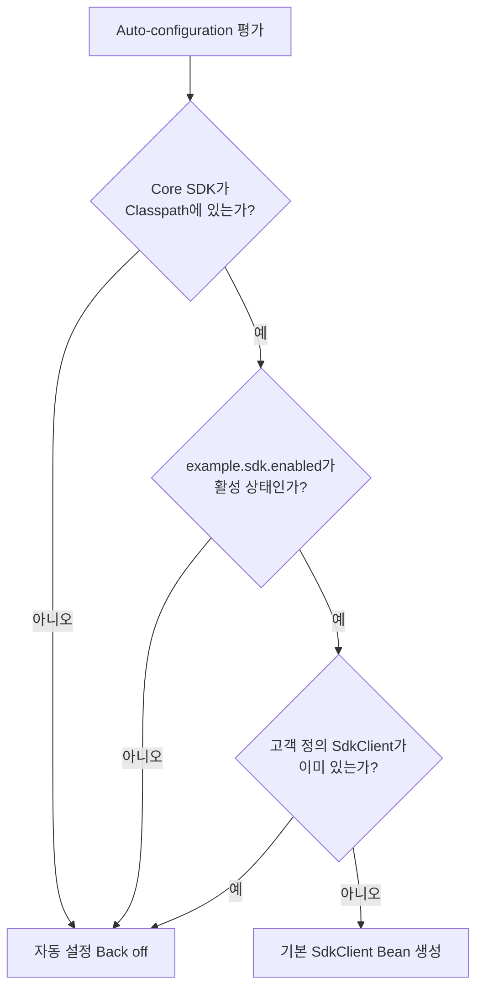
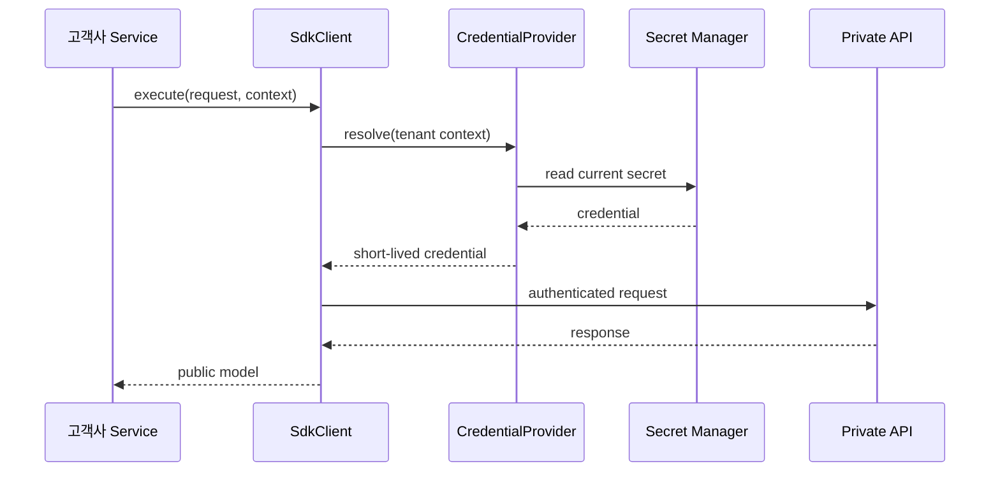
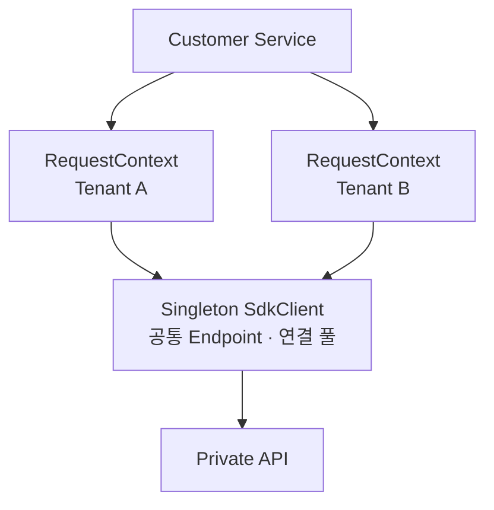
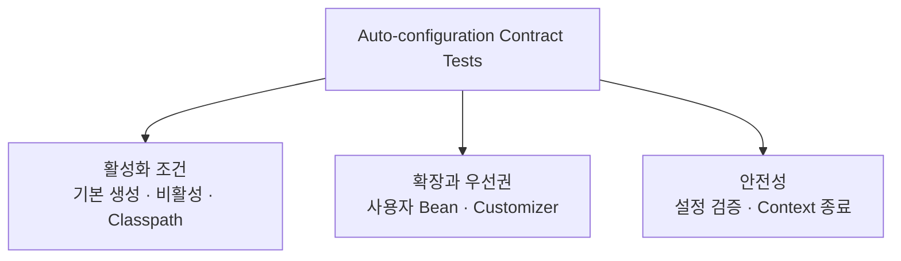

# Tistory 기술자료 초안

- 문서 ID: `BLOG-38`
- 상태: 공개 완료
- Tistory 상태: 공개
- 공개 URL: `https://aiarchitect.tistory.com/38`
- 분류: `개발 도구 · 자동화`
- 권장 제목: `고객사 서버에 SDK를 연결하는 Spring Boot Starter: Auto-configuration과 테스트`
- 검색 설명: `프라이빗 API용 Java Server SDK를 고객사 Spring Boot 애플리케이션에 안전하게 연결하는 Starter 설계를 Auto-configuration, 타입 안전 설정, 사용자 Bean 우선권, Secret 주입, 수명 관리와 테스트 관점에서 정리합니다.`
- 권장 태그: `Spring Boot`, `Spring Boot Starter`, `Auto-configuration`, `Java SDK`, `ConfigurationProperties`, `ApplicationContextRunner`, `Private API`, `SDK 설계`
- 권장 대표 이미지: `portfolio/architecture-diagrams/01-enterprise-ai-reference-architecture.svg`
- 도식 정책: `GitHub에는 Mermaid 원본을 유지하고, Tistory 게시 시 검증된 SVG 또는 PNG로 변환해 삽입`

---

# 고객사 서버에 SDK를 연결하는 Spring Boot Starter: Auto-configuration과 테스트

앞선 글에서는 고객사 서버가 프라이빗 API를 안전하게 호출하도록 Java Server SDK의 공개 API, 전송 계층, 인증, 오류, 재시도와 Client 수명을 설계했습니다.

그 SDK를 Spring Boot 프로젝트에 적용할 때 고객사마다 같은 연결 코드를 반복하게 두면 새로운 문제가 생깁니다. 설정 이름과 기본값이 제각각이 되고, Client 종료를 빠뜨리거나, 애플리케이션의 Bean과 SDK가 만든 Bean이 충돌할 수 있습니다. 운영 환경에서는 Secret 주입과 관측성 연결 방식도 달라집니다.

Spring Boot Starter는 이 반복을 줄이는 **Framework Binding 계층**입니다. Java Core SDK를 다시 구현하는 계층이 아니라, 이미 검증된 Core를 Spring Boot의 설정·Bean·수명 주기에 맞게 조립하는 얇은 Adapter여야 합니다.



이 글은 이 역할을 수행하는 Starter의 모듈, 자동 설정 조건, 설정 속성, Secret 경계, 확장 지점, 종료 수명과 테스트 방법을 공개 가능한 합성 예시로 정리합니다. 예시의 Package, Endpoint와 속성 이름은 설명용이며 실제 고객사·제품·자격 증명을 포함하지 않습니다.

## 1. Starter의 책임은 Core SDK를 Spring에 연결하는 것이다

Starter가 담당할 일은 명확합니다.

- 외부 설정을 타입 안전한 Java 객체로 변환
- 조건이 맞을 때 Core SDK Client를 Bean으로 생성
- 고객사가 정의한 Bean이 있으면 기본 구성을 양보
- Spring Context 종료 시 SDK 소유 자원을 정리
- 선택적인 관측성 Adapter와 Customizer 연결
- IDE 자동 완성을 위한 설정 메타데이터 제공
- 작은 Application Context에서 자동 설정 계약 검증

반대로 다음 책임은 Starter에 넣지 않습니다.

- HTTP 요청·응답 구현
- 인증 Header 생성 규칙
- 재시도 가능성 판단
- API 오류를 공개 예외로 변환
- 업무 요청·응답 Model
- 고객사 Controller와 업무 서비스

이 기능은 Java Core SDK에 있어야 Spring을 쓰지 않는 Java 애플리케이션에서도 동일하게 동작합니다. Starter에 제품 로직을 넣으면 같은 SDK가 Framework마다 다른 의미로 작동하게 됩니다.

## 2. 세 Artifact로 나누면 변경 경계가 선명해진다

작은 프로젝트는 하나의 Artifact로 시작할 수 있지만, 배포와 호환성까지 고려하면 다음과 같이 역할을 나누는 편이 안전합니다.



### 2.1 Java Core

`example-sdk-java-core`는 Spring에 의존하지 않습니다. `SdkClient`, `CredentialProvider`, 요청·응답 Model, 예외, Builder와 전송 정책을 제공합니다.

### 2.2 Auto-configuration

`example-sdk-spring-boot-autoconfigure`는 Spring Boot와 Core SDK를 연결합니다.

- `@ConfigurationProperties`
- `@AutoConfiguration`
- 조건 Annotation
- Client Bean Factory
- 선택적인 관측성 Adapter
- 설정 메타데이터 생성

### 2.3 Starter

`example-sdk-spring-boot-starter`는 고객이 추가할 진입점입니다. 일반적으로 코드가 거의 없는 의존성 집계 Artifact입니다. Core와 Auto-configuration의 호환되는 조합을 제공하므로, 고객이 개별 버전을 잘못 조합할 가능성을 줄입니다.

Spring Boot 공식 문서는 자체 Starter 이름이 공식 Starter처럼 보이지 않도록 `spring-boot`로 시작하지 말고, 고유한 Namespace를 사용하도록 권장합니다. 예를 들어 `example-sdk-spring-boot-starter`와 `example.sdk`처럼 제품 소유권을 알 수 있는 이름을 선택합니다.

## 3. 자동 설정은 Imports 파일로 발견시킨다

현재 Spring Boot의 사용자 정의 Auto-configuration은 `@AutoConfiguration`을 붙인 뒤 다음 파일에 클래스 이름을 한 줄씩 등록합니다.

```text
META-INF/spring/
└── org.springframework.boot.autoconfigure.AutoConfiguration.imports
```

```text
com.example.sdk.spring.ExampleSdkAutoConfiguration
```

자동 설정 클래스는 Component Scan으로 우연히 발견되게 만들지 않습니다.

```java
package com.example.sdk.spring;

import org.springframework.boot.autoconfigure.AutoConfiguration;
import org.springframework.boot.context.properties.EnableConfigurationProperties;

@AutoConfiguration
@EnableConfigurationProperties(ExampleSdkProperties.class)
public class ExampleSdkAutoConfiguration {
}
```

Auto-configuration 전용 Package를 두고, 필요한 구성만 구체적인 `@Import`로 연결합니다. 이렇게 하면 고객사 애플리케이션의 Scan 범위나 Package 구조에 따라 SDK 동작이 달라지지 않습니다.

## 4. 조건은 “사용 가능하고, 활성화됐고, 고객 정의가 없을 때”로 읽혀야 한다

자동 설정은 무조건 Bean을 등록하는 기능이 아닙니다. Classpath, 설정, 기존 Bean을 확인한 뒤 안전하게 물러날 수 있어야 합니다.

```java
@AutoConfiguration
@EnableConfigurationProperties(ExampleSdkProperties.class)
@ConditionalOnClass(SdkClient.class)
@ConditionalOnProperty(
        prefix = "example.sdk",
        name = "enabled",
        havingValue = "true",
        matchIfMissing = true
)
public class ExampleSdkAutoConfiguration {

    @Bean(destroyMethod = "close")
    @ConditionalOnMissingBean
    SdkClient exampleSdkClient(
            ExampleSdkProperties properties,
            CredentialProvider credentialProvider,
            ObjectProvider<SdkClientBuilderCustomizer> customizers
    ) {
        SdkClient.Builder builder = SdkClient.builder()
                .endpoint(properties.getEndpoint())
                .credentialProvider(credentialProvider)
                .connectTimeout(properties.getConnectTimeout())
                .requestTimeout(properties.getRequestTimeout());

        customizers.orderedStream()
                .forEach(customizer -> customizer.customize(builder));

        return builder.build();
    }
}
```

각 조건에는 분명한 목적이 있습니다.

| 조건 | 의미 |
|---|---|
| `@ConditionalOnClass` | Core SDK가 Classpath에 있을 때만 활성화 |
| `@ConditionalOnProperty` | 사용자가 명시적으로 끌 수 있는 스위치 제공 |
| `@ConditionalOnMissingBean` | 고객사가 직접 구성한 Client가 있으면 기본 Bean을 만들지 않음 |

`@ConditionalOnMissingBean`은 단순 충돌 방지 기능이 아닙니다. 고객이 특수한 Proxy, 인증, 네트워크 또는 테스트 구성을 사용할 수 있도록 **기본값은 편리하게 제공하되 최종 통제권은 고객에게 남기는 계약**입니다.

## 5. 사용자 Bean 우선권은 자동 설정의 핵심 계약이다

고객이 `SdkClient`를 직접 정의했을 때 Starter가 두 번째 Client를 만들면 연결 풀, 인증, Metric과 종료 책임이 중복됩니다. Bean 이름만 다르게 만들어 충돌을 숨기는 것은 해결책이 아닙니다.



고객은 필요하면 다음처럼 완전히 직접 구성할 수 있습니다.

```java
@Configuration
class CustomerSdkConfiguration {

    @Bean
    SdkClient sdkClient(CredentialProvider credentials) {
        return SdkClient.builder()
                .endpoint(URI.create("https://private-api.example"))
                .credentialProvider(credentials)
                .requestTimeout(Duration.ofSeconds(20))
                .build();
    }
}
```

Starter는 이 Bean을 발견하면 기본 Client 생성을 중단해야 합니다. 이 동작은 문서로만 약속하지 말고 자동화 테스트로 고정합니다.

## 6. 설정은 `@ConfigurationProperties`로 하나의 계약을 만든다

개별 `@Value`를 여러 Configuration 클래스에 흩어 놓으면 어떤 설정이 필수인지 파악하기 어렵고, 검증과 IDE 지원도 약해집니다. 구조화된 SDK 설정은 전용 `@ConfigurationProperties`에 모읍니다.

```java
package com.example.sdk.spring;

import jakarta.validation.Valid;
import jakarta.validation.constraints.NotNull;
import jakarta.validation.constraints.Positive;
import java.net.URI;
import java.time.Duration;
import org.springframework.boot.context.properties.ConfigurationProperties;
import org.springframework.validation.annotation.Validated;

@Validated
@ConfigurationProperties("example.sdk")
public class ExampleSdkProperties {

    private boolean enabled = true;

    @NotNull
    private URI endpoint;

    @NotNull
    private Duration connectTimeout = Duration.ofSeconds(3);

    @NotNull
    private Duration requestTimeout = Duration.ofSeconds(15);

    @Valid
    private final Retry retry = new Retry();

    public boolean isEnabled() {
        return enabled;
    }

    public void setEnabled(boolean enabled) {
        this.enabled = enabled;
    }

    public URI getEndpoint() {
        return endpoint;
    }

    public void setEndpoint(URI endpoint) {
        this.endpoint = endpoint;
    }

    public Duration getConnectTimeout() {
        return connectTimeout;
    }

    public void setConnectTimeout(Duration connectTimeout) {
        this.connectTimeout = connectTimeout;
    }

    public Duration getRequestTimeout() {
        return requestTimeout;
    }

    public void setRequestTimeout(Duration requestTimeout) {
        this.requestTimeout = requestTimeout;
    }

    public Retry getRetry() {
        return retry;
    }

    public static class Retry {

        @Positive
        private int maxAttempts = 3;

        public int getMaxAttempts() {
            return maxAttempts;
        }

        public void setMaxAttempts(int maxAttempts) {
            this.maxAttempts = maxAttempts;
        }
    }
}
```

`URI`, `Duration`와 숫자 타입을 그대로 사용하면 문자열 파싱 코드를 반복하지 않아도 됩니다. 검증 오류도 애플리케이션 시작 시점에 명확하게 드러납니다.

다음은 고객사 설정 예시입니다.

```yaml
example:
  sdk:
    enabled: true
    endpoint: ${PRIVATE_API_ENDPOINT}
    connect-timeout: 3s
    request-timeout: 15s
    retry:
      max-attempts: 3
```

속성 문서에서는 `example.sdk.request-timeout`처럼 소문자 Kebab Case를 기준 이름으로 사용합니다. 환경 변수에서는 Spring Boot의 Relaxed Binding에 따라 `EXAMPLE_SDK_REQUESTTIMEOUT` 같은 운영 환경 규칙을 적용할 수 있지만, 실제 배포 플랫폼의 변환 규칙을 함께 검증해야 합니다.

## 7. 설정 메타데이터도 공개 API처럼 관리한다

설정 키는 Java 메서드와 마찬가지로 고객 코드와 운영 설정에 남습니다. 이름을 바꾸거나 기본값의 의미를 바꾸면 배포에 영향을 줍니다.

`spring-boot-configuration-processor`를 빌드에 연결하면 `@ConfigurationProperties`에서 `META-INF/spring-configuration-metadata.json`을 생성할 수 있습니다. IDE는 이 메타데이터를 이용해 자동 완성, 타입과 설명을 보여줍니다.

각 속성에는 다음 정보를 제공합니다.

- 무엇을 제어하는지
- 기본값과 단위
- 필수 여부
- 허용 범위
- 보안상 주의할 점
- Deprecated 여부와 대체 속성

```java
/**
 * Maximum time allowed for a single API request.
 * This value does not include customer-side queueing time.
 */
public Duration getRequestTimeout() {
    return requestTimeout;
}
```

설정 키를 제거해야 한다면 즉시 삭제하기보다 이전 키를 일정 기간 지원하고 경고와 이전 방법을 제공합니다. 속성 Namespace는 다른 라이브러리와 충돌하지 않도록 고유해야 합니다.

## 8. Secret은 일반 설정과 수명 주기가 다르다

Endpoint와 Timeout은 일반 설정이지만 API Key, Client Secret과 접근 Token은 그렇지 않습니다. Secret을 `application.yml` 예시에 직접 넣거나 `ExampleSdkProperties`의 평범한 문자열로 노출하면 다음 위험이 생깁니다.

- Git 저장소에 실수로 커밋
- `/actuator/env` 또는 진단 출력에서 노출
- `toString()`과 로그에 포함
- 회전된 값을 반영하려면 애플리케이션 재시작
- 여러 Tenant의 자격 증명을 한 Singleton 설정에 고정

권장 경계는 Core SDK의 `CredentialProvider`를 Bean으로 주입하는 것입니다.

```java
public interface CredentialProvider {
    AccessCredential resolve(CredentialRequest request);
}
```

```java
@Configuration
class CredentialConfiguration {

    @Bean
    CredentialProvider credentialProvider(SecretStore secretStore) {
        return request -> secretStore.resolveFor(request.tenantId());
    }
}
```



배포 환경이 파일 기반 Secret을 제공한다면 Spring Boot의 `configtree:` Import로 외부 파일을 설정 트리에 연결할 수도 있습니다. 그러나 어떤 방식을 택하든 Starter는 Secret 값을 로그, 오류 메시지, Metric Tag에 넣지 않아야 합니다.

개발 편의를 위한 정적 Credential 구현이 필요하면 운영 Starter의 기본 Bean으로 제공하지 않고, 테스트 전용 모듈이나 명시적인 Opt-in 구성에 둡니다.

## 9. 필수 Bean이 없으면 안전하게 실패해야 한다

SDK가 활성화됐는데 `CredentialProvider`가 없을 때 빈 문자열이나 익명 자격 증명으로 요청을 보내면 오류가 늦게 발견되고 원인도 불명확해집니다. 다음 두 전략 가운데 제품 계약에 맞는 하나를 명시합니다.

1. 활성화된 SDK에는 `CredentialProvider`가 필수이며 Context 시작을 실패시킨다.
2. 인증 없는 API가 실제로 존재한다면 별도의 명시적 인증 모드를 둔다.

첫 번째 전략에서는 Spring이 누락된 의존성을 보고하도록 Constructor 또는 Bean Method Parameter로 직접 요구합니다. 별도 오류가 필요하면 실패 분석기를 추가하되, 메시지에는 Secret 값이나 내부 Endpoint를 포함하지 않습니다.

좋은 오류는 다음 정보를 제공합니다.

- 누락된 Bean 타입
- 왜 필요한지
- 고객이 정의할 최소 구성
- SDK를 사용하지 않을 때 비활성화할 속성

## 10. Client 수명과 자원 소유권을 Container에 연결한다

Core SDK의 `SdkClient`는 연결 풀과 실행 자원을 재사용하는 장수명 객체입니다. Starter는 기본적으로 Singleton Bean 하나를 만들고 Context 종료 시 닫습니다.

```java
@Bean(destroyMethod = "close")
@ConditionalOnMissingBean
SdkClient exampleSdkClient(/* dependencies */) {
    return builder.build();
}
```

단, Core SDK의 자원 소유권 원칙은 유지해야 합니다.

| 자원 | 생성 주체 | 종료 주체 |
|---|---|---|
| SDK가 내부에서 만든 Client·Executor | SDK | `SdkClient.close()` |
| 고객이 Bean으로 주입한 Executor | 고객사 Context | 고객사 Context |
| 고객이 주입한 Telemetry Adapter | 고객사 Context | 고객사 Context |
| Starter가 만든 `SdkClient` | Starter | Spring Bean destroy |
| 고객이 직접 만든 `SdkClient` | 고객 | 고객 Bean 설정 |

Starter가 주입받은 공유 Executor나 관측성 Provider까지 닫으면 다른 애플리케이션 기능이 함께 중단될 수 있습니다. Core SDK Builder가 **소유한 자원과 빌린 자원**을 구분해야 Auto-configuration도 안전해집니다.

## 11. Customizer는 좁고 안정적인 확장 지점이어야 한다

고객마다 Proxy, 진단 Listener 또는 제한된 전송 옵션을 추가해야 할 수 있습니다. 모든 설정을 속성으로 늘리기보다 Builder Customizer를 제공할 수 있습니다.

```java
@FunctionalInterface
public interface SdkClientBuilderCustomizer {
    void customize(SdkClient.Builder builder);
}
```

```java
@Bean
@Order(100)
SdkClientBuilderCustomizer diagnosticsCustomizer(
        CustomerDiagnosticListener listener
) {
    return builder -> builder.diagnosticListener(listener);
}
```

Auto-configuration은 `ObjectProvider`의 `orderedStream()`으로 Customizer 순서를 지킵니다. 이때 내부 HTTP Client의 구체 타입을 Customizer에 노출하면 전송 구현을 바꾸기 어려워집니다. 제품이 장기간 지원할 수 있는 Core SDK Builder 기능만 확장 지점으로 공개합니다.

Customizer가 필수 보안 정책을 끄거나 Secret 로깅을 활성화할 수 있게 해서는 안 됩니다. **확장 가능성보다 불변 보안 규칙이 우선**입니다.

## 12. 다중 Client와 Tenant 문맥을 혼동하지 않는다

하나의 Endpoint를 여러 Tenant가 사용하는 경우 Tenant ID와 사용자 문맥은 요청별 `RequestContext`에 둡니다. Singleton `SdkClient`의 필드를 요청마다 변경해서는 안 됩니다.

반면 서로 다른 네트워크 Endpoint, 인증 체계 또는 연결 풀을 사용한다면 별도 Client가 필요할 수 있습니다.



기본 Starter가 임의로 여러 Client를 자동 생성하면 Bean 선택과 설정 구조가 급격히 복잡해집니다. 처음에는 가장 일반적인 단일 Client를 안전하게 제공하고, 다중 Endpoint가 실제 요구라면 다음 중 하나를 명시적으로 설계합니다.

- 고객이 이름 또는 `@Qualifier`가 있는 Client Bean을 직접 구성
- Map 형태의 타입 안전 설정과 Client Registry 제공
- 제품이 정의한 목적별 Client 타입 제공

모든 경우에 Client 선택 기준, 자격 증명 경계와 종료 책임을 문서화합니다.

## 13. 관측성 통합은 선택적 Adapter로 연결한다

Core SDK는 Request ID, 상태 분류, 지연시간 같은 진단 이벤트를 작은 SPI로 발행하고, Starter는 환경에 맞는 Adapter를 선택적으로 연결할 수 있습니다.

```java
@Configuration(proxyBeanMethods = false)
@ConditionalOnClass(name = "io.micrometer.core.instrument.MeterRegistry")
class ExampleSdkMetricsConfiguration {

    @Bean
    @ConditionalOnMissingBean
    SdkObservationSink sdkObservationSink(MeterRegistry registry) {
        return new MicrometerSdkObservationSink(registry);
    }
}
```

선택적 통합에는 세 가지 원칙이 필요합니다.

- 관측 라이브러리가 없어도 Core Client가 정상 동작
- 고객이 직접 만든 Adapter가 있으면 기본 Adapter가 Back off
- Metric Tag에 Tenant ID, 사용자 ID, 전체 URL, Secret을 넣지 않음

고카디널리티 값을 Tag로 사용하면 비용과 성능 문제가 생깁니다. 오류 코드는 제한된 분류로 집계하고, 상세 Request ID는 제한된 진단 로그에서 확인하도록 역할을 나눕니다.

## 14. 시작 검증과 네트워크 준비 상태를 분리한다

Endpoint 누락, 음수 Timeout, 필수 Bean 누락처럼 구성만 보고 알 수 있는 오류는 시작 시점에 빠르게 실패시키는 것이 좋습니다.

그러나 애플리케이션 시작 과정에서 프라이빗 API를 무조건 호출하는 것은 신중해야 합니다. 일시적인 DNS, VPN, Gateway 장애 때문에 전체 애플리케이션이 시작하지 못할 수 있기 때문입니다.

권장 정책은 다음과 같습니다.

- 정적 설정과 Bean 계약은 시작 시 Fail Fast
- 네트워크 연결 점검은 기본적으로 비활성 또는 명시적 Opt-in
- Health와 Readiness는 운영 배포 정책에 맞게 별도 제공
- Health Check도 짧은 Timeout, 제한된 호출 빈도와 최소 권한 사용
- 외부 장애가 Liveness 실패로 이어져 무한 재시작되지 않도록 구분

Starter 문서에는 “Bean이 생성됐다”와 “프라이빗 API가 현재 준비됐다”가 서로 다른 상태라는 점을 명확히 적습니다.

## 15. `ApplicationContextRunner`로 자동 설정 계약을 고정한다

Auto-configuration 테스트의 핵심은 전체 애플리케이션을 띄우는 것이 아니라, 필요한 Class와 설정만 가진 작은 Context에서 조건 조합을 검증하는 것입니다. Spring Boot는 이를 위해 `ApplicationContextRunner`를 제공합니다.

```java
class ExampleSdkAutoConfigurationTests {

    private final ApplicationContextRunner contextRunner =
            new ApplicationContextRunner()
                    .withConfiguration(
                            AutoConfigurations.of(
                                    ExampleSdkAutoConfiguration.class
                            )
                    )
                    .withBean(
                            CredentialProvider.class,
                            () -> request -> AccessCredential.testOnly("masked")
                    )
                    .withPropertyValues(
                            "example.sdk.endpoint=https://private-api.example",
                            "example.sdk.connect-timeout=3s",
                            "example.sdk.request-timeout=15s"
                    );

    @Test
    void createsClientWhenRequiredConditionsMatch() {
        contextRunner.run(context ->
                assertThat(context).hasSingleBean(SdkClient.class)
        );
    }

    @Test
    void backsOffWhenCustomerDefinesClient() {
        SdkClient customerClient = TestClients.customerManaged();

        contextRunner
                .withBean(SdkClient.class, () -> customerClient)
                .run(context -> {
                    assertThat(context).hasSingleBean(SdkClient.class);
                    assertThat(context.getBean(SdkClient.class))
                            .isSameAs(customerClient);
                });
    }

    @Test
    void doesNotCreateClientWhenDisabled() {
        contextRunner
                .withPropertyValues("example.sdk.enabled=false")
                .run(context ->
                        assertThat(context).doesNotHaveBean(SdkClient.class)
                );
    }
}
```

예시는 개념 전달용이며 실제 테스트에서는 Mock 또는 Test Fixture가 소유한 Client를 사용하고, 종료 호출도 검증합니다.

## 16. 조건 조합을 테스트 Matrix로 관리한다

행복 경로 하나만 테스트하면 Starter의 핵심인 Back off와 실패 동작이 보장되지 않습니다.



최소한 다음 항목을 자동화합니다.

| 테스트 | 기대 결과 |
|---|---|
| 필수 설정·Bean 존재 | `SdkClient` 하나 생성 |
| `enabled=false` | Client 미생성 |
| 고객 Client Bean 존재 | 고객 Bean 유지, 기본 Bean Back off |
| Endpoint 누락 | 이해 가능한 Binding 또는 Validation 실패 |
| 잘못된 Timeout | Context 시작 실패 |
| `CredentialProvider` 누락 | 필수 Bean 안내와 함께 실패 |
| Core Class 없음 | Auto-configuration 비활성 |
| Customizer 여러 개 | `@Order` 순서대로 적용 |
| Context 종료 | Starter 소유 Client의 `close()` 한 번 호출 |
| 선택 관측 라이브러리 없음 | Core Client는 정상 생성 |

Classpath 조건은 `FilteredClassLoader` 같은 테스트 도구로 검증할 수 있습니다. 조건 평가가 예상과 다르면 Condition Evaluation Report를 출력해 어떤 조건이 일치하지 않았는지 확인합니다.

## 17. Spring Boot 버전 호환성은 추측하지 말고 Matrix로 검증한다

Starter는 Spring Boot API, Spring Framework, Jakarta Validation과 빌드 Plugin에 영향을 받습니다. “최신 버전에서 컴파일됐다”는 사실만으로 고객 환경 호환성을 보장할 수 없습니다.

다음과 같은 지원 Matrix를 제품 릴리스마다 명시하고 CI에서 검증합니다.

| Starter 계열 | 검증 대상 예시 | Java 기준 예시 | 상태 |
|---|---|---|---|
| `1.x` | Spring Boot 3.x 지원 구간 | 제품이 선언한 LTS | 지원 |
| `2.x` | Spring Boot 4.x 지원 구간 | 제품이 선언한 기준 | 지원 |
| EOL 계열 | 지원 종료 버전 | 해당 기준 | 보안 수정 정책 명시 |

표의 숫자는 설명용입니다. 실제 지원 범위는 공식 Spring Boot 지원 정책, 고객 환경, Java 기준과 제품의 테스트 결과를 근거로 정해야 합니다.

CI에서는 최소·최대 지원 버전, 주요 Java Runtime, 설정 메타데이터 생성, 자동 설정 Imports 포함 여부와 샘플 애플리케이션 기동을 확인합니다. 하나의 Binary가 여러 Major를 우연히 통과하더라도 공개 호환성은 검증된 범위만 약속합니다.

## 18. AOT와 Native Image는 별도 실행 경로로 검증한다

Auto-configuration이 Reflection, Resource Scan 또는 동적 Proxy에 의존하면 AOT 처리와 Native Image에서 추가 Hint가 필요할 수 있습니다.

- 자동 설정 클래스와 등록 Resource가 Build Artifact에 포함되는지 확인
- Reflection이 필요한 공개 Model과 Serializer 확인
- 동적 Classpath 검사와 선택 Adapter 동작 확인
- Native 전용 Integration Test에서 실제 기동과 호출 검증

Spring Boot 공식 문서는 `ApplicationContextRunner`가 Native Image 내부에서는 동작하지 않는다고 설명합니다. 따라서 JVM의 Auto-configuration Unit Test와 Native 실행 검증을 같은 테스트로 간주하지 않습니다.

Native 지원을 선언하지 않는다면 “지원 여부 미검증”을 문서에 명시하는 편이 모호한 약속보다 낫습니다.

## 19. 자주 발생하는 안티패턴

### 19.1 Auto-configuration에 제품 로직을 복사한다

Core SDK와 Spring 사용자의 재시도·오류 의미가 달라집니다. 제품 로직은 Core에 두고 Starter는 조립만 담당합니다.

### 19.2 Component Scan에 기대어 Bean을 등록한다

고객의 Scan 범위에 따라 동작이 달라집니다. Imports 파일과 명시적인 Auto-configuration을 사용합니다.

### 19.3 고객 Bean이 있어도 기본 Bean을 강제로 만든다

연결 풀과 인증이 중복됩니다. `@ConditionalOnMissingBean`과 Back off 테스트를 계약으로 둡니다.

### 19.4 Secret 문자열을 Properties와 로그에 그대로 둔다

저장소·Actuator·진단 로그로 노출될 수 있습니다. `CredentialProvider`와 외부 Secret Store를 경계로 사용합니다.

### 19.5 내부 HTTP Client 타입을 공개 확장점으로 노출한다

전송 구현 교체가 Breaking Change가 됩니다. 안정적인 Core Builder와 작은 SPI만 공개합니다.

### 19.6 시작할 때 외부 API를 무조건 호출한다

일시적인 네트워크 장애가 전체 서비스 기동 실패로 번집니다. 정적 설정 검증과 Readiness를 분리합니다.

### 19.7 전체 `@SpringBootTest` 하나로 모든 조건을 확인한다

느리고 실패 원인이 불명확합니다. `ApplicationContextRunner`로 조건 조합을 작게 검증하고 실제 샘플 기동 테스트를 보완합니다.

## 20. 구현·배포 체크리스트

### Artifact와 발견

- [ ] Core, Auto-configuration, Starter의 책임이 분리돼 있는가
- [ ] Auto-configuration이 전용 Package에 있는가
- [ ] `AutoConfiguration.imports`에 클래스가 정확히 등록됐는가
- [ ] Component Scan에 우연히 의존하지 않는가
- [ ] Starter 이름과 설정 Prefix가 고유한가

### 설정과 보안

- [ ] 설정이 `@ConfigurationProperties`에 모여 있는가
- [ ] 필수값, 범위, `Duration` 단위가 검증되는가
- [ ] 설정 메타데이터와 IDE 설명이 생성되는가
- [ ] Secret이 예제 YAML, 로그, Metric Tag에 노출되지 않는가
- [ ] `CredentialProvider`와 Secret 회전 책임이 명확한가

### Bean과 수명

- [ ] 고객 정의 `SdkClient`가 기본 Bean보다 우선하는가
- [ ] 선택 Adapter도 사용자 Bean이 있으면 Back off 하는가
- [ ] Starter 소유 Client가 Context 종료 시 한 번 닫히는가
- [ ] 고객이 주입한 공유 자원을 SDK가 닫지 않는가
- [ ] 요청별 Tenant 문맥이 Singleton 상태에 저장되지 않는가

### 테스트와 호환성

- [ ] 활성·비활성·사용자 Override 조건을 모두 테스트했는가
- [ ] 잘못된 설정과 필수 Bean 누락을 테스트했는가
- [ ] Classpath 조건과 선택 의존성 부재를 테스트했는가
- [ ] Customizer 순서와 종료 수명을 테스트했는가
- [ ] 지원하는 Spring Boot·Java Matrix를 CI로 검증하는가
- [ ] Native 지원 여부와 검증 범위를 별도로 명시했는가

## 21. 마무리

좋은 Spring Boot Starter는 많은 Bean을 자동으로 만드는 도구가 아닙니다. **일반적인 연결은 짧게 만들고, 고객의 명시적인 선택 앞에서는 정확히 물러나는 통합 계약**입니다.

그 계약을 안정적으로 유지하려면 다음 원칙이 중요합니다.

1. 제품 실행 규칙은 Java Core SDK에 두고 Starter는 조립만 담당합니다.
2. `@AutoConfiguration`과 Imports 파일로 발견 경계를 명시합니다.
3. 타입 안전한 설정과 Validation으로 구성 오류를 일찍 찾습니다.
4. `@ConditionalOnMissingBean`으로 고객 Bean의 우선권을 보장합니다.
5. Secret 문자열 대신 회전 가능한 `CredentialProvider`를 주입합니다.
6. Singleton Client의 수명과 자원 소유권을 Spring Context에 정확히 연결합니다.
7. `ApplicationContextRunner`로 기본 생성, 비활성, Back off와 실패 조건을 고정합니다.
8. 지원하는 Spring Boot·Java 조합만 Compatibility Matrix로 약속합니다.

Starter가 이 경계를 지키면 고객사는 몇 줄의 설정과 필요한 Bean만으로 프라이빗 API를 연결할 수 있고, SDK 제공자는 Core의 인증·재시도·오류·관측 정책을 환경마다 다르게 복제하지 않아도 됩니다.

다음 글에서는 이 Starter와 Java Server SDK가 실제 프라이빗 망에서 운영될 때 필요한 타임아웃 예산, 재시도 폭주 방지, Circuit Breaker, 연결 풀, Health·Readiness와 장애 진단 기준을 다룹니다.

---

## 참고 자료

- [Spring Boot Reference: Creating Your Own Auto-configuration](https://docs.spring.io/spring-boot/reference/features/developing-auto-configuration.html)
- [Spring Boot Reference: Externalized Configuration](https://docs.spring.io/spring-boot/reference/features/external-config.html)
- [Spring Boot Specification: Configuration Metadata](https://docs.spring.io/spring-boot/specification/configuration-metadata/)
- [Spring Boot Specification: Annotation Processor](https://docs.spring.io/spring-boot/specification/configuration-metadata/annotation-processor.html)
