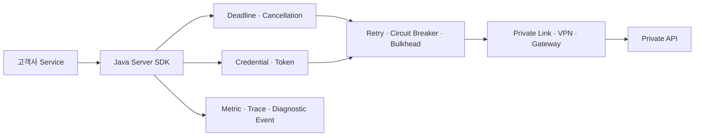
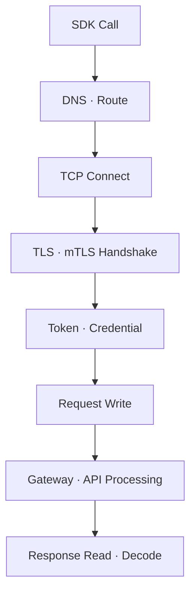
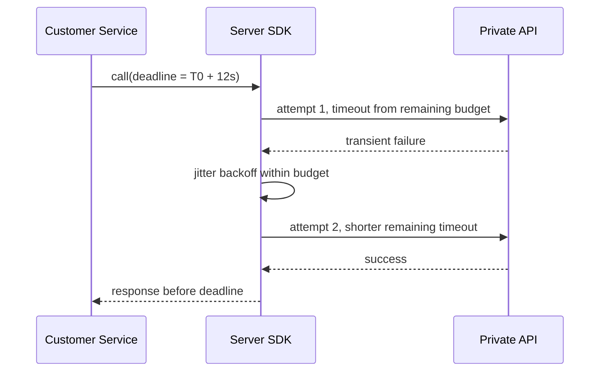
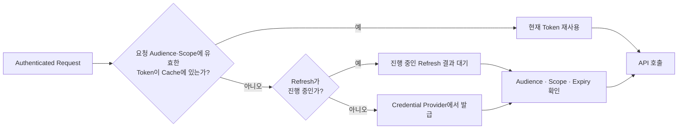
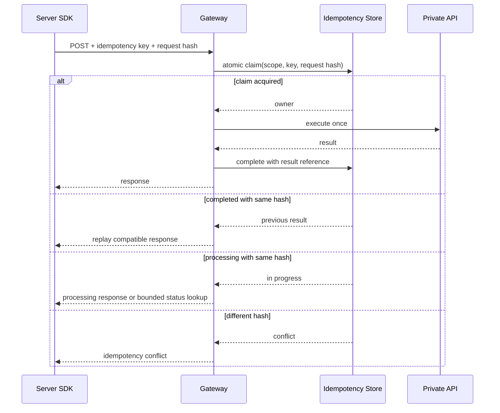
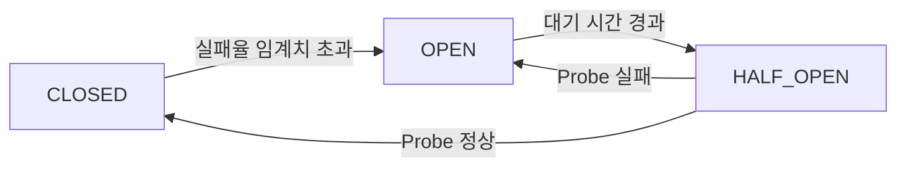
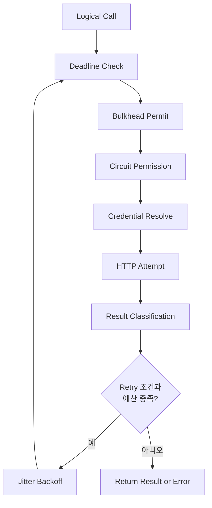

# 프라이빗 망 Server SDK 운영 안정성: 인증·재시도·멱등성과 관측성

앞선 두 글에서는 프라이빗 API를 호출하는 Java Server SDK의 모듈·전송 계층과, 이를 고객사 Spring Boot 애플리케이션에 연결하는 Starter를 설계했습니다.

그러나 Client Bean이 정상 생성됐다는 사실만으로 운영 안정성이 보장되지는 않습니다. 프라이빗 망에서도 DNS 지연, TLS Handshake 실패, Gateway 과부하, Token 만료, 부분 응답, 연결 종료와 배포 중 순간 장애가 발생합니다. 이때 무제한 Timeout과 무분별한 재시도는 작은 장애를 전체 시스템의 자원 고갈로 확대할 수 있습니다.

운영 가능한 Server SDK의 목표는 “모든 실패를 성공으로 바꾸는 것”이 아닙니다. **복구 가능한 실패만 제한된 예산 안에서 흡수하고, 복구할 수 없는 실패는 빠르고 진단 가능하게 반환하며, 장애 중에는 프라이빗 API를 더 압박하지 않는 것**입니다.



이 글은 특정 고객사나 제품의 운영값을 공개하지 않습니다. Package, Endpoint, 오류 코드와 설정값은 모두 합성 예시입니다. 실제 Timeout, Retry와 Circuit Breaker 기준은 호출 지연 분포, 오류 분류, 트래픽 규모와 서버 수용량을 측정한 뒤 정해야 합니다.

## 1. 안정성 기능도 신뢰 경계의 일부다

Server SDK는 고객사 서버와 프라이빗 API 사이의 신뢰 경계에서 다음 결정을 일관되게 수행합니다.

- 어떤 Credential을 어떤 Audience와 Scope로 사용할 것인가
- 한 논리 요청이 전체적으로 얼마 동안 실행될 수 있는가
- 어떤 오류를 같은 요청으로 다시 시도할 수 있는가
- 생성·변경 요청의 중복 부작용을 어떻게 막을 것인가
- 하위 시스템이 불안정할 때 언제 호출을 차단할 것인가
- 동시 호출과 대기열이 자원을 얼마나 사용할 수 있는가
- 운영자가 실패 원인을 어떤 Metric과 Trace로 확인할 것인가

이 결정을 애플리케이션마다 구현하면 같은 API에 서로 다른 재시도 횟수와 인증 캐시가 생깁니다. 장애가 발생하면 어느 계층이 몇 번 재시도했는지도 알기 어렵습니다.

SDK는 편의 기능보다 **실패 의미와 자원 사용량을 고정하는 운영 계약**이어야 합니다.

## 2. 먼저 실패를 단계별로 분류한다

“API 호출 실패” 하나로 기록하면 대응 방법을 결정할 수 없습니다. 최소한 다음 단계를 구분합니다.



| 실패 단계 | 예시 | 기본 판단 |
|---|---|---|
| DNS·경로 | 이름 해석 실패, 경로 없음 | 짧은 일시 오류일 수 있으나 예산 제한 필요 |
| Connect | 연결 거부, Connect Timeout | 배포·과부하·네트워크 오류 구분 |
| TLS·mTLS | 인증서 만료, 신뢰 체인 오류 | 대부분 설정·인증서 문제, 자동 재시도 금지 |
| Credential | Token 발급 실패, 만료, Scope 부족 | 만료 갱신과 권한 오류를 분리 |
| 요청 전송 | 연결이 끊김 | 서버 적용 여부를 모를 수 있음 |
| 서버 처리 | 429, 5xx, 업무 오류 | 상태와 응답 계약에 따라 분류 |
| 응답 수신 | Read Timeout, 부분 Body | 원 요청 적용 여부가 불확실할 수 있음 |
| Decode | Schema 불일치, 잘못된 Body | 호환성·서버 결함, 재시도로 해결되지 않음 |

특히 “응답을 받지 못했다”와 “서버가 처리하지 않았다”는 같은 말이 아닙니다. 서버가 변경을 완료한 뒤 응답 전달만 실패할 수 있기 때문에, 생성·변경 요청의 자동 재시도에는 멱등성 계약이 필요합니다.

## 3. Timeout 여러 개보다 하나의 Deadline이 먼저다

Connect Timeout, Request Timeout과 Read Timeout을 각각 두더라도 논리 요청 전체 시간이 제한되지 않으면 재시도마다 시간이 다시 시작됩니다.

예를 들어 요청 제한시간이 10초이고 세 번 시도한다면, 단순 구현은 Backoff를 제외하고도 최대 30초를 기다릴 수 있습니다. 상위 서비스의 제한시간이 15초라면 뒤의 시도는 결과를 전달할 수 없는 작업이 됩니다.

권장 모델은 호출 시작 시 절대 Deadline을 만들고 모든 단계가 남은 예산을 공유하는 것입니다.

```text
remaining = deadline - now
attempt_timeout = min(configured_attempt_timeout, remaining - reserved_backoff)
```



Deadline이 지나면 다음 시도를 시작하지 않습니다. 비동기 호출도 취소 신호를 전송 계층까지 전달하고, 이미 결과를 사용할 수 없는 작업이 연결·Thread·메모리를 계속 점유하지 않도록 합니다.

상위 요청에 Deadline이 있다면 SDK의 기본값보다 짧은 값을 우선합니다. 반대로 SDK가 상위 Deadline을 임의로 늘려서는 안 됩니다.

## 4. Timeout은 지연 분포와 네트워크 구간을 보고 정한다

Timeout에 보편적인 숫자는 없습니다. 너무 길면 장애 중 자원을 오래 잡고, 너무 짧으면 정상적인 긴 꼬리 지연을 실패로 바꿉니다.

설정 전 다음 데이터를 확인합니다.

- 정상·피크 시간의 p50, p95, p99 지연
- DNS, Connect, TLS와 서버 처리 시간의 분해
- 고객사와 Gateway 사이의 네트워크 구간
- 배포·Scale-out·인증서 교체 시 Cold Path
- 요청 크기와 Streaming 여부
- 상위 서비스가 허용하는 전체 응답 시간

평균값만 보면 일부 요청이 Deadline까지 매달리는 이중 분포를 놓칠 수 있습니다. Percentile과 Timeout 비율을 함께 봅니다.

연결을 처음 맺을 때만 TLS 비용이 커지는 환경이라면 애플리케이션 시작 시 통제된 Warm-up을 고려할 수 있습니다. 단, Warm-up 실패가 전체 기동을 막을지 여부는 Readiness 정책과 분리합니다.

## 5. 인증은 호출마다 Secret을 조립하는 코드가 아니다

Starter 글에서 Secret 문자열 대신 `CredentialProvider`를 주입했습니다. 운영 환경에서는 Provider가 다음 수명 주기를 책임집니다.

1. 요청의 Tenant·Audience·Scope를 기준으로 Credential 선택
2. 아직 유효한 Token을 안전하게 재사용
3. 만료 전 Refresh 여유 시간을 두고 갱신
4. 동시 갱신을 하나로 합치는 Single-flight 적용
5. 회전·폐기된 Credential을 Cache에서 제거
6. 실패 원인을 Secret 없이 진단 이벤트로 반환



모든 Thread가 동시에 Token 만료를 감지해 발급 서버를 호출하면 인증 장애가 증폭됩니다. 동일한 Credential Key에 대한 갱신은 합치고, 대기에도 Deadline을 적용합니다.

OAuth 2.0 Security Best Current Practice는 Access Token을 민감한 Secret으로 취급하고 Audience 제한과 Sender-constrained Token을 고려하도록 권고합니다. 높은 보안 수준이 필요한 서버 간 통신에서는 mTLS 인증과 인증서에 결합된 Token 같은 방식을 선택할 수 있지만, 인증서 발급·회전·폐기·TLS 종료 지점까지 함께 설계해야 합니다.

## 6. 인증 실패를 한 종류로 합치지 않는다

HTTP 401 또는 403을 받았다고 무조건 Token을 다시 발급해서 재시도하면 권한 설정 오류가 인증 서버 부하로 바뀝니다.

| 분류 | 예시 | SDK 동작 |
|---|---|---|
| 만료 또는 갱신 가능한 Token | 명시적 만료 응답 | 한 번 갱신 후 조건부 재시도 |
| Scope·Audience 부족 | 권한 계약 불일치 | 재시도하지 않고 안정적인 인증 예외 |
| mTLS 인증서 오류 | 만료, SAN·Trust 불일치 | 즉시 실패, 인증서 진단 코드 제공 |
| Credential Provider 일시 장애 | 제한된 5xx·Timeout | Deadline과 별도 Retry Budget 안에서 처리 |
| 폐기된 Secret | Revoked Credential | Cache 제거 후 재발급 가능 여부 확인 |
| 잘못된 고객 설정 | Client ID·Endpoint 오류 | Fail Fast, 자동 재시도 금지 |

Token 값, Authorization Header, Private Key, 전체 인증 응답은 로그에 기록하지 않습니다. 진단에는 Provider 종류, 오류 분류, 만료까지 남은 구간, Request ID처럼 제한된 정보만 사용합니다.

## 7. HTTP 메서드와 업무 멱등성은 다르다

RFC 9110은 GET 같은 Safe Method와 PUT·DELETE를 멱등 메서드로 정의합니다. 또한 비멱등 요청은 그 의미가 실제로 멱등하다는 것을 알거나 원 요청이 적용되지 않았음을 확인할 수 있을 때가 아니면 자동 재시도하지 말아야 한다고 설명합니다.

그러나 HTTP 메서드만 보고 판단해서는 안 됩니다.

- `PUT`이라도 외부 결제·알림 부작용을 함께 일으킬 수 있음
- `DELETE`의 반복 응답 Status는 달라도 의도한 최종 효과는 같을 수 있음
- `POST`도 서버가 멱등성 Key를 지원하면 안전하게 반복할 수 있음
- 연결 실패 시 서버가 요청을 받았는지 Client는 알 수 없을 수 있음

SDK는 각 Operation에 다음 메타데이터를 둡니다.

```java
public record OperationSemantics(
        boolean retryable,
        boolean requiresIdempotencyKey,
        Set<FailureKind> retryableFailures
) {
}
```

이 정보는 전송 계층의 HTTP 메서드가 아니라 제품 API의 업무 의미를 기준으로 정합니다.

## 8. 변경 요청에는 서버와 공유하는 멱등성 계약이 필요하다

생성 요청을 안전하게 재시도하려면 Client만 Key를 보내서는 충분하지 않습니다. 서버가 같은 Key와 같은 요청을 식별하고 결과를 재사용해야 합니다.



같은 요청이 처리 중일 때의 응답과 재조회 방식도 서버 계약에 포함합니다. Client가 짧은 간격으로 무제한 조회하지 않도록 전체 Deadline, 대기 지침과 조회 횟수 상한을 함께 적용합니다.

계약에는 다음이 필요합니다.

- Key 생성 주체와 형식
- 중복 판정 범위: Tenant·Operation·Key
- 요청 Hash 비교 방법
- 처리 중, 성공, 실패 상태 표현
- 결과 보존 기간
- 같은 Key에 다른 요청이 들어왔을 때 Conflict 처리
- 동시 요청의 원자적 선점
- 서버가 처리했지만 Client가 응답을 못 받은 경우의 재조회

멱등성 Key를 로그에 남길 때도 원문 대신 제한된 길이의 불투명 식별자나 Hash를 사용합니다. Key가 사용자 정보나 업무 내용을 담아서는 안 됩니다.

## 9. 재시도는 오류를 숨기는 기능이 아니라 제한된 복구 시도다

자동 재시도는 다음 조건을 모두 만족할 때만 수행합니다.

1. 실패가 일시적일 가능성이 높다.
2. Operation이 멱등하거나 서버 멱등성 계약이 있다.
3. 전체 Deadline 안에 다음 시도를 완료할 예산이 있다.
4. Process 전체 Retry Budget이 남아 있다.
5. Circuit Breaker와 Bulkhead가 호출을 허용한다.
6. 서버가 명시한 대기 시간이 제품 최대값 안에 있다.

예시 분류는 다음과 같습니다.

| 결과 | 기본 재시도 | 이유 |
|---|---:|---|
| Connect Timeout | 조건부 | 서버 적용 전일 가능성이 높지만 Deadline 필요 |
| Read Timeout | 멱등 요청만 | 서버 적용 여부가 불확실 |
| 429 | 조건부 | `Retry-After`와 전체 예산 확인 |
| 일부 502·503·504 | 조건부 | Gateway·배포 중 일시 오류 가능 |
| 대부분의 4xx | 아니오 | 요청·권한·계약 수정이 필요 |
| Decode·Schema 오류 | 아니오 | 같은 응답이 반복될 가능성이 높음 |
| TLS 인증서 오류 | 아니오 | 설정·회전 문제를 해결해야 함 |
| Circuit Open | 아니오 | 하위 시스템 보호를 위해 즉시 실패 |

표는 출발점일 뿐입니다. 실제 API의 오류 계약이 더 구체적인 기준을 제공해야 합니다.

## 10. 지수 Backoff에는 Jitter가 함께 있어야 한다

여러 고객사 서버가 같은 순간에 실패하고 같은 간격으로 재시도하면, 회복 중인 API에 재시도 파동이 몰립니다. 지수 Backoff만 적용해도 모든 Client가 같은 시간표를 사용하면 동기화가 남습니다.

```text
cap = min(max_backoff, base * 2^attempt)
delay = random(0, cap)
```

위 식은 Full Jitter의 단순 예시입니다. 제품은 사용하는 알고리즘을 문서화하고 결정적 테스트를 위해 난수 공급자와 Clock을 주입할 수 있어야 합니다.

서버가 `Retry-After`를 제공한다면 이를 고려하되 다음을 확인합니다.

- 전체 Deadline을 넘지 않는가
- 제품이 허용한 최대 대기 시간을 넘지 않는가
- 값이 없거나 잘못됐을 때 안전한 기본값이 있는가
- 모든 Client가 정확히 같은 시점에 재개하지 않도록 추가 분산이 필요한가

## 11. Retry Budget으로 Process 전체 증폭을 제한한다

요청 하나의 최대 시도 횟수만 제한해도 전체 트래픽이 많으면 재시도 부하는 커집니다. Process 단위 Retry Budget을 두면 정상 요청량 대비 재시도 비율 또는 일정 시간의 재시도 수를 제한할 수 있습니다.

Google SRE는 서버 전체 Retry Budget과 여러 계층에서의 중복 재시도를 고려하라고 설명합니다. 세 계층이 각각 네 번 시도하면 하나의 사용자 요청이 하위 계층에서 최대 64번의 시도로 증폭될 수 있습니다.

권장 원칙은 다음과 같습니다.

- 한 호출 경로에서 재시도 책임 계층을 하나로 지정
- 최초 시도와 재시도를 Metric에서 분리
- Budget 소진 시 새 재시도를 즉시 중단
- 우선순위가 높은 Operation과 낮은 Operation의 Budget 분리 검토
- Budget 소진 자체를 장애 신호로 Alert
- 긴급 상황에서 재시도를 끄는 Kill Switch 제공

SDK가 재시도하고 Gateway도 재시도한다면 두 정책을 함께 계산해야 합니다. 문서에 보이지 않는 인프라 재시도도 시도 증폭에 포함됩니다.

## 12. Circuit Breaker는 실패를 줄이지, 동시성을 제한하지 않는다

Circuit Breaker는 최근 실패율이나 느린 호출 비율이 임계치를 넘으면 호출을 빠르게 거부해 불안정한 하위 시스템과 호출자의 자원을 보호합니다.



Resilience4j의 Circuit Breaker는 일반적으로 `CLOSED`, `OPEN`, `HALF_OPEN` 상태를 사용하고 Sliding Window의 실패율과 느린 호출 비율을 평가합니다. 최소 호출 수가 차기 전에는 적은 표본만으로 열리지 않도록 설정할 수 있습니다.

중요한 점은 Circuit Breaker가 동시 실행 수를 제한하지 않는다는 것입니다. `CLOSED` 상태라면 많은 Thread가 동시에 통과할 수 있습니다. 동시 호출을 제한하려면 Bulkhead를 별도로 사용합니다.

Breaker 범위도 신중하게 정합니다.

- 서로 장애 영역이 다른 Endpoint는 분리
- 인증 서버와 업무 API는 분리
- 모든 Tenant를 하나로 묶으면 한 Tenant 장애가 전체를 막을 수 있음
- Tenant마다 Breaker를 만들면 메모리와 Metric Cardinality가 폭증할 수 있음
- Operation 그룹별 실패 의미가 다르면 분리

## 13. Bulkhead와 대기열로 자원 고갈을 막는다

Timeout과 Circuit Breaker가 있어도 너무 많은 호출이 동시에 시작되면 Thread, 연결, 메모리와 하위 API가 고갈될 수 있습니다.

Bulkhead는 동시 실행 수를 제한하고, 대기열은 제한된 크기만 허용합니다.

```text
max_in_flight = measured safe concurrency
max_queue = bounded and small
queue_wait <= remaining deadline
```

Queue가 가득 차면 오래 기다리게 하지 말고 명확한 `SdkCapacityExceededException` 같은 예외로 빠르게 실패시킵니다. 호출자가 이 예외를 다시 무제한 재시도하지 않도록 재시도 불가 분류와 권장 대응을 함께 제공합니다.

공유 SDK Client에서 한 Tenant가 모든 Permit을 점유할 수 있다면 Tenant 또는 우선순위별 공정성 정책을 검토합니다. 단, 고카디널리티 Tenant별 객체를 무제한 생성하지 않도록 상한과 정리 정책이 필요합니다.

## 14. 연결 풀과 DNS·TLS도 관측 대상이다

장수명 `SdkClient`는 연결을 재사용하지만, “연결 풀을 쓴다”는 문장만으로 충분하지 않습니다.

- 최대 연결 수와 Endpoint별 제한
- Idle 연결 만료와 서버 Keep-alive 정책
- 연결 획득 대기시간
- DNS 갱신과 오래된 주소 처리
- TLS Session 재사용
- 인증서 교체 시 새 연결 검증
- Proxy와 Gateway의 Idle Timeout 차이
- HTTP/2 Stream 동시성

오래된 연결을 재사용하다 첫 요청이 실패할 수 있고, 고객사와 Gateway의 Idle Timeout이 다르면 주기적인 Reset이 발생할 수 있습니다. 이를 재시도로 가리기 전에 연결 생성률, 재사용률, 획득 대기, Reset 시점을 관측해야 합니다.

SDK가 호출자가 주입한 HTTP Client나 Executor를 사용한다면 그 자원을 닫지 않습니다. 반대로 SDK가 생성한 연결 풀은 `SdkClient.close()`에서 정리합니다.

## 15. Health, Readiness와 Liveness의 질문은 서로 다르다

프라이빗 API 상태를 애플리케이션 Liveness에 직접 연결하면 외부 API 장애가 고객사 서버의 반복 재시작으로 번질 수 있습니다.

| 상태 | 질문 | 프라이빗 API 반영 |
|---|---|---|
| Startup | 애플리케이션 초기화가 끝났는가 | 필수 정적 구성과 초기화 정책에 따라 제한적으로 |
| Liveness | Process가 진행 불가능해 재시작해야 하는가 | 일반적으로 외부 API 일시 장애와 분리 |
| Readiness | 지금 요청을 받아 처리할 수 있는가 | 필수 의존성이면 제한된 상태 점검 고려 |
| SDK Diagnostic | 특정 Endpoint 호출이 가능한가 | Circuit·최근 오류·제한된 Probe 정보 제공 |

Kubernetes 문서도 잘못된 Liveness Probe가 과부하 중 재시작과 연쇄 장애를 만들 수 있다고 경고합니다. Readiness 실패는 트래픽에서 제외하는 신호이고, Liveness 실패는 재시작을 일으키는 더 강한 신호입니다.

Health Check 자체도 하위 API 부하가 됩니다.

- 작은 전용 Endpoint 사용
- 짧은 Timeout과 낮은 빈도
- 최소 권한 Credential
- 응답 Body 최소화
- Probe 요청을 일반 업무 Metric과 구분
- 모든 인스턴스가 같은 순간 호출하지 않도록 분산

## 16. Metric은 논리 요청과 실제 시도를 분리한다

재시도가 있는 SDK는 “호출 수”가 두 종류입니다.

- **Logical Call**: 고객 애플리케이션이 SDK를 한 번 호출
- **Attempt**: SDK가 프라이빗 API에 실제로 전송한 횟수

둘을 합치면 성공률과 부하를 잘못 해석합니다.

최소 Metric 예시는 다음과 같습니다.

| Metric | 의미 |
|---|---|
| Logical call duration | 호출자가 경험한 전체 지연 |
| Attempt duration | 개별 네트워크 시도 지연 |
| Retry count·ratio | 재시도 횟수와 최초 호출 대비 비율 |
| Retry budget exhausted | Process Budget 소진 횟수 |
| Timeout by phase | Connect·Request·Deadline 분류 |
| Circuit state·rejection | 상태 전이와 차단 호출 |
| Bulkhead in-flight·rejection | 동시 사용량과 용량 초과 |
| Credential refresh | 성공·실패·지연, 값은 제외 |
| Idempotency replay·conflict | 중복 결과 재사용과 충돌 |

OpenTelemetry의 HTTP Semantic Conventions는 HTTP Client Span과 `http.client.request.duration` 같은 Metric 이름·속성 계약을 제공합니다. SDK 전용 Metric을 만들 때도 표준 HTTP 계층과 제품 논리 계층을 중복 계산하지 않도록 구분합니다.

## 17. Trace에는 재시도 관계와 최종 결과가 보여야 한다

논리 호출 Span 아래에 실제 Attempt Span을 두면 한 요청이 몇 번 전송됐는지 확인할 수 있습니다.

```text
sdk.logical_call
├── http.client attempt=1 status=503
├── sdk.retry_backoff attempt=2
└── http.client attempt=2 status=200
```

Span과 Event에는 다음과 같은 제한된 속성을 사용할 수 있습니다.

- Operation 이름
- Endpoint의 논리적 별칭
- Attempt 번호
- 실패 단계와 안정적인 오류 코드
- HTTP Method·Status
- Retry 여부와 Backoff 구간
- Circuit 상태
- Request ID·Trace ID

다음 값은 기록하지 않습니다.

- Authorization Header와 Token
- Client Secret·Private Key·인증서 원문
- Query String 전체
- 사용자 입력 Body
- 고객명·사용자 ID·Tenant 원문
- 전체 내부 URL과 IP
- 멱등성 Key 원문

OpenTelemetry HTTP 규약의 속성도 내부 주소나 고카디널리티 경로가 노출될 수 있으므로, 데이터 분류와 Exporter 정책을 함께 검토합니다.

## 18. 예외는 운영 대응을 안내해야 한다

SDK가 모든 실패를 `RuntimeException`으로 던지면 호출자는 재시도 여부와 사용자 응답을 판단할 수 없습니다.

```java
public abstract sealed class SdkException extends RuntimeException
        permits SdkTimeoutException,
                SdkAuthenticationException,
                SdkRateLimitedException,
                SdkCapacityExceededException,
                SdkCircuitOpenException,
                SdkRemoteException,
                SdkProtocolException {

    private final String errorCode;
    private final boolean retryable;
    private final String requestId;

    protected SdkException(
            String message,
            String errorCode,
            boolean retryable,
            String requestId,
            Throwable cause
    ) {
        super(message, cause);
        this.errorCode = errorCode;
        this.retryable = retryable;
        this.requestId = requestId;
    }

    public String errorCode() {
        return errorCode;
    }

    public boolean retryable() {
        return retryable;
    }

    public String requestId() {
        return requestId;
    }
}
```

`retryable`은 무조건 다시 시도하라는 명령이 아닙니다. 해당 Operation의 멱등성, Deadline과 Retry Budget을 함께 만족할 때 SDK 정책이 고려할 수 있다는 분류입니다.

오류 메시지에는 다음을 포함합니다.

- 안정적인 공개 오류 코드
- 실패 단계
- 최종 Attempt 수
- Retry가 중단된 이유
- Request ID
- 운영자가 확인할 설정 또는 문서

내부 Host, 응답 Body 전체와 Secret은 제외합니다.

## 19. Resilience 기능의 적용 순서도 계약이다

Retry, Circuit Breaker, Timeout과 Bulkhead를 어떤 순서로 조합하는지에 따라 Metric과 자원 사용량이 달라집니다.

개념적으로는 다음 흐름을 권장할 수 있습니다.



이 그림은 하나의 설계 예시입니다. 실제 라이브러리 Decorator 순서는 다음 질문으로 검증합니다.

- Bulkhead Permit을 Backoff 중에도 점유하는가
- Circuit Breaker가 각 Attempt를 세는가, Logical Call을 세는가
- Credential Refresh 실패가 업무 API Breaker에 포함되는가
- TimeLimiter가 작업 취소까지 전달하는가
- Retry가 Circuit Open 예외를 다시 시도하지 않는가
- Metric이 Decorator 중첩 때문에 이중 기록되지 않는가

코드 순서만 보고 추측하지 말고 Fault Injection Test로 확인합니다.

## 20. 장애 주입 테스트로 복합 정책을 검증한다

정상 응답 테스트만으로 운영 안정성을 검증할 수 없습니다. Mock Server, Proxy 또는 테스트 전송 계층으로 다음 상황을 재현합니다.

| 장애 주입 | 확인 항목 |
|---|---|
| Connect 지연 | Connect Timeout과 오류 분류 |
| 응답 Header 후 Body 정지 | Read Timeout·취소·멱등성 판단 |
| 첫 503, 다음 200 | Attempt 수·Backoff·최종 성공 |
| 지속 429와 `Retry-After` | 최대 대기·Deadline·Budget |
| 응답 손실 후 서버 처리 완료 | 멱등성 결과 재사용 |
| 같은 Key·다른 Body | Conflict 처리 |
| Token 동시 만료 | Single-flight Refresh |
| 인증서 만료 | 재시도 없이 인증 오류 |
| 실패율 상승 | Circuit `CLOSED → OPEN → HALF_OPEN` |
| 동시 호출 폭증 | Bulkhead 상한과 빠른 거부 |
| 상위 요청 취소 | 하위 HTTP 작업 취소와 Permit 반환 |
| Metric Exporter 실패 | 업무 호출에 영향 없음 |

테스트에서는 가상 Clock과 주입 가능한 난수를 사용해 Backoff와 Token 만료를 빠르고 결정적으로 검증합니다. 실제 네트워크 환경에서는 별도의 통합·부하·장애 복구 테스트를 수행합니다.

## 21. 기본값은 시작점이며 운영 중 조정 가능해야 한다

다음은 형식을 보여주기 위한 합성 설정입니다.

```yaml
example:
  sdk:
    connect-timeout: 3s
    request-timeout: 8s
    deadline: 12s
    retry:
      max-attempts: 3
      base-backoff: 100ms
      max-backoff: 2s
      budget-ratio: 0.1
    circuit-breaker:
      minimum-calls: 20
      failure-rate-threshold: 50
      open-duration: 30s
    bulkhead:
      max-concurrent-calls: 50
      max-wait: 50ms
```

이 숫자를 그대로 운영 기본값으로 사용해서는 안 됩니다. 실제 값은 부하 테스트, 지연 분포, 인스턴스 수, Gateway 제한, 상위 Deadline과 장애 복구 실험으로 검증합니다.

운영 변경은 다음 원칙을 따릅니다.

- 범위와 단위가 검증된 타입 안전 설정
- 설정 변경 전후 Audit
- Canary 인스턴스에서 먼저 적용
- Retry와 Circuit 변경 시 하위 API 부하 영향 확인
- 위험한 값의 상·하한 강제
- 긴급 Kill Switch 제공
- 버전별 기본값 변경을 Release Note에 명시

## 22. 운영 체크리스트

### Deadline과 자원

- [ ] 상위 요청과 SDK가 하나의 Deadline 예산을 공유하는가
- [ ] 각 재시도 전에 남은 예산을 다시 계산하는가
- [ ] 취소가 HTTP 작업과 대기 중인 Permit까지 전달되는가
- [ ] 연결 풀, Thread와 Queue 상한이 있는가
- [ ] 고객이 주입한 자원의 소유권을 침범하지 않는가

### 인증과 멱등성

- [ ] Credential이 Audience·Scope·Tenant 경계에 맞게 선택되는가
- [ ] Token 동시 갱신이 Single-flight로 합쳐지는가
- [ ] Secret·Token·인증서 원문이 로그에 남지 않는가
- [ ] 변경 요청의 멱등성 Key를 서버가 원자적으로 처리하는가
- [ ] 같은 Key와 다른 요청의 Conflict가 정의돼 있는가

### Retry와 보호 장치

- [ ] 재시도 가능 오류와 불가능 오류가 명시돼 있는가
- [ ] 비멱등 요청을 자동 재시도하지 않는가
- [ ] 지수 Backoff와 Jitter를 적용하는가
- [ ] 요청별 최대 시도와 Process Retry Budget이 있는가
- [ ] 여러 계층의 재시도 증폭을 계산했는가
- [ ] Circuit Breaker와 Bulkhead의 역할을 분리했는가

### 관측과 검증

- [ ] Logical Call과 Attempt Metric이 분리돼 있는가
- [ ] Timeout이 단계별로 분류되는가
- [ ] Circuit·Bulkhead·Credential·멱등성 지표가 있는가
- [ ] Trace에서 Attempt와 최종 결과를 연결할 수 있는가
- [ ] 고카디널리티·민감 속성을 제거했는가
- [ ] 장애 주입, 부하와 복구 테스트를 수행했는가
- [ ] Readiness와 Liveness가 외부 장애를 다르게 처리하는가

## 23. 마무리

프라이빗 망은 신뢰할 수 있는 통신 경로를 제공하지만 실패가 없는 경로는 아닙니다. Java Server SDK가 운영 안정성을 갖추려면 단순히 Retry Annotation과 Circuit Breaker 라이브러리를 추가하는 것으로는 부족합니다.

핵심은 다음과 같습니다.

1. 실패를 DNS·Connect·TLS·인증·서버·응답 단계로 분류합니다.
2. 개별 Timeout보다 전체 Deadline을 먼저 만들고 남은 예산을 전달합니다.
3. Credential 수명, Single-flight 갱신과 Secret 비노출을 계약으로 둡니다.
4. HTTP 메서드가 아니라 업무 의미와 서버 계약으로 멱등성을 판단합니다.
5. 복구 가능한 오류만 Jitter와 Retry Budget 안에서 다시 시도합니다.
6. Circuit Breaker, Bulkhead와 연결 풀 상한으로 장애 증폭을 막습니다.
7. Liveness와 외부 의존성 Readiness를 분리합니다.
8. Logical Call과 실제 Attempt를 Metric·Trace에서 구분합니다.
9. 복합 정책의 순서와 취소 동작을 장애 주입 테스트로 검증합니다.

좋은 SDK는 정상 시 호출을 간단하게 만들고, 장애 시에는 실패 범위와 자원 소비를 작게 유지합니다. 호출을 성공시킬 수 없을 때조차 운영자가 “어디서, 왜, 몇 번 시도했고, 무엇 때문에 중단됐는가”를 안전하게 설명할 수 있어야 합니다.

다음 글에서는 고객 맞춤형 Android 앱을 위한 Kotlin SDK를 Coroutine, Flow, Lifecycle, 취소 전파와 안전한 자격 증명 저장 관점에서 설계합니다.

---

## 참고 자료

- [RFC 9110: HTTP Semantics](https://www.rfc-editor.org/rfc/rfc9110.html)
- [RFC 9700: Best Current Practice for OAuth 2.0 Security](https://www.rfc-editor.org/rfc/rfc9700.html)
- [RFC 8705: OAuth 2.0 Mutual-TLS Client Authentication and Certificate-Bound Access Tokens](https://www.rfc-editor.org/rfc/rfc8705.html)
- [AWS Builders’ Library: Timeouts, Retries and Backoff with Jitter](https://aws.amazon.com/builders-library/timeouts-retries-and-backoff-with-jitter/)
- [Google SRE: Addressing Cascading Failures](https://sre.google/sre-book/addressing-cascading-failures/)
- [Resilience4j: CircuitBreaker](https://resilience4j.readme.io/docs/circuitbreaker)
- [Resilience4j: Retry](https://resilience4j.readme.io/docs/retry)
- [OpenTelemetry: Semantic Conventions for HTTP](https://opentelemetry.io/docs/specs/semconv/http/)
- [Kubernetes: Liveness, Readiness, and Startup Probes](https://kubernetes.io/docs/concepts/workloads/pods/probes/)
- [OWASP: Secrets Management Cheat Sheet](https://cheatsheetseries.owasp.org/cheatsheets/Secrets_Management_Cheat_Sheet.html)
