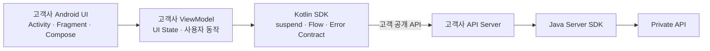
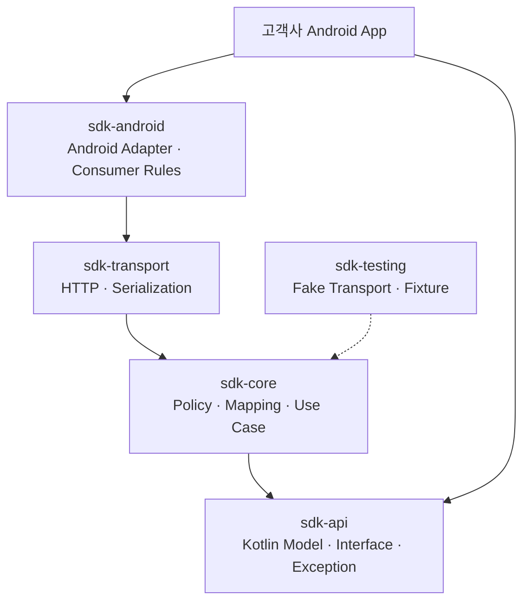
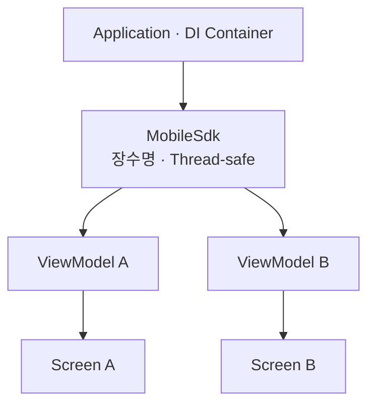
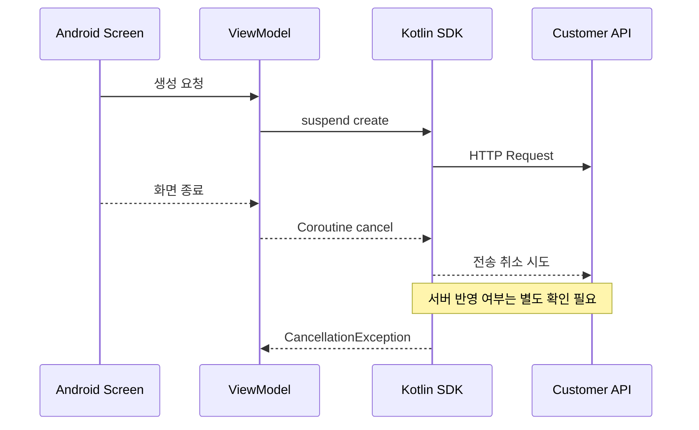
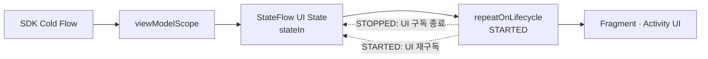
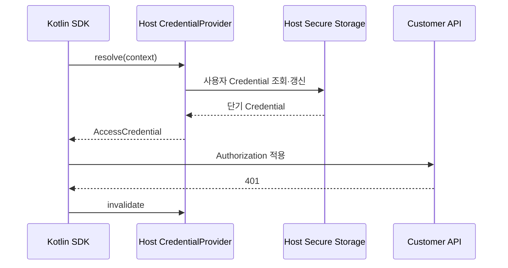
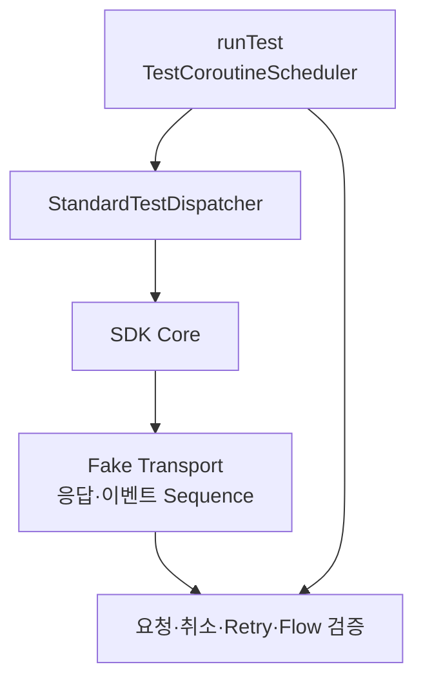

# 고객 맞춤형 Android 앱을 위한 Kotlin SDK: Coroutine·Flow·Lifecycle

앞선 글에서는 고객사가 Android·iOS 앱과 React 웹을 직접 설계하면서도 프라이빗 API를 노출하지 않는 멀티플랫폼 SDK 구조를 살펴봤습니다. 이번 글은 그중 Android Kotlin SDK의 공개 API와 실행 계약을 구체화합니다.

Android SDK의 목적은 완성된 화면을 고객에게 강제하는 것이 아닙니다. 로그인 화면, 내비게이션, 디자인 시스템과 업무 흐름은 고객사 앱이 결정하고, SDK는 고객사 서버와 안전하게 통신하는 기능을 Kotlin다운 계약으로 제공합니다.



모바일 앱은 프라이빗 API Endpoint나 서버 자격 증명을 갖지 않습니다. Kotlin SDK가 연결하는 대상은 고객사에 공개된 모바일용 API이며, 서버 간 프라이빗 연결은 고객사 서버와 Java Server SDK의 책임입니다.

이 글은 특정 회사·고객·제품·내부 URL을 제외한 합성 예시로 `suspend`, `Flow`, 구조적 동시성, Lifecycle, 취소, 오류, 인증과 테스트 원칙을 정리합니다.

## 1. Android SDK는 UI Framework가 아니라 기능 계약이다

고객 맞춤형 앱을 지원하려면 SDK가 제공할 것과 제공하지 않을 것을 먼저 구분해야 합니다.

| SDK가 제공 | 고객사 앱이 결정 |
|---|---|
| 안정적인 Kotlin API와 Model | 화면 구성과 디자인 시스템 |
| 요청·응답 직렬화와 전송 | 내비게이션과 사용자 여정 |
| 인증 자격 증명 주입 지점 | 로그인 UX와 계정 정책 |
| 오류·취소·이벤트 의미 | 오류 문구와 재시도 버튼 |
| Thread·Dispatcher 안전성 | ViewModel과 UI State 구성 |
| Fake와 계약 테스트 도구 | Analytics·Crash 정책 |

SDK가 `Activity`를 시작하거나 Dialog를 띄우고 전역 Singleton에 화면 상태를 저장하면 고객사의 앱 구조를 침범합니다. 반대로 SDK가 Callback과 원시 JSON만 노출하면 모든 고객이 Coroutine, 오류 변환과 Lifecycle 처리를 다시 구현해야 합니다.

적절한 경계는 **업무 기능은 SDK가 캡슐화하고, 화면과 수명 범위는 호출자가 소유하는 것**입니다.

## 2. 공개 API는 한 번의 결과와 지속 이벤트를 구분한다

Android 공식 Coroutine 권장사항은 데이터·업무 계층에서 한 번의 작업에는 `suspend` 함수, 시간에 따라 변하는 데이터에는 `Flow`를 노출하는 방식을 권장합니다. SDK에도 같은 구분을 적용할 수 있습니다.

```kotlin
interface SessionApi {
    suspend fun create(
        request: CreateSessionRequest,
        context: RequestContext
    ): Session

    suspend fun get(
        sessionId: String,
        context: RequestContext
    ): Session

    fun observeEvents(
        sessionId: String,
        context: RequestContext
    ): Flow<SessionEvent>
}
```

| 작업 성격 | 권장 계약 | 예 |
|---|---|---|
| 단일 요청·응답 | `suspend fun` | 생성, 조회, 수정 |
| 여러 값의 연속 전달 | `Flow<T>` | 상태 변화, 진행 이벤트 |
| 현재 값을 가진 앱 상태 | 고객사 `StateFlow<T>` | 화면 UI State |
| 일회성 UI 효과 | 고객사 Event 처리 | Toast, Navigation |

SDK가 모든 값을 `Flow`로 만들면 단순 조회도 수집·완료 의미를 이해해야 합니다. 반대로 지속 이벤트를 `suspend fun List<Event>`로 제공하면 Polling과 갱신 책임이 호출자에게 새어 나갑니다.

## 3. 모듈은 Android 의존성을 최외곽에 둔다

핵심 계약이 Android Framework에 과도하게 묶이면 JVM 단위 테스트와 다른 Kotlin 환경에서 재사용하기 어렵습니다.



화살표는 컴파일·런타임 의존 방향입니다.

- `sdk-api`: 공개 Model, Service Interface, 안정적인 예외
- `sdk-core`: 인증 적용, Deadline, 오류 Mapping, 이벤트 정규화
- `sdk-transport`: HTTP Client Adapter와 Wire DTO
- `sdk-android`: Android 전용 설정과 패키징
- `sdk-testing`: Fake, Fixture와 계약 검증 도구

`Activity`, `Fragment`, `ViewModel`, `LifecycleOwner`는 기본 공개 API에 넣지 않습니다. Android 앱은 SDK의 `suspend`·`Flow` 계약을 자신의 Presentation 계층에 연결합니다.

## 4. Client는 장수명이고 화면을 참조하지 않는다

HTTP 연결과 직렬화 설정을 재사용하려면 SDK Client를 요청마다 새로 만들지 않습니다.

```kotlin
val sdk = MobileSdk.builder()
    .baseUrl("https://mobile-api.example.com")
    .credentialProvider(credentialProvider)
    .build()
```

권장 수명은 Application 또는 DI Container 범위입니다.



Client가 보관해도 되는 값:

- 불변 Endpoint와 기능 설정
- Thread-safe HTTP Client
- Codec과 오류 Mapper
- 자격 증명 제공자 참조
- 제한된 연결·이벤트 공유 자원

Client가 보관하면 안 되는 값:

- `Activity`, `Fragment`, `View`, `LifecycleOwner`
- 화면별 선택 항목과 입력값
- 현재 사용자 화면을 나타내는 가변 전역 상태
- 요청마다 바뀌는 Tenant·User·Request ID

Android `Context`가 꼭 필요하다면 Builder에서 받은 값을 즉시 `applicationContext`로 축소하고, 왜 필요한지 문서화합니다. 화면 Context를 장수명 Client에 보관하면 메모리 누수 위험이 생깁니다.

SDK가 장수명 Socket, Executor나 직접 생성한 전송 자원을 소유한다면 `MobileSdk`는 `Closeable` 같은 명시적인 종료 계약을 제공할 수 있습니다. Application 종료나 테스트 정리 시 한 번 닫되, 호출자가 주입한 Scope·Dispatcher·HTTP Client는 SDK가 임의로 종료하지 않습니다. Android Process가 강제로 종료될 수 있으므로 `close()` 호출에만 의존해 서버 상태나 중요 데이터를 보존해서도 안 됩니다.

## 5. `suspend` 함수는 Main-safe 계약이어야 한다

`suspend` 키워드 자체가 코드를 Background Thread로 옮기지는 않습니다. Blocking I/O나 큰 JSON 변환이 있다면 구현이 적절한 Dispatcher로 이동해 Main Thread를 막지 않아야 합니다.

```kotlin
internal class DefaultSessionApi(
    private val transport: Transport,
    private val dispatchers: SdkDispatchers
) : SessionApi {

    override suspend fun create(
        request: CreateSessionRequest,
        context: RequestContext
    ): Session = withContext(dispatchers.io) {
        val response = transport.execute(
            createSessionCommand(request, context)
        )
        response.toPublicModel()
    }
}
```

다만 전송 라이브러리가 이미 진짜 비동기 `suspend` API를 제공한다면 모든 호출을 무조건 `Dispatchers.IO`로 감쌀 필요는 없습니다. SDK가 직접 수행하는 Blocking 작업과 CPU 집약적 변환만 명시적으로 이동합니다.

```kotlin
internal data class SdkDispatchers(
    val io: CoroutineDispatcher,
    val cpu: CoroutineDispatcher
) {
    companion object {
        fun defaults() = SdkDispatchers(
            io = Dispatchers.IO,
            cpu = Dispatchers.Default
        )
    }
}
```

Dispatcher를 주입 가능하게 만들면 테스트에서 가상 시간과 실행 순서를 제어할 수 있습니다. 공개 Builder에 불필요하게 Coroutine 내부 구조를 노출하지 않고, 고급 설정이나 테스트 전용 Factory로 제공할 수도 있습니다.

## 6. SDK가 임의의 Scope를 만들지 않게 한다

화면 작업의 시작과 종료를 가장 잘 아는 주체는 호출자입니다. 따라서 `suspend` 함수는 현재 Coroutine의 자식 작업으로 실행되고, `Flow`는 수집한 Scope를 따라야 합니다.

```kotlin
suspend fun loadDashboard(
    sessionApi: SessionApi,
    context: RequestContext
): Dashboard = coroutineScope {
    val active = async {
        sessionApi.get("active-session", context)
    }
    val recent = async {
        sessionApi.get("recent-session", context)
    }
    Dashboard(active.await(), recent.await())
}
```

SDK 내부에서 `GlobalScope.launch`로 작업을 숨기면 호출자가 완료·실패·취소를 관찰할 수 없습니다. 화면보다 오래 살아야 하는 작업도 SDK가 몰래 전역화하지 않고, 다음 중 하나로 계약을 명시합니다.

- 호출자가 소유한 Application Scope를 주입
- 완료를 기다릴 수 있는 `Deferred`·Handle 반환
- 서버에 작업을 접수하고 Operation ID로 상태 조회
- 앱의 명시적인 Background Work 계층에서 실행

## 7. Coroutine 취소와 업무 취소는 다르다

화면이 사라져 Coroutine이 취소되는 것과 서버의 업무를 취소하는 것은 같은 의미가 아닐 수 있습니다.



SDK 구현은 `CancellationException`을 일반 오류로 변환하거나 삼키지 않습니다.

```kotlin
internal suspend fun <T> execute(
    block: suspend () -> T
): T {
    return try {
        block()
    } catch (cancelled: CancellationException) {
        throw cancelled
    } catch (error: TransportException) {
        throw error.toSdkException()
    }
}
```

취소 계약에는 다음을 적습니다.

- Coroutine 취소가 HTTP Call 취소로 전파되는가
- 응답 Parsing 중 취소를 확인하는가
- 취소 후 자동 재시도를 시작하지 않는가
- 서버가 이미 처리했을 가능성을 어떻게 확인하는가
- 실제 업무 취소 API가 별도로 존재하는가

생성·결제·승인처럼 부작용이 있는 작업은 취소만 보고 실패로 단정하지 않습니다. 멱등 키나 Operation ID로 최종 상태를 확인할 수 있어야 합니다.

## 8. `Flow`에는 Cold·Hot·Replay·완료 의미가 필요하다

`Flow<SessionEvent>`라는 타입만으로는 동작을 충분히 설명할 수 없습니다.

| 질문 | 문서화 예 |
|---|---|
| Cold인가 Hot인가 | 수집할 때마다 새 연결을 시작하는 Cold Flow |
| 첫 값은 무엇인가 | Snapshot을 먼저 내보낸 뒤 변경 이벤트 전달 |
| 완료 조건은 무엇인가 | 서버 Terminal Event 또는 호출자 취소 |
| 재연결하는가 | 제한된 Backoff로 재연결, Deadline 이후 종료 |
| Replay하는가 | SDK는 Replay하지 않음, 호출자가 `stateIn` 선택 |
| 느린 Collector는 어떻게 되는가 | 버퍼 크기와 Overflow 정책 명시 |

SDK의 네트워크 이벤트는 기본적으로 Cold Flow로 제공하고, 앱이 자신의 Scope에서 `stateIn` 또는 `shareIn`을 선택하게 하는 방식이 유연합니다. SDK가 장수명 Hot Flow를 제공한다면 공유 Scope, Replay, 시작·종료 정책과 메모리 보유 조건을 공개해야 합니다.

## 9. Callback 기반 전송은 `callbackFlow`로 안전하게 감싼다

기존 WebSocket·Listener API를 Flow로 바꿀 때는 등록 해제가 핵심입니다.

```kotlin
internal fun EventTransport.events(
    sessionId: String
): Flow<WireEvent> = callbackFlow {
    val listener = object : EventListener {
        override fun onEvent(event: WireEvent) {
            trySend(event)
        }

        override fun onFailure(error: Throwable) {
            close(error)
        }

        override fun onComplete() {
            close()
        }
    }

    register(sessionId, listener)
    awaitClose {
        unregister(sessionId, listener)
    }
}
```

`callbackFlow`는 수집할 때마다 Block이 실행되는 Cold Flow입니다. `awaitClose`에서 Listener와 네트워크 자원을 해제하지 않으면 Collector가 취소된 뒤에도 Callback이 남을 수 있습니다.

버퍼 정책은 데이터 의미에 따라 다르게 정합니다.

```kotlin
events(sessionId)
    .buffer(
        capacity = 64,
        onBufferOverflow = BufferOverflow.DROP_OLDEST
    )
```

진행률처럼 최신 값이 중요한 데이터는 오래된 값을 버릴 수 있지만, 감사·결제·명령 결과 이벤트는 누락을 허용하면 안 됩니다. 그런 이벤트는 서버 Cursor·Sequence와 재조회 API를 사용하고, 메모리 버퍼만으로 전달 보장을 만들지 않습니다.

## 10. Lifecycle 연결은 고객사 Presentation 계층이 소유한다

SDK는 `LifecycleOwner`를 받지 않습니다. 고객사 ViewModel이 SDK Flow를 UI State로 바꾸고, 화면이 Lifecycle에 맞춰 수집합니다.



```kotlin
class SessionViewModel(
    sdk: MobileSdk,
    private val context: RequestContext
) : ViewModel() {

    val uiState: StateFlow<SessionUiState> =
        sdk.sessions
            .observeEvents("session-example", context)
            .map(SessionUiState::from)
            .catch { error ->
                if (error is CancellationException) throw error
                emit(SessionUiState.Error(error.toUiReason()))
            }
            .stateIn(
                scope = viewModelScope,
                started = SharingStarted.WhileSubscribed(5_000),
                initialValue = SessionUiState.Loading
            )
}
```

View 기반 UI에서는 보이는 동안만 수집합니다.

```kotlin
viewLifecycleOwner.lifecycleScope.launch {
    viewLifecycleOwner.repeatOnLifecycle(
        Lifecycle.State.STARTED
    ) {
        viewModel.uiState.collect(::render)
    }
}
```

`Flow`는 `LiveData`처럼 화면이 `STOPPED` 상태가 되었다고 자동으로 수집을 멈추지 않습니다. UI 갱신용 Flow를 단순 `launch`나 `launchIn`으로 계속 수집하지 않고 `repeatOnLifecycle` 같은 Lifecycle-aware 수집을 사용합니다.

위 예시에서 `repeatOnLifecycle`은 UI의 `StateFlow` 구독을 중단·재개합니다. `stateIn`의 `SharingStarted.WhileSubscribed(5_000)`가 활성 구독 수를 보고 5초의 유예시간 뒤 SDK의 Cold Flow 수집을 멈춥니다. 따라서 화면 중지와 네트워크 연결 해제가 항상 같은 순간에 일어난다고 가정하지 말고 Sharing 정책을 함께 문서화해야 합니다.

Compose 앱은 `collectAsStateWithLifecycle` 같은 Lifecycle-aware Adapter를 Presentation 계층에서 선택할 수 있습니다. SDK Core가 Compose Runtime에 의존할 필요는 없습니다.

## 11. 오류 계약에서 취소를 분리한다

HTTP 라이브러리 예외와 JSON 예외를 그대로 공개하면 구현 교체가 고객 앱의 `catch` 문을 깨뜨립니다.

```kotlin
sealed class SdkException(
    message: String,
    cause: Throwable? = null
) : RuntimeException(message, cause) {
    abstract val code: String
    abstract val retryable: Boolean
    abstract val requestId: String?
}

class SdkAuthenticationException(
    override val code: String,
    override val requestId: String?
) : SdkException("Authentication failed") {
    override val retryable: Boolean = false
}
```

권장 분류:

- 설정 오류
- 인증·권한 오류
- 입력 검증과 상태 충돌
- Rate Limit
- 네트워크·Timeout
- 서버 일시 오류
- 응답 계약 위반

`CancellationException`은 이 계층으로 감싸지 않습니다. 취소를 실패 화면으로 보여 줄지, 아무 동작 없이 종료할지는 고객사 ViewModel이 결정합니다.

오류 메시지에 Token, 원문 Payload와 개인정보를 넣지 않고, 분기에는 사람이 읽는 문구 대신 안정적인 `code`와 타입을 사용합니다.

## 12. 인증은 Host 앱이 소유하고 SDK는 요청 시 가져온다

모바일 SDK에는 Java Server SDK용 Secret이나 프라이빗 API Credential을 포함하지 않습니다.

```kotlin
interface CredentialProvider {
    suspend fun resolve(
        context: CredentialContext
    ): AccessCredential

    suspend fun invalidate(
        credential: AccessCredential
    )
}
```



저장 여부와 방법은 고객사 인증 계층이 결정합니다. Android Keystore는 앱 전용 암호화 키를 더 추출하기 어렵게 보관하고 키 사용 조건을 제한하는 데 사용할 수 있지만, SDK가 고객의 로그인 정책과 Token 저장소를 임의로 소유해서는 안 됩니다.

401 이후에는 자격 증명을 무한 갱신하지 않습니다. SDK가 한 번 다시 `resolve()`한 뒤 요청을 재전송하려면 해당 작업이 멱등하거나 멱등 키로 보호되고 정책상 재실행 가능해야 합니다. 그 외에는 안정적인 인증 예외를 호출자에게 반환합니다.

보안 원칙:

- APK에 서버 Secret을 넣지 않음
- Token·Cookie·원문 인증 응답을 로그에 남기지 않음
- 자격 증명 갱신은 동시에 한 번만 수행
- 인증 실패의 무한 갱신·재시도 금지
- Logout 시 Host가 Credential을 폐기하고 SDK Cache를 무효화

## 13. Endpoint와 TLS 정책도 Host 앱의 배포 계약이다

SDK Builder는 고객사 모바일 API Endpoint만 받습니다.

```kotlin
val sdk = MobileSdk.builder()
    .baseUrl("https://mobile-api.example.com")
    .credentialProvider(credentials)
    .connectTimeout(3.seconds)
    .requestTimeout(15.seconds)
    .build()
```

Builder는 절대형 HTTPS URL인지 확인하고 User Info, Query와 Fragment가 포함된 Endpoint를 거부해야 합니다. 개발용 HTTP가 필요하더라도 Production 기본값을 약화하지 않고 Host 앱의 명시적인 Debug 설정으로 분리합니다.

Production에서 HTTP Cleartext를 자동 허용하거나 모든 인증서를 신뢰하는 우회 코드를 넣지 않습니다. Android Network Security Configuration은 Cleartext, 신뢰할 CA와 Debug 전용 Override를 앱의 선언적 설정으로 제어할 수 있습니다.

고객사가 사설 CA를 사용해야 한다면 Host 앱의 배포 환경과 인증서 회전 계획을 함께 설계합니다. SDK가 숨겨진 Trust Manager나 단일 인증서 Pin을 강제하면 인증서 교체 시 모든 고객 앱을 긴급 배포해야 할 수 있습니다.

## 14. 요청 문맥과 개인정보는 명시적인 값으로 전달한다

```kotlin
data class RequestContext(
    val tenantId: String,
    val requestId: String,
    val locale: String?
)
```

요청 문맥을 전역 Mutable 변수에 저장하지 않습니다. 동시에 여러 계정·테넌트 요청이 실행될 때 값이 섞일 수 있기 때문입니다.

임의의 `Map<String, String>`을 Header 확장 통로로 공개하면 민감정보, 고카디널리티 값과 예약 Header가 우회 유입될 수 있습니다. 확장이 필요하면 이름·길이·허용 문자를 제한한 별도 타입과 Allowlist를 정의하고, 인증·추적 Header는 전용 필드로 관리합니다.

관측 정보에는 다음만 기본 허용합니다.

- SDK Version과 Operation 이름
- 성공·안정적인 오류 코드
- 지연시간과 재시도 횟수
- 가명화된 상관관계 ID

Token, 전체 URL Query, 원문 Request·Response Body, 사용자 입력과 개인식별정보는 기본 로그·Metric·Trace Attribute에서 제외합니다. 고객사 Logger·Telemetry Adapter를 주입하더라도 SDK가 전달하는 데이터의 Allowlist를 먼저 고정합니다.

## 15. 재시도는 Coroutine과 Deadline을 존중한다

모바일 네트워크는 일시적으로 끊길 수 있지만 모든 요청을 재시도해서는 안 됩니다.

```kotlin
internal suspend fun <T> retryWithinDeadline(
    policy: RetryPolicy,
    deadline: Deadline,
    block: suspend (attempt: Int) -> T
): T {
    var attempt = 1
    while (true) {
        currentCoroutineContext().ensureActive()
        try {
            return block(attempt)
        } catch (cancelled: CancellationException) {
            throw cancelled
        } catch (error: SdkException) {
            if (!policy.canRetry(error, attempt, deadline)) throw error
            delay(policy.backoff(attempt, deadline))
            attempt += 1
        }
    }
}
```

- 멱등 작업만 자동 재시도
- 전체 Deadline 안에서만 재시도
- Coroutine 취소 즉시 다음 Attempt 중단
- `Retry-After`와 Jitter 적용
- 앱·Gateway·서버 중 재시도 소유자를 명확히 지정
- Offline이라는 이유만으로 무한 Queue를 SDK 내부에 만들지 않음

장시간 보장 실행이 필요하면 UI Coroutine 재시도가 아니라 명시적인 Background Work와 서버 Operation 계약으로 분리합니다.

## 16. 테스트는 가상 시간과 Fake 전송을 사용한다

Dispatcher와 전송 계층을 분리하면 실제 Android Device나 네트워크 없이 대부분을 검증할 수 있습니다.



```kotlin
@Test
fun cancellationStopsRetry() = runTest {
    val dispatcher = StandardTestDispatcher(testScheduler)
    val transport = FakeTransport.alwaysTimeout()
    val client = TestMobileSdk(
        transport = transport,
        dispatchers = SdkDispatchers(dispatcher, dispatcher)
    )

    val job = launch {
        client.sessions.get("session-example", testContext())
    }

    runCurrent()
    job.cancelAndJoin()
    advanceUntilIdle()

    assertEquals(1, transport.requestCount)
}
```

같은 테스트 안의 모든 `TestDispatcher`는 하나의 `TestCoroutineScheduler`를 공유해야 가상 시간과 작업 순서를 일관되게 제어할 수 있습니다.

필수 테스트:

- Main Thread에서 호출해도 Blocking하지 않음
- 취소 후 새 Retry Attempt가 없음
- `CancellationException`이 SDK 예외로 변환되지 않음
- Flow 취소 시 Listener·Socket이 해제됨
- Lifecycle 재수집 시 중복 연결 정책이 계약과 일치함
- 느린 Collector의 Buffer Overflow 정책
- Token Refresh Single Flight
- Secret과 개인정보가 로그에 남지 않음
- 미지의 Enum·추가 응답 필드를 안전하게 처리
- 호출자가 주입한 Scope·Dispatcher를 SDK가 종료하지 않음

## 17. 패키징도 고객사 통합 경험의 일부다

고객사가 SDK를 도입할 때는 코드뿐 아니라 빌드 계약이 필요합니다.

```kotlin
dependencies {
    implementation("com.example.mobile:sdk-android:2.4.0")
}
```

배포 문서에 포함할 항목:

- 지원하는 최소·Target Android 범위
- Kotlin·Coroutine·AndroidX 호환성 표
- `minSdk`와 필요한 Permission
- Consumer ProGuard·R8 Rule
- 필수·선택 의존성
- 공개 API·Model의 변경 이력
- Migration Guide와 지원 종료 정책
- AAR·POM·Checksum·서명 검증 방법

SDK가 특정 DI, JSON, HTTP 또는 UI Framework를 고객 앱에 불필요하게 강제하지 않도록 공개 의존성을 최소화합니다.

## 18. 구현 체크리스트

### 공개 API

- [ ] 단일 작업은 `suspend`, 지속 이벤트는 `Flow`로 구분했다.
- [ ] Android UI 타입이 Core 공개 API에 없다.
- [ ] 공개 Model과 전송 DTO를 분리했다.
- [ ] 오류 타입·코드·재시도 가능 여부가 안정적이다.
- [ ] Flow의 Cold·Hot·Replay·완료·Buffer 의미를 문서화했다.

### Coroutine과 Lifecycle

- [ ] 모든 공개 `suspend` 함수가 Main-safe다.
- [ ] Blocking·CPU 작업 Dispatcher를 주입할 수 있다.
- [ ] `GlobalScope`나 숨겨진 무기한 Scope가 없다.
- [ ] `CancellationException`을 삼키거나 변환하지 않는다.
- [ ] SDK가 `Activity`, `Fragment`, `View`를 보관하지 않는다.
- [ ] UI 예제는 Lifecycle-aware 수집을 사용한다.

### 보안과 운영

- [ ] 모바일 앱에 서버 Secret·프라이빗 Endpoint가 없다.
- [ ] Credential 저장·갱신·폐기는 Host 앱이 소유한다.
- [ ] Cleartext 허용·Trust-all 우회 코드가 없다.
- [ ] Token·Payload·개인정보가 기본 로그에서 제외된다.
- [ ] 재시도가 멱등성·Deadline·Coroutine 취소를 존중한다.

### 테스트와 배포

- [ ] Fake Transport로 성공·오류·취소·이벤트를 재현한다.
- [ ] `runTest`와 공유 Test Scheduler로 가상 시간을 제어한다.
- [ ] Flow 등록 해제와 Resource Leak을 검증한다.
- [ ] Kotlin·Coroutine·AndroidX 호환성 표가 있다.
- [ ] Consumer Rule·Migration Guide·Changelog를 함께 배포한다.

## 19. 마무리: Kotlin다운 SDK는 앱의 수명과 선택권을 존중한다

고객 맞춤형 Android SDK의 품질은 API 개수보다 경계의 명확성에서 결정됩니다.

1. 고객사 UI와 ViewModel이 작업 시작과 Lifecycle을 소유합니다.
2. SDK는 한 번의 작업을 `suspend`, 지속 이벤트를 `Flow`로 제공합니다.
3. Main-safe 실행, 구조적 동시성과 투명한 취소를 보장합니다.
4. 모바일 Credential과 고객 공개 API만 사용하고 서버 Secret을 포함하지 않습니다.
5. Fake 전송과 가상 시간으로 네트워크·취소·재시도를 결정적으로 검증합니다.

결국 좋은 Kotlin SDK는 Android 앱을 대신 만드는 Framework가 아니라, **고객사가 원하는 앱을 만들면서도 통신·보안·오류·동시성 규칙을 일관되게 지킬 수 있게 하는 모바일 실행 계약**입니다.

다음 글에서는 같은 공통 계약을 iOS Swift SDK의 `async/await`, `Task` 취소, `AsyncSequence`, Actor 격리와 Keychain 책임으로 옮기는 방법을 살펴봅니다.

## 20. 상호 참조 및 공식 참고 자료

### 시리즈 상호 참조

- [프라이빗 API를 보호하는 멀티플랫폼 SDK 아키텍처](https://aiarchitect.tistory.com/40)
- [프라이빗 API를 연결하는 Java Server SDK 설계](https://aiarchitect.tistory.com/41)
- [고객사 서버에 SDK를 연결하는 Spring Boot Starter](https://aiarchitect.tistory.com/38)
- [프라이빗 망 Server SDK 운영 안정성](https://aiarchitect.tistory.com/39)

### 공식 참고 자료

- [Android Developers: Best practices for coroutines in Android](https://developer.android.com/kotlin/coroutines/coroutines-best-practices)
- [Android Developers: StateFlow and SharedFlow](https://developer.android.com/kotlin/flow/stateflow-and-sharedflow)
- [Android Developers: Use Kotlin coroutines with lifecycle-aware components](https://developer.android.com/topic/libraries/architecture/views/coroutines-views)
- [Android Developers: Testing Kotlin coroutines on Android](https://developer.android.com/kotlin/coroutines/test)
- [Kotlin API: callbackFlow](https://kotlinlang.org/api/kotlinx.coroutines/kotlinx-coroutines-core/kotlinx.coroutines.flow/callback-flow.html)
- [Kotlin Documentation: Coroutine exceptions handling](https://kotlinlang.org/docs/exception-handling.html)
- [Android Developers: Network Security Configuration](https://developer.android.com/privacy-and-security/security-config)
- [Android Developers: Android Keystore system](https://developer.android.com/privacy-and-security/keystore)

> 이 글은 2026년 7월 31일 기준 Android Developers와 Kotlin 공식 문서를 바탕으로 작성했습니다. Android, Kotlin과 kotlinx.coroutines API는 변경될 수 있으므로 실제 도입 시 사용하는 버전의 공식 문서와 호환성 표를 다시 확인해야 합니다.
