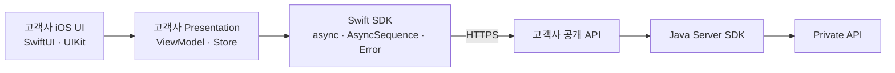
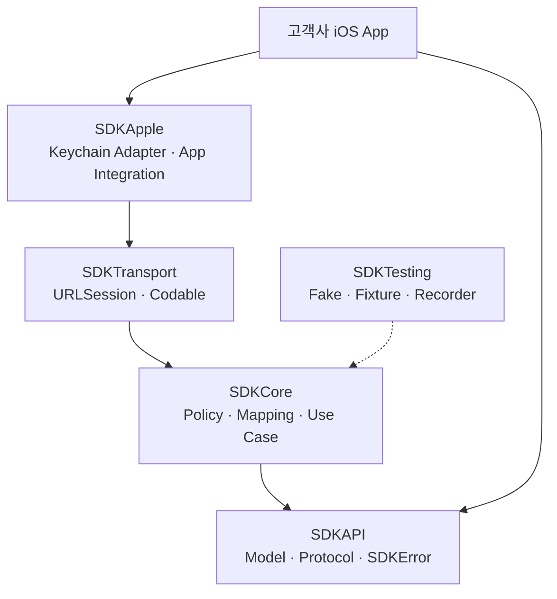
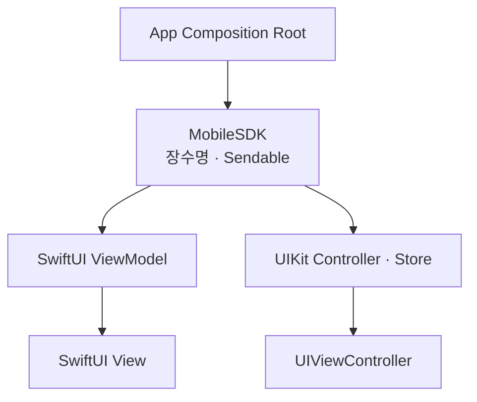
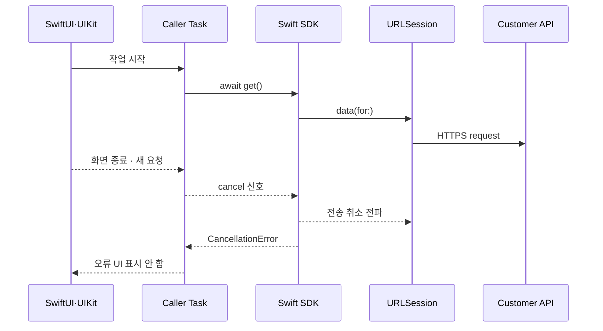
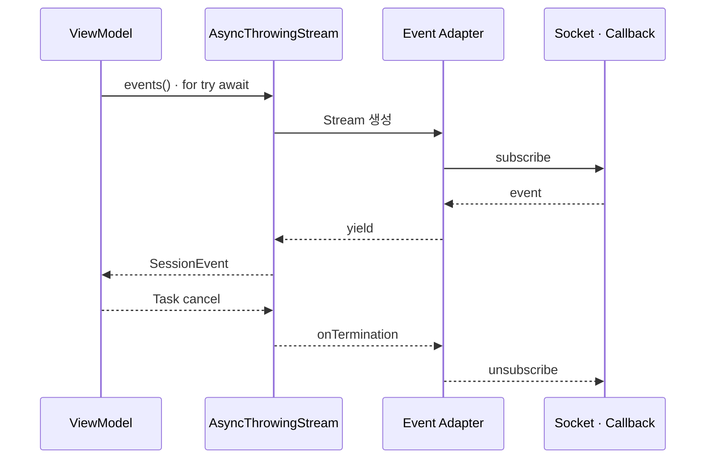
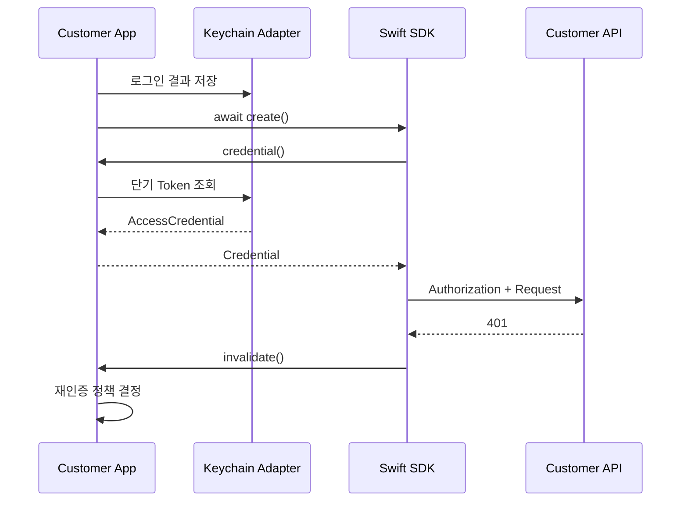
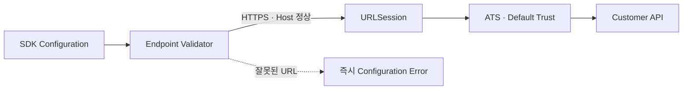
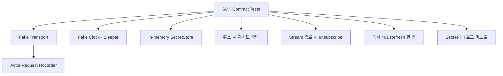

# Tistory 기술자료 초안

- 문서 ID: `BLOG-41`
- 상태: 공개 완료
- Tistory 상태: 공개
- 공개 URL: `https://aiarchitect.tistory.com/43`
- 분류: `개발 도구 · 자동화`
- 권장 제목: `고객 맞춤형 iOS 앱을 위한 Swift SDK: async/await·Task 취소와 Keychain`
- 검색 설명: `고객사가 iOS 앱을 원하는 UI와 업무 흐름으로 구현할 수 있도록 Swift SDK를 설계할 때 필요한 async/await, Task 취소, AsyncSequence, actor 격리, Keychain, SwiftUI·UIKit 수명 주기와 테스트 계약을 정리합니다.`
- 권장 태그: `Swift`, `iOS SDK`, `async await`, `Swift Concurrency`, `Task 취소`, `AsyncSequence`, `Keychain`, `모바일 SDK`
- 권장 대표 이미지: `portfolio/architecture-diagrams/01-enterprise-ai-reference-architecture.svg`
- 도식 정책: `GitHub에는 Mermaid 원본을 유지하고, Tistory 게시 시 검증된 SVG 또는 PNG로 변환해 삽입`

---

# 고객 맞춤형 iOS 앱을 위한 Swift SDK: async/await·Task 취소와 Keychain

앞선 글에서는 고객사가 Android·iOS 앱과 React 웹을 직접 설계하면서도 프라이빗 API를 노출하지 않는 멀티플랫폼 SDK 구조를 살펴봤습니다. Android 편에 이어 이번 글은 iOS Swift SDK의 공개 API와 실행 계약을 구체화합니다.

iOS SDK의 목적은 완성된 화면을 고객에게 강제하는 것이 아닙니다. SwiftUI와 UIKit 선택, 화면 구성, 내비게이션, 디자인 시스템과 로그인 경험은 고객사 앱이 결정합니다. SDK는 고객사 서버와 통신하는 업무 기능을 Swift다운 계약으로 제공합니다.



모바일 앱은 프라이빗 API Endpoint나 서버용 자격 증명을 갖지 않습니다. Swift SDK가 연결하는 대상은 고객사가 모바일 앱에 공개한 API입니다. 프라이빗 망 연결은 고객사 서버와 Java Server SDK의 책임입니다.

이 글은 특정 회사·고객·제품·내부 URL을 제외한 합성 예시로 `async/await`, 구조적 동시성, `Task` 취소, `AsyncSequence`, actor 격리, Keychain, SwiftUI·UIKit 수명 주기와 테스트 원칙을 정리합니다.

## 1. Swift SDK는 UI Framework가 아니라 기능 계약이다

고객 맞춤형 앱을 지원하려면 SDK가 제공할 것과 고객사 앱이 결정할 것을 먼저 구분해야 합니다.

| SDK가 제공 | 고객사 앱이 결정 |
|---|---|
| 안정적인 Swift API와 Model | SwiftUI·UIKit 및 화면 구조 |
| 요청·응답 직렬화와 전송 | 내비게이션과 사용자 여정 |
| 인증 자격 증명 주입 지점 | 로그인 UX와 계정 정책 |
| 오류·취소·이벤트 의미 | 오류 문구와 복구 UI |
| 동시성·Thread 안전성 | ViewModel과 UI State |
| Fake와 계약 테스트 도구 | Analytics·Crash 정책 |

SDK가 `UIViewController`를 띄우거나 특정 SwiftUI `View`를 공개 API의 중심에 두면 고객사의 앱 구조를 침범합니다. 반대로 Callback과 원시 JSON만 노출하면 모든 고객이 비동기 변환, 오류 Mapping과 취소 처리를 다시 구현해야 합니다.

적절한 경계는 **업무 기능은 SDK가 캡슐화하고, 화면과 작업 수명은 호출자가 소유하는 것**입니다.

## 2. 한 번의 결과는 `async throws`, 지속 이벤트는 `AsyncSequence`

공개 API는 작업의 시간적 성격을 드러내야 합니다.

```swift
public protocol SessionService: Sendable {
    func create(
        _ request: CreateSessionRequest,
        context: RequestContext
    ) async throws -> Session

    func get(
        id: SessionID,
        context: RequestContext
    ) async throws -> Session

    func events(
        for id: SessionID,
        context: RequestContext
    ) -> AsyncThrowingStream<SessionEvent, Error>
}
```

| 작업 성격 | 권장 계약 | 예 |
|---|---|---|
| 단일 요청·응답 | `async throws` | 생성, 조회, 수정 |
| 여러 값의 연속 전달 | `AsyncSequence` | 상태 변화, 진행 이벤트 |
| 화면이 보유하는 현재 상태 | 고객사 Observable State | Loading, Content, Error |
| 일회성 화면 효과 | 고객사 Event 처리 | Alert, Navigation |

단순 조회까지 모두 Stream으로 만들면 호출자가 종료 시점과 첫 값을 해석해야 합니다. 반대로 지속 이벤트를 `[Event]` 한 번으로 반환하면 Polling과 갱신 책임이 호출자에게 새어 나갑니다.

공개 프로토콜은 구체적인 연결 방식에 종속되지 않는 것이 좋습니다. 내부 구현이 Polling에서 Server-Sent Events나 WebSocket으로 바뀌어도 이벤트의 순서·중복·종료 계약이 같다면 앱 코드는 유지될 수 있습니다.

## 3. 모듈은 UI와 Apple Framework 의존성을 최외곽에 둔다

핵심 계약을 UIKit이나 SwiftUI에 묶지 않으면 Package 단위 테스트와 재사용이 쉬워집니다.



- `SDKAPI`: 공개 Model, Service Protocol, 안정적인 오류
- `SDKCore`: 인증 적용, Deadline, 재시도, 오류·이벤트 Mapping
- `SDKTransport`: `URLSession`, HTTP와 Wire DTO
- `SDKApple`: Keychain Adapter와 Apple 플랫폼 통합
- `SDKTesting`: Fake Transport, Fixture와 계약 테스트 도구

`View`, `UIViewController`, `UIApplication`은 기본 공개 API에 넣지 않습니다. Keychain처럼 Apple 플랫폼에 종속된 구현도 Protocol 뒤에 둡니다. 그러면 Core 테스트가 UI Runtime이나 실제 Keychain에 의존하지 않습니다.

모듈을 반드시 다섯 개의 배포 Artifact로 쪼개야 한다는 뜻은 아닙니다. 작은 SDK는 하나의 Swift Package 안에서 Target과 접근 제어로 경계를 표현할 수 있습니다. 중요한 것은 의존 방향입니다.

## 4. Client는 장수명이고 화면을 참조하지 않는다

`URLSession`과 Codec 설정을 재사용하려면 SDK Client를 요청마다 생성하지 않습니다.

```swift
let sdk = MobileSDK(
    configuration: .init(
        baseURL: URL(string: "https://mobile-api.example.com")!
    ),
    credentialProvider: credentialProvider
)
```

권장 수명은 App 또는 DI Container 범위입니다.



Client가 보관해도 되는 값:

- 검증된 불변 Endpoint와 기능 설정
- 재사용하는 `URLSession`
- `JSONEncoder`, `JSONDecoder` 정책
- 자격 증명 제공자 참조
- actor로 보호된 제한적 인증·연결 상태

Client가 보관하면 안 되는 값:

- SwiftUI `View`, `UIViewController`, `UIView`
- 화면별 선택 항목과 입력값
- 현재 화면을 의미하는 가변 전역 상태
- 요청마다 달라지는 Tenant·User·Request ID
- 서버용 Client Secret이나 프라이빗 API 주소

SDK가 생성한 `URLSession`과 Delegate를 소유한다면 종료 API에서 `finishTasksAndInvalidate()` 또는 `invalidateAndCancel()` 중 어떤 의미를 제공하는지 문서화합니다. 반대로 호출자가 주입한 Session은 SDK가 임의로 무효화하지 않습니다.

`URLSession`은 Delegate를 강하게 참조하므로 직접 만든 Session의 수명과 무효화 책임도 설계에 포함해야 합니다. 앱 Process 종료에만 정리를 기대하거나, 반대로 모든 화면 종료 때 장수명 Session을 닫는 방식은 피합니다.

## 5. `Sendable` Model과 actor로 가변 상태를 격리한다

Swift 동시성 경계를 넘는 공개 Model은 값 타입과 `Sendable`을 기본으로 설계할 수 있습니다.

```swift
public struct Session: Codable, Equatable, Sendable {
    public let id: SessionID
    public let state: SessionState
    public let createdAt: Date
}

public struct RequestContext: Sendable {
    public let tenantID: String
    public let userID: String
    public let requestID: String
}
```

공유 가변 상태는 Client 곳곳에 Lock과 Boolean으로 흩어놓지 않고 actor 안에 모읍니다.

```swift
internal actor CredentialCache {
    private var cached: AccessCredential?

    func cachedCredential() -> AccessCredential? {
        cached
    }

    func store(_ credential: AccessCredential) {
        cached = credential
    }
}
```

actor는 자신의 가변 상태 접근을 직렬화합니다. 다만 actor 메서드는 `await` 지점에서 재진입될 수 있으므로 “actor 안이니 전체 함수가 한 번에 끝난다”고 가정하면 안 됩니다. Token Refresh Single-flight처럼 한 번만 실행돼야 하는 작업은 별도 actor가 진행 중인 `Task`를 공유하고, 성공·실패·취소 후 자신이 만든 Task만 정리하도록 설계해야 합니다.

`@unchecked Sendable`은 컴파일러 검사를 끄는 탈출구입니다. 기존 Thread-safe 객체를 감싸야 해서 사용한다면 불변성이나 Lock 규칙을 주석으로 증명하고 동시성 테스트를 함께 둡니다. 편의를 위해 일반 Class에 넓게 붙이지 않습니다.

## 6. `@MainActor`는 UI 경계에만 둔다

화면 상태는 Main Actor에서 갱신하되 SDK 전체를 Main Actor에 가두지는 않습니다.

```swift
@MainActor
final class SessionViewModel: ObservableObject {
    @Published private(set) var state: ViewState = .idle

    private let sessions: any SessionService

    init(sessions: any SessionService) {
        self.sessions = sessions
    }

    func load(id: SessionID) async {
        state = .loading

        do {
            let session = try await sessions.get(
                id: id,
                context: makeRequestContext()
            )
            state = .content(session)
        } catch is CancellationError {
            // 화면이 사라진 취소를 사용자 오류로 표시하지 않는다.
        } catch {
            state = .failure(toUserMessage(error))
        }
    }
}
```

`@MainActor`는 UI State의 일관성을 보호합니다. 네트워크 요청, 큰 JSON Decode, 압축과 암호 연산까지 Main Actor에 고정하라는 의미는 아닙니다.

SDK가 진짜 비동기 `URLSession.data(for:)`를 사용하면 호출 Thread를 직접 관리할 필요가 줄어듭니다. 반면 동기 Security API, 큰 Payload 변환이나 Legacy Callback Adapter가 Main Actor를 오래 점유하지 않는지는 별도로 점검해야 합니다.

## 7. 구조적 동시성은 부모 작업이 자식 작업을 소유하게 한다

두 요청을 함께 실행해야 한다면 수명과 오류 전파가 명확한 구조적 동시성을 우선합니다.

```swift
func loadDashboard(
    sessions: any SessionService,
    context: RequestContext
) async throws -> Dashboard {
    async let active = sessions.get(
        id: .init(rawValue: "active"),
        context: context
    )
    async let recent = sessions.get(
        id: .init(rawValue: "recent"),
        context: context
    )

    return try await Dashboard(
        active: active,
        recent: recent
    )
}
```

SDK가 내부에서 목적 불명의 `Task.detached`를 만들면 호출자의 취소, 우선순위와 Task-local Context가 끊길 수 있습니다. 다음 원칙이 안전합니다.

- 공개 함수는 가능한 한 호출 중인 Task 안에서 실행한다.
- 병렬 하위 작업은 `async let`이나 Throwing Task Group으로 묶는다.
- 오래 사는 Background 작업은 소유자와 종료 API를 문서화한다.
- `Task.detached`는 격리가 필요한 명확한 이유가 있을 때만 사용한다.

Fire-and-forget 작업은 실패를 관찰하기 어렵습니다. 꼭 필요하다면 성공·실패 저장 위치, Process 종료 시 의미와 재실행 정책을 먼저 정합니다.

## 8. Task 취소는 강제 종료가 아니라 협력적 신호다

Swift에서 `Task.cancel()`은 실행 중인 코드를 즉시 제거하지 않습니다. Task에 취소 상태를 표시하고, 작업이 적절한 지점에서 이를 확인해 멈추도록 합니다.

```swift
internal func execute<Response: Decodable & Sendable>(
    _ request: URLRequest,
    as type: Response.Type
) async throws -> Response {
    do {
        try Task.checkCancellation()

        let (data, response) = try await urlSession.data(for: request)

        try Task.checkCancellation()
        try validate(response, data: data)

        return try decoder.decode(Response.self, from: data)
    } catch {
        if Task.isCancelled {
            throw CancellationError()
        }
        throw errorMapper.map(error)
    }
}
```

`Task.checkCancellation()`은 취소된 Task에서 `CancellationError`를 던집니다. CPU Loop, 여러 단계의 변환, 재시도 반복처럼 긴 작업에는 유의미한 경계마다 확인이 필요합니다. `await`가 있다고 모든 API가 같은 방식으로 취소되는 것은 아니므로 사용하는 전송·저장 Adapter의 취소 계약도 검증해야 합니다.



취소를 일반 네트워크 오류로 Mapping하면 화면이 사라질 때 “요청 실패” Alert가 나타나거나 자동 재시도가 다시 시작됩니다. 따라서 SDK는 취소 의미를 보존하고, 고객사 UI는 정상적인 수명 종료와 실제 실패를 구분해야 합니다.

### 로컬 대기 취소와 서버 업무 취소는 다르다

Task를 취소했다는 것은 앱이 더 이상 결과를 기다리지 않는다는 뜻입니다. 이미 서버가 받은 생성·결제·발송 같은 업무 명령이 자동으로 취소됐다는 뜻은 아닙니다.

| 상황 | 의미 | 필요한 계약 |
|---|---|---|
| 화면 이동으로 Task 취소 | 로컬 결과 대기 중단 | 전송 중단·결과 폐기 |
| Timeout·Deadline 만료 | 허용 시간 초과 | 결과 불명 상태 정의 |
| 서버 업무 취소 | 도메인 상태 변경 | 별도 Cancel API |
| 쓰기 응답 유실 | 처리 여부 불명 | 멱등 Key와 상태 조회 |

쓰기 요청은 Task 취소만 믿지 말고 Idempotency Key, 서버 상태 조회와 별도 취소 API로 복구 경로를 설계해야 합니다.

## 9. 재시도는 취소·Deadline·멱등성을 함께 지킨다

재시도 Loop는 Task 취소를 무시하면 안 됩니다.

```swift
internal func executeWithRetry<T: Sendable>(
    policy: RetryPolicy,
    operation: @Sendable () async throws -> T
) async throws -> T {
    var attempt = 1

    while true {
        try Task.checkCancellation()

        do {
            return try await operation()
        } catch {
            if Task.isCancelled {
                throw CancellationError()
            }

            guard let delay = policy.nextDelay(
                after: error,
                attempt: attempt
            ) else {
                throw error
            }

            try await sleeper.sleep(for: delay)
            attempt += 1
        }
    }
}
```

`sleeper`와 Clock을 주입하면 테스트에서 실제 시간을 기다리지 않아도 됩니다. 재시도 정책에는 다음 입력이 필요합니다.

- HTTP Method와 업무 명령의 멱등성
- 서버가 제공한 `Retry-After`
- 전체 Deadline의 남은 시간
- 현재 Task의 취소 상태
- 지수 Backoff와 Jitter
- 최대 시도 횟수와 오류 분류

POST라고 무조건 재시도 금지이거나, 네트워크 오류라고 무조건 재시도 가능인 것은 아닙니다. 서버와 합의한 Idempotency Key가 있는지, 응답 유실 후 동일 명령을 다시 보내도 안전한지를 기준으로 결정합니다.

SDK가 화면 모르게 무제한 Offline Queue를 운영하는 것도 피합니다. 로컬 저장, 사용자 전환, 로그아웃, 중복 제출과 개인정보 보존 정책까지 필요하기 때문입니다.

## 10. `AsyncStream` Adapter는 종료와 Buffer를 계약한다

Callback이나 Delegate 기반 이벤트를 `AsyncSequence`로 바꿀 때는 값 전달보다 종료 처리가 더 중요합니다.

```swift
internal func eventStream(
    id: SessionID
) -> AsyncThrowingStream<SessionEvent, Error> {
    AsyncThrowingStream(
        bufferingPolicy: .bufferingNewest(32)
    ) { continuation in
        let token = source.subscribe(
            sessionID: id,
            onEvent: { event in
                _ = continuation.yield(event)
            },
            onFailure: { error in
                continuation.finish(throwing: error)
            },
            onComplete: {
                continuation.finish()
            }
        )

        continuation.onTermination = { @Sendable _ in
            source.unsubscribe(token)
        }
    }
}
```

`onTermination`에서 Subscription, Socket, Timer를 해제해야 수집 Task가 취소된 뒤에도 Producer가 남지 않습니다. 이 Closure는 취소 과정에서 호출될 수 있으므로 Blocking 대기나 교착을 유발하는 정리 코드를 넣지 않습니다.



Buffer 정책은 데이터 의미에 따라 정합니다.

| 이벤트 성격 | 가능한 정책 | 주의점 |
|---|---|---|
| 최신 진행률만 중요 | `bufferingNewest` | 중간 값 유실 허용을 문서화 |
| 모든 업무 이벤트 중요 | Durable 조회·Cursor | 메모리 Stream만 신뢰하지 않음 |
| 고빈도 Telemetry | 제한 Buffer·집계 | 느린 소비자 정책 필요 |
| 연결 상태 | 현재 상태 + 재연결 이벤트 | Replay 의미를 명시 |

`yield` 결과를 버리는 예시는 흐름을 단순화한 것입니다. 운영 구현은 값이 Dropped 또는 Terminated 되었는지 계측하고, 업무상 유실이 허용되지 않는 이벤트를 작은 메모리 Buffer 하나로 보장하지 않습니다.

또한 Stream이 Cold인지 Hot인지, 여러 Iterator가 연결을 공유하는지, 재연결 때 중복이 가능한지, 정상 완료와 오류 완료가 무엇인지 공개 문서에 명시합니다.

## 11. SwiftUI와 UIKit이 작업 수명을 소유한다

SwiftUI에서는 `.task` 또는 `.task(id:)`를 화면 수명과 연결할 수 있습니다.

```swift
struct SessionScreen: View {
    let id: SessionID
    @ObservedObject var viewModel: SessionViewModel

    var body: some View {
        SessionContent(state: viewModel.state)
            .task(id: id) {
                await viewModel.load(id: id)
            }
    }
}
```

SwiftUI는 View가 사라지기 전에 작업이 끝나지 않았거나 `id`가 바뀌면 연결된 Task를 취소할 수 있습니다. SDK는 이 신호를 보존해야 합니다. `.task`가 종료된다는 이유만으로 서버 업무까지 취소됐다고 간주해서는 안 됩니다.

UIKit은 작업 Handle을 소유하고 더 이상 결과가 필요 없을 때 명시적으로 취소합니다.

```swift
@MainActor
final class SessionViewController: UIViewController {
    private var loadTask: Task<Void, Never>?

    override func viewDidAppear(_ animated: Bool) {
        super.viewDidAppear(animated)

        loadTask?.cancel()
        loadTask = Task { [weak self] in
            guard let self else { return }
            await self.load()
        }
    }

    override func viewDidDisappear(_ animated: Bool) {
        super.viewDidDisappear(animated)

        let dismissed = isBeingDismissed
            || navigationController?.isBeingDismissed == true

        if isMovingFromParent || dismissed {
            loadTask?.cancel()
            loadTask = nil
        }
    }
}
```

모든 `viewDidDisappear`에서 무조건 취소할지는 화면 정책에 따라 다릅니다. 다른 Controller가 잠시 덮은 경우에도 작업을 유지해야 할 수 있습니다. SDK가 이 결정을 대신하지 않습니다.

또한 Task Closure가 작업 중 Controller를 참조할 수 있으므로 `deinit`만 정리 지점으로 믿지 않습니다. Navigation Pop, Modal Dismiss 또는 별도 Store의 명시적인 종료처럼 소유자가 아직 살아 있는 시점에 취소해야 합니다.

이벤트 수집 Task도 같은 원칙을 따릅니다.

```swift
eventTask = Task { [weak self] in
    guard let self else { return }

    do {
        for try await event in sessions.events(
            for: id,
            context: context
        ) {
            try Task.checkCancellation()
            self.apply(event)
        }
    } catch is CancellationError {
        // 정상적인 수명 종료
    } catch {
        self.showEventError(error)
    }
}
```

## 12. 오류는 안정적인 SDK 계약으로 정규화한다

고객사 앱이 `URLError`, Decode 오류와 내부 HTTP Library 예외를 모두 알아야 한다면 SDK 경계가 무너집니다.

```swift
public enum SDKError: Error, Sendable {
    case configuration(
        code: String
    )
    case authentication(
        code: String,
        requestID: String?
    )
    case forbidden(
        code: String,
        requestID: String?
    )
    case rateLimited(
        code: String,
        retryAfter: Duration?,
        requestID: String?
    )
    case network(
        code: String,
        requestID: String?
    )
    case protocolViolation(
        code: String,
        requestID: String?
    )
    case server(
        code: String,
        requestID: String?
    )
}
```

공개 오류에는 앱이 분기할 수 있는 안정적인 `code`, 사용자에게 노출하지 않는 추적용 `requestID`, 안전한 재시도 Hint를 담습니다. 원본 응답 Body, Token, Cookie, 내부 URL은 오류 설명에 넣지 않습니다.

`CancellationError`는 `SDKError.network`로 바꾸지 않고 그대로 보존합니다. 고객사 앱은 취소를 실패 화면이나 Crash Report 대상으로 오해하지 않아야 합니다.

알 수 없는 서버 오류 Code나 Enum 값이 추가되어도 앱이 즉시 깨지지 않도록 Unknown Fallback도 설계합니다. 공개 Model이 서버 Wire DTO와 완전히 같은 Enum을 쓰는 것은 호환성에 불리할 수 있습니다.

## 13. 자격 증명 소유자는 고객사 앱이고 SDK는 공급 지점을 제공한다

로그인 화면, SSO, 생체 인증, 로그아웃과 계정 전환은 고객사 앱의 정책입니다. SDK는 현재 요청에 필요한 단기 자격 증명을 얻는 Protocol을 제공합니다.

```swift
public struct AccessCredential: Sendable {
    public let token: String
    public let expiresAt: Date
}

public protocol CredentialProvider: Sendable {
    func credential() async throws -> AccessCredential
    func invalidate(_ credential: AccessCredential) async
}
```



SDK가 고객사 로그인 UI를 띄우거나 Password를 수집하지 않습니다. 401 응답 후에도 SDK가 무한 Refresh Loop를 돌기보다 한 번의 갱신·재시도 범위와 최종 인증 오류를 계약합니다.

동시에 여러 요청이 만료 Token을 발견하면 Refresh가 폭주할 수 있습니다. 고객사 Provider 또는 SDK 인증 계층의 actor가 진행 중 Refresh Task를 공유하는 Single-flight 패턴을 적용할 수 있습니다.

## 14. Keychain은 작은 Secret을 위한 저장소다

Apple Keychain Services는 Password, Cryptographic Key 같은 작은 Secret을 암호화된 저장소에 보관하는 수단입니다. 일반 설정이나 큰 응답 Payload를 저장하는 Database 대용으로 사용하지 않습니다.

```swift
protocol SecretStore: Sendable {
    func read(
        service: String,
        account: String
    ) async throws -> Data?

    func write(
        _ value: Data,
        service: String,
        account: String,
        accessibility: SecretAccessibility
    ) async throws

    func delete(
        service: String,
        account: String
    ) async throws
}
```

Keychain Adapter는 `SecItemAdd`, `SecItemCopyMatching`, `SecItemUpdate`, `SecItemDelete`의 `OSStatus`를 확인하고, 중복·미존재·접근 거부를 안정적인 저장 오류로 변환합니다.

`kSecAttrAccessible` 선택은 보안과 Background 접근성의 균형입니다. 예를 들어 Device가 잠긴 동안 Background 작업이 Token에 접근해야 하는지, 새 Device로 Migration되어도 되는지에 따라 정책이 달라집니다. SDK가 모든 고객에게 한 값을 강제하기보다 선택지와 기본값을 문서화합니다.

Keychain 사용 시 확인할 경계:

- Token·Password·Key처럼 작은 Secret만 저장한다.
- `service`, `account`, Access Group의 Namespace 충돌을 막는다.
- 로그아웃·계정 전환 때 정확한 Item을 삭제한다.
- Accessibility와 Device Migration 정책을 명시한다.
- App Extension 공유가 필요할 때만 Keychain Access Group을 사용한다.
- Keychain 값을 로그, Analytics, Crash Metadata에 넣지 않는다.

가장 중요한 점은 **Keychain에 저장했다고 모바일 앱이 서버 Secret을 안전하게 보유할 수 있는 것은 아니라는 것**입니다. 앱 Binary와 실행 환경은 고객 Device에 있으므로 프라이빗 API용 Client Secret이나 서버 서명 Key를 배포하지 않습니다. 모바일에는 사용자별 단기 자격 증명만 두고 서버 Secret은 고객사 서버와 Java Server SDK 경계에 둡니다.

## 15. Endpoint·TLS·ATS 검증은 Builder에서 빠르게 실패시킨다

SDK는 잘못된 Endpoint를 첫 요청까지 숨기지 말고 생성 시점에 검증합니다.

```swift
internal func validateBaseURL(_ url: URL) throws {
    guard
        url.scheme?.lowercased() == "https",
        url.host != nil,
        url.user == nil,
        url.password == nil,
        url.query == nil,
        url.fragment == nil
    else {
        throw SDKError.configuration(
            code: "INVALID_BASE_URL"
        )
    }
}
```

App Transport Security는 표준 URL Loading System에서 안전한 연결을 기본으로 요구합니다. SDK 문서는 필요한 Domain과 TLS 요구사항을 제시하되 고객사 App의 `Info.plist`에 광범위한 예외를 자동으로 추가하지 않습니다.

피해야 할 설정:

- `NSAllowsArbitraryLoads = true`를 설치 가이드에 기본값으로 제시
- 인증서 검증을 항상 성공시키는 Challenge Handler
- 개발용 Self-signed 인증서를 운영 Build에 포함
- HTTP Endpoint Fallback
- Base URL에 사용자 정보·Token·Query를 허용

인증서 Pinning이 필요한 환경은 만료·교체·백업 Key·긴급 해제 절차까지 함께 설계해야 합니다. 단순히 인증서 한 장을 App에 고정하면 정상 교체 때 전체 고객 App이 연결 불능이 될 수 있습니다.



## 16. Request Context는 Header Map이 아니라 타입 계약이다

Tenant, User, Request ID와 Locale을 호출자에게 받아야 할 수 있습니다. 이를 `[String: String]` 전체로 열어두면 금지된 Header와 개인정보가 SDK 내부로 들어옵니다.

```swift
public struct RequestContext: Sendable {
    public let tenantID: String
    public let userID: String
    public let requestID: String
    public let locale: String?

    public init(
        tenantID: String,
        userID: String,
        requestID: String,
        locale: String? = nil
    ) throws {
        self.tenantID = try Identifier.validate(tenantID)
        self.userID = try Identifier.validate(userID)
        self.requestID = try Identifier.validate(requestID)
        self.locale = locale
    }
}
```

SDK가 책임지는 일:

- 길이·문자 집합 검증
- 허용 Header로 안전하게 변환
- 요청 단위 불변 Snapshot 사용
- Log와 Metric에서 식별자 최소화·Masking

호출자가 책임지는 일:

- 현재 사용자·Tenant의 정확한 선택
- 로그인과 계정 전환 정책
- 개인정보 처리 근거와 보존 정책

Client의 가변 전역 `currentTenant`에 의존하면 동시에 실행된 요청이 다른 Tenant Context를 사용할 수 있습니다. 요청마다 명시적인 불변 Context를 전달하는 편이 안전합니다.

## 17. 테스트는 성공 응답보다 취소와 경계를 먼저 검증한다

실제 서버와 Device에만 의존하면 취소·재시도·Stream 종료를 재현하기 어렵습니다. 전송과 시간을 Protocol 뒤에 두고 Deterministic Fake를 제공합니다.

```swift
protocol Transport: Sendable {
    func execute(
        _ request: TransportRequest
    ) async throws -> TransportResponse
}

actor RequestRecorder {
    private var requests: [TransportRequest] = []

    func append(_ request: TransportRequest) {
        requests.append(request)
    }

    func snapshot() -> [TransportRequest] {
        requests
    }
}
```



필수 테스트 항목:

1. `Task.cancel()` 후 재시도와 Backoff가 중단되는가
2. 취소가 `SDKError.network`가 아니라 `CancellationError`로 보존되는가
3. Stream 수집 종료 후 Subscription과 Socket이 정리되는가
4. Buffer 초과 시 Drop 정책이 문서와 일치하는가
5. 동시에 발생한 401이 Token Refresh 하나로 합쳐지는가
6. 로그아웃·계정 전환 후 이전 Keychain Item을 읽지 않는가
7. Endpoint가 HTTP, User Info, Query를 포함하면 생성에 실패하는가
8. 알 수 없는 서버 Error Code와 Enum 값을 안전하게 처리하는가
9. 요청·오류·Metric에 Token과 개인정보가 남지 않는가
10. 호출자가 주입한 `URLSession`을 SDK 종료가 무효화하지 않는가

테스트에서 실제 `Task.sleep`으로 수 초를 기다리면 느리고 불안정합니다. Clock 또는 Sleeper를 주입해 시간 전진과 취소 시점을 제어합니다.

Thread Sanitizer와 엄격한 동시성 검사는 actor 밖 공유 상태와 잘못된 `Sendable` 가정을 찾는 데 유용합니다. 다만 도구 실행이 계약 테스트를 대신하지는 않습니다.

## 18. 배포 형식은 Swift Package를 기본으로, Binary는 선택한다

소스 배포가 가능하다면 Swift Package Manager는 의존성, Target과 Version을 표현하기 좋은 기본 선택입니다.

```swift
// Package.swift
import PackageDescription

let package = Package(
    name: "MobileSDK",
    platforms: [
        .iOS(.v16)
    ],
    products: [
        .library(
            name: "MobileSDK",
            targets: ["MobileSDK"]
        ),
        .library(
            name: "MobileSDKTesting",
            targets: ["MobileSDKTesting"]
        )
    ],
    targets: [
        .target(name: "MobileSDK"),
        .target(
            name: "MobileSDKTesting",
            dependencies: ["MobileSDK"]
        ),
        .testTarget(
            name: "MobileSDKTests",
            dependencies: ["MobileSDK"]
        )
    ]
)
```

Closed-source 배포가 필요하면 XCFramework를 Swift Package의 Binary Target으로 제공할 수 있습니다. 이 경우 지원하는 iOS·Xcode·Swift Version과 Device·Simulator Slice를 Compatibility Matrix로 관리합니다. Remote Binary는 Archive Checksum도 검증합니다.

| 배포 방식 | 장점 | 운영 부담 |
|---|---|---|
| Source Swift Package | 통합·Debug·호환성 확인 용이 | 소스 공개·접근 제어 정책 |
| Binary XCFramework | 구현 비공개 | Slice·ABI·도구 버전 관리 |
| 혼합 Package | 공개 Adapter + 비공개 Core 가능 | 배포 Pipeline 복잡도 증가 |

모든 Release에서 최소한 다음을 자동 검증합니다.

- 지원 Xcode·Swift 조합 Build
- 최소 iOS Version Build
- Device·Simulator Integration
- Public API Diff와 SemVer 판정
- Symbol·Privacy Manifest·License 확인
- Binary Archive Checksum
- Sample App의 SwiftUI·UIKit 흐름

## 19. 고객사 통합 문서에 반드시 적을 것

좋은 SDK는 코드만 전달하지 않습니다. 최소 통합 문서에는 다음 내용이 필요합니다.

### 시작하기

- 지원 iOS·Xcode·Swift Version
- Swift Package 추가 방법과 Version 고정 정책
- `MobileSDK` 생성 위치와 권장 수명
- 고객사 공개 API Endpoint 형식
- 첫 `async` 요청과 오류 처리 예제

### 동시성·수명

- 공개 Type의 `Sendable`·Actor 격리
- SwiftUI `.task`와 UIKit Task 소유 예제
- 취소 시 서버 업무 상태의 의미
- Stream의 Cold·Hot, Buffer, Replay와 종료 계약
- SDK 소유 자원과 종료 API

### 인증·보안

- `CredentialProvider` 구현 예제
- Keychain Namespace·Accessibility·로그아웃 정책
- 모바일에 넣으면 안 되는 서버 Secret
- ATS·TLS 요구사항과 필요한 Domain
- Log에 포함하지 않는 필드

### 운영·호환성

- `SDKError.code`와 복구 가능 여부
- Retry·Deadline·Idempotency 정책
- Version Compatibility Matrix
- Breaking Change와 Deprecation 기간
- 장애 진단용 Request ID 수집 방법

## 20. 구현 체크리스트

### API와 동시성

- [ ] 단일 결과는 `async throws`, 지속 이벤트는 `AsyncSequence`인가
- [ ] 공개 Model과 Closure의 `Sendable` 경계가 명확한가
- [ ] 공유 가변 상태를 actor 또는 검증된 동기화로 보호하는가
- [ ] SDK 전체를 불필요하게 `@MainActor`로 지정하지 않았는가
- [ ] 목적 불명의 `Task.detached`와 Fire-and-forget 작업이 없는가

### 취소와 Lifecycle

- [ ] CPU Loop, Retry, Decode 전후에 취소 확인 지점이 있는가
- [ ] `CancellationError`를 일반 네트워크 오류로 바꾸지 않는가
- [ ] SwiftUI·UIKit이 화면 Task를 소유하는가
- [ ] Stream `onTermination`에서 Producer를 정리하는가
- [ ] 로컬 Task 취소와 서버 업무 취소를 구분하는가

### 인증과 보안

- [ ] 모바일은 고객사 공개 API만 호출하는가
- [ ] 서버용 Secret과 프라이빗 Endpoint가 SDK에 없는가
- [ ] Keychain에는 작은 사용자 Secret만 저장하는가
- [ ] Accessibility·Migration·Access Group 정책이 문서화됐는가
- [ ] HTTPS와 ATS 기본 Trust를 약화하지 않는가
- [ ] Token·PII가 로그와 오류에 남지 않는가

### 테스트와 배포

- [ ] Fake Transport·Clock·SecretStore가 있는가
- [ ] 취소·Stream 종료·Refresh Single-flight를 검증하는가
- [ ] 고객사 주입 자원을 SDK가 임의로 종료하지 않는가
- [ ] 지원 iOS·Xcode·Swift Matrix를 자동 Build하는가
- [ ] Source Package 또는 XCFramework의 무결성을 검증하는가

## 마무리

고객 맞춤형 iOS SDK의 핵심은 Swift 문법을 감싼 HTTP Client가 아닙니다. **고객사 UI가 작업 수명을 소유하고, SDK는 취소·이벤트·오류·인증의 의미를 일관되게 지키는 것**이 핵심입니다.

이를 위해서는 다음 경계가 필요합니다.

1. 모바일 SDK는 고객사 공개 API만 호출한다.
2. 한 번의 결과와 지속 이벤트를 `async throws`와 `AsyncSequence`로 구분한다.
3. 공유 상태는 `Sendable`과 actor로 보호하고 UI만 `@MainActor`에 둔다.
4. Task 취소를 협력적 신호로 처리하고 서버 업무 취소와 구분한다.
5. Keychain에는 사용자별 작은 Secret만 저장하며 서버 Secret은 두지 않는다.
6. SwiftUI·UIKit Lifecycle, Stream 종료와 주입 자원 소유권을 호출자에게 명확히 돌려준다.
7. 취소·재시도·인증 경쟁을 Fake와 가상 시간으로 반복 검증한다.

이 경계가 지켜지면 고객사는 자신만의 SwiftUI·UIKit 화면을 자유롭게 구현하면서도 프라이빗 API의 보안과 공통 업무 계약을 유지할 수 있습니다.

---

## 함께 읽기

- [프라이빗 API를 보호하는 멀티플랫폼 SDK 아키텍처](https://aiarchitect.tistory.com/40)
- [프라이빗 API를 연결하는 Java Server SDK 설계](https://aiarchitect.tistory.com/41)
- [고객사 서버에 SDK를 연결하는 Spring Boot Starter](https://aiarchitect.tistory.com/38)
- [프라이빗 망 Server SDK 운영 안정성](https://aiarchitect.tistory.com/39)
- [고객 맞춤형 Android 앱을 위한 Kotlin SDK](https://aiarchitect.tistory.com/42)

## 공식 참고 자료

- Apple Developer Documentation, [Task](https://developer.apple.com/documentation/swift/task)
- Apple Developer Documentation, [Task.checkCancellation()](https://developer.apple.com/documentation/swift/task/checkcancellation())
- Apple Developer Documentation, [Sendable](https://developer.apple.com/documentation/swift/sendable)
- Apple Developer Documentation, [MainActor](https://developer.apple.com/documentation/swift/mainactor)
- Apple Developer Documentation, [AsyncStream](https://developer.apple.com/documentation/swift/asyncstream)
- Apple Developer Documentation, [AsyncStream.Continuation.onTermination](https://developer.apple.com/documentation/swift/asyncstream/continuation/ontermination)
- Apple Developer Documentation, [View.task(id:priority:\_:)](https://developer.apple.com/documentation/swiftui/view/task(id:priority:_:))
- Apple Developer Documentation, [URLSession](https://developer.apple.com/documentation/foundation/urlsession)
- Apple Developer Documentation, [URLSession.data(for:delegate:)](https://developer.apple.com/documentation/foundation/urlsession/data(for:delegate:))
- Apple Developer Documentation, [Keychain Services](https://developer.apple.com/documentation/security/keychain-services)
- Apple Developer Documentation, [Restricting Keychain Item Accessibility](https://developer.apple.com/documentation/security/restricting-keychain-item-accessibility)
- Apple Developer Documentation, [Preventing Insecure Network Connections](https://developer.apple.com/documentation/security/preventing-insecure-network-connections)
- Apple Developer Documentation, [Distributing Binary Frameworks as Swift Packages](https://developer.apple.com/documentation/xcode/distributing-binary-frameworks-as-swift-packages)
- Swift.org, [Documentation](https://www.swift.org/documentation/)
- Swift Evolution, [Structured Concurrency](https://github.com/swiftlang/swift-evolution/blob/main/proposals/0304-structured-concurrency.md)
- Swift Evolution, [Async/Await](https://github.com/swiftlang/swift-evolution/blob/main/proposals/0296-async-await.md)
- Swift Evolution, [AsyncSequence](https://github.com/swiftlang/swift-evolution/blob/main/proposals/0298-asyncsequence.md)
- Swift Evolution, [Sendable and @Sendable Closures](https://github.com/swiftlang/swift-evolution/blob/main/proposals/0302-concurrent-value-and-concurrent-closures.md)
- Swift Evolution, [Global Actors](https://github.com/swiftlang/swift-evolution/blob/main/proposals/0316-global-actors.md)

> 이 글은 공식 문서를 기반으로 한 일반화된 설계 예시입니다.
> 실제 적용 시에는 사용하는 iOS·Xcode·Swift Version, 고객사 인증 체계,
> 서버 API 계약과 보안 정책에 맞춘 별도 검증이 필요합니다.
