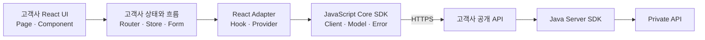
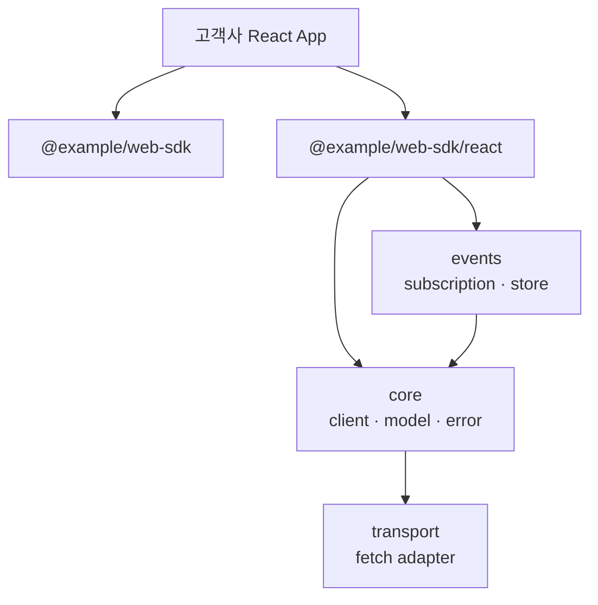
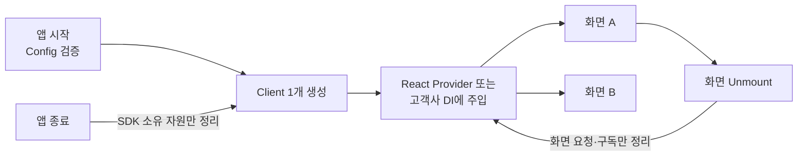
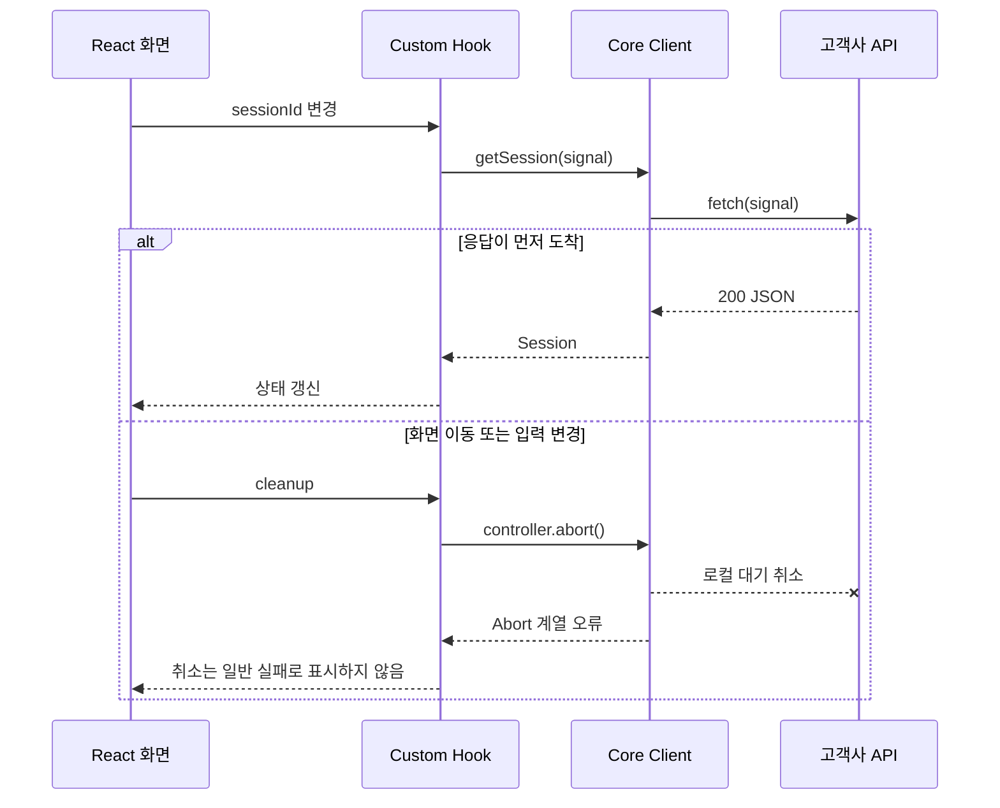
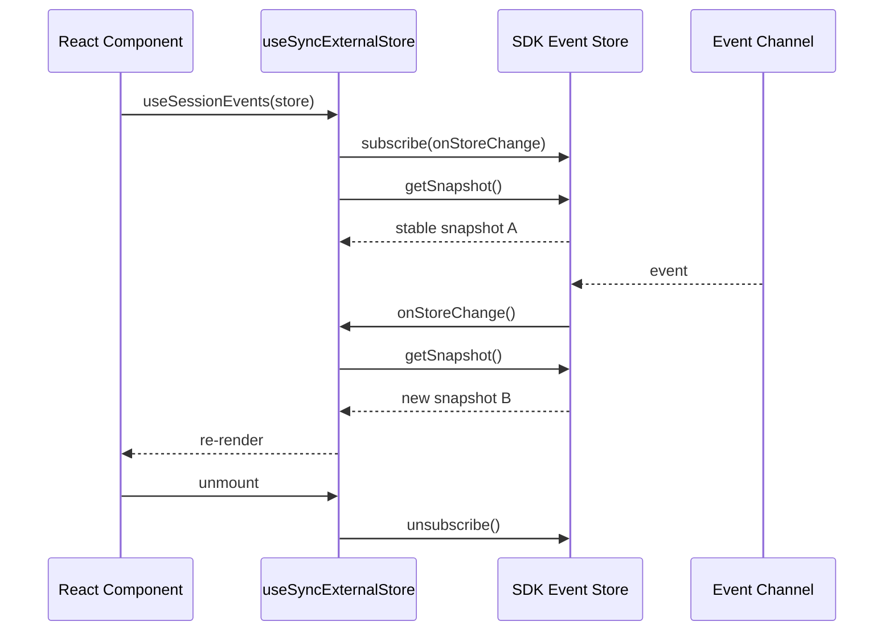
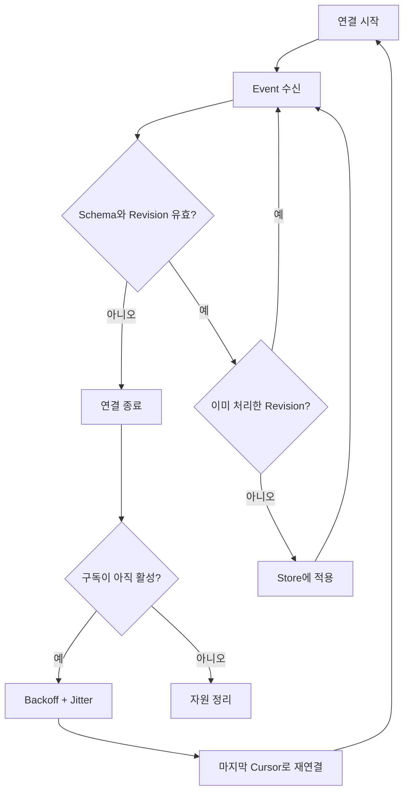
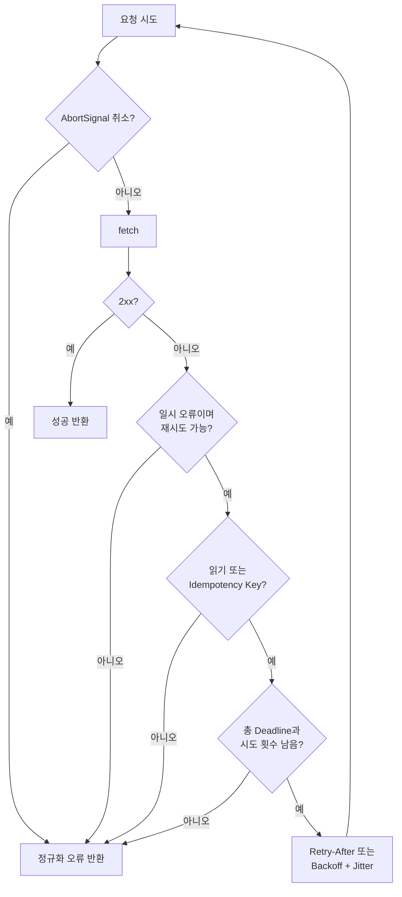
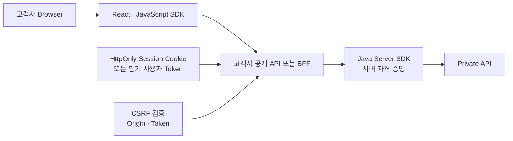
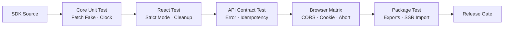

# Tistory 기술자료 초안

- 문서 ID: `BLOG-42`
- 상태: 공개 완료
- Tistory 상태: 공개
- 공개 URL: `https://aiarchitect.tistory.com/44`
- 분류: `개발 도구 · 자동화`
- 권장 제목: `고객 맞춤형 웹을 위한 React JavaScript SDK: Core Client·Hook과 이벤트`
- 검색 설명: `고객사가 React 웹을 원하는 UI와 상태 구조로 구현할 수 있도록 JavaScript SDK를 설계할 때 필요한 Core Client, Custom Hook, useSyncExternalStore, AbortSignal, 이벤트 구독, SSR, CORS·쿠키 인증과 패키지 배포 계약을 정리합니다.`
- 권장 태그: `React`, `JavaScript SDK`, `Custom Hook`, `AbortSignal`, `useSyncExternalStore`, `CORS`, `웹 SDK`, `프런트엔드`
- 권장 대표 이미지: `portfolio/architecture-diagrams/01-enterprise-ai-reference-architecture.svg`
- 도식 정책: `GitHub에는 Mermaid 원본을 유지하고, Tistory 게시 시 검증된 SVG 또는 PNG로 변환해 삽입`

---

# 고객 맞춤형 웹을 위한 React JavaScript SDK: Core Client·Hook과 이벤트

앞선 글에서는 고객사가 Android·iOS 앱을 직접 설계하면서도 공통 업무 기능과 프라이빗 API 경계를 유지하는 Kotlin·Swift SDK를 살펴봤습니다. 이번 글은 같은 목적을 React 웹으로 확장합니다.

웹 SDK의 목적은 완성된 화면이나 전역 상태 관리 방식을 고객사에 강제하는 것이 아닙니다. Router, 상태 관리 도구, 디자인 시스템, Form과 오류 문구는 고객사가 선택합니다. SDK는 고객사 공개 API를 호출하는 업무 기능을 JavaScript다운 계약으로 제공하고, React Adapter는 그 계약을 Hook과 외부 Store 구독으로 연결합니다.



브라우저는 프라이빗 API Endpoint나 서버용 Secret을 갖지 않습니다. JavaScript SDK가 연결하는 대상은 고객사가 웹에 공개한 API이며, 프라이빗 망 연결은 고객사 서버와 Java Server SDK가 담당합니다.

이 글은 특정 회사·고객·제품·내부 URL을 제외한 합성 예시로 Core Client, Custom Hook, `AbortSignal`, `useSyncExternalStore`, 이벤트 구독, SSR, CORS·쿠키 인증과 패키지 배포 원칙을 정리합니다.

## 1. React SDK를 하나의 거대한 Hook으로 만들지 않는다

React를 사용하는 고객만 있더라도 네트워크 Client와 React Adapter는 분리하는 편이 좋습니다.

| 계층 | 책임 | React 의존 |
|---|---|---|
| Core Model | Request·Response·Error 계약 | 없음 |
| Core Client | 전송·인증·취소·재시도 | 없음 |
| Event Adapter | 구독·Snapshot·정리 | 없음 |
| React Adapter | Hook·Context·외부 Store 연결 | 있음 |
| 고객사 UI | 화면·상태·오류 문구·사용자 여정 | 고객사 선택 |

Core가 React에 의존하지 않으면 다음 이점이 생깁니다.

- React 밖의 Worker, 테스트, Node 기반 도구에서도 같은 Client를 사용할 수 있습니다.
- React Version 변경이 전송 계층의 Breaking Change로 번지지 않습니다.
- 고객사는 TanStack Query, Redux, Zustand 또는 자체 상태 구조를 선택할 수 있습니다.
- Hook 테스트와 HTTP 계약 테스트를 분리할 수 있습니다.



React Adapter는 편의 계층이지 유일한 사용 경로가 아닙니다. 공개 API의 중심은 테스트 가능한 Core Client여야 합니다.

## 2. Core Client는 명시적인 구성과 장수명 수명을 갖는다

페이지 Render마다 Client를 새로 만들면 인증 Cache, Connection 재사용, 이벤트 구독과 요청 상관관계가 흔들립니다. 반대로 Module Import 시 전역 Singleton을 만들면 여러 고객 환경·테스트·SSR 요청이 상태를 공유할 수 있습니다.

권장 방식은 Application Composition Root에서 한 번 구성하고 필요한 계층에 주입하는 것입니다.

```javascript
export function createWebSdkClient({
  baseUrl,
  credentialProvider,
  fetchImpl = globalThis.fetch,
  defaultTimeoutMs = 10_000,
  credentials = "same-origin",
}) {
  const endpoint = validateEndpoint(baseUrl);
  const requestCredentials = validateCredentials(credentials);

  return Object.freeze({
    createSession(request, options = {}) {
      return sendJson({
        fetchImpl,
        endpoint,
        credentialProvider,
        method: "POST",
        path: "v1/sessions",
        body: validateCreateSessionRequest(request),
        signal: options.signal,
        timeoutMs: options.timeoutMs ?? defaultTimeoutMs,
        idempotencyKey: options.idempotencyKey,
        credentials: requestCredentials,
      });
    },

    getSession(sessionId, options = {}) {
      return sendJson({
        fetchImpl,
        endpoint,
        credentialProvider,
        method: "GET",
        path: `v1/sessions/${encodeURIComponent(sessionId)}`,
        signal: options.signal,
        timeoutMs: options.timeoutMs ?? defaultTimeoutMs,
        credentials: requestCredentials,
      });
    },
  });
}
```

`fetchImpl`, Credential Provider와 Clock 같은 외부 자원을 주입하면 브라우저 전역에 직접 결합하지 않고 테스트할 수 있습니다. SDK가 고객사가 주입한 자원을 임의로 종료하거나 전역 `fetch`를 Monkey Patch해서는 안 됩니다.



화면 Unmount는 Client 전체 종료 신호가 아닙니다. 화면이 소유한 요청과 구독만 취소해야 합니다.

## 3. 한 번의 결과는 Promise, 지속 변경은 구독 계약으로 나눈다

JavaScript에서 단일 요청·응답은 `Promise`가 자연스럽습니다. 여러 번 도착하는 이벤트는 `Promise` 하나로 표현하지 않습니다.

| 작업 성격 | 권장 계약 | 예 |
|---|---|---|
| 단일 결과 | `Promise<T>` | 생성, 조회, 수정 |
| 취소 가능한 단일 결과 | `Promise<T>` + `AbortSignal` | 검색, 긴 처리 |
| 지속 변경 | `subscribe(listener) -> unsubscribe` | 상태 변경 알림 |
| 소비 속도 제어가 필요한 Stream | `AsyncIterable<T>` | 큰 결과, 순차 이벤트 |

```javascript
const session = await client.createSession(
  { title: "합성 예시" },
  {
    signal,
    idempotencyKey: crypto.randomUUID(),
  },
);

const unsubscribe = client.sessionEvents.subscribe(
  session.id,
  event => {
    // 고객사 Store 또는 UI 정책에 맞게 처리
  },
  error => {
    // 고객사 오류 UX로 변환
  },
);

// 화면 또는 업무 흐름 종료 시 반드시 호출
unsubscribe();
```

SDK는 Event 이름, 순서, 중복 가능성, 재연결 후 누락 복구, Buffer 한도와 종료 조건을 문서화해야 합니다. 단순히 `onMessage` Callback만 제공하면 느린 소비자와 재연결 중복을 다루기 어렵습니다.

## 4. `AbortSignal`을 공개 취소 계약으로 사용한다

브라우저 Fetch는 `AbortSignal`을 취소 신호로 받습니다. SDK도 별도 Boolean Flag보다 이 표준 계약을 공개 API에 그대로 전달하는 편이 좋습니다.

```javascript
async function sendJson({
  fetchImpl,
  endpoint,
  credentialProvider,
  method,
  path,
  body,
  signal,
  timeoutMs,
  idempotencyKey,
  credentials,
}) {
  const timeoutController = new AbortController();
  const timeoutId = setTimeout(
    () => timeoutController.abort(new DOMException("Deadline exceeded", "TimeoutError")),
    timeoutMs,
  );

  const requestController = new AbortController();
  const abortFromCaller = () => requestController.abort(signal.reason);
  const abortFromTimeout = () => requestController.abort(timeoutController.signal.reason);

  signal?.addEventListener("abort", abortFromCaller, { once: true });
  timeoutController.signal.addEventListener("abort", abortFromTimeout, { once: true });

  try {
    signal?.throwIfAborted();

    const token = await credentialProvider?.getAccessToken({
      signal: requestController.signal,
    });
    const response = await fetchImpl(new URL(path, endpoint), {
      method,
      signal: requestController.signal,
      credentials,
      headers: buildHeaders({ token, idempotencyKey, hasBody: body !== undefined }),
      body: body === undefined ? undefined : JSON.stringify(body),
    });

    return await parseResponse(response);
  } catch (error) {
    throw normalizeSdkError(error);
  } finally {
    clearTimeout(timeoutId);
    signal?.removeEventListener("abort", abortFromCaller);
    timeoutController.signal.removeEventListener("abort", abortFromTimeout);
  }
}
```

실제 구현에서는 지원 Browser Matrix에 따라 `AbortSignal.timeout()`과 `AbortSignal.any()`를 사용할 수 있습니다. Polyfill 또는 Helper를 선택했다면 중복 Listener 정리와 이미 취소된 Signal을 반드시 테스트해야 합니다.

Credential Provider도 전달받은 Signal을 따라야 전체 Deadline이 Token 획득 단계까지 적용됩니다. Signal을 무시하는 Provider라면 SDK가 Fetch 전 대기를 강제로 중단할 수 없으므로 이 동작을 통합 계약과 테스트에 포함해야 합니다.



여기서 Fetch 취소는 브라우저의 로컬 대기를 중단한다는 뜻입니다. 서버가 이미 시작한 업무까지 취소됐다고 단정할 수 없습니다. 서버 업무 취소가 필요하면 별도의 Cancel API와 업무 상태 계약을 설계해야 합니다.

## 5. Hook은 네트워크 수명이 아니라 React 수명을 연결한다

Custom Hook은 Core Client를 호출하고 Component 수명에 맞춰 취소하는 Adapter입니다. Hook 안에서 Protocol, Retry, 인증 정책을 다시 구현하지 않습니다.

```javascript
import { useEffect, useState } from "react";

export function useSession(client, sessionId) {
  const [state, setState] = useState({
    status: "idle",
    data: null,
    error: null,
  });

  useEffect(() => {
    if (!sessionId) {
      setState({ status: "idle", data: null, error: null });
      return undefined;
    }

    const controller = new AbortController();
    setState(previous => ({
      status: "loading",
      data: previous.data,
      error: null,
    }));

    client
      .getSession(sessionId, { signal: controller.signal })
      .then(data => {
        if (controller.signal.aborted) return;
        setState({ status: "success", data, error: null });
      })
      .catch(error => {
        if (controller.signal.aborted) return;
        setState({ status: "error", data: null, error });
      });

    return () => controller.abort();
  }, [client, sessionId]);

  return state;
}
```

`useEffect(async () => ...)`처럼 Effect 자체를 `async`로 만들면 Cleanup Function을 반환할 수 없습니다. Effect 내부에서 비동기 작업을 시작하고 동기 Cleanup을 반환해야 합니다.

React Strict Mode는 개발 환경에서 Effect의 Setup·Cleanup을 한 차례 더 실행해 누락된 정리를 드러냅니다. 이를 피하려고 `useEffectOnce` 같은 우회 Hook을 만들기보다 Setup과 Cleanup이 대칭인지 확인해야 합니다.

## 6. 외부 Store는 `useSyncExternalStore`로 연결한다

이벤트를 여러 Component가 공유한다면 Component마다 `useEffect` 구독을 중복 생성하기보다, SDK 외부 Store를 만들고 React의 `useSyncExternalStore`로 연결할 수 있습니다.

```javascript
export function createSessionStore(client, sessionId) {
  const serverSnapshot = Object.freeze({
    status: "connecting",
    event: null,
    error: null,
  });
  let snapshot = Object.freeze({
    status: "connecting",
    event: null,
    error: null,
  });
  const listeners = new Set();
  let unsubscribeFromSdk = null;

  const emit = next => {
    snapshot = Object.freeze(next);
    for (const listener of listeners) listener();
  };

  const connect = () => {
    if (unsubscribeFromSdk) return;
    unsubscribeFromSdk = client.sessionEvents.subscribe(
      sessionId,
      event => emit({ status: "connected", event, error: null }),
      error => emit({ status: "error", event: null, error }),
    );
  };

  return {
    getSnapshot: () => snapshot,
    getServerSnapshot: () => serverSnapshot,
    subscribe(listener) {
      listeners.add(listener);
      connect();
      return () => {
        listeners.delete(listener);
        if (listeners.size === 0) {
          unsubscribeFromSdk?.();
          unsubscribeFromSdk = null;
        }
      };
    },
    close() {
      unsubscribeFromSdk?.();
      unsubscribeFromSdk = null;
      listeners.clear();
    },
  };
}
```

```javascript
import { useSyncExternalStore } from "react";

export function useSessionEvents(store) {
  return useSyncExternalStore(
    store.subscribe,
    store.getSnapshot,
    store.getServerSnapshot,
  );
}
```

`getSnapshot()`은 Store가 바뀌지 않았을 때 같은 객체를 반환해야 합니다. 호출할 때마다 새 객체를 만들면 불필요한 Render 또는 Loop가 생길 수 있습니다. SSR을 지원한다면 `getServerSnapshot()` 결과와 Client의 초기 Snapshot이 Hydration 시 일치하도록 전달해야 합니다.



Store 자체의 `close()` 시점은 구독자 수가 0이 된 때, 화면 Scope 종료 또는 Application 종료 중 하나로 명확히 정해야 합니다.

## 7. 이벤트는 해제·재연결·중복·느린 소비자를 계약한다

실시간 이벤트는 연결만 성공하면 끝나는 기능이 아닙니다.

| 항목 | 문서화할 질문 |
|---|---|
| 해제 | `unsubscribe()`가 Listener와 Network 연결을 모두 정리하는가 |
| 재연결 | Backoff·Jitter·최대 횟수·Offline 상태를 어떻게 다루는가 |
| 순서 | Event에 증가하는 Sequence 또는 Revision이 있는가 |
| 중복 | 재연결 후 같은 Event가 다시 올 수 있는가 |
| 누락 | 마지막 Cursor부터 Replay할 수 있는가 |
| 느린 소비자 | Buffer 크기와 Overflow 정책은 무엇인가 |
| 인증 | Token 만료 시 연결을 어떻게 갱신하는가 |



SSE, WebSocket, Long Polling 중 무엇을 사용하든 공개 계약은 Transport 이름보다 Event 의미를 중심으로 설계해야 합니다. 예를 들어 Browser `EventSource`는 임의 Authorization Header 주입에 제약이 있으므로 Cookie 인증, 짧은 연결 Ticket 또는 다른 Transport를 선택할 수 있습니다.

## 8. 오류를 `Error.message` 문자열로 판별하지 않는다

문자열 메시지는 번역·문구 개선만으로도 바뀝니다. 고객사 UI가 분기할 수 있는 안정적인 Code와 Metadata를 제공합니다.

```javascript
export class WebSdkError extends Error {
  constructor({
    code,
    message,
    retryable = false,
    status,
    requestId,
    cause,
  }) {
    super(message, { cause });
    this.name = "WebSdkError";
    this.code = code;
    this.retryable = retryable;
    this.status = status;
    this.requestId = requestId;
  }
}
```

예시 Code:

- `INVALID_ARGUMENT`
- `UNAUTHENTICATED`
- `PERMISSION_DENIED`
- `NOT_FOUND`
- `CONFLICT`
- `RATE_LIMITED`
- `DEADLINE_EXCEEDED`
- `NETWORK_UNAVAILABLE`
- `CANCELLED`
- `SERVER_ERROR`
- `UNKNOWN`

서버가 새 Error Code를 추가해도 구버전 SDK가 Crash하지 않도록 알 수 없는 값은 `UNKNOWN`으로 보존하고 원래 값을 진단 Metadata에 남깁니다. Token, Cookie, Request Body와 개인정보는 오류 객체나 Log에 넣지 않습니다.

## 9. 재시도는 Deadline·취소·멱등성과 함께 설계한다

Fetch는 HTTP 4xx·5xx에서 자동으로 Reject되지 않습니다. 응답 상태를 분류한 뒤 제한된 경우에만 재시도해야 합니다.



재시도 대상은 Network 단절, `429`, 일부 `5xx`처럼 명시한 범위로 제한합니다. `POST`를 재시도하려면 서버와 합의한 Idempotency Key가 있어야 하며, 동일 Key로 다른 Body를 보내지 않도록 해야 합니다.

각 대기 전후에 `AbortSignal`을 확인하고, 개별 시도 Timeout이 전체 Deadline을 늘리지 않게 남은 시간을 계산합니다.

## 10. 인증 방식은 Browser의 보안 경계를 따른다

JavaScript Bundle에 포함된 값은 Secret이 아닙니다. Source Map을 숨기거나 난독화해도 서버용 API Key를 안전하게 보관할 수 없습니다.



대표적인 선택지는 다음과 같습니다.

### BFF와 HttpOnly Cookie

- JavaScript가 Session Secret을 직접 읽지 않습니다.
- `fetch`의 `credentials` 정책과 CORS를 명시해야 합니다.
- 상태 변경 요청에 CSRF 방어가 필요합니다.
- Cookie의 `Secure`, `HttpOnly`, `SameSite`, Domain·Path를 서버가 관리합니다.

```javascript
const client = createWebSdkClient({
  baseUrl: "https://api.example.com/customer/",
  credentials: "include",
  credentialProvider: null,
});
```

Cross-origin Cookie 인증은 `credentials: "include"`만으로 끝나지 않습니다. 허용 Origin, Credential 응답 Header, Cookie 속성과 CSRF 검증이 서버에서 함께 구성돼야 합니다.

### 메모리의 단기 Access Token

- 고객사 Credential Provider가 Token 획득과 갱신을 소유합니다.
- SDK는 필요한 시점에 Token을 요청하고 저장소를 강제하지 않습니다.
- 새로고침 복구와 다중 Tab 정책을 별도로 설계해야 합니다.
- XSS가 실행되면 메모리 Token도 악용될 수 있으므로 출력 인코딩·Sanitization·CSP가 함께 필요합니다.

기본 구현이 장기 Token을 `localStorage`에 저장하도록 강제해서는 안 됩니다. 저장 방식은 고객사의 위협 모델과 인증 아키텍처에 따라 결정합니다.

## 11. CORS는 SDK 옵션이 아니라 서버와 Browser의 공동 계약이다

브라우저의 Same-origin Policy를 SDK 코드로 우회할 수 없습니다. 고객사 공개 API가 허용 Origin, Method, Header와 Credential 정책을 정확히 응답해야 합니다.

Cookie를 포함한 Cross-origin 요청이라면 다음을 함께 맞춥니다.

- Client의 `credentials: "include"`
- 서버의 구체적인 `Access-Control-Allow-Origin`
- 서버의 `Access-Control-Allow-Credentials: true`
- 필요한 Method·Header에 대한 Preflight 응답
- Cache가 Origin별 응답을 섞지 않도록 `Vary: Origin`
- Cookie의 SameSite·Secure 정책
- 상태 변경 요청의 CSRF 검증

Credential 요청에서 `Access-Control-Allow-Origin: *`는 사용할 수 없습니다. `mode: "no-cors"`는 해결책이 아닙니다. 응답이 Opaque해져 JavaScript가 상태·Header·Body를 읽지 못합니다.

## 12. Endpoint와 Request Context를 구성 단계에서 검증한다

SDK는 Base URL 문자열을 그대로 믿지 않습니다.

```javascript
function validateEndpoint(value) {
  const url = new URL(value);

  if (url.protocol !== "https:") {
    throw new TypeError("baseUrl must use HTTPS");
  }
  if (url.username || url.password) {
    throw new TypeError("baseUrl must not contain user info");
  }
  if (url.search || url.hash) {
    throw new TypeError("baseUrl must not contain query or fragment");
  }

  url.pathname = url.pathname.replace(/\/+$/, "") + "/";
  return url;
}

function validateCredentials(value) {
  const allowed = new Set(["omit", "same-origin", "include"]);
  if (!allowed.has(value)) {
    throw new TypeError("credentials must be omit, same-origin, or include");
  }
  return value;
}
```

Endpoint에 Base Path를 허용한다면 요청 경로는 `v1/sessions`처럼 앞의 `/` 없이 결합해야 합니다. `/v1/sessions`는 URL Origin의 Root부터 다시 시작해 Base Path를 제거합니다. Base Path를 지원하지 않을 계획이라면 구성 단계에서 `pathname === "/"`를 강제하는 편이 더 안전합니다.

고객사 Context도 임의 Header Map보다 허용 필드가 명확한 객체로 받습니다.

```javascript
const context = Object.freeze({
  tenantId: "tenant-example",
  locale: "ko-KR",
  correlationId: crypto.randomUUID(),
});
```

SDK가 임의 Header 이름을 받으면 Host, Origin, Cookie, Authorization 같은 보호 Header와 충돌할 수 있습니다. 허용 필드만 검증해 서버 계약에 맞는 Header로 변환하고, Tenant와 사용자 권한은 서버에서 다시 검증합니다.

## 13. SSR에서는 Browser 전역과 사용자 상태를 격리한다

SSR 환경에서는 `window`, `document`, `localStorage`가 존재하지 않습니다. Module 평가 시 이 전역에 접근하면 Import 단계에서 실패할 수 있습니다.

또한 서버 Process의 Module Singleton에 사용자 Token이나 Tenant 상태를 저장하면 요청 간 데이터가 섞일 수 있습니다.

권장 원칙:

1. Core Module은 Import만으로 Browser 전역에 접근하지 않습니다.
2. SSR 요청마다 사용자 Context를 명시적으로 주입합니다.
3. Browser 전용 Event Adapter는 Client 진입점에서만 생성합니다.
4. `useSyncExternalStore`의 Server Snapshot과 초기 Client Snapshot을 일치시킵니다.
5. Server에서 가져온 민감 데이터를 Hydration Script에 무조건 직렬화하지 않습니다.

```javascript
export function createRequestScopedClient({ baseUrl, accessToken, fetchImpl }) {
  return createWebSdkClient({
    baseUrl,
    fetchImpl,
    credentialProvider: {
      async getAccessToken() {
        return accessToken;
      },
    },
  });
}
```

이 Client는 SSR 요청 Scope에만 존재하고 다른 사용자 요청과 공유하지 않습니다.

## 14. 패키지는 Core와 React 진입점을 분리한다

하나의 Package를 쓰더라도 공개 Entry Point를 분리하면 소비자가 필요한 계층만 가져갈 수 있습니다.

```json
{
  "name": "@example/web-sdk",
  "version": "1.0.0",
  "type": "module",
  "exports": {
    ".": {
      "types": "./dist/core/index.d.ts",
      "import": "./dist/core/index.js"
    },
    "./react": {
      "types": "./dist/react/index.d.ts",
      "import": "./dist/react/index.js"
    }
  },
  "peerDependencies": {
    "react": ">=18 <20"
  },
  "sideEffects": false
}
```

`exports`는 공식 공개 경로를 정의합니다. 이미 배포된 Package에 이를 추가하면서 기존 Deep Import를 막으면 Breaking Change가 될 수 있습니다.

React는 SDK Bundle에 중복 포함하지 않고 `peerDependencies`로 호환 범위를 표현합니다. `sideEffects: false`는 실제로 Module 평가 Side Effect가 없을 때만 선언해야 합니다. CSS 자동 Import, 전역 등록 또는 Polyfill 주입이 있다면 예외 경로를 정확히 표시합니다.

## 15. 버전 호환성은 문서와 자동 테스트로 고정한다

최신 React에서 Build된다는 사실만으로 고객사 환경 호환성이 보장되지는 않습니다.

| 축 | 검증 예 |
|---|---|
| Browser | 지원 Chrome·Edge·Safari·Firefox Matrix |
| React | 최소·현재 지원 Version |
| Runtime | Browser, Worker, SSR Node 환경 |
| Module | ESM, Bundler별 Import·Tree Shaking |
| 보안 | CSP, CORS, Cookie·CSRF 구성 |
| Protocol | API Version, Event Schema, Error Code |



Package Test에서는 실제 Tarball을 만들고 빈 소비자 App에서 설치해 다음을 확인하는 것이 좋습니다.

- Core만 Import할 때 React가 필요하지 않은가
- React Entry를 Import할 때 React가 중복 Bundle되지 않는가
- SSR에서 Module Import가 실패하지 않는가
- 공개하지 않은 내부 경로에 의존하는 예제가 없는가
- Type Declaration과 Source Map이 올바른 경로를 가리키는가

## 16. 테스트는 성공 응답보다 수명과 경계를 먼저 검증한다

### Core Client

- Caller Signal이 이미 취소됐을 때 Network를 시작하지 않는가
- Timeout과 Caller 취소 중 먼저 발생한 이유를 보존하는가
- Listener와 Timer가 `finally`에서 정리되는가
- 4xx·5xx를 성공 JSON으로 처리하지 않는가
- Retry가 총 Deadline과 Idempotency 정책을 지키는가
- Token·Cookie·PII가 Error와 Log에 남지 않는가

### React Adapter

- Prop 변경 시 이전 요청을 취소하는가
- Unmount 후 State를 갱신하지 않는가
- Strict Mode의 Setup·Cleanup·Setup에서 구독이 하나만 남는가
- Dependency가 빠지거나 불필요하게 변하지 않는가
- 취소를 사용자 오류 Toast로 표시하지 않는가

### Event Store

- `subscribe()`가 항상 Unsubscribe Function을 반환하는가
- 마지막 Listener 제거 시 정책에 따라 Network를 닫는가
- Snapshot이 변경 전에는 같은 참조를 반환하는가
- 중복 Revision을 두 번 적용하지 않는가
- Buffer Overflow와 재연결 누락을 예측 가능하게 처리하는가

### Browser 보안

- 허용하지 않은 Origin이 응답을 읽을 수 없는가
- Credential 요청에 Wildcard Origin을 사용하지 않는가
- CSRF Token·Origin 검증 없이 상태 변경이 되지 않는가
- XSS 위험 HTML을 그대로 주입하지 않는가
- Server Secret이 Bundle·Source Map·Log에 없는가

## 17. 고객사 통합 문서에 반드시 적을 것

### 시작하기

- 지원 Browser·React·Bundler·Node Version
- Core와 React Entry Point 설치·Import 방법
- Client 생성 위치와 수명
- Base URL·Credential Provider 구성
- 가장 작은 요청·취소 예제

### Hook과 이벤트

- Hook의 입력·반환 상태·오류 의미
- Effect Cleanup과 Strict Mode 기대 동작
- Event 순서·중복·재연결·Buffer 정책
- Store 생성·공유·`close()` 시점
- SSR Snapshot과 Hydration 규칙

### 인증과 보안

- BFF Cookie 또는 단기 Token 통합 예제
- CORS Allowlist와 Preflight 요구사항
- Cookie·CSRF·CSP·XSS 책임 분리
- Browser에 넣으면 안 되는 Server Secret
- Log와 오류에서 제외할 필드

### 배포와 호환성

- Package `exports`와 지원 Import 경로
- React `peerDependencies` 범위
- Version Compatibility Matrix
- Breaking Change·Deprecation 기간
- Bundle Size와 Tree Shaking 검증 방법

## 18. 구현 체크리스트

### Core와 수명

- [ ] Core Client가 React에 의존하지 않는가
- [ ] Application Scope Client와 화면 Scope 요청을 구분하는가
- [ ] Module Singleton에 사용자·Tenant 상태를 두지 않는가
- [ ] 고객사 주입 자원을 SDK가 임의로 종료하지 않는가
- [ ] Browser 전역 접근이 Import 시점에 실행되지 않는가

### 취소와 이벤트

- [ ] 모든 긴 작업이 `AbortSignal`을 받는가
- [ ] Timeout·Caller 취소·서버 업무 취소를 구분하는가
- [ ] Hook Cleanup이 요청과 구독을 정리하는가
- [ ] `subscribe()`가 Unsubscribe Function을 반환하는가
- [ ] 이벤트 순서·중복·재연결·Buffer 정책이 문서화됐는가
- [ ] 외부 Store Snapshot 참조가 안정적인가

### 인증과 보안

- [ ] JavaScript Bundle에 Server Secret이 없는가
- [ ] Cookie·Token 저장 방식을 SDK가 일방적으로 강제하지 않는가
- [ ] Credential 요청의 CORS Origin이 구체적인 Allowlist인가
- [ ] Cookie 인증의 CSRF 방어가 서버와 합의됐는가
- [ ] XSS 방어와 CSP를 함께 적용하는가
- [ ] Token·Cookie·PII가 Log와 Error에 남지 않는가

### 배포와 테스트

- [ ] Core와 React Entry Point가 분리됐는가
- [ ] React를 `peerDependencies`로 관리하는가
- [ ] `sideEffects` 선언이 실제 동작과 일치하는가
- [ ] Strict Mode·SSR·Browser Matrix를 자동 검증하는가
- [ ] 실제 Package Tarball로 소비자 통합 테스트를 수행하는가

## 마무리

고객 맞춤형 React SDK의 핵심은 API 호출을 Hook으로 감싸는 데 있지 않습니다. **React와 무관한 Core Client가 안정적인 업무 계약을 제공하고, Hook과 Store Adapter가 React 수명에 맞춰 취소와 구독을 연결하는 것**이 핵심입니다.

이를 위해서는 다음 경계가 필요합니다.

1. Browser SDK는 고객사 공개 API 또는 BFF만 호출한다.
2. Core Client와 React Adapter를 분리한다.
3. 한 번의 결과는 Promise, 지속 변경은 명시적 구독이나 Async Iterable로 표현한다.
4. 취소는 `AbortSignal`로 전달하고 로컬 대기 취소와 서버 업무 취소를 구분한다.
5. Effect Cleanup, Strict Mode와 `useSyncExternalStore`의 Snapshot 규칙을 지킨다.
6. Cookie·CORS·CSRF·XSS는 Browser와 서버의 공동 보안 계약으로 다룬다.
7. SSR 요청 상태를 격리하고 Package Entry Point와 호환성 Matrix를 자동 검증한다.

이 경계가 지켜지면 고객사는 자신이 선택한 React 상태 구조와 디자인 시스템으로 화면을 자유롭게 구현하면서도 공통 업무 계약과 프라이빗 API의 보안을 유지할 수 있습니다.

---

## 함께 읽기

- [프라이빗 API를 보호하는 멀티플랫폼 SDK 아키텍처](https://aiarchitect.tistory.com/40)
- [프라이빗 API를 연결하는 Java Server SDK 설계](https://aiarchitect.tistory.com/41)
- [고객사 서버에 SDK를 연결하는 Spring Boot Starter](https://aiarchitect.tistory.com/38)
- [프라이빗 망 Server SDK 운영 안정성](https://aiarchitect.tistory.com/39)
- [고객 맞춤형 Android 앱을 위한 Kotlin SDK](https://aiarchitect.tistory.com/42)
- [고객 맞춤형 iOS 앱을 위한 Swift SDK](https://aiarchitect.tistory.com/43)

## 공식 참고 자료

- React, [useEffect](https://react.dev/reference/react/useEffect)
- React, [useSyncExternalStore](https://react.dev/reference/react/useSyncExternalStore)
- React, [Reusing Logic with Custom Hooks](https://react.dev/learn/reusing-logic-with-custom-hooks)
- React, [StrictMode](https://react.dev/reference/react/StrictMode)
- React, [Rules of React](https://react.dev/reference/rules)
- MDN Web Docs, [AbortSignal](https://developer.mozilla.org/en-US/docs/Web/API/AbortSignal)
- MDN Web Docs, [AbortController](https://developer.mozilla.org/en-US/docs/Web/API/AbortController)
- MDN Web Docs, [Using the Fetch API](https://developer.mozilla.org/en-US/docs/Web/API/Fetch_API/Using_Fetch)
- MDN Web Docs, [Request: credentials](https://developer.mozilla.org/en-US/docs/Web/API/Request/credentials)
- MDN Web Docs, [Cross-Origin Resource Sharing](https://developer.mozilla.org/en-US/docs/Web/HTTP/Guides/CORS)
- MDN Web Docs, [EventTarget](https://developer.mozilla.org/en-US/docs/Web/API/EventTarget)
- MDN Web Docs, [Using Server-sent Events](https://developer.mozilla.org/en-US/docs/Web/API/Server-sent_events/Using_server-sent_events)
- MDN Web Docs, [WebSocket](https://developer.mozilla.org/en-US/docs/Web/API/WebSocket)
- Node.js, [Modules: Packages](https://nodejs.org/api/packages.html)
- npm Docs, [package.json](https://docs.npmjs.com/cli/configuring-npm/package-json/)
- webpack, [Tree Shaking](https://webpack.js.org/guides/tree-shaking/)
- OWASP Cheat Sheet Series, [Cross Site Scripting Prevention](https://cheatsheetseries.owasp.org/cheatsheets/Cross_Site_Scripting_Prevention_Cheat_Sheet.html)
- OWASP Cheat Sheet Series, [Cross-Site Request Forgery Prevention](https://cheatsheetseries.owasp.org/cheatsheets/Cross-Site_Request_Forgery_Prevention_Cheat_Sheet.html)
- OWASP Cheat Sheet Series, [Content Security Policy](https://cheatsheetseries.owasp.org/cheatsheets/Content_Security_Policy_Cheat_Sheet.html)

> 이 글은 공식 문서를 기반으로 한 일반화된 설계 예시입니다.
> 실제 적용 시에는 사용하는 React·Browser·Bundler·Node Version,
> 고객사 인증·CORS·CSP 정책과 서버 API 계약에 맞춘 별도 검증이 필요합니다.
