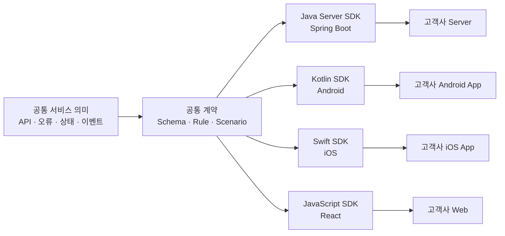
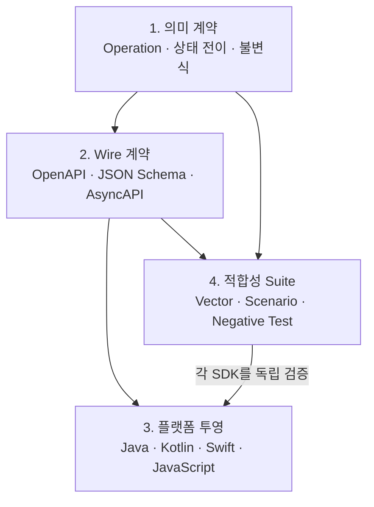
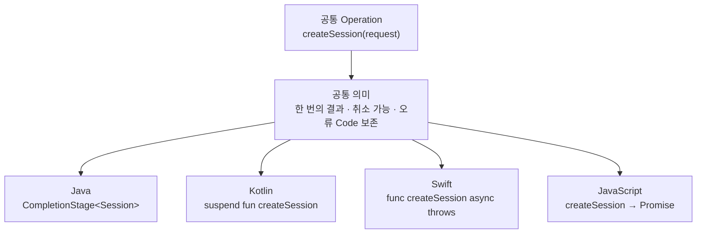
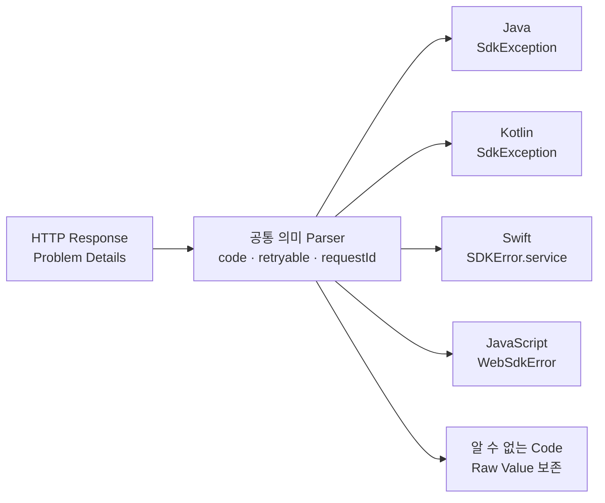
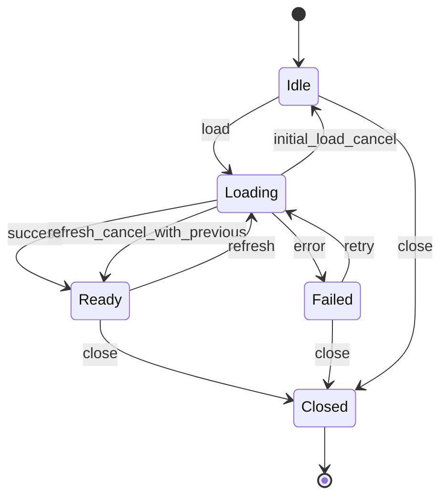
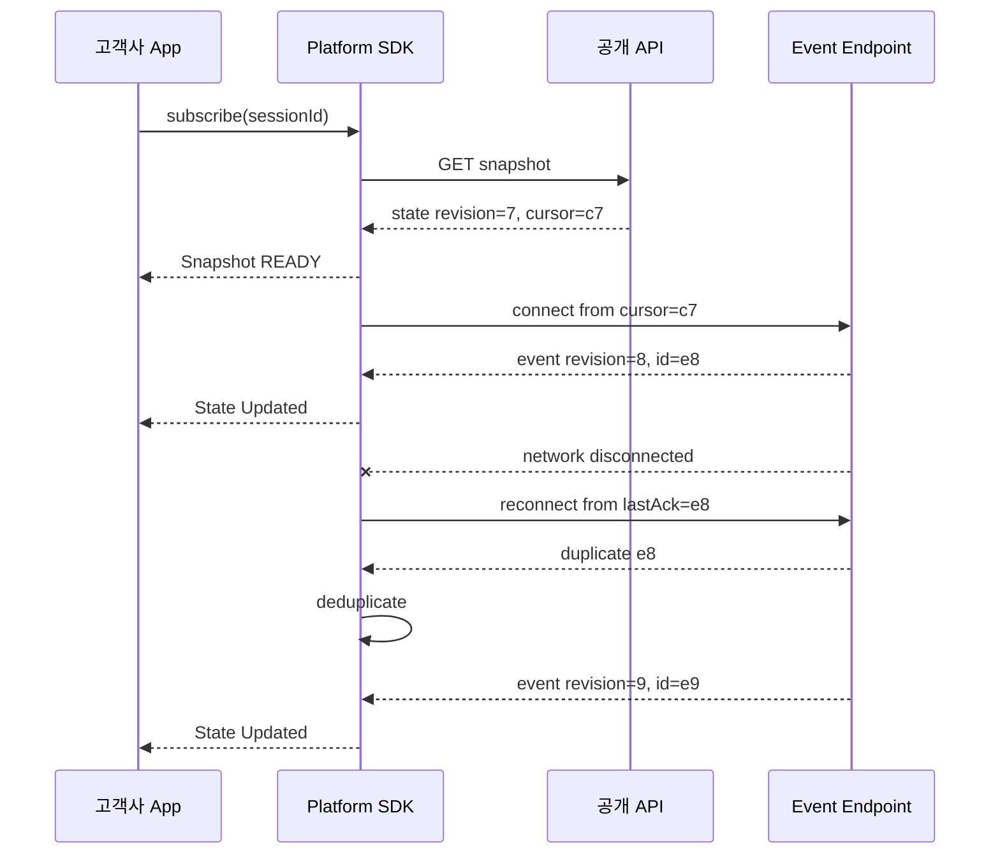
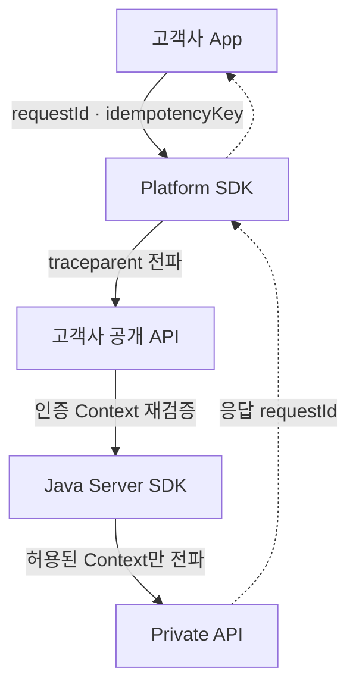
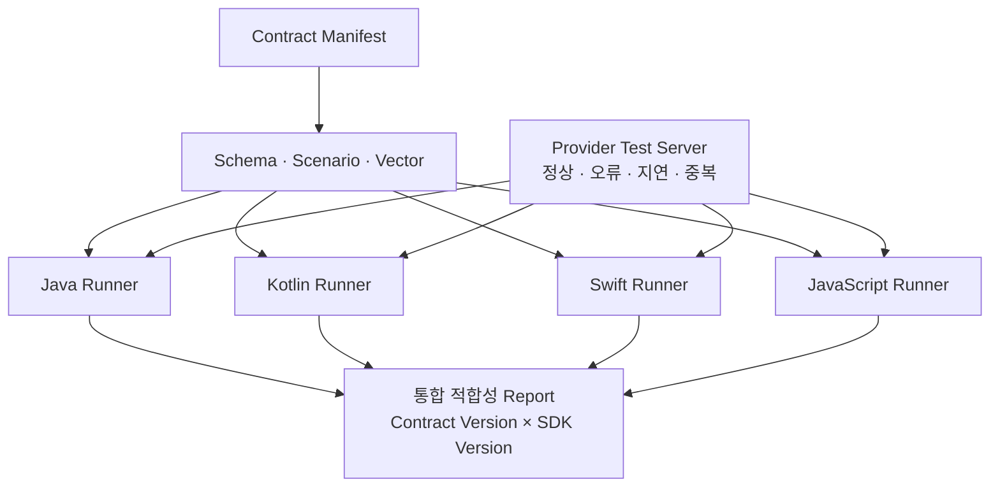
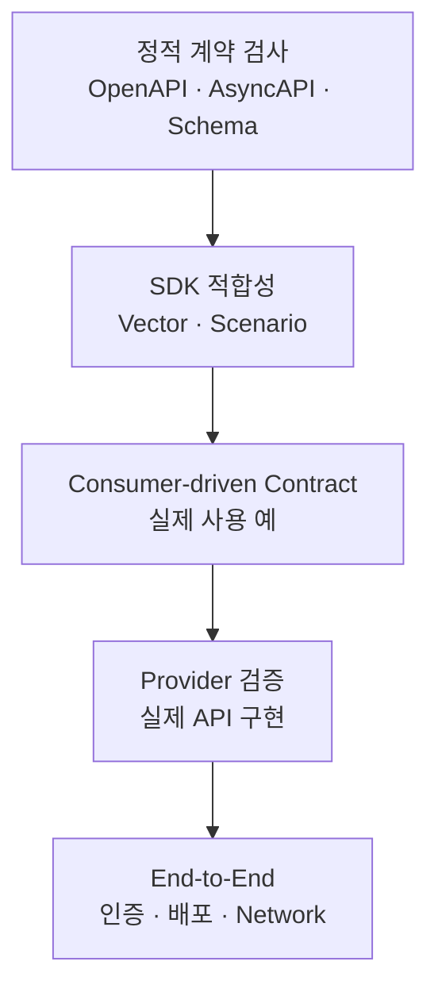
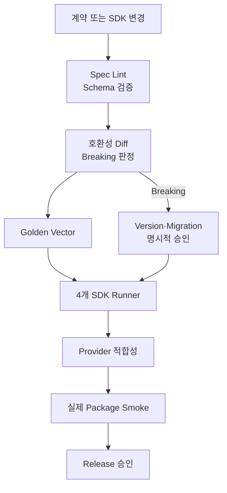

# 크로스플랫폼 SDK 공통 계약: API·오류·상태·이벤트와 적합성 테스트

같은 서비스를 Java Server SDK, Android Kotlin SDK, iOS Swift SDK와 React JavaScript SDK로 제공하면 네 개의 구현이 생깁니다. 그러나 고객에게 전달해야 할 업무 의미까지 네 개가 되어서는 안 됩니다.

예를 들어 서버는 상태 코드를 정상적으로 반환했는데 Android에서는 재시도하고 iOS에서는 즉시 실패한다면, 또는 Web SDK만 큰 숫자 ID를 다른 값으로 읽는다면 각 SDK의 코드는 동작해도 제품 계약은 깨진 것입니다.



공통 계약의 목적은 모든 언어에서 똑같은 Class와 Method 이름을 강제하는 것이 아닙니다. Java에는 Java다운 API를, Kotlin에는 Coroutine과 Flow를, Swift에는 `async/await`과 `AsyncSequence`를, JavaScript에는 Promise와 구독 API를 제공하되 **입력·결과·오류·상태 변화의 의미는 같게 유지하는 것**입니다.

이 글에서는 특정 고객·제품·내부 Endpoint를 제외한 합성 예시로 크로스플랫폼 SDK 계약과 적합성 테스트(Conformance Test)를 설계합니다.

## 1. 공통 계약은 공통 구현이 아니다

멀티플랫폼 SDK에서 재사용해야 하는 것은 소스 코드보다 결정 규칙입니다.

| 공통이어야 하는 것 | 플랫폼별로 달라도 되는 것 |
|---|---|
| 업무 Operation과 필수 입력 | Method 이름의 언어 관례 |
| 성공·실패의 의미 | 동기·비동기 표현 방식 |
| 안정적인 오류 Code | Exception·Result Type 구조 |
| 상태 전이와 종료 조건 | UI Framework 연결 방식 |
| 이벤트 중복·순서·재연결 규칙 | Stream·Callback·Publisher 표현 |
| 호환성·폐기 정책 | Package와 Build Tool |

네 SDK가 하나의 공통 Runtime을 억지로 공유하면 언어별 수명과 오류 처리 관례를 해칠 수 있습니다. 반대로 명세만 있고 실행 가능한 검증이 없으면 시간이 지날수록 구현마다 의미가 달라집니다.

따라서 공통 계약은 다음 네 층으로 관리합니다.



- **의미 계약(Semantic Contract)은** 업무적으로 무엇을 뜻하는지 정의합니다.
- **Wire 계약**은 HTTP Body, Header와 Event Payload의 전송 형식을 정의합니다.
- **플랫폼 투영(Platform Projection)은** 같은 의미를 각 언어에 자연스럽게 노출합니다.
- **적합성 Suite**는 구현이 계약을 지키는지 반복해서 증명합니다.

OpenAPI 문서 하나만으로 네 층이 모두 해결되지는 않습니다. Schema는 필드 형식을 잘 설명하지만 취소가 서버 작업도 중단하는지, 이벤트 중복을 어떻게 처리하는지, 알 수 없는 Enum을 보존해야 하는지까지 자동으로 결정하지는 못합니다.

## 2. 계약 저장소를 진실의 원천으로 둔다

공통 계약을 각 SDK Repository의 Wiki나 README에 복사해 두면 어느 문서가 최신인지 알 수 없습니다. 계약 원본과 실행 가능한 Fixture를 한곳에 두고, 각 SDK Build가 명시적인 계약 Version을 가져가도록 합니다.

```text
contract/
├── manifest.yaml
├── openapi.yaml
├── asyncapi.yaml
├── schemas/
│   ├── session.schema.json
│   ├── problem.schema.json
│   └── event.schema.json
├── scenarios/
│   ├── create-session.yaml
│   ├── cancel-request.yaml
│   └── resume-events.yaml
└── vectors/
    ├── valid/
    └── invalid/
```

`manifest.yaml`에는 최소한 다음 정보를 둡니다.

```yaml
contractId: example-sdk-contract
contractVersion: 2026-07
openapi: ./openapi.yaml
asyncapi: ./asyncapi.yaml
defaultTimeZone: UTC
identifierEncoding: opaque-string
unknownOutputFieldPolicy: ignore
extensionFieldPolicy: preserve-only-in-designated-extension-container
unknownInputFieldPolicy: reject
unknownEnumPolicy: preserve-raw-value
eventDelivery: at-least-once
```

계약 Version은 SDK Package Version과 같은 개념이 아닙니다. 하나의 계약 Version을 Java `4.x`, Kotlin `3.x`, Swift `2.x`, JavaScript `5.x`가 각각 구현할 수 있습니다. 어떤 SDK Version이 어떤 계약을 구현하는지는 별도 호환성 표로 추적합니다.

## 3. 먼저 Operation의 의미를 고정한다

Operation마다 Method와 Path만 기록하지 말고 입력 전제조건, 성공 조건과 Side Effect를 함께 정의합니다.

예를 들어 `createSession`의 계약은 다음과 같이 쓸 수 있습니다.

| 항목 | 계약 |
|---|---|
| 입력 | `title`, 선택적인 고객 정의 Metadata |
| 성공 | 새로운 Session과 안정적인 `sessionId` 반환 |
| 멱등성 | 같은 Idempotency Key와 같은 입력은 같은 업무 결과 |
| 취소 | 호출자 대기 취소와 이미 시작된 서버 업무 취소는 별도 Operation |
| Timeout | 결과를 모른다는 뜻이며 업무 실패를 단정하지 않음 |
| 오류 | 안정적인 `code`, 재시도 가능 여부, 추적용 `requestId` 반환 |
| 이벤트 | 생성 완료 후 상태 변경 Event가 중복 전달될 수 있음 |

Wire Envelope도 공통으로 정할 수 있습니다.

```json
{
  "contractVersion": "2026-07",
  "requestId": "req-example-001",
  "tenantId": "tenant-example",
  "locale": "ko-KR",
  "payload": {
    "title": "합성 예시"
  }
}
```

여기서 `tenantId`가 Body에 있다고 해서 신뢰 가능한 권한 근거가 되는 것은 아닙니다. Mobile·Web에서 넘어온 Tenant와 Actor 정보는 서버의 인증 Context에서 다시 확인해야 합니다. Body 필드는 업무 Routing Hint일 수 있지만 인가의 진실의 원천은 아닙니다.

## 4. 언어별 API 모양과 업무 의미를 분리한다

같은 단일 결과 Operation도 언어마다 자연스러운 비동기 표현이 다릅니다.

| 공통 의미 | Java Server | Kotlin | Swift | JavaScript |
|---|---|---|---|---|
| 단일 결과 | `CompletionStage<T>` 또는 동기 Facade | `suspend fun(): T` | `async throws -> T` | `Promise<T>` |
| 지속 이벤트 | `Flow.Publisher<T>` | `Flow<T>` | `AsyncSequence<T>` | `subscribe()` 또는 `AsyncIterable<T>` |
| 호출자 취소 | `Future.cancel`·Scope 정책 | Coroutine 취소 | `Task` 취소 | `AbortSignal` |
| 오류 | `SdkException` | Exception·Sealed Result | `SDKError` | `WebSdkError` |
| 자원 종료 | `close()` | `close()`·Scope 종료 | 명시적 종료·수명 소유자 | `close()`·Unsubscribe |



중요한 것은 네 API가 같은 철자를 갖는지가 아니라 다음 질문에 같은 답을 하는지입니다.

- 입력 검증은 어느 시점에 실패하는가?
- 취소가 로컬 대기만 끝내는가, 서버 업무도 중단하는가?
- Timeout 후 같은 요청을 안전하게 다시 보낼 수 있는가?
- 성공 응답의 알 수 없는 필드를 버려도 되는가?
- 같은 오류 Code를 네 SDK가 같은 분류로 노출하는가?

## 5. JSON 타입은 언어 타입과 일대일로 대응하지 않는다

플랫폼 차이에서 가장 자주 생기는 장애는 복잡한 Algorithm보다 평범한 타입 변환입니다.

### 큰 정수와 소수

Java·Kotlin의 `Long`과 Swift의 `Int64`는 64bit 정수를 표현할 수 있지만 JavaScript `Number`는 모든 64bit 정수를 정확하게 표현하지 못합니다. 따라서 다음 값은 숫자가 아니라 불투명한 문자열로 정의하는 편이 안전합니다.

- 업무 ID와 Revision
- Event Sequence
- 64bit 범위의 Counter
- 반올림이 허용되지 않는 금액·고정밀 소수

```json
{
  "sessionId": "session-example",
  "sequence": "9007199254740993",
  "amount": "1234567890.123456"
}
```

SDK가 편의를 위해 문자열 ID를 숫자로 바꾸거나 앞의 `0`을 제거해서는 안 됩니다. ID는 계산 대상이 아니라 비교·전달 대상입니다.

### 누락과 null

다음 두 JSON은 같은 뜻이 아닐 수 있습니다.

```json
{
  "displayName": null
}
```

```json
{}
```

특히 PATCH에서는 세 상태가 필요합니다.

| Wire 상태 | 의미 예 |
|---|---|
| 필드 누락 | 기존 값을 변경하지 않음 |
| 명시적 `null` | 기존 값을 제거 |
| 값 존재 | 새 값으로 변경 |

Java의 `Optional<T>` 하나나 Kotlin·Swift의 Nullable Type 하나만으로는 “누락”과 “명시적 null”을 동시에 표현하기 어렵습니다. `Absent | Null | Value<T>` 형태의 Patch 전용 Type을 두는 편이 명확합니다.

### Enum과 미래 값

서버가 Enum 값을 추가하는 것은 Schema 관점에서 작은 변경처럼 보여도, 생성된 Client의 Exhaustive Switch를 깨뜨릴 수 있습니다.

```text
Known(READY)
Known(FAILED)
Unknown("PAUSED_BY_POLICY")
```

알 수 없는 값을 즉시 Parsing Error로 만들기보다 Raw Value를 보존하는 `Unknown` 경로를 마련합니다. 단, 보안상 허용 목록 외 값을 거부해야 하는 입력 Enum과 미래 호환성을 위한 출력 Enum은 정책을 분리해야 합니다.

### 시간·Binary·Unicode

| 항목 | 권장 계약 |
|---|---|
| 시각 | RFC 3339 형식, UTC, Fractional Second 정책 명시 |
| 기간 | 단위가 붙은 정수 필드, 예: `timeoutMs` |
| Binary | Base64 또는 Base64url을 이름과 Schema에 명시 |
| Unicode | 비교·서명 시 정규화 여부를 별도 명시 |
| Map 순서 | 의미 없음. Hash·서명 입력일 때만 Canonicalization |

일반 API 응답 비교에 JSON 문자열의 공백·Key 순서까지 요구하면 테스트가 취약해집니다. JSON을 Parsing한 뒤 의미적으로 비교하고, Hash나 전자서명처럼 Byte 일치가 필요한 경계에서만 Canonical JSON을 적용해야 합니다.

## 6. Schema는 형식을, 규칙은 의미를 설명한다

OpenAPI 3.1은 JSON Schema 기반으로 Request·Response 형식을 기술하는 데 유용합니다. 그러나 `readOnly`, `nullable`, `format` 같은 표기만 보고 각 Code Generator가 완전히 같은 Runtime 검증을 제공한다고 가정해서는 안 됩니다.

```yaml
components:
  schemas:
    Session:
      type: object
      additionalProperties: false
      required:
        - sessionId
        - status
        - createdAt
      properties:
        sessionId:
          type: string
          minLength: 1
        status:
          type: string
          enum: [PENDING, READY, FAILED]
        createdAt:
          type: string
          format: date-time
        displayName:
          type:
            - string
            - "null"
```

이 Schema 옆에는 실행 가능한 의미 규칙이 있어야 합니다.

```yaml
scenario: create-session-success
given:
  title: "합성 예시"
when:
  operation: createSession
then:
  result:
    status: PENDING
  invariants:
    - sessionId-is-opaque
    - createdAt-is-utc
    - request-id-is-propagated
```

Schema 통과는 계약 검증의 시작이지 끝이 아닙니다. 예를 들어 날짜 문자열이 형식상 유효해도 UTC로 정규화해야 한다는 규칙이나, Timeout이 업무 실패를 의미하지 않는다는 규칙은 별도의 Scenario가 검증해야 합니다.

## 7. 오류는 HTTP 상태가 아니라 안정적인 Code로 분기한다

HTTP 상태는 전송 계층의 큰 분류입니다. 고객사 업무 로직이 `400`이나 사람이 읽는 `detail` 문자열을 Parsing해 분기하면 서버 문구 변경만으로 Application이 깨집니다.

RFC 9457의 Problem Details 형식을 기반으로 안정적인 확장 필드를 둘 수 있습니다. HTTP 응답의 `Content-Type`은 `application/problem+json`으로 명시하고, `type` URI는 오류 유형을 식별하는 값으로 다룹니다.

```json
{
  "type": "https://errors.example.com/problems/invalid-argument",
  "title": "Request is invalid",
  "status": 400,
  "detail": "One or more fields are invalid",
  "instance": "/requests/req-example-001",
  "code": "INVALID_ARGUMENT",
  "retryable": false,
  "requestId": "req-example-001",
  "violations": [
    {
      "field": "/title",
      "code": "REQUIRED"
    }
  ]
}
```

각 필드의 역할을 분리합니다.

| 필드 | 용도 | Client 분기 사용 |
|---|---|---|
| `type` | 오류 유형 문서의 URI 식별자 | 가능 |
| `title` | 유형의 짧은 설명 | 표시 보조 |
| `status` | HTTP 상태 복사 | 큰 분류 |
| `detail` | 이번 발생의 사람이 읽는 설명 | 금지 |
| `instance` | 이번 발생 식별 | 추적 |
| `code` | SDK의 안정적인 업무 오류 Code | 권장 |
| `retryable` | 현재 응답 기준 재시도 Hint | 정책 입력 |
| `requestId` | 지원·Log 상관관계 | 추적 |
| `violations` | 필드별 검증 오류 | Form 연결 |

`detail`에는 Secret, Token, 내부 Host, Query 원문, Stack Trace를 넣지 않습니다. 또한 `retryable: true`라고 해서 SDK가 무조건 재시도해서는 안 됩니다. Method의 멱등성, Retry Budget, `Retry-After`, 호출 Deadline을 함께 확인해야 합니다.

## 8. 모든 플랫폼이 원래 오류 정보를 보존한다

Wire 오류를 언어별 Exception으로 바꾸더라도 공통 정보가 사라지면 안 됩니다.



공통 오류 Model은 최소한 다음을 보존합니다.

- 안정적인 `code`
- HTTP 상태와 Response Header
- `retryable` Hint
- `requestId` 또는 Correlation ID
- 필드별 `violations`
- 알 수 없는 Extension
- 안전하게 정제된 원인 정보

다만 네 언어의 Public Type을 억지로 동일하게 만들 필요는 없습니다.

```text
Java       SdkException(code, status, requestId, retryable)
Kotlin     SdkException + ErrorCode.Known/Unknown
Swift      SDKError.service(ServiceProblem)
JavaScript WebSdkError extends Error
```

Network 단절, Caller 취소, Timeout, Protocol Parsing 실패, Service 오류도 구분합니다. 특히 Timeout은 “서버가 처리하지 않았다”는 증거가 아닙니다. Side Effect가 있는 Operation은 상태 조회 또는 같은 Idempotency Key를 이용한 재확인 경로가 필요합니다.

## 9. 상태는 Boolean 조합이 아니라 전이 규칙으로 정의한다

`isLoading`, `hasData`, `hasError`, `isClosed` Boolean을 독립적으로 두면 불가능한 조합이 생깁니다. 공통 상태 계약은 Discriminated State와 전이 규칙으로 정의합니다.

```text
Idle
Loading(previous?)
Ready(value, revision)
Failed(problem, previous?)
Closed(reason)
```



다음 정책도 함께 고정해야 합니다.

- 새로 고치는 동안 이전 값을 유지하는가?
- 실패 시 이전 성공 값을 함께 노출하는가?
- `Closed` 뒤 재사용이 가능한가?
- 같은 Revision Event를 다시 받으면 상태를 갱신하는가?
- Local Cache가 오래됐음을 어떤 필드로 표현하는가?

초기 Loading이 취소되면 `Idle`로 돌아갈 수 있지만, 이전 값이 있는 Refresh가 취소되면 그 값을 가진 `Ready`로 돌아갑니다. Kotlin `StateFlow`, Swift Observable Model, React Store가 서로 다른 UI 수명을 갖더라도 같은 입력 Sequence에 대해 같은 논리 상태로 끝나야 합니다.

## 10. 이벤트는 Payload보다 전달 의미가 중요하다

이벤트의 JSON 모양만 공유하고 전달 보장을 정의하지 않으면 SDK마다 다른 동작을 하게 됩니다.

AsyncAPI 3.x는 Message 중심 API의 Channel, Operation과 Message를 기술하는 데 사용할 수 있습니다. CloudEvents 형식을 활용하면 Event의 공통 Metadata를 일관되게 구성할 수 있습니다.

```json
{
  "specversion": "1.0",
  "id": "evt-example-001",
  "source": "/sessions",
  "type": "com.example.session.status-changed.v1",
  "subject": "sessions/session-example",
  "time": "2026-07-31T03:00:00Z",
  "datacontenttype": "application/json",
  "dataschema": "https://schemas.example.com/session-status-v1.json",
  "sequence": "42",
  "aggregateRevision": "7",
  "data": {
    "status": "READY"
  }
}
```

CloudEvents의 필수 Context Attribute인 `id`, `source`, `specversion`, `type`을 사용하고, 업무상 필요한 `sequence`와 `aggregateRevision`은 Extension으로 명시합니다. 큰 숫자의 플랫폼 차이를 피하기 위해 Sequence도 문자열로 전송합니다.

이벤트 계약에는 다음 항목이 반드시 들어가야 합니다.

| 항목 | 결정 예 |
|---|---|
| 전달 보장 | At-least-once |
| 중복 판별 | `source + id` |
| 순서 보장 범위 | 같은 `subject` 안에서만 |
| 누락 탐지 | `aggregateRevision` 증가 |
| 재연결 | 마지막 확인 Cursor부터 재개 |
| 보존 기간 | 서버 정책으로 명시 |
| 오래된 Cursor | Snapshot 재조회 후 새 Cursor 발급 |
| 느린 소비자 | Buffer 한도와 Overflow 정책 |

## 11. 재연결은 Snapshot과 Event를 연결해야 한다

Mobile App은 Background 진입, Network 전환과 절전 때문에 연결이 끊깁니다. Browser도 Tab 수명과 Proxy Timeout의 영향을 받습니다. 단순히 “자동 재연결”한다고 쓰는 것만으로는 충분하지 않습니다.



안전한 재연결 흐름은 다음과 같습니다.

1. Snapshot과 재개 Cursor를 함께 받습니다.
2. Cursor 이후 Event를 구독합니다.
3. `source + id` 또는 계약된 Key로 중복을 제거합니다.
4. Revision Gap을 발견하면 Snapshot을 다시 조회합니다.
5. 너무 오래된 Cursor가 거부되면 처음부터 복구 절차를 수행합니다.

중복 제거 기록은 무한히 쌓지 않고 Event 보존 기간·Cursor 수명·Revision 정책에 맞춘 유한 Window로 관리합니다. Window 밖의 정합성은 Snapshot Revision으로 다시 확인합니다.

SDK가 Event를 영구 저장소처럼 취급해서는 안 됩니다. 최종 상태의 진실의 원천은 조회 API이며, Event는 상태 변화의 신속한 전달 수단입니다.

## 12. Pagination Cursor도 불투명한 계약이다

Pagination Cursor를 Base64로 보이는 Offset 정도로 간주해 Client가 Parsing하면 서버 구현을 바꿀 수 없습니다.

```json
{
  "items": [
    {
      "sessionId": "session-example"
    }
  ],
  "nextCursor": "cursor-example-opaque",
  "hasMore": true
}
```

Cursor 계약은 다음처럼 단순해야 합니다.

- SDK와 고객 Application은 Cursor를 Parsing·수정하지 않습니다.
- Cursor는 요청 조건과 연결될 수 있으므로 다른 Filter에 재사용하지 않습니다.
- 만료될 수 있으며, 만료 오류는 안정적인 Code로 반환합니다.
- `nextCursor` 누락, `null`, 빈 문자열 중 하나의 종료 표현만 선택합니다.
- Page Size는 서버가 상한을 적용할 수 있습니다.

네 SDK가 Pagination Helper를 제공하더라도 자동으로 모든 Page를 Memory에 모으는 방식만 제공해서는 안 됩니다. Server는 Iterator·Publisher, Mobile은 Flow·AsyncSequence, Web은 Async Iterable처럼 점진 소비 경로를 제공할 수 있습니다.

## 13. Request ID와 분산 추적 Context를 혼동하지 않는다

운영 문제를 네 SDK에서 같은 사건으로 추적하려면 상관관계 계약이 필요합니다.

| 값 | 역할 | 생성·신뢰 |
|---|---|---|
| `requestId` | 고객 지원과 Application Log 상관관계 | Edge에서 검증·생성 |
| `traceparent` | W3C Trace Context 전파 | 신뢰 경계에서 정책 적용 |
| `tracestate` | Vendor별 Trace 정보 | 크기·허용 정책 필요 |
| `idempotencyKey` | Side Effect 중복 방지 | Operation Scope |
| `event.id` | Event 중복 판별 | Event Producer |



W3C Trace Context의 `traceparent`와 `tracestate`는 서비스 간 Trace를 연결하는 표준 Header입니다. 그러나 외부에서 받은 값에 무제한 신뢰를 부여하거나 이를 Tenant·Actor 인가 근거로 사용해서는 안 됩니다. 신뢰 경계에서 길이·형식을 검증하고 Sampling·전파 정책을 적용합니다.

## 14. 변경 가능성을 계약에 포함한다

“필드를 추가했을 뿐”이라는 설명은 소비자에게 항상 호환 변경을 뜻하지 않습니다.

| 변경 | 잠재 영향 | 기본 판단 |
|---|---|---|
| 선택 출력 필드 추가 | 알 수 없는 필드를 거부하는 Client | 조건부 호환 |
| 필수 입력 필드 추가 | 기존 Client가 값을 보낼 수 없음 | Breaking |
| 출력 Enum 값 추가 | Exhaustive Switch 실패 | 조건부 호환 |
| 숫자에서 문자열로 변경 | Parser와 Model 변경 | Breaking |
| `null` 허용 추가 | Non-null Model 실패 | Breaking 가능 |
| 오류 Code 추가 | Unknown 처리 없으면 실패 | 조건부 호환 |
| Event 필수 필드 제거 | 소비자 Parsing 실패 | Breaking |
| Event Type v2 추가 | 별도 구독·병행 가능 | 병행 정책 필요 |

Forward Compatibility를 위해 SDK는 기본적으로 알 수 없는 **출력 필드**를 무시할 수 있어야 합니다. 반면 사용자가 보내는 **입력 필드**는 오타와 보안 문제를 발견하기 위해 엄격하게 검증할 수 있습니다.

Event의 의미가 바뀌면 기존 `type`을 조용히 재정의하지 않고 새 Version의 Type이나 Schema를 병행합니다. 구체적인 SemVer, 폐기 기간과 Package Release Gate는 다음 글에서 다룹니다.

## 15. Golden Vector는 한 SDK의 출력을 정답으로 삼지 않는다

Java 구현의 Serialization 결과를 저장하고 나머지 SDK가 그대로 따라가게 하면 Java의 우연한 동작이 계약이 됩니다. Golden Vector는 구현이 아니라 합의된 명세에서 생성·검토해야 합니다.

```text
vectors/
├── valid/
│   ├── session-minimal.json
│   ├── session-null-display-name.json
│   ├── unknown-output-enum.json
│   ├── event-large-sequence.json
│   └── problem-invalid-argument.json
└── invalid/
    ├── missing-required-id.json
    ├── numeric-sequence.json
    ├── invalid-rfc3339-time.json
    └── malformed-problem.json
```

경계 Vector에는 다음을 포함합니다.

- JavaScript의 안전한 정수 범위를 넘는 Sequence 문자열
- 필드 누락과 명시적 `null`
- 빈 문자열과 공백만 있는 문자열
- 알려지지 않은 출력 Enum과 오류 Code
- UTC Offset과 Fractional Second 경계
- Unicode 조합 문자와 Emoji
- 중복 Event와 Revision Gap
- 정의되지 않은 추가 입력 필드
- 잘못된 Problem Details와 Content Type
- 취소 직전·직후 도착한 성공 응답

일반 JSON Vector는 Key 순서나 공백이 아니라 Parsing 후 의미 값으로 비교합니다. 반면 서명·Hash 입력처럼 Byte가 계약인 경우에는 별도의 Canonicalization 규칙과 Byte Vector를 사용합니다.

앞선 [폴리글랏 보안 계약 검증 글](https://aiarchitect.tistory.com/34)은 Java와 Python 사이의 서명·Canonical Byte 일치를 다뤘습니다. 이번 글의 Golden Vector는 그보다 넓은 공개 SDK 의미 적합성을 다루며, 모든 JSON에 Byte 일치를 강제하지 않는다는 점이 다릅니다.

## 16. 적합성 Suite는 같은 입력을 네 구현에 독립 실행한다

적합성 테스트의 핵심은 하나의 Runner로 네 SDK를 흉내 내는 것이 아닙니다. 각 언어의 실제 Public API와 실제 Serializer를 사용해 같은 Contract Fixture를 실행하는 것입니다.



Test Server는 단순 Mock 응답만 제공하지 않고 계약된 실패 상황을 재현해야 합니다.

| Test 계층 | 검증 내용 |
|---|---|
| Schema Validation | Request·Response·Event가 Schema와 일치 |
| Codec Test | JSON과 언어 Model 간 변환 |
| Semantic Scenario | 같은 입력에서 같은 상태·오류 의미 |
| Transport Fault | Timeout·단절·잘못된 Content Type |
| Cancellation | 호출자 취소와 늦은 응답 Race |
| Event Recovery | 중복·순서 역전·Gap·재연결 |
| Negative Test | 잘못된 입력과 알 수 없는 값 |
| Package Smoke | 실제 배포 Artifact에서 Public API 사용 |

Kotlin Test가 JVM의 Java Model을 직접 호출하거나 Swift Test가 미리 변환한 Fixture만 읽으면 실제 경계를 검증하지 못합니다. 각 SDK가 Wire Fixture를 직접 읽고 자신의 Public Model로 변환해야 합니다.

## 17. Consumer Contract와 Provider 적합성을 함께 쓴다

Contract Testing은 하나의 도구로 끝나지 않습니다.



- 정적 Schema 검사는 구조적 Breaking Change를 빠르게 발견합니다.
- SDK 적합성 테스트는 네 언어의 해석 차이를 찾습니다.
- Pact 같은 Consumer-driven Contract Test는 실제 소비자가 의존하는 요청·응답 예를 Provider가 만족하는지 확인합니다.
- Provider Test는 실제 Service가 공식 계약을 구현하는지 검증합니다.
- End-to-End Test는 인증, Gateway, 배포 설정과 Network까지 확인합니다.

Consumer-driven Contract는 전체 OpenAPI의 모든 조합을 증명하지 않으며, E2E Test도 모든 경계 Vector를 빠르게 검증하기 어렵습니다. 서로 대체하기보다 실패를 찾는 층을 나눕니다.

## 18. CI에서 호환성과 적합성을 Release 조건으로 만든다

계약 문서를 검토했어도 Package Release가 이를 우회하면 의미가 없습니다. 계약 변경과 SDK Release를 CI Gate로 연결합니다.



권장 Release Gate는 다음 순서입니다.

1. OpenAPI·AsyncAPI·JSON Schema 문법과 Lint를 검사합니다.
2. 이전 계약 Version과 Diff해 Breaking 후보를 분류합니다.
3. 모든 Positive·Negative Golden Vector를 검증합니다.
4. Java·Kotlin·Swift·JavaScript Runner를 독립 실행합니다.
5. Provider가 같은 계약을 구현하는지 확인합니다.
6. 실제 JAR·AAR·Swift Package·npm Tarball로 Smoke Test를 수행합니다.
7. 호환성 표와 변경 내역이 갱신된 경우에만 Release합니다.

OS나 Toolchain 제약으로 모든 Runner를 한 Build Machine에서 실행하기 어렵다면 결과를 Contract Version과 Commit SHA로 묶어 집계합니다. 일부 플랫폼이 실패하거나 실행되지 않은 상태를 전체 성공으로 표시해서는 안 됩니다.

## 19. 계약 변경에도 소유자와 완료 기준이 필요하다

공통 계약은 문서 파일이 아니라 여러 팀의 변경 경계입니다.

| 역할 | 책임 |
|---|---|
| Contract Owner | 의미·호환성 판단과 최종 승인 |
| API Provider Owner | 실제 Service 적합성 |
| SDK Owner | 플랫폼 투영과 Package 품질 |
| Consumer Representative | 실제 사용 시나리오와 Migration 검증 |
| Release Manager | Matrix·Artifact·공지 일치 확인 |

계약 변경 Pull Request에는 최소한 다음이 포함돼야 합니다.

- 변경 이유와 영향받는 Operation
- 이전·새 Schema Diff
- 호환성 판정과 근거
- 추가·수정된 Positive·Negative Vector
- 네 SDK와 Provider 적합성 결과
- Migration 또는 Deprecation 계획
- 보안·개인정보·관측성 영향

“모든 SDK Build 성공”만으로는 완료가 아닙니다. 고객사가 사용 중인 계약 Version과 새 SDK의 조합이 호환성 표에 기록되고, 실제 배포 Package로 검증돼야 합니다.

## 20. 구현 체크리스트

### 공통 의미와 타입

- [ ] 공통 계약과 공통 구현을 구분했는가
- [ ] Operation의 성공·Side Effect·취소·Timeout 의미가 문서화됐는가
- [ ] ID·Revision·Sequence를 불투명한 문자열로 다루는가
- [ ] 필드 누락과 명시적 `null`을 구분하는가
- [ ] 알 수 없는 출력 Enum과 오류 Code를 보존하는가
- [ ] 시간대·정밀도·Binary Encoding·Unicode 정책이 명시됐는가
- [ ] 일반 JSON 의미 비교와 Canonical Byte 비교를 구분했는가

### 오류·상태·이벤트

- [ ] 고객 로직이 오류 `detail` 문자열로 분기하지 않는가
- [ ] Service 오류, Network, Timeout, 취소와 Parsing 오류를 구분하는가
- [ ] 상태를 Boolean 조합이 아닌 유효한 전이로 정의했는가
- [ ] Event 전달 보장·중복 Key·순서 범위가 문서화됐는가
- [ ] Snapshot·Cursor·재연결·Revision Gap 복구가 연결됐는가
- [ ] 느린 소비자와 Buffer Overflow 정책이 있는가
- [ ] Request ID와 Trace Context, Idempotency Key를 구분하는가

### 적합성 테스트와 Release

- [ ] 계약 원본과 Fixture의 진실의 원천이 하나인가
- [ ] 각 SDK가 자신의 실제 Public API와 Codec으로 Vector를 실행하는가
- [ ] Positive·Negative·경계 Vector가 함께 있는가
- [ ] Test Server가 지연·중복·잘못된 응답을 재현하는가
- [ ] Provider와 Consumer Contract 검증을 함께 수행하는가
- [ ] 실제 배포 Package Smoke Test가 있는가
- [ ] 호환성 Diff와 네 SDK 적합성 결과가 Release Gate인가
- [ ] 계약 Version과 SDK Version의 호환성 표를 관리하는가

## 마무리

크로스플랫폼 SDK의 품질은 네 언어의 Method 이름을 얼마나 비슷하게 만들었는지로 결정되지 않습니다. **같은 입력과 같은 사건을 네 SDK가 같은 업무 의미로 해석하고, 그 사실을 반복 가능한 테스트로 증명하는가**가 핵심입니다.

이를 위해서는 다음 원칙이 필요합니다.

1. 의미 계약, Wire 계약, 플랫폼 투영과 적합성 Suite를 분리합니다.
2. 큰 숫자, 누락과 `null`, 미래 Enum, 시간과 Binary의 타입 경계를 명시합니다.
3. 오류는 안정적인 Code로 분기하고 원래 Problem 정보를 보존합니다.
4. 상태는 전이 규칙으로, Event는 중복·순서·재연결 의미까지 정의합니다.
5. Golden Vector는 특정 SDK의 우연한 출력을 정답으로 삼지 않습니다.
6. 네 SDK와 Provider가 같은 Fixture를 실제 Public API로 독립 실행합니다.
7. 호환성 Diff, 적합성 Report와 실제 Package 검증을 Release 조건으로 둡니다.

이 구조가 자리 잡으면 Java Server, Kotlin Android, Swift iOS와 React JavaScript가 각 플랫폼의 장점을 유지하면서도 하나의 서비스 계약으로 움직일 수 있습니다. 고객사는 원하는 UI와 Application 구조를 선택하고, 제공자는 프라이빗 API의 의미와 운영 품질을 플랫폼 전체에서 일관되게 지킬 수 있습니다.

---

## 함께 읽기

- [폴리글랏 보안 계약 검증: Java↔Python Golden Vector와 Canonical Byte](https://aiarchitect.tistory.com/34)
- [프라이빗 API를 보호하는 멀티플랫폼 SDK 아키텍처](https://aiarchitect.tistory.com/40)
- [프라이빗 API를 연결하는 Java Server SDK 설계](https://aiarchitect.tistory.com/41)
- [고객 맞춤형 Android 앱을 위한 Kotlin SDK](https://aiarchitect.tistory.com/42)
- [고객 맞춤형 iOS 앱을 위한 Swift SDK](https://aiarchitect.tistory.com/43)
- [고객 맞춤형 웹을 위한 React JavaScript SDK](https://aiarchitect.tistory.com/44)

## 공식 참고 자료

- OpenAPI Initiative, [OpenAPI Specification 3.1.0](https://spec.openapis.org/oas/v3.1.0)
- JSON Schema, [Draft 2020-12](https://json-schema.org/draft/2020-12)
- IETF, [RFC 9457: Problem Details for HTTP APIs](https://www.rfc-editor.org/rfc/rfc9457.html)
- AsyncAPI Initiative, [AsyncAPI Specification 3.0.0](https://www.asyncapi.com/docs/reference/specification/v3.0.0)
- Cloud Native Computing Foundation, [CloudEvents Specification](https://github.com/cloudevents/spec/blob/main/cloudevents/spec.md)
- W3C, [Trace Context](https://www.w3.org/TR/trace-context/)
- IETF, [RFC 8785: JSON Canonicalization Scheme](https://www.rfc-editor.org/rfc/rfc8785.html)
- Pact, [Introduction](https://docs.pact.io/)
- Pact, [Pact Specification](https://docs.pact.io/implementation_guides/pact_specification)

> 이 글은 공식 사양을 기반으로 한 일반화된 설계 예시입니다.
> 실제 적용 시에는 사용하는 OpenAPI·AsyncAPI·JSON Schema Version,
> 각 언어의 Serializer·Code Generator·Runtime, 고객사 API와 Event 전달 정책에 맞춘 별도 검증이 필요합니다.
