# SDK 버전 관리와 배포 자동화: SemVer·호환성 표·패키지·릴리스 게이트

Java Server SDK, Android Kotlin SDK, iOS Swift SDK와 React JavaScript SDK가 모두 준비되면 다음 문제는 배포입니다.

소스 코드가 정상적으로 Build됐다는 사실만으로 고객이 안전하게 업그레이드할 수 있는 것은 아닙니다. 같은 기능이 네 Package에 모두 들어갔는지, 기존 고객의 Binary가 깨지지 않는지, 실제 Registry에서 받은 Artifact가 검증한 파일과 같은지, 어떤 서비스 API와 호환되는지를 함께 증명해야 합니다.

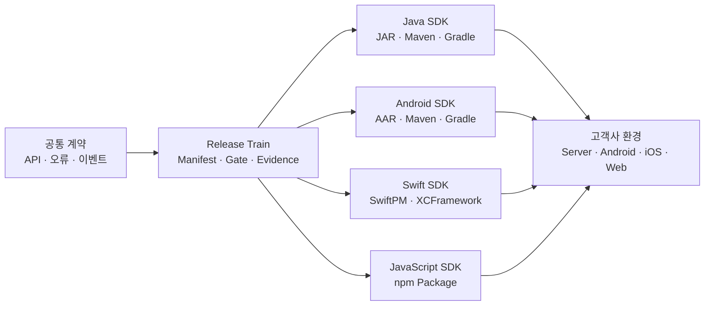

릴리스 자동화의 목적은 네 Package를 무조건 같은 Version으로 만드는 것이 아닙니다. **각 생태계에 맞는 Package Version을 유지하면서도 공통 계약, 호환성 범위와 검증 증거를 하나의 Release 단위로 묶는 것입니다.**

이 글에서는 특정 고객·제품·내부 Registry·계정을 제외한 합성 예시로 SDK 버전 정책과 배포 Pipeline을 설계합니다.

## 1. SDK Release는 파일 업로드가 아니라 호환성 약속이다

Package를 Registry에 올리는 작업만 자동화하면 다음 문제가 남습니다.

- Public API를 지웠는데 Patch Version으로 배포할 수 있습니다.
- Android AAR에는 기능이 있지만 Java JAR에는 빠질 수 있습니다.
- Source Repository의 Tag와 Registry Artifact 내용이 다를 수 있습니다.
- CI에서 테스트한 파일과 Release 단계에서 다시 Build한 파일이 다를 수 있습니다.
- 최신 SDK가 어떤 서비스 API Version을 요구하는지 알 수 없습니다.
- 잘못된 Release를 같은 Version으로 덮어쓰려 할 수 있습니다.

따라서 Release의 완료 기준은 “Publish 명령 성공”보다 넓어야 합니다.

| 완료 조건 | 확인할 증거 |
|---|---|
| 계약 반영 | Contract Version과 적합성 Report |
| API 호환 | 플랫폼별 API·ABI Diff |
| 동작 호환 | Golden Vector·Scenario·회귀 Test |
| Artifact 품질 | 실제 JAR·AAR·Package·Tarball Smoke Test |
| 출처 추적 | Commit·Tag·Workflow·Digest·Attestation |
| 고객 안내 | Compatibility Matrix·Release Note·Migration Guide |
| Registry 반영 | 공개 또는 사설 Registry 조회·설치 검증 |

자동화는 이 증거를 모으고 누락된 Release를 차단하는 Gate여야 합니다.

## 2. Version 하나로 모든 것을 표현하지 않는다

멀티플랫폼 SDK에는 최소 세 종류의 Version이 있습니다.

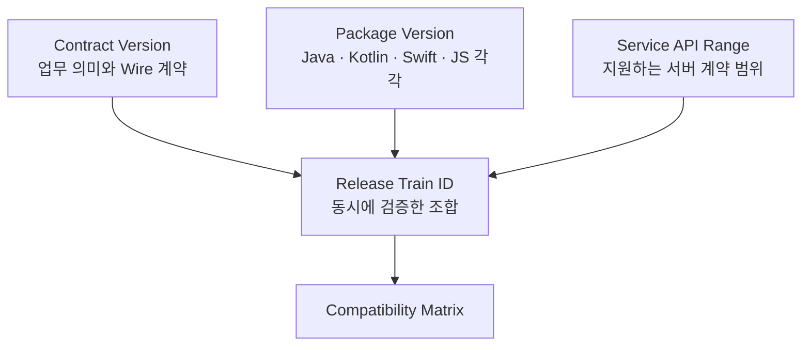

### Contract Version

API·오류·상태·이벤트의 공통 의미 Version입니다. 날짜형 `2026-07`이나 독립 SemVer를 사용할 수 있지만, Package Version과 같은 값일 필요는 없습니다.

### Package Version

각 Package Registry에서 소비자가 선택하는 Version입니다.

```text
Java SDK       4.3.1
Android SDK    3.8.0
Swift SDK      2.6.2
JavaScript SDK 5.1.0
```

각 SDK는 시작 시점과 변경 이력이 다르므로 독립 Version이 자연스럽습니다.

### Service API Range

해당 SDK가 정상 동작하는 서버 계약 범위입니다. “최신 서버와 호환” 같은 문장 대신 최소·최대 또는 기능별 Capability를 명시합니다.

### Release Train ID

네 Package와 서비스의 특정 조합을 함께 검증한 식별자입니다. 독립 Version을 유지하더라도 같은 Release Train의 Manifest에서 하나의 조합으로 추적할 수 있습니다.

## 3. SemVer는 Public API를 먼저 선언해야 의미가 있다

Semantic Versioning 2.0.0은 Version을 `MAJOR.MINOR.PATCH` 형태로 관리합니다.

| 증가 | 의미 |
|---|---|
| MAJOR | 기존 Public API와 호환되지 않는 변경 |
| MINOR | 하위 호환 기능 추가 |
| PATCH | 하위 호환 Bug Fix |

그러나 어떤 것이 Public API인지 선언하지 않으면 Version 판단은 사람마다 달라집니다.

Public API Inventory에는 다음을 포함합니다.

- 공개 Class·Interface·Method·Property
- 생성자와 기본값
- 오류 Type·Code와 상태 전이
- 이벤트 Type과 Payload
- Package Import·Module·Entry Point
- Configuration Key와 환경 변수
- Annotation·Protocol·Callback
- 지원 OS·Runtime·Compiler의 최소 Version
- 문서로 약속한 Side Effect와 성능 특성

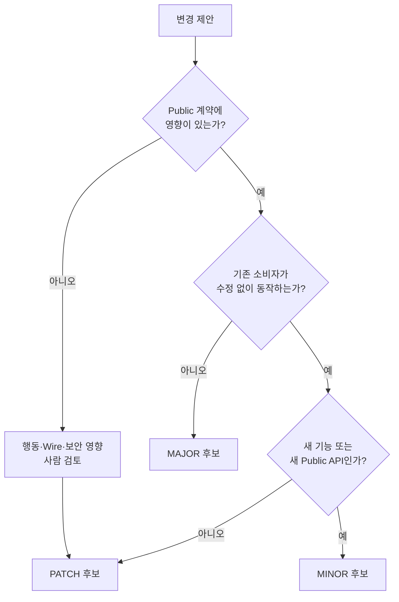

API Diff Tool은 Type과 Signature 변경을 잘 찾지만 행동 의미까지 완전히 판단하지 못합니다. 같은 Method Signature를 유지하면서 Timeout 의미, 기본 재시도 횟수, Event 순서나 인증 Scope를 바꾸는 것도 Breaking Change가 될 수 있습니다.

따라서 Version 결정은 자동 제안과 사람의 의미 검토를 결합합니다.

## 4. 0.x Version도 Breaking Change를 숨기는 면허가 아니다

SemVer에서는 `0.y.z`를 초기 개발 단계로 보고 Public API가 불안정할 수 있다고 설명합니다. 하지만 고객에게 배포한 SDK라면 “아직 1.0 전”이라는 이유만으로 모든 Minor 변경을 Breaking으로 사용해서는 안 됩니다.

권장 정책은 다음과 같습니다.

- 실사용 고객이 생기면 0.x에서도 Breaking Change를 명시적으로 표시합니다.
- 지원 정책과 폐기 기간을 1.0 이전부터 운영합니다.
- Public API와 Release Gate가 안정되면 1.0.0 기준선을 선언합니다.
- `0.9.1`을 조용히 덮어쓰지 않고 수정은 `0.9.2`로 배포합니다.

Package Registry의 Version은 이미 고객 Build와 Cache에 들어간 외부 식별자입니다. Release한 Version의 내용을 바꾸지 않는 불변성(Immutability)은 1.0 이전에도 지켜야 합니다.

## 5. Breaking Change는 Source·Binary·행동·Wire로 나눈다

한 플랫폼에서 Source 호환인 변경이 다른 플랫폼에서는 Binary 또는 행동 호환을 깨뜨릴 수 있습니다.

| 종류 | 예 | 탐지 방법 |
|---|---|---|
| Source Compatibility | Method 이름·Parameter 변경 | 소비자 Source Compile |
| Binary Compatibility | 기존 Binary가 새 Library와 Link 실패 | ABI·Binary API Diff |
| Behavioral Compatibility | 기본 Timeout·Retry·상태 전이 변경 | Scenario·회귀 Test |
| Wire Compatibility | JSON 필드 Type·오류·Event 변경 | Schema Diff·Golden Vector |
| Build Compatibility | 최소 JDK·Android·Swift·Node 상향 | Toolchain Matrix |
| Packaging Compatibility | Import Path·Module·Coordinate·Plugin ID 변경 | 실제 Package Smoke Test |

Java·Kotlin은 Source가 다시 Compile되면 성공해도 기존 Binary가 새 JAR에서 Method를 찾지 못할 수 있습니다. Swift는 Source API와 ABI·Module Stability의 범위를 구분해야 합니다. JavaScript는 Runtime에는 Type이 없어도 `exports`, TypeScript Declaration과 Module 형식이 소비자의 Build를 깨뜨릴 수 있습니다.

Version Gate는 한 종류의 Diff만 보고 결론을 내리지 않습니다.

## 6. 네 SDK를 Lockstep Version으로 묶을지 결정한다

모든 SDK에 같은 `3.2.0`을 부여하는 Lockstep 방식과 독립 Version 방식에는 각각 장단점이 있습니다.

| 전략 | 장점 | 위험 |
|---|---|---|
| Lockstep Version | 문서·지원 대화가 단순 | 변경 없는 Package도 Version 증가 |
| 독립 Version | 각 생태계 변화가 명확 | 호환 조합을 별도로 추적해야 함 |
| 혼합형 | 계약·Train은 공통, Package는 독립 | Manifest 운영 필요 |

멀티플랫폼 SDK에는 혼합형이 실용적입니다.

- 공통 계약과 Release Train은 하나로 묶습니다.
- Package Version은 플랫폼별로 독립 관리합니다.
- 같은 기능이 필요할 때 네 Package의 최소 Version을 Matrix에 기록합니다.
- 변경이 없는 Package는 재배포하지 않고 기존 검증 Version을 Train에 연결할 수 있습니다.

```yaml
releaseTrain: "2026.08"
contractVersion: "2026-07"
serviceApiRange: ">=2026-07 <2027-01"
packages:
  java:
    version: "4.3.1"
  android:
    version: "3.8.0"
  gradlePlugin:
    version: "1.4.0"
  swift:
    version: "2.6.2"
  javascript:
    version: "5.1.0"
```

이 Manifest가 고객 지원과 CI의 진실의 원천이 됩니다.

## 7. Compatibility Matrix는 문서와 기계 입력을 겸한다

사람용 표와 CI용 설정을 따로 관리하면 서로 어긋납니다. 기계가 읽는 Manifest에서 문서 표를 생성하거나 최소한 두 결과의 일치를 검사합니다.

| Release Train | Contract | Service API | Java | Android | Gradle Plugin | Swift | JavaScript |
|---|---|---|---:|---:|---:|---:|---:|
| 2026.06 | 2026-05 | 2026-05~2026-09 | 4.2.x | 3.7.x | 1.3.x | 2.5.x | 5.0.x |
| 2026.08 | 2026-07 | 2026-07~2026-12 | 4.3.x | 3.8.x | 1.4.x | 2.6.x | 5.1.x |

Matrix에는 Version만 넣지 말고 조건도 연결합니다.

```yaml
capabilities:
  eventResume:
    service: ">=2026-07"
    java: ">=4.3.0"
    android: ">=3.8.0"
    swift: ">=2.6.0"
    javascript: ">=5.1.0"
```

SDK가 서버 Capability를 협상할 수 있다면 단순 Version 비교보다 안전합니다. 알 수 없는 서버 Version을 무조건 거부하기보다 필수 Capability와 계약 Range를 검증합니다.

## 8. Deprecation은 Annotation 하나가 아니라 시간표다

API를 바로 삭제하지 않고 `deprecated`로 표시해도 대체 경로와 제거 시점을 알 수 없으면 고객은 이동하지 않습니다.

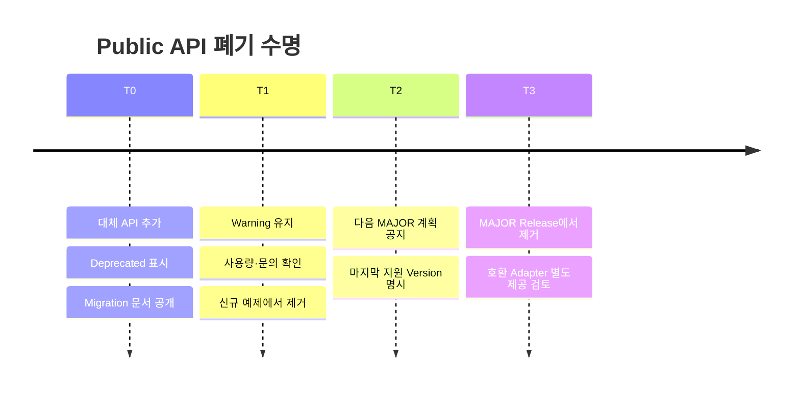

Deprecation 정책에는 다음을 명시합니다.

- 처음 Deprecated된 Package Version과 날짜
- 대체 API와 Before·After 예제
- 제거 가능한 가장 빠른 MAJOR Version
- 지원하는 최소 기간 또는 Release Train 수
- 보안 문제로 단축할 수 있는 예외 조건
- Telemetry가 있다면 개인정보를 제외한 사용 확인 방법

Java `@Deprecated`, Kotlin `@Deprecated`, Swift `@available(..., deprecated:)`, JSDoc `@deprecated`는 전달 수단입니다. 폐기 정책 자체는 공통 Manifest와 Release Note에서 관리합니다.

## 9. API 기준선을 Repository에 저장한다

Public API Snapshot을 Version Control에 두면 Pull Request에서 의도하지 않은 노출·삭제를 찾을 수 있습니다.

```text
api-baseline/
├── java/
│   └── public-api.txt
├── android/
│   └── sdk.api
├── swift/
│   └── api-baseline/
├── javascript/
│   ├── exports.json
│   └── index.d.ts
└── contract/
    ├── openapi.yaml
    └── asyncapi.yaml
```

기준선 갱신은 실패를 없애기 위한 자동 명령이 아닙니다.

1. Diff를 생성합니다.
2. Breaking 후보를 분류합니다.
3. Version 증가와 Migration 계획을 확인합니다.
4. Contract Owner와 Platform Owner가 승인합니다.
5. 그 뒤 기준선을 갱신합니다.

API Snapshot 파일이 변경됐다는 이유만으로 Breaking Change가 정당화되지는 않습니다.

## 10. 플랫폼별 호환성 검사를 같은 Gate에 연결한다

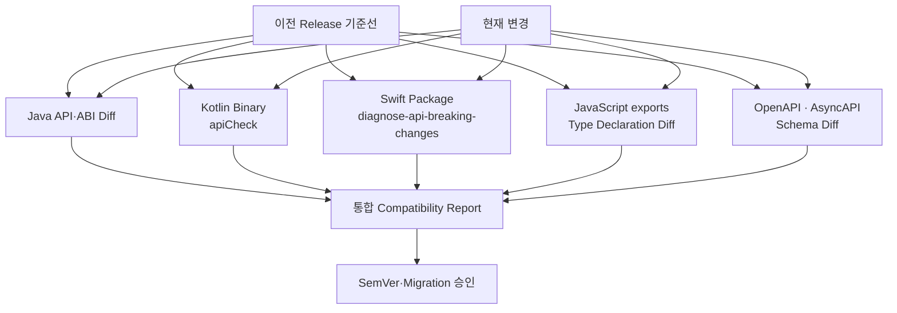

### Java·Kotlin

Compiled Class의 공개 Signature와 Binary 호환을 비교합니다. Kotlin Gradle Plugin의 Binary Compatibility Validation 또는 조직에서 검증한 도구로 `.api` 기준선을 관리할 수 있습니다.

다음 변경은 특히 주의합니다.

- Public Method·Constructor 삭제
- Parameter·Return Type 변경
- Interface의 추상 Method 추가
- Kotlin Default Argument와 Java 호출 경계
- `inline` Public 함수가 참조하는 내부 API
- `data class`의 Component·Constructor 노출

### Swift

`swift package diagnose-api-breaking-changes`는 기준 Revision과 현재 Package의 API를 비교할 수 있습니다. 다만 행동 변경과 모든 Apple Platform 조합까지 자동으로 판단한다고 가정해서는 안 됩니다.

### JavaScript·TypeScript

다음을 함께 비교합니다.

- `package.json`의 `exports`
- ESM·CommonJS Entry Point
- TypeScript `.d.ts`
- React `peerDependencies`
- Browser·Node 조건부 Export
- Tree Shaking에 영향을 주는 Side Effect

Type Declaration이 같아도 Event Timing이나 기본 Credential 정책이 달라지면 행동 Breaking Change가 될 수 있습니다.

## 11. Java JAR와 Android AAR은 Maven Metadata까지 제품이다

JAR·AAR 파일 하나만 전달하면 Coordinate, Version과 Dependency 정보를 잃습니다. Maven 호환 Repository에 POM과 Metadata를 함께 배포합니다.

```kotlin
plugins {
    `maven-publish`
}

publishing {
    publications {
        create<MavenPublication>("release") {
            groupId = "com.example.sdk"
            artifactId = "server-sdk"
            version = providers.gradleProperty("releaseVersion").get()
            from(components["java"])
        }
    }
}
```

Android AAR도 Release Variant의 `SoftwareComponent`를 사용해 Publication을 구성합니다. 실제 구성은 사용하는 Android Gradle Plugin Version과 공개 Variant 정책에 맞춰 검증합니다.

배포 전에 다음 Artifact를 확인합니다.

| Artifact | 확인 내용 |
|---|---|
| JAR·AAR | 예상 Class·Resource·Manifest |
| POM | Coordinate·Dependency Scope·License |
| Gradle Module Metadata | Variant·Constraint 정보 |
| Sources | 공개 Source와 Artifact 일치 |
| Javadoc·Dokka | Public API 문서 |
| Signature·Checksum | Registry 요구와 무결성 |

Maven Central 같은 공개 Repository는 POM Metadata, Source·Javadoc JAR, Checksum과 GPG/PGP Signature 요구사항을 적용합니다. 사설 Registry에서도 가능한 한 같은 품질 기준을 유지합니다.

## 12. Gradle 배포는 Library Module과 Gradle Plugin을 구분한다

“Gradle로 배포한다”는 말에는 두 가지 서로 다른 경로가 섞여 있을 수 있습니다.

| 배포 대상 | 소비 방식 | 권장 배포 위치 |
|---|---|---|
| Java·Kotlin·Android Library | `dependencies { implementation(...) }` | Maven 호환 Repository |
| Gradle 통합 Plugin | `plugins { id(...) version "..." }` | Gradle Plugin Portal 또는 사설 Maven Repository |

일반 SDK Library를 위해 별도의 “Gradle 전용 Binary”를 만들 필요는 없습니다. Gradle은 Maven 호환 Repository의 JAR·AAR와 POM을 사용할 수 있고, Gradle Module Metadata가 함께 있으면 Variant·Dependency Constraint·Capability 같은 Gradle 고유 정보를 더 정확하게 전달할 수 있습니다.

반면 SDK 설정, Source Generation, 고객사 Build 검증이나 자동 구성을 제공하는 Gradle Plugin은 별도 Plugin ID와 Version을 가진 제품으로 관리합니다.

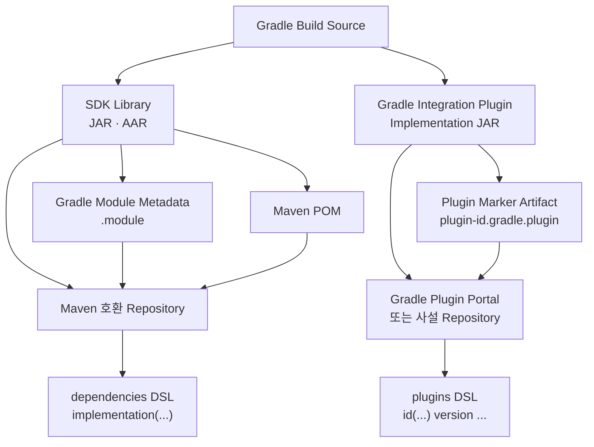

Gradle Plugin Project는 Plugin ID와 구현 Class를 명시적으로 선언합니다.

```kotlin
plugins {
    `java-gradle-plugin`
    id("com.gradle.plugin-publish") version "<검증한-version>"
}

gradlePlugin {
    plugins {
        register("exampleSdkIntegration") {
            id = "com.example.sdk.integration"
            implementationClass =
                "com.example.sdk.gradle.ExampleSdkPlugin"
            displayName = "Example SDK Integration"
            description = "Configures Example SDK integration."
        }
    }
}
```

Plugin Portal에 공개하지 않는 고객 전용 Plugin은 `maven-publish`를 이용해 사설 Maven Repository에 배포할 수 있습니다. 이때 고객 `pluginManagement.repositories` 설정, Plugin Marker Artifact와 구현 Artifact가 모두 Resolve되는지 확인해야 합니다.

Release Job에서는 Library와 Plugin 배포 Task를 구분해 실행합니다.

```bash
# JAR·AAR와 Metadata를 설정한 Maven 호환 Repository에 배포
./gradlew clean check publish

# 공개 Gradle Plugin의 Metadata를 먼저 검증
./gradlew publishPlugins --validate-only

# 보호된 Release Job에서만 Plugin Portal에 배포
./gradlew publishPlugins
```

사설 Plugin은 `maven-publish`가 생성한 대상 Repository별 `publish...PublicationTo...Repository` Task를 사용하거나 검증된 `publish` Task를 실행합니다. 어떤 Task가 어느 Repository에 쓰는지 CI 설정에서 명시하고, PR 검증 Job에는 배포 Credential을 주지 않습니다.

Gradle 배포의 Public 계약에는 Java Class만이 아니라 다음 항목도 포함됩니다.

- Plugin ID와 Version
- Extension·Task 이름과 Type
- DSL Property 이름·Type·기본값
- 생성 파일과 출력 Directory
- 지원하는 최소·최대 Gradle Version
- 지원 Java·Kotlin·Android Gradle Plugin Version
- Configuration Cache·Build Cache 지원 여부
- Plugin 적용 순서와 다른 Plugin과의 상호작용

Release 전에는 Gradle TestKit 또는 새 소비자 Project에서 실제 배포 Artifact를 검증합니다.

```text
사설 또는 Staging Repository에 Plugin 배포
→ 새 Gradle Project 생성
→ settings.gradle.kts에 Repository 설정
→ plugins DSL로 Plugin 적용
→ Extension 구성
→ Task 실행
→ 생성물·Configuration Cache·지원 Gradle Matrix 검증
```

Library Module과 Gradle Plugin의 Version은 독립적으로 관리할 수 있습니다. 다만 Plugin이 특정 SDK Library Version을 자동으로 연결한다면 그 범위를 POM·Dependency Constraint·Compatibility Matrix에 명시하고, Plugin만 성공한 부분 배포를 전체 Release 성공으로 표시하지 않습니다.

## 13. Swift Package는 Tag·Manifest·Binary를 함께 검증한다

Swift Package Manager의 Version 기반 Dependency는 SemVer를 따릅니다. Package Release에는 Git Tag만 존재하는 것이 아니라 해당 Tag의 `Package.swift`, Source와 지원 Platform 정책이 일치해야 합니다.

```swift
// swift-tools-version: 6.0
import PackageDescription

let package = Package(
    name: "ExampleSDK",
    platforms: [
        .iOS(.v16)
    ],
    products: [
        .library(
            name: "ExampleSDK",
            targets: ["ExampleSDK"]
        )
    ],
    targets: [
        .target(name: "ExampleSDK"),
        .testTarget(
            name: "ExampleSDKTests",
            dependencies: ["ExampleSDK"]
        )
    ]
)
```

Release Gate에서 확인할 항목은 다음과 같습니다.

- Tag가 Release Commit을 정확히 가리키는가
- `swift-tools-version`과 최소 iOS Version이 의도한 범위인가
- 공개 Product·Target 이름이 유지되는가
- Clean Checkout에서 `swift build`와 `swift test`가 성공하는가
- 지원 Xcode·Swift Matrix가 통과하는가
- Binary Target이라면 XCFramework URL과 Checksum이 고정됐는가
- Package 소비자 Sample App이 실제 Tag를 Resolve하는가

Source Package와 Binary Package를 동시에 제공한다면 두 Distribution의 기능·Symbol·Version을 같은 Manifest에 연결합니다.

## 14. npm Package는 `files`와 `exports`가 공개 경계다

JavaScript SDK는 Source Repository가 정상이어도 npm Tarball이 잘못 구성될 수 있습니다.

```json
{
  "name": "@example/web-sdk",
  "version": "5.1.0",
  "type": "module",
  "files": [
    "dist",
    "README.md",
    "LICENSE"
  ],
  "exports": {
    ".": {
      "types": "./dist/index.d.ts",
      "import": "./dist/index.js"
    },
    "./react": {
      "types": "./dist/react.d.ts",
      "import": "./dist/react.js"
    }
  },
  "peerDependencies": {
    "react": ">=18 <20"
  },
  "sideEffects": false
}
```

`exports`는 허용한 Entry Point만 노출하는 공개 API 경계입니다. 기존에 고객이 사용하던 Subpath를 제거하거나 ESM·CommonJS 해석을 바꾸면 Breaking Change가 될 수 있습니다.

Release 전에는 Repository Source가 아니라 `npm pack`으로 생성한 Tarball을 검사합니다.

```text
npm pack
→ 새 임시 소비자 Project 생성
→ Tarball 설치
→ Core Import 검증
→ React Entry Import 검증
→ TypeScript Compile
→ Browser Bundle
→ SSR Import
```

`peerDependencies`는 Host Framework와의 호환 범위를 표현합니다. 실제로 테스트하지 않은 넓은 범위를 선언하거나 특정 Patch에 불필요하게 고정하지 않습니다.

## 15. 한 번 Build하고 같은 Byte를 승격한다

Test 환경과 Production Registry에서 각각 Build하면 같은 Tag라도 다른 Dependency, Timestamp나 Toolchain으로 Artifact가 달라질 수 있습니다.

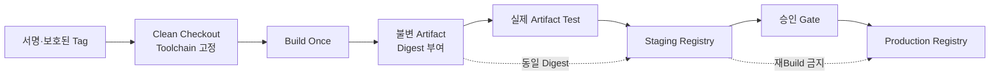

핵심 원칙은 다음과 같습니다.

1. 보호된 Tag 또는 승인된 Release Commit에서 Build합니다.
2. Toolchain과 Dependency Resolution을 고정합니다.
3. Artifact마다 SHA-256 같은 Digest를 계산합니다.
4. 그 Artifact로 Test와 Staging을 수행합니다.
5. 승인 후 같은 Byte를 Production Registry로 승격합니다.
6. Release 뒤 Registry에서 다시 받아 Digest와 소비자 Test를 확인합니다.

Registry 특성상 승격 기능이 없다면 동일한 CI Artifact를 각 Registry에 Upload하고 Digest 일치를 검사합니다.

## 16. Release Manifest가 네 Package의 영수증이 된다

```yaml
releaseTrain: "2026.08"
source:
  commit: "example-commit-sha"
  tag: "sdk-train-2026.08"
contract:
  version: "2026-07"
  digest: "sha256:example-contract-digest"
service:
  apiRange: ">=2026-07 <2027-01"
artifacts:
  java:
    coordinate: "com.example.sdk:server-sdk:4.3.1"
    digest: "sha256:example-java-digest"
  android:
    coordinate: "com.example.sdk:android-sdk:3.8.0"
    digest: "sha256:example-android-digest"
  gradlePlugin:
    pluginId: "com.example.sdk.integration"
    version: "1.4.0"
    digest: "sha256:example-gradle-plugin-digest"
  swift:
    tag: "swift-sdk-2.6.2"
    digest: "sha256:example-swift-digest"
  javascript:
    coordinate: "@example/web-sdk@5.1.0"
    digest: "sha256:example-javascript-digest"
evidence:
  conformanceReport: "reports/conformance.json"
  compatibilityReport: "reports/compatibility.json"
  sbom: "reports/sbom.spdx.json"
```

이 Manifest에는 Secret, Registry Token, 내부 Host를 넣지 않습니다. 공개 가능한 Coordinate·Digest·계약과 검증 결과만 기록합니다.

Release Note와 Compatibility Matrix는 이 Manifest를 바탕으로 생성합니다.

## 17. Release Pipeline은 PR 검증과 발행 권한을 분리한다

Pull Request Build가 Package Publish Credential을 가져서는 안 됩니다.

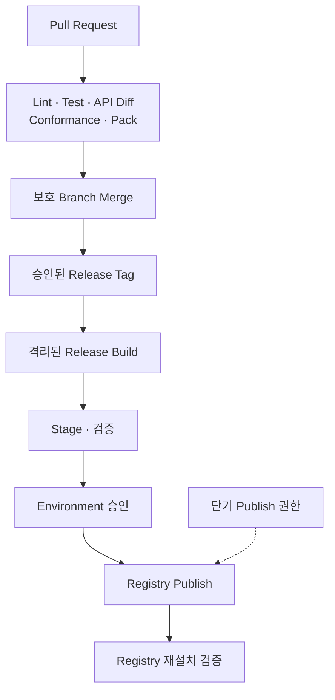

권한 경계는 다음처럼 나눕니다.

| 단계 | Source 변경 | Artifact 생성 | Registry 쓰기 |
|---|---:|---:|---:|
| PR 검증 | 읽기 | 임시 | 없음 |
| Merge 검증 | 읽기 | 후보 | 없음 |
| Release Build | 읽기 | 불변 | Staging만 |
| 승인·Publish | 없음 | 재사용 | 대상 Package만 |
| Post-publish | 읽기 | 다운로드 | 없음 |

Publish Job은 일반 Build Job과 분리하고 대상 Registry·Package·Workflow로 Scope를 제한합니다.

## 18. 장기 Token 대신 단기 신원을 우선한다

Registry가 지원한다면 CI의 OpenID Connect(OIDC) 신원과 Trusted Publishing을 사용해 장기 Publish Token을 줄입니다.

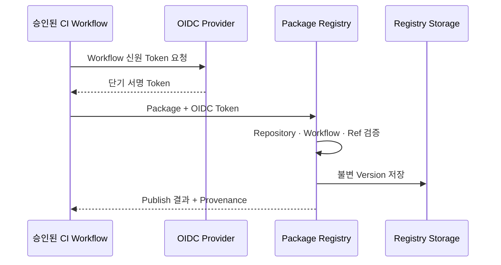

npm Trusted Publishing은 지원되는 CI와 OIDC Trust를 구성해 장기 npm Publish Token 없이 배포할 수 있고, 조건을 충족하면 Provenance도 연결할 수 있습니다.

모든 Registry가 같은 인증 방식을 지원하는 것은 아닙니다. Maven Central이나 사설 Registry가 User Token·GPG Key를 요구한다면 다음 원칙을 적용합니다.

- Package별 최소 Scope Credential
- Release Job에만 주입
- Log·Cache·Artifact에서 제외
- 가능하면 Hardware-backed 또는 별도 Signing Service 사용
- Rotation·Revocation 절차 정기 검증
- Fork·일반 PR에는 Credential 미제공

OIDC를 사용한다고 승인·호환성 검토가 사라지는 것은 아닙니다. 인증 방식과 Release 정책은 별도 Gate입니다.

## 19. Provenance·Signature·SBOM의 역할을 구분한다

| 증거 | 답하는 질문 |
|---|---|
| Digest | 파일 내용이 같은가 |
| Signature | 승인된 주체가 서명했는가 |
| Provenance·Attestation | 어떤 Source·Workflow가 만들었는가 |
| SBOM | 어떤 Component·Dependency가 포함됐는가 |
| Test Report | 어떤 조건에서 검증됐는가 |

하나의 증거가 다른 증거를 대체하지 않습니다.

GitHub Artifact Attestation 같은 기능은 Build Artifact와 Source·Workflow의 관계를 검증할 수 있습니다. npm Provenance도 Package와 Build 출처를 연결합니다. 다만 Attestation이 있다고 해서 API 호환성이나 악성 코드 부재가 자동으로 증명되지는 않습니다.

고객에게 공개할 Evidence와 내부에 보관할 Evidence를 분리합니다. 공개 Evidence에도 내부 Runner 이름, 사설 Repository URL, Secret 환경 변수 값이 포함되지 않도록 검사합니다.

## 20. Prerelease와 Staging을 Production과 분리한다

SemVer의 Prerelease 식별자를 사용하면 정식 Version보다 앞선 후보를 표현할 수 있습니다.

```text
5.2.0-alpha.1
5.2.0-beta.2
5.2.0-rc.1
5.2.0
```

그러나 Prerelease 이름만 붙이고 Production 고객에게 자동 배포하면 분리 효과가 없습니다.

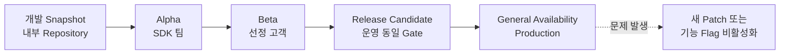

- Maven Snapshot과 Release Repository를 분리합니다.
- npm은 Prerelease Version과 Distribution Tag 정책을 함께 관리합니다.
- Swift 개발 Branch 의존은 테스트용으로 제한하고 고객 Release는 Version Tag를 사용합니다.
- RC는 Production과 같은 Toolchain·Artifact·Gate로 Build합니다.
- GA 전환 시 RC를 다시 Build하지 않고 검증한 Byte를 승격할 수 있는 구조를 선호합니다.

npm Staged Publishing처럼 Registry가 검토·승인 단계를 제공한다면 Release Environment 승인과 함께 활용할 수 있습니다.

## 21. Post-publish Test는 실제 설치 경로를 검증한다

Publish API가 성공을 반환해도 Metadata 전파, 권한, Package 내용이나 Consumer Resolution이 실패할 수 있습니다.

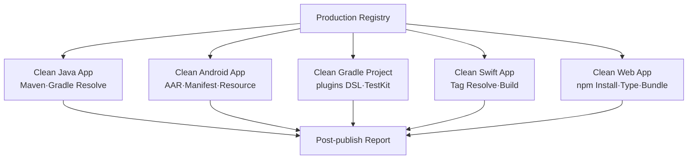

Post-publish Test는 Workspace의 Module을 직접 참조하지 않습니다.

- 새 임시 Project를 만듭니다.
- Production Registry만 설정합니다.
- 정확한 Release Version을 설치합니다.
- 가장 작은 실제 사용 코드를 Compile·실행합니다.
- Gradle Plugin은 실제 `plugins` DSL로 적용하고 Task·Extension을 확인합니다.
- Package Metadata와 Digest를 확인합니다.
- 지원 Toolchain Matrix 중 최소·대표·최신 조합을 검증합니다.

이 단계가 실패하면 Release를 성공으로 표시하지 않고 고객 공지와 Roll-forward 절차를 시작합니다.

## 22. Release 실패는 같은 Version 덮어쓰기가 아니라 Roll-forward다

공개 Package Version은 불변으로 취급합니다.

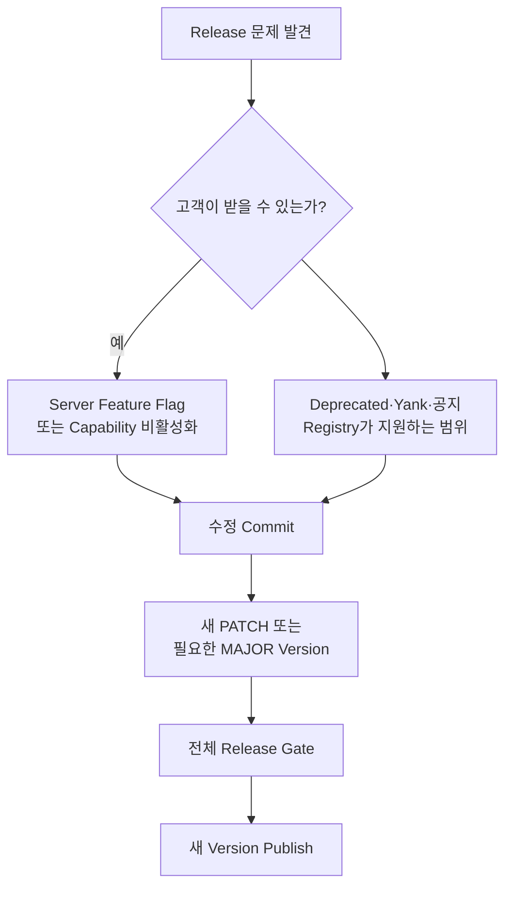

- 같은 Version의 파일을 교체하지 않습니다.
- Registry가 Deprecate·Yank 기능을 제공하면 새 설치를 억제하되 기존 Build 재현 가능성을 고려합니다.
- 서버 Capability나 Feature Flag로 위험 기능을 완화할 수 있습니다.
- 호환 가능한 수정은 새 Patch Version으로 배포합니다.
- 잘못된 Public 계약 자체를 바꿔야 한다면 적절한 MAJOR와 Migration을 사용합니다.
- 사고 원인과 영향 Version을 Release Note에 기록합니다.

Maven Central처럼 공개 후 Component 수정·삭제를 허용하지 않는 Registry에서는 Roll-forward가 필수입니다.

## 23. Release Note는 Commit 목록이 아니라 고객 Migration 문서다

좋은 Release Note는 다음 질문에 답합니다.

```text
무엇이 바뀌었는가?
누가 영향을 받는가?
업그레이드는 안전한가?
어떤 서비스 Version이 필요한가?
코드를 수정해야 하는가?
문제가 생기면 무엇을 확인해야 하는가?
```

권장 구조는 다음과 같습니다.

```markdown
## Java SDK 4.3.1

### Compatibility
- Contract: 2026-07
- Service API: 2026-07 이상
- JDK: 17 이상

### Added
- Event resume cursor 지원

### Fixed
- Timeout 후 상태 재확인 경로 보완

### Deprecated
- LegacyEventListener
- 대체: SessionEventSubscriber

### Migration
- 기존 코드 변경 없음
```

API Diff, Issue와 Manifest에서 초안을 만들 수 있지만 최종 영향 설명은 사람이 검토합니다. 내부 Ticket 제목이나 고객 식별정보가 공개 Note에 섞이지 않도록 필터링합니다.

## 24. 전체 Release Gate

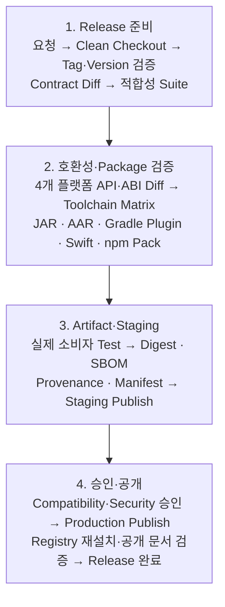

Gate의 실패 조건을 미리 정합니다.

| Gate | 차단 조건 |
|---|---|
| Version | 이미 존재하는 Version, Tag·Manifest 불일치 |
| Contract | Breaking 변경인데 MAJOR·Migration 없음 |
| API | 승인되지 않은 Public API Diff |
| Test | 지원 Matrix 일부 미실행 또는 실패 |
| Artifact | 예상 외 파일·Secret·Debug Symbol 포함 |
| Gradle Plugin | Marker 누락, Plugin ID·지원 Matrix·TestKit 실패 |
| Security | Critical 취약점 정책 위반, Signature 실패 |
| Evidence | Digest·SBOM·Report 누락 |
| Publish | 일부 Platform만 성공하고 Train을 완료 처리 |
| Verify | Registry 재설치·Compile·Runtime Smoke 실패 |

일부 SDK Publish가 실패하면 성공한 Package를 지울 수 없을 수 있습니다. Release Train 상태를 `PARTIAL`로 기록하고 누락 Package를 새 Version으로 보완할지, 기존 성공 Version을 다음 Train에 연결할지 명시적으로 결정합니다.

## 25. 구현 체크리스트

### Version과 호환성

- [ ] Contract Version과 Package Version을 분리했는가
- [ ] Service API 지원 범위를 기계가 읽을 수 있는가
- [ ] Public API Inventory가 문서화됐는가
- [ ] Source·Binary·행동·Wire 호환을 구분하는가
- [ ] 독립 Package Version을 Release Train Manifest로 묶는가
- [ ] Compatibility Matrix가 실제 Test 결과와 연결되는가
- [ ] Deprecation의 대체 API·기간·제거 Version이 명시됐는가

### 플랫폼 Package

- [ ] Java JAR의 POM·Source·Javadoc·Signature를 검증하는가
- [ ] Android AAR의 Variant·Manifest·Resource를 검증하는가
- [ ] Gradle Module Metadata·Plugin Marker Artifact를 검증하는가
- [ ] 실제 `plugins` DSL과 Gradle TestKit으로 Plugin을 검증하는가
- [ ] 지원 Gradle·Java·Kotlin·Android Gradle Plugin Matrix가 있는가
- [ ] Swift Tag·Package Manifest·지원 Platform을 검증하는가
- [ ] JavaScript `files`·`exports`·Type·Peer Range를 검증하는가
- [ ] Repository Module이 아닌 실제 Package로 소비자 Test를 수행하는가
- [ ] 최소·대표·최신 Toolchain Matrix를 실행하는가

### Pipeline과 보안

- [ ] PR Job에 Publish Credential이 없는가
- [ ] 보호된 Tag·승인 Environment에서만 Publish하는가
- [ ] 한 번 Build한 동일 Artifact를 승격하는가
- [ ] Registry가 지원하면 OIDC 단기 신원을 사용하는가
- [ ] Token·Signing Key가 Log·Cache·Artifact에서 제외되는가
- [ ] Digest·Signature·Provenance·SBOM의 역할을 구분하는가
- [ ] Evidence에 내부 URL·계정·Secret이 없는가

### 발행과 복구

- [ ] 이미 Release한 Version을 덮어쓰지 않는가
- [ ] Staging·Prerelease·GA Registry 정책이 분리됐는가
- [ ] Production Registry에서 다시 설치해 검증하는가
- [ ] 일부 Platform 실패를 `PARTIAL`로 기록하는가
- [ ] Roll-forward와 Feature Flag 완화 절차가 있는가
- [ ] Release Note가 고객 영향과 Migration을 설명하는가
- [ ] Manifest·Compatibility Matrix·문서 상태가 일치하는가

## 마무리

멀티플랫폼 SDK의 Release는 네 개의 Publish 명령을 한 Workflow에 넣는 것으로 완성되지 않습니다. **공통 계약과 독립 Package Version을 연결하고, 실제 Artifact가 호환성과 출처 증거를 통과한 뒤 같은 Byte로 배포되는 구조가 필요합니다.**

이를 위해서는 다음 원칙이 중요합니다.

1. Contract Version, Package Version, Service API Range와 Release Train을 분리합니다.
2. SemVer 판단 전에 Public API와 행동 계약을 선언합니다.
3. Source·Binary·행동·Wire·Packaging 호환성을 플랫폼별로 검사합니다.
4. Compatibility Matrix와 Release Manifest를 기계가 읽는 진실의 원천으로 관리합니다.
5. JAR·AAR·Gradle Plugin·Swift Package·npm Tarball을 실제 소비자 Project에서 검증합니다.
6. 보호된 Tag에서 한 번 Build하고 동일 Artifact를 Staging과 Production으로 승격합니다.
7. OIDC·Signature·Provenance·SBOM과 Test Report를 Release Evidence로 연결합니다.
8. 공개 Version은 덮어쓰지 않고 새 Version으로 Roll-forward합니다.

이 구조가 자리 잡으면 고객은 자신의 Server·Android·iOS·Web 일정에 맞춰 SDK를 업그레이드할 수 있고, 제공자는 어떤 조합을 검증했는지 명확히 설명할 수 있습니다. Release 자동화는 속도를 높이는 도구를 넘어 고객과의 호환성 약속을 반복 가능하게 지키는 통제 장치가 됩니다.

---

## 함께 읽기

- [프라이빗 API를 보호하는 멀티플랫폼 SDK 아키텍처](https://aiarchitect.tistory.com/40)
- [프라이빗 API를 연결하는 Java Server SDK 설계](https://aiarchitect.tistory.com/41)
- [고객 맞춤형 Android 앱을 위한 Kotlin SDK](https://aiarchitect.tistory.com/42)
- [고객 맞춤형 iOS 앱을 위한 Swift SDK](https://aiarchitect.tistory.com/43)
- [고객 맞춤형 웹을 위한 React JavaScript SDK](https://aiarchitect.tistory.com/44)
- [크로스플랫폼 SDK 공통 계약과 적합성 테스트](https://aiarchitect.tistory.com/45)

## 공식 참고 자료

- Semantic Versioning, [Semantic Versioning 2.0.0](https://semver.org/)
- Gradle, [The Maven Publish Plugin](https://docs.gradle.org/current/userguide/publishing_maven.html)
- Gradle, [Publishing Plugins to the Gradle Plugin Portal](https://docs.gradle.org/current/userguide/publishing_gradle_plugins.html)
- Gradle, [Gradle Module Metadata](https://docs.gradle.org/current/userguide/publishing_gradle_module_metadata.html)
- Android Developers, [Upload your library](https://developer.android.com/build/publish-library/upload-library)
- Kotlin, [Backward compatibility guidelines for library authors](https://kotlinlang.org/docs/api-guidelines-backward-compatibility.html)
- Maven Central, [Publishing Requirements](https://central.sonatype.org/publish/requirements/)
- Maven Central, [Immutability](https://central.sonatype.org/publish/requirements/immutability/)
- Swift Package Manager, [Package](https://docs.swift.org/package-manager/PackageDescription/PackageDescription.html)
- Swift Package Manager, [Diagnose API-breaking changes](https://docs.swift.org/swiftpm/documentation/packagemanagerdocs/packagediagnoseapibreakingchange/)
- npm Docs, [package.json](https://docs.npmjs.com/cli/configuring-npm/package-json/)
- npm Docs, [Trusted publishing for npm packages](https://docs.npmjs.com/trusted-publishers/)
- npm Docs, [Staged publishing for npm packages](https://docs.npmjs.com/staged-publishing/)
- GitHub Docs, [Using artifact attestations to establish provenance for builds](https://docs.github.com/en/actions/how-tos/secure-your-work/use-artifact-attestations/use-artifact-attestations)

> 이 글은 공식 문서를 기반으로 한 일반화된 설계 예시입니다.
> 실제 적용 시에는 사용하는 Registry·Gradle·Android Gradle Plugin·Swift·Xcode·Node·npm Version,
> 고객사 지원 정책과 공개·사설 Package 배포 규칙에 맞춘 별도 검증이 필요합니다.
