# Tistory 기술자료 초안

- 문서 ID: `BLOG-45`
- 상태: 공개 대기
- Tistory 상태: Boss 게시 승인 완료 · 일일 공개 발행 제한 해제 후 입력·발행 대기
- 공개 URL: `미발급`
- 분류: `엔터프라이즈 아키텍처`
- 권장 제목: `고객 Mobile·Web에서 Server SDK와 Private API까지: End-to-End 통합 예제`
- 검색 설명: `Android Kotlin·iOS Swift·React JavaScript 고객 채널에서 Spring Boot 기반 Java Server SDK를 거쳐 프라이빗 API를 호출하는 전체 흐름을 인증, 멱등성, 비동기 상태, 이벤트 복구와 관측성까지 하나의 합성 예제로 설명합니다.`
- 권장 태그: `멀티플랫폼 SDK`, `Private API`, `Spring Boot`, `Kotlin`, `Swift`, `React`, `End to End`, `BFF`
- 권장 대표 이미지: `portfolio/architecture-diagrams/01-enterprise-ai-reference-architecture.svg`
- 도식 정책: `GitHub에는 Mermaid 원본을 유지하고, Tistory 게시 시 검증된 SVG 또는 PNG로 변환해 삽입`

---

# 고객 Mobile·Web에서 Server SDK와 Private API까지: End-to-End 통합 예제

운영 중인 서비스에 API 서버, 웹 페이지와 모바일 앱이 이미 있어도 고객사가 원하는 화면과 업무 흐름은 서로 다를 수 있습니다. 이때 고객별 앱과 웹을 모두 대신 개발하면 변경 속도와 운영 책임이 한곳에 집중됩니다.

다른 선택은 고객사가 자신의 UX를 구현하도록 Android Kotlin, iOS Swift와 React JavaScript SDK를 제공하는 것입니다. 다만 핵심 API가 프라이빗 망에 있다면 Mobile·Web SDK가 그 API를 직접 호출하게 만들 수 없습니다. 고객 채널은 고객사 Backend for Frontend(BFF) 또는 Channel API를 호출하고, 그 서버가 Java Server SDK를 통해 프라이빗 API와 통신해야 합니다.

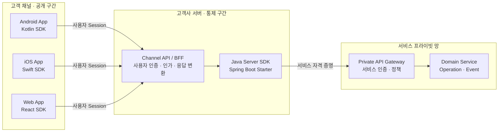

이 글은 앞서 다룬 SDK 아키텍처, 플랫폼별 수명 주기, 공통 계약과 배포 자동화를 하나의 End-to-End 흐름으로 연결합니다. 예시는 특정 제품·고객·내부 API를 재현하지 않은 합성 시나리오입니다.

## 1. End-to-End 완료 조건부터 정한다

“버튼을 누르면 API가 호출된다”만으로 통합이 완료되지는 않습니다. 정상 응답 외에도 사용자가 화면을 닫았을 때, 네트워크가 끊겼다가 복구됐을 때, 같은 요청이 중복 전달됐을 때와 서버 처리가 오래 걸릴 때의 의미가 일치해야 합니다.

이 예제의 완료 조건은 다음과 같습니다.

1. Mobile·Web은 공개된 고객사 Channel API만 호출합니다.
2. 최종 사용자의 자격 증명과 서버 간 자격 증명을 분리합니다.
3. 변경 작업은 중복 요청에도 한 번의 논리 작업으로 수렴합니다.
4. 비동기 작업은 `operationId`와 명시적인 상태 전이로 추적합니다.
5. 실시간 이벤트가 누락될 수 있다는 전제 아래 Snapshot으로 복구합니다.
6. 취소·Timeout·Retry의 소유자를 계층별로 구분합니다.
7. 오류 Code와 상태 의미는 Android·iOS·Web·Java에서 동일합니다.
8. 한 요청을 채널에서 프라이빗 서비스까지 추적할 수 있습니다.
9. 호환되지 않는 SDK와 서버 조합은 실행 전에 탐지합니다.
10. 장애와 복구 경로가 자동화된 End-to-End Test로 증명됩니다.

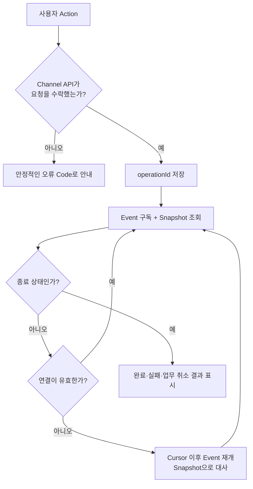

## 2. 신뢰 경계가 호출 경로를 결정한다

Mobile App과 Browser에 포함된 코드는 고객이 내려받아 실행하는 배포물입니다. 난독화나 보안 저장소는 노출 비용을 높일 수 있지만 서버 전용 Secret을 안전하게 숨기는 경계가 되지는 않습니다. 따라서 프라이빗 API Endpoint, 서버 간 Client Secret과 서명 Key를 Mobile·Web Package에 넣지 않습니다.

| 구간 | 주체 | 보유 가능한 자격 증명 | 주요 책임 |
|---|---|---|---|
| Android·iOS·Web | 최종 사용자 채널 | 사용자 Session·단기 Access Token | 입력 검증, UI 상태, 취소, 재연결 |
| Channel API/BFF | 고객사 서버 | 사용자 Session 검증 정보 | 사용자·Tenant 인가, 입력 정규화, 응답 최소화 |
| Java Server SDK | 고객사 서버 Process | 서버 간 Credential 공급 지점 | Private API 호출, Deadline, 오류 변환, 관측성 |
| Private Gateway | 프라이빗 망 진입점 | 서비스 신원 검증 자료 | 서비스 인증·권한·Rate Limit·Audit |
| Domain Service | 프라이빗 서비스 | 도메인 상태 | 멱등 처리, 상태 전이, Event·Snapshot |

여기서 두 인증 문맥을 합치지 않는 것이 중요합니다.

- **사용자 문맥:** “누가 어떤 고객 채널에서 이 작업을 요청했는가”를 설명합니다.
- **서비스 문맥:** “어떤 고객사 서버가 프라이빗 API 호출 권한을 갖는가”를 증명합니다.

Channel API는 사용자 문맥으로 업무 인가를 수행한 뒤, 필요한 최소 식별자만 Server SDK의 타입화된 요청 문맥으로 전달합니다. 사용자 Access Token을 프라이빗 API의 서비스 자격 증명으로 재사용하지 않습니다.

인증 전달 방식은 채널 특성에 맞게 나눌 수 있습니다. Mobile App은 단기 사용자 Access Token을 `Authorization` Header로 보낼 수 있고, 같은 Origin의 Browser와 BFF 조합은 JavaScript가 읽지 못하는 `HttpOnly` Cookie를 사용할 수 있습니다. 아래 HTTP 예제의 Bearer Token은 대표적인 한 경로일 뿐 Browser 저장 전략의 고정 답이 아닙니다. 어떤 방식이든 Channel API가 사용자 Session을 검증하고, 서버 간 Credential은 고객사 서버 안에서만 사용한다는 경계는 같습니다.

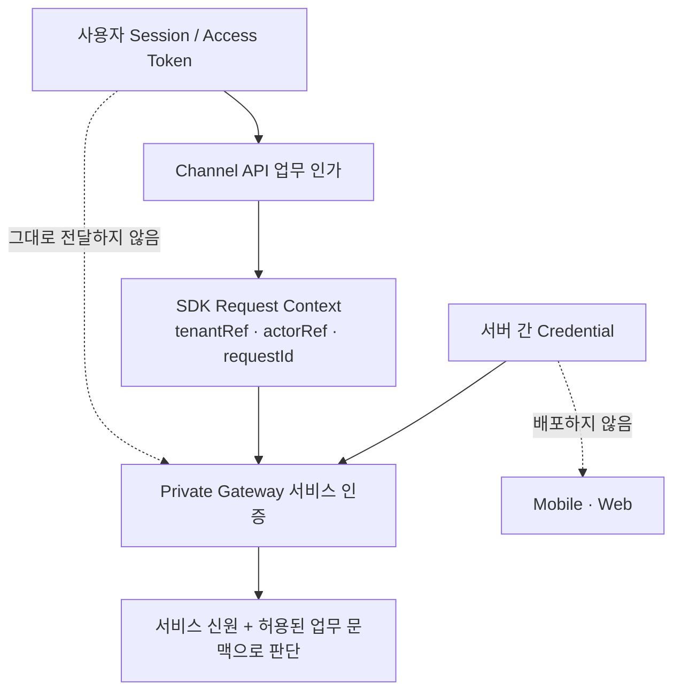

## 3. 예제 시나리오: 비동기 Operation 제출과 결과 확인

특정 업무에 종속되지 않도록 `Operation`이라는 합성 모델을 사용하겠습니다. 사용자는 채널에서 작업을 제출하고, 서버는 수락된 작업의 ID를 반환합니다. 실제 처리는 프라이빗 서비스에서 비동기로 진행됩니다.

### Channel API

```http
POST /channel/v1/operations
Authorization: Bearer <user-token>
Content-Type: application/json
Operation-Key: <client-generated-key>
X-Request-Id: <request-id>
```

```json
{
  "action": "PROCESS_RESOURCE",
  "resourceRef": "resource-demo-001",
  "options": {
    "mode": "STANDARD"
  }
}
```

이 예제에서 정상 수락 응답은 `202 Accepted`입니다. 모든 API가 반드시 `202`를 사용해야 한다는 뜻은 아닙니다. 처리가 요청 응답 안에서 끝난다면 `200` 또는 `201`이 더 자연스러울 수 있습니다.

Browser가 Channel API와 다른 Origin에서 실행된다면 `Authorization`, `Operation-Key`, `X-Request-Id` 같은 Header는 CORS Preflight와 서버 Allowlist에 포함돼야 합니다. 이는 JavaScript SDK 옵션만으로 해결할 수 있는 문제가 아니며, 가능하면 같은 Origin의 BFF 경로를 우선 검토합니다.

```json
{
  "operationId": "op-demo-001",
  "status": "ACCEPTED",
  "statusUrl": "/channel/v1/operations/op-demo-001",
  "eventCursor": "cursor-demo-001"
}
```

계약의 핵심은 URL 문자열보다 의미입니다.

| 필드 | 의미 | 규칙 |
|---|---|---|
| `operationId` | 논리 작업 식별자 | 플랫폼이 생성 규칙을 추측하지 않는 불투명 값 |
| `status` | 현재 Snapshot 상태 | 공통 상태 집합과 전이 규칙을 따름 |
| `statusUrl` | 최신 Snapshot 조회 위치 | 구성된 Channel Origin 아래의 상대 경로로 제한 |
| `eventCursor` | 이후 Event 재개 지점 | 정렬 가능한 ID라고 가정하지 않음 |
| `Operation-Key` | 중복 제출을 묶는 업무 Key | 사용자 Action 단위로 생성하고 Retry에서 재사용 |
| `X-Request-Id` | 한 번의 논리 호출 진단 ID | 멱등성이나 Trace ID를 대신하지 않음 |

## 4. 공통 계약은 네 구현보다 먼저 존재해야 한다

Channel API와 Private API의 모양은 같을 필요가 없습니다. Channel API는 고객 채널에 필요한 최소 필드와 사용자 친화적 오류를 노출하고, Private API는 서버 간 운영에 필요한 더 풍부한 문맥을 받을 수 있습니다. 두 계약 사이 변환은 고객사 서버 Adapter가 담당합니다.

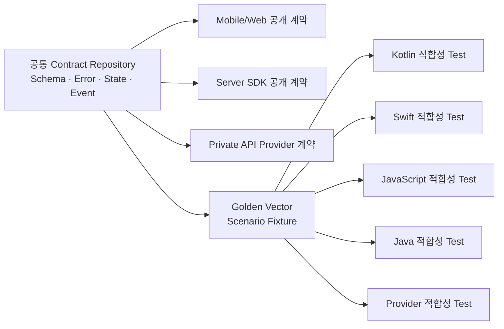

Contract Repository에는 최소 다음 항목을 둡니다.

```text
contracts/
├── channel-api/
│   └── openapi.yaml
├── private-api/
│   └── openapi.yaml
├── events/
│   └── operation-event.schema.json
├── semantics/
│   ├── operation-states.md
│   ├── error-catalog.yaml
│   └── retry-policy.yaml
└── test-vectors/
    ├── submit-accepted.json
    ├── duplicate-same-payload.json
    ├── duplicate-conflict.json
    └── event-gap-recovery.json
```

OpenAPI나 JSON Schema는 필드 형식 검증에는 유용하지만 “같은 Operation Key와 다른 Payload가 오면 충돌이어야 한다” 같은 업무 규칙을 모두 표현하지 못합니다. 그래서 Schema, 의미 문서와 실행 가능한 Vector를 함께 관리합니다.

## 5. 한 번의 Action에 세 종류의 식별자가 필요하다

식별자 하나를 모든 목적으로 재사용하면 운영 중 의미가 무너집니다.

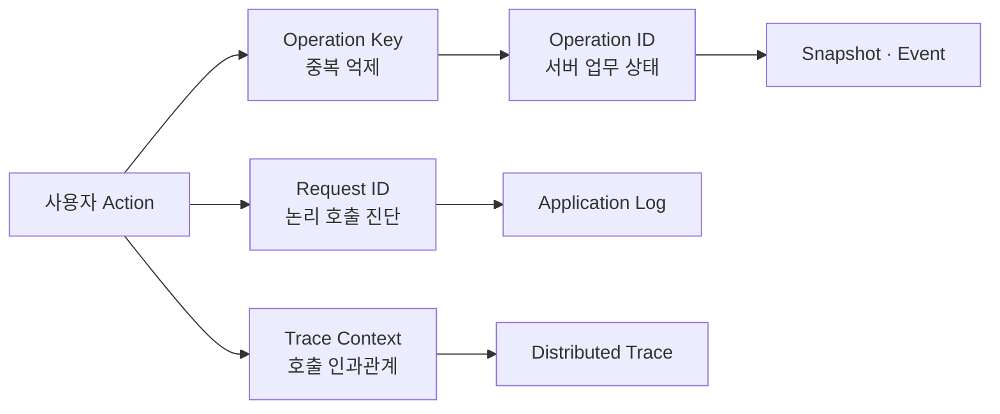

- `Operation-Key`는 같은 사용자 Action을 다시 전송해도 같은 논리 결과로 수렴시키기 위한 값입니다.
- `X-Request-Id`는 SDK가 수행한 한 번의 논리 호출을 Support Log에서 찾기 위한 값입니다.
- W3C Trace Context는 서비스 간 Span의 부모·자식 관계를 전달합니다.
- `operationId`는 서버가 수락한 업무의 수명 전체를 식별합니다.

Timeout 후 결과를 받지 못했다고 해서 새로운 `Operation-Key`로 다시 제출하면 중복 작업이 생길 수 있습니다. 반대로 별도의 사용자 Action까지 과거 Key로 보내면 새 작업이 생성되지 않습니다. SDK는 Key 생성 정책과 재사용 범위를 문서화해야 합니다.

따라서 Key는 Network 호출 직전에 메모리에서만 만드는 값이 아닙니다. **사용자 Action의 로컬 기록과 함께 먼저 저장해야 합니다.** App Process 종료나 Browser 새로고침 뒤에도 결과가 불명확한 Action을 복구할 필요가 있다면 `Operation-Key`, 요청의 정규화된 지문, 수락 후 `operationId`와 마지막 Cursor를 고객사 보안 정책에 맞는 저장소에 보관합니다. 보존 기간이 지나거나 사용자가 명시적으로 새 Action을 시작할 때만 새 Key를 만듭니다.

## 6. Android Kotlin: 화면 수명과 업무 수명을 분리한다

Android SDK는 Channel API만 알고 Private API는 알지 못합니다. 한 번의 제출은 `suspend` 함수로, 지속 상태는 `Flow`로 노출합니다.

```kotlin
interface ChannelOperations {
    suspend fun submit(
        request: SubmitOperation,
        context: RequestContext
    ): AcceptedOperation

    fun observe(operationId: String): Flow<OperationSnapshot>
}
```

ViewModel은 사용자 Action 단위의 `Operation-Key`를 만들고 수락된 `operationId`를 저장합니다. 같은 Action의 전송 결과가 불명확해 재시도할 때는 기존 Key를 재사용합니다.

아래 코드는 Coroutine과 상태 연결에 초점을 둔 축약 예제입니다. 실제 앱에서는 `submit()` 전에 Pending Action Store에 Key와 요청 지문을 기록하고, `SavedStateHandle` 또는 영속 저장소에서 복구한 기존 Key를 우선 사용해야 합니다.

```kotlin
class OperationViewModel(
    private val operations: ChannelOperations,
    private val keyFactory: OperationKeyFactory
) : ViewModel() {

    private val _state = MutableStateFlow<OperationUiState>(OperationUiState.Idle)
    val state: StateFlow<OperationUiState> = _state.asStateFlow()

    fun submit(input: OperationInput) {
        val operationKey = keyFactory.create()

        viewModelScope.launch {
            _state.value = OperationUiState.Submitting

            runCatching {
                operations.submit(
                    request = input.toRequest(),
                    context = RequestContext(operationKey = operationKey)
                )
            }.onSuccess { accepted ->
                observe(accepted.operationId)
            }.onFailure { cause ->
                if (cause is CancellationException) throw cause
                _state.value = cause.toUiState()
            }
        }
    }

    private suspend fun observe(operationId: String) {
        operations.observe(operationId).collect { snapshot ->
            _state.value = snapshot.toUiState()
        }
    }
}
```

화면에서는 Lifecycle에 맞춰 상태를 수집합니다.

```kotlin
viewLifecycleOwner.lifecycleScope.launch {
    viewLifecycleOwner.repeatOnLifecycle(Lifecycle.State.STARTED) {
        viewModel.state.collect(::render)
    }
}
```

화면을 떠나 Coroutine이 취소되는 것과 이미 서버에 수락된 Operation을 업무적으로 취소하는 것은 다릅니다. 업무 취소가 필요한 경우 `cancelOperation(operationId)` 같은 별도 API를 호출하고, 서버의 `CANCEL_REQUESTED` 또는 최종 상태를 확인해야 합니다.

## 7. iOS Swift: Task 취소를 서버 취소로 오해하지 않는다

Swift SDK도 같은 의미를 플랫폼 관습에 맞게 제공합니다.

```swift
protocol ChannelOperations: Sendable {
    func submit(
        _ request: SubmitOperation,
        context: RequestContext
    ) async throws -> AcceptedOperation

    func observe(
        operationId: String
    ) -> AsyncThrowingStream<OperationSnapshot, Error>
}
```

ViewModel은 UI 변경만 Main Actor에서 수행하고 Network 구현 전체를 Main Actor에 묶지 않습니다.

```swift
@MainActor
final class OperationViewModel: ObservableObject {
    @Published private(set) var state: OperationViewState = .idle

    private let operations: any ChannelOperations
    private var task: Task<Void, Never>?

    init(operations: any ChannelOperations) {
        self.operations = operations
    }

    func submit(_ input: OperationInput) {
        task?.cancel()
        let operationKey = UUID().uuidString

        task = Task {
            do {
                state = .submitting
                let accepted = try await operations.submit(
                    input.toRequest(),
                    context: RequestContext(operationKey: operationKey)
                )

                for try await snapshot in operations.observe(
                    operationId: accepted.operationId
                ) {
                    try Task.checkCancellation()
                    state = snapshot.toViewState()
                }
            } catch is CancellationError {
                return
            } catch {
                state = error.toViewState()
            }
        }
    }

    deinit {
        task?.cancel()
    }
}
```

Swift Concurrency의 Task 취소는 협력적입니다. Network Adapter와 Event Stream은 취소 신호를 확인하고 URLSession Task나 연결을 정리해야 합니다. 그러나 Android와 마찬가지로 로컬 Task 취소가 서버 업무 취소를 자동으로 뜻하지는 않습니다.

이 Swift 예제의 UUID 생성도 화면 수명 설명을 위한 축약입니다. 응답 유실과 App 재시작을 복구해야 하는 실제 구현은 제출 전에 Key를 저장하고, 같은 Pending Action을 다시 열었을 때 기존 Key와 `operationId`를 복원합니다.

## 8. React JavaScript: Client와 구독을 Render마다 만들지 않는다

React SDK는 Framework에 독립적인 Core Client와 React Adapter를 분리합니다. `submit()`은 Promise, Operation 상태는 외부 Store의 Snapshot과 구독으로 표현할 수 있습니다.

```javascript
export class ChannelClient {
  constructor({ baseUrl, fetchImpl, userTokenProvider }) {
    this.baseUrl = baseUrl;
    this.fetchImpl = fetchImpl;
    this.userTokenProvider = userTokenProvider;
  }

  async submit(request, { operationKey, requestId, signal }) {
    const userToken = await this.userTokenProvider.getToken({ signal });

    return this.fetchImpl(`${this.baseUrl}/channel/v1/operations`, {
      method: "POST",
      signal,
      headers: {
        "Authorization": `Bearer ${userToken}`,
        "Content-Type": "application/json",
        "Operation-Key": operationKey,
        "X-Request-Id": requestId
      },
      body: JSON.stringify(request)
    }).then(parseChannelResponse);
  }
}
```

React Component는 제출 요청의 `AbortController`와 이벤트 구독 해제를 자신의 수명에 맞게 정리합니다.

```javascript
import { useCallback, useEffect, useRef, useState } from "react";

export function useSubmitOperation(client) {
  const [state, setState] = useState({ status: "idle" });
  const controllerRef = useRef(null);

  const submit = useCallback(async (input) => {
    controllerRef.current?.abort();
    const controller = new AbortController();
    const operationKey = crypto.randomUUID();
    const requestId = crypto.randomUUID();
    controllerRef.current = controller;

    setState({ status: "submitting" });

    try {
      const accepted = await client.submit(input, {
        operationKey,
        requestId,
        signal: controller.signal
      });
      setState({ status: "accepted", accepted });
      return accepted;
    } catch (error) {
      if (error.name === "AbortError") return;
      setState({ status: "failed", error: normalizeError(error) });
      throw error;
    } finally {
      if (controllerRef.current === controller) {
        controllerRef.current = null;
      }
    }
  }, [client]);

  useEffect(() => {
    return () => controllerRef.current?.abort();
  }, []);

  return { state, submit };
}
```

외부 Operation Store를 React에 연결할 때는 `useSyncExternalStore`를 사용해 구독과 Snapshot 읽기 계약을 명시할 수 있습니다. 중요한 것은 Component Render마다 Core Client를 만들지 않고, 구독 함수가 반드시 해제 함수를 반환하게 하는 것입니다.

Hook 안에서 생성한 `operationKey` 역시 Page 새로고침을 넘는 복구가 필요하다면 Component State에만 두면 안 됩니다. 고객사 Store에 Pending Action을 먼저 기록하고 같은 사용자 Action의 재시도에서 그 Key를 다시 전달하도록 Core API를 확장합니다.

브라우저 저장소에는 서버 간 Credential을 넣지 않습니다. 사용자 Session 전략도 JavaScript가 읽을 수 있는 저장소의 위험, XSS 방어와 BFF Cookie 정책을 함께 검토해야 합니다.

## 9. Channel API: 공개 계약을 프라이빗 계약으로 변환한다

고객사 Spring Boot 서버는 단순 Proxy가 아닙니다. 사용자 인증과 Tenant 인가를 마친 뒤 공개 입력을 내부 명령으로 정규화하고, Server SDK에 서버 전용 문맥을 전달합니다.

```java
@RestController
@RequestMapping("/channel/v1/operations")
final class ChannelOperationController {

    private final PrivateOperations privateOperations;
    private final ChannelOperationMapper mapper;

    ChannelOperationController(
            PrivateOperations privateOperations,
            ChannelOperationMapper mapper) {
        this.privateOperations = privateOperations;
        this.mapper = mapper;
    }

    @PostMapping
    ResponseEntity<AcceptedOperationResponse> submit(
            @AuthenticationPrincipal ChannelPrincipal principal,
            @RequestHeader("Operation-Key") String operationKey,
            @RequestHeader("X-Request-Id") String requestId,
            @Valid @RequestBody SubmitOperationRequest request) {

        principal.requirePermission("operation:submit", request.resourceRef());

        var context = OperationContext.builder()
                .tenantRef(principal.tenantRef())
                .actorRef(principal.actorRef())
                .requestId(requestId)
                .operationKey(operationKey)
                .build();

        var command = mapper.toPrivateCommand(request);
        var accepted = privateOperations.submit(command, context);

        return ResponseEntity.accepted()
                .body(mapper.toChannelResponse(accepted));
    }
}
```

예제에서는 설명을 간결하게 하기 위해 동기식 Controller와 SDK API를 사용했습니다. 실제 처리 모델이 Servlet, Virtual Thread 또는 Reactive인지에 따라 호출 방식을 일관되게 선택해야 합니다. Reactive 경로에서 Blocking SDK 호출을 Event Loop에 올리면 안 됩니다.

Mapper는 보안 경계의 일부입니다.

- 고객이 보낸 `tenantRef`를 신뢰하지 않고 인증된 Principal에서 가져옵니다.
- 외부 `Operation-Key`와 `X-Request-Id`는 길이·문자 집합을 검증하고, 잘못된 Request ID는 안전한 서버 값으로 교체합니다.
- 공개 요청의 Allowlist 필드만 Private Command로 변환합니다.
- 프라이빗 응답의 내부 Host, 정책명, Stack Trace를 Channel 응답에 노출하지 않습니다.
- Server SDK 예외를 안정적인 Channel 오류 Code와 적절한 HTTP 상태로 바꿉니다.

상태 조회, Event 구독과 업무 취소 Endpoint도 최초 제출과 같은 사용자·Tenant 인가를 매번 수행합니다. `operationId`를 안다는 사실만으로 조회 권한이 생기지 않습니다.

## 10. Spring Boot Starter는 연결을 단순화하되 권한을 만들지 않는다

Starter는 `PrivateOperations` Bean, 전송 계층, Credential Provider와 관측성 Adapter를 조립합니다. 사용자가 직접 정의한 Bean이 있으면 자동 설정은 물러나야 합니다.

```yaml
example:
  private-api:
    enabled: true
    endpoint: ${PRIVATE_API_ENDPOINT}
    connect-timeout: 2s
    request-timeout: 8s
```

```java
@Configuration
class PrivateApiSecurityConfiguration {

    @Bean
    ServiceCredentialProvider serviceCredentialProvider(
            WorkloadCredentialSource source) {
        return source::currentCredential;
    }
}
```

설정 예시에 Secret 값을 직접 쓰지 않았다는 점이 중요합니다. Endpoint와 Timeout은 일반 설정으로 관리할 수 있지만, Credential은 Secret Manager, Workload Identity 또는 고객사 보안 체계가 소유한 공급 지점에서 실행 시 가져옵니다.

Starter가 해서는 안 되는 일도 분명합니다.

- Mobile·Web용 사용자 인증 방식을 임의로 결정하지 않습니다.
- 사용자와 Tenant의 업무 인가를 대신하지 않습니다.
- 없는 서비스 권한을 생성하지 않습니다.
- 앱 시작 시 프라이빗 API가 잠깐 느리다는 이유로 Process 전체를 무조건 종료하지 않습니다.
- 고객사가 정의한 Client, Credential Provider와 관측성 구성을 덮어쓰지 않습니다.

## 11. 전체 요청 흐름: 수락과 완료를 분리한다

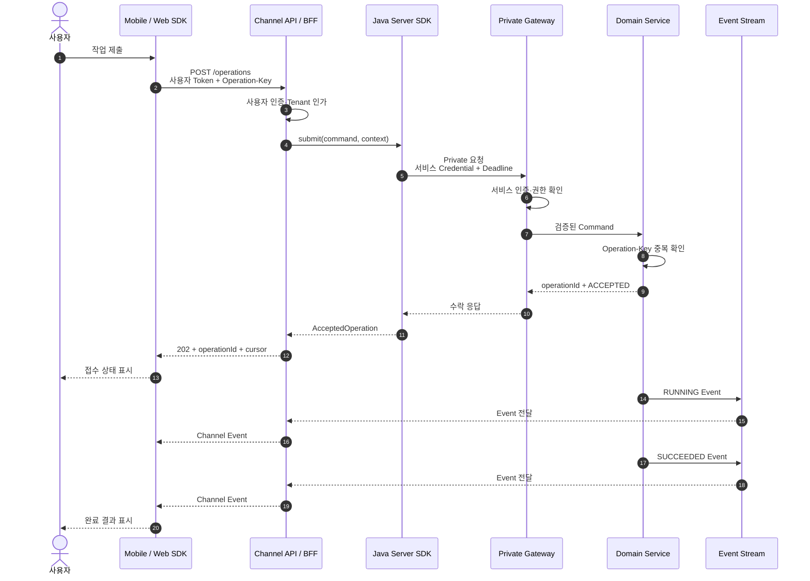

이 흐름에서 HTTP 수락 응답과 업무 완료는 별개의 사건입니다. `202`를 받았다고 성공 결과를 표시하면 안 되고, Event 연결이 끊겼다고 Operation이 실패했다고 판단해서도 안 됩니다.

## 12. Operation 상태는 Boolean이 아니라 전이 규칙이다

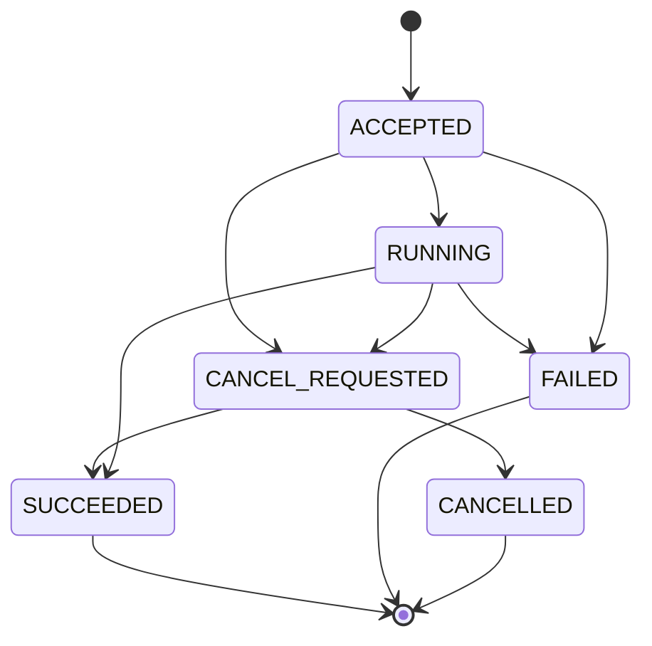

`CANCEL_REQUESTED → SUCCEEDED`가 가능한 이유는 취소 요청과 실제 처리 사이에 경쟁이 있기 때문입니다. 이미 Commit된 작업은 취소 요청보다 먼저 완료될 수 있습니다. 플랫폼별 SDK는 이 전이를 동일하게 허용해야 합니다.

| 상태 | 의미 | UI 예시 |
|---|---|---|
| `ACCEPTED` | 서버가 논리 작업을 등록함 | 접수됨 |
| `RUNNING` | 실제 처리가 진행 중임 | 처리 중 |
| `CANCEL_REQUESTED` | 취소 의도가 접수됐으나 확정되지 않음 | 취소 요청 중 |
| `SUCCEEDED` | 업무 결과가 Commit됨 | 완료 |
| `FAILED` | 자동 복구되지 않은 업무 실패 | 실패·재시도 안내 |
| `CANCELLED` | 서버가 업무 취소를 확정함 | 취소됨 |

`isLoading`, `isDone`, `hasError` 같은 Boolean 세 개로 상태를 표현하면 불가능한 조합이 생깁니다. SDK는 알 수 없는 미래 상태를 받았을 때 Crash하지 않고 `UNKNOWN(rawValue)` 또는 이에 해당하는 형태로 원본을 보존해야 합니다.

## 13. Event는 빠른 갱신 수단이고 Snapshot은 복구 기준이다

실시간 연결은 언제든 끊길 수 있습니다. 연결 성공과 Event 무손실은 같은 말이 아닙니다. SDK와 Channel API는 마지막 적용 Cursor를 저장하고 재연결 때 이후 Event를 요청하되, 보존 범위를 벗어나면 최신 Snapshot으로 대사해야 합니다.

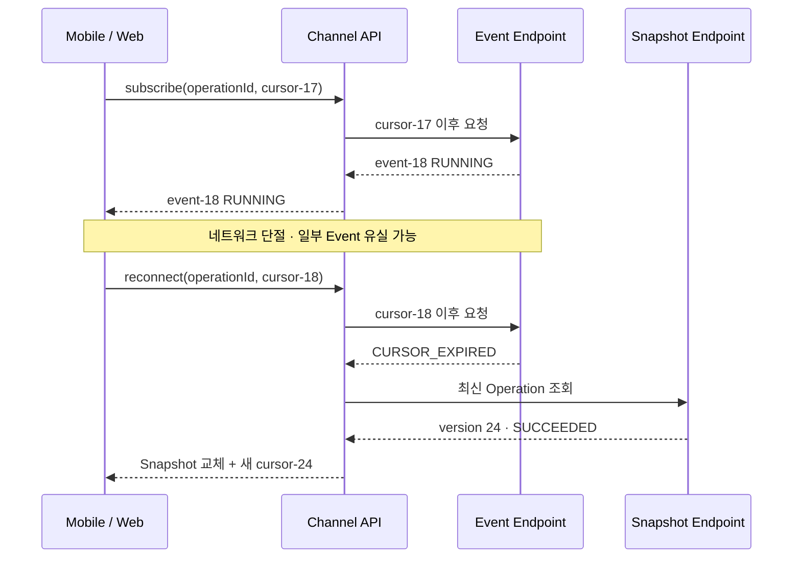

Consumer는 최소 다음 규칙을 가져야 합니다.

1. 같은 Event가 다시 와도 결과가 달라지지 않게 적용합니다.
2. 이미 적용한 Version보다 과거 Snapshot이나 Event는 무시합니다.
3. 알 수 없는 Event Type은 연결을 죽이지 않고 진단 정보와 함께 보존합니다.
4. Cursor 만료와 권한 만료를 같은 재연결 오류로 합치지 않습니다.
5. 최종 상태에 도달하면 불필요한 구독을 정리합니다.
6. 앱이 장시간 백그라운드에 있었다면 Event만 믿지 않고 Snapshot을 다시 읽습니다.

Event 전달 보장이 at-least-once라면 중복 제거가 필요합니다. WebSocket, Server-Sent Events 또는 Polling 중 어떤 Transport를 쓰더라도 이 업무 의미는 유지돼야 합니다.

## 14. 멱등성은 Channel API와 Domain Service가 함께 지킨다

Mobile Network는 요청을 보냈지만 응답을 받지 못하는 상황이 흔합니다. 이때 SDK만 중복을 막거나 서버만 Retry하면 충분하지 않습니다.

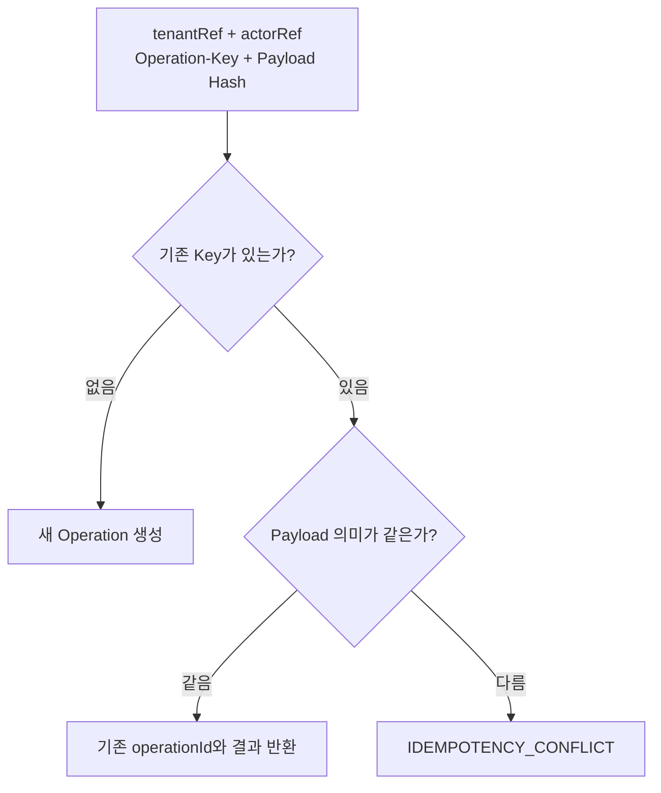

멱등성 저장소의 Scope는 전역 문자열 하나보다 `고객사 서비스 신원 + Tenant + Actor 또는 업무 범위 + Operation-Key`처럼 정의합니다. 같은 Key와 다른 의미의 Payload가 오면 과거 결과를 조용히 반환하지 않고 충돌로 처리해야 합니다.

여기서 Payload Hash는 수신한 JSON Byte를 그대로 Hash한 값이 아닙니다. 공백·필드 순서·기본값 표현이 달라도 같은 의미일 수 있으므로 검증과 기본값 적용을 마친 정규화된 Domain Command를 기준으로 비교합니다. Key 등록과 Operation 생성은 하나의 원자적 경계에서 처리해야 하며, 경쟁 요청 두 개가 모두 새 작업을 만들지 못하게 Unique Constraint 또는 동등한 동시성 통제가 필요합니다.

Operation 상태 변경과 Event 발행 사이에도 원자성이 필요합니다. 상태 Transaction은 성공했는데 Event Broker 전송만 실패하면 실시간 Consumer가 영원히 갱신되지 않을 수 있습니다. Transactional Outbox 같은 패턴으로 상태와 발행할 Event를 함께 기록하고, Relay가 중복 가능성을 전제로 전달하면 Snapshot·Event 복구 계약과 연결됩니다.

Retry 책임도 구분합니다.

| 계층 | 허용 가능한 자동 복구 | 피해야 할 동작 |
|---|---|---|
| Mobile·Web SDK | 연결 재개, 안전한 조회 재시도 | 새 Key로 변경 요청 자동 재제출 |
| Channel API | 짧은 전송 실패를 Deadline 안에서 제한 재시도 | 요청 Thread를 넘긴 무제한 재시도 |
| Server SDK | 정책에 포함된 일시 오류 재시도 | 업무 의미를 모른 채 모든 POST 재시도 |
| Domain Service | 동일 Key 재생, Transaction 복구 | 서로 다른 Payload를 같은 요청으로 간주 |

여러 계층이 각각 세 번씩 재시도하면 실제 전송은 곱셈으로 증가합니다. End-to-End Deadline과 Retry Budget을 먼저 정하고 한 계층이 주도권을 갖게 해야 합니다.

## 15. Timeout과 취소는 계층마다 의미가 다르다

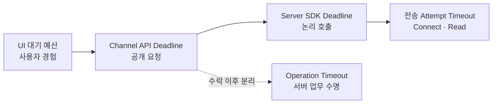

- UI Timeout은 사용자가 더 기다리지 않겠다는 의미일 수 있습니다.
- Channel API Deadline은 공개 HTTP 요청의 응답 예산입니다.
- Server SDK Deadline은 Retry를 포함한 논리 호출 전체 예산입니다.
- 전송 Timeout은 개별 연결과 응답 대기 상한입니다.
- Operation Timeout은 비동기 업무가 종료돼야 하는 서버 측 정책입니다.

App의 HTTP 요청이 취소돼도 Channel API가 이미 Private API에서 `ACCEPTED`를 받았다면 Operation은 계속될 수 있습니다. 따라서 앱은 동일한 `Operation-Key`로 결과를 조회하거나 재제출해 기존 `operationId`를 회수할 수 있어야 합니다.

업무 취소 API는 별도로 설계합니다.

```http
POST /channel/v1/operations/op-demo-001/cancellation
Authorization: Bearer <user-token>
Operation-Key: <cancel-action-key>
```

취소 요청 자체도 중복 전달될 수 있으므로 별도의 멱등성 범위가 필요합니다.

## 16. 오류는 RFC 9457 모양과 안정적인 업무 Code를 함께 쓴다

Channel API가 HTTP 기반이라면 RFC 9457 Problem Details를 오류 Envelope로 사용할 수 있습니다. `type`, `title`, `status`, `detail`, `instance`에 더해 플랫폼이 분기할 안정적인 `code`와 안전한 복구 힌트를 확장 필드로 정의합니다.

```http
HTTP/1.1 409 Conflict
Content-Type: application/problem+json
```

```json
{
  "type": "https://docs.example.invalid/problems/idempotency-conflict",
  "title": "Operation key conflict",
  "status": 409,
  "code": "IDEMPOTENCY_CONFLICT",
  "detail": "The operation key was already used for a different request.",
  "instance": "/channel/v1/problems/problem-demo-001",
  "retryable": false,
  "requestId": "request-demo-001"
}
```

`example.invalid`는 문서용 예약 Domain을 사용한 합성 값입니다. 실제 서비스에서는 조직이 통제하는 안정적인 Problem Type URI와 문서를 제공합니다.

| Code | 채널 의미 | SDK 처리 예 |
|---|---|---|
| `AUTH_REQUIRED` | 사용자 Session 갱신 필요 | 재인증 흐름 |
| `FORBIDDEN_OPERATION` | 인증됐지만 업무 권한 없음 | 재시도 없이 권한 안내 |
| `VALIDATION_FAILED` | 입력 계약 위반 | 필드 오류 표시 |
| `IDEMPOTENCY_CONFLICT` | 같은 Key에 다른 요청 | 새 사용자 Action인지 확인 |
| `TEMPORARILY_UNAVAILABLE` | 일시적 서비스 불가 | `retryable`·Deadline 정책 확인 |
| `CURSOR_EXPIRED` | Event 재개 지점 만료 | Snapshot 재조회 |
| `OPERATION_NOT_FOUND` | 존재하지 않거나 조회 권한 없음 | 정보 노출을 고려한 동일 응답 가능 |

`detail` 문자열을 파싱해 분기하지 않습니다. 또한 Private SDK의 `TlsHandshakeException`, 내부 Route, Stack Trace를 그대로 Channel 응답으로 내보내지 않습니다. RFC 9457도 Problem Details가 내부 디버깅 정보를 노출하는 수단이 아님을 명시합니다.

## 17. 관측성: 같은 흐름을 찾되 개인정보는 복사하지 않는다

End-to-End 추적은 모든 Header를 로그에 남기는 작업이 아닙니다.

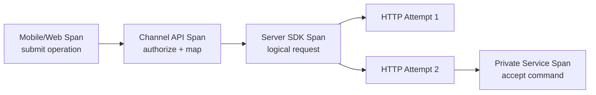

W3C Trace Context와 OpenTelemetry Propagator를 사용하면 Process 경계를 넘어 Trace의 인과관계를 전달할 수 있습니다. 그러나 외부에서 들어온 Trace Header를 무조건 신뢰하거나 모든 Baggage를 프라이빗 망으로 복사해서는 안 됩니다. 허용 필드, 크기 제한과 재생성 정책을 정합니다.

관측성 필드의 예시는 다음과 같습니다.

| 필드 | Log | Metric Label | Trace Attribute | 주의점 |
|---|---:|---:|---:|---|
| `requestId` | O | X | O | 사용자에게 Support ID로 제공 가능 |
| `operationId` | O | X | O | 고유값을 Metric Label로 쓰지 않음 |
| `tenantRef` | 조건부 가명 | 제한된 등급만 | 조건부 | 원본 고객명 금지 |
| `error.code` | O | O | O | 안정적인 저 Cardinality 값 |
| `retry.attempt` | O | O | O | 논리 요청과 실제 Attempt 구분 |
| Access Token·Cookie | X | X | X | 원문 기록 금지 |
| 요청 Payload | 기본 X | X | 기본 X | 명시적 Allowlist·Masking 필요 |

Support 화면에는 원본 Trace ID 전체 대신 정책에 맞는 `requestId`를 보여줄 수 있습니다. 운영자는 이 값으로 Channel Log를 찾고 연결된 Trace와 `operationId`를 따라갑니다.

## 18. 호환성 확인은 첫 업무 요청보다 앞에서 수행한다

네 SDK가 독립적으로 배포되면 Package Version만 보고 전체 호환성을 판단할 수 없습니다. Channel API는 지원 Contract Version과 Capability를 안전한 Metadata Endpoint로 제공할 수 있습니다.

```json
{
  "contractVersion": "2026-07",
  "capabilities": [
    "operation.submit.v1",
    "operation.cancel.v1",
    "operation.events.resume.v1"
  ],
  "minimumClients": {
    "android": "3.8.0",
    "ios": "2.6.0",
    "web": "5.1.0"
  }
}
```

이 숫자는 실제 배포 Version이 아닌 합성 예시입니다. 앱은 알 수 없는 Capability를 추측해서 사용하지 않고, 필요한 기능이 없으면 기능을 숨기거나 명시적인 업그레이드 안내를 제공합니다.

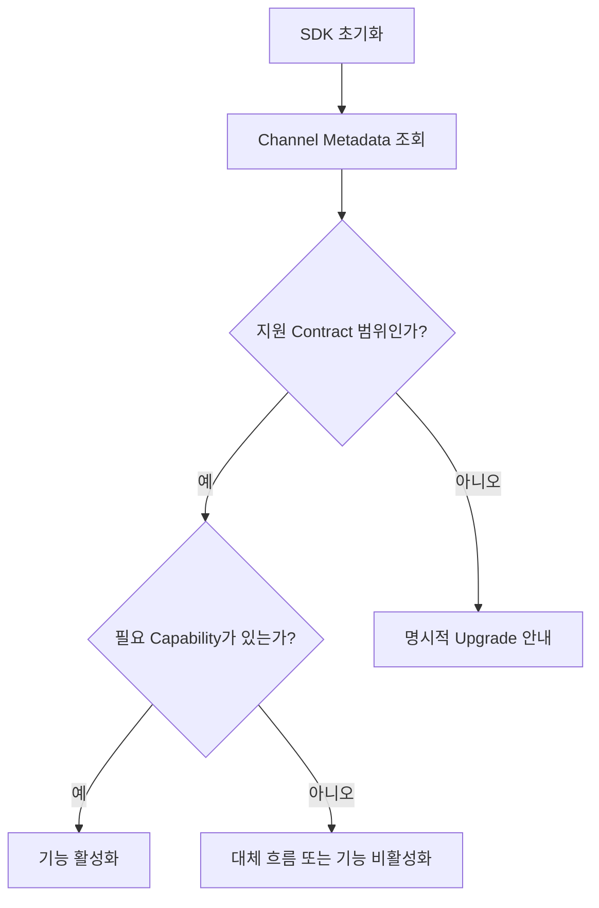

Metadata 조회 실패가 앱 전체 시작 실패를 뜻할 필요는 없습니다. 마지막으로 검증된 Metadata의 만료 정책과 안전한 기본 동작을 정하되, 권한이 없는 기능을 낙관적으로 활성화하지 않습니다.

## 19. End-to-End Test는 실제 경계에서 실패를 만들어야 한다

Unit Test만으로는 “각 모듈은 성공하지만 전체 흐름은 실패하는” 문제를 찾기 어렵습니다. 반대로 모든 경우를 실제 프라이빗 환경에서만 테스트하면 느리고 재현성이 떨어집니다.

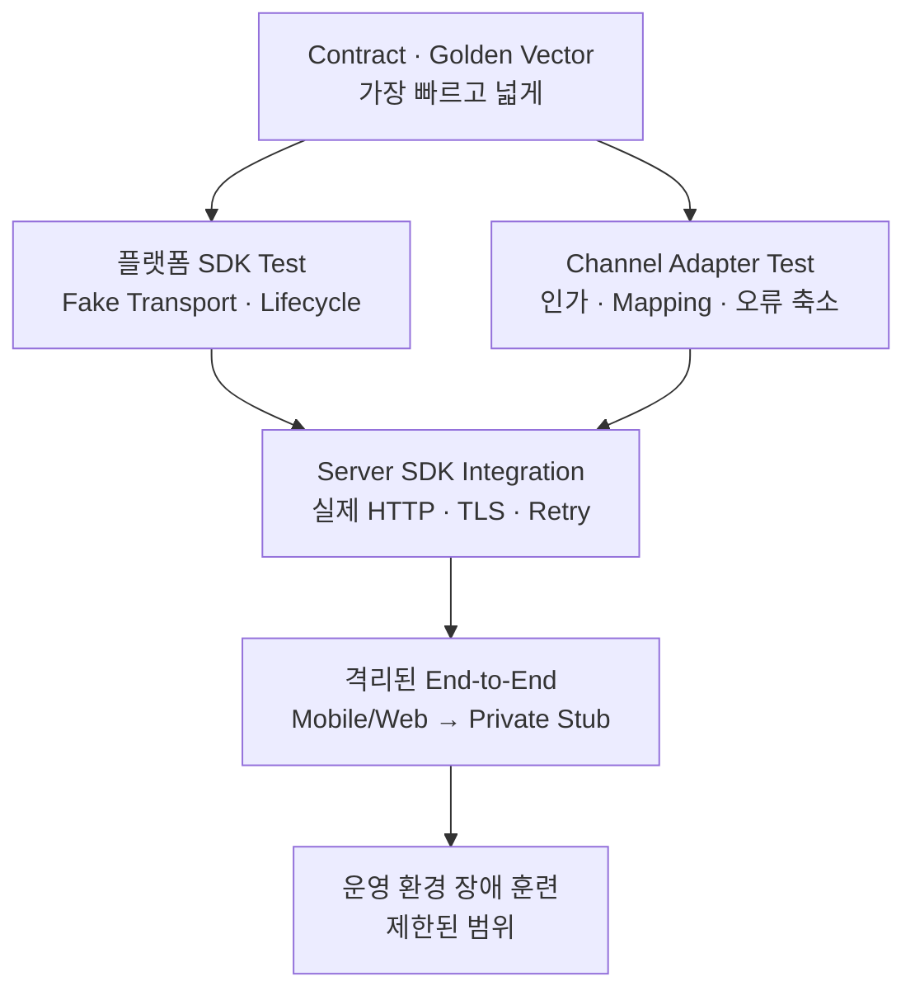

### 필수 Scenario Matrix

| Scenario | 주입 조건 | 기대 결과 |
|---|---|---|
| 정상 완료 | `ACCEPTED → RUNNING → SUCCEEDED` | 모든 플랫폼이 같은 최종 상태 표시 |
| 응답 유실 | Private API 수락 후 Channel 응답 단절 | 같은 Key로 기존 `operationId` 회수 |
| 중복 제출 | 같은 Key·같은 Payload 두 번 | 한 Operation, 동일 결과 |
| Key 충돌 | 같은 Key·다른 Payload | `IDEMPOTENCY_CONFLICT` |
| 사용자 권한 없음 | 인증 성공·업무 인가 실패 | Private API 호출 없음 |
| 다른 사용자 Operation 조회 | 유효한 `operationId`·다른 Principal | 존재 정보 노출 없이 접근 거부 |
| 서비스 인증 만료 | Server Credential 갱신 필요 | 제한된 갱신 후 재시도 또는 명시적 실패 |
| Event 중복 | 같은 Event 두 번 전달 | 상태 한 번 적용 |
| Event 누락 | Cursor 보존 범위 초과 | Snapshot으로 수렴 |
| 취소 경쟁 | 완료 직전 업무 취소 | 허용된 최종 상태만 관측 |
| 상태 Commit 후 Event 전송 실패 | Outbox Relay 일시 중지 | 재개 후 중복 안전하게 전달·Snapshot 일치 |
| Deadline 소진 | 첫 Attempt 후 예산 부족 | 추가 Retry 없이 종료 |
| 알 수 없는 상태 | 미래 상태 값 응답 | Crash 없이 원본 보존·기능 제한 |
| Version 불일치 | 지원 범위 밖 Contract | 업무 요청 전에 차단 |

Android Test는 가상 시간과 Lifecycle 재시작, Swift Test는 Task 취소와 `AsyncStream` 종료, React Test는 Unmount·Abort·구독 해제, Java Test는 Credential 갱신·Retry·멱등성 전달을 각각 검증합니다. 공통 Scenario Fixture를 사용하되 한 SDK의 출력물을 다른 SDK의 정답으로 삼지는 않습니다.

## 20. 배포 순서도 End-to-End 계약이다

기능 하나가 Private API, Server SDK, Channel API와 세 Client SDK에 걸쳐 있다면 “동시에 배포”라는 말만으로는 부족합니다. 실제 배포 시점은 고객사와 Store 심사 때문에 달라집니다.

안전한 순서는 보통 다음과 같습니다.

1. Provider가 기존 Consumer를 깨지 않는 방식으로 새 계약과 Capability를 먼저 지원합니다.
2. Server SDK와 Spring Boot Starter를 배포하고 실제 고객사 유사 환경에서 검증합니다.
3. Channel API가 새 기능을 비활성 상태로 배포합니다.
4. Android·iOS·Web SDK를 배포하고 Compatibility Matrix에 검증 조합을 기록합니다.
5. 고객사 Channel이 새 SDK를 통합한 뒤 Capability 또는 Feature Flag를 제한적으로 엽니다.
6. 관측성과 오류율, 중복 처리와 Event 복구를 확인하며 범위를 확대합니다.
7. 구버전 제거는 사용량과 지원 기간을 확인한 별도 Breaking Change로 진행합니다.

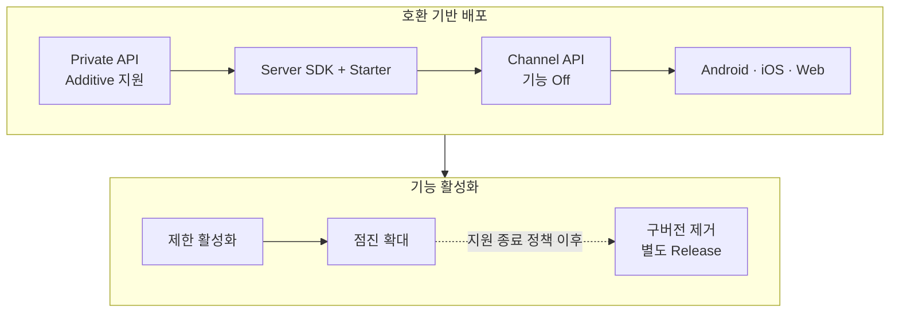

Client가 먼저 배포돼도 Capability가 없으면 기능을 사용하지 않아야 하고, Provider가 먼저 배포돼도 기존 요청 의미가 바뀌면 안 됩니다. Rollback 역시 DB 상태와 이미 수락된 Operation을 고려해야 하므로 단순 Binary 되돌리기보다 호환 구간 유지와 Roll-forward를 우선 검토합니다.

## 21. 운영 Runbook은 사용자 증상에서 시작한다

장애 대응 문서는 내부 Component 이름보다 사용자가 관측한 증상에서 출발해야 합니다.

| 사용자 증상 | 첫 확인 | 다음 확인 | 금지할 대응 |
|---|---|---|---|
| 제출 후 응답 없음 | `requestId`, Operation Key 재조회 | Channel·SDK Deadline과 Private 수락 여부 | 새 Key로 무조건 재제출 |
| 처리 중에서 멈춤 | `operationId` 최신 Snapshot | Event Cursor·Consumer Lag | Event 연결만 재시작하고 끝냄 |
| 갑자기 재인증 요구 | 사용자 Session 만료 | 서비스 Credential 오류와 분리 | 서버 Secret을 Client에 전달 |
| 일부 고객만 실패 | 가명 Tenant 등급·권한 정책 | Capability·Version Matrix | 고객 원본 데이터를 일반 Log에 출력 |
| 취소했는데 완료됨 | 상태 전이와 Commit 시점 | 취소 요청 수락·처리 Event | 로컬 Task 취소를 서버 취소로 단정 |
| 중복 결과 | 같은 Key Scope·Payload Hash | Retry 증폭·Outbox 중복 | 결과 Row를 수동 삭제해 원인 은폐 |

Runbook에는 Dashboard, Log Query 예시, 안전한 재처리 절차, 담당 소유자와 고객 안내 문구를 연결합니다. 단, 공개 기술문서에는 실제 내부 URL, 계정, IP와 운영 명령을 포함하지 않습니다.

## 22. 구현 체크리스트

### 신뢰 경계

- [ ] Mobile·Web Package에 Private Endpoint와 서버 전용 Secret이 없는가
- [ ] 사용자 인증과 서비스 인증의 토큰·Scope·수명 주기가 분리됐는가
- [ ] Tenant와 Actor 문맥을 요청 본문이 아니라 검증된 Principal에서 만드는가
- [ ] Channel Mapper가 공개 입력과 프라이빗 명령 사이 Allowlist 역할을 하는가

### 요청과 상태

- [ ] Operation Key, Request ID, Trace Context와 Operation ID의 의미가 구분됐는가
- [ ] 수락과 완료를 별도 상태로 표현하는가
- [ ] 상태 전이와 취소 경쟁 조건이 문서화됐는가
- [ ] 같은 Key·다른 Payload가 충돌로 처리되는가

### 이벤트와 복구

- [ ] Event 중복 적용이 안전한가
- [ ] Cursor 만료 시 Snapshot으로 복구하는가
- [ ] 앱 Background·Browser 재접속 후 최신 상태로 대사하는가
- [ ] 종료 상태에서 구독과 Network 자원을 정리하는가

### 플랫폼 수명

- [ ] Kotlin Coroutine 취소가 `CancellationException`으로 전파되는가
- [ ] Swift Task와 `AsyncSequence`가 종료 시 자원을 정리하는가
- [ ] React Unmount에서 요청 취소와 구독 해제가 실행되는가
- [ ] Java Client가 장수명으로 재사용되고 자원 소유권이 명확한가

### 운영과 배포

- [ ] Deadline 안에서 Retry Budget이 제한되는가
- [ ] 오류가 안정적인 Code로 정규화되고 내부 정보가 제거되는가
- [ ] 고유 식별자를 Metric Label로 사용하지 않는가
- [ ] Compatibility Matrix와 Capability가 자동 검증되는가
- [ ] 응답 유실·중복·Event Gap·Credential 만료 Scenario가 CI에 있는가
- [ ] 실제 Package를 설치한 Consumer Project로 Release를 검증하는가

## 마무리

멀티플랫폼 SDK 통합의 핵심은 네 언어로 같은 HTTP 요청을 만드는 것이 아닙니다. 고객이 원하는 Mobile·Web 경험을 자유롭게 구현하면서도 프라이빗 API의 신뢰 경계, 인증, 상태와 장애 의미를 끝까지 보존하는 것입니다.

전체 흐름은 다음 원칙으로 요약할 수 있습니다.

1. Mobile·Web은 고객사 Channel API를 호출하고 Server SDK만 프라이빗 API와 통신합니다.
2. 사용자 신원과 서비스 신원을 분리하고 각 경계에서 다시 인가합니다.
3. 변경 요청은 Operation Key로 수렴시키고 수락과 완료를 분리합니다.
4. Event는 빠른 갱신에, Snapshot은 복구와 대사에 사용합니다.
5. 로컬 취소, HTTP Timeout과 서버 업무 취소를 같은 의미로 다루지 않습니다.
6. 오류·상태·이벤트 의미를 공통 계약과 적합성 Test로 고정합니다.
7. Request ID, Trace와 Operation ID를 구분해 한 흐름을 안전하게 추적합니다.
8. Provider부터 Additive하게 배포하고 Capability로 점진 활성화합니다.

이 구조를 갖추면 SDK는 단순한 개발 편의 Library를 넘어 고객 채널의 자유도와 프라이빗 서비스의 통제를 연결하는 제품 경계가 됩니다.

---

## 함께 읽기

- [프라이빗 API를 보호하는 멀티플랫폼 SDK 아키텍처](https://aiarchitect.tistory.com/40)
- [프라이빗 API를 연결하는 Java Server SDK 설계](https://aiarchitect.tistory.com/41)
- [고객사 서버에 SDK를 연결하는 Spring Boot Starter](https://aiarchitect.tistory.com/38)
- [프라이빗 망 Server SDK 운영 안정성](https://aiarchitect.tistory.com/39)
- [고객 맞춤형 Android 앱을 위한 Kotlin SDK](https://aiarchitect.tistory.com/42)
- [고객 맞춤형 iOS 앱을 위한 Swift SDK](https://aiarchitect.tistory.com/43)
- [고객 맞춤형 웹을 위한 React JavaScript SDK](https://aiarchitect.tistory.com/44)
- [크로스플랫폼 SDK 공통 계약과 적합성 테스트](https://aiarchitect.tistory.com/45)

## 공식 참고 자료

- OpenAPI Initiative, [OpenAPI Specification](https://spec.openapis.org/oas/)
- IETF, [RFC 9457: Problem Details for HTTP APIs](https://www.rfc-editor.org/rfc/rfc9457.html)
- W3C, [Trace Context](https://www.w3.org/TR/trace-context/)
- OpenTelemetry, [Propagators API](https://opentelemetry.io/docs/specs/otel/context/api-propagators/)
- Spring Boot, [Creating Your Own Auto-configuration](https://docs.spring.io/spring-boot/reference/features/developing-auto-configuration.html)
- Android Developers, [Use Kotlin coroutines with lifecycle-aware components](https://developer.android.com/topic/libraries/architecture/views/coroutines-views)
- Android Developers, [Security checklist](https://developer.android.com/privacy-and-security/security-tips)
- Swift, [Concurrency](https://docs.swift.org/swift-book/LanguageGuide/Concurrency.html)
- Apple Developer, [Keychain services](https://developer.apple.com/documentation/security/keychain-services)
- React, [`useSyncExternalStore`](https://react.dev/reference/react/useSyncExternalStore)
- React, [`useEffect`](https://react.dev/reference/react/useEffect)
- OWASP Cheat Sheet Series, [HTML5 Security](https://cheatsheetseries.owasp.org/cheatsheets/HTML5_Security_Cheat_Sheet.html)

> 이 글은 공식 문서를 기반으로 한 일반화된 합성 예시입니다.
> 실제 적용 시에는 고객사 네트워크, 인증 체계, 개인정보 정책, Android·iOS·Browser 지원 범위,
> Spring Boot와 각 SDK Version, Private API의 업무 특성 및 장애 복구 정책에 맞춘 별도 검증이 필요합니다.
