# OWASP Top 10:2025로 시작하는 Secure Coding: SQL Injection·Brute Force·Log Forging 방어

보안 코딩(Secure Coding)은 위험한 문자열 몇 개를 차단하는 규칙이 아닙니다. 신뢰할 수 없는 입력이 데이터베이스 Query, 인증 판단과 운영 Log로 이동할 때 **데이터가 명령으로 해석되지 않게 하고, 반복 공격을 제어하며, 남겨진 증거를 신뢰할 수 있게 만드는 개발 방식**입니다.

SQL Injection, Brute Force와 Log Forging은 오래 알려진 공격이지만 지금도 중요합니다.

- SQL Injection은 입력값이 SQL 명령의 구조를 바꾸게 합니다.
- Brute Force는 인증 기능을 대량의 추측 요청을 처리하는 Password Oracle로 만듭니다.
- Log Forging은 공격자가 운영 기록의 줄과 필드를 조작해 탐지와 조사를 방해하게 합니다.

세 문제는 서로 떨어져 있지 않습니다. 공격자는 Injection을 시도하고, 인증을 반복 공격하며, 그 과정에서 생성되는 Log까지 오염시킬 수 있습니다.

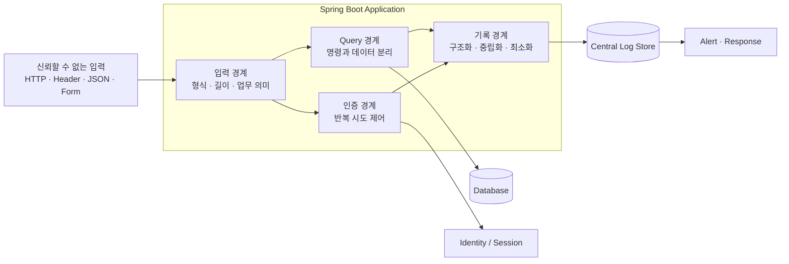

이 글은 Java 21과 Spring Boot 3 기반의 합성 예제로 세 취약점을 설명합니다. 특정 고객, 제품, 실제 Endpoint와 운영 계정을 재현하지 않습니다.

## 1. OWASP Top 10:2025에서 세 문제의 위치

2026년 8월 기준 최신 공개판인 OWASP Top 10:2025는 다음 열 가지 위험을 제시합니다. 모바일에서도 범주와 적용 관계를 함께 읽을 수 있도록 항목별로 정리했습니다.

- **A01 · Broken Access Control** — Query 결과에 사용자·Tenant 인가를 적용해야 합니다.
- **A02 · Security Misconfiguration** — Debug 오류와 기본 계정이 공격을 돕지 않아야 합니다.
- **A03 · Software Supply Chain Failures** — 보안 Library와 Dependency의 출처·취약점을 관리해야 합니다.
- **A04 · Cryptographic Failures** — Password를 안전한 Hash로 저장하고 Secret을 보호해야 합니다.
- **A05 · Injection** — SQL Injection과 Log 처리 계층의 Injection을 방지해야 합니다.
- **A06 · Insecure Design** — Rate Limit·Abuse Case를 설계 단계에서 정의해야 합니다.
- **A07 · Authentication Failures** — Brute Force·Credential Stuffing·Password Spraying을 제어해야 합니다.
- **A08 · Software or Data Integrity Failures** — 보안 설정과 배포 결과의 무결성을 확인해야 합니다.
- **A09 · Security Logging & Alerting Failures** — Log Forging·민감정보 기록·탐지 실패를 방지해야 합니다.
- **A10 · Mishandling of Exceptional Conditions** — 실패 시 안전하게 닫고 내부 오류를 노출하지 않아야 합니다.

OWASP Top 10은 인식 문서입니다. 구현 완료 여부를 판단할 때는 더 구체적인 검증 요구사항을 제공하는 OWASP Application Security Verification Standard(ASVS)와 조직의 Threat Model을 함께 사용해야 합니다.

## 2. Secure Coding의 공통 원칙

세 취약점을 관통하는 원칙은 다음과 같습니다.

1. 외부에서 온 값은 출처가 내부 시스템이어도 다시 검증합니다.
2. 입력값과 실행할 명령의 구조를 분리합니다.
3. 입력 검증을 SQL Parameter Binding이나 출력 Encoding의 대체 수단으로 사용하지 않습니다.
4. 정상 사용자와 공격자의 자원 소비를 함께 고려합니다.
5. 보안 실패는 사용자에게 최소한으로 알리고 서버에는 조사 가능한 Event로 남깁니다.
6. Password·Access Token·Session ID·암호화 Key와 원문 개인정보를 Log에 남기지 않습니다.
7. 방어 기능은 Unit Test뿐 아니라 실제 Database·동시성·Log Sink를 포함한 통합 Test로 검증합니다.
8. 보안 Control 장애를 조용히 정상 허용으로 바꾸지 않습니다. 고위험 작업은 Fail Closed를 기본으로 하고, 인증 Rate Limit처럼 가용성과 충돌하는 Control은 사전에 승인한 제한적 Degraded Mode·Edge 제한·즉시 Alert를 함께 설계합니다.

#### 요청과 Control 검증

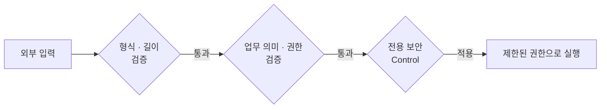

#### 실패와 실행 결과의 관찰

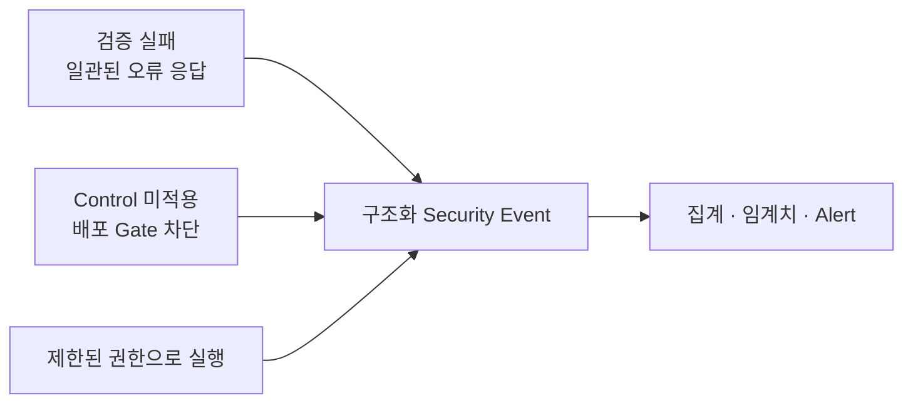

검증 실패는 일관된 응답으로 닫고, Control 미적용은 배포 단계에서 차단합니다. 실행·실패 결과는 같은 구조의 Security Event와 탐지 흐름으로 연결합니다.

## 3. SQL Injection: 입력값이 Query 구조를 바꾸는 문제

SQL Injection은 SQL처럼 보이는 문자열이 들어왔다는 사실만으로 발생하지 않습니다. 애플리케이션이 사용자 입력을 SQL 명령 문자열에 연결하고, Database가 그 결과를 하나의 명령으로 해석할 때 발생합니다.

### 취약한 코드

다음 코드는 검색어를 SQL 문자열에 직접 연결합니다.

```java
@Repository
public class UnsafeCustomerRepository {

    private final JdbcTemplate jdbcTemplate;

    public UnsafeCustomerRepository(JdbcTemplate jdbcTemplate) {
        this.jdbcTemplate = jdbcTemplate;
    }

    public List<CustomerRow> findByEmail(String tenantId, String email) {
        String sql = """
            SELECT id, tenant_id, email, display_name
              FROM customer
             WHERE tenant_id = '%s'
               AND email = '%s'
            """.formatted(tenantId, email);

        return jdbcTemplate.query(sql, CustomerRow.MAPPER);
    }
}
```

문제는 `email`에 따옴표가 포함될 수 있다는 것이 아니라, **입력값이 SQL 문법과 같은 문자열 공간에 놓인다는 것**입니다. 공격자는 조건식을 추가하거나 Comment 구문을 이용해 원래 Query의 의미를 바꾸려 할 수 있습니다.

입력값에서 `'`, `--` 또는 특정 단어를 지우는 Blacklist는 완전한 방어가 아닙니다. Database, Encoding, Comment 문법과 Query가 바뀔 때 우회가 생기기 쉽습니다.

### 안전한 코드: Parameterized Query

SQL 구조를 먼저 고정하고 값은 별도 Parameter로 전달합니다.

```java
@Repository
public class CustomerRepository {

    private static final String FIND_BY_EMAIL = """
        SELECT id, tenant_id, email, display_name
          FROM customer
         WHERE tenant_id = ?
           AND email = ?
        """;

    private final JdbcTemplate jdbcTemplate;

    public CustomerRepository(JdbcTemplate jdbcTemplate) {
        this.jdbcTemplate = jdbcTemplate;
    }

    public Optional<CustomerRow> findByEmail(String tenantId, String email) {
        List<CustomerRow> rows = jdbcTemplate.query(
            FIND_BY_EMAIL,
            CustomerRow.MAPPER,
            tenantId,
            email
        );
        return rows.stream().findFirst();
    }
}
```

Parameter Binding을 사용하면 입력값은 SQL Code가 아니라 값으로 전달됩니다. 입력값에 SQL처럼 보이는 문자가 있어도 Query 구조를 바꾸지 않습니다.

JPA를 사용해도 문자열 연결을 피해야 합니다.

```java
public interface CustomerJpaRepository extends JpaRepository<CustomerEntity, UUID> {

    @Query("""
        select c
          from CustomerEntity c
         where c.tenantId = :tenantId
           and c.email = :email
        """)
    Optional<CustomerEntity> findByTenantAndEmail(
        @Param("tenantId") String tenantId,
        @Param("email") String email
    );
}
```

ORM을 사용한다는 사실만으로 안전해지는 것은 아닙니다. JPQL, Native Query 또는 Criteria를 사용자 문자열과 연결하면 같은 문제가 생길 수 있습니다.

### 동적 정렬과 Column 이름은 값 Parameter가 아니다

Column, Table 이름과 정렬 방향은 일반적인 값 Parameter로 Bind할 수 없습니다. 이때 요청값을 그대로 붙이지 않고 서버가 소유한 Allowlist에 매핑합니다.

```java
public enum CustomerSort {
    CREATED_AT("created_at"),
    DISPLAY_NAME("display_name");

    private final String column;

    CustomerSort(String column) {
        this.column = column;
    }

    public String column() {
        return column;
    }

    public static CustomerSort fromRequest(String value) {
        return switch (value) {
            case "createdAt" -> CREATED_AT;
            case "displayName" -> DISPLAY_NAME;
            default -> throw new IllegalArgumentException("unsupported sort field");
        };
    }
}
```

```java
public enum SortDirection {
    ASC,
    DESC;

    public static SortDirection fromRequest(String value) {
        return switch (value.toLowerCase(Locale.ROOT)) {
            case "asc" -> ASC;
            case "desc" -> DESC;
            default -> throw new IllegalArgumentException("unsupported direction");
        };
    }
}
```

```java
String sql = """
    SELECT id, tenant_id, email, display_name
      FROM customer
     WHERE tenant_id = ?
     ORDER BY %s %s
    """.formatted(sort.column(), direction.name());

return jdbcTemplate.query(sql, CustomerRow.MAPPER, tenantId);
```

문자열 조합이 남아 있지만 `sort.column()`과 `direction.name()`은 요청 원문이 아니라 서버에 선언된 Enum 값입니다. 허용되지 않은 값은 Query 생성 전에 거부됩니다.

### 입력 검증과 Parameter Binding의 역할을 구분한다

```java
public record CustomerSearchRequest(
    @NotBlank
    @Size(max = 254)
    @Email
    String email
) {}
```

Validation은 잘못된 길이와 형식을 일찍 거부해 업무 오류와 자원 낭비를 줄입니다. 하지만 `@Email`이나 정규식은 SQL Injection의 주 방어가 아닙니다. SQL Injection의 주 방어는 Parameterized Query입니다.

Tenant ID처럼 권한 범위를 결정하는 값은 요청 DTO를 그대로 신뢰하지 않고 검증된 인증 Context에서 가져옵니다.

```java
@Service
public class CustomerSearchService {

    private final TenantContext tenantContext;
    private final CustomerRepository repository;

    public CustomerSearchService(
        TenantContext tenantContext,
        CustomerRepository repository
    ) {
        this.tenantContext = tenantContext;
        this.repository = repository;
    }

    public Optional<CustomerRow> findByEmail(CustomerSearchRequest request) {
        String tenantId = tenantContext.requireAuthenticatedTenantId();
        return repository.findByEmail(tenantId, request.email());
    }
}
```

관리자처럼 Tenant를 선택할 수 있는 기능도 별도 권한을 검증한 뒤 서버 내부의 명시적인 Context로 변환합니다. Client가 보낸 `tenantId`를 Repository 조건에 그대로 전달하지 않습니다.

### Database 권한으로 피해 범위를 제한한다

Application Database 계정에는 필요한 Schema와 명령 권한만 부여합니다.

- 조회 서비스 계정에 `DROP`, `ALTER`, 사용자 관리 권한을 주지 않습니다.
- 필요하면 읽기·쓰기 계정을 분리합니다.
- 여러 Tenant를 다룰 때 Query 조건뿐 아니라 Row Level Security 같은 Database Control을 검토합니다.
- Application이 Database 관리자 계정으로 접속하지 않게 합니다.
- 오류 응답에 SQL, Schema, Driver와 내부 경로를 노출하지 않습니다.

Parameter Binding은 Injection을 막고 최소 권한은 방어가 실패했을 때 피해 범위를 줄입니다. 둘은 대체 관계가 아닙니다.

### SQL Injection 회귀 Test

```java
@SpringBootTest
class CustomerRepositorySecurityTest {

    @Autowired
    CustomerRepository repository;

    @Test
    void sql처럼_보이는_email도_query_구조를_바꾸지_않는다() {
        String input = "nobody@example.test' OR '1'='1";

        Optional<CustomerRow> result = repository.findByEmail("tenant-a", input);

        assertThat(result).isEmpty();
    }

    @Test
    void 다른_tenant의_row를_반환하지_않는다() {
        Optional<CustomerRow> result = repository.findByEmail(
            "tenant-b",
            "member@tenant-a.test"
        );

        assertThat(result).isEmpty();
    }

    @Test
    void 허용하지_않은_sort_field를_query_생성_전에_거부한다() {
        assertThatThrownBy(() -> CustomerSort.fromRequest("email desc; select"))
            .isInstanceOf(IllegalArgumentException.class);
    }
}
```

실제 Database 종류에 따라 문법과 Driver 동작이 다를 수 있으므로 Testcontainers 같은 환경으로 운영과 같은 Database Engine을 포함해 검증하는 것이 좋습니다.

#### Query 생성 전

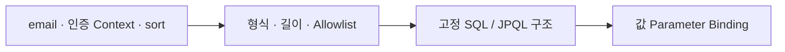

#### Database 접근

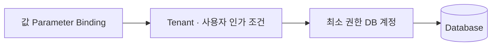

요청값을 SQL 문자열에 직접 연결하는 경로는 허용하지 않습니다. 값 Binding 뒤에도 Tenant 인가 조건과 최소 권한 Database 계정이 이어져야 합니다.

## 4. Brute Force: 인증 기능의 반복 사용을 통제한다

비밀번호 공격은 모두 같은 형태가 아닙니다.

- **Brute Force** — 한 계정에 많은 비밀번호를 시도합니다. 계정별 실패 횟수·속도·시간 Window를 봅니다.
- **Password Spraying** — 많은 계정에 소수의 흔한 비밀번호를 시도합니다. 출발지·Network·Device별 여러 계정 접근을 봅니다.
- **Credential Stuffing** — 유출된 ID·비밀번호 조합을 재사용합니다. 분산 출발지·Device·침해 Password·행동 패턴을 함께 봅니다.

IP 주소 하나만 차단하면 NAT 환경의 정상 사용자를 함께 막거나 분산 공격을 놓칠 수 있습니다. 계정만 영구 잠그면 공격자가 타인의 계정을 의도적으로 잠그는 Denial of Service를 만들 수 있습니다.

### 인증 경계의 계층형 방어

#### 1단계 · 시도 제어

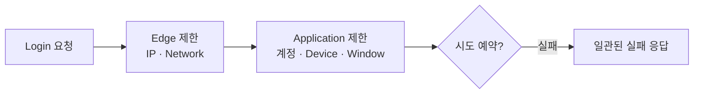

#### 2단계 · 자격 증명과 위험 검증

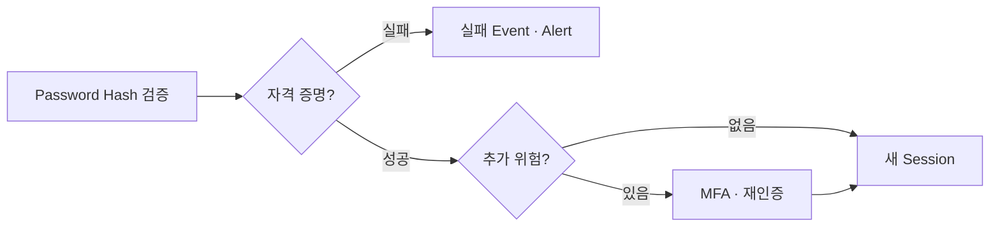

시도 예약에 성공한 요청만 Password Hash 검증으로 넘어갑니다. 제한과 인증 실패는 같은 집계·Alert 체계로 연결합니다.

권장 Control은 다음과 같습니다.

- Edge와 Application 양쪽에 Rate Limit을 둡니다.
- 계정, Network, Device와 전체 서비스 Budget을 함께 봅니다.
- 실패 횟수에 따라 점진적 지연이나 일시적 제한을 적용합니다.
- 민감한 계정과 작업에는 MFA 또는 재인증을 요구합니다.
- 존재하지 않는 계정과 틀린 비밀번호에 같은 응답 형태를 사용합니다.
- 모든 인증 실패와 제한 발동을 구조화 Event로 남기고 Alert에 연결합니다.
- Password는 검증된 Password Encoder로 Hash를 비교합니다.
- Client가 보낸 `X-Forwarded-For`를 무조건 신뢰하지 않습니다. 신뢰된 Proxy가 설정한 값만 해석합니다.

### 분산 환경에서는 원자적으로 시도를 예약한다

다음 Interface는 구현 상세보다 보안 계약을 보여주는 예입니다.

```java
public interface LoginAttemptGuard {

    ThrottleDecision reserve(LoginAttempt attempt, Instant now);

    void authenticationFailed(LoginAttempt attempt, Instant now);

    void authenticationSucceeded(LoginAttempt attempt, Instant now);
}

public record LoginAttempt(
    String accountRef,
    String networkRef,
    String deviceRef
) {}

public record ThrottleDecision(
    boolean allowed,
    Duration retryAfter,
    String reasonCode
) {}
```

`reserve`는 해당 요청의 시도 Budget을 정확히 한 번 소비합니다. `authenticationFailed`는 실패 결과와 연속 실패 상태를 기록하되 같은 시도 Counter를 다시 증가시키지 않습니다. 두 종류의 Counter를 사용한다면 Key·Window·증가 시점을 별도 계약과 Test로 구분합니다.

`accountRef`에는 사용자 이름 원문 대신 서버 Secret을 사용하는 HMAC 기반 가명 식별자를 사용할 수 있습니다. 단순 Hash는 Email처럼 후보 공간이 작은 값에 대한 사전 대입을 막지 못합니다.

여러 Application Instance가 있다면 Local Memory Counter만으로 충분하지 않습니다. 공유 저장소에서 다음 동작을 원자적으로 처리해야 합니다.

1. 현재 Window의 Count를 읽습니다.
2. 허용 여부를 판단합니다.
3. 허용했다면 시도를 예약하고 Count를 증가시킵니다.
4. 첫 Count라면 만료 시간을 설정합니다.
5. 제한 결과와 남은 시간을 반환합니다.

Redis를 사용한다면 Lua Script나 동등한 원자 연산으로 구현할 수 있습니다. `GET`과 `INCR`, `EXPIRE`를 서로 독립된 명령으로 실행하면 동시 요청에서 제한을 초과하거나 만료 시간이 빠질 수 있습니다.

인증 성공도 모든 Counter를 초기화하는 명령이 아닙니다. 계정별 연속 실패 상태는 정책에 따라 완화할 수 있지만, Network·Device·전체 서비스 Window는 유지해야 공격자가 알고 있는 정상 자격 증명 하나로 분산 공격 흔적을 지우지 못합니다.

### 사용자 존재 여부를 감추는 인증 흐름

협력 객체와 설정 주입은 생략하고, 사용자 열거 방지에 직접 관련된 흐름만 보면 다음과 같습니다.

```java
public LoginResult authenticate(
    LoginCommand command,
    TrustedClientSignal signal,
    Instant now
) {
    LoginAttempt attempt = LoginAttemptFactory.create(
        command.username(), signal
    );
    ThrottleDecision decision = attemptGuard.reserve(attempt, now);

    if (!decision.allowed()) {
        securityAudit.authenticationThrottled(attempt, decision, now);
        return LoginResult.genericFailure(decision.retryAfter());
    }

    String username = command.username()
        .strip()
        .toLowerCase(Locale.ROOT);
    Optional<UserAccount> account = accounts.findActiveByUsername(username);
    String storedHash = account
        .map(UserAccount::passwordHash)
        .orElse(dummyPasswordHash);
    boolean passwordMatches = passwordEncoder.matches(
        command.password(), storedHash
    );

    if (account.isEmpty() || !passwordMatches) {
        attemptGuard.authenticationFailed(attempt, now);
        securityAudit.authenticationFailed(attempt, now);
        return LoginResult.genericFailure(Duration.ZERO);
    }

    attemptGuard.authenticationSucceeded(attempt, now);
    return LoginResult.authenticated(account.orElseThrow().id());
}
```

존재하지 않는 사용자도 `dummyPasswordHash`와 비교해 사용자 조회 결과에 따른 큰 Timing 차이를 줄입니다. Dummy Hash는 애플리케이션 시작 시마다 저비용으로 새로 생성하기보다 운영 Password 정책과 같은 Algorithm·비용으로 미리 안전하게 준비합니다.

이 예제만으로 완전한 인증 시스템이 되지는 않습니다. Session Rotation, MFA, Password Reset, 침해 Password 검사, Logout, Idle·Absolute Timeout과 위험 기반 인증을 별도로 설계해야 합니다.

### 실패 응답은 일관되게 만든다

```json
{
  "code": "AUTHENTICATION_FAILED",
  "message": "아이디 또는 인증 정보를 확인해 주세요.",
  "traceId": "01JEXAMPLETRACE"
}
```

다음처럼 결과를 구분해 노출하지 않습니다.

- “가입되지 않은 이메일입니다.”
- “비밀번호가 틀렸습니다.”
- “관리자 계정은 존재하지만 잠겼습니다.”

HTTP Status와 `Retry-After` 정책도 계정 존재 여부를 드러내지 않도록 Threat Model에 맞춰 일관되게 적용합니다. 사용성 때문에 상세 안내가 필요하면 로그인 전이 아니라 안전하게 인증된 지원 절차에서 제공합니다.

### Brute Force 방어 회귀 Test

반드시 확인할 Test는 다음과 같습니다.

```java
@SpringBootTest
class AuthenticationSecurityTest {

    @Test
    void 존재하지_않는_계정과_틀린_password는_같은_응답을_사용한다() {
        LoginResponse missing = login("missing@example.test", "WrongPassword!");
        LoginResponse wrong = login("member@example.test", "WrongPassword!");

        assertThat(missing.status()).isEqualTo(wrong.status());
        assertThat(missing.body().code()).isEqualTo(wrong.body().code());
        assertThat(missing.body().message()).isEqualTo(wrong.body().message());
    }

    @Test
    void window_한도를_넘으면_password_검증_전에_제한한다() {
        repeatFailedLogin(5);

        LoginResponse response = login("member@example.test", "AnotherGuess!");

        assertThat(response.body().code()).isEqualTo("AUTHENTICATION_FAILED");
        assertThat(passwordVerifierInvocationCount()).isEqualTo(5);
    }
}
```

추가로 다음을 검증합니다.

- 동시에 들어온 요청에서도 Window 한도가 원자적으로 지켜지는가
- 제한 저장소 장애 시 Fail Open할지 Fail Closed할지 명시됐는가
- 공격자가 보낸 `X-Forwarded-For`로 Network Key를 바꿀 수 없는가
- 계정별·Network별·Device별 제한이 서로 보완하는가
- 일시 제한 해제 후 정상 사용자가 복구되는가
- 성공·실패·Throttle Event에 Password와 Token이 포함되지 않는가
- 공격 패턴이 실제 Alert를 발생시키는가

## 5. Log Forging: 운영 기록도 공격 입력이 될 수 있다

Log Forging은 사용자가 제공한 문자열 안의 CR, LF 또는 Log 형식 구분자가 새로운 기록처럼 해석되는 문제입니다.

### 취약한 코드

```java
@GetMapping("/orders/{orderNumber}")
public OrderResponse findOrder(@PathVariable String orderNumber) {
    log.warn("Order not found: " + orderNumber);
    throw new OrderNotFoundException();
}
```

공격자가 `orderNumber`에 개행과 가짜 Event 문자열을 넣으면 Plain Text Log에서 다음 줄이 실제 Application이 기록한 Event처럼 보일 수 있습니다.

```text
WARN Order not found: unknown-order
INFO security_event type=LOGIN_SUCCESS subject=admin
```

이 문제는 단순히 Log의 모양이 지저분해지는 데서 끝나지 않습니다.

- 공격자가 자신의 흔적을 다른 Event 사이에 숨길 수 있습니다.
- 운영자가 가짜 성공·실패 기록을 사실로 판단할 수 있습니다.
- 줄 단위 Parser와 통계가 오염될 수 있습니다.
- HTML 기반 Log Viewer가 안전하게 Encoding하지 않으면 별도 Injection으로 이어질 수 있습니다.

### SLF4J Placeholder만으로 CR/LF가 사라지지는 않는다

다음 코드는 문자열 연결보다 낫습니다.

```java
log.warn("order_lookup_failed orderNumber={}", orderNumber);
```

Placeholder는 Format 문자열과 값을 분리하지만, 일반적인 Plain Text Appender에서 값 안의 개행을 자동으로 모두 중립화한다는 보장은 없습니다. Log Sink의 형식에 맞는 Encoding·중립화와 구조화된 Event Schema가 필요합니다.

가장 좋은 방법은 원문을 기록하지 않아도 되는 Event를 먼저 설계하는 것입니다.

```java
public enum SecurityReason {
    INVALID_IDENTIFIER,
    AUTHENTICATION_FAILED,
    RATE_LIMITED,
    ACCESS_DENIED
}

public record SecurityEvent(
    String eventType,
    String outcome,
    String subjectRef,
    SecurityReason reason,
    String traceId,
    Instant occurredAt
) {}
```

요청 원문 대신 서버가 정한 `reason`과 가명화된 `subjectRef`를 기록하면 Injection 표면과 개인정보 노출을 함께 줄일 수 있습니다.

`eventType`, `outcome`, `reason`, `subjectRef`, `traceId`와 `occurredAt`은 Client 문자열을 그대로 대입하지 않고 서버가 생성하거나 엄격히 검증한 값만 사용합니다. 외부 Trace Header를 수용할 때도 길이·문자 집합을 제한하거나 서버 Trace ID와 별도 Field로 보관합니다.

### 사용자 값을 기록해야 할 때 중립화·제한·가명화한다

```java
public final class SafeLogValue {

    private static final int MAX_CODE_POINTS = 160;

    private SafeLogValue() {}

    public static String neutralizeLineBreaks(String value) {
        if (value == null) {
            return "<null>";
        }

        String limited = value.codePoints()
            .limit(MAX_CODE_POINTS)
            .collect(
                StringBuilder::new,
                StringBuilder::appendCodePoint,
                StringBuilder::append
            )
            .toString();

        return limited
            .replace("\r", "\\r")
            .replace("\n", "\\n")
            .replace("\u2028", "\\u2028")
            .replace("\u2029", "\\u2029");
    }
}
```

```java
String safeClientVersion = SafeLogValue.neutralizeLineBreaks(clientVersion);

log.warn(
    "security_event type={} outcome={} subjectRef={} reason={} "
        + "clientVersion={} traceId={}",
    "ORDER_LOOKUP",
    "REJECTED",
    subjectRef,
    SecurityReason.INVALID_IDENTIFIER,
    safeClientVersion,
    traceId
);
```

이 Helper는 줄 구분자를 중립화하는 예시입니다. CSV, Syslog, JSON 등 실제 Log 형식의 구분자와 Encoder를 고려해야 합니다. JSON Log를 사용하면 검증된 JSON Encoder로 Field를 Encoding하고, Log Viewer도 HTML Context에 맞게 출력 Encoding해야 합니다.

### Log에 남기지 말아야 할 값

다음 값은 원문 기록을 기본적으로 금지합니다.

- Password와 Password Reset Token
- Access Token, Refresh Token과 API Key
- Session ID와 Cookie 전체 값
- Database Connection String과 암호화 Key
- Authorization Header와 요청·응답 Body 전체 Dump
- 주민등록번호, 금융·건강정보와 불필요한 개인정보
- 내부 Stack Trace를 포함한 사용자 응답

조사에 연결할 식별자가 필요하면 HMAC 기반 가명값, 제한된 업무 ID 또는 별도 권한이 적용된 Audit Store를 사용합니다. Masking한 값도 재식별 가능성과 보존 기간을 검토해야 합니다.

### Log는 생성에서 Alert까지 하나의 Control이다

#### 1단계 · Event 생성

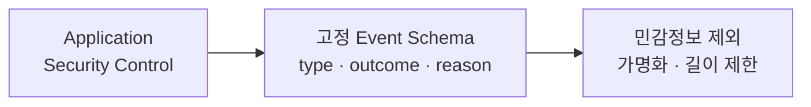

#### 2단계 · 전송과 보관

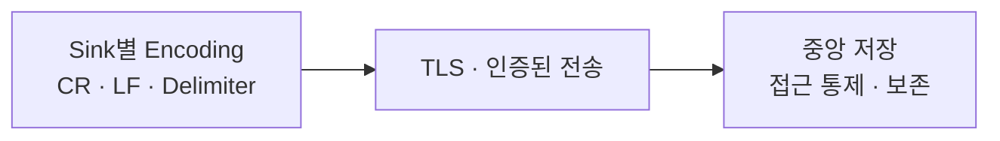

#### 3단계 · 탐지와 대응

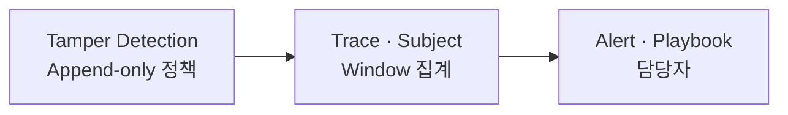

Event 생성 결과는 Sink별 Encoding을 거쳐 중앙 저장소로 전달하고, 저장된 Event는 무결성 확인·상관 분석·Alert로 이어져야 합니다.

좋은 Log도 아무도 보지 않으면 탐지가 되지 않습니다.

- 로그인 성공·실패, Rate Limit, 인가 실패와 입력 검증 실패를 일관된 Event Type으로 기록합니다.
- `traceId`, 가명화된 `subjectRef`, 결과와 `reasonCode`를 포함합니다.
- 여러 서비스의 시간을 동기화하고 Event 발생 시각과 수집 시각을 구분합니다.
- 중앙 저장소로 안전하게 전송합니다.
- Log 수정·삭제를 탐지하고 읽기 권한을 최소화합니다.
- 단일 실패가 아니라 시간 Window의 패턴으로 Alert를 만듭니다.
- Alert가 발생하면 누가 어떤 절차로 확인할지 Playbook을 연결합니다.

### Log Forging 회귀 Test

```java
class SafeLogValueTest {

    @Test
    void cr_lf와_unicode_line_separator를_한_line_value로_중립화한다() {
        String attack = "unknown\r\nINFO login_success\u2028admin";

        String safe = SafeLogValue.neutralizeLineBreaks(attack);

        assertThat(safe)
            .doesNotContain("\r")
            .doesNotContain("\n")
            .doesNotContain("\u2028")
            .contains("\\r\\n")
            .contains("\\u2028");
    }

    @Test
    void 지나치게_긴_값을_제한한다() {
        String input = "가".repeat(1_000);

        String safe = SafeLogValue.neutralizeLineBreaks(input);

        assertThat(safe.codePointCount(0, safe.length())).isLessThanOrEqualTo(160);
    }
}
```

Appender 또는 실제 JSON Encoder를 포함한 통합 Test에서는 다음을 확인합니다.

- 공격 입력 하나가 물리적 Log 한 건으로 저장되는가
- JSON Parser로 다시 읽을 수 있는가
- Password·Token·Authorization Header가 포함되지 않는가
- 동일한 `traceId`로 인증·인가·업무 실패를 연결할 수 있는가
- 지정된 실패 횟수에서 Alert Rule이 발동하는가
- Log 저장소 장애가 Application Thread를 무제한 Block하지 않는가

## 6. 세 취약점을 하나의 요청에서 함께 방어한다

주문 검색 API를 예로 들면 하나의 요청에서 다음 Control이 연결됩니다.

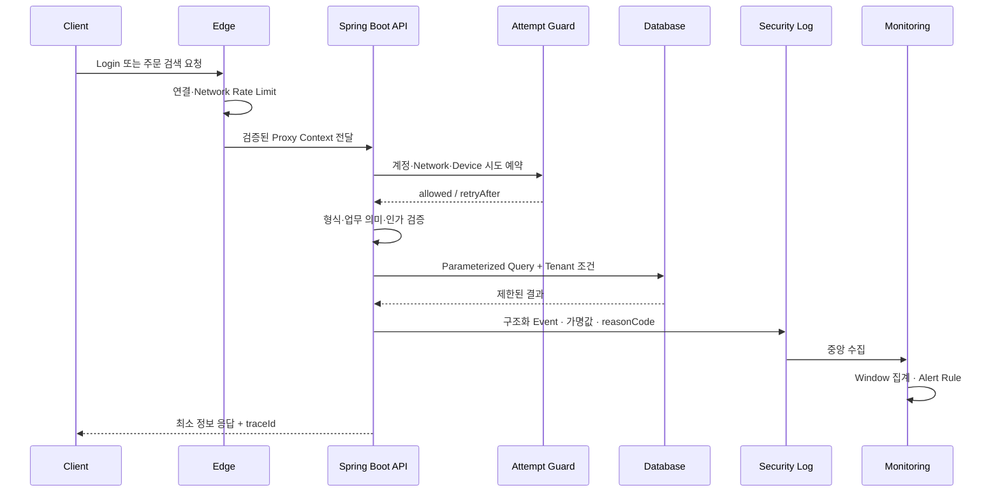

SQL Injection을 막았더라도 Tenant 인가 조건이 빠지면 다른 사용자의 Data를 읽을 수 있습니다. Brute Force를 제한했더라도 실패 Event가 남지 않으면 분산 공격을 탐지하기 어렵습니다. Log를 많이 남기더라도 공격 입력과 Secret을 그대로 기록하면 새로운 공격 표면이 됩니다.

따라서 Secure Coding 완료 조건은 “취약한 API 하나를 수정했다”보다 넓어야 합니다.

## 7. Spring Boot 적용 경계

### Controller

- 요청 DTO의 길이·형식·필수값을 검증합니다.
- 사용자에게 내부 Exception과 Stack Trace를 반환하지 않습니다.
- 요청에서 받은 IP Header를 직접 신뢰하지 않습니다.
- 오류 응답에 안정적인 `code`와 `traceId`를 제공합니다.

### Service

- 인증·인가·Tenant와 업무 불변조건을 검증합니다.
- Rate Limit과 중복 요청 방지 정책의 소유자를 명확히 합니다.
- 사용자 존재 여부를 드러내지 않는 결과 계약을 사용합니다.
- 보안 Event를 성공·실패 양쪽에서 생성합니다.

### Repository

- 값은 Parameter Binding을 사용합니다.
- 동적 Identifier는 서버 Allowlist에서만 선택합니다.
- Query에 사용자·Tenant 인가 조건을 포함합니다.
- 제한된 Database 계정으로 실행합니다.

### Logging·Monitoring

- 공통 Security Event Schema를 사용합니다.
- 원문보다 `reasonCode`와 가명 식별자를 우선합니다.
- Sink 형식에 맞는 Encoder와 중립화를 사용합니다.
- 중앙 수집, 무결성, 보존, Alert와 대응 Playbook을 연결합니다.

## 8. 잘못된 대응과 이유

- **SQL Keyword를 정규식으로 삭제** — Encoding·문법·Query 변경에 따라 우회할 수 있습니다.
- **ORM을 사용하므로 Injection이 없다고 가정** — Native Query·문자열 JPQL·동적 Identifier에서 재발할 수 있습니다.
- **WAF가 SQL Injection을 전부 막는다고 가정** — Application Query 구조 문제는 그대로 남습니다.
- **IP 하나만 영구 차단** — NAT 정상 사용자에게 피해를 주고 분산 공격은 놓칠 수 있습니다.
- **실패 몇 번 뒤 계정을 영구 잠금** — 공격자가 타인의 계정을 잠그는 DoS가 가능합니다.
- **CAPTCHA만 추가** — 자동화 비용은 올려도 Credential Stuffing과 탈취 계정 위험을 제거하지 못합니다.
- **SLF4J Placeholder만 사용** — Plain Text Sink에는 CR/LF가 남을 수 있습니다.
- **모든 요청·응답을 Debug Log로 저장** — Token·Password·개인정보 유출과 저장 비용이 증가합니다.
- **Log를 파일에만 저장** — 침해된 Host에서 수정·삭제될 수 있고 중앙 탐지가 어렵습니다.
- **실패를 기록하지만 Alert는 없음** — 공격 사실을 사후에만 알게 됩니다.

## 9. CI/CD에서 방어를 반복 가능하게 만든다

### Code 단계

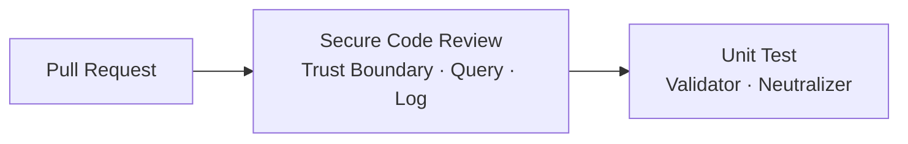

### Security Test 단계

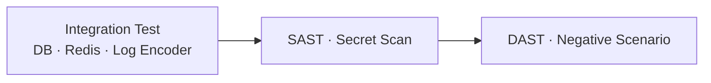

### Release 단계

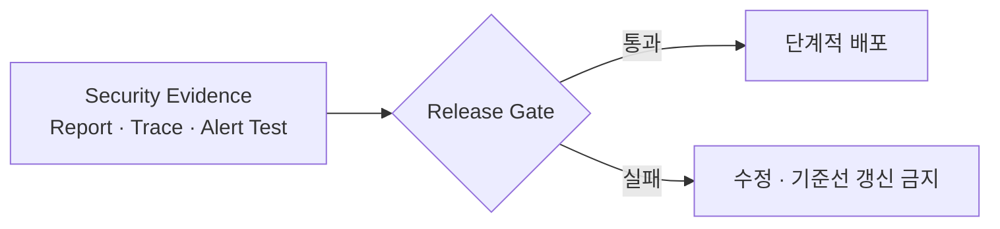

Unit Test를 통과한 변경은 Security Test로, 검증 결과는 Release Gate의 증거로 전달합니다. Gate가 실패하면 기준선을 낮추지 않고 Pull Request 단계로 되돌립니다.

권장 Pipeline은 다음 증거를 남깁니다.

- 문자열 Query 연결과 위험 API를 찾는 Code Review·SAST 결과
- Parameterized Query와 Tenant 격리를 검증한 Database 통합 Test
- 동시 요청에서 Rate Limit이 지켜지는지 확인한 Test
- 사용자 열거 방지 응답 계약 Test
- Log CR/LF·구분자·길이·민감정보 Negative Test
- 실제 Log Encoder로 생성한 Event Parsing Test
- 인증 공격 시나리오가 Alert와 Playbook을 발생시키는 Test
- Dependency·Secret Scan과 미해결 위험 승인 기록

SAST, DAST와 WAF는 보조 Control입니다. Parameter Binding, 인증 설계와 안전한 Logging을 대신하지 않습니다.

## 10. 코드 Review 체크리스트

### SQL Injection

- [ ] SQL·JPQL·Native Query에 요청값을 문자열로 연결하지 않는가
- [ ] 모든 값이 Prepared Statement 또는 Named Parameter로 전달되는가
- [ ] Table·Column·Sort 같은 동적 구조가 서버 Allowlist에서 선택되는가
- [ ] 사용자·Tenant 인가 조건이 Query와 Service 양쪽에서 일관되는가
- [ ] Application Database 계정이 최소 권한인가
- [ ] Database 오류와 내부 Query가 사용자 응답에 노출되지 않는가
- [ ] 운영과 같은 Database Engine으로 Negative Test를 실행하는가

### Brute Force

- [ ] 계정·Network·Device·전체 Budget을 조합한 제한이 있는가
- [ ] 제한 Counter와 TTL 갱신이 분산 환경에서 원자적인가
- [ ] 영구 계정 잠금이 DoS 수단이 되지 않는가
- [ ] 존재하지 않는 계정과 틀린 Password의 응답이 일관되는가
- [ ] 존재하지 않는 계정도 유사한 Password Hash 비용을 사용하는가
- [ ] 민감 계정·작업에 MFA 또는 재인증을 요구하는가
- [ ] 신뢰된 Proxy가 아닌 Client Header를 IP 근거로 사용하지 않는가
- [ ] 실패·Throttle·성공 Event와 실제 Alert가 연결되는가

### Log Forging

- [ ] 사용자 원문 대신 서버가 정의한 Event Type과 Reason Code를 사용하는가
- [ ] CR·LF·Unicode 줄 구분자와 Sink 구분자가 안전하게 처리되는가
- [ ] 사용자 입력 길이를 Log 기록 전에 제한하는가
- [ ] Password·Token·Session·Secret과 불필요한 개인정보가 제외되는가
- [ ] 구조화 Encoder 결과를 실제 Parser로 다시 검증하는가
- [ ] Log가 인증된 채널로 중앙 저장소에 전달되는가
- [ ] Log 수정·삭제 탐지와 읽기 권한 통제가 있는가
- [ ] Alert 임계치와 대응 Playbook이 Test되는가

## 11. 도입 순서

기존 서비스에 한 번에 모든 Control을 적용하기 어렵다면 다음 순서로 진행할 수 있습니다.

1. 문자열 Query와 민감정보 Log를 Inventory로 수집합니다.
2. 인터넷 노출 인증 Endpoint와 고가치 업무 API를 우선 분류합니다.
3. SQL Parameter Binding과 동적 Identifier Allowlist를 적용합니다.
4. 인증 실패 응답을 통일하고 계정 열거 여부를 Test합니다.
5. 분산 Rate Limit과 MFA를 단계적으로 적용합니다.
6. 공통 Security Event Schema와 Safe Logging Library를 배포합니다.
7. 중앙 수집·Alert·Playbook을 연결합니다.
8. 공격 회귀 Test를 CI Release Gate로 승격합니다.
9. Metric을 보고 임계치와 정상 사용자 예외를 조정합니다.

초기에는 탐지 전용 Mode로 Rate Limit의 예상 차단 대상을 관찰할 수 있습니다. 다만 SQL Parameter Binding과 Secret Logging 금지처럼 명확한 안전 규칙은 탐지 전용으로 오래 남겨두지 않습니다.

## 12. 완료 조건

이 글의 세 방어가 완료됐다고 말하려면 다음 질문에 답할 수 있어야 합니다.

```text
입력값이 SQL 명령의 구조를 바꿀 수 없는가?
동적 Query 구조는 서버 Allowlist만 사용하는가?
분산된 인증 시도가 원자적 Window로 제한되는가?
계정 존재 여부가 응답과 Timing으로 쉽게 드러나지 않는가?
공격 입력 하나가 가짜 Log 줄이나 Field를 만들 수 없는가?
Password·Token·개인정보가 Log와 오류 응답에서 제외되는가?
실패 Event가 중앙 수집되고 실제 Alert와 대응 절차로 연결되는가?
이 조건을 자동화된 Test가 반복해서 증명하는가?
```

## 마무리

SQL Injection, Brute Force와 Log Forging은 기본적인 취약점이지만 단일 함수 수정만으로 끝나지 않습니다.

- SQL Injection은 입력 검증보다 먼저 명령과 데이터를 분리해야 합니다.
- 동적 SQL 구조는 요청 문자열이 아니라 서버 Allowlist에서 선택해야 합니다.
- Brute Force는 계정·Network·Device·시간 Window를 함께 보고 분산 환경에서 원자적으로 제한해야 합니다.
- 영구 계정 잠금은 공격자에게 DoS 수단을 줄 수 있으므로 점진적 지연·일시 제한·MFA·탐지를 결합해야 합니다.
- Log Forging은 문자열 연결 제거만이 아니라 구조화 Event, Sink별 Encoding, 민감정보 최소화와 무결성 보호가 필요합니다.
- 보안 실패는 Log에서 끝나지 않고 Alert와 대응 Playbook으로 이어져야 합니다.
- 모든 Control은 실제 Database, 동시성, Log Encoder와 Alert를 포함한 자동화 Test로 증명해야 합니다.

Secure Coding의 목적은 공격 문자열 목록을 외우는 것이 아닙니다. **데이터가 명령으로 변하지 않고, 반복 공격이 비용 없이 확장되지 않으며, 보안 기록이 공격자에 의해 조작되지 않는 구조를 코드와 Test로 유지하는 것**입니다.

---

## 공식 참고 자료

- OWASP, [OWASP Top 10:2025](https://owasp.org/Top10/)
- OWASP, [A05:2025 Injection](https://owasp.org/Top10/2025/A05_2025-Injection/)
- OWASP, [A07:2025 Authentication Failures](https://owasp.org/Top10/2025/A07_2025-Authentication_Failures/)
- OWASP, [A09:2025 Security Logging & Alerting Failures](https://owasp.org/Top10/2025/A09_2025-Security_Logging_and_Alerting_Failures/)
- OWASP Cheat Sheet Series, [SQL Injection Prevention](https://cheatsheetseries.owasp.org/cheatsheets/SQL_Injection_Prevention_Cheat_Sheet.html)
- OWASP Cheat Sheet Series, [Authentication](https://cheatsheetseries.owasp.org/cheatsheets/Authentication_Cheat_Sheet.html)
- OWASP Cheat Sheet Series, [Logging](https://cheatsheetseries.owasp.org/cheatsheets/Logging_Cheat_Sheet.html)
- OWASP, [Log Injection](https://owasp.org/www-community/attacks/Log_Injection)
- OWASP Cheat Sheet Series, [Input Validation](https://cheatsheetseries.owasp.org/cheatsheets/Input_Validation_Cheat_Sheet.html)
- OWASP Cheat Sheet Series, [Denial of Service](https://cheatsheetseries.owasp.org/cheatsheets/Denial_of_Service_Cheat_Sheet.html)
- OWASP Cheat Sheet Series, [Error Handling](https://cheatsheetseries.owasp.org/cheatsheets/Error_Handling_Cheat_Sheet.html)
- OWASP, [Application Security Verification Standard](https://owasp.org/www-project-application-security-verification-standard/)

> 이 글은 공개된 OWASP 자료를 기반으로 한 일반화된 Secure Coding 예시입니다.
> 실제 적용 시에는 사용하는 Database, Identity Provider, Proxy, Log Format, 개인정보 규정과 위협 모델에 맞춘 별도 검증이 필요합니다.
