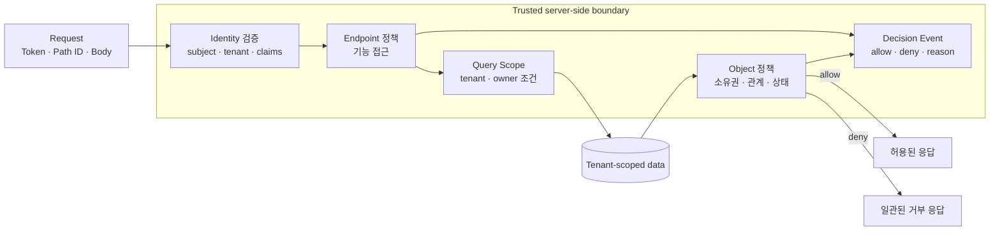
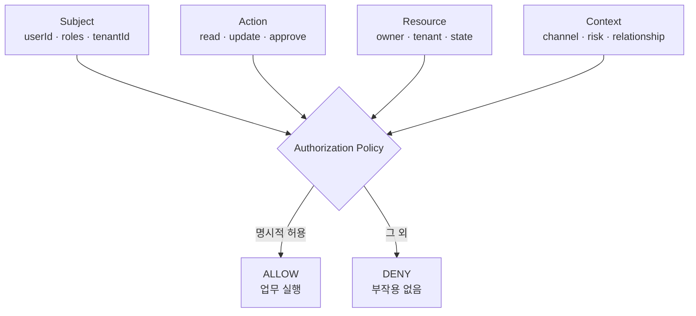
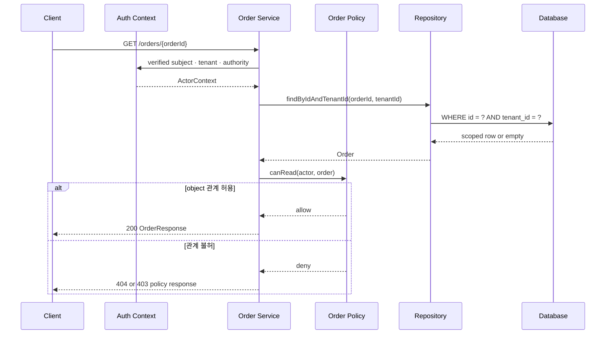
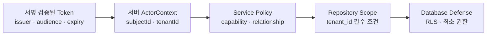
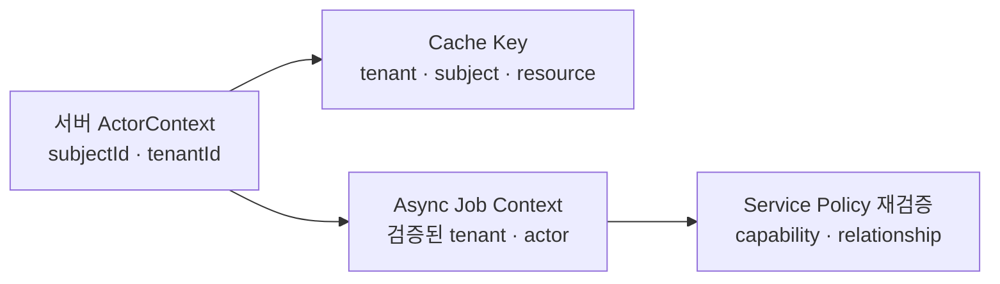
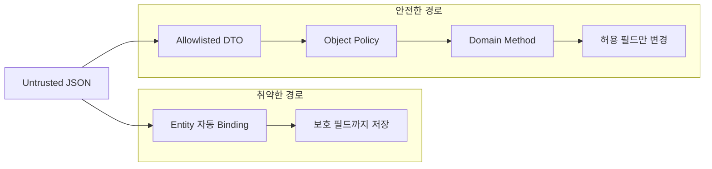
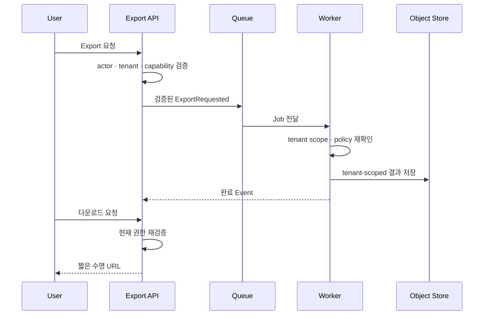
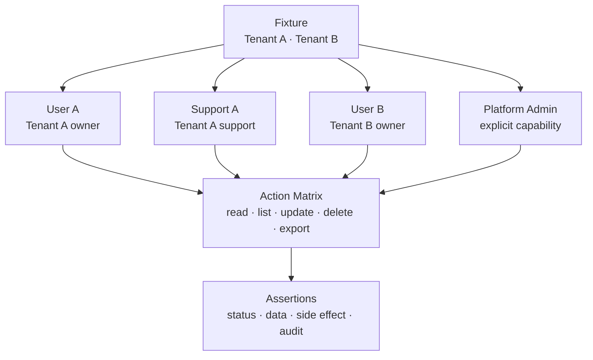
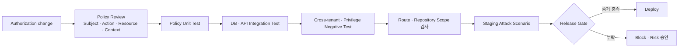

# Broken Access Control Secure Coding: IDOR·권한 우회·Tenant 격리

인증에 성공했다는 사실은 모든 데이터와 기능을 사용할 수 있다는 뜻이 아닙니다. 인증(Authentication)은 요청자가 누구인지 확인하고, 인가(Authorization)는 그 주체가 **이 리소스에 이 동작을 수행해도 되는지** 판단합니다.

Broken Access Control은 이 두 번째 판단이 빠지거나 서로 다른 경로에서 일관되지 않을 때 발생합니다.

- URL의 주문 ID를 다른 값으로 바꿨더니 다른 고객의 주문이 보입니다.
- 일반 사용자가 관리자 Endpoint를 직접 호출할 수 있습니다.
- Tenant A 사용자가 Tenant B의 파일이나 Export 결과를 내려받습니다.
- 수정 DTO에 `role`, `ownerId`, `tenantId`를 추가했더니 보호 필드가 바뀝니다.
- 단건 조회는 막았지만 목록, 검색, 캐시와 비동기 작업에서 범위가 새어 나갑니다.



이 글은 Java 21과 Spring Boot 3 기반의 합성 예제로 IDOR, 수평·수직 권한 상승, Tenant 격리와 Mass Assignment 방어를 설명합니다. 실제 고객명, Endpoint, 식별자와 운영 정책을 재현하지 않습니다.

## 1. OWASP Top 10:2025의 A01 Broken Access Control

2026년 8월 기준 최신 공개판인 OWASP Top 10:2025에서 Broken Access Control은 A01입니다. OWASP가 제시하는 대표 실패에는 다음 문제가 포함됩니다.

- Deny by Default가 아닌 상태에서 필요 이상의 기능을 허용함
- URL, 내부 상태, HTML 또는 API Request를 바꿔 인가 검사를 우회함
- 다른 사용자의 객체 식별자를 제공해 조회·수정함
- `POST`, `PUT`, `DELETE` 같은 변경 API에 접근 통제가 빠짐
- 로그인하지 않고 사용자처럼 행동하거나 일반 사용자가 관리자 권한을 얻음
- JWT, Cookie, Hidden Field 같은 Metadata를 조작함
- Front-end에만 접근 통제를 구현함

Access Control은 공격자가 바꿀 수 없는 신뢰된 서버 코드에서 수행해야 합니다. 화면에서 관리자 버튼을 숨기거나 복잡한 UUID를 쓰는 것은 보조 수단일 뿐, 서버 인가를 대체하지 않습니다.

## 2. 인가 판단을 네 가지 입력으로 모델링한다

역할 이름 하나만 확인하면 객체 단위 정책을 표현하기 어렵습니다. 인가 판단을 다음 네 가지 입력으로 모델링하면 누락을 찾기 쉬워집니다.

- **Subject** — 누가 요청하는가. 예: 사용자, 서비스 계정, 지원 담당자.
- **Action** — 무엇을 하려는가. 예: 읽기, 수정, 삭제, 승인, Export.
- **Resource** — 어떤 객체인가. 예: 주문, 문서, 파일, 프로젝트.
- **Context** — 어떤 조건인가. 예: Tenant, 소유권, 조직 관계, 상태, 시간.



권장 원칙은 다음과 같습니다.

1. 공개 리소스가 아니라면 기본 거부합니다.
2. 모든 요청과 모든 HTTP Method에서 권한을 검증합니다.
3. 역할(Role)뿐 아니라 객체 소유권과 업무 관계를 확인합니다.
4. Controller, Service, Repository의 책임을 분리하되 정책 의미는 하나로 유지합니다.
5. 거부 시 업무 변경, Event 발행과 외부 호출이 발생하지 않게 합니다.
6. 인가 실패를 구조화 Event로 남기고 반복 패턴을 탐지합니다.
7. 허용·거부 정책을 자동화 Test로 증명합니다.

## 3. IDOR: 식별자를 안다고 권한이 생기지는 않는다

IDOR(Insecure Direct Object Reference)는 URL, Query, JSON, 파일명 등에 포함된 객체 참조를 바꿨을 때 서버가 객체 단위 권한을 다시 확인하지 않아 발생합니다.

식별자는 숫자 ID에 한정되지 않습니다.

- UUID와 ULID
- 주문 번호와 계좌 번호
- 파일명과 Object Storage Key
- Ticket Slug와 초대 Token
- Export Job ID와 다운로드 URL

UUID처럼 추측하기 어려운 식별자는 대량 탐색 비용을 높일 수 있지만 인가가 아닙니다. URL이 Log, Browser History, Referer, Message 또는 지원 채널을 통해 노출되면 공격자는 추측 없이도 식별자를 얻을 수 있습니다.

### 취약한 단건 조회

다음 코드는 인증 사용자라면 어떤 주문 ID든 조회할 수 있습니다.

```java
@RestController
@RequestMapping("/api/orders")
public class UnsafeOrderController {

    private final OrderRepository repository;

    public UnsafeOrderController(OrderRepository repository) {
        this.repository = repository;
    }

    @GetMapping("/{orderId}")
    public OrderResponse get(@PathVariable UUID orderId) {
        Order order = repository.findById(orderId)
            .orElseThrow(OrderNotFoundException::new);

        return OrderResponse.from(order);
    }
}
```

여기에는 두 가지 사실만 있습니다.

1. 요청자가 로그인했습니다.
2. 요청한 `orderId`가 존재합니다.

하지만 요청자와 주문의 Tenant·소유권·업무 관계를 연결하는 판단이 없습니다.

### 안전한 조회: 인증 Context와 Query Scope를 결합한다

Tenant ID와 사용자 ID는 요청 Body나 임의 Header가 아니라 검증된 인증 Context에서 가져옵니다.

```java
public record ActorContext(
    UUID subjectId,
    UUID tenantId,
    Set<String> authorities
) {
    public boolean has(String authority) {
        return authorities.contains(authority);
    }
}
```

Repository는 `findById` 대신 최소한 Tenant Scope를 포함한 Query를 제공합니다.

```java
public interface OrderRepository extends JpaRepository<OrderEntity, UUID> {

    Optional<OrderEntity> findByIdAndTenantId(
        UUID orderId,
        UUID tenantId
    );

    Page<OrderEntity> findAllByTenantId(
        UUID tenantId,
        Pageable pageable
    );

    @Lock(LockModeType.PESSIMISTIC_WRITE)
    @Query("""
        select o
          from OrderEntity o
         where o.id = :orderId
           and o.tenantId = :tenantId
        """)
    Optional<OrderEntity> findByIdAndTenantIdForUpdate(
        @Param("orderId") UUID orderId,
        @Param("tenantId") UUID tenantId
    );
}
```

Service는 Endpoint 역할과 객체 관계를 함께 검사합니다.

```java
@Service
public class OrderQueryService {

    private final ActorContextProvider actors;
    private final OrderRepository repository;
    private final OrderPolicy policy;

    public OrderQueryService(
        ActorContextProvider actors,
        OrderRepository repository,
        OrderPolicy policy
    ) {
        this.actors = actors;
        this.repository = repository;
        this.policy = policy;
    }

    @PreAuthorize("hasAuthority('order:read')")
    @Transactional(readOnly = true)
    public OrderResponse get(UUID orderId) {
        ActorContext actor = actors.requireAuthenticated();

        OrderEntity order = repository
            .findByIdAndTenantId(orderId, actor.tenantId())
            .orElseThrow(OrderNotFoundException::new);

        policy.requireCanRead(actor, order);
        return OrderResponse.from(order);
    }
}
```

```java
@Component
public class OrderPolicy {

    public void requireCanRead(ActorContext actor, OrderEntity order) {
        boolean sameTenant = order.getTenantId().equals(actor.tenantId());
        boolean owner = order.getCustomerId().equals(actor.subjectId());
        boolean support = actor.has("order:support-read");

        if (!sameTenant || (!owner && !support)) {
            throw new AccessDeniedException("order access denied");
        }
    }
}
```



Query Scope와 객체 Policy는 중복처럼 보이지만 역할이 다릅니다.

- Query Scope는 다른 Tenant의 Row가 Application Memory에 들어오는 범위를 줄입니다.
- 객체 Policy는 소유권, 지원 담당 관계, 주문 상태 같은 업무 규칙을 판단합니다.

둘 중 하나만으로 충분하다고 가정하지 않습니다.

## 4. Tenant 격리는 한 번의 `if`가 아니라 여러 층의 불변조건이다

Multi-tenant 서비스에서 `tenantId`는 단순 검색 조건이 아니라 보안 경계입니다. 다음 층에서 같은 경계를 반복해 보존해야 합니다.

동기 요청은 검증된 Token을 서버 Context로 바꾼 뒤 Service·Repository·Database 경계를 차례로 통과합니다.



Cache와 비동기 Job 같은 파생 경로도 같은 Tenant·Actor 경계를 보존하고 실행 시 다시 검증합니다.



### 요청에서 받은 Tenant ID를 권한 근거로 사용하지 않는다

다음 값은 그 자체로 신뢰할 수 없습니다.

- JSON의 `tenantId`
- Query Parameter의 `organizationId`
- Browser가 만든 `X-Tenant-Id`
- Local Storage의 현재 조직 값
- 숨겨진 Form Field

사용자가 Tenant를 전환할 수 있는 제품이라면 서버가 다음을 검증해야 합니다.

1. 선택한 Tenant가 실제로 존재합니다.
2. 인증 Subject와 Tenant 사이에 활성 Membership가 있습니다.
3. 선택한 역할과 권한이 현재 시점에도 유효합니다.
4. 검증 결과로 서버 내부 `ActorContext`를 만듭니다.

### 모든 Repository 경로에 Scope를 강제한다

단건 조회만 안전해도 다음 경로에서 누출될 수 있습니다.

- 목록과 검색
- Count와 집계
- Bulk Update·Delete
- Export와 Report
- 첨부 파일 조회
- Scheduler와 Batch
- 관리자용 Query

Repository Method 이름과 공통 Query Specification에 Tenant 조건을 포함하고, Scope 없는 Method의 사용을 Code Review와 정적 검사 대상으로 둡니다.

```java
public interface OrderSearchRepository
    extends Repository<OrderEntity, UUID> {

    Page<OrderSummary> findAllByTenantIdAndStatus(
        UUID tenantId,
        OrderStatus status,
        Pageable pageable
    );
}
```

```java
public Page<OrderSummary> search(
    OrderSearchCondition condition,
    Pageable pageable
) {
    ActorContext actor = actors.requireAuthenticated();

    return searchRepository.findAllByTenantIdAndStatus(
        actor.tenantId(),
        condition.status(),
        pageable
    );
}
```

### 비동기 작업도 Actor와 Tenant 의미를 잃지 않는다

HTTP Thread의 `SecurityContext`를 Queue Consumer가 자동으로 이어받을 것이라고 가정하면 안 됩니다. 비동기 Command에는 서버가 검증한 최소 Context와 업무 목적을 넣고 Consumer가 다시 정책을 확인합니다.

```java
public record ExportRequested(
    UUID exportId,
    UUID tenantId,
    UUID requestedBy,
    String policyVersion,
    Instant requestedAt
) {}
```

Client가 보낸 Message를 그대로 내부 Event로 승격하지 않습니다. Producer에서 인증 Context를 기반으로 생성하고, 서명·Broker ACL·Schema 검증·Consumer 인가를 함께 적용합니다.

`requestedBy`와 `policyVersion`은 과거 허용 결정을 재사용하는 증표가 아닙니다. Consumer는 실행 시점의 활성 Membership·Capability·Resource 상태를 다시 확인하고, 권한이 철회됐으면 Job을 안전하게 중단합니다. `policyVersion`은 어떤 규칙으로 요청이 생성됐는지 추적하는 감사 정보로 사용합니다.

### Database Row-Level Security는 방어 심층화다

PostgreSQL Row-Level Security(RLS)는 Row 조회와 변경에 정책을 적용할 수 있습니다. 다만 Table Owner와 `BYPASSRLS` 권한, Connection Pool의 Session 상태, Migration 계정을 함께 검토해야 합니다.

```sql
ALTER TABLE customer_order ENABLE ROW LEVEL SECURITY;
ALTER TABLE customer_order FORCE ROW LEVEL SECURITY;

CREATE POLICY tenant_isolation_policy
ON customer_order
USING (
  tenant_id = current_setting('app.tenant_id', true)::uuid
)
WITH CHECK (
  tenant_id = current_setting('app.tenant_id', true)::uuid
);
```

Transaction을 시작한 뒤, 첫 업무 Query 전에 검증된 Tenant 값을 Transaction Local 설정으로 전달합니다.

```sql
SELECT set_config('app.tenant_id', :verified_tenant_id, true);
```

마지막 인수 `true`는 값을 현재 Transaction에 한정합니다. 이 값은 Client 요청이 임의로 설정하게 하지 않고 서버의 인증 Context에서만 주입합니다. Connection Pool을 사용하는 통합 Test에서는 설정 없는 Transaction이 기본 거부되는지, Commit·Rollback 뒤 다음 대여자에게 값이 남지 않는지, Migration·Table Owner·`BYPASSRLS` Role이 업무 계정과 분리되는지 확인합니다.

RLS가 있으므로 Application Query의 Tenant 조건을 제거해도 된다고 결론내리지 않습니다. Query Scope는 의도를 명확히 하고 불필요한 Row 접근을 줄이며, RLS는 누락에 대한 추가 방어가 됩니다.

## 5. 수평·수직·기능 단위 권한 우회를 구분한다

- **수평 권한 상승** — 공격 예: 사용자 A가 사용자 B의 주문 조회. 필요한 검증: 소유권·관계·Tenant.
- **수직 권한 상승** — 공격 예: 일반 사용자가 관리자 승인 호출. 필요한 검증: Capability·Role·업무 규칙.
- **기능 단위 우회** — 공격 예: 화면에 없는 DELETE Endpoint 직접 호출. 필요한 검증: 모든 Route·Method의 정책.
- **상태 전이 우회** — 공격 예: 취소된 주문을 다시 승인. 필요한 검증: 현재 상태·전이 규칙·동시성.

`@PreAuthorize("hasRole('ADMIN')")`는 관리자 기능을 막는 데 유용하지만 객체 단위 정책 전체를 표현하지는 못합니다. Endpoint 수준의 Capability와 Domain Policy를 결합합니다.

```java
@EnableMethodSecurity
@Configuration
class MethodSecurityConfiguration {
}
```

Method Security Annotation이 없는 Method는 자동으로 보호되지 않습니다. Request 경계에는 공개 경로만 명시적으로 허용하고 나머지를 거부하는 Catch-all 규칙을 둡니다.

```java
@Bean
SecurityFilterChain apiSecurity(HttpSecurity http) throws Exception {
    return http
        .authorizeHttpRequests(authorize -> authorize
            .requestMatchers("/health/readiness").permitAll()
            .requestMatchers("/api/**").authenticated()
            .anyRequest().denyAll()
        )
        .build();
}
```

`@PreAuthorize`는 Spring AOP Proxy를 통과할 때 적용됩니다. 같은 Class 안에서 보호 Method를 직접 호출하는 Self-invocation에 의존하지 않고, 권한 경계를 별도 Spring Bean의 공개 Service Method로 두며 실제 Proxy를 사용한 통합 Test를 실행합니다.

```java
@Service
public class OrderApprovalService {

    private final ActorContextProvider actors;
    private final OrderRepository repository;
    private final OrderApprovalPolicy policy;

    public OrderApprovalService(
        ActorContextProvider actors,
        OrderRepository repository,
        OrderApprovalPolicy policy
    ) {
        this.actors = actors;
        this.repository = repository;
        this.policy = policy;
    }

    @PreAuthorize("hasAuthority('order:approve')")
    @Transactional
    public void approve(UUID orderId, long expectedVersion) {
        ActorContext actor = actors.requireAuthenticated();

        OrderEntity order = repository
            .findByIdAndTenantIdForUpdate(orderId, actor.tenantId())
            .orElseThrow(OrderNotFoundException::new);

        policy.requireCanApprove(actor, order);
        order.approve(actor.subjectId(), expectedVersion);
    }
}
```

정책은 권한 문자열뿐 아니라 현재 상태, 금액 한도, 자기 승인 금지, 직무 분리 같은 업무 불변조건을 검사할 수 있습니다.

## 6. Mass Assignment: DTO에 없는 권한은 바뀌지 않는다

Spring MVC 같은 Framework의 자동 Binding은 편리하지만 요청 전체를 Domain Entity에 직접 연결하면 보호 필드가 바뀔 수 있습니다.

### 취약한 수정

```java
@PatchMapping("/users/{userId}")
public UserResponse update(
    @PathVariable UUID userId,
    @RequestBody UserEntity request
) {
    request.setId(userId);
    return UserResponse.from(repository.save(request));
}
```

공격자는 원래 화면에 없던 필드를 JSON에 추가할 수 있습니다.

```json
{
  "displayName": "new-name",
  "role": "ADMIN",
  "tenantId": "00000000-0000-0000-0000-000000000099",
  "ownerId": "00000000-0000-0000-0000-000000000001"
}
```

### 안전한 수정: 허용 필드 DTO와 명시적 Mapping

```java
public record UpdateProfileRequest(
    @NotBlank
    @Size(max = 80)
    String displayName,

    @Size(max = 500)
    String introduction
) {}
```

```java
@Transactional
public UserResponse updateProfile(UUID userId, UpdateProfileRequest request) {
    ActorContext actor = actors.requireAuthenticated();

    UserEntity user = repository
        .findByIdAndTenantId(userId, actor.tenantId())
        .orElseThrow(UserNotFoundException::new);

    profilePolicy.requireCanUpdate(actor, user);
    user.updateProfile(request.displayName(), request.introduction());

    return UserResponse.from(user);
}
```

권한, Tenant, 소유자, 상태와 감사 필드는 별도 Command와 더 강한 정책으로만 바꿉니다.



Blocklist보다 Allowlist DTO를 우선합니다. 새 보호 필드가 Entity에 추가될 때 Blocklist 갱신을 잊을 수 있지만 DTO는 Client가 수정할 수 있는 필드만 노출합니다.

Client가 보낸 알 수 없는 JSON Field를 조용히 무시할지 오류로 거부할지도 계약으로 정합니다. 보안에 민감한 변경 API에서는 Unknown Field를 거부하면 `role`·`tenantId` 같은 조작 시도를 조기에 탐지할 수 있습니다. 다만 기존 Client 호환성에 영향을 줄 수 있으므로 API Version과 회귀 Test를 함께 관리합니다.

## 7. 목록·파일·캐시·Export에서 경계를 보존한다

### 목록과 검색

목록 응답을 만든 뒤 Application Memory에서 다른 Tenant 항목을 지우는 방식은 피합니다. Database Query 자체에 Scope를 적용해야 Pagination, Count, 정렬과 성능이 일관됩니다.

### 파일과 Object Storage

파일 Metadata를 Tenant Scope로 조회하고 권한을 확인한 뒤 짧은 수명의 다운로드 URL을 발급합니다. Bucket Key가 복잡하거나 Presigned URL이라는 이유만으로 권한 검사를 생략하지 않습니다.

```java
public DownloadTicket issueDownload(UUID fileId) {
    ActorContext actor = actors.requireAuthenticated();

    FileMetadata file = files
        .findByIdAndTenantId(fileId, actor.tenantId())
        .orElseThrow(FileNotFoundException::new);

    filePolicy.requireCanDownload(actor, file);
    return objectStore.createShortLivedDownload(file.getObjectKey());
}
```

### 캐시

Cache Key에 권한 범위를 포함하지 않으면 다른 Subject나 Tenant의 결과가 재사용될 수 있습니다.

```text
나쁜 Key:  order:{orderId}
권장 Key: tenant:{tenantId}:subject:{subjectId}:order:{orderId}:policy:{policyVersion}
```

응답이 역할과 Field Masking에 따라 달라진다면 Role 또는 Policy Version도 포함하거나 사용자별 Cache를 사용합니다. 공유 Cache에서 원본 Entity를 반환한 뒤 Controller에서 가리는 구조는 경계가 흐려지기 쉽습니다.

Cache Hit도 인가를 생략하는 근거가 아닙니다. Membership 철회, 소유권 변경과 Policy 배포 시 관련 Entry를 무효화하고, 최대 TTL을 권한 변경 전파 목표보다 짧게 제한합니다. 원문 Subject·Tenant 식별자를 Cache Key에 노출할 필요가 없다면 서버 HMAC 기반 참조로 바꿉니다.

### Export와 Batch

Export 요청 시점뿐 아니라 실행·다운로드 시점에도 권한과 보존 기간을 검토합니다.



## 8. 오류 응답과 감사 Event

권한이 없는 객체의 존재 여부까지 감춰야 하는 API는 `404 Not Found`를 사용할 수 있습니다. 반면 존재를 알아도 되는 관리자 기능은 `403 Forbidden`이 더 명확할 수 있습니다. 중요한 점은 제품의 정보 노출 정책을 정하고 일관되게 적용하는 것입니다.

사용자 응답은 최소화하되 서버에는 조사 가능한 Event를 남깁니다.

```json
{
  "eventType": "AUTHORIZATION_DECISION",
  "outcome": "DENY",
  "subjectRef": "hmac:8d5f...",
  "tenantRef": "hmac:38a1...",
  "action": "order:read",
  "resourceType": "order",
  "resourceRef": "hmac:2b90...",
  "reasonCode": "RELATIONSHIP_NOT_ALLOWED",
  "policyVersion": "order-policy-7",
  "traceId": "01JEXAMPLETRACE",
  "occurredAt": "2026-08-01T06:30:00Z"
}
```

`reasonCode`, `outcome`, `policyVersion`, `traceId`와 Event 시각은 서버가 생성하거나 엄격히 검증합니다. Access Token, Session ID, 원문 개인정보와 요청 Body 전체를 Log에 남기지 않습니다.

다음 패턴은 Alert 후보입니다.

- 한 Subject가 짧은 시간에 여러 Resource ID를 순회함
- 한 Network가 여러 Tenant 객체에 접근을 시도함
- 일반 사용자가 관리자 Endpoint를 반복 호출함
- 존재하지 않는 ID와 권한 없는 ID 요청이 대량 발생함
- Export·다운로드 거부가 비정상적으로 증가함

## 9. 두 명·두 Tenant로 Negative Test를 만든다

권한 Test는 성공 사례 하나보다 **다른 권한 범위의 계정 조합**이 중요합니다.



### Repository 통합 Test

```java
@DataJpaTest
class OrderRepositoryTenantIsolationTest {

    @Autowired
    OrderRepository repository;

    @Test
    void 다른_tenant의_id는_조회되지_않는다() {
        UUID tenantA = UUID.fromString(
            "00000000-0000-0000-0000-00000000000a"
        );
        UUID tenantB = UUID.fromString(
            "00000000-0000-0000-0000-00000000000b"
        );

        OrderEntity orderB = repository.save(
            OrderFixtures.orderFor(tenantB)
        );

        assertThat(
            repository.findByIdAndTenantId(orderB.getId(), tenantA)
        ).isEmpty();
    }
}
```

### API 인가 Test

```java
@SpringBootTest
@AutoConfigureMockMvc
class OrderAuthorizationTest {

    @Autowired
    MockMvc mvc;

    @Test
    void tenantA_사용자는_tenantB_주문을_읽지_못한다() throws Exception {
        mvc.perform(get("/api/orders/{id}", TestIds.TENANT_B_ORDER)
                .with(jwt().jwt(jwt -> jwt
                    .subject(TestIds.TENANT_A_USER.toString())
                    .claim("tenant_id", TestIds.TENANT_A.toString()))
                    .authorities(new SimpleGrantedAuthority("order:read"))))
            .andExpect(status().isNotFound())
            .andExpect(jsonPath("$.code").value("ORDER_NOT_FOUND"));
    }

    @Test
    void 일반_사용자는_승인_capability가_없다() throws Exception {
        mvc.perform(post("/api/orders/{id}/approve", TestIds.TENANT_A_ORDER)
                .with(jwt().authorities(
                    new SimpleGrantedAuthority("order:read")
                )))
            .andExpect(status().isForbidden());
    }
}
```

다음 Operation을 모두 Matrix에 포함합니다.

- 단건 조회
- 목록·검색·Count
- 생성 시 Tenant·Owner 강제
- 부분 수정과 전체 수정
- 삭제·복구
- 상태 변경·승인
- 파일 다운로드
- Export 요청·완료·다운로드
- 관리자 기능
- Batch와 비동기 Consumer

거부 Test는 HTTP Status만 확인하지 않습니다.

- Database Row가 바뀌지 않았는가
- Outbox Event와 Message가 생성되지 않았는가
- 외부 API가 호출되지 않았는가
- Cache에 권한 없는 Data가 기록되지 않았는가
- 안전한 인가 실패 Event가 한 건 남았는가

## 10. CI/CD Release Gate



Release Gate의 증거는 다음을 포함할 수 있습니다.

- 새 Route와 HTTP Method에 명시적 정책이 있음
- 새 Repository Query에 Tenant Scope가 있음
- Entity를 Request DTO로 직접 사용하지 않음
- 두 Subject·두 Tenant를 사용한 Negative Test가 있음
- 관리자와 지원자 예외가 별도 Capability로 표현됨
- 거부 시 Side Effect가 없음을 검증함
- RLS와 Connection Pool Context 누출 Test가 통과함
- 인가 실패 Event와 Alert Rule이 연결됨

정적 분석만으로 업무 관계를 완전히 이해할 수는 없습니다. Route Inventory, Repository 규칙과 위험한 Binding을 찾는 자동 검사에 Policy Test와 공격 시나리오를 결합합니다.

## 11. 잘못된 대응과 이유

- **관리자 버튼을 Front-end에서 숨김** — 남는 위험: API 직접 호출로 우회 가능.
- **UUID를 사용하므로 안전하다고 가정** — 남는 위험: 식별자 유출 시 객체 권한 없음.
- **JWT가 유효하면 모든 요청 허용** — 남는 위험: Token 인증과 객체 인가는 별개.
- **Controller 한 곳에서만 검사** — 남는 위험: Service·Batch·다른 Route에서 우회 가능.
- **`findById` 후 응답 직전에 Tenant 검사** — 남는 위험: 불필요한 Row 접근·Side Effect 위험.
- **단건 조회만 Tenant Scope 적용** — 남는 위험: 목록·검색·Count·Export에서 누출.
- **Entity를 Request Body로 직접 Binding** — 남는 위험: Role·Owner·Tenant 보호 필드 변경.
- **관리자 Query는 Scope 없이 사용** — 남는 위험: 오용·계정 탈취 시 전체 데이터 노출.
- **Cache Key에 Resource ID만 사용** — 남는 위험: Subject·Tenant 간 결과 재사용.
- **RLS가 있으므로 Application 정책 제거** — 남는 위험: 업무 관계·기능 권한·운영 설정 문제 잔존.
- **403만 Test** — 남는 위험: 데이터 변경·Event 발행 같은 Side Effect 놓침.

## 12. 코드 Review 체크리스트

### Endpoint와 Method

- [ ] 공개가 아닌 Route는 Deny by Default인가
- [ ] `GET`, `POST`, `PUT`, `PATCH`, `DELETE` 각각 정책이 있는가
- [ ] UI에 없는 내부·관리 Endpoint도 보호되는가
- [ ] 인증과 인가를 서로 다른 검증으로 다루는가
- [ ] 일반 사용자, 지원 담당자, 관리자 Capability가 분리되는가
- [ ] 미주석 Method와 Spring AOP Self-invocation 우회를 Test하는가

### 객체와 Tenant

- [ ] Path·Query·Body의 모든 객체 참조를 서버에서 재인가하는가
- [ ] Tenant ID를 검증된 인증 Context에서 가져오는가
- [ ] Repository Query에 Tenant Scope가 포함되는가
- [ ] 소유권·Membership·업무 관계를 확인하는가
- [ ] 목록·Count·검색·Export·파일도 같은 Scope를 사용하는가
- [ ] UUID와 Signed URL을 인가의 대체물로 보지 않는가

### 쓰기와 상태 변경

- [ ] Request DTO가 수정 가능한 필드만 포함하는가
- [ ] Role·Owner·Tenant·상태 필드는 별도 정책으로 변경하는가
- [ ] 승인·취소·복구 같은 상태 전이를 Domain에서 검증하는가
- [ ] 거부 시 Database·Event·외부 호출 Side Effect가 없는가
- [ ] 동시 요청에서도 상태와 인가 조건이 유지되는가

### 운영 경로

- [ ] Cache Key에 Tenant·Subject·Policy 범위가 반영되는가
- [ ] 비동기 Message가 검증된 Actor·Tenant 의미를 보존하는가
- [ ] Consumer가 실행 시점의 Membership·Capability를 다시 확인하는가
- [ ] Batch·Scheduler·지원 도구에 명시적 Service Identity가 있는가
- [ ] RLS 사용 시 Owner·`BYPASSRLS`·Connection Pool을 Test하는가
- [ ] 권한 철회·소유권 변경 시 Cache 무효화와 TTL이 적용되는가
- [ ] 인가 실패가 민감정보 없이 기록되고 Alert에 연결되는가

### Test

- [ ] 두 사용자와 두 Tenant Fixture가 있는가
- [ ] 수평·수직·기능 단위 우회를 모두 Test하는가
- [ ] 읽기·수정·삭제·Export·파일 Operation을 포함하는가
- [ ] 거부 응답뿐 아니라 Data와 Side Effect 불변을 검증하는가
- [ ] 새 Route와 Query가 Release Gate에 자동 포함되는가

## 13. 도입 순서

기존 서비스의 Access Control을 개선할 때는 다음 순서로 진행할 수 있습니다.

1. Route, HTTP Method, Repository Query와 Background Job을 Inventory로 만듭니다.
2. Subject·Action·Resource·Context 기준으로 현재 정책을 표로 작성합니다.
3. 공개가 아닌 경로에 Deny by Default와 인증 요구를 적용합니다.
4. Tenant와 Subject를 검증된 서버 `ActorContext`로 통일합니다.
5. IDOR 위험이 큰 단건·파일·Export Endpoint부터 Query Scope를 적용합니다.
6. Domain Policy로 소유권·관계·상태 규칙을 분리합니다.
7. Entity Binding을 Allowlisted DTO와 명시적 Mapping으로 바꿉니다.
8. Cache·Queue·Batch에 Tenant와 Policy Context를 전파합니다.
9. 필요하면 RLS를 방어 심층화로 도입하고 Pool 경계를 Test합니다.
10. 두 사용자·두 Tenant 공격 회귀 Test를 CI Release Gate로 승격합니다.
11. 거부 Event와 Alert를 관찰해 정책 누락과 정상 사용자 영향을 조정합니다.

처음부터 복잡한 정책 Engine을 도입하는 것보다 현재 권한 규칙을 명시하고 단일 Policy Component와 Test로 모으는 것이 우선입니다. 조직과 Resource 관계가 복잡해지면 RBAC에 Attribute·Relationship 기반 규칙을 결합하거나 검증된 Policy Engine을 검토할 수 있습니다.

## 14. 완료 조건

다음 질문에 자동화된 증거로 답할 수 있어야 합니다.

```text
식별자를 바꿔도 다른 Subject의 객체를 읽거나 수정할 수 없는가?
일반 사용자가 관리자·지원자 기능을 직접 호출할 수 없는가?
Tenant A의 모든 경로가 Tenant B의 Row·파일·Cache·Export와 격리되는가?
Request가 Role·Owner·Tenant·상태 보호 필드를 바꿀 수 없는가?
목록·검색·Count·Batch·Queue에서도 같은 정책이 유지되는가?
거부된 요청이 Database·Event·외부 호출 Side Effect를 만들지 않는가?
인가 실패가 민감정보 없이 기록되고 반복 공격이 Alert로 이어지는가?
새 Route와 Repository Query가 이 Test Matrix에 자동으로 포함되는가?
```

## 마무리

Broken Access Control은 “로그인 체크 한 줄”로 해결되지 않습니다.

- 인증과 인가를 분리합니다.
- 모든 인가를 Subject·Action·Resource·Context로 판단합니다.
- 객체 ID는 참조일 뿐 권한이 아닙니다.
- Tenant는 요청값이 아니라 검증된 서버 Context에서 결정합니다.
- Query Scope, Domain Policy와 Database 방어를 여러 층으로 결합합니다.
- Entity 자동 Binding 대신 허용 필드 DTO를 사용합니다.
- 목록, 파일, Cache, Export, Queue와 Batch에도 같은 경계를 적용합니다.
- 두 사용자·두 Tenant의 Negative Test로 수평·수직 권한 우회를 반복 검증합니다.

Access Control의 완료 조건은 정상 사용자가 기능을 사용할 수 있다는 것이 아닙니다. **권한이 없는 모든 주체가 모든 우회 경로에서도 Data와 Side Effect에 도달하지 못한다는 사실을 코드, Query, 정책과 Test로 증명하는 것**입니다.

---

## 공식 참고 자료

- OWASP, [A01:2025 Broken Access Control](https://owasp.org/Top10/2025/A01_2025-Broken_Access_Control/)
- OWASP, [OWASP Top 10:2025](https://owasp.org/Top10/)
- OWASP Cheat Sheet Series, [Authorization](https://cheatsheetseries.owasp.org/cheatsheets/Authorization_Cheat_Sheet.html)
- OWASP Cheat Sheet Series, [Insecure Direct Object Reference Prevention](https://cheatsheetseries.owasp.org/cheatsheets/Insecure_Direct_Object_Reference_Prevention_Cheat_Sheet.html)
- OWASP Cheat Sheet Series, [REST Security](https://cheatsheetseries.owasp.org/cheatsheets/REST_Security_Cheat_Sheet.html)
- OWASP Cheat Sheet Series, [Mass Assignment](https://cheatsheetseries.owasp.org/cheatsheets/Mass_Assignment_Cheat_Sheet.html)
- Spring Security, [Method Security](https://docs.spring.io/spring-security/reference/servlet/authorization/method-security.html)
- PostgreSQL, [Row Security Policies](https://www.postgresql.org/docs/current/ddl-rowsecurity.html)

> 이 글은 공개된 OWASP, Spring Security와 PostgreSQL 공식 자료를 기반으로 한 일반화된 Secure Coding 예시입니다.
> 실제 적용 시에는 사용하는 Identity Provider, Database, Cache, Message Broker, 개인정보 규정과 업무 권한 모델에 맞춘 별도 검증이 필요합니다.
