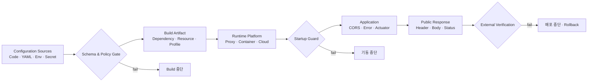
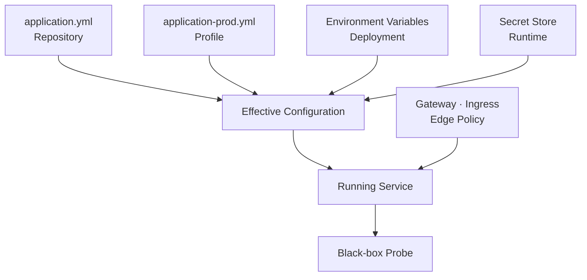
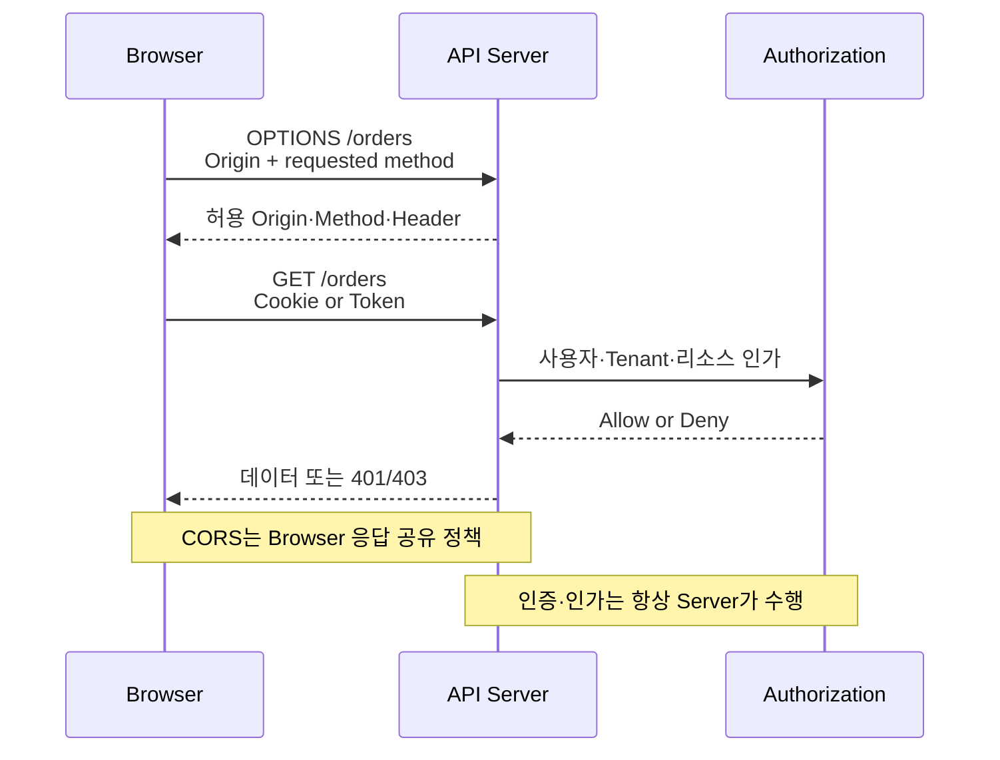
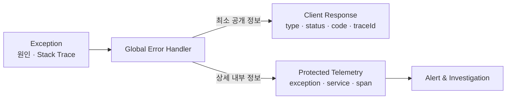
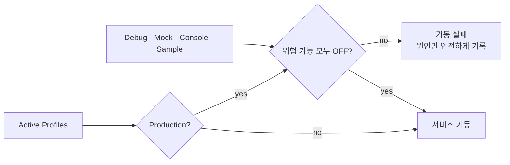
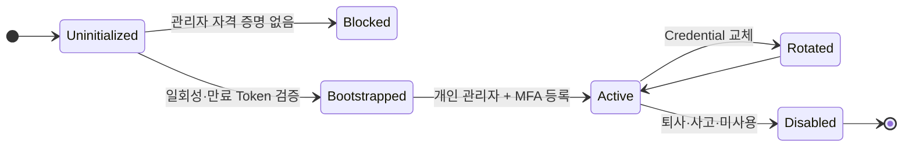
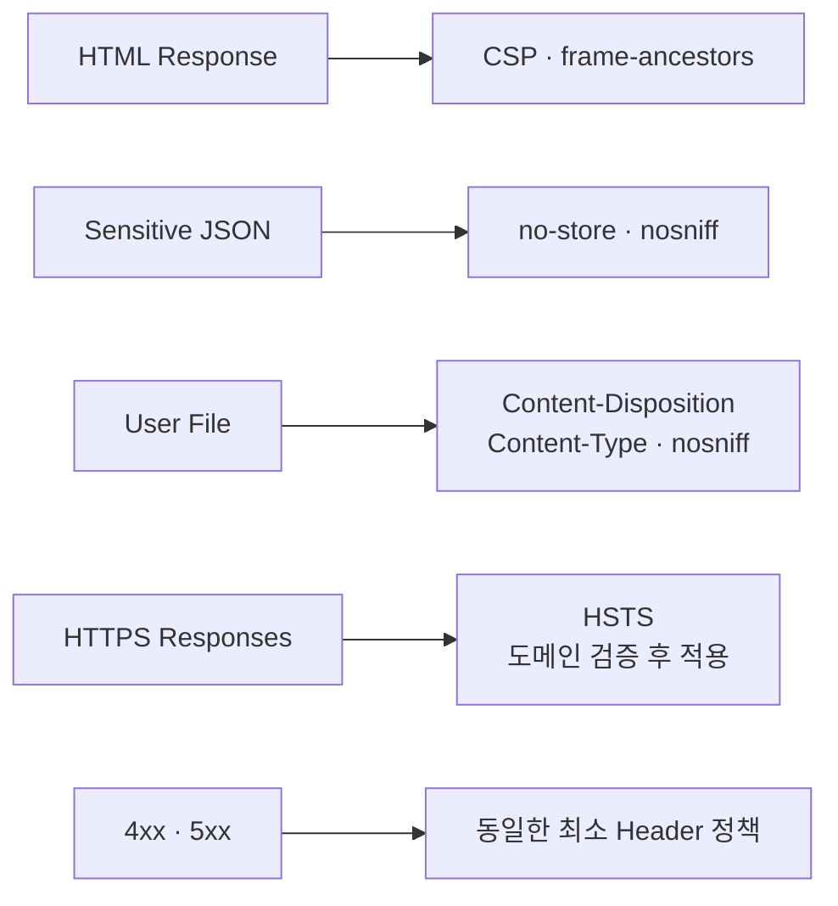
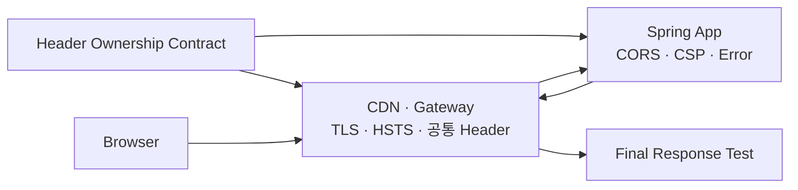
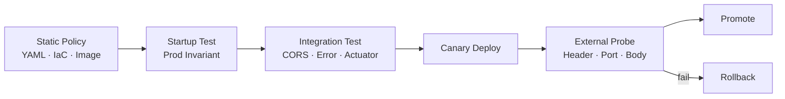

# Security Misconfiguration Secure Coding: CORS·Debug·기본 계정·보안 Header

애플리케이션 코드에 SQL Injection이 없어도 운영 설정 하나로 내부 정보가 외부에 노출될 수 있습니다. 개발 편의를 위해 열어 둔 CORS, 상세 오류, Actuator Endpoint와 기본 계정은 배포 환경이 바뀌는 순간 공격 표면이 됩니다.

Security Misconfiguration은 특정 코드 한 줄의 결함이라기보다 **안전한 기본값, 환경별 차이, 배포 검증이 함께 무너진 상태**입니다.

- 모든 Origin을 허용하면서 Cookie 인증도 사용합니다.
- 운영 API가 Stack Trace, SQL 문장과 파일 경로를 반환합니다.
- `/actuator/env`, `/heapdump` 또는 관리 Console이 외부에 열려 있습니다.
- 설치 직후의 관리자 계정과 Password가 그대로 남아 있습니다.
- Gateway에는 보안 Header가 있지만 오류 응답과 정적 파일에는 빠져 있습니다.
- 개발 Profile이나 Mock 인증이 운영에서 활성화됩니다.



이 글은 Java 21과 Spring Boot 3.x 기반의 합성 예제로 CORS, Debug 정보, 기본 계정, 관리 Endpoint와 HTTP 보안 Header를 다룹니다. 실제 고객명, Domain, 계정, Endpoint와 운영 Secret은 사용하지 않습니다.

## 1. OWASP Top 10:2025의 A02 Security Misconfiguration

2026년 8월 기준 최신 공개판인 OWASP Top 10:2025에서 Security Misconfiguration은 A02입니다. OWASP는 불필요한 기능·Port·계정, 변경되지 않은 기본 Password, 과도하게 상세한 오류, 안전하지 않은 Framework 설정과 누락된 보안 Header를 대표 징후로 제시합니다.

중요한 변화는 설정을 부수적인 운영 파일로 보면 안 된다는 점입니다. 애플리케이션 동작이 Configuration에 더 많이 의존할수록 설정도 Source Code처럼 검토·Test·승인해야 합니다.

- **Application** — 흔한 실패: Debug, CORS, Error 상세 노출. 필요한 통제: 안전한 기본값과 Startup 검증.
- **Framework** — 흔한 실패: 보안 기능 비활성화. 필요한 통제: 명시적 Security Configuration.
- **Management** — 흔한 실패: Actuator, Admin Console 공개. 필요한 통제: 별도 Network와 최소 Endpoint.
- **Reverse Proxy** — 흔한 실패: Header 누락·중복, TLS 종료 오류. 필요한 통제: Edge와 App의 책임 계약.
- **Container·Cloud** — 흔한 실패: 공개 Port, Storage ACL, Metadata 노출. 필요한 통제: IaC Policy와 외부 Scan.
- **Account·Secret** — 흔한 실패: 기본 계정, 정적 Password. 필요한 통제: 최초 기동 차단과 단기 Credential.

OWASP가 권장하는 방향은 반복 가능한 Hardening, 불필요한 구성요소 제거, 환경별 자동 검증, 계층 분리와 중앙 오류 처리입니다. 핵심은 문서에 적힌 권장값이 아니라 **배포된 결과가 그 정책을 실제로 만족하는지 증명하는 것**입니다.

## 2. 설정의 최종값은 한 파일에 있지 않다

Spring Boot 설정은 `application.yml`, Profile, 환경 변수, Command Line과 외부 Secret에서 합쳐집니다. 여기에 Gateway, Ingress, CDN과 Cloud 정책까지 더해지면 저장소의 YAML만 읽어서는 최종 보안 상태를 알 수 없습니다.



따라서 세 단계로 검증합니다.

1. Build 단계에서 금지된 Property와 Resource를 검사합니다.
2. Startup 단계에서 운영에 위험한 조합이면 기동을 거부합니다.
3. 배포 후 외부 관점에서 URL, Header, CORS와 오류 Body를 다시 검사합니다.

비밀값 자체를 CI Log에 출력해 비교해서는 안 됩니다. 설정 존재 여부, 형식, 허용 범위와 안전한 조합만 검증하고 Secret 값은 Masking합니다.

## 3. CORS는 인증이나 서버 접근 통제가 아니다

CORS(Cross-Origin Resource Sharing)는 Browser가 다른 Origin의 응답을 JavaScript에 노출할지 판단하도록 서버가 알려 주는 정책입니다. 공격자가 `curl`, Server Program 또는 직접 만든 Client로 API를 호출하는 것까지 막지 않습니다.

즉 다음 명제는 모두 잘못됐습니다.

- CORS에서 허용하지 않았으니 비로그인 호출도 안전하다.
- Front-end Domain만 허용했으니 API 인증이 필요 없다.
- Browser가 응답을 막으니 서버에서는 요청이 실행되지 않는다.

Preflight가 없는 Simple Request도 있고, Browser 밖의 Client는 CORS를 적용하지 않습니다. 모든 API는 CORS와 별개로 인증·인가·CSRF·Rate Limit을 설계해야 합니다.



### Origin을 정확히 비교한다

Origin은 Scheme, Host와 Port의 조합입니다. `https://app.example.test`와 `http://app.example.test`, `https://app.example.test:8443`은 서로 다른 Origin입니다.

다음 방식은 위험합니다.

- `origin.contains("example.test")`
- `origin.endsWith("example.test")`
- 사용자 입력을 그대로 정규식으로 사용
- 운영에서 `*`와 Credential을 함께 허용
- `null` Origin을 업무 검토 없이 허용
- 요청의 Origin을 그대로 응답에 반사

`evil-example.test`, `example.test.attacker.invalid` 같은 Domain도 느슨한 문자열 검사를 통과할 수 있습니다. 고객별 Domain이 동적이라면 등록 시 URL을 정규화하고, 승인된 Scheme·Host·Port의 정확한 Set을 서버에서 조회해야 합니다.

### Spring Security Allowlist 예제

```java
@Configuration
@EnableWebSecurity
@EnableConfigurationProperties(AllowedOrigins.class)
public class WebSecurityConfig {

    @Bean
    SecurityFilterChain apiSecurity(
            HttpSecurity http,
            CorsConfigurationSource corsSource) throws Exception {
        return http
            .cors(cors -> cors.configurationSource(corsSource))
            .authorizeHttpRequests(auth -> auth
                .requestMatchers("/public/**").permitAll()
                .anyRequest().authenticated())
            .build();
    }

    @Bean
    CorsConfigurationSource corsConfigurationSource(AllowedOrigins properties) {
        CorsConfiguration config = new CorsConfiguration();
        config.setAllowedOrigins(List.copyOf(properties.origins()));
        config.setAllowedMethods(List.of("GET", "POST", "PUT", "DELETE"));
        config.setAllowedHeaders(List.of("Authorization", "Content-Type", "Idempotency-Key"));
        config.setExposedHeaders(List.of("Location", "X-Request-Id"));
        config.setAllowCredentials(true);
        config.setMaxAge(Duration.ofMinutes(10));

        UrlBasedCorsConfigurationSource source = new UrlBasedCorsConfigurationSource();
        source.registerCorsConfiguration("/api/**", config);
        return source;
    }
}

@ConfigurationProperties("app.cors")
@Validated
public record AllowedOrigins(@NotEmpty List<@Pattern(
        regexp = "https://[a-z0-9.-]+(?::[0-9]{2,5})?") String> origins) {
}
```

예제의 정규식은 설명용 최소 제약입니다. 실제로는 `URI`로 Parse한 뒤 Scheme, Host, Port, User Info, Path 부재를 개별 검증하고 승인 Registry와 정확히 대조하는 편이 안전합니다.

Cookie 인증을 쓰는 경우 `allowCredentials(true)`의 영향과 CSRF 방어를 함께 검토합니다. Bearer Token이라고 해서 XSS, Token 보관과 요청 위조 문제가 자동으로 사라지는 것도 아닙니다.

### Preflight를 허용하되 업무 Endpoint를 열지 않는다

Spring Security 공식 문서는 Cookie가 없는 Preflight가 Security보다 먼저 처리되어야 한다고 설명합니다. 그렇다고 모든 `OPTIONS` 요청을 무조건 허용하는 별도 Catch-all Filter를 만들 필요는 없습니다. Framework CORS 통합을 사용하고 URL별 정책을 등록합니다.

CORS Test Matrix에는 최소 다음 조합이 필요합니다.

- **허용 Origin + 허용 Method** — 예상 결과: 정확한 Origin 반환.
- **미허용 Origin** — 예상 결과: CORS Header 없음 또는 명시적 거부.
- **허용 Origin + 미허용 Method** — 예상 결과: Preflight 실패.
- **허용 Origin + 미허용 Header** — 예상 결과: Preflight 실패.
- **Credential 요청** — 예상 결과: `*`가 아닌 정확한 Origin.
- **Origin 없음** — 예상 결과: 일반 Server Client 정책대로 처리.
- **`null` Origin** — 예상 결과: 명시적 업무 사유 없으면 거부.

## 4. 상세 오류는 공격자에게 내부 지도를 준다

운영 오류 응답에 Stack Trace, Package 이름, SQL, Table, 파일 경로, 내부 Host와 Library Version을 담으면 공격자는 별도 침투 없이 시스템 구조를 수집할 수 있습니다.

안전한 오류 처리는 정보가 없는 오류가 아닙니다. Client에는 안정적인 오류 계약과 추적 ID를 주고, 상세 원인은 접근 통제된 Server Log와 Trace에 남깁니다.



### 운영 기본 Property

```yaml
server:
  error:
    include-message: never
    include-binding-errors: never
    include-stacktrace: never
    include-exception: false

spring:
  mvc:
    problemdetails:
      enabled: true
```

Property만 믿지 말고 모든 Exception 경로를 중앙 Handler로 통제합니다. Framework 기본 Error, Validation Error, 인증 실패, 권한 거부, Reverse Proxy 오류와 Timeout도 별도로 확인합니다.

### 공개 오류와 내부 Log 분리

```java
@RestControllerAdvice
public class ApiExceptionHandler {

    private static final Logger log = LoggerFactory.getLogger(ApiExceptionHandler.class);

    @ExceptionHandler(Exception.class)
    ResponseEntity<ProblemDetail> unexpected(
            Exception exception,
            HttpServletRequest request) {
        String traceId = Optional.ofNullable(MDC.get("traceId"))
            .orElse("unavailable");

        log.error("unexpected_api_error path={} traceId={}",
            safePath(request.getRequestURI()), traceId, exception);

        ProblemDetail problem = ProblemDetail.forStatus(HttpStatus.INTERNAL_SERVER_ERROR);
        problem.setTitle("요청을 처리하지 못했습니다.");
        problem.setProperty("code", "INTERNAL_ERROR");
        problem.setProperty("traceId", traceId);

        return ResponseEntity.status(HttpStatus.INTERNAL_SERVER_ERROR).body(problem);
    }

    private String safePath(String path) {
        return path.replaceAll("[\\r\\n]", "_");
    }
}
```

`exception.getMessage()`를 Client에 전달하지 않습니다. Log에도 Authorization, Cookie, Password, Token, 전체 Request Body와 개인정보를 무차별 기록하지 않습니다. Trace ID는 내부 오류를 찾는 상관관계 Key이지 Secret이나 순차적인 고객 식별자가 아니어야 합니다.

## 5. Debug 기능과 개발 Profile은 운영에서 실패해야 한다

운영 설정에서 `debug=true` 한 줄을 찾는 것만으로 충분하지 않습니다. H2 Console, Swagger UI, GraphQL Introspection, Mock 인증, Test Controller, Sample Data Loader, 상세 SQL Log처럼 개발 편의 기능이 여러 경로로 들어옵니다.



다음처럼 운영 불변식을 기동 시점에 검사할 수 있습니다.

```java
@Component
public class ProductionSecurityGuard implements ApplicationRunner {

    private final Environment environment;
    private final SecurityFlags flags;

    public ProductionSecurityGuard(Environment environment, SecurityFlags flags) {
        this.environment = environment;
        this.flags = flags;
    }

    @Override
    public void run(ApplicationArguments args) {
        boolean production = Arrays.asList(environment.getActiveProfiles()).contains("prod");
        if (!production) {
            return;
        }

        List<String> violations = new ArrayList<>();
        if (flags.debug()) violations.add("debug");
        if (flags.mockAuthentication()) violations.add("mock-authentication");
        if (flags.sampleData()) violations.add("sample-data");
        if (flags.h2Console()) violations.add("h2-console");

        if (!violations.isEmpty()) {
            throw new ApplicationContextException(
                "Unsafe production features: " + String.join(",", violations));
        }
    }
}
```

이 Guard가 유일한 통제가 되면 안 됩니다. Build에서 개발 전용 Dependency와 Resource를 제외하고, 배포 Policy와 외부 Probe에서도 같은 불변식을 독립적으로 검증합니다.

또한 `prod` Profile이 빠졌다는 이유로 검사를 건너뛰는 구조 자체가 우회 경로가 될 수 있습니다. Cluster Namespace, 서명된 배포 Manifest처럼 Application 외부에서 관리하는 환경 식별자를 필수 입력으로 만들고, 값이 없거나 알려지지 않은 경우 기동을 거부해야 합니다. Admission Policy에서도 운영 Workload가 반드시 운영 식별자를 갖는지 독립적으로 검사합니다.

## 6. 기본 계정과 기본 Secret을 없앤다

기본 계정 문제는 Password를 복잡하게 바꾸는 것만으로 끝나지 않습니다. 잘 알려진 Username, 설치 Script가 만든 공용 관리자, 모든 고객사가 공유하는 Bootstrap Token과 비상 계정도 동일한 위험입니다.

권장 Lifecycle은 다음과 같습니다.



- Application Image에 기본 Password를 포함하지 않습니다.
- 필수 Secret이 없거나 Placeholder 값이면 기동을 실패시킵니다.
- Bootstrap Token은 일회성·짧은 만료·감사 Log를 갖게 합니다.
- 공용 `admin` 대신 개인 Identity와 역할을 사용합니다.
- Break-glass 계정은 평시 비활성화하고 사용 시 즉시 경보합니다.
- Sample·Demo·Vendor 계정을 배포 Inventory에서 제거합니다.
- 계정 생성, MFA 등록, 회수와 비활성화를 Test합니다.

다음 검사는 값 자체를 노출하지 않고 금지된 Placeholder만 거부합니다.

```java
@ConfigurationProperties("bootstrap")
@Validated
public record BootstrapProperties(
        @NotBlank String token,
        @AssertFalse boolean defaultAccountEnabled) {

    public BootstrapProperties {
        String normalized = token == null
            ? ""
            : token.strip().toLowerCase(Locale.ROOT);
        if (Set.of("changeme", "password", "default").contains(normalized)) {
            throw new IllegalArgumentException("bootstrap token uses a forbidden placeholder");
        }
    }
}
```

이 예제의 금지 목록은 실수 방지용 하한선일 뿐 강도 검증을 대신하지 않습니다. 실제 운영에서는 Secret Manager가 생성한 충분한 Entropy의 값만 허용하고 Version, 만료와 Rotation 상태를 검증하되 Secret 원문을 Log나 Health 응답에 노출하지 않습니다.

## 7. Actuator와 관리 Endpoint는 별도 경계로 본다

Spring Boot Actuator는 운영에 유용하지만 `env`, `configprops`, `beans`, `mappings`, `heapdump`, `loggers` 같은 Endpoint는 내부 구조와 민감 정보를 드러내거나 상태를 변경할 수 있습니다.

Spring Boot 공식 문서상 HTTP에는 기본적으로 `health`만 노출됩니다. 하지만 Custom `SecurityFilterChain`을 정의하면 Boot의 Actuator 보안 자동 설정이 물러나므로, 관리 Endpoint와 Application Endpoint의 규칙을 모두 명시해야 합니다.

```yaml
management:
  server:
    port: 9091
    address: 127.0.0.1
  endpoints:
    web:
      exposure:
        include: health,info
  endpoint:
    health:
      show-details: never
    env:
      show-values: never
    configprops:
      show-values: never
```

`127.0.0.1` 예시는 Sidecar나 동일 Host 수집기 구성에만 적합합니다. Kubernetes나 별도 Monitoring Network에서는 관리 Port를 내부 Interface에 Bind하고 NetworkPolicy, Security Group, Service Mesh 인증과 Spring Security를 함께 적용합니다.

```java
@Bean
@Order(1)
SecurityFilterChain actuatorSecurity(HttpSecurity http) throws Exception {
    return http
        .securityMatcher(EndpointRequest.toAnyEndpoint())
        .authorizeHttpRequests(auth -> auth
            .requestMatchers(EndpointRequest.to("health")).permitAll()
            .anyRequest().hasRole("ENDPOINT_ADMIN"))
        .httpBasic(Customizer.withDefaults())
        .build();
}

@Bean
@Order(2)
SecurityFilterChain applicationSecurity(HttpSecurity http) throws Exception {
    return http
        .authorizeHttpRequests(auth -> auth
            .requestMatchers("/public/**").permitAll()
            .anyRequest().authenticated())
        .build();
}
```

외부 Load Balancer에서 관리 Port가 실제로 닫혔는지 별도 Scanner로 확인합니다. Application 설정이 안전해도 Service, Ingress 또는 Firewall이 잘못되면 외부에 노출될 수 있습니다.

## 8. 보안 Header는 응답 유형별로 설계한다

보안 Header는 모든 응답에 같은 문자열을 복사하는 Checklist가 아닙니다. HTML, JSON API, 다운로드 파일, Redirect와 인증 오류는 Browser에서 처리되는 방식이 다릅니다.

- **`Content-Security-Policy`** — 주된 목적: 허용된 Script·Style·Frame 제한. 주의점: HTML 자원 목록과 함께 설계.
- **`Strict-Transport-Security`** — 주된 목적: Browser의 HTTPS 사용 강제. 주의점: HTTPS 응답에서만, Subdomain 영향 검토.
- **`X-Content-Type-Options: nosniff`** — 주된 목적: MIME 추측 방지. 주의점: 올바른 `Content-Type` 필수.
- **`Referrer-Policy`** — 주된 목적: 외부로 전달되는 Referer 최소화. 주의점: 업무 분석 요구와 균형.
- **CSP `frame-ancestors`** — 주된 목적: Clickjacking 방지. 주의점: 합법적 Embedding Domain 고려.
- **`Cache-Control: no-store`** — 주된 목적: 민감 응답 저장 방지. 주의점: 공개 정적 자원에는 별도 Cache 정책.
- **Cookie `Secure`, `HttpOnly`, `SameSite`** — 주된 목적: Session Cookie 보호. 주의점: Cross-site 업무 흐름 Test.



### Spring Security Header 설정 예제

Spring Security는 여러 안전한 기본 Header를 제공하지만 CSP와 업무별 정책은 직접 설계해야 합니다. Default를 모두 끄고 일부만 다시 켜는 방식은 누락을 만들기 쉬우므로 특별한 이유가 없다면 기본값을 유지하고 필요한 Header를 추가합니다.

```java
@Bean
SecurityFilterChain webSecurity(HttpSecurity http) throws Exception {
    return http
        .headers(headers -> headers
            .contentSecurityPolicy(csp -> csp.policyDirectives(
                "default-src 'self'; " +
                "script-src 'self'; " +
                "style-src 'self'; " +
                "img-src 'self' data:; " +
                "object-src 'none'; " +
                "base-uri 'self'; " +
                "frame-ancestors 'none'"))
            .referrerPolicy(referrer -> referrer.policy(
                ReferrerPolicyHeaderWriter.ReferrerPolicy.STRICT_ORIGIN_WHEN_CROSS_ORIGIN))
            .permissionsPolicy(permissions -> permissions.policy(
                "camera=(), microphone=(), geolocation=()")))
        .authorizeHttpRequests(auth -> auth.anyRequest().authenticated())
        .build();
}
```

CSP에 곧바로 `'unsafe-inline'`과 넓은 Wildcard를 추가해 오류를 없애면 정책의 의미가 약해집니다. 먼저 `Content-Security-Policy-Report-Only`로 위반을 관찰하고 Nonce 또는 Hash 기반으로 전환한 뒤 Enforcement합니다.

HSTS의 긴 `max-age`, `includeSubDomains`, `preload`는 인증서와 모든 Subdomain이 HTTPS 준비를 마쳤을 때만 단계적으로 적용합니다. 잘못 적용하면 정상 사용자의 접속도 장기간 막을 수 있습니다.

## 9. Gateway와 Application의 설정 중복을 관리한다

Gateway가 CORS와 Header를 설정하고 Application도 같은 Header를 추가하면 서로 다른 값이 중복될 수 있습니다. Browser가 예상과 다르게 해석하거나 배포 환경별 Drift가 생깁니다.



Header별 Owner를 정합니다.

- TLS 종료와 HSTS: Edge Owner
- 업무 Domain Allowlist와 CORS: Application 또는 단일 Policy Service
- HTML별 CSP: 해당 HTML을 생성하는 계층
- 민감 API Cache 정책: Application
- Server Banner 제거: Edge와 Application 모두 확인

소유 계층이 아닌 곳에서는 같은 Header를 추가하지 않도록 하고, 최종 인터넷 응답을 기준으로 중복·누락을 Test합니다. 특히 200뿐 아니라 204, 302, 400, 401, 403, 404, 429와 500 응답도 포함합니다.

## 10. 배포 Gate에서 설정을 증명한다

Unit Test가 `CorsConfiguration` 객체만 확인하면 Gateway가 바꾼 최종 응답을 놓칩니다. Repository Test, 기동 Test와 배포 후 Black-box Test를 겹쳐야 합니다.



### CORS 회귀 Test

```java
@SpringBootTest
@AutoConfigureMockMvc
class CorsPolicyTest {

    @Autowired MockMvc mvc;

    @Test
    void approved_origin_receives_exact_origin() throws Exception {
        mvc.perform(options("/api/orders")
                .header("Origin", "https://app.example.test")
                .header("Access-Control-Request-Method", "GET"))
            .andExpect(status().isOk())
            .andExpect(header().string(
                "Access-Control-Allow-Origin", "https://app.example.test"))
            .andExpect(header().string("Vary", containsString("Origin")));
    }

    @Test
    void lookalike_domain_is_not_allowed() throws Exception {
        mvc.perform(options("/api/orders")
                .header("Origin", "https://app.example.test.attacker.invalid")
                .header("Access-Control-Request-Method", "GET"))
            .andExpect(header().doesNotExist("Access-Control-Allow-Origin"));
    }
}
```

### 오류 정보 노출 Test

```java
@Test
void unexpected_error_does_not_expose_implementation_details() throws Exception {
    MvcResult result = mvc.perform(get("/test-support/unexpected-error"))
        .andExpect(status().isInternalServerError())
        .andExpect(jsonPath("$.code").value("INTERNAL_ERROR"))
        .andExpect(jsonPath("$.traceId").isNotEmpty())
        .andReturn();

    String body = result.getResponse().getContentAsString();
    assertThat(body)
        .doesNotContain("java.lang")
        .doesNotContain("select ")
        .doesNotContain("/Users/")
        .doesNotContain("password");
}
```

Test 전용 오류 Endpoint는 운영 Artifact에 포함하지 않거나 Test Profile에서만 생성합니다. 그렇지 않으면 Test를 위한 기능 자체가 새로운 공격 표면이 됩니다.

### 외부 Probe 항목

- 공개되지 않아야 할 Port와 관리 URL이 닫혀 있는가
- 허용·미허용 Origin에 대한 Preflight가 예상대로 동작하는가
- 오류 Body에 Stack Trace, SQL, 내부 경로와 Version이 없는가
- 모든 주요 Status Code에 필요한 보안 Header가 있는가
- Header가 중복되거나 서로 모순되지 않는가
- Directory Listing, Sample Page와 기본 Console이 제거됐는가
- Health Detail과 Build 정보가 필요 이상 노출되지 않는가
- 운영에서 Debug·Mock·Test Profile이 비활성화됐는가

## 11. 운영 탐지와 변경 관리

설정은 배포 이후에도 Console 변경, Feature Flag, 긴급 Patch와 Cloud 정책 수정으로 달라질 수 있습니다. 따라서 배포 성공 시점의 검사만으로는 충분하지 않습니다.

- Configuration 변경 Event를 감사 Log로 남깁니다.
- IaC와 실제 Cloud 상태의 Drift를 주기적으로 비교합니다.
- 허용 Origin 추가에는 소유자, 사유, 만료와 검토 기록을 요구합니다.
- Actuator·관리 Endpoint의 401, 403과 반복 탐색을 경보합니다.
- CSP Report는 개인정보를 최소화하고 Noise를 분류합니다.
- 새로운 외부 Port, Public Storage와 Security Group 변경을 탐지합니다.
- Break-glass 계정 사용과 보안 기능 비활성화를 즉시 알립니다.

설정 변경을 일반 코드보다 가볍게 승인해서는 안 됩니다. CORS Wildcard 한 줄이나 Actuator Exposure 한 줄은 애플리케이션 전체의 신뢰 경계를 바꿀 수 있습니다.

## 12. 실무 체크리스트

### CORS

- [ ] CORS가 인증·인가를 대신하지 않는다는 점을 설계에 명시했다.
- [ ] 허용 Origin을 Scheme·Host·Port까지 정확히 비교한다.
- [ ] Credential 사용 시 `*`를 사용하지 않는다.
- [ ] Lookalike Domain, `null` Origin과 미허용 Method를 Test한다.
- [ ] Gateway와 Application 중 CORS Owner가 하나다.
- [ ] Cookie 인증이면 CSRF 정책도 함께 검증한다.

### 오류와 Debug

- [ ] Client 오류에 Stack Trace, SQL, 경로, Version과 Secret이 없다.
- [ ] 상세 원인은 보호된 Log·Trace에 남고 Trace ID로 연결된다.
- [ ] 4xx와 5xx 의미가 구분되고 5xx가 Monitoring된다.
- [ ] Debug, Mock Auth, Console, Sample Data가 운영에서 기동을 차단한다.
- [ ] 운영 환경 식별자가 없거나 알 수 없는 값이면 Fail Closed한다.
- [ ] Test 지원 Endpoint가 운영 Artifact에 없다.

### 계정과 관리 Endpoint

- [ ] 기본·공용 관리자 계정이 없다.
- [ ] 필수 Secret 부재와 Placeholder 값에서 기동이 실패한다.
- [ ] Bootstrap Credential은 일회성·단기 만료다.
- [ ] Actuator는 최소 Endpoint만 노출한다.
- [ ] 관리 Port는 Network와 Application 양쪽에서 통제한다.
- [ ] Custom `SecurityFilterChain`이 Application 경로까지 보호한다.

### Header와 배포

- [ ] HTML, API, 파일, 오류 응답별 Header 정책이 있다.
- [ ] CSP는 Report-Only 관찰 후 점진 적용한다.
- [ ] HSTS 적용 전 인증서와 Subdomain 영향을 검토했다.
- [ ] 200 이외의 오류·Redirect 응답도 검사한다.
- [ ] Edge와 App의 Header 소유권이 명확하고 중복이 없다.
- [ ] Canary의 최종 외부 응답과 Port를 자동 검증한다.
- [ ] 배포 후 Configuration Drift를 지속 탐지한다.

## 마무리

Security Misconfiguration은 설정 값을 몇 개 외우는 문제가 아닙니다. 안전한 기본값을 만들고, 운영에서 위험한 조합은 기동하지 못하게 하며, 최종 외부 응답을 배포 Gate에서 검증하는 과정입니다.

CORS는 Browser 정책일 뿐 인증이 아니고, 오류 상세는 Client가 아니라 보호된 Telemetry에 있어야 합니다. 기본 계정과 불필요한 관리 기능은 제거하고, 보안 Header는 응답 유형과 배포 계층의 책임에 맞게 적용해야 합니다.

가장 실용적인 기준은 간단합니다.

> 저장소의 설정이 안전해 보이는가가 아니라, 지금 배포된 서비스가 안전한 설정을 증명하는가?

다음 글에서는 OWASP Top 10:2025 A03 Software Supply Chain Failures를 기준으로 의존성, SBOM, Artifact 서명과 배포 Gate를 연결하는 방법을 다룹니다.

## 공식 참고 자료

- [OWASP Top 10:2025 — A02 Security Misconfiguration](https://owasp.org/Top10/2025/A02_2025-Security_Misconfiguration/)
- [OWASP HTTP Security Response Headers Cheat Sheet](https://cheatsheetseries.owasp.org/cheatsheets/HTTP_Headers_Cheat_Sheet.html)
- [OWASP Error Handling Cheat Sheet](https://cheatsheetseries.owasp.org/cheatsheets/Error_Handling_Cheat_Sheet.html)
- [OWASP Content Security Policy Cheat Sheet](https://cheatsheetseries.owasp.org/cheatsheets/Content_Security_Policy_Cheat_Sheet.html)
- [Spring Security — CORS](https://docs.spring.io/spring-security/reference/servlet/integrations/cors.html)
- [Spring Security — Security HTTP Response Headers](https://docs.spring.io/spring-security/reference/servlet/exploits/headers.html)
- [Spring Boot — Actuator Endpoints](https://docs.spring.io/spring-boot/reference/actuator/endpoints.html)
