# Software Supply Chain Secure Coding: 의존성·SBOM·서명·배포 Gate

우리 코드가 안전해도 빌드에 들어온 라이브러리, Plugin, Base Image 또는 CI Action이 바뀌면 최종 Artifact는 달라집니다. 배포 파일이 정상적인 Source와 승인된 Build에서 만들어졌는지 확인하지 않으면, 취약한 의존성뿐 아니라 변조된 Build 과정도 운영에 들어갈 수 있습니다.

Software Supply Chain 보안은 `CVE Scan을 통과했는가`라는 한 가지 질문으로 끝나지 않습니다.

- 어떤 직접·전이 의존성이 실제로 포함됐는가?
- 의존성을 어느 Repository에서 어떤 Byte로 받았는가?
- 누가 어떤 Source Revision과 Build Workflow로 Artifact를 만들었는가?
- SBOM과 서명이 지금 배포하려는 Artifact Digest에 연결돼 있는가?
- 운영 환경은 이 증거를 검증한 동일 Artifact만 허용하는가?

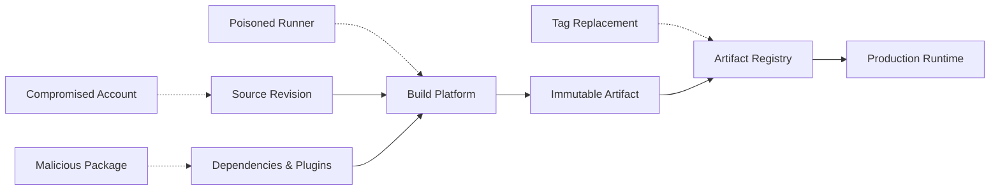

이 글은 2026년 8월 기준 최신 공개판인 OWASP Top 10:2025 A03 Software Supply Chain Failures를 바탕으로, Java 21·Spring Boot 3 프로젝트에서 적용할 수 있는 합성 예제를 다룹니다. 실제 조직명, Repository, Token, 내부 URL과 운영 Artifact 정보는 사용하지 않습니다.

## 1. A03는 오래된 Library보다 넓은 문제다

OWASP Top 10:2025의 A03는 2021년의 `Vulnerable and Outdated Components`를 확장해 의존성, Build System과 배포 인프라 전체를 다룹니다. 직접 의존성만 보고 전이 의존성을 놓치거나, CI/CD의 권한이 과도하거나, Artifact를 환경마다 다시 Build하거나, 변경 추적 없이 IDE·Plugin·Registry 설정을 바꾸는 것도 같은 범주에 포함됩니다.

안전한 공급망은 다음 네 가지 증거를 연결합니다.

- **Dependency Graph** — 답해야 하는 질문: 무엇이 포함됐는가. 대표 통제: 고정 Version, Lock, Verification.
- **SBOM** — 답해야 하는 질문: Release 구성요소는 무엇인가. 대표 통제: CycloneDX·SPDX, Digest 연결.
- **Provenance** — 답해야 하는 질문: 어디서 어떻게 만들어졌는가. 대표 통제: SLSA Attestation, CI Identity.
- **Deployment Evidence** — 답해야 하는 질문: 무엇이 실제 배포됐는가. 대표 통제: Digest 배포, Admission·Release Gate.

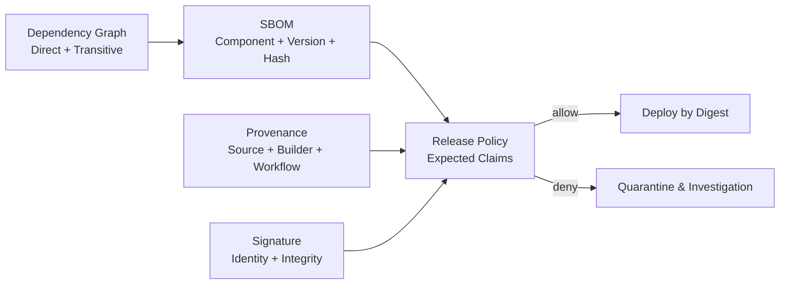

여기서 중요한 구분이 있습니다. SBOM은 구성요소 목록이지 안전성 보증서가 아닙니다. 서명은 Artifact와 Signer의 관계를 검증하지만 취약점 부재를 보장하지 않습니다. Provenance도 실제 값이 조직이 기대한 Repository, Workflow와 Builder인지 검증해야 의미가 있습니다.

## 2. 먼저 공급망 경계를 그린다

Application Repository만 보호해서는 부족합니다. Build에 영향을 줄 수 있는 입력과 권한을 모두 나열합니다.

- Source, Branch Protection, Pull Request와 CODEOWNERS
- Maven POM, Gradle Build Script, Wrapper와 Plugin
- Maven Central, 사내 Proxy Repository와 Container Registry
- JDK, Build Image, OS Package와 Base Image
- CI Workflow, 재사용 Workflow, Action과 Runner Image
- Build Secret, OIDC Token, Package Publish 권한
- SBOM Generator, Vulnerability Feed와 Policy Engine
- Artifact Registry, Promotion 권한과 Deployment Controller

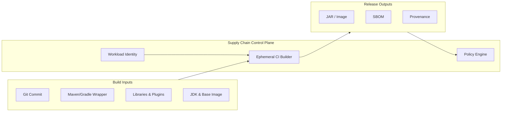

각 경계에는 Owner, 승인 방식, 변경 기록, 최소 권한과 실패 동작을 정합니다. 특히 Scan Server나 SBOM Generator 자체도 신뢰 체인의 일부입니다.

## 3. 의존성은 선언 Version이 아니라 해결 결과로 관리한다

`pom.xml`이나 `build.gradle.kts`에 보이는 직접 의존성만으로 Release 구성을 알 수 없습니다. Framework Starter와 Plugin이 끌어온 전이 의존성, Platform/BOM이 선택한 Version, Conflict Resolution 결과까지 봐야 합니다.

### 피해야 할 선언

```xml
<!-- Release Build에서 피한다. 같은 선언이 다른 Byte를 만들 수 있다. -->
<version>[3.0,4.0)</version>
<version>LATEST</version>
<version>1.2-SNAPSHOT</version>
```

```kotlin
dependencies {
    implementation("com.example:client:1.+")
    implementation("com.example:shared:latest.release")
}
```

Release 경로에서는 정확한 Version과 해결 결과를 고정합니다. 다만 Version 고정은 업데이트 중단을 의미하지 않습니다. 자동 Update PR이 Lock과 Verification Metadata의 차이를 보여주고, Test와 Review를 거쳐 의도적으로 갱신하게 만듭니다.

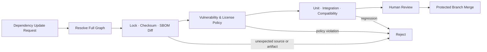

### Maven: Version과 Plugin을 중앙에서 고정한다

Spring Boot Dependency Management를 사용해도 모든 사내 Library와 Build Plugin Version이 자동으로 고정되는 것은 아닙니다. Parent POM 또는 조직 BOM에서 관리하고, Release에는 Version Range와 SNAPSHOT을 금지합니다.

```xml
<properties>
    <java.version>21</java.version>
    <maven.compiler.release>21</maven.compiler.release>
    <!-- Release 절차가 해당 Release Commit에서 갱신하는 고정값 -->
    <project.build.outputTimestamp>2026-08-01T00:00:00Z</project.build.outputTimestamp>
    <cyclonedx.version>2.9.2</cyclonedx.version>
</properties>

<dependencyManagement>
    <dependencies>
        <dependency>
            <groupId>org.springframework.boot</groupId>
            <artifactId>spring-boot-dependencies</artifactId>
            <version>3.5.5</version>
            <type>pom</type>
            <scope>import</scope>
        </dependency>
    </dependencies>
</dependencyManagement>

<build>
    <plugins>
        <plugin>
            <groupId>org.apache.maven.plugins</groupId>
            <artifactId>maven-enforcer-plugin</artifactId>
            <version>3.6.3</version>
            <executions>
                <execution>
                    <id>enforce-release-dependencies</id>
                    <goals>
                        <goal>enforce</goal>
                    </goals>
                    <configuration>
                        <rules>
                            <requireReleaseDeps>
                                <searchTransitive>true</searchTransitive>
                            </requireReleaseDeps>
                            <requirePluginVersions/>
                        </rules>
                    </configuration>
                </execution>
            </executions>
        </plugin>
    </plugins>
</build>
```

위 Version은 예제 기준점입니다. 실제 프로젝트에서는 조직이 검증한 현재 Version으로 Pin하고 Update PR에서 변경합니다. `requireReleaseDeps`는 직접·전이 SNAPSHOT을, `requirePluginVersions`는 Version이 없거나 허용되지 않은 Plugin Version을 차단합니다. Dependency Version Range까지 금지하려면 Effective POM을 검사하는 별도 CI Policy 또는 검증된 Custom Rule을 추가해야 합니다.

`project.build.outputTimestamp`만으로 완전한 재현 가능 Build가 보장되지는 않습니다. Maven 공식 문서가 설명하듯 OS, JDK와 Plugin이 결과에 영향을 줄 수 있으므로 격리된 환경에서 독립적으로 비교해야 합니다.

```bash
./mvnw -B dependency:tree -Dverbose
# 첫 Build를 Local Repository의 비교 기준으로 설치한다.
./mvnw -B clean install
# 같은 Source를 다시 Build해 기준 Artifact와 비교한다.
./mvnw -B clean verify artifact:compare
```

### Gradle: Lock과 Verification을 함께 사용한다

```kotlin
// build.gradle.kts
dependencyLocking {
    lockAllConfigurations()
    lockMode.set(LockMode.STRICT)
}

configurations.configureEach {
    resolutionStrategy {
        failOnVersionConflict()
        failOnDynamicVersions()
        failOnChangingVersions()
    }
}
```

```bash
# 신뢰 가능한 기준 상태에서 생성하고 반드시 Diff를 검토한다.
./gradlew dependencies --write-locks
./gradlew --write-verification-metadata sha256,pgp help

# CI 기본은 strict다. 명시하면 설정 의도가 더 분명해진다.
./gradlew --dependency-verification strict clean build
```

Gradle 공식 문서상 Dependency Verification은 Artifact와 Metadata, Plugin까지 확인할 수 있고 `strict`가 기본입니다. 그러나 처음 Metadata를 생성하는 Bootstrap 작업은 현재 내려받은 파일을 신뢰하므로, 생성 자체를 검증으로 오해하면 안 됩니다. 핵심 의존성의 Checksum과 Signing Key를 공식 출처와 대조하고 Review한 뒤 Version Control에 넣습니다.

## 4. Repository를 Allowlist하고 Dependency Confusion을 차단한다

여러 Public Repository와 사내 Repository를 무순서로 등록하면 같은 Namespace가 외부에서 더 높은 Version으로 해결되는 Dependency Confusion 위험이 커집니다. Build가 어디서 Artifact를 받았는지도 불명확해집니다.

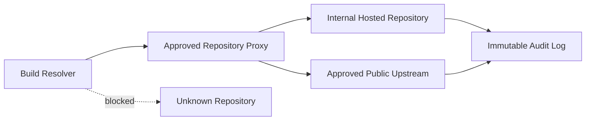

Gradle에서는 Repository Content Rule로 내부 Group을 사내 Repository에만 연결할 수 있습니다.

```kotlin
// settings.gradle.kts
dependencyResolutionManagement {
    repositoriesMode.set(RepositoriesMode.FAIL_ON_PROJECT_REPOS)
    repositories {
        exclusiveContent {
            forRepository {
                maven {
                    name = "internal"
                    url = uri("https://packages.example.test/maven/releases")
                }
            }
            filter {
                includeGroupByRegex("com\\.example\\.internal(\\..*)?")
            }
        }
        mavenCentral()
    }
}
```

예제 Domain은 문서용입니다. 운영에서는 다음 정책을 함께 둡니다.

- Repository 목록과 순서를 중앙 관리합니다.
- 내부 Namespace를 Public Registry에도 선점할 필요가 있는지 검토합니다.
- 새 Repository와 Signing Key 추가는 일반 의존성 변경과 분리해 승인합니다.
- HTTPS만으로 신뢰를 끝내지 않고 Artifact Checksum·Signature를 검증합니다.
- 개발자 개인 Cache가 아니라 깨끗한 CI 환경에서 Release를 해결합니다.
- Mirror나 Proxy의 Admin, Publish와 Read 권한을 분리합니다.

## 5. SBOM은 Build 시점의 해결 결과에서 만든다

SBOM을 배포 후 Source 선언만 보고 만들면 실제 Package, 전이 의존성 또는 Container Layer가 누락될 수 있습니다. Build가 해결한 정확한 구성에서 CycloneDX나 SPDX 형식으로 생성합니다.

```xml
<plugin>
    <groupId>org.cyclonedx</groupId>
    <artifactId>cyclonedx-maven-plugin</artifactId>
    <version>${cyclonedx.version}</version>
    <executions>
        <execution>
            <phase>package</phase>
            <goals>
                <goal>makeAggregateBom</goal>
            </goals>
        </execution>
    </executions>
    <configuration>
        <schemaVersion>1.6</schemaVersion>
        <outputFormat>json</outputFormat>
        <includeBomSerialNumber>true</includeBomSerialNumber>
        <includeTestScope>false</includeTestScope>
    </configuration>
</plugin>
```

CycloneDX Maven Plugin은 직접·전이 의존성을 포함한 Aggregate SBOM을 만들 수 있습니다. Gradle 프로젝트도 검증된 CycloneDX Plugin을 Pin해 해결된 Configuration을 기준으로 생성합니다. Plugin 이름만 추가하는 것으로 끝내지 말고 Multi-project, Runtime Scope와 배포 Image 내부 구성요소가 포함되는지 Fixture로 Test합니다.

이 Plugin이 SBOM을 Maven 부가 Artifact로 연결하는 것과, 최종 JAR·Image Digest를 Subject로 하는 암호학적 Attestation을 만드는 것은 별도 단계입니다. Build 후 최종 Artifact Digest를 계산하고 SBOM Attestation의 Subject와 일치시키는 작업을 CI에서 명시적으로 수행합니다.

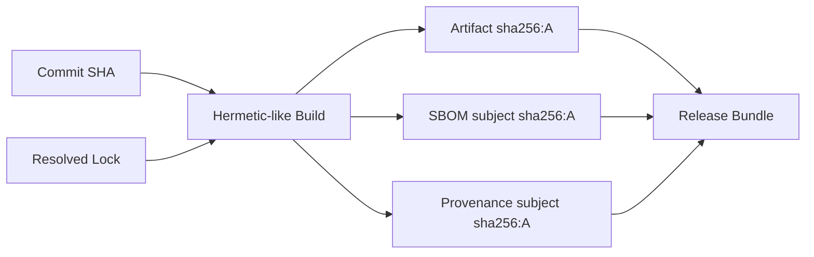

SBOM의 핵심은 파일 존재가 아니라 Artifact와의 결합입니다.

- Product 이름, Version과 고유 식별자
- 직접·전이 Component와 Dependency 관계
- Package URL 또는 동등한 생태계 식별자
- Component Hash, Scope와 License
- SBOM Generator 이름·Version과 생성 시각
- 대상 Artifact의 이름과 불변 Digest

같은 Version Tag라도 Artifact Byte가 다를 수 있습니다. 따라서 SBOM을 `service:1.4.0` 같은 Tag에만 연결하지 않고 `sha256` Digest에 연결하고 함께 서명·보관합니다.

## 6. Vulnerability Scan은 발견 이후의 정책이 더 중요하다

Scanner가 CVE를 찾았다고 무조건 모든 Release를 막거나, 반대로 `False Positive`라고 모두 무시하면 운영이 무너집니다. 정책은 Severity 외에 실제 노출과 조치 기한을 포함합니다.

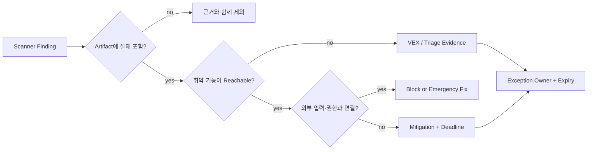

최소한 다음 필드를 Ticket과 Release Evidence에 남깁니다.

- Artifact Digest와 SBOM ID
- Component와 Dependency Path
- Advisory ID, Severity와 Exploitability
- 실제 호출 가능성, 데이터 흐름과 Runtime 노출
- 수정 Version 또는 격리·차단 방안
- Risk Owner, 승인자, 만료일과 재검토 조건

예외는 영구 Allowlist가 아닙니다. 만료되면 자동으로 Gate를 닫고 다시 평가합니다. 새 Vulnerability Feed가 들어오면 이미 배포된 SBOM도 다시 분석해야 합니다.

## 7. 한 번 Build하고 환경 사이에서는 Promotion한다

개발·검증·운영마다 Source에서 다시 Build하면 각 환경의 결과가 달라질 수 있습니다. 검증한 Artifact를 불변 Digest로 승격합니다.

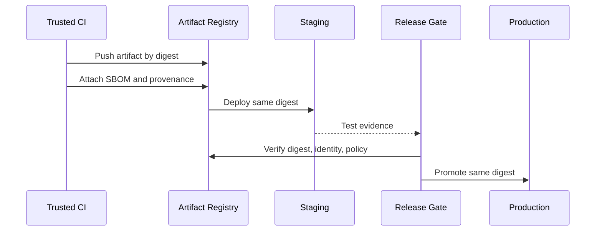

다음 두 흐름은 다릅니다.

```text
안전한 방향: build once → test digest A → promote digest A → deploy digest A
피해야 할 방향: build dev → build stage → build prod → 같은 tag라고 가정
```

Container Image도 Mutable Tag가 아니라 Digest로 배포합니다.

```yaml
image: registry.example.test/example-service@sha256:<approved-digest>
```

`latest`나 Release Tag는 사람이 찾기 위한 Alias로 사용할 수 있지만, Gate와 Runtime의 신뢰 판단 기준은 불변 Digest여야 합니다.

## 8. 서명과 Provenance는 기대한 Identity까지 검증한다

Sigstore Cosign의 Keyless Signing은 OIDC Identity를 인증서에 연결할 수 있습니다. 하지만 `유효한 서명이 하나 있다`만 확인하면 공격자가 자신의 Identity로 서명한 Artifact도 통과할 수 있습니다. Verification은 예상 Issuer와 Certificate Identity 또는 Workflow Identity를 제한해야 합니다.

```bash
cosign verify \
  --certificate-oidc-issuer "https://token.actions.githubusercontent.com" \
  --certificate-identity-regexp \
    "^https://github.com/example-org/example-service/.github/workflows/release.yml@refs/tags/v[0-9]+\\.[0-9]+\\.[0-9]+$" \
  "registry.example.test/example-service@sha256:<digest>"
```

정규식은 합성 예제입니다. 실제 정책에서는 가능한 한 정확한 Repository, Workflow Path, Ref, Event와 Environment를 검증하고, 넓은 Organization Wildcard를 피합니다.

SLSA v1.2 Build Track은 Provenance가 존재하는 L1, Hosted Build Platform이 서명한 L2, Hardened Build Platform을 요구하는 L3로 보증을 높입니다. 목표 Level을 선언하는 것보다 현재 Builder가 각 Requirement를 실제로 충족하는지 평가하고 Evidence를 보존하는 것이 중요합니다.

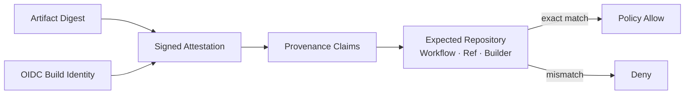

GitHub Actions를 사용한다면 Artifact Attestation을 생성할 수 있습니다. Action은 Tag가 아니라 검토한 Full Commit SHA로 Pin하는 정책을 권장합니다.

```yaml
name: release

on:
  push:
    tags: ["v*"]

permissions:
  contents: read
  id-token: write
  attestations: write

jobs:
  build:
    runs-on: ubuntu-latest
    steps:
      # 아래 Placeholder는 승인한 Action Release의 40자리 Commit SHA로 교체한다.
      - uses: actions/checkout@<reviewed-full-commit-sha>

      - name: Build once
        run: ./mvnw -B clean verify

      - name: Generate build provenance
        uses: actions/attest@<reviewed-full-commit-sha>
        with:
          subject-path: target/example-service.jar
```

공식 예제의 Major Tag는 기능 설명에는 편리하지만, 조직의 공급망 정책에서는 Action Repository 침해와 Tag 이동 가능성을 고려해 검토한 Commit SHA를 Pin합니다. Update Bot이 새 SHA와 Release Note를 PR로 제시하게 만들면 유지보수성과 통제를 함께 확보할 수 있습니다.

## 9. 배포 Gate는 모든 증거를 같은 Digest로 묶는다

Release Gate는 Scanner 결과 파일이 존재하는지만 보지 않습니다. 배포 대상 Digest를 기준으로 모든 Evidence의 Subject가 일치하는지 확인합니다.

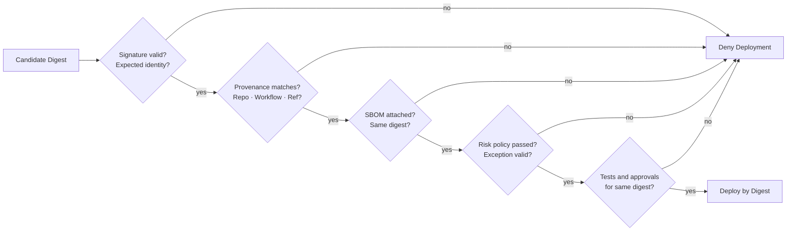

정책의 입력은 최소한 다음을 포함합니다.

```json
{
  "artifact": {
    "name": "example-service",
    "digest": "sha256:<digest>"
  },
  "provenance": {
    "repository": "example-org/example-service",
    "workflow": ".github/workflows/release.yml",
    "ref": "refs/tags/v1.4.0",
    "builder": "approved-hosted-builder"
  },
  "evidence": {
    "sbomSubjectDigest": "sha256:<digest>",
    "testSubjectDigest": "sha256:<digest>",
    "signatureVerified": true
  },
  "risk": {
    "blockingFindings": 0,
    "expiredExceptions": 0
  }
}
```

이 JSON은 특정 제품 Schema가 아닌 정책 입력의 합성 예제입니다. `blockingFindings: 0`을 Pipeline이 임의로 쓰게 해서는 안 됩니다. Gate가 서명된 원본 Evidence를 읽어 직접 계산하거나 신뢰된 Policy Service가 Attest해야 합니다.

## 10. CI/CD를 Application보다 약하게 두지 않는다

Build Runner는 Source, Dependency, Secret과 Publish 권한을 한곳에서 다루기 때문에 고가치 공격 대상입니다.

- 기본 `permissions`를 읽기 전용으로 두고 Job별 필요한 권한만 엽니다.
- Pull Request, 특히 Fork에서 운영 Secret과 Publish Token을 제공하지 않습니다.
- 장기 Cloud Key 대신 Repository·Workflow·Environment가 제한된 단기 OIDC Identity를 사용합니다.
- Release Job은 보호된 Tag·Environment와 별도 승인 규칙을 사용합니다.
- Self-hosted Runner는 작업 간 상태를 남기지 않는 Ephemeral 방식으로 격리합니다.
- Workflow와 재사용 Workflow 변경에 CODEOWNERS Review를 요구합니다.
- Third-party Action을 Full Commit SHA로 Pin하고 Update를 추적합니다.
- Build Log, Artifact와 Attestation에 Secret이 포함되지 않는지 검사합니다.
- Build와 Production 배포 권한을 분리하고 사람이 Registry 내용을 직접 교체하지 못하게 합니다.

특히 `pull_request_target`처럼 높은 권한의 Context에서 신뢰하지 않는 Branch 코드를 Checkout해 실행하면 Repository Secret이 노출될 수 있습니다. Event 이름만 금지하는 대신 `신뢰하지 않는 코드는 신뢰된 권한과 같은 Job에서 실행하지 않는다`는 원칙을 적용합니다.

## 11. 자동화 Test는 실패 경로를 증명해야 한다

정상 Release만 확인하면 Gate가 Fail Open인지 알 수 없습니다. 합성 Artifact와 조작된 Evidence로 Negative Test를 만듭니다.

- **승인되지 않은 Repository의 Artifact** — 기대 결과: 거부.
- **올바른 서명, 잘못된 Workflow Identity** — 기대 결과: 거부.
- **Artifact와 SBOM Digest 불일치** — 기대 결과: 거부.
- **Provenance 없는 Artifact** — 기대 결과: 거부.
- **만료된 Vulnerability 예외** — 기대 결과: 거부.
- **Mutable Tag만 제공** — 기대 결과: 거부.
- **승인된 Digest·Identity·Evidence 일치** — 기대 결과: 허용.
- **Registry Timeout 또는 Policy Engine 오류** — 기대 결과: 거부 및 경보.

```bash
set -euo pipefail

ARTIFACT="target/example-service.jar"
SBOM="target/bom.json"

test -s "$ARTIFACT"
test -s "$SBOM"

ARTIFACT_SHA="$(sha256sum "$ARTIFACT" | awk '{print $1}')"
test -n "$ARTIFACT_SHA"

# 실제 CI에서는 검증된 SBOM Validator와 Policy Engine을 Pin해 사용한다.
./policy-check \
  --artifact "$ARTIFACT" \
  --artifact-sha256 "$ARTIFACT_SHA" \
  --sbom "$SBOM" \
  --fail-on-missing-provenance
```

예제의 `policy-check`는 조직별 검증기를 뜻하는 Placeholder입니다. 검증기가 없는데 명령 이름만 만들어 통과시키지 말고, 사용하는 Registry·Attestation 형식에 맞는 검증 도구와 정책을 구현합니다.

## 12. 탐지·대응은 이미 배포된 Artifact까지 연결한다

새 CVE가 발표되거나 Signing Identity가 침해됐을 때 `현재 어느 서비스가 영향받는가`를 몇 분 안에 찾을 수 있어야 SBOM이 운영 자산이 됩니다.

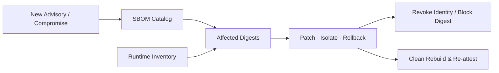

운영 절차에는 다음을 포함합니다.

1. 취약 Component, 악성 Version, Signing Identity 또는 Builder 범위를 식별합니다.
2. SBOM Catalog에서 영향받는 Artifact Digest를 찾습니다.
3. Runtime Inventory와 대조해 실제 배포 위치를 확인합니다.
4. Digest 차단, Credential 폐기, 격리 또는 이전 검증 Artifact로 Rollback합니다.
5. 깨끗한 Builder와 승인된 Source에서 새 Artifact를 Build합니다.
6. 새 SBOM·Provenance·Signature를 만들고 Gate를 다시 통과합니다.
7. 왜 기존 통제가 탐지·차단하지 못했는지 Policy와 Test에 반영합니다.

Tag 삭제만으로 이미 Pull된 Image를 제거할 수 없고, 서명을 지웠다고 Runtime이 자동으로 중단되는 것도 아닙니다. Registry의 Revocation 정보, Admission 정책, 배포 Inventory와 Incident Playbook이 연결돼야 합니다.

## 13. 흔하지만 불충분한 대응

### `Dependabot이나 Scanner를 켰으니 끝이다`

Scanner는 알려진 Vulnerability 탐지에 도움을 주지만 악성 Build Step, 변조된 Runner, 잘못된 Signing Identity와 환경별 재Build를 모두 해결하지 않습니다.

### `Version을 고정했으니 안전하다`

고정된 Version이 악성일 수 있고, Repository가 같은 좌표에 다른 Byte를 제공할 수도 있습니다. Lock에 Checksum·Signature 검증과 Repository 정책을 더해야 합니다.

### `서명돼 있으면 신뢰한다`

Signer가 누구인지, 어떤 Workflow와 Source에서 만들었는지 기대값과 비교하지 않으면 의미가 없습니다. 서명된 Malware도 Malware입니다.

### `SBOM은 감사 때 한 번 만든다`

Source 선언에서 수동 생성한 오래된 SBOM은 배포 Artifact를 설명하지 못합니다. 매 Release Build에서 생성하고 Digest에 결합해 보관합니다.

### `Critical CVE가 없으면 무조건 배포한다`

Feed 지연, 잘못된 Package Mapping, 알려지지 않은 취약점과 악성 변경은 점수 하나로 잡히지 않습니다. Provenance, Test, Review와 Runtime 통제를 겹칩니다.

## 14. 실무 체크리스트

### 의존성·Repository

- [ ] 직접·전이 의존성과 Build Plugin의 해결 결과를 추적한다.
- [ ] Release에서 Dynamic Version, Range와 SNAPSHOT을 금지한다.
- [ ] Maven·Gradle Wrapper와 Plugin Version을 고정한다.
- [ ] Gradle Lock과 Dependency Verification을 Strict로 적용한다.
- [ ] Verification Metadata Bootstrap 결과를 공식 출처와 Review한다.
- [ ] 내부 Namespace와 Repository Source를 Allowlist한다.
- [ ] 사용하지 않거나 유지보수되지 않는 Component를 제거한다.

### SBOM·취약점

- [ ] Build의 해결 결과에서 CycloneDX 또는 SPDX SBOM을 생성한다.
- [ ] 직접·전이 Dependency와 Runtime 구성요소가 포함되는지 Test한다.
- [ ] SBOM을 Artifact의 불변 Digest에 연결한다.
- [ ] SBOM Generator와 Schema Version을 Pin한다.
- [ ] 새 Advisory에 대해 과거·현재 SBOM을 지속 재평가한다.
- [ ] 예외에는 Owner, 근거, 보완 통제와 만료일이 있다.
- [ ] 예외 만료 시 Release Gate가 자동으로 닫힌다.

### Build·서명·Provenance

- [ ] 보호된 Source Revision에서 격리된 Builder로 한 번만 Build한다.
- [ ] 개발·검증·운영 사이에서 동일 Digest를 Promotion한다.
- [ ] Artifact, SBOM과 Provenance의 Subject Digest가 일치한다.
- [ ] Signature뿐 아니라 OIDC Issuer와 정확한 Build Identity를 검증한다.
- [ ] CI Action과 재사용 Workflow를 검토한 Commit SHA로 Pin한다.
- [ ] CI 권한은 Job별 최소 권한이며 장기 Publish Key를 피한다.
- [ ] Fork나 신뢰하지 않는 코드를 운영 Secret과 함께 실행하지 않는다.

### 배포·운영

- [ ] Runtime은 Mutable Tag가 아닌 승인된 Digest를 배포한다.
- [ ] Missing·Invalid·Timeout 상태에서 Gate가 Fail Closed한다.
- [ ] 잘못된 Identity, 불일치 Digest와 만료 예외 Negative Test가 있다.
- [ ] Registry의 직접 교체와 수동 운영 배포를 차단·감사한다.
- [ ] Runtime Inventory를 Artifact Digest와 연결한다.
- [ ] Component·Builder 침해 시 영향 Digest를 찾는 Playbook이 있다.
- [ ] Credential 폐기, Digest 차단, Rollback과 Clean Rebuild를 훈련한다.

## 마무리

Software Supply Chain 보안은 `안전해 보이는 Library 목록`이 아니라 **Source에서 운영 Runtime까지 이어지는 검증 가능한 증거 체인**을 만드는 일입니다.

의존성을 고정하고 Repository를 제한한 뒤, Build 시점의 해결 결과로 SBOM을 만듭니다. Artifact, SBOM과 Provenance를 같은 Digest에 결합하고, 서명자의 Identity와 Build Workflow를 정책으로 검증합니다. 마지막으로 검증한 Artifact를 다시 만들지 않고 환경 사이에서 Promotion하며, Runtime에서는 Digest 단위로 허용합니다.

가장 실용적인 질문은 다음과 같습니다.

> 이 파일에 서명이 있는가가 아니라, 지금 배포하려는 이 Digest가 승인된 Source와 Builder에서 만들어졌음을 정책으로 증명할 수 있는가?

다음 글에서는 OWASP Top 10:2025 A04 Cryptographic Failures를 기준으로 Password Hash, Token, Encryption Key와 Rotation 경계를 다룹니다.

## 공식 참고 자료

- [OWASP Top 10:2025 — A03 Software Supply Chain Failures](https://owasp.org/Top10/2025/A03_2025-Software_Supply_Chain_Failures/)
- [OWASP Dependency Graph & SBOM Cheat Sheet](https://cheatsheetseries.owasp.org/cheatsheets/Dependency_Graph_SBOM_Cheat_Sheet.html)
- [OWASP Vulnerable Dependency Management Cheat Sheet](https://cheatsheetseries.owasp.org/cheatsheets/Vulnerable_Dependency_Management_Cheat_Sheet.html)
- [SLSA v1.2 Specification](https://slsa.dev/spec/v1.2/)
- [SLSA v1.2 Build Track Basics](https://slsa.dev/spec/v1.2/build-track-basics)
- [Sigstore Cosign — Verifying Signatures](https://docs.sigstore.dev/cosign/verifying/verify/)
- [Gradle — Dependency Verification](https://docs.gradle.org/current/userguide/dependency_verification.html)
- [Gradle — Dependency Locking](https://docs.gradle.org/current/userguide/dependency_locking.html)
- [Apache Maven — Configuring for Reproducible Builds](https://maven.apache.org/guides/mini/guide-reproducible-builds.html)
- [CycloneDX Maven Plugin](https://cyclonedx.github.io/cyclonedx-maven-plugin/)
- [GitHub Actions — Using Artifact Attestations](https://docs.github.com/en/actions/how-tos/secure-your-work/use-artifact-attestations/use-artifact-attestations)
