# Cryptographic Failures Secure Coding: Password Hash·Token·Key 관리

강한 Algorithm 이름을 하나 선택했다고 암호 설계가 끝나는 것은 아닙니다. Password를 AES로 암호화하거나, JWT Signature만 확인하고 Audience를 검증하지 않거나, AES-GCM에서 같은 Key와 IV를 재사용하면 표면적으로는 암호화를 사용해도 보호 목표를 달성하지 못합니다.

Cryptographic Failures는 다음과 같은 설계·구현·운영 실패를 함께 포함합니다.

- 민감정보를 평문으로 저장하거나 전송합니다.
- Password에 SHA-256 같은 빠른 Hash를 사용합니다.
- JWT Algorithm, Issuer, Audience와 만료를 정확히 검증하지 않습니다.
- 암호 Key를 Source, Image, 환경 공용 설정이나 Log에 노출합니다.
- AES-GCM의 같은 Key·IV 조합을 다시 사용합니다.
- Key Version이 없어 Rotation 후 기존 데이터를 복호화할 수 없습니다.
- 복호화 오류 차이로 Padding·Validity Oracle을 만듭니다.
- 인증서와 Hostname 검증을 끄고 HTTPS처럼 보이게 만듭니다.

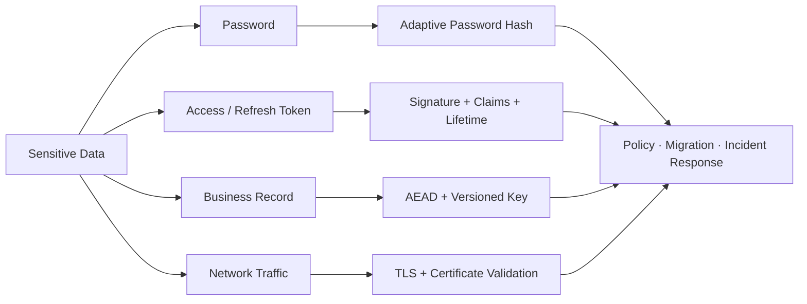

이 글은 2026년 8월 기준 최신 공개판인 OWASP Top 10:2025 A04 Cryptographic Failures를 바탕으로 Java 21·Spring Boot 3 환경의 합성 예제를 설명합니다. 실제 Key, Token, 고객 데이터, 내부 Domain과 운영 설정은 사용하지 않습니다.

## 1. 먼저 보호 목표를 구분한다

암호 기술은 목적에 따라 달라집니다.

- **기밀성** — 허가받지 않은 주체가 내용을 읽지 못하게 하며, 대표 수단은 Encryption입니다.
- **무결성** — 내용이 변경됐음을 탐지하며, MAC·AEAD·Signature를 사용합니다.
- **인증** — 메시지나 Artifact의 발신자를 검증하며, Signature·Certificate를 사용합니다.
- **Password 검증** — 원문을 복구하지 않고 일치 여부를 확인하며, Adaptive Password Hash를 사용합니다.
- **전송 보호** — Network 도청·변조·위장을 막으며, TLS·mTLS를 사용합니다.
- **재사용 방지** — 캡처된 Token·Nonce를 다시 쓰지 못하게 하며, Expiration·Single Use·Replay State를 사용합니다.

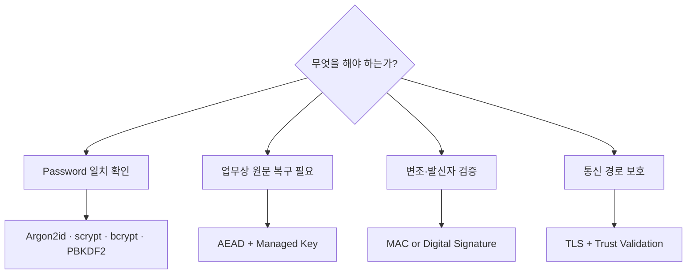

Password처럼 복구할 필요가 없는 값은 Hash하고, 업무상 원문 복구가 필요한 개인정보는 암호화합니다. JWT의 Signature는 Payload를 숨기지 않으므로 기밀정보를 넣지 않습니다. HTTPS는 전송 구간을 보호하지만 Database Dump와 Backup의 평문까지 보호하지 않습니다.

## 2. A04는 Algorithm보다 Key·Randomness·오류 처리까지 본다

OWASP A04:2025는 암호화 부재, 약한 Algorithm, Key 노출뿐 아니라 예측 가능한 난수, Key 재사용, Rotation 부재, 인증서 검증 실패, IV 재사용, ECB 같은 부적절한 Mode와 Cryptographic Oracle도 대표 위험으로 제시합니다.

검토 순서는 다음과 같이 잡을 수 있습니다.

1. 어떤 데이터가 민감한지 분류합니다.
2. 저장·전송·처리 중 어느 상태에서 보호해야 하는지 정합니다.
3. 기밀성, 무결성, 인증과 재사용 방지 중 필요한 목표를 정합니다.
4. 검증된 Library와 조직 표준 Algorithm·Parameter를 선택합니다.
5. Key 생성·배포·사용·Rotation·폐기와 복구 절차를 설계합니다.
6. 실패 시 외부 응답은 단순화하고 내부 Telemetry를 남깁니다.
7. 배포 Gate와 운영 점검으로 실제 적용 상태를 증명합니다.

직접 만든 Cipher, Encoding을 Encryption이라고 부르는 구현, 고정 Seed 난수와 `trustAll` 인증서 검증은 Review에서 즉시 차단합니다.

## 3. Password는 암호화하지 않고 느리게 Hash한다

Password를 복호화할 수 있게 저장하면 Application Key가 노출되는 순간 모든 Password 원문이 함께 노출됩니다. 신규 시스템은 Argon2id를 우선하고, 사용할 수 없으면 scrypt를 검토합니다. bcrypt는 Argon2id·scrypt를 적용하기 어려운 Legacy 시스템에서만 제한적으로 유지하고, FIPS-140 준수가 필요하면 승인된 PBKDF2 구현과 Parameter를 선택합니다.

```text
피해야 할 방식
SHA-256(password)
SHA-256(globalSalt + password)
AES-Encrypt(password, applicationKey)

권장 구조
algorithm(parameters, uniqueSalt, password) -> encoded hash
```

Salt는 사용자마다 달라야 하며 검증된 Password Encoder가 생성·저장하게 둡니다. Salt는 비밀이 아닙니다. Pepper를 추가한다면 Password Database와 분리된 Secret Manager 또는 HSM에 보관하고, Pepper 손상·Rotation 시 사용자 Password 재설정 또는 Version 전환 전략을 미리 마련해야 합니다.

OWASP Password Storage Cheat Sheet는 신규 시스템에서 Argon2id를 우선 권고하고, 환경에 맞춰 Memory·Iteration·Parallelism을 조정하도록 안내합니다. Parameter는 문서의 최소값을 복사하는 데서 끝내지 않고 실제 인증 Server의 지연, 동시 로그인 수와 자원 고갈 위험을 측정해 정합니다.

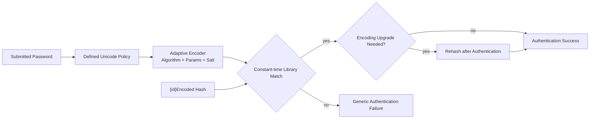

### Spring Security의 Versioned Password Encoder

```java
@Configuration
class PasswordEncodingConfig {

    @Bean
    PasswordEncoder passwordEncoder() {
        Map<String, PasswordEncoder> encoders = new HashMap<>();
        encoders.put("argon2id",
            new Argon2PasswordEncoder(
                16,     // salt length
                32,     // hash length
                1,      // parallelism
                19_456, // memory KiB: 배포 환경에서 재측정
                2));    // iterations: 배포 환경에서 재측정
        encoders.put("bcrypt", new BCryptPasswordEncoder(12));

        return new DelegatingPasswordEncoder("argon2id", encoders);
    }
}
```

저장 형식은 `{argon2id}...`, `{bcrypt}...`처럼 Algorithm ID를 포함합니다. Algorithm을 숨기는 것이 보안 목표가 아니며, ID가 있어야 기존 Hash를 검증하면서 신규 Password부터 더 강한 방식으로 전환할 수 있습니다.

Migration 중에는 아직 검증해야 하는 모든 Legacy ID의 Encoder를 Map에 명시적으로 등록합니다. 알 수 없는 ID나 Prefix 없는 Hash를 `noop` 같은 약한 방식으로 자동 처리하지 말고, 사전에 분류·변환하거나 인증을 안전하게 실패시킵니다.

Spring Security 6의 `Argon2PasswordEncoder`는 Bouncy Castle을 필요로 합니다. 따라서 해당 Provider Dependency를 명시적으로 고정하고 SBOM·취약점·무결성 검증 대상에 포함합니다. FIPS 같은 규제 요구가 있다면 승인된 Provider와 PBKDF2 Parameter 등 해당 기준을 별도로 확인합니다.

### 로그인 성공 시 점진적으로 Migration한다

```java
@Transactional
public boolean verifyAndUpgrade(
        UserAccount account,
        CharSequence submittedPassword) {

    String stored = account.passwordHash();
    if (!passwordEncoder.matches(submittedPassword, stored)) {
        return false;
    }

    if (passwordEncoder.upgradeEncoding(stored)) {
        String upgraded = passwordEncoder.encode(submittedPassword);
        accountRepository.replaceHashIfUnchanged(
            account.id(), stored, upgraded);
    }

    return true;
}
```

`replaceHashIfUnchanged`는 동시 로그인에서 최근 Hash를 오래된 값으로 덮어쓰지 않는 Compare-and-set Update입니다. Password 원문·Hash·Salt·Pepper를 Log, Trace, Event나 오류 응답에 남기지 않습니다.

## 4. Password 정책과 Hash 정책을 혼동하지 않는다

강한 Hash는 약한 Password 선택과 Credential Stuffing을 막지 못합니다. Password 생성·변경 시에는 알려진 유출 Password Blocklist와 길이 정책을 적용하고 MFA, Rate Limit과 이상 로그인 탐지를 함께 사용합니다.

NIST SP 800-63B-4는 Password를 설정하거나 변경할 때 흔하거나 유출된 값과 비교하도록 요구합니다. 근거 없는 주기적 사용자 Password 변경은 오히려 예측 가능한 변형을 만들 수 있으므로, 침해 증거가 있을 때 변경을 강제하고 Hash Algorithm·Work Factor의 기술적 Upgrade는 별도로 수행합니다.

- 사용자가 Password Manager를 쓸 수 있도록 Paste를 막지 않습니다.
- 불필요한 조합 규칙보다 충분한 길이와 Blocklist를 우선합니다.
- Unicode를 허용한다면 Registration과 Login에서 동일한 정규화 정책을 적용합니다.
- Error Message로 계정 존재 여부를 드러내지 않습니다.
- Hash 검증 비용을 악용한 DoS를 Rate Limit과 자원 격리로 제한합니다.

## 5. JWT Signature는 암호화가 아니다

일반적인 JWS JWT의 Header와 Payload는 Base64url Encoding일 뿐 누구나 읽을 수 있습니다. Password, 주민 식별정보, API Key와 업무 Secret을 Payload에 넣지 않습니다.

먼저 Token 종류와 암호 경계를 검증합니다.

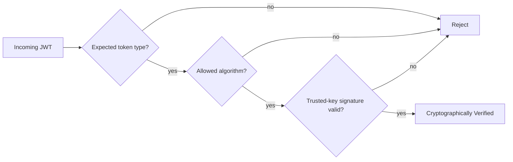

그 다음 Claim과 업무 권한을 검증합니다.

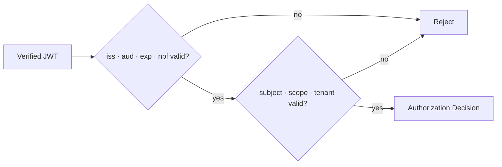

RFC 8725 JWT Best Current Practices는 Algorithm을 명시적으로 검증하고, 서로 다른 JWT 종류에 배타적인 Validation Rule을 적용하며, Audience와 Issuer를 검증하도록 안내합니다.

### Spring Security Resource Server 검증 예제

```java
@Bean
JwtDecoder jwtDecoder(SecurityProperties properties) {
    NimbusJwtDecoder decoder = NimbusJwtDecoder
        .withJwkSetUri(properties.jwkSetUri())
        .jwsAlgorithm(SignatureAlgorithm.RS256)
        .build();

    OAuth2TokenValidator<Jwt> standard =
        JwtValidators.createDefaultWithIssuer(properties.issuer());

    OAuth2TokenValidator<Jwt> audience = new JwtClaimValidator<>(
        JwtClaimNames.AUD,
        audiences -> audiences != null
            && audiences.contains(properties.requiredAudience()));

    decoder.setJwtValidator(
        new DelegatingOAuth2TokenValidator<>(standard, audience));

    return decoder;
}
```

`issuer`, `jwkSetUri`, `requiredAudience`는 운영자가 관리하는 검증된 설정에서 읽습니다. Token Header의 `jku`나 임의 URL을 따라 Key를 가져오지 않습니다. `kid`는 신뢰한 Issuer의 JWK Set 안에서만 Key Version을 찾는 Hint로 사용하며 SQL, 파일 경로나 외부 URL에 직접 연결하지 않습니다.

Signature 검증 후에도 Endpoint별 Scope, Role, Tenant와 Resource 소유권을 Server에서 확인해야 합니다. JWT Claim은 인가 입력이지 인가 자체가 아닙니다.

## 6. Access Token과 Refresh Token의 수명주기를 분리한다

Access Token은 짧게 유지하고, Refresh Token은 더 강하게 보호하며 한 번 사용한 값의 재사용을 탐지합니다. Browser에서는 업무 요구를 검토해 Secure·HttpOnly·SameSite Cookie 또는 적절한 BFF 구조를 사용하고, JavaScript가 접근 가능한 장기 Token 저장을 피합니다.

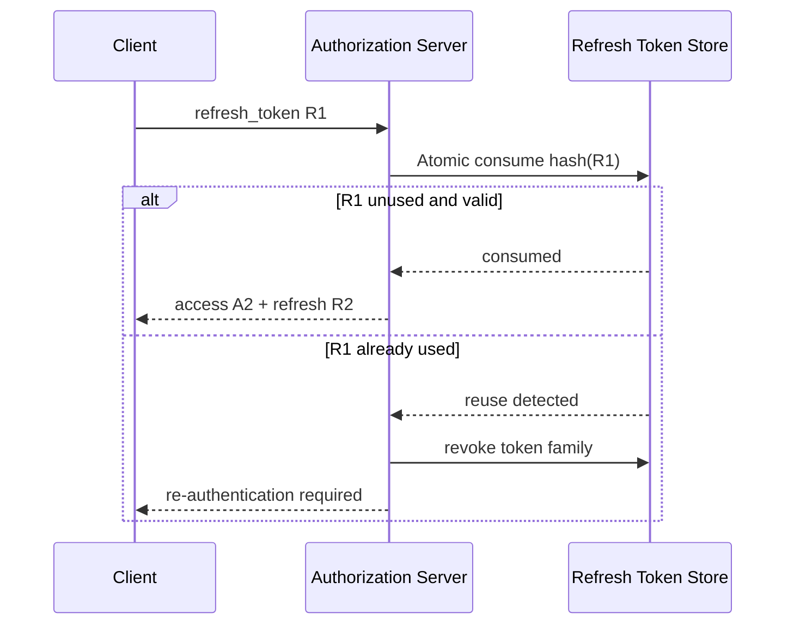

고Entropy의 Opaque Refresh Token은 원문 대신 Digest를 저장할 수 있습니다. Password와 달리 Server가 생성한 256-bit Random Token은 추측 공간이 충분하므로 SHA-256 Digest로 조회해도 됩니다. 이 판단을 사람이 선택한 Password에 그대로 적용하면 안 됩니다.

```java
final class SecureTokenGenerator {
    private static final SecureRandom RANDOM = new SecureRandom();

    String newToken() {
        byte[] bytes = new byte[32];
        RANDOM.nextBytes(bytes);
        return Base64.getUrlEncoder()
            .withoutPadding()
            .encodeToString(bytes);
    }
}
```

Refresh Rotation은 다음 조건을 만족해야 합니다.

- 소비 처리는 Transaction과 조건부 Update로 원자적이어야 합니다.
- 이전 Token 재사용을 발견하면 같은 Family를 폐기합니다.
- Access·Refresh Token을 URL Query, Log와 Analytics에 남기지 않습니다.
- Logout, Password 변경, 계정 잠금과 침해 대응 시 폐기 범위를 정합니다.
- Clock Skew를 제한하고 Expiration·Not-before 경계 Test를 만듭니다.

## 7. 업무 데이터는 AEAD로 기밀성과 무결성을 함께 보호한다

암호문을 공격자가 바꿀 수 있다면 기밀성만으로는 충분하지 않습니다. 가능하면 AES-GCM이나 ChaCha20-Poly1305 같은 검증된 AEAD를 사용해 Encryption과 Integrity를 함께 제공합니다.

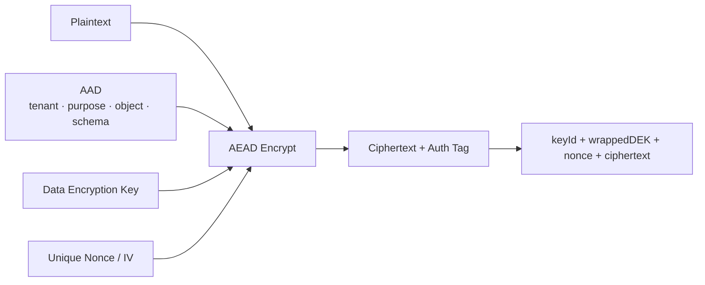

### Java 21 AES-GCM 예제

```java
public record EncryptedValue(
        String keyId,
        byte[] iv,
        byte[] ciphertext) {

    public EncryptedValue {
        iv = iv.clone();
        ciphertext = ciphertext.clone();
    }

    @Override
    public byte[] iv() {
        return iv.clone();
    }

    @Override
    public byte[] ciphertext() {
        return ciphertext.clone();
    }
}

public final class AesGcmService {
    private static final int IV_BYTES = 12;
    private static final int TAG_BITS = 128;
    private final SecureRandom random = new SecureRandom();
    private final VersionedKeyProvider keyProvider;

    public AesGcmService(VersionedKeyProvider keyProvider) {
        this.keyProvider = keyProvider;
    }

    public EncryptedValue encrypt(byte[] plaintext, byte[] aad)
            throws GeneralSecurityException {

        KeyVersion current = keyProvider.currentForEncryption("profile-pii");
        byte[] iv = new byte[IV_BYTES];
        random.nextBytes(iv);

        Cipher cipher = Cipher.getInstance("AES/GCM/NoPadding");
        cipher.init(
            Cipher.ENCRYPT_MODE,
            current.secretKey(),
            new GCMParameterSpec(TAG_BITS, iv));
        cipher.updateAAD(aad);

        return new EncryptedValue(
            current.keyId(),
            iv,
            cipher.doFinal(plaintext));
    }

    public byte[] decrypt(EncryptedValue value, byte[] aad)
            throws GeneralSecurityException {

        SecretKey key = keyProvider.forDecryption(value.keyId());
        Cipher cipher = Cipher.getInstance("AES/GCM/NoPadding");
        cipher.init(
            Cipher.DECRYPT_MODE,
            key,
            new GCMParameterSpec(TAG_BITS, value.iv()));
        cipher.updateAAD(aad);
        return cipher.doFinal(value.ciphertext());
    }
}
```

Oracle Java 21 JCA 문서는 GCM에서 같은 Key와 IV 조합을 재사용하지 말고, AAD가 있다면 `updateAAD`를 Encryption·Decryption 양쪽에서 `doFinal` 전에 동일하게 제공해야 한다고 설명합니다.

이 예제는 핵심 API 흐름을 보여줍니다. 실제 운영에서는 가능한 경우 KMS·HSM의 Key Handle이나 Envelope Encryption을 사용해 장기 Master Key 원문이 Application Memory로 나오지 않게 합니다. `VersionedKeyProvider`는 승인된 Purpose와 Key ID만 허용하고 Cache 수명, 접근 감사와 장애 정책을 구현해야 합니다.

### AAD로 암호문의 Context를 묶는다

AAD는 암호화되지는 않지만 Authentication Tag에 포함됩니다. 다음처럼 Context를 Canonical Encoding해 다른 Tenant나 Field로 암호문을 옮기는 공격을 탐지할 수 있습니다.

```text
aad = canonical(
  tenantId,
  objectType,
  objectId,
  fieldName,
  schemaVersion
)
```

문자열을 구분자 하나로 단순 결합하면 모호성이 생길 수 있습니다. 길이 Prefix, 안정된 JSON Canonicalization 또는 명확한 Binary Schema를 사용하고 Golden Vector로 Java·다른 Platform의 Byte가 같은지 검증합니다.

## 8. Key를 데이터와 같은 곳에 평문으로 두지 않는다

Database Column을 암호화했는데 같은 Database, 같은 Backup 또는 같은 Container Image에 Key를 평문으로 저장하면 공격자가 둘을 함께 가져갈 수 있습니다.

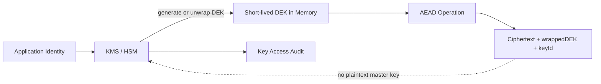

Key마다 다음 Metadata를 관리합니다.

- **`keyId`, `version`** — 어떤 Key로 처리했는지 식별합니다.
- **`purpose`** — Encryption, MAC, Signing 등으로 용도를 제한합니다.
- **`algorithm`, `parameters`** — Crypto Agility와 검증 기준을 기록합니다.
- **`status`** — Pre-active, Active, Decrypt-only, Revoked, Destroyed 상태를 관리합니다.
- **`notBefore`, `notAfter`** — Key를 사용할 수 있는 기간을 제한합니다.
- **`owner`** — 승인과 사고 대응 책임을 지정합니다.
- **`createdAt`, `rotationDueAt`** — 생성 시각과 Rotation 예정 시각을 관리합니다.
- **`compromiseState`** — 의심·확정 침해 상태와 대응을 기록합니다.

한 Key를 Encryption, JWT Signing, HMAC과 Backup에 공용으로 사용하지 않습니다. 환경·Tenant·Purpose별 Blast Radius를 고려해 분리하되 Key 수가 운영 불가능할 정도로 늘어나지 않도록 중앙 Inventory와 자동화를 갖춥니다.

## 9. Rotation은 새 Key 생성이 아니라 데이터 전환 과정이다

Key를 새로 만들기만 하고 Application이 이전 Ciphertext를 읽지 못하면 장애가 됩니다. 반대로 모든 Version을 영원히 Active로 두면 침해된 Key를 폐기할 수 없습니다.

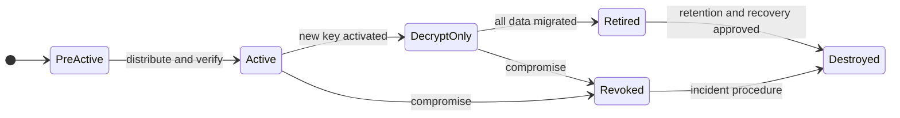

안전한 Gradual Rotation 흐름은 다음과 같습니다.

1. 새 Key Version을 생성하고 필요한 Runtime에 읽기 권한을 배포합니다.
2. 새 Write는 새 Version으로만 암호화합니다.
3. Read는 Record의 `keyId`를 보고 승인된 이전 Version도 복호화합니다.
4. 복호화에 성공한 이전 Record는 Transaction 또는 Batch에서 새 Version으로 재암호화합니다.
5. Migration Coverage와 Backup·Replica 상태를 대조합니다.
6. 이전 Key를 Decrypt-only, Retired, Revoked 순으로 전환합니다.
7. 복구·법적 보존 요구를 검토한 뒤 안전하게 파기합니다.

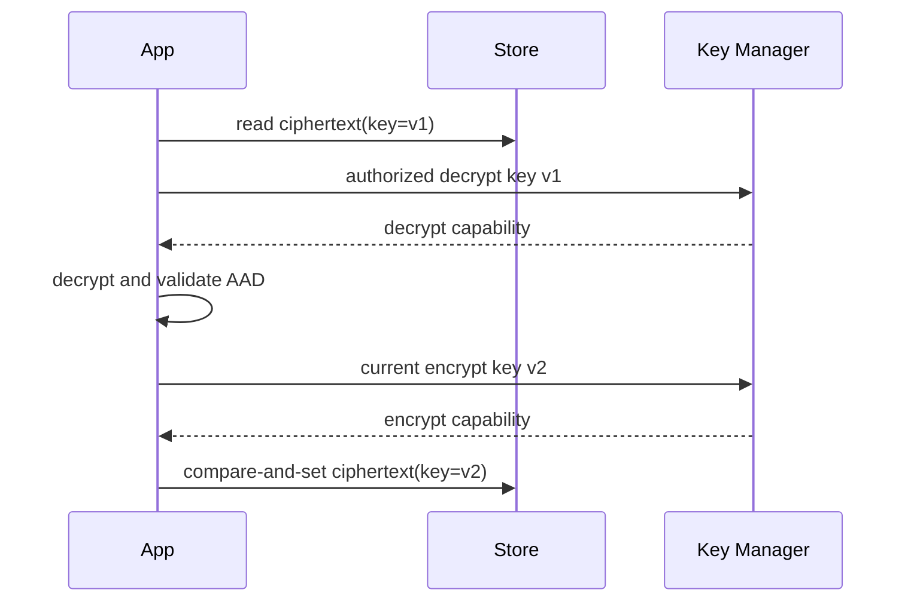

침해 대응 Rotation은 예약 Rotation보다 빠르게 진행해야 합니다. Key를 폐기하기 전에 영향 데이터, Token, Backup과 Downstream Consumer를 식별하고, 공격자가 가진 Ciphertext·Signature를 어떻게 무효화할지 결정합니다.

## 10. 복호화 실패를 Oracle로 만들지 않는다

`잘못된 Padding`, `Key Version 없음`, `Authentication Tag 불일치` 같은 상세 차이를 외부 응답과 처리 시간으로 노출하면 공격자가 암호문 구조와 Validity를 반복 탐색할 수 있습니다.

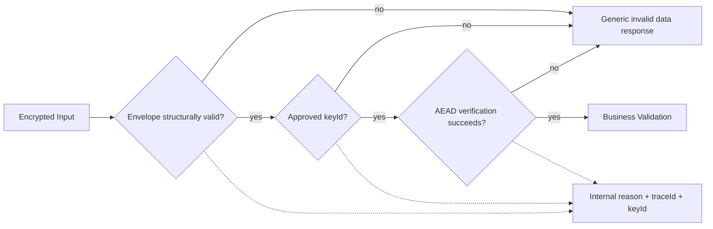

- Client에는 동일 계열의 안전한 오류를 반환합니다.
- 내부 Log에는 Secret, Plaintext, 전체 Ciphertext 없이 Reason Code와 Trace ID를 남깁니다.
- 실패 횟수, Key ID 분포와 Caller를 집계해 공격과 설정 오류를 구분합니다.
- Unknown Key ID를 외부 KMS 경로나 파일명에 직접 연결하지 않습니다.
- 복호화 실패 시 Plaintext 기본값으로 처리하거나 인가를 우회하지 않습니다.

## 11. TLS 검증을 끄면 Encryption은 위장에 불과하다

TLS Client가 모든 Certificate를 신뢰하거나 Hostname 검증을 끄면 공격자의 Certificate와도 암호화된 연결을 맺을 수 있습니다.

```java
// 피해야 할 예: 인증서를 전부 신뢰하거나 Hostname 검증을 끄는 코드
TrustManager[] trustAll = { /* X509TrustManager that accepts everything */ };
HostnameVerifier allowEveryHost = (hostname, session) -> true;
```

이런 코드는 Test Utility에도 남기지 않는 편이 안전합니다. Test에서는 전용 CA와 Test Certificate를 만들고 정상적인 TrustStore 검증 경로를 사용합니다.

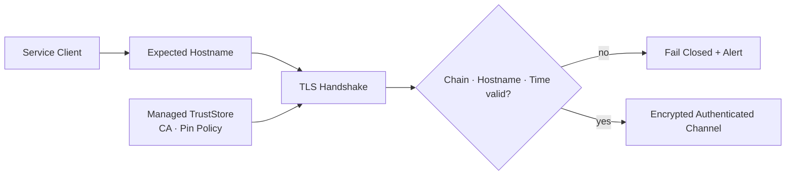

Server-to-server mTLS를 사용한다면 Client Certificate의 발급, Workload Identity, 만료, Rotation과 폐기도 Key 수명주기에 포함합니다. 인증서 만료를 장애 직전에 발견하지 않도록 남은 수명과 Rotation 성공 여부를 Monitoring합니다.

## 12. Crypto Agility는 임의 Algorithm 선택 기능이 아니다

Algorithm과 Key Version을 데이터에 기록하면 Migration이 쉬워지지만, 요청이 보낸 Algorithm 이름을 그대로 `Cipher.getInstance()`에 전달하면 Downgrade와 예상하지 못한 Provider 동작을 허용할 수 있습니다.

```java
enum EncryptionSuite {
    AES_256_GCM_V1("AES/GCM/NoPadding", 128);

    final String transformation;
    final int tagBits;

    EncryptionSuite(String transformation, int tagBits) {
        this.transformation = transformation;
        this.tagBits = tagBits;
    }
}

EncryptionSuite requireAllowedSuite(String storedSuite) {
    try {
        return EncryptionSuite.valueOf(storedSuite);
    } catch (IllegalArgumentException ex) {
        throw new InvalidEncryptedDataException();
    }
}
```

Crypto Agility는 조직이 승인한 작은 Allowlist 안에서 Version을 전환할 수 있는 능력입니다. 신규 Write, 기존 Read, Migration 완료와 폐기 조건을 별도로 관리합니다.

## 13. Test와 배포 Gate로 암호 정책을 증명한다

Happy Path Encryption·Decryption Test만으로는 안전성을 확인할 수 없습니다.

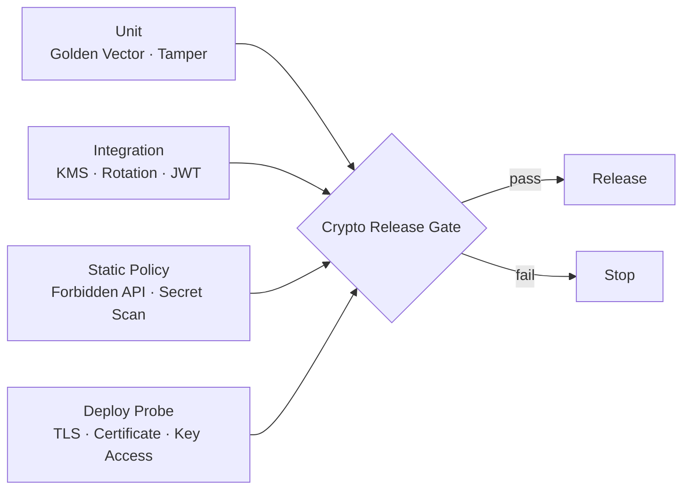

### 필수 Negative Test

- Password Hash에 `{noop}`, 빠른 Hash 또는 알 수 없는 ID가 들어오면 실패하는가?
- 이전 Algorithm Hash는 검증 후 신규 Algorithm으로 Upgrade되는가?
- JWT의 `alg=none`, 다른 Algorithm, 다른 Issuer·Audience와 만료 Token이 거부되는가?
- Refresh Token을 두 번 사용하면 Token Family가 폐기되는가?
- AES-GCM Ciphertext, Tag, IV 또는 AAD 한 Byte를 바꾸면 복호화가 실패하는가?
- 알 수 없거나 Revoked된 `keyId`가 거부되는가?
- Rotation 중 신규 Write는 새 Key만 사용하고 이전 Ciphertext는 계속 읽히는가?
- KMS Timeout, Key Access Denied와 Metadata 오류에서 Fail Closed하는가?
- 만료·Hostname 불일치·신뢰하지 않는 Certificate가 거부되는가?
- 오류 응답과 Log에 Plaintext, Password, Token과 Key Material이 없는가?

### 정적·운영 검사

- Source, History, Image, IaC와 Log의 Secret Scan
- `MD5`, `SHA-1`, `DES`, `ECB`, 고정 IV와 `trustAll` 패턴 탐지
- 승인되지 않은 JCA Provider·Algorithm·Parameter 차단
- Key 접근·복호화 실패·JWT Validation 실패의 추세 경보
- Key별 사용량, 마지막 사용 시각과 Rotation Coverage 대조
- Certificate와 Signing Key 만료 사전 경보
- Backup Restore 후 필요한 Key Version 접근 Test

## 14. 침해 대응은 Key 종류마다 달라야 한다

먼저 침해 대상을 식별하고 확산을 차단합니다.

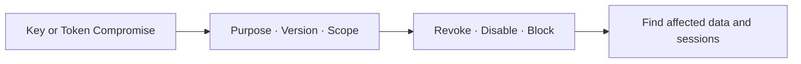

그 다음 새 자격 증명으로 전환하고 복구 범위를 검증합니다.

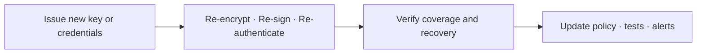

- Password Hash Database 유출: Offline Crack 위험을 평가하고 사용자 통지·Reset, Session 폐기와 Work Factor Upgrade를 진행합니다.
- Password Pepper 유출: Database와 Pepper가 함께 노출됐는지 평가하고 사용자 재설정 전략을 실행합니다.
- JWT Signing Key 유출: 해당 Key ID를 폐기하고 Token 수명과 발급 시점을 기준으로 Session·Token을 무효화합니다.
- Data Encryption Key 유출: 영향 Record를 찾아 새 Key로 재암호화하고 이전 Key를 폐기합니다.
- Key Encryption Key 유출: Wrapping된 DEK의 노출 범위를 평가하고 Rewrap 또는 전체 재암호화를 결정합니다.
- TLS Private Key 유출: Certificate 교체·폐기와 Traffic·인증 Log 조사를 수행합니다.

Key 삭제는 복구 불가능한 작업일 수 있습니다. 정확한 대상, Backup·법적 보존·복구 요구를 검증하고 승인된 절차로 파기합니다.

## 15. 실무 체크리스트

### Password

- [ ] Password는 평문이나 복호화 가능한 형태로 저장하지 않는다.
- [ ] 신규 시스템은 Argon2id를 우선하고, 불가하면 scrypt를 검토하며 bcrypt는 Legacy 용도로 제한한다.
- [ ] FIPS 요구가 있으면 승인된 PBKDF2 구현·Parameter와 Crypto Provider를 확인한다.
- [ ] 사용자별 Salt를 검증된 Encoder가 관리한다.
- [ ] Work Factor를 실제 Hardware와 동시성 기준으로 측정한다.
- [ ] Algorithm ID와 Parameter를 저장해 점진 Upgrade가 가능하다.
- [ ] 유출 Password Blocklist와 MFA·Rate Limit을 함께 적용한다.
- [ ] Password·Hash·Salt·Pepper를 Log나 Event에 남기지 않는다.

### Token

- [ ] JWS Payload를 암호화된 정보로 오해하지 않는다.
- [ ] 허용 Algorithm, Signature, Issuer, Audience와 시간을 검증한다.
- [ ] Token 종류별 배타적인 Validation Rule이 있다.
- [ ] `kid`와 Key URL을 신뢰된 Issuer 경계 안에서만 처리한다.
- [ ] Access Token은 짧고 Refresh Token은 Rotation·Reuse Detection을 적용한다.
- [ ] Scope·Tenant·Resource 인가는 Server에서 다시 확인한다.
- [ ] Token을 URL, Log, Analytics와 안전하지 않은 Storage에 노출하지 않는다.

### Encryption·Key

- [ ] 민감 데이터와 필요한 보호 상태를 분류했다.
- [ ] 검증된 AEAD와 승인된 Algorithm·Parameter를 사용한다.
- [ ] AES-GCM의 Key·IV 조합을 절대 재사용하지 않는다.
- [ ] AAD가 Tenant·Object·Purpose Context를 Canonical Byte로 묶는다.
- [ ] Key는 Source·Image·Database와 Backup에 평문으로 함께 두지 않는다.
- [ ] Key ID·Purpose·Version·Status·수명과 Owner를 관리한다.
- [ ] 신규 Write와 기존 Read를 분리한 Rotation 절차가 있다.
- [ ] Revocation·Migration·Backup Restore와 안전한 파기를 Test한다.

### 통신·오류·운영

- [ ] TLS Certificate Chain, Hostname과 유효기간을 검증한다.
- [ ] `trustAll`과 Hostname Verification 우회 코드가 없다.
- [ ] 복호화 상세 실패를 외부에 노출하지 않는다.
- [ ] Crypto 실패에서 평문 기본값이나 인가 우회로 Fail Open하지 않는다.
- [ ] Secret Scan과 금지 Algorithm·API 정적 검사가 배포를 차단한다.
- [ ] Key 접근, Token 검증과 복호화 실패를 탐지·경보한다.
- [ ] Key·Token 종류별 침해 대응 Playbook을 훈련한다.

## 마무리

Cryptographic Failures를 막는 핵심은 강한 Algorithm 이름이 아니라 **보호 목적, 검증된 구현과 Key 수명주기를 하나의 운영 가능한 계약으로 만드는 것**입니다.

Password는 느린 Adaptive Hash로 검증하고, JWT는 Signature뿐 아니라 Algorithm·Issuer·Audience·시간·업무 Context까지 확인합니다. 복구가 필요한 데이터는 AEAD와 Versioned Key로 보호하고, Key는 중앙에서 최소 권한으로 생성·배포·Rotation·폐기합니다. TLS와 암호 오류도 같은 Fail Closed 원칙으로 다룹니다.

가장 실용적인 기준은 다음과 같습니다.

> 암호화를 사용했는가가 아니라, 이 데이터의 보호 목표와 Key 수명주기를 실패 상황에서도 증명할 수 있는가?

다음 글에서는 OWASP Top 10:2025 A05 Injection을 기준으로 SQL·NoSQL·Command·Template Injection을 Source와 Sink 관점에서 심화합니다.

## 공식 참고 자료

- [OWASP Top 10:2025 — A04 Cryptographic Failures](https://owasp.org/Top10/2025/A04_2025-Cryptographic_Failures/)
- [OWASP Password Storage Cheat Sheet](https://cheatsheetseries.owasp.org/cheatsheets/Password_Storage_Cheat_Sheet.html)
- [OWASP Cryptographic Storage Cheat Sheet](https://cheatsheetseries.owasp.org/cheatsheets/Cryptographic_Storage_Cheat_Sheet.html)
- [OWASP Key Management Cheat Sheet](https://cheatsheetseries.owasp.org/cheatsheets/Key_Management_Cheat_Sheet.html)
- [OWASP Secrets Management Cheat Sheet](https://cheatsheetseries.owasp.org/cheatsheets/Secrets_Management_Cheat_Sheet.html)
- [RFC 8725 — JSON Web Token Best Current Practices](https://datatracker.ietf.org/doc/rfc8725/)
- [NIST SP 800-63B-4 — Authentication and Authenticator Management](https://pages.nist.gov/800-63-4/sp800-63b.html)
- [NIST SP 800-57 Part 1 Rev. 5 — Key Management](https://csrc.nist.gov/pubs/sp/800/57/pt1/r5/final)
- [Spring Security — Password Storage](https://docs.spring.io/spring-security/reference/features/authentication/password-storage.html)
- [Oracle Java 21 — JCA Reference Guide](https://docs.oracle.com/en/java/javase/21/security/java-cryptography-architecture-jca-reference-guide.html)
- [Oracle Java 21 — GCMParameterSpec](https://docs.oracle.com/en/java/javase/21/docs/api/java.base/javax/crypto/spec/GCMParameterSpec.html)
