# Injection Secure Coding 심화: SQL·NoSQL·Command·Template Injection

Injection은 특수문자 몇 개를 막는 문제가 아닙니다. 외부에서 온 Data가 Database, Shell, Template Engine 같은 Interpreter의 **구조나 명령으로 재해석되는 경로**가 생기면 발생합니다.

같은 입력도 어디에 도달하느냐에 따라 위험이 달라집니다.

- 검색어가 Prepared Statement의 값으로 Bind되면 SQL Data입니다.
- 같은 검색어가 Column 이름이나 `ORDER BY` 문자열에 연결되면 SQL 구조가 됩니다.
- JSON Object를 그대로 MongoDB Filter로 넘기면 Client가 Query Operator를 선택할 수 있습니다.
- 문자열 배열로 Process를 실행해도 공격자가 Option을 추가할 수 있으면 Argument Injection이 남습니다.
- 안전하게 저장한 고객명이 나중에 Template Source나 Expression으로 평가되면 Second-order Injection이 됩니다.

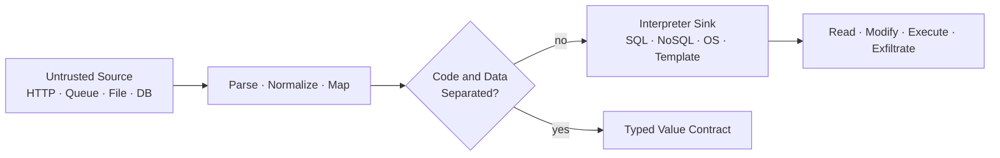

이 글은 2026년 8월 기준 OWASP Top 10:2025 A05 Injection을 바탕으로 Java 21·Spring Boot 3 환경의 합성 예제를 설명합니다. 실제 고객 데이터, 내부 Domain, 계정, 실행 파일 경로와 운영 Query는 사용하지 않습니다.

## 1. Source보다 Sink를 먼저 Inventory한다

HTTP Parameter만 공격 입력으로 보면 내부 Queue, Partner API, CSV, Cache와 Database에 저장된 값에서 시작하는 Injection을 놓칩니다. 먼저 Interpreter가 실행되는 Sink를 찾고 그 값이 어디에서 왔는지 역추적합니다.

- **SQL·JPQL** — Prepared Statement·Parameter Binding으로 값과 구조를 분리합니다. Table·Column·Sort Direction은 Server가 소유하는 구조 값으로 남습니다.
- **NoSQL** — Driver의 Typed Query Builder로 업무 값을 조립합니다. Operator·Field·Aggregation Stage는 외부 입력이 선택하지 못하게 합니다.
- **OS Process** — 가능하면 호출을 제거하고, 불가피하면 Argument List를 사용합니다. Executable·Option·Path·Environment는 고정하거나 Allowlist로 제한합니다.
- **Template** — 고정된 Trusted Template에 Escaped Model Data만 전달합니다. Template Name·Expression·Output Context는 별도 구조 경계로 관리합니다.

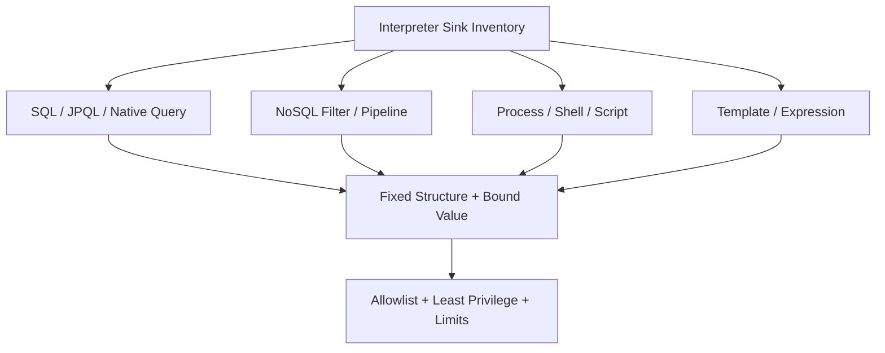

Review에서는 다음 질문을 반복합니다.

1. 이 값은 누가 만들었는가?
2. 중간 저장소를 거쳤더라도 신뢰 수준이 바뀌지 않았는가?
3. 최종 Sink는 어떤 문법과 권한으로 값을 해석하는가?
4. 값 Binding으로 분리할 수 없는 구조 요소는 작은 Allowlist로 변환했는가?
5. 우회되더라도 피해를 제한하는 권한·시간·자원 경계가 있는가?

## 2. Validation, Parameterization, Encoding의 역할을 섞지 않는다

세 방어는 대체 관계가 아닙니다.

- **Validation**은 업무에 허용된 값과 형식을 정의합니다.
- **Parameterization**은 Interpreter의 Code와 Data를 분리합니다.
- **Context-aware Encoding**은 HTML, JavaScript, URL처럼 출력 Context에 맞춰 Data를 표현합니다.

SQL Injection을 막기 위해 이름에서 `'`를 제거하면 정상 이름을 훼손하면서도 다른 Sink를 보호하지 못합니다. 반대로 Prepared Statement를 사용했다고 `ORDER BY` Column, Shell Option과 Template Name까지 안전해지지는 않습니다.

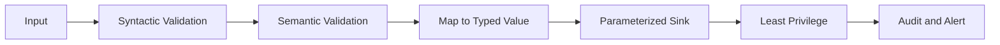

Escaping은 Interpreter와 Context별 규칙이 복잡해 변경에 취약하므로, 안전한 API와 Parameterization이 불가능한 잔여 지점에서만 사용합니다.

## 3. SQL은 값을 Bind하고 Query 구조를 고정한다

### 취약한 문자열 결합

```java
String sql = """
    select id, status, total_amount
      from orders
     where tenant_id = '%s'
       and customer_name = '%s'
    """.formatted(tenantId, customerName);

try (Statement statement = connection.createStatement();
     ResultSet rows = statement.executeQuery(sql)) {
    // ...
}
```

`tenantId`를 인증 Context에서 가져왔더라도 `customerName` 하나가 Query 구조를 바꿀 수 있습니다. 더구나 문자열로 Tenant 조건까지 만들면 인가 경계도 Injection에 함께 걸립니다.

### PreparedStatement로 Code와 Data를 분리한다

```java
String sql = """
    select id, status, total_amount
      from orders
     where tenant_id = ?
       and customer_name = ?
     order by created_at desc
     limit ?
    """;

try (PreparedStatement statement = connection.prepareStatement(sql)) {
    int limit = request.limit();
    if (limit < 1 || limit > 100) {
        throw new InvalidSearchLimitException();
    }

    statement.setObject(1, tenantContext.requiredTenantId());
    statement.setString(2, request.customerName());
    statement.setInt(3, limit);

    try (ResultSet rows = statement.executeQuery()) {
        // map rows
    }
}
```

이 합성 예제는 `LIMIT` 값 Binding을 지원하는 Database를 가정합니다. 사용하는 Dialect가 이를 지원하지 않으면 검증된 Query Builder나 Server가 소유한 고정 Query 변형을 사용하고, 제한값을 SQL 문자열에 직접 연결하지 않습니다.

Parameter는 값 위치에만 사용할 수 있습니다. Table, Column, Sort Direction 같은 SQL 구조를 Parameter로 바꾸려 하지 말고 Server가 소유한 Allowlist에서 안전한 상수로 변환합니다.

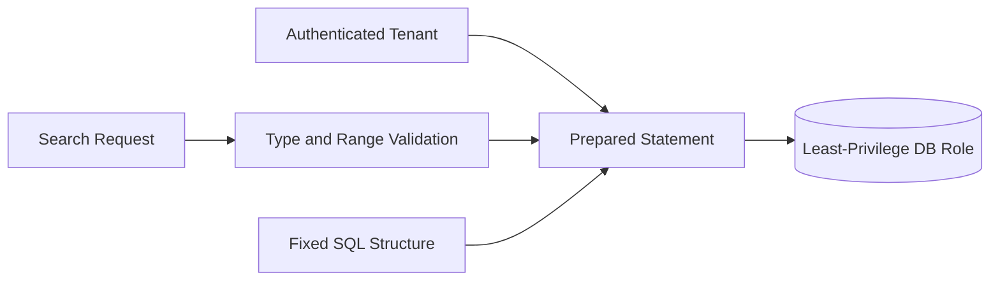

## 4. 동적 정렬·검색 조건은 Allowlist와 Typed Builder로 만든다

다음 구현은 값을 Bind해도 안전하지 않습니다.

```java
String sql = "select * from orders order by " + request.sortBy();
```

정렬 가능한 공개 API 값과 실제 Entity Field를 분리합니다.

```java
enum OrderSort {
    CREATED_AT("createdAt"),
    TOTAL_AMOUNT("totalAmount"),
    STATUS("status");

    private final String entityProperty;

    OrderSort(String entityProperty) {
        this.entityProperty = entityProperty;
    }

    String property() {
        return entityProperty;
    }

    static OrderSort fromApi(String value) {
        return switch (value) {
            case "createdAt" -> CREATED_AT;
            case "totalAmount" -> TOTAL_AMOUNT;
            case "status" -> STATUS;
            default -> throw new InvalidSortException();
        };
    }
}

Sort sort = Sort.by(
    request.ascending() ? Sort.Direction.ASC : Sort.Direction.DESC,
    OrderSort.fromApi(request.sortBy()).property());
```

Client가 보낸 Field를 Reflection으로 찾거나 Entity Property로 직접 전달하지 않습니다. 공개 Allowlist는 의도하지 않은 개인정보 Column, 연관관계 탐색과 비싼 Sort도 함께 막습니다.

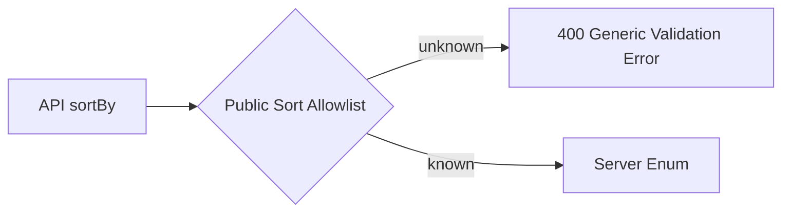

허용된 공개 값만 실제 Query 구조로 이어집니다.

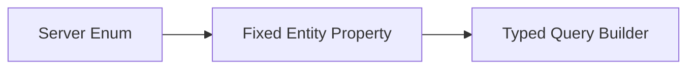

선택 조건이 많다면 SQL 문자열을 이어 붙이지 말고 Criteria API, QueryDSL 또는 검증된 Query Builder를 사용합니다. Builder를 사용해도 Raw Fragment API에 외부 입력을 넣으면 다시 취약해집니다.

## 5. JPA와 ORM이 자동으로 Injection을 막아주지는 않는다

Repository Method와 Named Parameter는 값 Binding을 명확하게 합니다.

```java
interface OrderRepository extends JpaRepository<OrderEntity, UUID> {

    @Query("""
        select o
          from OrderEntity o
         where o.tenantId = :tenantId
           and o.customerEmail = :email
        """)
    Optional<OrderEntity> findForTenant(
        @Param("tenantId") UUID tenantId,
        @Param("email") String email);
}
```

하지만 다음 HQL·JPQL 결합은 ORM을 사용해도 취약합니다.

```java
String jpql = "from OrderEntity o where o.customerEmail = '"
    + request.email() + "'";
entityManager.createQuery(jpql, OrderEntity.class).getResultList();
```

Stored Procedure도 내부에서 `EXECUTE IMMEDIATE`, `exec()`와 문자열 결합을 사용하면 Injection이 발생합니다. Framework 이름이 아니라 최종 Interpreter까지 Code와 Data가 분리됐는지 확인해야 합니다.

### LIKE의 Wildcard 의미도 별도로 통제한다

Parameter Binding은 SQL 문법 Injection을 막지만 `%`, `_`의 검색 Wildcard 의미까지 없애지는 않습니다. 사용자가 Pattern 검색을 요청한 것인지 Literal 부분 일치를 요청한 것인지 API 계약으로 구분합니다.

```java
static String escapeLikeLiteral(String value) {
    return value
        .replace("\\", "\\\\")
        .replace("%", "\\%")
        .replace("_", "\\_");
}
```

DB Dialect와 JPQL의 `ESCAPE` 절을 함께 지정하고 통합 Test로 실제 동작을 검증합니다. 직접 만든 범용 SQL Escape 함수로 Parameter Binding을 대체하지 않습니다.

## 6. Tenant 조건은 Client Query가 아니라 Server 인가 Context가 소유한다

검색 Filter가 안전하게 Parameterized됐더라도 Client가 `tenantId`를 바꿀 수 있으면 정보가 노출됩니다. Injection 방어와 Access Control을 같은 Query 경계에서 적용합니다.

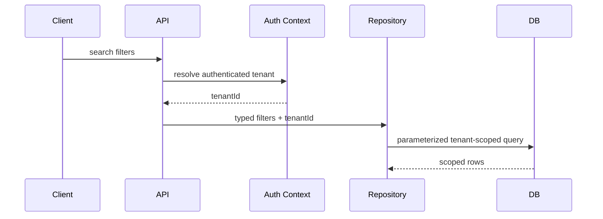

- Tenant ID는 Request Body나 Query Parameter보다 인증·인가 Context를 우선합니다.
- Repository의 기본 Query가 Tenant 조건을 빠뜨리지 않도록 공통 Scope를 강제합니다.
- Database Row-Level Security를 사용한다면 Transaction마다 안전한 Session Context를 설정하고 Pool 반환 시 초기화합니다.
- Export, Count, Exists, Bulk Update와 Background Job도 같은 Scope를 사용합니다.
- DB 계정은 필요한 Schema·Operation만 허용하고 DBA 권한으로 Application을 실행하지 않습니다.

## 7. NoSQL은 문자열이 없어도 Operator Injection이 발생한다

NoSQL Driver가 JSON Object를 받는다는 이유로 안전한 것은 아닙니다. Client가 보낸 Object를 Filter로 그대로 전달하면 `$ne`, `$regex`, `$where`, `$expr` 같은 Operator나 Aggregation Stage를 선택할 수 있습니다.

```java
// 피해야 할 구조: Client가 Query 문법을 소유한다.
Document filter = Document.parse(request.rawFilterJson());
return mongoTemplate.getCollection("accounts").find(filter);
```

API DTO는 업무 값만 받고 Server가 Query Object를 구성합니다.

```java
public record AccountSearchRequest(
        @NotBlank @Email String email,
        @NotNull AccountStatus status,
        @Min(1) @Max(100) int limit) {
}

Query query = new Query()
    .addCriteria(Criteria.where("tenantId")
        .is(tenantContext.requiredTenantId()))
    .addCriteria(Criteria.where("email").is(request.email()))
    .addCriteria(Criteria.where("status").is(request.status().name()))
    .limit(request.limit());

List<AccountDocument> accounts = mongoTemplate.find(
    query, AccountDocument.class, "accounts");
```

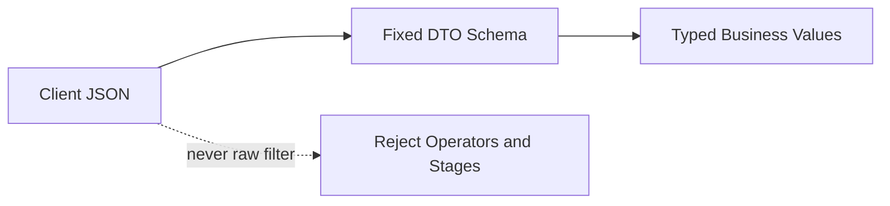

검증된 업무 값과 인증된 Tenant만 Server 소유 Query Builder에서 합쳐집니다.

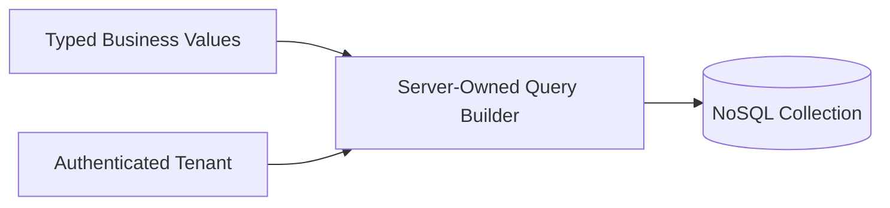

문자열 전체에서 `$`를 찾는 단순 필터만으로는 중첩 Object, Unicode 표현, Driver 변환과 새 Operator를 완전히 다루기 어렵습니다. 가장 안전한 기본값은 Raw Filter를 API 계약에서 제거하는 것입니다.

고급 검색이 꼭 필요하다면 다음과 같이 제한합니다.

- 공개 가능한 Field와 Operator를 Enum으로 정의합니다.
- 값 Type, 길이, 배열 크기와 Query 복잡도를 제한합니다.
- `$where`나 Server-side JavaScript 기능을 사용하지 않습니다.
- Regex는 Pattern 길이·기능·Timeout을 제한하고 ReDoS를 함께 검토합니다.
- Aggregation Stage, Join 유사 기능과 Projection을 Server Template로 고정합니다.
- Tenant Predicate는 Client Filter와 병합하지 말고 Server가 강제합니다.

## 8. OS Command는 호출하지 않는 것이 최우선 방어다

압축, 파일 복사, HTTP 호출과 이미지 변환을 위해 Shell Command부터 만들지 않습니다. Java Library나 전용 Service API가 있으면 Process 실행 자체를 제거합니다.

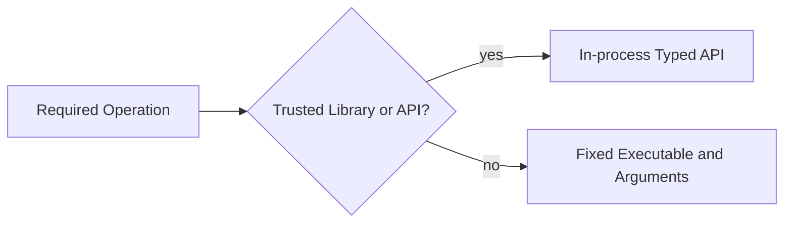

Process 실행이 불가피한 경로에는 별도의 자원·권한 경계를 적용합니다.

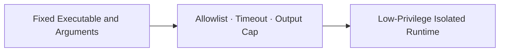

다음은 명백히 취약합니다.

```java
new ProcessBuilder(
    "sh",
    "-c",
    "report-renderer --name " + request.name())
    .start();
```

`sh -c`, `cmd /c`, PowerShell Expression처럼 Shell Parser를 명시적으로 호출하면 `;`, `|`, Redirect와 Command Substitution이 다시 문법이 됩니다.

## 9. ProcessBuilder도 고정 명령·검증된 Argument·자원 제한이 필요하다

Argument List는 Shell Tokenization을 피하는 데 도움이 되지만, 공격자가 `--output=/sensitive/path` 같은 Option을 추가할 수 있으면 Argument Injection이 남습니다.

```java
enum ExportFormat {
    PDF("pdf"), CSV("csv");

    private final String cliValue;

    ExportFormat(String cliValue) {
        this.cliValue = cliValue;
    }

    String cliValue() {
        return cliValue;
    }
}

Path executable = Path.of("/opt/app/bin/report-renderer");
Path workingDir = Path.of("/var/lib/app/render-jobs");
UUID jobId = UUID.randomUUID(); // Server가 생성한 식별자

List<String> command = List.of(
    executable.toString(),
    "--format", request.format().cliValue(),
    "--job-id", jobId.toString());

ProcessBuilder builder = new ProcessBuilder(command)
    .directory(workingDir.toFile())
    .redirectOutput(ProcessBuilder.Redirect.DISCARD)
    .redirectError(ProcessBuilder.Redirect.DISCARD);

builder.environment().clear();
builder.environment().put("LANG", "C.UTF-8");

Process process = builder.start();
process.getOutputStream().close(); // Child Process의 표준입력을 즉시 닫는다.
if (!process.waitFor(10, TimeUnit.SECONDS)) {
    process.destroyForcibly();
    // 운영 Runner는 descendants()와 OS 격리로 전체 Process Tree를 종료한다.
    throw new RenderTimeoutException();
}
if (process.exitValue() != 0) {
    throw new RenderFailedException();
}
```

실제 운영에서는 다음 조건도 확인합니다.

- Executable은 절대경로와 배포 Artifact Digest로 고정합니다.
- User가 실행 파일, Option 이름과 Working Directory를 선택하지 못하게 합니다.
- Path는 허용 Root 아래로 `normalize()`한 뒤 경계를 검증합니다.
- Environment는 상속을 최소화하고 Secret을 전달하지 않습니다.
- 표준 출력·오류를 무제한 Memory에 읽지 않고 크기와 보존 기간을 제한합니다.
- Process Tree 전체 종료, 동시 실행 수, CPU·Memory·파일 크기를 제한합니다.
- 전용 OS 계정·Container·Sandbox에서 최소 권한으로 실행합니다.

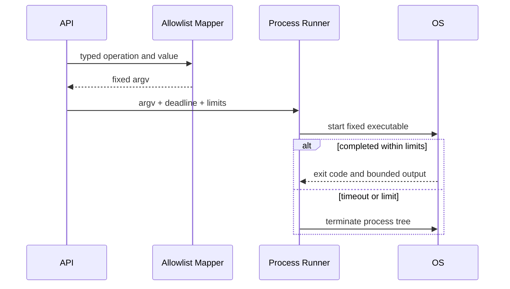

## 10. Template에서는 Template Code와 Model Data를 분리한다

Template Injection과 XSS는 겹칠 수 있지만 같은 문제는 아닙니다.

- **Server-side Template Injection**은 공격자 입력이 Template Source·Expression으로 평가되는 문제입니다.
- **XSS**는 결과 HTML·JavaScript Context에서 공격자 Data가 실행 가능한 Markup이나 Script가 되는 문제입니다.

Trusted Template은 배포 Artifact에 두고, 외부 입력은 Model Value로만 전달합니다.

```java
enum MailTemplate {
    ORDER_CONFIRMED("mail/order-confirmed"),
    PAYMENT_FAILED("mail/payment-failed");

    private final String templateName;

    MailTemplate(String templateName) {
        this.templateName = templateName;
    }

    String templateName() {
        return templateName;
    }
}

Context context = new Context(Locale.KOREAN);
context.setVariable("customerName", order.customerName());
context.setVariable("orderNumber", order.publicNumber());

String html = templateEngine.process(
    MailTemplate.ORDER_CONFIRMED.templateName(), context);
```

```html
<!-- 기본 Escape가 적용되는 출력 -->
<p th:text="|${customerName} 고객님의 주문입니다.|">주문 안내</p>
<span th:text="${orderNumber}">ORDER-0000</span>
```

피해야 할 구조는 다음과 같습니다.

```java
// 외부 입력을 Template 이름·본문·Expression으로 평가하지 않는다.
templateEngine.process(request.templateName(), context);
expressionParser.parseExpression(request.expression()).getValue(context);
```

`th:text`는 HTML Escape를 적용하지만 `th:utext`와 Unescaped Inlining은 결과를 그대로 출력합니다. HTML, JavaScript, CSS, URL은 서로 다른 출력 Context이므로 해당 Context의 안전한 기능을 사용합니다.

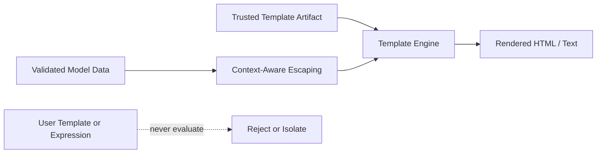

사용자 정의 Template가 업무상 꼭 필요하다면 일반 Application과 분리된 전용 Service에서 허용 문법, 객체 접근, Network·File·Process 권한, CPU·Memory·시간과 결과 크기를 제한합니다. Template Engine의 제한 모드는 Defense in Depth일 뿐 외부 Template 평가를 안전하게 만드는 단독 방어가 아닙니다.

## 11. Template 이름과 Fragment 선택도 구조 값이다

`../../secret`, 외부 URL, 임의 Fragment와 Expression이 Template Resolver로 들어가면 File 접근이나 Expression Injection 경로가 될 수 있습니다. 공개 API 값은 Enum을 거쳐 배포된 Template 이름으로만 변환합니다.

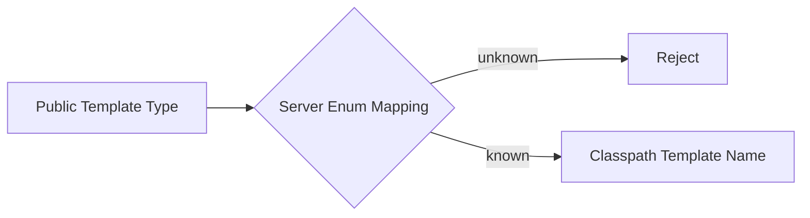

선택된 Classpath Template만 제한된 Resolver와 안전한 출력 단계로 전달합니다.

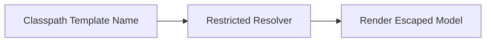

- Template Root와 Suffix를 고정합니다.
- File System·URL Resolver를 불필요하게 활성화하지 않습니다.
- Fragment 이름, Locale과 Theme도 작은 Allowlist로 제한합니다.
- Template Cache Key에 Tenant 입력을 그대로 쓰지 않습니다.
- Preview 기능도 운영 Renderer와 같은 권한으로 실행하지 않습니다.
- Model에 Request, Application Context, Class Loader 같은 강한 객체를 넣지 않습니다.

## 12. Second-order Injection은 저장 시점이 아니라 사용 시점에 터진다

입력이 Database에 정상 저장됐다는 사실은 신뢰 승격 근거가 아닙니다. 공격 문자열이 처음에는 일반 Data였다가 나중에 관리자 검색 Query, Batch Shell, Export Template이나 Log 분석 Expression에 들어갈 수 있습니다.

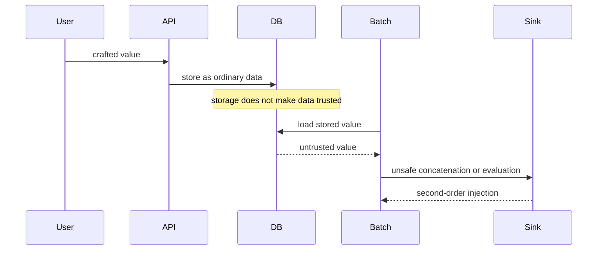

Sink 직전의 Code·Data 분리가 핵심입니다. 저장할 때 HTML Escape한 값을 SQL이나 Shell에 재사용하는 방식도 잘못입니다. Encoding은 최종 출력 Context에서 적용하고 원본과 표현 값을 혼동하지 않습니다.

## 13. 오류·Log·관측성도 Injection 경계를 유지한다

Database 오류, Command Line과 Template Stack Trace를 그대로 반환하면 Schema, Query, Path와 Engine 정보를 노출합니다.

- Client에는 안정된 오류 Code와 Trace ID만 반환합니다.
- SQL 원문과 Bind 값, 전체 NoSQL Filter, Command Argument와 Template Model을 Log에 함께 남기지 않습니다.
- 보안 Event의 Field 이름은 Server가 고정하고 값은 구조화 Logging API로 전달합니다.
- 거부된 Operator·Sort·Template Type은 원문 대신 분류된 Reason Code로 집계합니다.
- Injection 탐지 문자열 하나만으로 계정을 자동 차단하지 말고 Rate, Context와 성공 여부를 함께 봅니다.
- 오류가 발생해도 Tenant Scope나 인가를 제거한 Fallback Query로 전환하지 않습니다.

## 14. Test는 Payload 목록보다 불변식을 검증한다

공격 문자열 몇 개만 Test하면 새로운 Encoding, Nested JSON과 다른 Driver 경로를 놓칩니다. 다음 불변식을 자동화합니다.

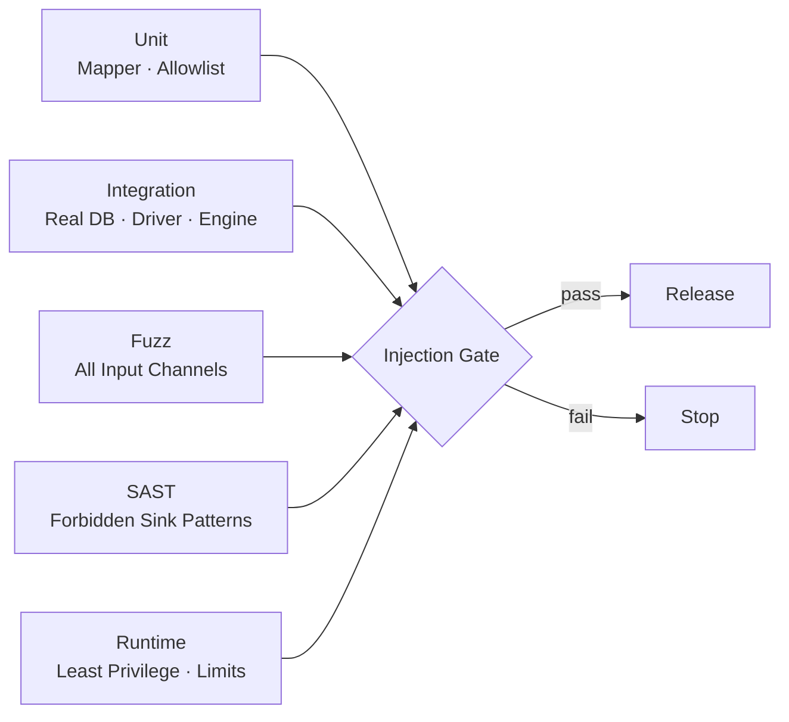

### SQL·ORM Negative Test

- `'`, Comment, Boolean 조건과 Union 유사 문자열이 값으로만 처리되는가?
- 동적 Sort의 알 수 없는 Field·Direction이 거부되는가?
- `LIKE`의 `%`, `_`, Escape 문자가 API 계약대로 Literal 또는 Pattern으로 처리되는가?
- 모든 검색·Count·Export·Bulk 작업에 Server Tenant 조건이 있는가?
- Application DB Role로 다른 Schema, DDL과 관리자 Procedure를 실행할 수 없는가?
- Native Query와 Stored Procedure 내부의 동적 SQL도 Review 대상인가?

### NoSQL Negative Test

- String 대신 Object·Array를 보낸 Type Confusion이 거부되는가?
- 중첩 `$ne`, `$regex`, `$where`, `$expr`와 Aggregation Stage가 거부되는가?
- Client Filter가 Server Tenant Predicate를 덮어쓸 수 없는가?
- 큰 Regex, 깊은 Object와 긴 Pipeline이 자원 제한에 걸리는가?
- Projection으로 비공개 Field를 요청할 수 없는가?

### Command·Template Negative Test

- `;`, `|`, 공백, 개행과 Option Prefix가 단일 업무 값으로 거부되거나 처리되는가?
- 실행 파일·Working Directory·Environment를 외부 입력으로 바꿀 수 없는가?
- Timeout 시 Child Process까지 종료되고 Output이 제한되는가?
- 임의 Template Name, Path, Fragment와 Expression이 평가되지 않는가?
- HTML·JavaScript·URL Context에서 Model Data가 알맞게 Escape되는가?
- 저장된 공격 문자열을 Batch·관리자 화면·Export에서 다시 사용해도 실행되지 않는가?

## 15. 정적 검사와 배포 Gate를 Sink 중심으로 만든다

검색할 Pattern의 예는 다음과 같습니다.

```text
Statement.execute*(concatenatedString)
EntityManager.createQuery(concatenatedString)
Document.parse(requestValue)
Runtime.exec(dynamicValue)
ProcessBuilder("sh", "-c", dynamicValue)
templateEngine.process(requestValue, ...)
parseExpression(requestValue)
th:utext / unescaped inline with untrusted model
```

Pattern 일치는 취약점 확정이 아니라 Review 시작점입니다. Wrapper와 Code Generation으로 Sink가 숨겨질 수 있으므로 Data Flow 기반 SAST, Code Review, Integration Test와 Runtime 권한 검증을 결합합니다.

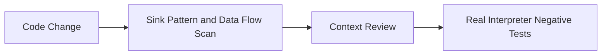

Test 결과는 Runtime 권한 검증과 함께 최종 배포 판단으로 이어집니다.

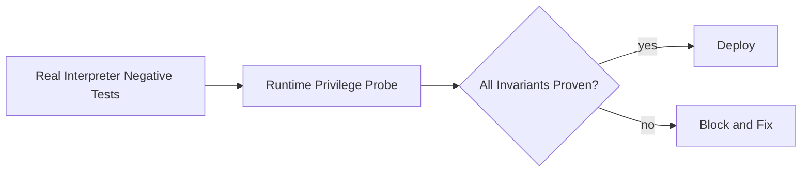

## 16. 사고 대응은 Interpreter별 영향 범위를 좁힌다

Injection 의심 Event가 발생하면 Payload 문자열만 찾지 말고 실제 Sink 실행과 권한을 확인합니다.

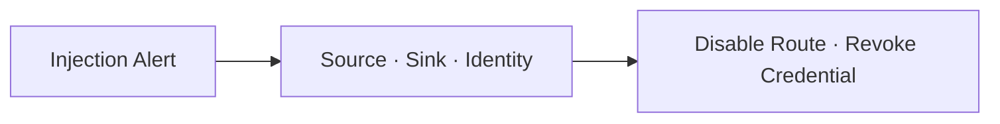

격리 후에는 영향 범위와 증거를 확정하고, 취약 경로 제거와 회귀 검증까지 닫습니다.

```mermaid
flowchart LR
    contain["Disable Route · Revoke Credential"] --> scope["Query · Process · Template Impact"]
    scope --> evidence["Preserve Audit and Artifacts"]
    evidence --> fix["Remove Path and Add Regression"]
    fix --> verify["Check Data and Downstream Systems"]
```

1. 취약 Endpoint, Background Job와 호출 Identity를 식별합니다.
2. Route, Feature Flag, DB Credential 또는 Worker를 최소 범위로 차단합니다.
3. Database Audit, Process 실행, File 변경과 외부 통신을 대조합니다.
4. 노출·변조된 데이터와 영향 Tenant를 분리해 평가합니다.
5. 안전한 API로 경로를 제거하고 공격 입력을 Regression Test로 고정합니다.
6. 같은 Sink Wrapper를 사용하는 다른 서비스와 Batch를 전수 점검합니다.
7. Secret·Token 노출 가능성이 있으면 Rotation과 Session 폐기를 진행합니다.

## 17. 실무 체크리스트

### 공통

- [ ] SQL·NoSQL·Process·Template·Expression Sink Inventory가 있다.
- [ ] HTTP 외에 Queue·File·Partner·Database 값도 Untrusted Source로 추적한다.
- [ ] Code와 Data를 안전한 API로 분리한다.
- [ ] 구조 값은 Server Enum과 작은 Allowlist로 변환한다.
- [ ] Input Validation을 Parameterization의 대체 수단으로 쓰지 않는다.
- [ ] Interpreter Identity는 최소 권한이고 시간·크기·동시성 제한이 있다.
- [ ] 오류 응답과 Log에 Query·Secret·Command·Template Model을 노출하지 않는다.

### SQL·NoSQL

- [ ] SQL·JPQL·Native Query의 값은 Bind Parameter로 전달한다.
- [ ] Column·Sort·Table·Projection은 Server Allowlist에서 선택한다.
- [ ] ORM·Stored Procedure 내부의 문자열 결합도 검사한다.
- [ ] Tenant Predicate는 인증 Context에서 Server가 강제한다.
- [ ] LIKE Wildcard와 Regex 의미·비용을 별도로 제한한다.
- [ ] Client의 Raw NoSQL Filter·Operator·Pipeline을 받지 않는다.
- [ ] DB Role에 DDL·관리자·불필요한 Schema 권한이 없다.

### Command·Template

- [ ] 가능한 경우 OS Process를 Java Library나 전용 API로 대체한다.
- [ ] `sh -c`, `cmd /c`, 동적 Script와 사용자 선택 Executable이 없다.
- [ ] Process Argument는 분리하고 Option·Path·Environment를 제한한다.
- [ ] Process Tree, Timeout, Output, CPU·Memory와 동시 실행 수를 제한한다.
- [ ] Template Source·Name·Fragment·Expression은 Trusted Artifact에서 선택한다.
- [ ] 외부 값은 Model Data로만 전달하고 출력 Context별 Escape를 적용한다.
- [ ] 사용자 Template가 필수라면 별도 격리 Service와 강한 자원 제한을 둔다.

### 검증·운영

- [ ] Nested JSON, Type Confusion과 Second-order Injection을 Test한다.
- [ ] 실제 Database·Driver·Template Engine 기반 Integration Test가 있다.
- [ ] SAST·DAST·IAST·Fuzzing 결과를 Release Gate에 연결한다.
- [ ] 거부·오류·실행 Event를 Source·Sink·Identity 기준으로 상관 분석한다.
- [ ] Injection Incident Playbook과 Credential Rotation 절차가 있다.

## 마무리

Injection 방어의 핵심은 금지 문자 목록이 아니라 **Interpreter가 실행할 구조는 Server가 소유하고, 외부 값은 끝까지 Data로만 전달하는 것**입니다.

SQL은 Parameter Binding과 구조 Allowlist, NoSQL은 고정 DTO와 Server Query Builder, OS Command는 호출 제거 또는 고정 Argument List, Template은 Trusted Template와 Context-aware Escaping으로 경계를 만듭니다. 그 위에 Tenant Scope, 최소 권한, 자원 제한, Negative Test와 관측성을 겹쳐야 우회 시 피해까지 제한할 수 있습니다.

가장 실용적인 Review 질문은 다음과 같습니다.

> 이 값이 최종 Interpreter에서 Data로 남는다는 사실을 코드와 Test로 증명할 수 있는가?

다음 글에서는 OWASP Top 10:2025 A06 Insecure Design을 기준으로 Abuse Case, Rate Limit과 업무 흐름 우회를 설계 단계에서 차단하는 방법을 다룹니다.

## 공식 참고 자료

- [OWASP Top 10:2025 — A05 Injection](https://owasp.org/Top10/2025/A05_2025-Injection/)
- [OWASP SQL Injection Prevention Cheat Sheet](https://cheatsheetseries.owasp.org/cheatsheets/SQL_Injection_Prevention_Cheat_Sheet.html)
- [OWASP Query Parameterization Cheat Sheet](https://cheatsheetseries.owasp.org/cheatsheets/Query_Parameterization_Cheat_Sheet.html)
- [OWASP NoSQL Security Cheat Sheet](https://cheatsheetseries.owasp.org/cheatsheets/NoSQL_Security_Cheat_Sheet.html)
- [OWASP OS Command Injection Defense Cheat Sheet](https://cheatsheetseries.owasp.org/cheatsheets/OS_Command_Injection_Defense_Cheat_Sheet.html)
- [OWASP Input Validation Cheat Sheet](https://cheatsheetseries.owasp.org/cheatsheets/Input_Validation_Cheat_Sheet.html)
- [OWASP Java Security Cheat Sheet](https://cheatsheetseries.owasp.org/cheatsheets/Java_Security_Cheat_Sheet.html)
- [Spring Data JPA — JPA Query Methods](https://docs.spring.io/spring-data/jpa/reference/3.5/jpa/query-methods.html)
- [Oracle Java 21 — ProcessBuilder](https://docs.oracle.com/en/java/javase/21/docs/api/java.base/java/lang/ProcessBuilder.html)
- [Thymeleaf 3.1 — Using Thymeleaf](https://www.thymeleaf.org/doc/tutorials/3.1/usingthymeleaf.html)
