# Insecure Design Secure Coding: Abuse Case·Rate Limit·업무 흐름 우회

Insecure Design은 보안 Header 하나를 빠뜨리거나 조건문 하나를 잘못 작성한 문제와 다릅니다. 필요한 통제 자체가 요구사항과 설계에 없으면 코드를 정확히 구현해도 시스템은 안전하지 않습니다.

예를 들어 다음 코드는 모두 정상 동작할 수 있습니다.

- 결제 완료 API가 요청되면 주문을 완료 상태로 바꿉니다.
- 쿠폰 적용 API가 유효한 쿠폰의 할인액을 반환합니다.
- 초대 API가 입력된 주소로 초대장을 보냅니다.
- 보고서 API가 요청된 기간의 데이터를 집계합니다.

하지만 결제 증명 없이 완료 API를 호출할 수 있고, 같은 쿠폰을 동시에 두 번 쓸 수 있고, 초대 횟수와 보고서 범위에 한도가 없다면 문제는 구현 Bug 이전에 **누락된 보안 요구사항과 업무 불변식**입니다.

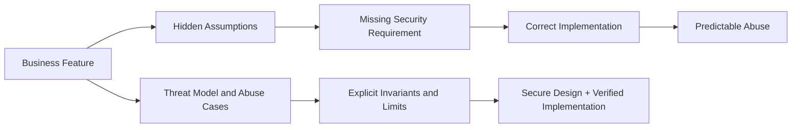

이 글은 2026년 8월 기준 OWASP Top 10:2025 A06 Insecure Design을 바탕으로 Java 21·Spring Boot 3 환경의 합성 예제를 설명합니다. 실제 고객, 서비스, 내부 Workflow, 금액, 계정과 운영 한도는 사용하지 않습니다.

## 1. 설계 결함과 구현 결함을 구분한다

OWASP A06:2025는 Insecure Design을 누락되거나 효과가 없는 Control Design으로 설명하며, 안전한 설계에도 구현 결함은 있을 수 있지만 필요한 통제가 설계되지 않은 시스템은 완벽한 구현만으로 고칠 수 없다고 구분합니다.

- **설계 결함** — 주문 완료에 결제 확인 단계가 없습니다. 요구사항·상태 모델·아키텍처에서 통제를 추가해야 합니다.
- **구현 결함** — 결제 확인 조건을 반대로 작성했습니다. 코드·Test·Review에서 바로잡아야 합니다.
- **운영 결함** — 설계한 Rate Limit Backend가 배포 환경에서 꺼져 있습니다. Configuration과 배포 검증에서 탐지해야 합니다.

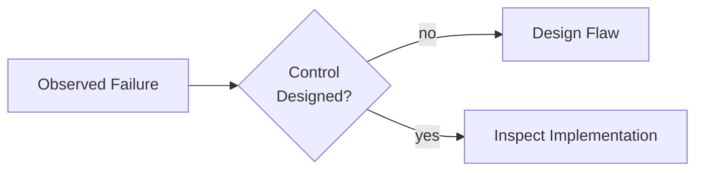

통제가 설계돼 있었다면 구현과 Runtime 활성화 여부를 차례로 확인합니다.

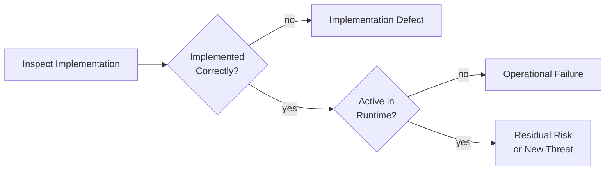

원인을 구분해야 재발 방지 조치가 달라집니다. 조건문만 수정하고 업무 불변식과 다른 진입점을 검토하지 않으면 같은 설계 결함이 Batch, Admin API와 신규 API Version에서 반복됩니다.

## 2. 기능 요구사항을 업무 불변식으로 바꾼다

`사용자는 주문을 취소할 수 있다`는 기능 설명만으로는 부족합니다. 보안 설계에는 언제, 무엇을 기준으로, 어떤 동시성에서 허용되는지 포함해야 합니다.

```text
기능 요구사항
사용자는 주문을 취소할 수 있다.

업무 불변식
- 인증된 주문 소유자만 취소할 수 있다.
- 결제 대기 또는 결제 완료 상태에서만 취소할 수 있다.
- 배송 시작 이후에는 취소할 수 없다.
- 환불과 상태 변경은 한 번만 발생한다.
- 두 요청이 동시에 도착해도 최종 상태와 환불 금액은 하나다.
- 실패 시 주문 완료 상태로 진행하지 않는다.
```

불변식은 API Controller의 설명이 아니라 모든 진입점이 공유하는 Domain Policy와 Test가 되어야 합니다.

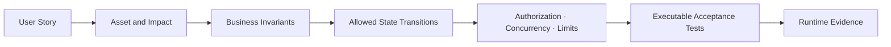

### 불변식 작성 질문

- 누가 이 기능으로 가치, 권한, 데이터나 외부 비용을 얻는가?
- 어떤 값은 Client가 보내더라도 Server가 다시 계산해야 하는가?
- 어떤 단계는 건너뛰거나 반복하면 안 되는가?
- 같은 요청이 동시에 여러 번 오면 무엇이 한 번만 일어나야 하는가?
- 실패·Timeout·재시도 후 허용되는 상태는 무엇인가?
- 사용자·Tenant·IP·Device·Resource별 허용량은 얼마인가?
- 어떤 Event를 남겨야 사후에 규칙 준수를 증명할 수 있는가?

## 3. Threat Modeling을 Sprint의 설계 활동으로 둔다

OWASP Threat Modeling Cheat Sheet가 제시하는 네 질문은 복잡한 Framework 없이도 시작할 수 있습니다.

1. 무엇을 만들고 있는가?
2. 무엇이 잘못될 수 있는가?
3. 무엇을 할 것인가?
4. 충분히 잘했는가?

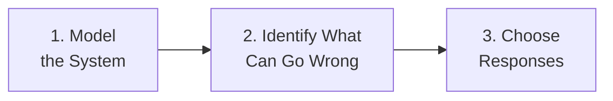

선택한 대응은 검증하고, 중요한 변경이 생기면 다시 System Model로 되돌립니다.

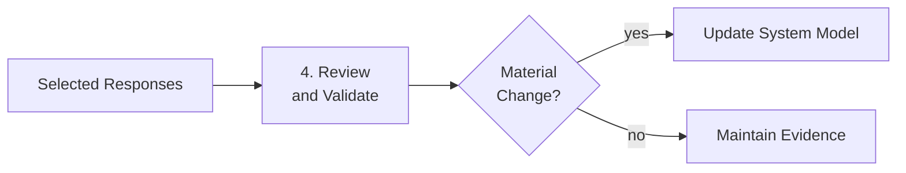

Threat Model은 출시 전 한 번 작성하고 끝내는 문서가 아닙니다. 다음 변화가 생기면 Data Flow와 Trust Boundary를 갱신합니다.

- 새로운 Actor, API, Queue Consumer 또는 Admin 도구
- 새로운 Tenant 공유 자원과 Cache
- 결제·승인·본인확인 같은 단계 변경
- 외부 Provider, Webhook과 Callback 추가
- 동기 처리를 비동기 Job으로 변경
- 비용이 큰 AI·검색·Export 기능 추가
- 장애 시 Fallback과 수동 운영 절차 변경

## 4. Abuse Case를 짧고 Test 가능한 문장으로 만든다

Abuse Case는 공격 기법 이름을 나열하는 문서가 아니라 정상 기능을 의도와 다르게 사용하는 Scenario입니다. 무거운 별도 산출물보다 User Story마다 3~5개의 구체적인 오용을 적고 Acceptance Criteria와 연결하는 편이 실용적입니다.

- **쿠폰 사용** — 동시 요청으로 한 쿠폰을 두 번 쓰는 Abuse Case를 원자적 선점·Unique Constraint와 동시성 Test로 통제합니다.
- **승인** — 요청자가 자신의 건을 승인하는 흐름을 역할·관계·상태 인가와 Self-approval Test로 차단합니다.
- **초대** — 자동화된 대량 메일 발송을 Feature Rate Limit·Quota와 다중 축 제한 Test로 검증합니다.
- **보고서** — 장기간·대량 조건의 자원 고갈을 Query Budget·비동기 Job과 최대 범위 Test로 제한합니다.
- **비밀번호 재설정** — 다른 계정에 반복 알림을 보내는 악용을 계정·발신자 제한, Generic 응답과 Enumeration·DoS Test로 통제합니다.

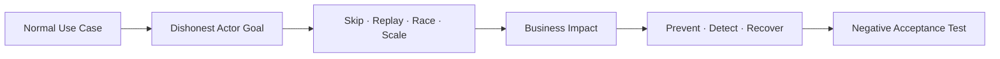

좋은 Abuse Case는 `악용을 막는다`가 아니라 다음처럼 작성합니다.

> 동일한 사용자와 결제수단이 여러 계정으로 가입 보상을 반복 수령하려 할 때, 보상 발급은 Server가 정의한 Eligibility와 누적 한도를 원자적으로 확인하고 한 번만 성공해야 한다.

## 5. UI 순서가 아니라 Server 상태 기계로 Workflow를 강제한다

화면에서 다음 버튼을 숨기는 것은 업무 흐름 통제가 아닙니다. 공격자는 중간 API를 건너뛰고 마지막 Endpoint를 직접 호출할 수 있습니다.

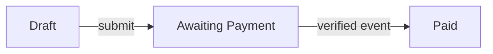

결제가 확인된 뒤에는 승인과 이행 전이만 허용합니다.

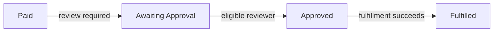

취소와 환불은 정상 이행 흐름과 분리해도 같은 Server 상태 기계의 전이 계약을 따릅니다.

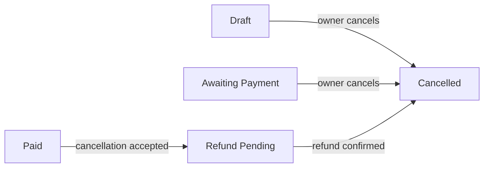

각 Transition은 다음 계약을 가져야 합니다.

- 허용 Source State와 Target State
- Actor의 역할·관계·Tenant
- 필요한 증명과 업무 조건
- 원자적으로 변경할 데이터와 발생시킬 Event
- 재시도·중복·Timeout 의미
- 실패 후 상태와 보상 절차
- 감사 Event와 경보 조건

```java
enum OrderState {
    DRAFT,
    AWAITING_PAYMENT,
    PAID,
    AWAITING_APPROVAL,
    APPROVED,
    FULFILLED,
    REFUND_PENDING,
    CANCELLED
}

final class OrderAggregate {
    private OrderState state;

    void approve(Actor actor, ApprovalPolicy policy) {
        if (state != OrderState.AWAITING_APPROVAL) {
            throw new InvalidOrderTransitionException();
        }
        policy.requireEligibleReviewer(actor, this);
        state = OrderState.APPROVED;
    }
}
```

Controller, Batch와 Message Consumer가 상태를 직접 바꾸지 않고 같은 Aggregate Method 또는 Domain Service를 호출하도록 진입점을 수렴합니다.

## 6. 보안 관련 값은 Server가 다시 계산한다

Client가 보낸 값은 UI 표시와 관계없이 Input일 뿐 Truth가 아닙니다. 가격, 할인, 수수료, 소유권, 역할, Approval 결과와 지급 자격을 Server의 권위 있는 데이터에서 다시 계산합니다.

```java
@Transactional
public CheckoutQuote quote(
        AuthenticatedActor actor,
        CheckoutRequest request) {

    Product product = catalog.requirePurchasable(
        actor.tenantId(), request.productId());

    int quantity = quantityPolicy.requireAllowed(request.quantity());
    Money subtotal = product.currentPrice().multiply(quantity);
    Discount discount = promotionPolicy.calculate(
        actor, product, request.couponCode(), clock.instant());

    return CheckoutQuote.serverCalculated(
        product.publicId(), quantity, subtotal, discount);
}
```

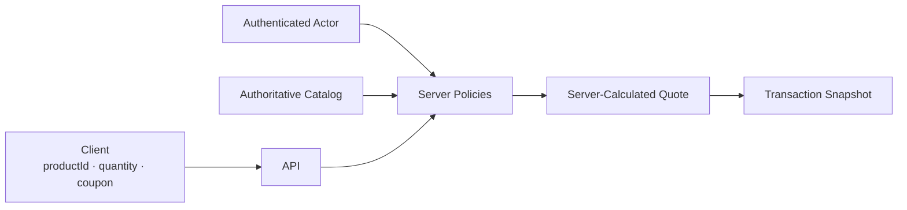

Client가 보낸 `unitPrice`, `total`, `role`, `ownerId`, `approved=true`를 그대로 저장하지 않습니다. 표시한 Quote가 나중에 실행될 때는 Version과 만료를 확인하고, 중요한 조건이 바뀌면 사용자에게 새 내용을 다시 확인시킵니다.

## 7. 민감한 Transaction은 확인한 내용과 실행할 내용을 묶는다

승인 Token이 `승인했다`는 사실만 증명하고 대상·금액·행위를 묶지 않으면 공격자가 승인 이후 Transaction 내용을 바꿀 수 있습니다.

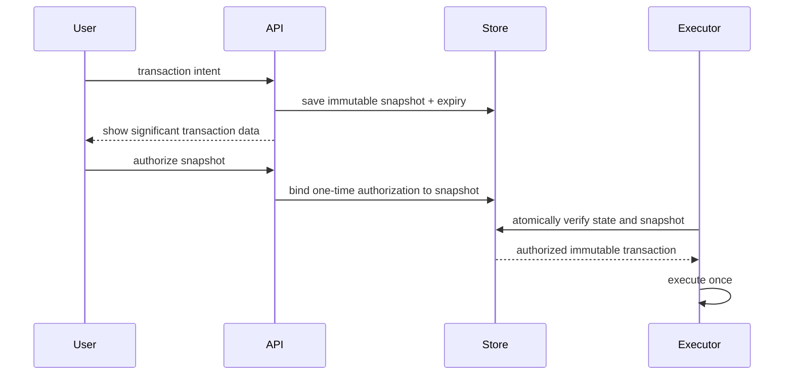

OWASP Transaction Authorization 지침에 맞춰 다음을 설계합니다.

- 사용자에게 대상, 금액, 행위처럼 중요한 Transaction Data를 확인시킵니다.
- Authorization Challenge와 Credential은 Server가 생성·보관합니다.
- Transaction Data가 바뀌면 기존 Authorization을 무효화합니다.
- 단계는 순서대로 진행하고 건너뛰기·재사용을 거부합니다.
- Authorization은 짧은 수명과 Operation별 고유성을 갖습니다.
- 실행 직전에 Snapshot, State와 Authorization을 다시 원자적으로 확인합니다.

## 8. Concurrency는 공격자가 선택할 수 있는 입력이다

`조회 → 조건 확인 → 갱신` 사이에 다른 요청이 들어오지 않을 것이라는 가정은 안전하지 않습니다. 쿠폰, 포인트, 재고, 승인과 한 번만 실행되어야 하는 작업은 Critical Section을 명시합니다.

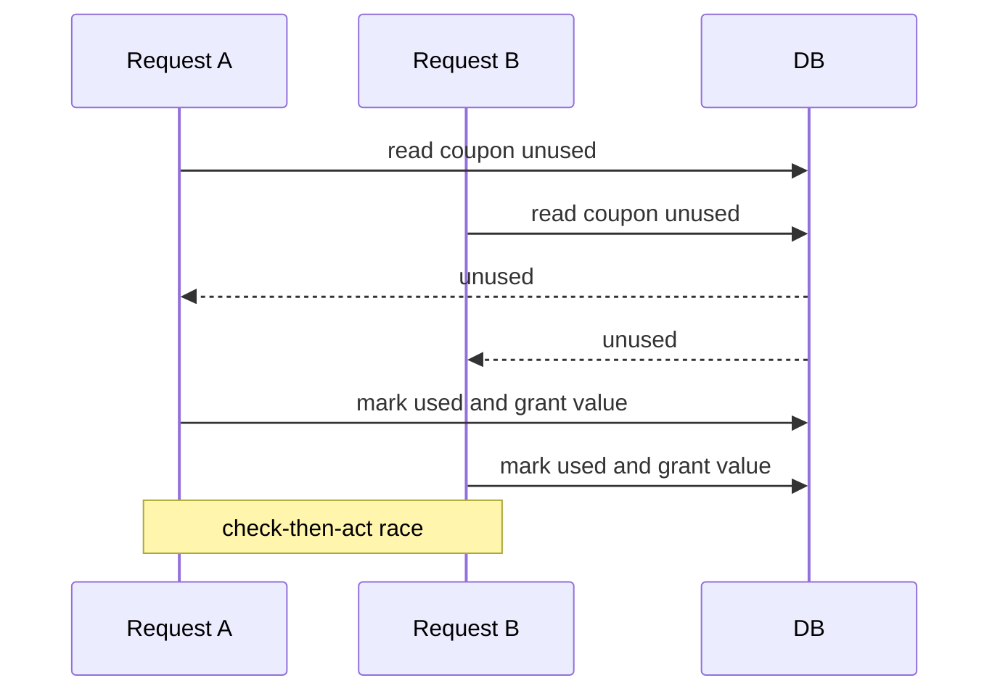

Spring Data JPA에서는 업무 특성에 따라 Optimistic Version, Conditional Update, Unique Constraint 또는 Pessimistic Lock을 선택합니다.

```java
interface CouponRepository extends JpaRepository<CouponEntity, UUID> {

    @Lock(LockModeType.PESSIMISTIC_WRITE)
    @Query("""
        select c
          from CouponEntity c
         where c.id = :couponId
           and c.tenantId = :tenantId
        """)
    Optional<CouponEntity> findForRedemption(
        @Param("tenantId") UUID tenantId,
        @Param("couponId") UUID couponId);
}
```

Service는 잠긴 Entity에서 업무 조건을 다시 확인하고 같은 Transaction 안에서 소비 상태를 바꿉니다.

```java
@Transactional
public Redemption redeem(
        AuthenticatedActor actor,
        UUID couponId) {

    CouponEntity coupon = repository.findForRedemption(
        actor.tenantId(), couponId).orElseThrow(NotFoundException::new);

    coupon.requireRedeemableBy(actor, clock.instant());
    coupon.markRedeemedBy(actor.userId(), clock.instant());
    return Redemption.from(coupon);
}
```

Lock만 추가하면 끝나는 것은 아닙니다.

- Lock 범위와 순서를 고정해 Deadlock을 줄입니다.
- Transaction 안에서 느린 Network 호출을 하지 않습니다.
- Database Unique Constraint를 최종 불변식으로 둡니다.
- 충돌을 정상적인 업무 결과로 처리하고 무한 재시도하지 않습니다.
- 여러 Resource를 함께 바꾸면 원자성 또는 명시적 보상 절차를 설계합니다.

## 9. Idempotency는 중복 실행 방지 계약이다

Network Timeout 뒤 Client가 재시도하면 Server는 이전 요청이 성공했는지 알 수 있어야 합니다. Idempotency Key를 받기만 하고 Memory Map에 결과를 넣는 방식은 다중 Instance, 재시작과 Race에서 깨집니다.

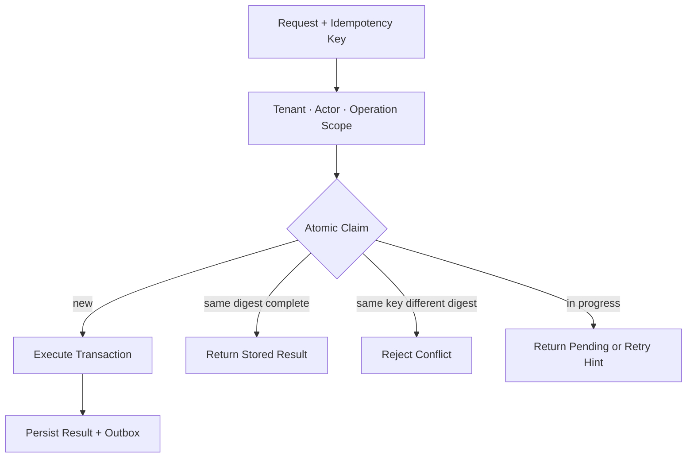

```java
public record IdempotencyScope(
        UUID tenantId,
        UUID actorId,
        String operation,
        String key,
        String requestDigest) {
}

public sealed interface ClaimResult {
    record NewClaim(UUID claimId) implements ClaimResult {}
    record Completed(PaymentResult paymentResult) implements ClaimResult {}
    record DigestConflict() implements ClaimResult {}
    record InProgress(Duration retryAfter) implements ClaimResult {}
}

public interface IdempotencyStore {
    ClaimResult claim(IdempotencyScope scope);
}
```

업무 Service는 원자적 Claim 결과를 실행·재생·충돌·진행 중 상태로 명시해서 처리합니다.

```java
@Transactional
public PaymentResult pay(
        AuthenticatedActor actor,
        PaymentRequest request,
        String idempotencyKey) {

    IdempotencyScope scope = scopes.create(
        actor, "order-payment", idempotencyKey, request);

    return switch (idempotencyStore.claim(scope)) {
        case ClaimResult.NewClaim claim ->
            executeAndStore(claim, actor, request);
        case ClaimResult.Completed completed ->
            completed.paymentResult();
        case ClaimResult.DigestConflict ignored ->
            throw new IdempotencyConflictException();
        case ClaimResult.InProgress pending ->
            throw new OperationInProgressException(pending.retryAfter());
    };
}
```

`claim`은 `(tenant, actor, operation, key)` Unique Constraint와 Transaction으로 한 승자만 만들어야 합니다. 같은 Key에 다른 Request Digest가 오면 이전 결과를 반환하지 않습니다. Side Effect Event는 업무 결과와 같은 Transaction의 Outbox에 기록합니다.

## 10. Rate Limit은 로그인 앞단이 아니라 Feature별 설계다

Global IP 제한 하나로는 초대, 쿠폰, 검색, Export, AI 추론과 알림 발송의 비용·가치 차이를 표현할 수 없습니다. Feature별 Abuse Case에서 제한 축과 비용을 정합니다.

- **초대** — Tenant·Actor·수신 Domain별 발송 건수를 측정하고 수신 거부·Quota를 함께 적용합니다.
- **쿠폰** — Actor·Payment Instrument·Campaign별 시도와 성공을 측정하고 Eligibility와 한 번만 발급되는 불변식을 확인합니다.
- **검색** — Tenant·Actor·Query Shape별 Scan Cost를 계산하고 기간·Page·복잡도를 제한합니다.
- **Export** — Tenant·Actor·Job별 예상 Row·Byte를 계산하고 비동기 Queue와 동시성을 제한합니다.
- **AI 요청** — Tenant·Actor·Model별 Token·GPU Cost를 Budget과 Timeout 안에서 관리합니다.
- **Password Reset** — Account·발신자·Network별 시도와 알림을 제한하고 Generic 응답·Step-up을 결합합니다.

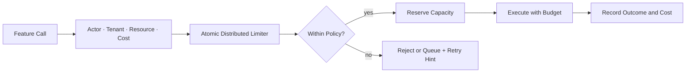

```java
public record FeatureCost(
        UUID tenantId,
        UUID actorId,
        String action,
        String resourceKey,
        long units) {
}

public sealed interface LimitDecision {
    record Allowed(String reservationId) implements LimitDecision {}
    record Rejected(Duration retryAfter) implements LimitDecision {}
}

public interface FeatureRateLimiter {
    LimitDecision reserve(FeatureCost cost, Instant now);
    void complete(String reservationId, long actualUnits);
    void cancel(String reservationId);
}
```

예약에는 짧은 Lease와 고유 ID를 두고 `complete`·`cancel`을 멱등하게 처리합니다. Worker 장애로 두 호출이 모두 누락돼도 Lease 만료 후 용량이 회수되어야 하며, 실제 사용량과 예약량의 차이를 어떻게 정산할지도 Feature 정책으로 정합니다.

실제 Limit 숫자는 예상 정상 사용량, 공격 비용, Downstream Capacity와 사용자 피해를 측정해 정합니다. IP만 사용하면 NAT 사용자를 함께 차단하고, Account만 사용하면 공격자가 계정을 늘려 우회할 수 있으므로 여러 축을 조합하되 개인정보와 오탐을 검토합니다.

## 11. 제한 자체가 새로운 DoS 수단이 되지 않게 한다

공격자가 다른 사용자의 계정명으로 실패 요청을 반복해 계정을 잠글 수 있다면 보안 Control이 DoS 도구가 됩니다.

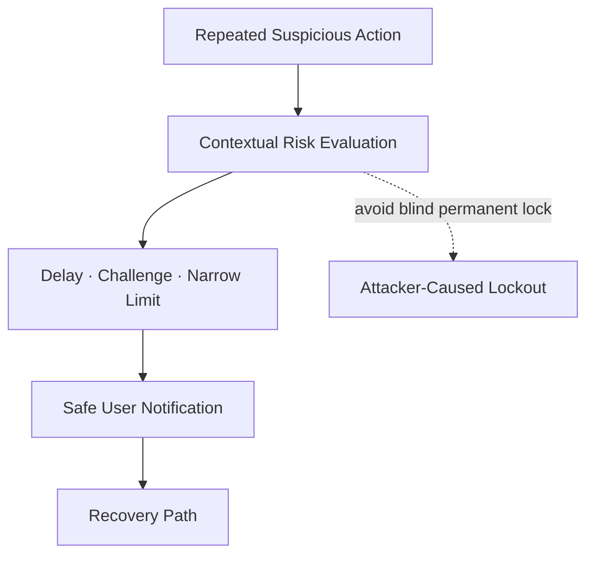

- 영구 잠금보다 지연, 짧은 제한과 단계적 인증을 검토합니다.
- Password Reset 응답으로 계정 존재 여부를 드러내지 않습니다.
- CAPTCHA를 유일한 방어로 사용하지 않습니다.
- 사용자, IP, Device, Tenant와 대상 Account 축을 분리해 탐지합니다.
- 고객지원·관리자 우회 기능에도 승인과 감사 절차를 둡니다.
- Limit Backend 장애 시 Feature 위험도에 따른 Fail 정책을 사전에 정합니다.

## 12. 자원 Budget을 API 계약에 포함한다

Request가 문법적으로 유효해도 기간, Page Size, Graph 깊이, 파일 크기와 AI Token이 무제한이면 가용성 설계가 빠진 것입니다.

```java
public record ReportBudget(
        int maxDays,
        int maxRows,
        long maxOutputBytes,
        Duration deadline) {

    static ReportBudget standard() {
        return new ReportBudget(
            31,
            50_000,
            25L * 1024 * 1024,
            Duration.ofSeconds(30));
    }
}
```

숫자는 합성 예시이며 운영 기준이 아닙니다. Budget은 다음 계층에서 일관되게 적용합니다.

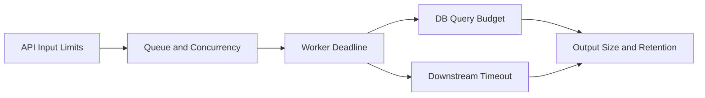

- HTTP Body·파일·배열·중첩 깊이 제한
- 조회 기간·Page Size·정렬·Filter 복잡도 제한
- Tenant별 Queue 깊이와 동시 Job 제한
- Database Statement Timeout과 읽을 Row 제한
- Downstream 호출 Timeout·Retry Budget
- 결과 Byte·보존 기간·Download 횟수 제한
- 취소·만료된 Job의 자원 회수

## 13. 실패 상태와 보상 흐름도 정상 흐름만큼 설계한다

Insecure Design은 Happy Path 밖에서 자주 드러납니다. 결제는 성공했는데 주문 저장이 실패하거나, 승인은 됐는데 Event 발행이 실패하거나, Timeout 뒤 외부 작업이 늦게 성공할 수 있습니다.

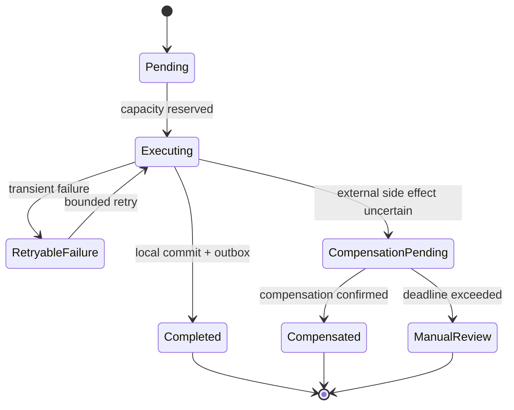

- 오류에서 Validation·Authorization·Approval을 우회하는 Fallback을 만들지 않습니다.
- 상태가 불명확한 외부 Side Effect를 무조건 재실행하지 않습니다.
- Retry 횟수, 총 Deadline과 Backoff를 하나의 Budget으로 관리합니다.
- Partial State에는 만료와 정리 Job을 둡니다.
- 보상도 중복 실행에 안전하고 감사 가능해야 합니다.
- 운영자가 수동으로 상태를 바꾸는 절차에는 승인·Reason·Before/After를 남깁니다.

## 14. 설계 결정을 실행 가능한 산출물로 남긴다

Threat Model 문서만 있고 코드·Test와 연결되지 않으면 변경 과정에서 통제가 사라집니다.

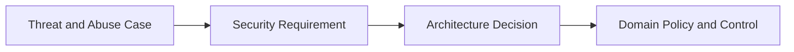

구현된 통제는 Test와 Runtime Signal로 증명하고, 사고에서 얻은 학습을 다음 Threat 검토로 되돌립니다.

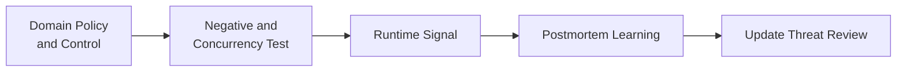

최소 연결 정보는 다음과 같습니다.

- Threat·Abuse Case ID와 영향 자산
- 선택한 Control, 소유 Team과 적용 위치
- 보호해야 할 업무 불변식과 Failure State
- 허용 Risk, 예외 승인과 만료일
- 자동화 Test와 배포 Gate
- Runtime Metric·Alert와 Incident Playbook
- 설계를 다시 검토해야 하는 변경 Trigger

NIST SSDF의 방향처럼 보안 요구사항, Risk와 설계 결정을 추적하고 취약점 대응 결과를 개발 과정에 되돌립니다.

## 15. Negative Test는 순서·반복·동시성·규모를 바꾼다

Happy Path Unit Test는 Insecure Design을 거의 드러내지 못합니다.

```mermaid
flowchart LR
    happy["Happy Path"] --> mutate["Adversarial Variations"]
    mutate --> skip["Skip / Reorder"]
    mutate --> replay["Replay / Duplicate"]
    mutate --> race["Parallel Race"]
    mutate --> scale["Volume / Cost"]
    mutate --> failure["Timeout / Partial Failure"]
    skip --> invariant["Assert Business Invariants"]
    replay --> invariant
    race --> invariant
    scale --> invariant
    failure --> invariant
```

### Workflow Test

- 초기 상태에서 마지막 단계 API를 직접 호출하면 거부되는가?
- 승인·확인 단계를 건너뛰거나 순서를 바꾸면 상태가 진행되지 않는가?
- 완료된 Step과 One-time Token을 재사용하면 거부되는가?
- Transaction Data 변경 시 이전 Authorization이 무효화되는가?
- 요청자와 승인자가 같을 때 Self-approval이 거부되는가?

### Concurrency·Idempotency Test

- 같은 쿠폰·재고·포인트를 동시에 사용해도 한 요청만 성공하는가?
- 같은 Idempotency Key와 같은 Body는 같은 결과를 반환하는가?
- 같은 Key와 다른 Body는 Conflict로 거부되는가?
- Timeout 후 재시도해도 외부 Side Effect와 Outbox Event가 한 번인가?
- Lock 충돌과 Optimistic Version 실패가 무한 재시도로 이어지지 않는가?

### Rate·Resource Test

- Actor, Tenant, IP, Device와 Resource 축별 제한이 의도대로 독립·결합되는가?
- 비용이 큰 요청이 단순 요청보다 더 많은 Budget을 소비하는가?
- 여러 Instance에서 동시에 요청해도 Limit가 원자적인가?
- Limit Backend 장애에서 Feature별 Fail 정책이 적용되는가?
- 최대 기간·행·Byte·동시 Job·Deadline을 넘으면 조기에 중단되는가?

## 16. Release Gate는 보안 설계의 존재와 증거를 확인한다

```mermaid
flowchart LR
    change["Feature or Architecture Change"] --> trigger{"Threat Review Trigger?"}
    trigger -->|yes| update["Update Model and Abuse Cases"]
    trigger -->|no| evidence["Verify Existing Invariants"]
```

두 경로 모두 보안 요구사항과 Negative·Race·Limit Test 증거로 수렴합니다.

```mermaid
flowchart LR
    update["Updated Model<br/>and Abuse Cases"] --> requirements["Security Requirements and ADR"]
    requirements --> tests["Negative · Race · Limit Tests"]
    evidence["Verified Existing<br/>Invariants"] --> tests
```

Review 결과와 Test 증거가 준비된 뒤에만 Release 결정을 내립니다.

```mermaid
flowchart LR
    tests["Negative · Race · Limit Tests"] --> gate{"Evidence<br/>Complete?"}
    gate -->|yes| release["Release"]
    gate -->|no| block["Block or Time-Bound Exception"]
```

다음 항목을 배포 전에 확인합니다.

- 중요 상태 전이와 진입점이 Inventory에 있는가?
- Abuse Case가 Acceptance Test로 연결됐는가?
- Client가 보낸 보안 관련 값을 Server가 재계산하는가?
- Critical Section의 Database 불변식과 동시성 Test가 있는가?
- Feature별 Rate·Quota·Resource Budget과 장애 정책이 있는가?
- 실패·재시도·보상·수동 개입 상태가 정의됐는가?
- 새 Queue, Webhook, Admin API가 기존 Domain Policy를 우회하지 않는가?
- 예외 승인은 Owner, Risk, 보완 통제와 만료일이 있는가?

## 17. 운영에서는 결과보다 불변식 위반 시도를 관측한다

```mermaid
flowchart LR
    events["Business Security Events"] --> correlate["Actor · Tenant · Resource · State"]
    correlate --> detect["Skip · Replay · Race · Scale"]
    detect --> response["Challenge · Limit · Suspend Feature"]
    response --> investigate["Investigate Impact"]
    investigate --> improve["Update Requirement and Tests"]
```

관측할 Event의 예는 다음과 같습니다.

- 허용되지 않은 상태 전이 시도
- Self-approval·소유권·자격 조건 거부
- 동일 Idempotency Key의 Digest 충돌
- Unique Constraint·Version·Lock 충돌 추세
- Feature Rate Limit·Quota·Budget 거부
- 비정상적으로 빠른 Workflow 완료와 반복 Step
- 보상·Manual Review 상태의 누적과 Deadline 초과
- Admin·지원 조직의 수동 Override

Log에는 Password, Token, 전체 결제정보와 불필요한 개인정보를 남기지 않고, Server가 정의한 Event Type과 최소 Context를 구조화해 기록합니다.

## 18. 사고 대응은 누락된 설계를 찾아 닫는다

```mermaid
flowchart LR
    detect["Business Logic Abuse Detected"] --> contain["Limit Feature and Preserve Evidence"]
    contain --> scope["Find Actors · Tenants · Value · Entry Points"]
    scope --> recover["Reverse or Compensate Safely"]
```

복구 후에는 누락된 설계인지 깨진 구현인지 구분하고 회귀 방지 증거를 남깁니다.

```mermaid
flowchart LR
    recover["Recovery Complete"] --> cause{"Design or<br/>Implementation?"}
    cause --> requirement["Add Invariant and Control"]
    cause --> defect["Fix Implementation"]
```

설계와 구현 중 어느 쪽을 고쳤든 공격 Scenario를 회귀 Test와 Runtime Signal로 고정합니다.

```mermaid
flowchart LR
    correction["Invariant or<br/>Implementation Fix"] --> regression["Add Adversarial Regression Tests"]
    regression --> monitor["Strengthen Runtime Signals"]
```

1. Feature, Actor, Tenant와 지급·변경된 가치를 최소 범위로 차단합니다.
2. 모든 진입점, 재시도, 비동기 Consumer와 Admin 경로를 확인합니다.
3. 동시성·순서·규모·실패 상태 중 어떤 가정이 깨졌는지 식별합니다.
4. 이미 발생한 Side Effect를 멱등하게 취소·회수·보상합니다.
5. 누락된 업무 불변식과 Failure State를 요구사항에 추가합니다.
6. 공격 Scenario를 Negative·Concurrency Test로 고정합니다.
7. 유사 기능의 Threat Model과 Rate·Budget을 함께 재검토합니다.

## 19. 실무 체크리스트

### 요구사항·Threat Modeling

- [ ] 중요 자산, Actor, Trust Boundary와 Data Flow가 문서화돼 있다.
- [ ] 기능별 업무 불변식과 허용·금지 상태 전이가 있다.
- [ ] Skip·Replay·Race·Scale·Failure Abuse Case가 있다.
- [ ] Threat Model을 갱신할 Architecture Change Trigger가 있다.
- [ ] 보안 요구사항이 Owner·Test·Runtime Signal과 연결된다.
- [ ] Risk 예외에 보완 통제와 만료일이 있다.

### Workflow·Transaction

- [ ] 상태는 Server 저장소가 소유하고 Client Step을 신뢰하지 않는다.
- [ ] 모든 Controller·Batch·Consumer가 같은 Domain Policy를 호출한다.
- [ ] 가격·할인·역할·소유권·자격을 Server가 재계산한다.
- [ ] 민감 Transaction의 중요한 내용과 Authorization이 묶여 있다.
- [ ] Transaction 변경 시 이전 Authorization이 무효화된다.
- [ ] 실행 직전에 State·Snapshot·Authorization을 원자적으로 재검증한다.
- [ ] Partial State, Timeout, Retry와 Compensation 상태가 정의돼 있다.

### Concurrency·Idempotency

- [ ] Critical Section과 최종 Database 불변식이 식별돼 있다.
- [ ] Lock·Version·Conditional Update·Unique Constraint 선택 근거가 있다.
- [ ] 같은 가치의 동시 소비 Test가 있다.
- [ ] Idempotency Scope에 Tenant·Actor·Operation과 Request Digest가 있다.
- [ ] 결과와 Outbox Event가 같은 Transaction에서 기록된다.
- [ ] 충돌·In-progress·실패 후 재시도 의미가 정의돼 있다.

### Rate·Resource·운영

- [ ] Feature별 Actor·Tenant·IP·Device·Resource 제한 축이 있다.
- [ ] 요청의 실제 비용을 반영한 Unit과 Quota가 있다.
- [ ] Distributed Limiter의 소비·예약이 원자적이다.
- [ ] 제한 Control이 계정 잠금 DoS로 악용되지 않는다.
- [ ] 기간·행·Byte·동시성·Deadline·Retry Budget이 있다.
- [ ] 허용되지 않은 전이·Replay·Race·Scale을 탐지·경보한다.
- [ ] 수동 Override와 보상 절차가 승인·감사된다.

## 마무리

Insecure Design을 막는 핵심은 보안 기능을 나중에 덧붙이는 것이 아니라 **업무가 절대 깨뜨리면 안 되는 불변식을 먼저 정의하고, 공격자가 순서·반복·동시성·규모·실패를 선택해도 유지되도록 설계하는 것**입니다.

Threat Model과 Abuse Case로 잘못될 수 있는 흐름을 찾고, Server 상태 기계로 순서를 강제하며, 권위 있는 값 재계산과 Transaction Authorization으로 내용을 묶습니다. Critical Section, Idempotency, Feature Rate Limit, Resource Budget과 Failure State를 함께 설계한 뒤 Negative Test와 Runtime Event로 증명합니다.

가장 실용적인 질문은 다음과 같습니다.

> 정상 사용자가 순서대로 한 번 요청한다는 가정이 깨져도 업무 불변식이 유지되는가?

다음 글에서는 OWASP Top 10:2025 A07 Authentication Failures를 기준으로 Brute Force, Credential Stuffing, MFA와 Session 수명주기를 다룹니다.

## 공식 참고 자료

- [OWASP Top 10:2025 — A06 Insecure Design](https://owasp.org/Top10/2025/A06_2025-Insecure_Design/)
- [OWASP Threat Modeling Cheat Sheet](https://cheatsheetseries.owasp.org/cheatsheets/Threat_Modeling_Cheat_Sheet.html)
- [OWASP Business Logic Security Cheat Sheet](https://cheatsheetseries.owasp.org/cheatsheets/Business_Logic_Security_Cheat_Sheet.html)
- [OWASP Transaction Authorization Cheat Sheet](https://cheatsheetseries.owasp.org/cheatsheets/Transaction_Authorization_Cheat_Sheet.html)
- [OWASP Denial of Service Cheat Sheet](https://cheatsheetseries.owasp.org/cheatsheets/Denial_of_Service_Cheat_Sheet.html)
- [OWASP Authorization Cheat Sheet](https://cheatsheetseries.owasp.org/cheatsheets/Authorization_Cheat_Sheet.html)
- [Spring Data JPA 3.5 — Locking](https://docs.spring.io/spring-data/jpa/reference/3.5/jpa/locking.html)
- [NIST SP 800-218 — Secure Software Development Framework](https://csrc.nist.gov/pubs/sp/800/218/final)
