# Authentication Failures Secure Coding: Brute Force·MFA·Session

인증(Authentication)은 로그인 화면 하나가 아닙니다. 계정 등록부터 비밀번호 변경, 다중 요소 인증(Multi-Factor Authentication, MFA) 등록과 복구, 세션(Session) 생성·갱신·폐기까지 이어지는 **신원 수명주기**입니다.

로그인 요청에 Rate Limit을 추가했어도 다음 중 하나가 열려 있으면 계정은 탈취될 수 있습니다.

- 존재하는 계정만 다른 오류 메시지나 응답 시간을 반환합니다.
- 하나의 IP만 제한해 분산 Credential Stuffing을 놓칩니다.
- MFA를 켰지만 분실 복구 절차가 비밀번호만 요구합니다.
- 로그인 후에도 인증 전 Session ID를 그대로 사용합니다.
- Logout은 Cookie만 지우고 Server Session을 폐기하지 않습니다.
- 비밀번호를 바꿔도 기존 기기와 탈취된 Session이 계속 유효합니다.

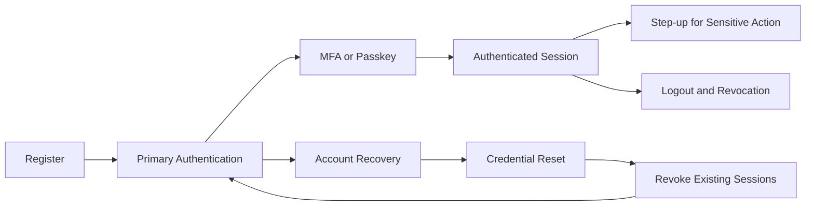

이 글은 2026년 8월 기준 OWASP(Open Worldwide Application Security Project, 오픈 월드와이드 애플리케이션 보안 프로젝트) Top 10:2025 A07 Authentication Failures와 NIST(National Institute of Standards and Technology, 미국 국립표준기술연구소) SP 800-63B-4, Spring Security 6.5 문서를 바탕으로 Java 21·Spring Boot 3 환경의 합성 예제를 설명합니다. 실제 고객, 계정, 내부 Endpoint, 운영 임계값과 탐지 규칙은 사용하지 않습니다.

## 1. 공격 이름에 따라 방어 축도 달라진다

모든 로그인 실패를 Brute Force 하나로 부르면 탐지와 제한 정책이 거칠어집니다.

- **Brute Force**: 한 계정에 많은 비밀번호를 시도하며 계정별 연속 실패가 주된 신호입니다. 계정 지연·단계적 제한·MFA로 대응합니다.
- **Credential Stuffing**: 유출된 ID·비밀번호 쌍을 여러 계정에 재사용합니다. 많은 계정에서 낮은 횟수의 실패와 일부 성공을 함께 보고, 유출 비밀번호 차단·다중 축 탐지·MFA를 적용합니다.
- **Password Spraying**: 흔한 비밀번호 하나를 많은 계정에 시도합니다. 동일 패턴이 넓은 계정 집합에 분산되는지 비밀번호·Network·Tenant 축으로 집계합니다.
- **Enumeration**: 계정 존재 여부를 메시지·상태·시간 차이로 구분합니다. Generic 응답과 비슷한 처리 경로로 관측 차이를 줄입니다.
- **Session Hijacking**: 탈취한 Session Secret을 인증 과정 없이 재사용합니다. Cookie 보호·회전·폐기·재인증을 함께 적용합니다.

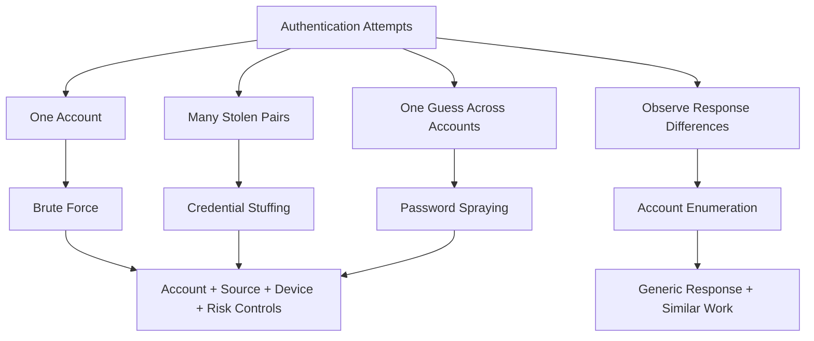

`IP(Internet Protocol, 인터넷 프로토콜) 주소당 5회` 같은 단일 규칙은 정상 사용자가 공유 NAT(Network Address Translation, 네트워크 주소 변환)를 쓰는 환경에서 오탐을 만들고, 공격자가 IP를 분산하면 우회됩니다. 계정, Network, Device Signal, Tenant와 시간 창을 함께 보되 어느 신호도 단독 신원 증명으로 사용하지 않습니다.

## 2. 인증 경계를 Endpoint가 아닌 수명주기로 Inventory한다

로그인만 점검하면 더 약한 대체 경로를 놓칩니다.

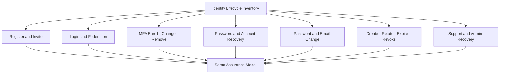

각 흐름에 다음 계약을 작성합니다.

1. 사용자가 증명해야 하는 현재 인증 수준은 무엇인가?
2. 새 자격 증명이나 Factor를 어떤 계정과 목적에 Bind하는가?
3. 실패·재시도·동시 요청은 어떤 결과를 만드는가?
4. 기존 Session과 다른 기기는 언제 폐기하는가?
5. 사용자에게 어떤 알림을 보내고 어떤 감사 Event를 남기는가?
6. Help Desk와 Admin이 정상 통제를 우회할 수 있는가?

가장 약한 복구 경로가 실질적인 인증 강도입니다. Passkey를 사용해도 상담원이 공개 정보만으로 MFA를 해제한다면 공격자는 Passkey를 공격할 이유가 없습니다.

## 3. 계정 존재 여부를 응답으로 알려주지 않는다

다음 구현은 존재하지 않는 계정에서 즉시 반환하므로 메시지뿐 아니라 처리 시간도 계정 존재 여부를 노출합니다.

```java
Account account = accountRepository.findByLoginId(request.loginId())
    .orElseThrow(() -> new AccountNotFoundException());

if (!passwordEncoder.matches(request.password(), account.passwordHash())) {
    throw new WrongPasswordException();
}
```

외부 응답은 동일하게 만들고, 계정이 없을 때도 같은 Algorithm과 Work Factor의 Dummy Hash를 검증해 비싼 경로를 맞춥니다.

```java
@Service
final class PasswordAuthenticator {
    private static final String GENERIC_FAILURE =
        "입력한 정보로 인증할 수 없습니다.";

    private final AccountRepository accounts;
    private final PasswordEncoder passwordEncoder;
    private final String dummyPasswordHash;

    AuthenticationResult authenticate(LoginCommand command) {
        Optional<Account> candidate = accounts.findByNormalizedLoginId(
            LoginId.normalize(command.loginId()));

        String storedHash = candidate
            .map(Account::passwordHash)
            .orElse(dummyPasswordHash);

        boolean passwordMatches = passwordEncoder.matches(
            command.password(), storedHash);

        if (candidate.isEmpty() || !passwordMatches) {
            throw new GenericAuthenticationException(GENERIC_FAILURE);
        }

        Account account = candidate.orElseThrow();
        account.requireLoginAllowed();
        return AuthenticationResult.primaryFactorPassed(account.publicId());
    }
}
```

Dummy Hash는 운영 Password Hash와 같은 Algorithm·비용을 사용하고 Configuration에서 안전하게 주입합니다. 이 패턴이 Network 전체의 정확한 Constant Time을 보장한다고 표현해서는 안 됩니다. DB Cache, Account 상태 확인과 Runtime Scheduling의 차이는 남습니다. 목표는 관측 가능한 차이를 줄이고 Test로 분포를 감시하는 것입니다.

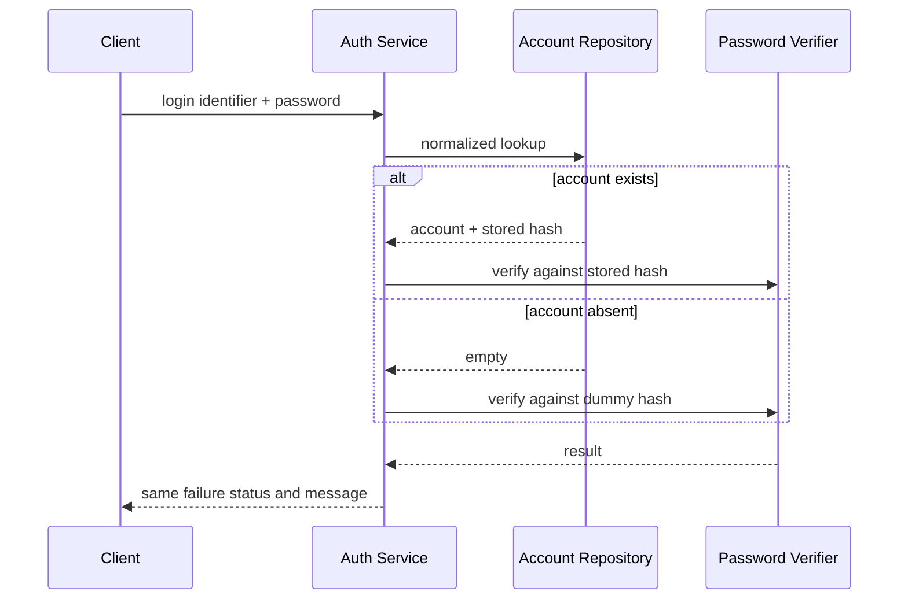

회원가입, 초대, 비밀번호 찾기에도 `등록된 이메일입니다` 같은 차별 응답을 피합니다. 다만 사용자가 이미 인증된 자기 계정 설정 화면에서는 필요한 정보를 숨길 이유가 없습니다. Threat Model에 따라 공개 경계와 인증된 경계를 구분합니다.

## 4. 문자열 정규화는 인증 규칙으로 명시한다

로그인 ID나 Email의 대소문자, Unicode와 공백 처리를 화면마다 다르게 하면 중복 계정과 우회가 생깁니다.

```java
record LoginId(String value) {
    static LoginId normalize(String raw) {
        if (raw == null) {
            throw new InvalidLoginRequestException();
        }

        String normalized = java.text.Normalizer
            .normalize(raw.strip(), java.text.Normalizer.Form.NFC)
            .toLowerCase(java.util.Locale.ROOT);

        if (normalized.length() < 3 || normalized.length() > 254) {
            throw new InvalidLoginRequestException();
        }
        return new LoginId(normalized);
    }
}
```

Email 주소의 모든 부분에 임의의 Provider별 규칙을 적용하지 않습니다. 저장·검색·Unique Constraint가 동일한 Canonicalization 계약을 사용하고, 규칙 변경 시 기존 계정 충돌을 Migration 전에 검사합니다.

## 5. 비밀번호 정책은 길이·Blocklist·관리 도구 중심으로 설계한다

NIST SP 800-63B-4는 Single-factor 비밀번호에 최소 15자, MFA의 일부로 쓰는 비밀번호에 최소 8자를 요구하고, 최소 64자 이상의 최대 길이 허용을 권고합니다. 또한 임의의 조합 규칙과 근거 없는 주기 변경을 요구하지 말고, 흔하거나 유출된 비밀번호를 Blocklist와 비교하도록 합니다.

서비스의 규제·위험 기준이 NIST와 다를 수 있으므로 수치를 복사하기 전에 적용 범위를 확인해야 합니다. 공통 설계 원칙은 다음과 같습니다.

- 긴 Passphrase와 Password Manager 생성을 허용합니다.
- 붙여넣기를 막지 않습니다.
- 흔한 값, 서비스명, 사용자 식별자와 유출된 값을 설정·변경 시 차단합니다.
- 비밀번호가 유출됐다는 증거가 있을 때 변경을 요구합니다.
- 복잡도 조합 규칙만으로 강도를 판단하지 않습니다.
- 안전한 Hash 저장은 BLOG-54의 Argon2id·Legacy Migration 경계를 따릅니다.

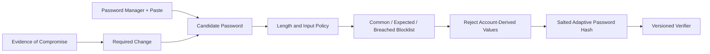

유출 비밀번호 조회를 외부 API로 보낼 때 원문 비밀번호나 전체 Hash가 나가지 않도록 제공자의 공식 Privacy Protocol을 확인하고, 장애 시 정책을 명시합니다. 외부 조회가 실패했다는 이유로 사용자의 원문을 Log에 남기지 않습니다.

## 6. Rate Limit은 실패 횟수보다 공격 비용을 설계한다

단순 영구 잠금은 공격자가 피해자의 계정을 반복 시도해 서비스 거부를 일으키는 수단이 됩니다. 실패가 누적될수록 지연을 늘리고, 위험이 높으면 추가 Challenge나 복구 흐름으로 전환하며, 사용자에게 안전한 알림과 복구 수단을 제공합니다.

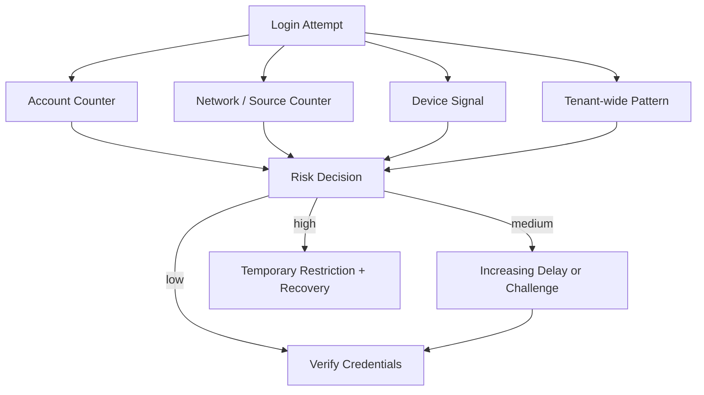

```java
record AuthenticationSignals(
        LoginId loginId,
        String sourceBucket,
        String deviceSignal,
        String tenantBucket) {}

sealed interface AttemptDecision {
    record Allow() implements AttemptDecision {}
    record Delay(java.time.Duration duration) implements AttemptDecision {}
    record RequireChallenge(String challengeId) implements AttemptDecision {}
    record TemporarilyRestrict(java.time.Duration retryAfter)
        implements AttemptDecision {}
}

interface AuthenticationAttemptPolicy {
    AttemptDecision evaluate(AuthenticationSignals signals, java.time.Instant now);
    void recordFailure(AuthenticationSignals signals, FailureClass failureClass);
    void recordSuccess(AuthenticationSignals signals);
}
```

Source IP는 Proxy가 전달한 값을 그대로 믿지 말고 신뢰한 Edge가 정규화한 값만 사용합니다. Device Fingerprint는 Spoofing 가능하고 개인정보 문제가 있으므로 위험 신호일 뿐 인증 Factor가 아닙니다. CAPTCHA 역시 자동화를 비싸게 만드는 보조 통제이지 유일한 방어가 아닙니다.

## 7. 성공과 실패 기록이 새로운 공격 경로가 되지 않게 한다

외부에는 Generic 실패를 반환해도 내부에서는 정책 판단과 사고 대응에 필요한 이유를 구분합니다.

```java
record AuthenticationAuditEvent(
    java.time.Instant occurredAt,
    String correlationId,
    String pseudonymousAccountId,
    String sourceBucket,
    String outcome,
    String internalReason,
    String policyVersion
) {}
```

다음 값은 인증 Log에 기록하지 않습니다.

- 비밀번호·OTP·Recovery Code 원문
- Session ID, Access Token, Refresh Token과 Reset Token
- 전체 Cookie와 Authorization Header
- 필요 없는 Email·전화번호·Device 원문
- Stack Trace에 포함된 Secret

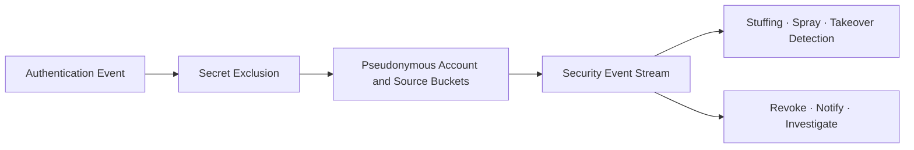

Generic 외부 응답과 상세 내부 관측은 충돌하지 않습니다. 단, 내부 사유가 사용자에게 노출되는 Error Body, Header나 Redirect Parameter로 흘러가지 않게 계약 Test를 둡니다.

## 8. MFA는 등록·변경·복구까지 같은 강도로 보호한다

MFA는 Factor를 하나 더 입력받는 화면이 아니라 Factor 수명주기입니다.

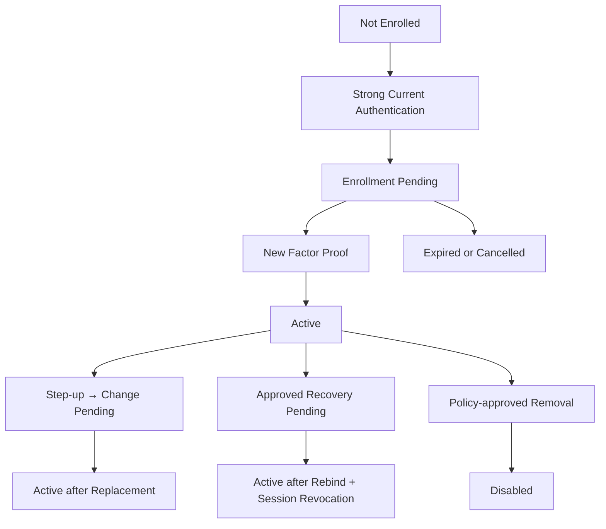

Factor 등록·교체·삭제에는 다음을 강제합니다.

1. 최근의 강한 인증 또는 Step-up 인증
2. 새 Factor의 실제 소유 증명
3. 이전 Factor와 복구 수단에 대한 알림
4. 중요한 변경 후 기존 Session 재평가 또는 폐기
5. 변경 Event의 감사 기록
6. `MFA 서버 장애`를 이유로 자동 우회하지 않는 Failure Policy

Passkey는 WebAuthn(Web Authentication API, 웹 인증 API)과 FIDO2(Fast Identity Online 2) 표준을 기반으로 공개키를 사용해 인증 결과를 서비스 Domain에 Bind하므로 Phishing-resistant(피싱 저항성) 인증을 제공할 수 있습니다. NIST는 수동으로 입력하는 OTP(One-Time Password, 일회용 비밀번호)를 피싱 저항성으로 보지 않습니다. 따라서 민감 업무에는 Passkey 같은 피싱 저항성 방식을 우선 제공하고, TOTP(Time-based One-Time Password, 시간 기반 일회용 비밀번호)·Recovery Code는 위험과 사용자 접근성을 고려한 Fallback으로 설계합니다.

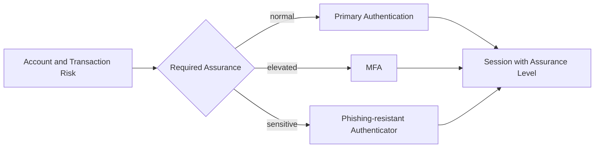

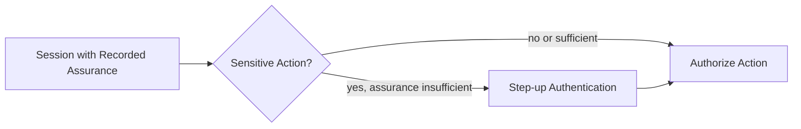

SMS OTP는 전화망과 번호 이동 공격의 위험이 있어 고위험 기능의 유일한 대안으로 삼지 않습니다. 생체정보는 보통 Device에서 개인키 사용을 활성화하는 Local Factor이며, Server로 생체 원문을 전송해 별도 Password처럼 저장하는 구조와 구분합니다.

## 9. Recovery Code는 비밀번호처럼 저장하고 한 번만 사용한다

Recovery Code가 Database에 평문으로 저장되거나 여러 번 사용 가능하면 MFA를 약화합니다.

```java
@Transactional
public RecoveryResult consume(
        AccountId accountId,
        String presentedCode,
        java.time.Instant now) {

    RecoveryCodeSet codes = recoveryCodes.lockByAccountId(accountId)
        .orElseThrow(GenericRecoveryException::new);

    RecoveryCode matched = codes.findUnusedMatch(
        presentedCode, recoveryCodeVerifier);

    if (matched == null || matched.isExpiredAt(now)) {
        throw new GenericRecoveryException();
    }

    matched.consumeAt(now);
    audit.recordRecoveryCodeConsumed(accountId, matched.publicId());
    return RecoveryResult.requireFactorRebind();
}
```

Recovery Code는 CSPRNG로 충분히 긴 값을 생성하고 Adaptive Hash 또는 적절한 Keyed Hash로 검증용 값만 저장하며, 사용 여부를 원자적으로 변경합니다. Code 목록은 생성 시 한 번만 보여주고, 재발급하면 기존 목록을 폐기합니다.

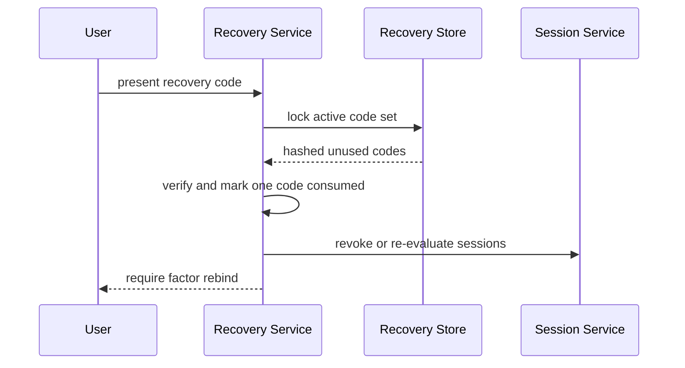

## 10. 비밀번호 재설정은 독립된 인증 Protocol이다

비밀번호 찾기 흐름은 다음 두 단계로 분리합니다.

```mermaid
flowchart LR
    request["Reset Request"] --> generic["Same Response and Similar Work"]
    generic --> side["Send Token via Approved Side Channel"]
    side --> present["Present Random Single-use Token"]
    present --> validate["Verify Purpose · Account · Expiry · Unused"]
    validate --> reset["Set New Password"]
    reset --> revoke["Revoke Existing Sessions"]
    revoke --> notify["Notify Account Owner"]
    notify --> login["Require Normal Login"]
```

Reset Token에는 다음 계약이 필요합니다.

- CSPRNG로 생성한 예측 불가능한 값
- 계정과 `PASSWORD_RESET` 목적에 Binding
- 짧고 명확한 만료 시간
- Database에는 원문 대신 검증용 Digest 저장
- 한 번의 원자적 소비
- 새 요청 발급 시 이전 Token 처리 정책
- Host Header에 의존하지 않는 고정된 허용 Origin Link
- Query String Token이 Log·Referer에 남지 않도록 교환 후 안전한 Session으로 전환

```java
record ResetTokenDigest(byte[] value) {}

@Transactional
public void resetPassword(
        String rawToken,
        char[] newPassword,
        java.time.Instant now) {

    ResetTokenDigest digest = resetTokenDigester.digest(rawToken);
    PasswordResetGrant grant = resetGrants.lockActiveByDigest(digest)
        .orElseThrow(GenericRecoveryException::new);

    grant.requirePurpose("PASSWORD_RESET");
    grant.requireUsableAt(now);
    passwordPolicy.requireAllowed(newPassword, grant.accountId());

    Account account = accounts.lockById(grant.accountId())
        .orElseThrow(GenericRecoveryException::new);

    account.changePassword(passwordHasher.hash(newPassword), now);
    grant.consume(now);
    sessions.revokeAll(account.id(), RevocationReason.PASSWORD_RESET);
    audit.recordPasswordReset(account.publicId(), grant.publicId());
}
```

재설정 완료 후 자동 로그인하지 않고 정상 인증을 다시 요구합니다. 공격자가 Reset Link를 먼저 소비하려는 Race를 막기 위해 Token 소비, Password 변경과 Session 폐기를 하나의 일관된 업무 경계로 처리합니다.

## 11. Session Secret은 가장 강한 인증 결과와 같은 가치가 있다

OWASP는 Session ID가 인증된 상태를 이어주는 임시 자격 증명이므로 가장 강한 인증 방식과 동등한 보호가 필요하다고 설명합니다.

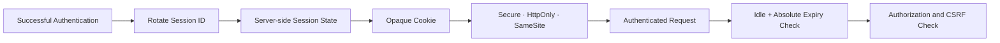

Browser 기반 Session의 기본 원칙은 다음과 같습니다.

- Session ID는 Framework가 CSPRNG(Cryptographically Secure Pseudorandom Number Generator, 암호학적으로 안전한 의사난수 생성기)로 생성한 Opaque 값으로 둡니다.
- Session ID를 URL, HTML, Log와 Analytics Parameter에 넣지 않습니다.
- HTTPS 전체 구간에서 `Secure`, `HttpOnly`, 적절한 `SameSite` Cookie를 사용합니다.
- Cookie 인증 요청에는 CSRF(Cross-Site Request Forgery, 사이트 간 요청 위조) 방어를 별도로 적용합니다.
- 인증 성공과 권한 상승 시 Session ID를 회전합니다.
- Logout, 만료와 자격 증명 변경 시 Server 상태를 폐기합니다.
- 민감 응답에는 적절한 `Cache-Control: no-store`를 적용합니다.
- Token을 장기적으로 `localStorage`에 보관하지 않습니다.

`SameSite`는 Browser와 업무 흐름에 따라 값을 선택해야 하며 CSRF Token을 대체하지 않습니다. 외부 Identity Provider Redirect가 필요한 흐름에서 `Strict`가 기능을 깨뜨릴 수 있으므로 통합 Test로 검증합니다.

## 12. Spring Security의 기본 보호를 유지하고 명시적으로 검증한다

Spring Security는 기본적으로 로그인 시 Session ID를 변경해 Session Fixation을 방어합니다. 보호를 끄지 않고 Test로 새 ID 발급과 이전 ID 무효화를 확인합니다.

```java
@Bean
SecurityFilterChain securityFilterChain(HttpSecurity http) throws Exception {
    http
        .authorizeHttpRequests(authorize -> authorize
            .requestMatchers("/login", "/account/recovery/**").permitAll()
            .requestMatchers("/account/security/**").authenticated()
            .anyRequest().authenticated())
        .csrf(org.springframework.security.config.Customizer.withDefaults())
        .sessionManagement(session -> session
            .sessionFixation(fixation -> fixation.changeSessionId())
            .maximumSessions(3)
            .maxSessionsPreventsLogin(false));

    return http.build();
}

@Bean
org.springframework.security.web.session.HttpSessionEventPublisher
httpSessionEventPublisher() {
    return new org.springframework.security.web.session.HttpSessionEventPublisher();
}
```

`maximumSessions(3)`은 합성 정책 예시일 뿐 운영 권장값이 아닙니다. `HttpSessionEventPublisher`는 Session 수명주기 Event를 동시 Session 제어에 반영합니다. `maxSessionsPreventsLogin(false)`는 새 로그인 시 기존 Session을 만료시키는 정책이므로 사용자 경험, 공유 기기와 탈취 대응 요구에 맞게 결정합니다.

```yaml
server:
  servlet:
    session:
      timeout: 30m
      cookie:
        http-only: true
        secure: true
        same-site: lax
```

Container의 `timeout`은 일반적으로 Idle Timeout입니다. 이것만 설정해 계속 사용되는 Session의 Absolute Timeout까지 보장된다고 가정하지 않습니다.

## 13. Idle Timeout과 Absolute Timeout을 분리한다

- Idle Timeout은 마지막 활동 이후 허용되는 비활성 시간입니다.
- Absolute Timeout은 활동 여부와 무관한 Session의 최대 수명입니다.

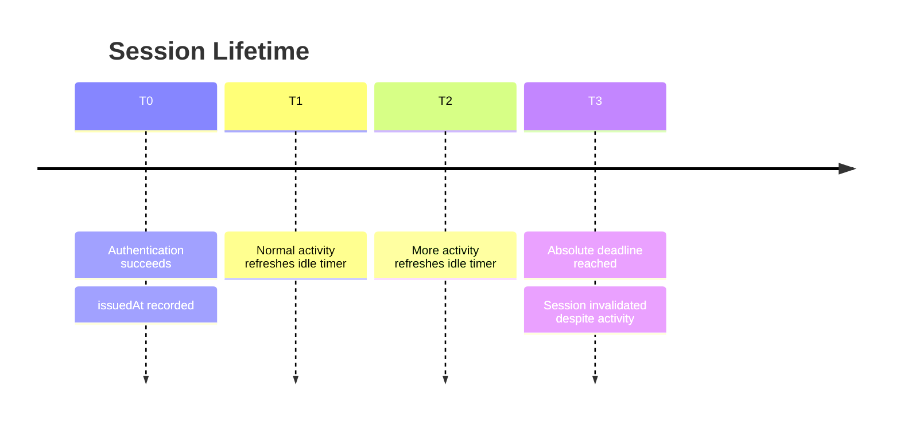

```java
final class AbsoluteSessionTimeoutFilter extends OncePerRequestFilter {
    private final java.time.Clock clock;
    private final java.time.Duration absoluteLifetime;

    @Override
    protected void doFilterInternal(
            HttpServletRequest request,
            HttpServletResponse response,
            FilterChain chain)
            throws ServletException, IOException {

        HttpSession session = request.getSession(false);
        if (session != null) {
            Object value = session.getAttribute("AUTHENTICATED_AT");
            if (value instanceof java.time.Instant authenticatedAt
                    && !clock.instant().isBefore(
                        authenticatedAt.plus(absoluteLifetime))) {
                session.invalidate();
                response.sendError(HttpServletResponse.SC_UNAUTHORIZED);
                return;
            }
        }
        chain.doFilter(request, response);
    }
}
```

`AUTHENTICATED_AT`은 인증 성공 시 Server가 설정하며 Client 입력에서 가져오지 않습니다. 분산 Session Store에서도 같은 값을 일관되게 읽고, Clock Skew와 경계 시각을 Test합니다.

## 14. 권한 상승과 민감 작업에는 Step-up 인증을 적용한다

오래된 Session이 있다고 결제수단 변경, MFA 제거와 관리자 기능까지 자동 허용하지 않습니다.

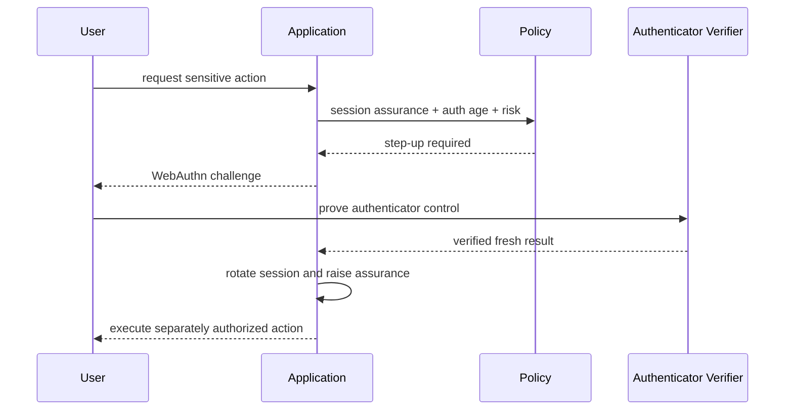

Step-up 성공은 인증 강도를 높일 뿐 업무 인가를 대신하지 않습니다. 새 Email, 수취 계좌나 MFA Factor 변경에는 대상 Resource, Actor 관계와 Transaction Risk를 다시 검사합니다.

## 15. Logout은 화면 이동이 아니라 Server-side 폐기다

```java
@PostMapping("/account/logout-all")
ResponseEntity<Void> logoutAll(
        @AuthenticationPrincipal AuthenticatedAccount principal,
        HttpServletRequest request,
        HttpServletResponse response) {

    sessionRevocationService.revokeAll(
        principal.accountId(), RevocationReason.USER_REQUEST);

    HttpSession current = request.getSession(false);
    if (current != null) {
        current.invalidate();
    }

    ResponseCookie expired = ResponseCookie.from("JSESSIONID", "")
        .httpOnly(true)
        .secure(true)
        .sameSite("Lax")
        .path("/")
        .maxAge(java.time.Duration.ZERO)
        .build();
    response.addHeader("Set-Cookie", expired.toString());
    response.addHeader("Clear-Site-Data", "\"cache\", \"cookies\", \"storage\"");
    return ResponseEntity.noContent().build();
}
```

Cookie 이름·Path·Domain은 실제 발급 설정과 정확히 일치해야 합니다. `Clear-Site-Data`는 지원 Browser와 서비스 Domain 범위를 확인해 적용합니다. Federated Login이나 Downstream Session은 Local Session 폐기만으로 종료되지 않을 수 있으므로 IdP·RP Logout 계약을 별도로 설계합니다.

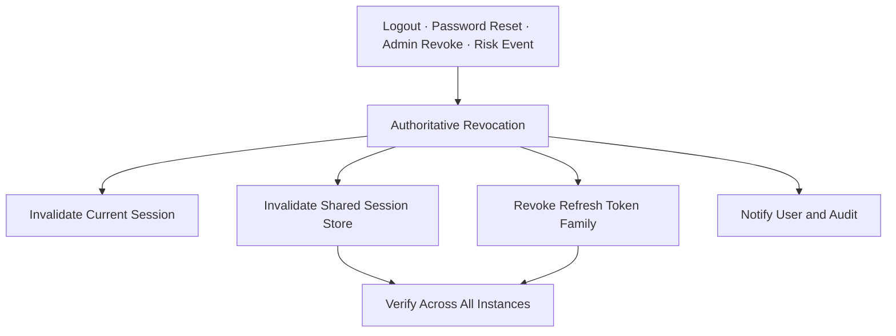

## 16. 분산 환경에서는 SessionRegistry의 범위를 확인한다

한 Application Instance의 Memory에만 SessionRegistry를 두면 다른 Instance의 Session을 즉시 폐기하지 못할 수 있습니다.

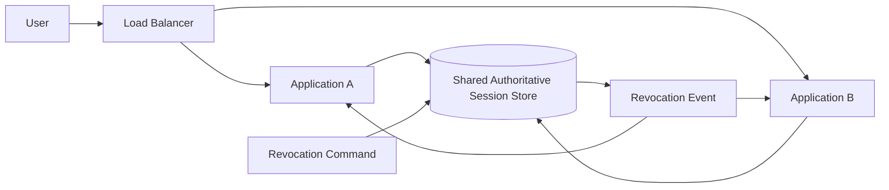

점검할 항목은 다음과 같습니다.

- 동시 Session 수 계산이 모든 Instance를 포함하는가?
- 폐기 Event가 늦거나 유실돼도 요청 시 Store 확인으로 차단되는가?
- Password 변경과 Account 정지 후 Revocation 전파 지연은 얼마인가?
- Cache 장애 시 인증이 Fail Open 되지 않는가?
- 배포·Failover 후 만료 정보가 유지되는가?

고위험 기능에서는 성능을 위해 복제한 Cache보다 권위 있는 상태를 우선합니다. 목표 시간은 운영 SLO(Service Level Objective, 서비스 수준 목표)로 정하고 측정하되 근거 없는 `즉시 폐기` 표현을 피합니다.

## 17. Stateless Token도 Session 수명주기를 없애지 않는다

JWT(JSON Web Token, JSON 웹 토큰)를 사용하면 Server Session이 사라진다고 생각하기 쉽지만, Logout·기기 관리·권한 변경·Refresh Token 탈취 대응에는 상태가 필요합니다.

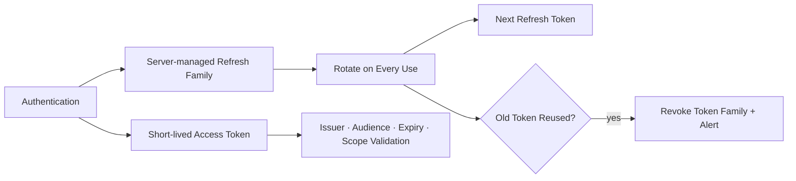

Browser Application이라면 HttpOnly Cookie와 BFF(Backend for Frontend, 프런트엔드 전용 백엔드) 구조가 JavaScript 저장소에 장기 Token을 노출하는 위험을 줄일 수 있습니다. 어떤 방식을 선택해도 다음은 필요합니다.

- Access Token의 Issuer, Audience, Signature, Expiry와 허용 Algorithm 검증
- 짧은 Access Token 수명과 명시적 Clock Skew
- Refresh Token 회전과 재사용 탐지
- Account·기기·Token Family 단위 폐기
- 권한 변경이 이미 발급된 Token에 반영되는 시점 정의

## 18. 실패 상태를 명시적으로 설계한다

인증 Provider, MFA와 Session Store가 장애일 때 `일단 허용`하는 Fallback은 보안 통제를 제거합니다.

- **Password Verifier 과부하**: 요청을 제한하고 Generic 실패로 응답합니다. Capacity와 Queue 대기를 관측합니다.
- **MFA Provider 장애**: MFA가 필요한 기능을 차단합니다. 사전 승인된 대체 Factor와 상태 공지 절차를 사용합니다.
- **Session Store 조회 실패**: 인증을 실패시키거나 범위가 제한된 안전 모드만 허용합니다. Failover Store와 Runbook을 준비합니다.
- **Revocation 전파 지연**: 고위험 작업을 재확인합니다. Authoritative Store 직접 조회와 지연 경보를 사용합니다.
- **Audit Sink 장애**: 정책에 따라 Buffering하거나 중요 작업을 차단합니다. Backpressure와 무결성 있는 재전송을 설계합니다.

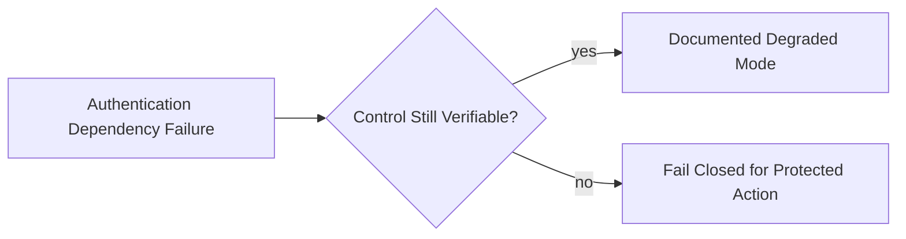

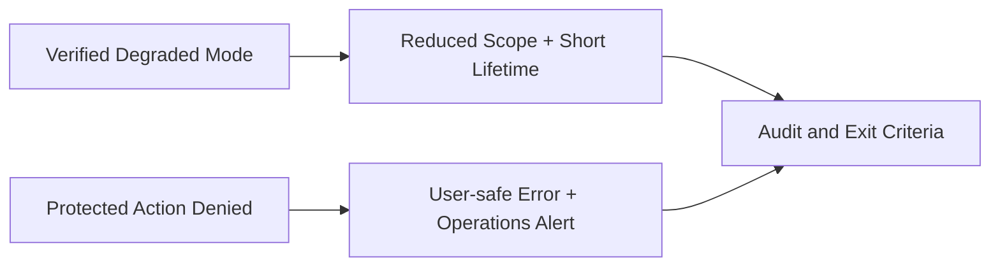

장애 대응 담당자가 MFA를 전역 해제하는 단축 절차를 갖지 않게 합니다. 대체 인증은 사전에 Threat Model, 승인 책임, 시간 제한과 감사 요건을 정의해야 합니다.

## 19. 자동화 Test는 정상 로그인보다 우회 경로를 먼저 확인한다

### 계정 열거 Test

- 존재/부재 계정의 HTTP Status, Error Code와 Body 크기가 같은가?
- 로그인·가입·초대·재설정에서 동일한 정책을 쓰는가?
- 여러 표본의 응답 시간 분포가 안정적으로 구분되지 않는가?
- Redirect Location과 Header가 내부 사유를 노출하지 않는가?

### 자동화 공격 Test

- 한 계정·여러 Source의 Brute Force를 제한하는가?
- 한 Source·여러 계정의 Password Spraying을 탐지하는가?
- 분산된 낮은 빈도의 Credential Stuffing을 집계하는가?
- IPv6 주소 회전과 Proxy Header 위조에 우회되지 않는가?
- 제한 정책이 피해자 계정의 영구 DoS를 만들지 않는가?

### MFA·복구 Test

- MFA 등록·변경·삭제에 최근 강한 인증을 요구하는가?
- OTP Replay와 시간 창 경계를 거부하는가?
- Recovery Code를 동시에 두 번 사용해도 한 번만 성공하는가?
- 복구가 기존 인증보다 약하지 않은가?
- MFA Provider 장애 시 조용히 우회하지 않는가?

### Session Test

- 로그인 후 Session ID가 변경되고 이전 ID는 사용할 수 없는가?
- 권한 상승 후 ID와 Assurance가 올바르게 갱신되는가?
- Idle Timeout과 Absolute Timeout이 독립적으로 동작하는가?
- Logout·Password 변경·관리자 폐기가 모든 Instance에 반영되는가?
- Cookie Flag, CSRF와 Cache Header가 배포 환경에서도 유지되는가?

```mermaid
flowchart LR
    tests["Authentication Security Tests"] --> enumeration["Enumeration"]
    tests --> automation["Distributed Automation"]
    tests --> mfa["MFA and Recovery"]
    tests --> session["Fixation · Timeout · Revocation"]
    enumeration --> gate["Release Gate"]
    automation --> gate
    mfa --> gate
    session --> gate
```

Timing Test는 한 번의 Millisecond 비교로 판정하지 않습니다. 충분한 표본, 같은 Network 조건과 허용 Band를 정하고 Regression을 찾습니다.

## 20. 탐지는 계정 탈취 흐름을 재구성할 수 있어야 한다

보안 Event는 개별 실패 수를 넘어서 공격 유형을 구분할 수 있어야 합니다.

```mermaid
flowchart LR
    auth["Auth Events"] --> correlate["Correlate Account · Source · Device · Tenant"]
    correlate --> patterns["Brute · Stuffing · Spray · Session Reuse"]
    patterns --> triage["Risk Triage"]
    triage --> contain["Delay · Challenge · Revoke · Block"]
    contain --> notify["User Notification"]
    contain --> investigate["Incident Investigation"]
    investigate --> improve["Policy and Test Update"]
```

운영 Dashboard에는 다음을 검토합니다.

- 계정별·Source Bucket별 실패와 성공 전환
- 많은 계정에 퍼지는 동일 유형의 실패
- MFA 실패 후 Password 성공이 반복되는 Pattern
- 새 Device·지역 신호와 민감 작업의 결합
- Password Reset, Factor 변경과 Session 폐기의 연속 Event
- 폐기된 Session 또는 Refresh Token 재사용
- Revocation 전파 지연과 Store 오류

민감한 위치와 Device 정보는 수집 목적, 최소화, 보존 기간과 접근 권한을 먼저 정합니다. 탐지 편의를 이유로 불필요한 개인정보 원문을 장기 보관하지 않습니다.

## 21. 사고 대응은 폐기 범위와 사용자 회복을 함께 설계한다

계정 탈취가 의심될 때 대응 순서는 다음처럼 준비합니다.

1. 의심 Session·Refresh Family를 폐기합니다.
2. 필요하면 계정 전체 Session과 Factor를 재평가합니다.
3. 변경된 Email·전화번호·MFA·복구 수단을 확인합니다.
4. 사용자가 안전한 Channel에서 계정을 회복하게 합니다.
5. 영향 범위와 공격 경로를 감사 Event로 재구성합니다.
6. Blocklist, Risk Policy, Test와 Runbook을 갱신합니다.

```mermaid
sequenceDiagram
    participant D as Detection
    participant I as Identity Service
    participant S as Session Store
    participant U as User
    participant O as Operations

    D->>I: suspected account takeover
    I->>S: revoke affected sessions and token families
    I->>U: out-of-band security notification
    I->>O: incident context without secrets
    U->>I: strong recovery and factor rebind
    I->>S: issue a new bounded session
    O->>O: update controls and regression tests
```

사용자에게 보내는 알림에도 전체 IP, 내부 Risk Score와 Token을 넣지 않습니다. 공격자가 Email을 바꾼 직후에는 이전 검증 Channel에도 변경 알림과 복구 안내를 보내는 정책을 검토합니다.

## 22. 흔한 오해를 Review에서 제거한다

- **IP Rate Limit이면 충분하다?** 분산 공격과 공유 NAT를 처리하지 못합니다. 계정·Source·Device·Tenant 다중 축을 함께 봅니다.
- **계정 잠금이 강할수록 안전하다?** 공격자가 피해자 계정을 잠글 수 있습니다. 지연·Challenge·복구를 포함한 단계 정책을 적용합니다.
- **OTP면 피싱에 안전하다?** 수동 입력 OTP는 Relay될 수 있습니다. 민감 기능에는 Passkey 같은 피싱 저항성 방식을 제공합니다.
- **MFA를 켰으니 복구는 간단해도 된다?** 약한 복구가 우회 경로가 됩니다. 복구도 같은 Assurance로 설계합니다.
- **Cookie를 지우면 Logout이다?** Server Session이 계속 유효할 수 있습니다. Server-side 폐기와 전파를 검증합니다.
- **JWT면 Session 관리가 필요 없다?** 폐기·Refresh·권한 변경 상태는 남습니다. 짧은 Access Token과 관리되는 Refresh Family를 사용합니다.
- **Idle Timeout이면 수명 제한이다?** 활동이 계속되면 무기한 유지될 수 있습니다. Absolute Timeout을 별도로 적용합니다.
- **Generic 메시지만 쓰면 열거가 막힌다?** Status·Header·Timing 차이는 남습니다. 전체 응답 계약과 처리 경로를 검증합니다.

## 23. Code Review Checklist

### 인증 입력과 응답

- [ ] 로그인 ID 정규화와 Unique Constraint가 같은 규칙을 사용한다.
- [ ] 계정 존재/부재에 같은 외부 Status·Code·Message를 반환한다.
- [ ] 존재하지 않는 계정도 같은 Password Hash 비용의 경로를 거친다.
- [ ] Password·OTP·Token·Cookie를 Log에 기록하지 않는다.

### 자동화 공격 방어

- [ ] 계정, Source, Device Signal과 Tenant를 함께 평가한다.
- [ ] 영구 잠금으로 계정 DoS를 만들지 않는다.
- [ ] CAPTCHA와 Device Fingerprint를 단독 통제로 사용하지 않는다.
- [ ] Credential Stuffing과 Password Spraying을 별도 Pattern으로 탐지한다.

### 비밀번호·MFA·복구

- [ ] 흔하거나 유출된 비밀번호를 설정·변경 시 차단한다.
- [ ] 임의의 주기 변경과 불필요한 조합 규칙에 의존하지 않는다.
- [ ] 민감 업무에 피싱 저항성 인증 Option을 제공한다.
- [ ] MFA 등록·변경·삭제에 Step-up과 사용자 알림을 적용한다.
- [ ] Recovery Code는 안전하게 Hash하고 원자적으로 한 번만 소비한다.
- [ ] 비밀번호 재설정 Token은 목적·계정·만료에 Bind한다.

### Session

- [ ] 인증 성공과 권한 상승 시 Session ID를 회전한다.
- [ ] Session ID는 Cookie로만 전달하고 URL과 Log에 넣지 않는다.
- [ ] Secure·HttpOnly·SameSite·CSRF 정책을 통합 Test한다.
- [ ] Idle·Absolute Timeout을 각각 검증한다.
- [ ] Logout·Password 변경·관리자 폐기가 모든 Instance에 반영된다.
- [ ] Token 기반 구조도 Refresh 회전·재사용 탐지·폐기 상태를 관리한다.

### 운영

- [ ] 인증 의존성 장애 시 Fail-open 경로가 없다.
- [ ] 공격 Pattern과 Revocation 지연을 관측한다.
- [ ] 개인정보 수집·보존·접근을 최소화한다.
- [ ] 계정 탈취 대응 Runbook과 사용자 회복 절차를 훈련한다.

## 마무리

Authentication Failures를 막는 핵심은 로그인 Controller에 조건을 더하는 것이 아닙니다.

```mermaid
flowchart LR
    lifecycle["Identity Lifecycle"] --> generic["Non-enumerating Responses"]
    generic --> resistance["Multi-dimensional Attack Resistance"]
    resistance --> mfa["Strong MFA and Recovery"]
    mfa --> session["Rotated · Bounded · Revocable Sessions"]
    session --> test["Negative Tests"]
    test --> observe["Detection and Recovery"]
```

안전한 인증 시스템은 다음 질문에 일관되게 답할 수 있어야 합니다.

- 공격자가 계정 존재 여부를 알아낼 수 있는가?
- 자동화 시도의 비용을 여러 축에서 높이는가?
- MFA보다 약한 등록·변경·복구 경로가 있는가?
- 인증 결과인 Session을 생성부터 폐기까지 보호하는가?
- 모든 Application Instance에서 폐기가 실제로 동작하는가?
- 실패와 사고 후 사용자가 안전하게 회복할 수 있는가?

Password, MFA, Passkey와 Session은 서로 다른 기능이 아니라 하나의 인증 보증 사슬입니다. 그중 가장 약한 경로를 찾아 같은 정책·Test·관측으로 묶는 것이 A07 대응의 출발점입니다.

다음 글에서는 OWASP Top 10:2025 A08을 기준으로 안전하지 않은 역직렬화, Artifact·Update 서명과 중요한 Data 변경의 무결성을 다룹니다.

## 공식 참고자료

- [OWASP Top 10:2025 A07 Authentication Failures](https://owasp.org/Top10/2025/A07_2025-Authentication_Failures/)
- [OWASP Authentication Cheat Sheet](https://cheatsheetseries.owasp.org/cheatsheets/Authentication_Cheat_Sheet.html)
- [OWASP Credential Stuffing Prevention Cheat Sheet](https://cheatsheetseries.owasp.org/cheatsheets/Credential_Stuffing_Prevention_Cheat_Sheet.html)
- [OWASP Multifactor Authentication Cheat Sheet](https://cheatsheetseries.owasp.org/cheatsheets/Multifactor_Authentication_Cheat_Sheet.html)
- [OWASP Forgot Password Cheat Sheet](https://cheatsheetseries.owasp.org/cheatsheets/Forgot_Password_Cheat_Sheet.html)
- [OWASP Session Management Cheat Sheet](https://cheatsheetseries.owasp.org/cheatsheets/Session_Management_Cheat_Sheet.html)
- [NIST SP 800-63B-4 Digital Identity Guidelines: Authentication and Authenticator Management](https://pages.nist.gov/800-63-4/sp800-63b.html)
- [Spring Security 6.5 Authentication Persistence and Session Management](https://docs.spring.io/spring-security/reference/6.5/servlet/authentication/session-management.html)
