# Software or Data Integrity Secure Coding: 역직렬화·Update·Artifact 무결성

무결성(Integrity)은 데이터가 깨지지 않았다는 뜻만이 아닙니다. 시스템이 사용하는 Software, Configuration, Update와 업무 데이터가 **기대한 출처에서 왔고, 승인된 내용이며, 전달 과정에서 바뀌지 않았고, 지금 사용해도 되는 상태**임을 확인하는 성질입니다.

파일의 Hash가 일치해도 공격자가 그 Hash까지 바꿀 수 있다면 신뢰할 수 없습니다. Digital Signature가 유효해도 오래된 취약 Version을 재전송한 것이라면 안전한 Update가 아닙니다. JSON 문법이 올바르더라도 Client가 `role=ADMIN`을 넣을 수 있다면 중요한 데이터의 의미적 무결성이 깨집니다.

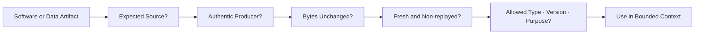

이 글은 2026년 8월 기준 OWASP(Open Worldwide Application Security Project, 오픈 월드와이드 애플리케이션 보안 프로젝트) Top 10:2025 A08 Software or Data Integrity Failures를 바탕으로 Java 21·Spring Boot 3 환경의 합성 예제를 설명합니다. 실제 고객, 제품, Artifact, 서명 Key, 내부 Repository와 배포 정책은 사용하지 않습니다.

## 1. 먼저 용어를 같은 의미로 맞춘다

이 글에서 반복되는 약어와 표준은 첫 등장에 영문 전체 명칭과 한국어 의미를 함께 사용합니다.

- **OWASP (Open Worldwide Application Security Project)** — 웹 애플리케이션 보안 공개 프로젝트입니다.
- **SBOM (Software Bill of Materials)** — 소프트웨어 자재 명세서입니다.
- **BOM (Bill of Materials)** — 제품을 구성하는 자재·구성요소 명세서입니다.
- **CI/CD (Continuous Integration and Continuous Delivery)** — 지속적 통합과 지속적 전달입니다.
- **DTO (Data Transfer Object)** — 계층 간 입력을 제한하는 데이터 전달 객체입니다.
- **JVM (Java Virtual Machine)** — 자바 바이트코드를 실행하는 가상 머신입니다.
- **VEX (Vulnerability Exploitability eXchange)** — 취약점 악용 가능성 교환 문서입니다.
- **SLSA (Supply-chain Levels for Software Artifacts)** — 소프트웨어 산출물 공급망 보안 수준 체계입니다.
- **TOCTOU (Time of Check to Time of Use)** — 검사 시점과 사용 시점 사이의 변경 문제입니다.
- **SRI (Subresource Integrity)** — 웹 하위 리소스 무결성 검사입니다.

영문 용어를 없애는 것이 목표가 아닙니다. 처음 읽는 사람이 약어의 뜻을 추측하지 않아도 되고, 공식 문서를 검색할 때 정확한 영문 명칭을 사용할 수 있게 하는 것이 목표입니다.

## 2. A03 공급망 실패와 A08 무결성 실패를 구분한다

OWASP Top 10:2025는 A03 Software Supply Chain Failures와 A08 Software or Data Integrity Failures를 구분합니다.

- **A03 Software Supply Chain Failures** — 공급망에서 어떤 구성요소와 과정이 위험한지를 묻습니다. 취약 의존성, 악성 Package, 불완전한 SBOM과 Build 환경 침해가 대표 사례입니다.
- **A08 Software or Data Integrity Failures** — 받아온 Software·Data를 왜 신뢰하는지를 묻습니다. 서명 없는 Update, 검증 없는 Artifact, 안전하지 않은 역직렬화와 변조된 중요 데이터가 대표 사례입니다.

BLOG-53은 Dependency, SBOM, 서명과 Release Gate를 공급망 관리 관점에서 설명했습니다. 이번 글은 Runtime과 배포 경계에서 **신뢰 증거를 실제로 검증하는 코드와 상태 전이**에 집중합니다.

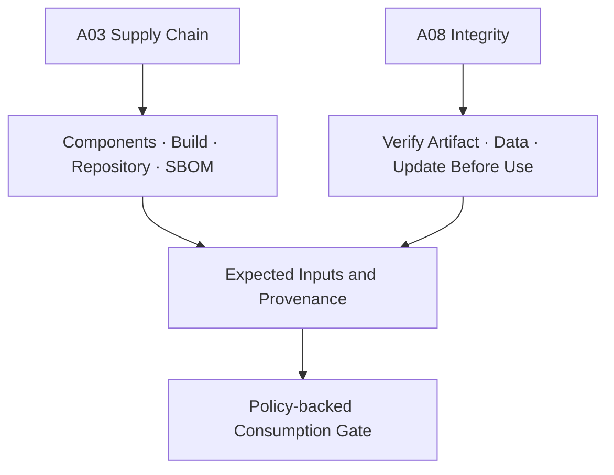

SBOM이 존재한다고 Artifact가 변조되지 않았다는 뜻은 아닙니다. Signature가 유효하다고 모든 Dependency가 안전하다는 뜻도 아닙니다. 서로 다른 증거를 결합해야 합니다.

## 3. 출처 이름보다 검증 가능한 증거를 신뢰한다

다음 문장은 보안 통제가 아닙니다.

- 우리 Repository에서 받았으니 안전하다.
- HTTPS로 다운로드했으니 변조되지 않았다.
- 내부 Queue에서 왔으니 믿어도 된다.
- JSON이라 Java Serialization보다 무조건 안전하다.
- 서명된 파일이니 실행해도 된다.

Transport Security는 전송 구간을 보호하지만, 잘못된 발행자 권한·Repository 침해·오래된 정상 Artifact 재생까지 해결하지 않습니다.

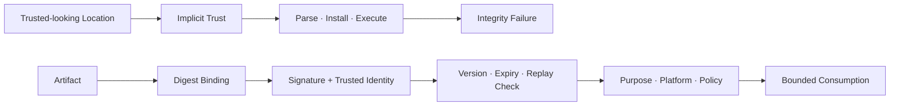

신뢰 판단은 `어디에서 받았는가`와 함께 다음을 확인해야 합니다.

1. 어떤 Byte를 검증했는가?
2. 누가 어떤 Key 또는 Identity로 승인했는가?
3. 서명된 내용이 Artifact Digest·Version·Platform·목적을 포함하는가?
4. 이전 정상 Version을 재생하는 Rollback을 막는가?
5. 검증한 바로 그 Byte를 사용하는가?

## 4. 역직렬화는 Data를 객체로 만드는 실행 경계다

Serialization(직렬화)은 객체나 데이터를 저장·전송 가능한 표현으로 바꾸는 과정이고, Deserialization(역직렬화)은 그 표현에서 객체를 복원하는 과정입니다.

문제는 일부 역직렬화 형식이 단순한 필드 복원을 넘어 다음 행동을 포함할 수 있다는 점입니다.

- 입력이 만들 Java Class 선택
- Constructor, Callback, `readObject`와 `readResolve` 호출
- 깊고 큰 Object Graph 생성
- Setter·Reflection을 통한 중요 속성 변경
- 알려진 Gadget Chain을 통한 예상하지 못한 동작

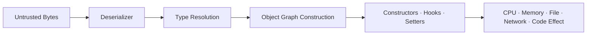

따라서 `문법을 Parse할 수 있다`와 `안전하게 객체로 만들 수 있다`는 다른 판단입니다.

## 5. Java Native Serialization을 신뢰되지 않은 입력에 사용하지 않는다

다음 코드는 HTTP Body가 Java Object Stream이라고 가정하고 바로 `readObject()`를 호출합니다.

```java
@PostMapping(
    path = "/imports/native",
    consumes = "application/x-java-serialized-object")
ResponseEntity<Void> importNative(HttpServletRequest request) throws Exception {
    try (ObjectInputStream input =
            new ObjectInputStream(request.getInputStream())) {
        Object command = input.readObject();
        importService.execute(command);
        return ResponseEntity.accepted().build();
    }
}
```

공격자는 Classpath에 존재하는 Type과 Object Graph를 선택할 수 있습니다. Business Validation은 객체 생성 이후에 실행되므로 생성 과정의 Side Effect와 자원 고갈을 막지 못합니다.

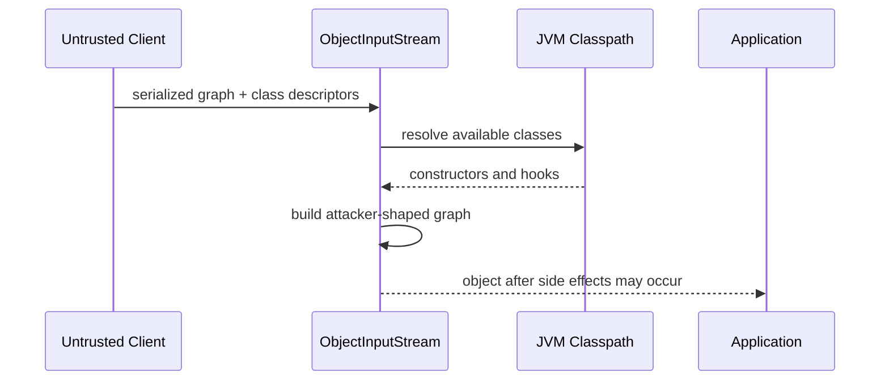

Oracle Java 21 문서도 신뢰되지 않은 데이터의 역직렬화는 본질적으로 위험하므로 피하라고 경고합니다. 가장 좋은 통제는 HTTP, Queue, Cache와 파일 경계에서 Java Native Serialization을 제거하는 것입니다.

## 6. 명시적인 JSON DTO로 입력 Type을 고정한다

JSON(JavaScript Object Notation, 자바스크립트 객체 표기법)도 자동으로 안전한 것은 아닙니다. 그러나 Client가 Java Class 이름을 선택하지 못하게 하고, Endpoint별 DTO(Data Transfer Object, 데이터 전달 객체)로 필드를 제한하면 검증 경계를 명확하게 만들 수 있습니다.

```java
record ImportItemRequest(
    @jakarta.validation.constraints.NotBlank
    String externalReference,

    @jakarta.validation.constraints.Positive
    int quantity
) {}

record ImportRequest(
    @jakarta.validation.constraints.Size(min = 1, max = 100)
    java.util.List<@jakarta.validation.Valid ImportItemRequest> items
) {}

@PostMapping(path = "/imports", consumes = "application/json")
ResponseEntity<Void> importItems(
        @Valid @RequestBody ImportRequest request,
        @AuthenticationPrincipal AuthenticatedActor actor) {

    ImportCommand command = importPolicy.toCommand(actor, request);
    importService.execute(command);
    return ResponseEntity.accepted().build();
}
```

DTO Validation은 문자열 길이와 개수뿐 아니라 다음 의미를 확인해야 합니다.

- 현재 Actor가 대상 Tenant와 Resource에 접근할 수 있는가?
- 공개 Reference가 실제 내부 ID와 안전하게 Mapping되는가?
- Quantity와 누적 작업량이 업무 Budget 이내인가?
- 중복 Reference와 동시 요청의 의미가 정의됐는가?
- Client가 보낸 역할·가격·승인 상태를 Server가 무시하는가?

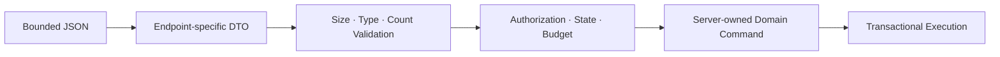

## 7. JSON의 Class 이름 기반 다형성을 열어두지 않는다

Jackson Databind의 Default Typing은 외부 입력이 Class 이름을 Type 정보로 사용할 수 있게 만들 수 있습니다. Jackson 공식 문서도 신뢰되지 않은 입력에 광범위한 Default Typing을 쓰는 것을 보안 위험으로 설명합니다.

취약한 방향은 다음과 같습니다.

```java
// 외부 JSON에 광범위한 Java Type 선택권을 주는 안티패턴
objectMapper.activateDefaultTyping(
    objectMapper.getPolymorphicTypeValidator(),
    ObjectMapper.DefaultTyping.EVERYTHING);
```

다형성이 꼭 필요하면 Java Class 이름 대신 작은 Business Type 식별자를 명시적으로 Mapping합니다.

```java
@com.fasterxml.jackson.annotation.JsonTypeInfo(
    use = com.fasterxml.jackson.annotation.JsonTypeInfo.Id.NAME,
    property = "type")
@com.fasterxml.jackson.annotation.JsonSubTypes({
    @com.fasterxml.jackson.annotation.JsonSubTypes.Type(
        value = EmailNoticeRequest.class, name = "email"),
    @com.fasterxml.jackson.annotation.JsonSubTypes.Type(
        value = PushNoticeRequest.class, name = "push")
})
sealed interface NoticeRequest
        permits EmailNoticeRequest, PushNoticeRequest {}
```

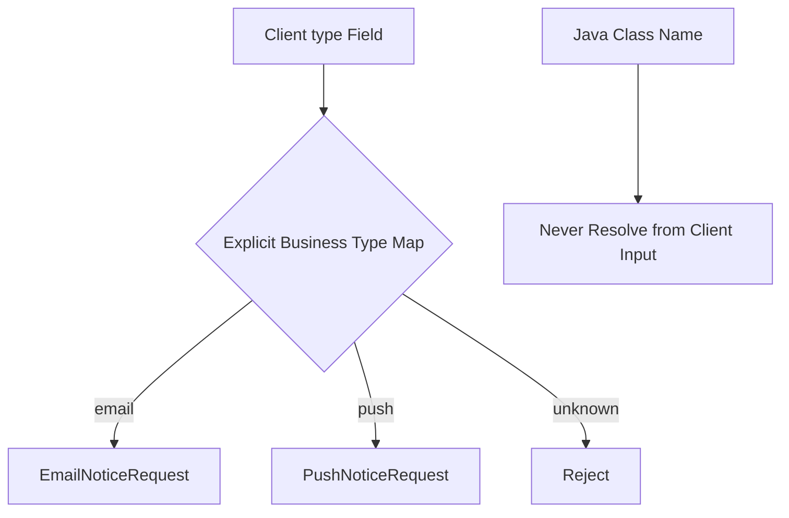

Allowlist에 포함된 Type도 필드와 자원 크기, 업무 권한을 별도로 검증합니다. `PolymorphicTypeValidator`는 필요한 경우 범위를 좁히는 보조 수단이지 외부 입력에 광범위한 Object Model을 공개하는 이유가 아닙니다.

## 8. ObjectMapper의 자원 경계를 명시한다

깊게 중첩된 JSON, 매우 긴 문자열과 거대한 배열은 Code Execution 없이도 CPU와 Memory를 소모할 수 있습니다.

```java
com.fasterxml.jackson.core.JsonFactory jsonFactory =
    com.fasterxml.jackson.core.JsonFactory.builder()
        .streamReadConstraints(
            com.fasterxml.jackson.core.StreamReadConstraints.builder()
                .maxNestingDepth(20)
                .maxStringLength(20_000)
                .maxNumberLength(100)
                .build())
        .build();

ObjectMapper objectMapper =
    com.fasterxml.jackson.databind.json.JsonMapper.builder(jsonFactory)
        .enable(DeserializationFeature.FAIL_ON_UNKNOWN_PROPERTIES)
        .enable(DeserializationFeature.FAIL_ON_TRAILING_TOKENS)
        .build();
```

수치는 합성 예제이며 운영 권장값이 아닙니다. 실제 Payload, Endpoint 역할과 앞단 HTTP Body Limit을 기준으로 정합니다. Parser 제한, Reverse Proxy 제한과 업무 Item 수 제한을 함께 적용합니다.

## 9. Legacy Java Serialization은 Filter를 마지막 방어선으로 둔다

즉시 제거할 수 없는 Legacy 경계에는 Java의 `ObjectInputFilter`로 Class와 Object Graph 자원 한도를 제한합니다.

```java
ObjectInputFilter filter = ObjectInputFilter.Config.createFilter(
    "maxdepth=10;maxrefs=1000;maxbytes=1048576;maxarray=10000;"
        + "com.example.transfer.*;java.base/*;!*");

try (ObjectInputStream input = new ObjectInputStream(stream)) {
    input.setObjectInputFilter(
        ObjectInputFilter.rejectUndecidedClass(filter));
    TransferEnvelope envelope = (TransferEnvelope) input.readObject();
    return legacyValidator.requireAllowed(envelope);
}
```

Oracle Java 21 기준 Serialization Filter는 기본 활성화가 아닙니다. System Property, Security Property 또는 `ObjectInputFilter` API(Application Programming Interface, 애플리케이션 프로그래밍 인터페이스)로 명시해야 합니다.

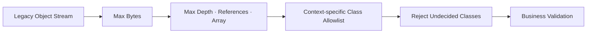

Filter가 Gadget-free를 증명하지는 않습니다. 허용 Package에 위험한 Class가 추가될 수 있고, `java.base/*`도 Use Case보다 넓을 수 있습니다. Migration 일정, 호출자 Inventory와 Negative Test를 함께 관리합니다.

## 10. Mass Assignment도 데이터 무결성 실패다

Mass Assignment(대량 속성 할당)는 외부 입력의 필드를 Domain Object에 자동 Binding해 Client가 수정하면 안 되는 속성까지 바꾸는 문제입니다.

```java
// 취약한 예: 외부 요청을 Entity에 직접 병합
objectMapper.readerForUpdating(accountEntity)
    .readValue(requestBody);
```

요청 DTO에는 변경 가능한 필드만 둡니다.

```java
record ProfileUpdateRequest(
    @jakarta.validation.constraints.Size(max = 80)
    String displayName,
    String locale
) {}

@Transactional
public void updateProfile(
        AuthenticatedActor actor,
        AccountId accountId,
        ProfileUpdateRequest request) {

    Account account = accounts.lockById(accountId)
        .orElseThrow(AccountNotFoundException::new);
    authorization.requireOwner(actor, account);

    account.changeProfile(
        profilePolicy.displayName(request.displayName()),
        profilePolicy.locale(request.locale()));
}
```

`role`, `tenantId`, `approved`, `price`, `balance`, `createdBy`와 감사 필드는 Request DTO에 넣지 않고 Server가 계산합니다.

## 11. Hash, MAC, Digital Signature의 역할을 구분한다

- **Hash** — 같은 Byte인지는 확인하지만 누가 Hash를 만들었는지는 증명하지 못합니다.
- **MAC** — 공유 Secret 보유자가 만든 데이터인지는 확인하지만 여러 보유자 중 정확히 누가 만들었는지는 구분하지 못합니다.
- **Digital Signature** — Private Key 보유자가 서명했는지는 확인하지만 내용의 안전성·최신성·권한 충분성까지 증명하지는 않습니다.

MAC(Message Authentication Code, 메시지 인증 코드)은 송신자와 수신자가 Secret을 공유합니다. Digital Signature(전자서명)는 Private Key로 서명하고 Public Key로 검증하므로 검증자에게 서명 권한을 주지 않을 수 있습니다.

먼저 Byte와 인증 주체를 검증합니다.

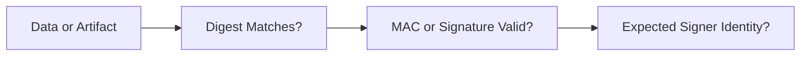

그 다음 최신성·목적·소비 정책을 확인합니다.

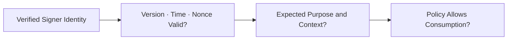

Signature 검증 성공을 곧바로 `안전`으로 해석하지 않습니다. 서명 권한이 탈취됐거나, 서명자가 실수로 잘못된 Artifact를 승인했거나, 오래된 정상 Version일 수 있습니다.

## 12. 서명 Envelope는 내용·목적·시간을 함께 Bind한다

중요 Data를 서명할 때 Payload만 서명하면 같은 Byte가 다른 기능에서 재사용될 수 있습니다.

```json
{
  "schemaVersion": 1,
  "purpose": "ACCOUNT_EXPORT_APPROVAL",
  "subjectId": "example-request-001",
  "issuedAt": "2026-08-01T00:00:00Z",
  "expiresAt": "2026-08-01T00:05:00Z",
  "nonce": "synthetic-random-value",
  "payloadDigest": "sha256:synthetic-digest",
  "keyId": "example-key-version-3",
  "signature": "synthetic-signature"
}
```

검증 순서는 다음과 같습니다.

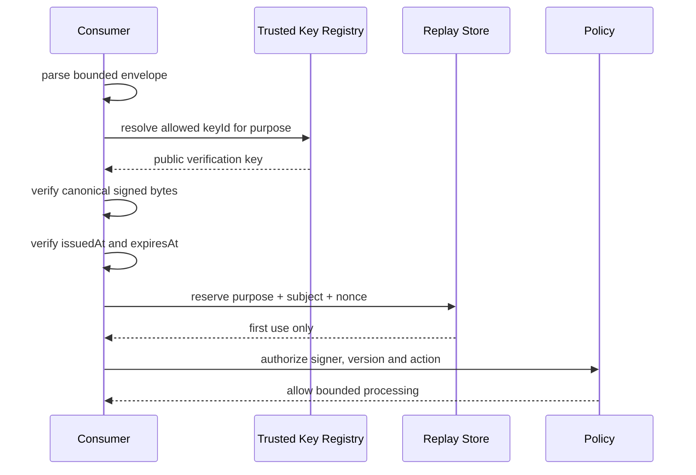

Canonicalization(정규화) 방식이 다르면 같은 의미의 JSON도 다른 Byte가 됩니다. 송신자와 수신자가 공유하는 Canonical Byte 규칙, Character Encoding과 Field 포함 범위를 Versioned Contract로 고정합니다.

## 13. Webhook은 원본 Byte와 재생 방지를 함께 검증한다

Webhook(웹훅)은 외부 시스템이 Event를 HTTP로 전달하는 방식입니다. Framework가 JSON을 객체로 바꾼 뒤 다시 직렬화한 값을 검증하면 원본 서명 대상과 달라질 수 있습니다.

```java
record VerifiedWebhook(
    String eventId,
    java.time.Instant occurredAt,
    byte[] rawBody
) {}

interface WebhookVerifier {
    VerifiedWebhook verify(
        String signatureHeader,
        String timestampHeader,
        String eventId,
        byte[] rawBody,
        java.time.Instant receivedAt);
}
```

Verifier는 Provider의 공식 계약에 따라 다음을 수행합니다.

1. HTTP Body 크기를 먼저 제한합니다.
2. 원본 Byte와 서명 Header를 보존합니다.
3. Timestamp 허용 창을 검사합니다.
4. 현재 Key와 승인된 이전 Key만 시도합니다.
5. Constant-time 비교로 MAC 또는 Signature를 확인합니다.
6. Event ID 또는 Nonce를 원자적으로 선점해 Replay를 차단합니다.
7. 검증 후에만 JSON DTO로 Parse합니다.

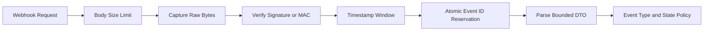

정상 Event 재시도와 공격 Replay를 구분하기 위해 멱등 처리 결과와 Replay Store 수명을 Provider의 재시도 계약에 맞춥니다.

## 14. 안전한 Update는 서명 하나가 아니라 상태 기계다

Update Manifest(업데이트 명세)는 설치할 Artifact의 Digest, 크기, Version, Platform과 만료 정보를 서명된 범위에 포함해야 합니다.

```json
{
  "manifestVersion": 1,
  "product": "example-agent",
  "releaseVersion": "4.2.0",
  "platform": "linux-amd64",
  "artifact": {
    "url": "https://updates.example.com/example-agent-4.2.0.bin",
    "size": 10485760,
    "digest": "sha256:synthetic-digest"
  },
  "minimumAllowedVersion": "4.0.0",
  "expiresAt": "2026-08-08T00:00:00Z",
  "keyId": "example-update-key-2",
  "signature": "synthetic-signature"
}
```

Manifest와 Artifact를 순서대로 검증하고 실패는 즉시 거부합니다.

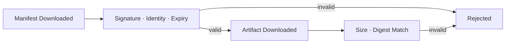

검증된 Artifact만 원자적으로 활성화하고 Health 결과에 따라 유지하거나 되돌립니다.

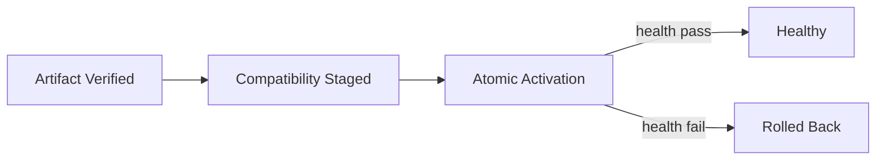

Update Client가 기억해야 할 상태도 있습니다.

- 마지막으로 수락한 Version 또는 Release Sequence
- 신뢰하는 Root·Signing Key Version
- 폐기된 Key와 허용된 Key Rotation 경로
- 마지막 성공 Update와 Rollback 가능 지점
- Update Metadata의 만료와 Freshness

서명만 검사하면 이전에 정상 서명된 취약 Version으로 내리는 Rollback Attack과 최신 Metadata 전달을 막는 Freeze Attack을 놓칠 수 있습니다.

## 15. 검증한 Byte와 사용하는 Byte를 같게 만든다

TOCTOU(Time of Check to Time of Use, 검사 시점과 사용 시점 사이의 변경)는 파일을 검증한 후 다시 경로로 열 때 공격자가 내용을 바꾸는 문제입니다.

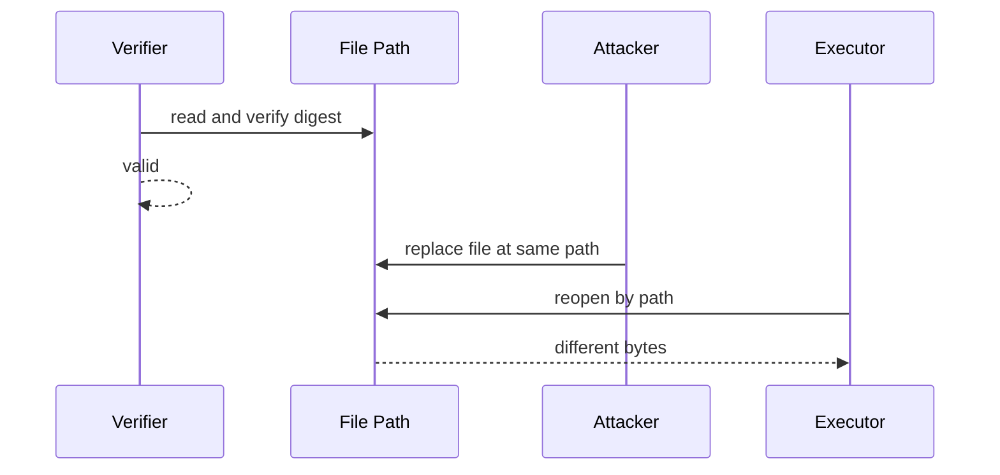

대응 원칙은 다음과 같습니다.

- 권한이 제한된 전용 임시 Directory에 다운로드합니다.
- Symbolic Link와 예상하지 못한 File Type을 거부합니다.
- Stream으로 Digest와 크기를 계산하면서 저장합니다.
- File을 닫은 뒤 필요하면 같은 저장물의 Digest를 다시 검증합니다.
- Content Digest를 이름으로 하는 Immutable Storage로 원자 이동합니다.
- 검증된 Handle 또는 변경 불가능한 Digest Reference를 후속 단계에 전달합니다.
- 실행 전에 권한, Owner와 Mount Policy를 확인합니다.

운영체제와 File System에 따라 안전한 Handle·Atomic Move 보장이 다르므로 단순한 `exists → hash → execute(path)` 순서를 보안 경계로 사용하지 않습니다.

## 16. CycloneDX를 사람이 읽을 수 있게 설명한다

CycloneDX(사이클론디엑스)는 OWASP Foundation(OWASP 재단)에서 시작되어 Ecma International TC54(Technical Committee 54, 기술위원회 54)와 함께 발전하는 **경량·확장형 BOM(Bill of Materials, 자재 명세서) 표준**입니다. 2026년 8월 기준 공식 Specification(명세) 최신판은 Version 1.7이며, Ecma International 표준인 ECMA-424로도 발행되어 있습니다.

Software 구성요소에 적용한 CycloneDX 문서를 SBOM(Software Bill of Materials, 소프트웨어 자재 명세서)이라고 합니다. SBOM은 Application에 어떤 Library와 Version이 들어 있는지, 직접·전이 Dependency 관계가 무엇인지, Hash와 License가 무엇인지 기계가 읽을 수 있게 표현합니다.

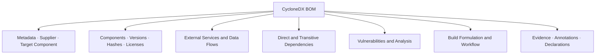

CycloneDX는 SBOM만 표현하는 형식이 아닙니다.

- **SBOM (Software Bill of Materials)** — Software 구성요소 Inventory를 설명합니다.
- **SaaSBOM (Software as a Service Bill of Materials)** — SaaS 서비스와 외부 의존 관계를 설명합니다.
- **CBOM (Cryptography Bill of Materials)** — 암호 Algorithm·Key·Certificate 자산을 설명합니다.
- **HBOM (Hardware Bill of Materials)** — Hardware 구성요소 Inventory를 설명합니다.
- **AI/ML-BOM (Artificial Intelligence and Machine Learning Bill of Materials)** — Model·Dataset·AI 구성요소 정보를 설명합니다.
- **VEX (Vulnerability Exploitability eXchange)** — 알려진 취약점이 해당 제품에서 실제 악용 가능한지에 대한 상태를 설명합니다.

`경량`은 정보가 적다는 뜻이 아니라 JSON, XML과 Protocol Buffers 같은 기계 판독 Format으로 자동화하기 쉽고, 필요한 Capability를 Module처럼 확장할 수 있다는 뜻으로 이해하는 편이 정확합니다.

## 17. CycloneDX SBOM의 최소 예제를 읽어본다

다음은 실제 조직 정보를 사용하지 않은 합성 CycloneDX JSON 예제입니다.

```json
{
  "bomFormat": "CycloneDX",
  "specVersion": "1.7",
  "serialNumber": "urn:uuid:11111111-2222-4333-8444-555555555555",
  "version": 1,
  "metadata": {
    "timestamp": "2026-08-01T00:00:00Z",
    "component": {
      "type": "application",
      "bom-ref": "pkg:maven/com.example/order-service@1.4.0",
      "group": "com.example",
      "name": "order-service",
      "version": "1.4.0",
      "purl": "pkg:maven/com.example/order-service@1.4.0"
    }
  },
  "components": [
    {
      "type": "library",
      "bom-ref": "pkg:maven/org.example/example-lib@2.3.1",
      "group": "org.example",
      "name": "example-lib",
      "version": "2.3.1",
      "purl": "pkg:maven/org.example/example-lib@2.3.1",
      "hashes": [
        {
          "alg": "SHA-256",
          "content": "0000000000000000000000000000000000000000000000000000000000000000"
        }
      ]
    }
  ],
  "dependencies": [
    {
      "ref": "pkg:maven/com.example/order-service@1.4.0",
      "dependsOn": [
        "pkg:maven/org.example/example-lib@2.3.1"
      ]
    }
  ]
}
```

위 SHA-256 값은 형식 검증을 위한 64자리 합성 값이며 실제 Artifact의 Digest가 아닙니다. PURL(Package URL, 패키지 URL)은 Package 생태계·이름·Version을 표준 방식으로 식별합니다. `bom-ref`는 BOM 내부의 Component와 Dependency Graph를 연결하는 Reference입니다. SHA-256(Secure Hash Algorithm 256-bit, 256비트 보안 해시 알고리즘) Hash는 Artifact Byte를 연결하는 데 사용하지만, Hash 값 자체의 신뢰 출처도 보호해야 합니다.

## 18. SBOM, Signature, Provenance, VEX를 섞지 않는다

- **SBOM** — 무엇이 들어 있는지 답하지만 누가 그 Artifact를 만들었는지는 증명하지 못합니다.
- **Signature** — 기대한 Signer가 이 Byte를 승인했는지 답하지만 Build 과정의 안전성까지 증명하지는 않습니다.
- **Provenance** — 어떤 Source·Builder·과정에서 만들었는지 답하지만 모든 Component의 무취약성을 보장하지는 않습니다.
- **VEX** — 알려진 취약점이 이 제품에서 악용 가능한지 답하지만 Artifact Byte의 무변조를 증명하지는 않습니다.

Provenance(출처 증명)는 Artifact의 Source와 Build 과정에 대한 진술입니다. SLSA(Supply-chain Levels for Software Artifacts, 소프트웨어 산출물 공급망 보안 수준 체계)는 Provenance를 기대 Policy와 대조해 실제로 검증해야 의미가 있다고 설명합니다.

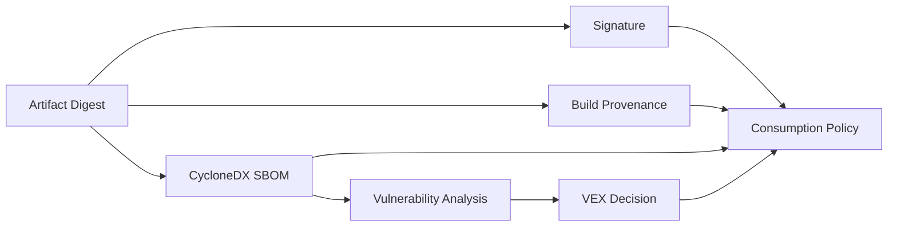

각 문서가 같은 Artifact Digest와 Release Identity를 가리키게 해야 합니다. File 이름이나 `latest` Tag만으로 연결하면 교체 공격과 혼동이 생깁니다.

## 19. Maven과 Gradle Build에서 SBOM을 생성한다

CycloneDX는 Maven과 Gradle용 공식 Plugin을 제공합니다. Plugin Version은 Build File 또는 Version Catalog에서 검토된 값으로 고정하고, 공식 Release Note를 확인해 갱신합니다.

Maven에서는 다음 Goal을 Release Build에 연결할 수 있습니다.

```bash
mvn org.cyclonedx:cyclonedx-maven-plugin:makeAggregateBom
```

Gradle에서는 Plugin을 적용한 뒤 다음 Task를 실행합니다.

```bash
./gradlew cyclonedxBom
```

명령 실행만으로 운영 가능한 SBOM이 완성되지는 않습니다.

- Runtime에 실제 포함되는 Dependency Scope를 확인합니다.
- Multi-module Aggregation의 누락을 검사합니다.
- Container Base Image와 OS Package는 별도 Scanner 결과와 연결합니다.
- 생성 Tool·Specification Version을 기록합니다.
- SBOM 자체를 Artifact Digest와 Release에 Bind합니다.
- Schema Validation과 Component Completeness Gate를 실행합니다.
- 공개용과 고객 전달용 SBOM의 민감한 Metadata를 검토합니다.

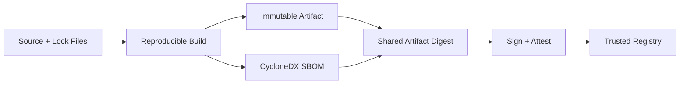

## 20. CI/CD에서는 생성보다 소비 검증을 Gate로 둔다

CI/CD(Continuous Integration and Continuous Delivery, 지속적 통합과 지속적 전달) Pipeline이 SBOM과 Signature를 생성해도 Deployment가 이를 확인하지 않으면 장식용 Metadata가 됩니다.

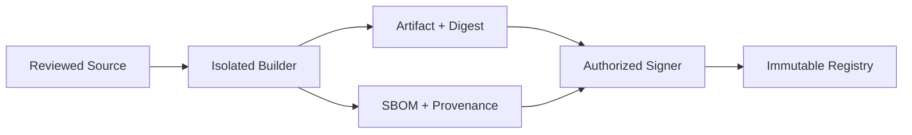

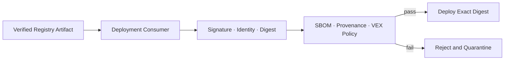

Deployment Gate는 다음을 확인합니다.

1. Image Tag를 Digest로 Resolve한 뒤 고정합니다.
2. Signature가 기대한 Identity·Issuer·Repository에 Bind됐는지 확인합니다.
3. Signature Payload의 Digest가 배포할 Artifact와 같은지 확인합니다.
4. Provenance의 Source Repository, Builder와 Workflow 조건을 Policy와 비교합니다.
5. CycloneDX SBOM의 Schema, 주 Component와 Dependency 관계를 확인합니다.
6. Risk Policy와 예외 승인·만료를 적용합니다.
7. 검증한 Digest를 그대로 Runtime에 배포합니다.

Sigstore Cosign은 Container Image, Blob과 Attestation 검증을 지원합니다. 명령 Option은 배포 환경의 Identity Provider와 Trust Root에 따라 달라지므로 예제 문자열을 그대로 복사하지 말고 공식 문서의 현재 계약을 적용합니다.

## 21. 외부 Script와 Plugin도 실행 전 무결성을 확인한다

CDN(Content Delivery Network, 콘텐츠 전송 네트워크) Script, Plugin과 Template은 Application 권한으로 실행될 수 있습니다.

Browser의 고정된 외부 Script에는 SRI(Subresource Integrity, 하위 리소스 무결성) Hash를 사용할 수 있습니다.

```html
<script
  src="https://cdn.example.com/library-4.2.0.min.js"
  integrity="sha384-BASE64_DIGEST_FROM_TRUSTED_BUILD_OUTPUT"
  crossorigin="anonymous"></script>
```

`BASE64_DIGEST_FROM_TRUSTED_BUILD_OUTPUT`은 구조를 보여주기 위한 자리표시자입니다. 실제 배포에서는 신뢰한 Build 결과로 계산한 Base64 Digest로 반드시 교체합니다.

SRI는 선언한 Byte와 일치하는지 검사하지만 다음을 대신하지 않습니다.

- Version 선택과 취약점 관리
- Script가 수행할 수 있는 권한 제한
- CSP(Content Security Policy, 콘텐츠 보안 정책)
- 같은 Origin에서 동적으로 생성되는 Content 검증
- Plugin의 Signature·Publisher·Compatibility Policy

가능하면 외부 실행 Code를 Build에 고정하고, Runtime 동적 Loading은 별도의 Signature와 Allowlist Gate 뒤에 둡니다.

## 22. 실패하면 이전 검증 상태를 조용히 재사용하지 않는다

- **Signature Service 장애**: 검증 없이 배포하지 않습니다. 검증 가능한 Bundle과 승인된 Offline 절차를 사용하거나 배포를 중단합니다.
- **Key Registry 장애**: 마지막 Key를 무기한 사용하지 않습니다. Cache 수명·폐기 정보·비상 정책을 명시합니다.
- **SBOM 생성 실패**: Artifact만 Release하지 않고 Release Gate를 실패시킵니다.
- **Vulnerability Feed 장애**: 취약점이 없다고 간주하지 않습니다. 상태를 `Unknown`으로 표시하고 Policy를 적용합니다.
- **Update Metadata 만료**: 오래된 Manifest를 사용하지 않고 Update를 중단하며 운영 경보를 발생시킵니다.
- **Replay Store 장애**: 중복 Event를 허용하지 않습니다. 중요 처리는 Fail Closed하거나 안전하게 Queueing합니다.

```mermaid
flowchart LR
    failure["Integrity Control Failure"] --> evidence{"Required Evidence Available?"}
    evidence -->|no| stop["Stop Protected Consumption"]
    evidence -->|yes| verify["Verify Cached or Offline Evidence"]
    verify --> valid{"Still Valid and Not Revoked?"}
    valid -->|no| stop
    valid -->|yes| bounded["Time-bounded Degraded Operation"]
```

```mermaid
flowchart LR
    stop["Protected Consumption Stopped"] --> alert["Operations Alert + Recovery Runbook"]
    bounded["Time-bounded Degraded Operation"] --> alert
```

`보안 검사 서버가 꺼졌으니 오늘만 통과` 같은 우회는 A08 통제를 제거합니다. 비상 절차도 승인 주체, 적용 범위, 만료와 사후 검증을 포함해야 합니다.

## 23. Negative Test로 변조·재생·Type 선택을 검증한다

### Deserialization Test

- Java Native Serialization Magic Byte를 HTTP·Queue 경계에서 거부하는가?
- JSON의 `@class`, 예상하지 않은 `type`과 알려지지 않은 Field를 거부하는가?
- 깊은 중첩·긴 문자열·큰 배열이 Parser Limit에서 차단되는가?
- Legacy ObjectInputFilter가 미등록 Class와 Resource 초과를 거부하는가?
- DTO에 없는 `role`, `tenantId`, `approved`가 Domain에 반영되지 않는가?

### Signature·Webhook Test

- Payload Byte 하나를 바꾸면 검증에 실패하는가?
- 다른 Purpose나 Tenant의 정상 서명을 재사용할 수 없는가?
- 만료 Timestamp, 미래 Timestamp와 이미 사용한 Nonce를 거부하는가?
- Key Rotation 중 현재·이전 Key의 허용 기간이 정확한가?
- JSON Parse 전에 원본 Byte를 검증하는가?

### Update·Artifact Test

- 정상 서명된 이전 Version의 Rollback을 차단하는가?
- Manifest의 Platform·크기·Digest와 실제 파일을 대조하는가?
- 검증 후 파일 교체를 시도해도 다른 Byte가 실행되지 않는가?
- Signature, SBOM 또는 Provenance가 없으면 배포가 실패하는가?
- Tag가 가리키는 Digest가 바뀌어도 검증한 Digest만 배포하는가?

```mermaid
flowchart LR
    mutate["Mutate Bytes · Type · Time · Version"] --> test["Negative Test Matrix"]
    test --> deserialize["Deserialization Rejection"]
    test --> replay["Replay Rejection"]
    test --> update["Rollback and TOCTOU Rejection"]
    test --> pipeline["Missing Evidence Rejection"]
    deserialize --> gate["Release Gate"]
    replay --> gate
    update --> gate
    pipeline --> gate
```

## 24. 탐지 Event는 검증 실패의 이유를 남긴다

외부 응답은 상세한 Trust Policy를 노출하지 않되 내부 Event는 대응에 필요한 이유를 구분합니다.

```java
record IntegrityVerificationEvent(
    java.time.Instant occurredAt,
    String correlationId,
    String artifactDigest,
    String evidenceType,
    String signerIdentity,
    String policyVersion,
    String outcome,
    String internalReason
) {}
```

Log에 다음을 남기지 않습니다.

- Private Key, MAC Secret과 원본 Credential
- 서명 대상에 포함된 개인정보 전체
- 검증 전 Webhook Body 전체
- 내부 Repository Credential과 임시 Download URL
- 보안 우회에 사용할 수 있는 상세 Allowlist

```mermaid
flowchart LR
    verify["Integrity Verification"] --> event["Structured Security Event"]
    event --> correlate["Artifact · Signer · Policy · Deployment"]
    correlate --> detect["Tampering · Replay · Rollback · Missing Evidence"]
    detect --> contain["Quarantine · Revoke · Stop Rollout"]
    contain --> investigate["Incident Investigation"]
```

## 25. 사고 대응은 신뢰 철회와 영향 범위를 함께 다룬다

Signing Key나 Build Identity 침해가 의심되면 다음 순서를 준비합니다.

1. 영향받은 Key·Certificate·Identity의 신뢰를 철회합니다.
2. 해당 Identity가 서명한 Artifact와 Data 범위를 Inventory합니다.
3. 배포 중인 Digest와 SBOM·Provenance를 대조합니다.
4. 안전한 이전 Version 또는 새로 검증한 Version으로 전환합니다.
5. Update Client가 폐기 정보를 실제로 수신했는지 확인합니다.
6. Replay Store와 중요한 Data 변경 Event를 조사합니다.
7. Root Cause에 맞춰 Key Rotation, Builder와 Policy를 갱신합니다.

```mermaid
sequenceDiagram
    participant D as Detection
    participant T as Trust Registry
    participant R as Artifact Registry
    participant P as Deployment Policy
    participant O as Operations

    D->>T: revoke compromised signer
    T->>R: identify affected digests
    R-->>P: artifacts + SBOM + provenance
    P->>O: block new deployment and list runtime impact
    O->>O: quarantine or roll back exact digests
    O->>T: activate reviewed replacement trust
```

File 이름과 Version 문자열만으로 영향 범위를 찾지 않습니다. Artifact Digest, Signer Identity, Build Run과 Deployment Event를 연결해야 합니다.

## 26. 흔한 오해를 Review에서 제거한다

- **JSON이면 역직렬화가 안전하다?** Class 선택·Mass Assignment·자원 고갈 위험은 남습니다. 고정 DTO·Type Map·Parser Limit을 적용합니다.
- **ObjectInputFilter면 해결된다?** 허용 Class의 Gadget과 업무 검증 문제는 남습니다. Native Serialization 제거를 우선합니다.
- **Hash가 같으면 출처도 맞다?** 공격자가 Hash도 바꿀 수 있습니다. 신뢰된 Signature·MAC과 Bind합니다.
- **Signature가 유효하면 안전하다?** 오래된 Version·잘못된 Signer·취약 Code일 수 있습니다. Identity·Freshness·Purpose·Policy를 함께 검증합니다.
- **SBOM이 있으면 Artifact가 안전하다?** SBOM은 Inventory이며 변조와 Build 출처를 단독으로 증명하지 않습니다. Signature·Provenance·VEX를 결합합니다.
- **HTTPS면 Update가 안전하다?** Server 침해·Rollback·잘못된 권한은 남습니다. 서명 Manifest와 Version 상태 기계를 적용합니다.
- **검증 후 같은 경로를 열면 된다?** TOCTOU로 Byte가 교체될 수 있습니다. Immutable Digest Reference와 Atomic Activation을 사용합니다.

## 27. Code Review Checklist

### 역직렬화

- [ ] 신뢰되지 않은 경계에서 Java Native Serialization을 사용하지 않는다.
- [ ] Endpoint·Event별 고정 DTO와 명시적인 Business Type Mapping을 사용한다.
- [ ] Jackson Default Typing을 외부 입력에 광범위하게 활성화하지 않는다.
- [ ] Body 크기·중첩·문자열·배열·Item 수 제한이 있다.
- [ ] Mass Assignment로 역할·Tenant·금액·승인 상태를 수정할 수 없다.
- [ ] Legacy `ObjectInputFilter`는 Class Allowlist와 자원 제한을 함께 사용한다.

### Data Signature와 Replay

- [ ] 검증 대상 Canonical Byte 계약이 Version으로 고정돼 있다.
- [ ] Signature·MAC이 Purpose, Subject, Timestamp와 Payload Digest를 Bind한다.
- [ ] 기대한 Signer Identity와 Key 상태를 확인한다.
- [ ] Expiry, Nonce와 Event ID로 Replay를 차단한다.
- [ ] Webhook은 Parse 전 원본 Byte를 검증한다.

### Update와 Artifact

- [ ] Manifest가 Version·Platform·크기·Digest·Expiry를 포함한다.
- [ ] Rollback·Freeze·Key Rotation 상태를 Client가 관리한다.
- [ ] 검증한 Byte와 실행·설치하는 Byte가 같다.
- [ ] Artifact를 Tag가 아니라 Immutable Digest로 배포한다.
- [ ] Signature 실패 시 조용히 검증을 우회하지 않는다.

### CycloneDX와 Pipeline

- [ ] CycloneDX SBOM이 Release Artifact Digest와 연결된다.
- [ ] 직접·전이 Dependency와 Multi-module 범위의 완전성을 검사한다.
- [ ] SBOM, Signature, Provenance와 VEX의 역할을 구분한다.
- [ ] Deployment Consumer가 모든 증거를 Policy로 검증한다.
- [ ] 예외 승인에는 Owner, 근거, 범위와 만료가 있다.

### 운영

- [ ] 변조·재생·Rollback·누락 증거를 구분해 관측한다.
- [ ] Key·Signer 침해 시 신뢰 철회와 영향 Digest 조회가 가능하다.
- [ ] 검증 Service 장애의 Fail-closed·Offline 정책이 문서화돼 있다.
- [ ] Incident 후 Policy와 Negative Test를 갱신한다.

## 마무리

Software or Data Integrity Failures를 막는 핵심은 `서명 사용`이나 `SBOM 생성` 같은 단일 체크가 아닙니다.

```mermaid
flowchart LR
    bounded["Bounded Deserialization"] --> identity["Trusted Producer Identity"]
    identity --> bytes["Digest-bound Exact Bytes"]
    bytes --> fresh["Freshness and Replay Control"]
    fresh --> evidence["SBOM + Signature + Provenance + VEX"]
    evidence --> consume["Policy-gated Consumption"]
    consume --> recover["Detect · Revoke · Recover"]
```

안전한 시스템은 다음 질문에 답할 수 있어야 합니다.

- 외부 입력이 어떤 Class와 속성을 만들 수 있는가?
- 검증한 Byte와 실제 사용하는 Byte가 같은가?
- Signature가 어떤 Identity·목적·Version에 Bind됐는가?
- 오래된 정상 Data와 Artifact의 Replay를 막는가?
- CycloneDX SBOM이 정확히 어느 Artifact Digest를 설명하는가?
- 검증 증거가 누락되거나 Key가 침해됐을 때 안전하게 멈추고 회복하는가?

무결성은 파일 하나의 Hash가 아니라 **생성 → 서명 → 전달 → 검증 → 사용 → 폐기** 전 과정의 Trust Contract입니다. 이 계약을 실행 Code, Deployment Gate, Negative Test와 운영 Event로 연결해야 A08 대응이 실제 통제가 됩니다.

다음 글에서는 OWASP Top 10:2025 A09를 기준으로 Log Forging, 민감정보 Masking, Security Event와 Alerting Playbook을 다룹니다.

## 공식 참고자료

- [OWASP Top 10:2025 A08 Software or Data Integrity Failures](https://owasp.org/Top10/2025/A08_2025-Software_or_Data_Integrity_Failures/)
- [OWASP Deserialization Cheat Sheet](https://cheatsheetseries.owasp.org/cheatsheets/Deserialization_Cheat_Sheet.html)
- [Oracle Java 21 Serialization Filters](https://docs.oracle.com/en/java/javase/21/core/java-serialization-filters.html)
- [Oracle Java 21 ObjectInputFilter API](https://docs.oracle.com/en/java/javase/21/docs/api/java.base/java/io/ObjectInputFilter.html)
- [Jackson ObjectMapper Default Typing Security Note](https://fasterxml.github.io/jackson-databind/javadoc/2.10/com/fasterxml/jackson/databind/ObjectMapper.DefaultTyping.html)
- [CycloneDX Specification Overview](https://cyclonedx.org/specification/overview/)
- [CycloneDX Authoritative Guide to SBOM](https://cyclonedx.org/guides/sbom/OWASP_CycloneDX-SBOM-Guide-en.pdf)
- [SLSA Build: Verifying Artifacts](https://slsa.dev/spec/v1.2/verifying-artifacts)
- [Sigstore Cosign: Verifying Signatures](https://docs.sigstore.dev/cosign/verifying/verify/)
