# Security Logging & Alerting Secure Coding: Log Forging·민감정보·탐지

공격을 차단하는 코드가 있어도 우회 시도를 기록하지 않으면 다음 공격을 알아채기 어렵습니다. Log를 남겨도 아무도 보지 않거나 Alert가 담당자에게 도착하지 않으면 대응은 시작되지 않습니다. Alert가 도착해도 무엇을 확인하고 차단해야 하는지 Playbook이 없으면 중요한 시간이 다시 사라집니다.

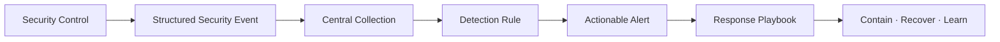

이 글은 2026년 8월 기준 OWASP(Open Worldwide Application Security Project, 오픈 월드와이드 애플리케이션 보안 프로젝트) Top 10:2025 A09 Security Logging and Alerting Failures와 OWASP Logging Cheat Sheet, NIST(National Institute of Standards and Technology, 미국 국립표준기술연구소) SP 800-61 Revision 3을 바탕으로 Java 21·Spring Boot 3 환경의 합성 예제를 설명합니다. 실제 고객, 계정, IP Address, 내부 URL, 운영 Log, 탐지 임계값과 대응 연락처는 사용하지 않습니다.

## 1. 먼저 용어와 책임을 구분한다

- **Log Record** — 발생한 사실을 기록한 로그 레코드입니다.
- **Audit Trail** — 중요 행위의 주체·대상·결과를 추적하는 감사 추적 기록입니다.
- **Monitoring** — 상태와 Event를 지속적으로 관찰합니다.
- **Detection** — 관찰한 신호에서 공격 가능성을 판별합니다.
- **Alerting** — 대응이 필요한 탐지 결과를 담당자에게 전달합니다.
- **Incident Response Playbook** — 경보별 확인·격리·복구 절차를 정한 사고 대응 실행서입니다.
- **SOC (Security Operations Center)** — 보안 운영 센터입니다.
- **SIEM (Security Information and Event Management)** — 보안 정보·이벤트 통합 관리 시스템입니다.
- **PII (Personally Identifiable Information)** — 개인 식별 정보입니다.
- **PHI (Protected Health Information)** — 보호 대상 건강 정보입니다.
- **CR (Carriage Return)** — 캐리지 리턴, `\r` 제어 문자입니다.
- **LF (Line Feed)** — 줄 바꿈, `\n` 제어 문자입니다.
- **MDC (Mapped Diagnostic Context)** — Log에 공통 문맥을 연결하는 진단 컨텍스트입니다.
- **UTC (Coordinated Universal Time)** — 협정 세계시입니다.

각 기능은 서로를 대신하지 않습니다.

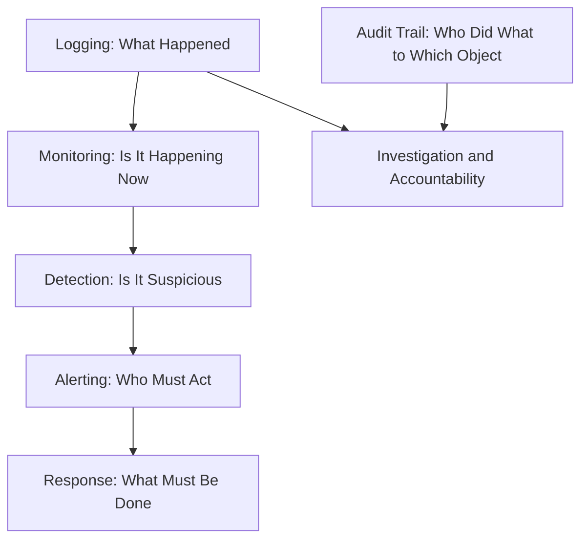

`Log가 있다`는 말만으로는 A09 대응이 아닙니다. 필요한 Event가 일관된 Schema로 생성되고, 변조와 유출로부터 보호되며, 탐지와 대응까지 연결돼야 합니다.

## 2. A09가 다루는 실패를 공격 흐름으로 본다

OWASP Top 10:2025 A09는 다음과 같은 실패를 포함합니다.

- 로그인·인가 실패와 중요 거래가 기록되지 않습니다.
- 성공만 기록하고 실패·우회 시도는 놓칩니다.
- Log에 Token, Password, 개인정보와 내부 오류가 들어갑니다.
- 외부 입력을 그대로 기록해 Log Forging과 분석기 Injection이 발생합니다.
- Log가 로컬에만 있고 삭제·변조·수집 중단을 알 수 없습니다.
- Alert 임계값, 담당자, Escalation과 Playbook이 없습니다.
- False Positive가 너무 많아 중요한 Alert가 묻힙니다.

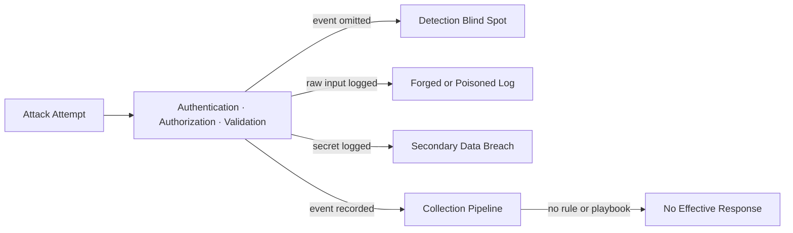

Logging은 공격 이후의 장식이 아니라 모든 Security Control이 성공과 실패를 설명하는 공통 계약입니다.

## 3. Threat Model에서 Security Event Inventory를 만든다

무엇을 기록할지 개발자가 그때그때 정하면 서비스마다 Event 이름과 의미가 달라집니다. Threat Model(위협 모델)과 Abuse Case(오용 사례)에서 기록 대상을 먼저 도출합니다.

- **인증** — 로그인 성공·실패, MFA 실패, 복구와 Token 폐기를 기록하고 결과를 `SUCCESS`·`DENY`·`LOCK`·`REVOKE`로 구분합니다.
- **인가** — 권한 거부, Tenant 불일치와 관리자 권한 변경을 기록하고 결과를 `ALLOW`·`DENY`로 구분합니다.
- **입력 검증** — Injection 의심, 파일 거부와 역직렬화 거부를 `REJECT` Event로 남깁니다.
- **업무 흐름** — 순서 위반, 중복 승인과 한도 초과를 `DENY`·`DEFER`로 구분합니다.
- **중요 데이터** — 생성·조회·변경·삭제·내보내기의 `SUCCESS`·`FAIL`을 기록합니다.
- **보안 설정** — 정책·Key·탐지 규칙·Log Level 변경의 `SUCCESS`·`FAIL`을 기록합니다.
- **운영** — 수집 중단, Queue 적체, 저장 실패와 Clock 이상을 `DEGRADED`·`FAIL`로 기록합니다.

Threat Model에서 Control과 필수 Event까지 먼저 연결합니다.

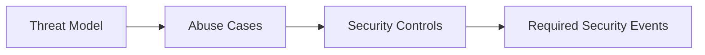

필수 Event는 Version 관리되는 Schema와 반복 검증으로 이어집니다.

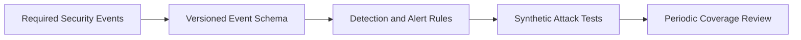

내부 시스템, 승인된 Penetration Test와 관리자도 Event 대상에서 제외하지 않습니다. 신뢰 주체라는 분류를 남길 수는 있지만 관측 자체를 생략하면 내부 오용과 침해 계정을 놓칩니다.

## 4. 문자열 메시지가 아니라 구조화 Event 계약을 만든다

다음과 같은 자유 문장은 검색과 탐지에 약합니다.

```text
Something went wrong for user kim
Access failed
Maybe malicious request
```

Event Type, Outcome, Reason Code와 문맥을 고정된 필드로 분리합니다.

```java
enum SecurityEventType {
    AUTHN_LOGIN_FAILURE,
    AUTHZ_ACCESS_DENIED,
    INPUT_VALIDATION_REJECTED,
    BUSINESS_SEQUENCE_REJECTED,
    SENSITIVE_DATA_EXPORTED,
    SECURITY_POLICY_CHANGED,
    LOG_PIPELINE_DEGRADED
}

enum SecurityOutcome {
    SUCCESS, ALLOW, DENY, REJECT, DEFER, LOCK, REVOKE, DEGRADED, FAIL
}

enum SecuritySeverity {
    INFO, LOW, MEDIUM, HIGH, CRITICAL
}

record SecurityEvent(
    int schemaVersion,
    String eventId,
    java.time.Instant occurredAt,
    java.time.Instant observedAt,
    String serviceRef,
    String instanceRef,
    String interactionId,
    String tenantRef,
    String actorRef,
    SecurityEventType eventType,
    SecurityOutcome outcome,
    String reasonCode,
    SecuritySeverity severity,
    String targetType,
    String targetRef,
    String sourceNetworkRef,
    String policyVersion
) {}
```

`eventId`는 재전송 중복 제거에 사용하는 Server 생성 식별자이고, `observedAt`은 Collector가 Event를 관측한 시각입니다. `serviceRef`와 `instanceRef`는 동일한 Event Type을 여러 배포 단위에서 생성할 때 누락 구간과 영향 범위를 찾는 데 사용합니다. 공격자가 보낸 값을 이 신뢰 필드에 직접 복사하지 않습니다.

Event의 식별·시간·실행 문맥을 먼저 고정합니다.

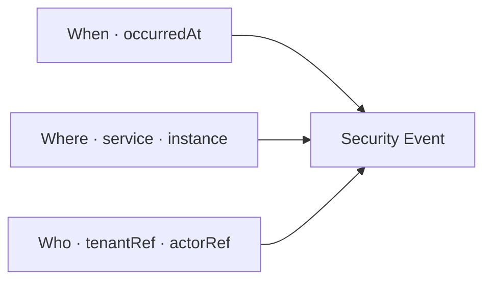

행위·결과·신뢰 문맥은 별도 안정 필드로 연결합니다.

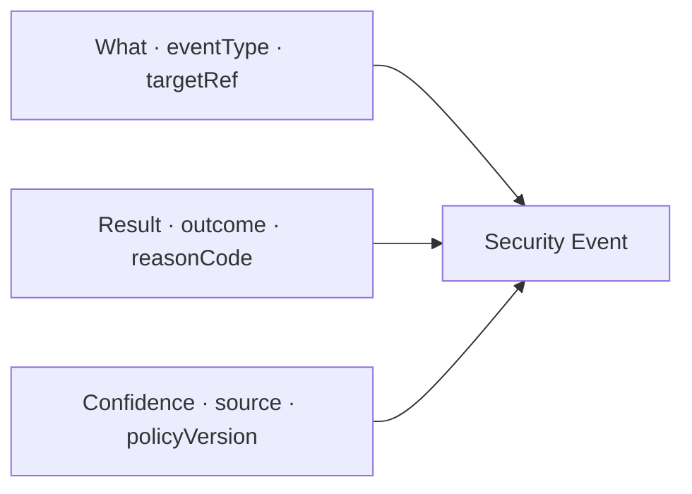

필드 이름과 Type, 최대 길이, Null 허용 여부, 개인정보 등급을 Schema로 관리합니다. 탐지 규칙은 자연어 문장이 아니라 `eventType`, `outcome`, `reasonCode`처럼 안정된 필드를 사용합니다.

## 5. Log Forging은 가짜 기록을 끼워 넣는 공격이다

Log Forging 또는 Log Injection은 공격자가 입력한 CR(Carriage Return, 캐리지 리턴), LF(Line Feed, 줄 바꿈), 구분자와 제어 문자가 Log 구조를 바꾸는 문제입니다.

```java
@PostMapping("/login")
ResponseEntity<Void> login(@RequestParam String username) {
    log.warn("Login failed for username=" + username);
    return ResponseEntity.status(401).build();
}
```

공격자가 다음 값을 전달했다고 가정합니다.

```text
guest\r\n2026-08-01 INFO Login succeeded for administrator
```

한 번의 실패 요청이 두 줄처럼 보이면서 가짜 성공 Event를 만들 수 있습니다. CSV, Syslog, Terminal Escape Sequence 또는 Log Viewer가 특별하게 해석하는 값도 후속 분석기를 속일 수 있습니다.

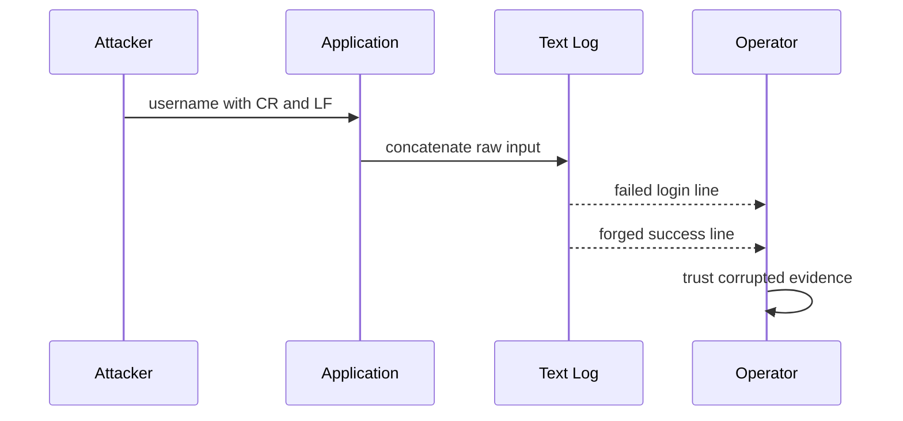

CWE(Common Weakness Enumeration, 공통 약점 목록)-117은 이를 Log 출력의 부적절한 중화 문제로 분류합니다.

## 6. 구조화 Logging과 출력 Encoding을 함께 사용한다

JSON(JavaScript Object Notation, 자바스크립트 객체 표기법) 구조화 Log는 필드를 분리하고 Encoder가 Quote와 Escape를 처리하게 합니다. 그러나 구조화 Format만 선택하면 끝나는 것은 아닙니다. 외부 값의 길이와 제어 문자를 제한하고, Log Collector가 기대하는 Encoding을 고정해야 합니다.

```java
final class LogFieldPolicy {
    private LogFieldPolicy() {}

    static String singleLine(String raw, int maxCodePoints) {
        if (maxCodePoints < 0) {
            throw new IllegalArgumentException("maxCodePoints must be non-negative");
        }

        String normalized = java.text.Normalizer.normalize(
            java.util.Objects.toString(raw, ""),
            java.text.Normalizer.Form.NFC);

        StringBuilder out = new StringBuilder();
        normalized.codePoints()
            .map(cp -> Character.isISOControl(cp)
                || cp == 0x2028 || cp == 0x2029
                || (cp >= 0x202A && cp <= 0x202E)
                || (cp >= 0x2066 && cp <= 0x2069) ? ' ' : cp)
            .limit(maxCodePoints)
            .forEach(out::appendCodePoint);
        return out.toString();
    }
}
```

```java
String safeActorRef = LogFieldPolicy.singleLine(actorRef, 80);
String safeReason = LogFieldPolicy.singleLine(reasonCode, 64);

log.atWarn()
    .addKeyValue("event_type", "AUTHN_LOGIN_FAILURE")
    .addKeyValue("outcome", "DENY")
    .addKeyValue("actor_ref", safeActorRef)
    .addKeyValue("reason_code", safeReason)
    .addKeyValue("interaction_id", interactionId)
    .log("Security control rejected authentication");
```

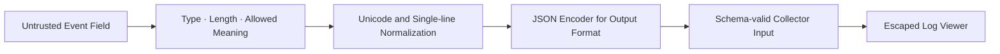

CR과 LF를 제거하는 것만으로 모든 Injection이 해결되지는 않습니다. JSON Encoder, Database Parameter Binding, Viewer의 HTML Encoding처럼 **최종 소비 Format에 맞는 출력 처리**가 필요합니다.

위 함수는 Log 표시용 보조 정책입니다. 인가·탐지 판단에 사용하는 `event_type`, `outcome`, `severity`, `reason_code`는 외부 문자열을 정리해 만들지 않고 Server가 허용된 Enum과 정책 결과에서 생성해야 합니다. 양방향 텍스트 제어 문자까지 표시용 필드에서 제한해 운영자가 화면 순서를 잘못 해석할 위험도 줄입니다.

## 7. 원본 값을 남기기 전에 필요한지부터 묻는다

Security Log는 공격 증거이면서 새로운 민감정보 저장소가 될 수 있습니다. OWASP Logging Cheat Sheet는 Password, Access Token, Session Identifier, Encryption Key, Database Connection String과 민감한 개인정보를 직접 기록하지 않도록 권고합니다.

- **Password·OTP** — 기록하지 않고 인증 실패 Reason Code만 남깁니다.
- **Access·Refresh Token** — 기록하지 않고 Token Type·발급자·폐기 결과만 남깁니다.
- **Session ID** — 원문을 기록하지 않습니다. 상관 분석이 필요하면 별도 Key 기반의 제한된 가명 Reference를 사용합니다.
- **이메일·전화번호** — 최소화하고 Masking 또는 목적 제한 가명 식별자를 사용합니다.
- **주민·건강·결제 정보** — 기록하지 않거나 엄격한 법적 검토를 거쳐 업무 Object의 비식별 Reference만 남깁니다.
- **HTTP Body** — 기본적으로 기록하지 않고 허용된 필드의 길이·개수·분류만 남깁니다.
- **Authorization·Cookie Header** — 기록하지 않고 Header 존재 여부와 검증 결과만 남깁니다.
- **Stack Trace** — 내부 제한 저장소에만 보관하고 외부 응답에는 Correlation Reference만 제공합니다.

수집 후보는 먼저 탐지·조사 목적과 데이터 분류를 확인합니다.

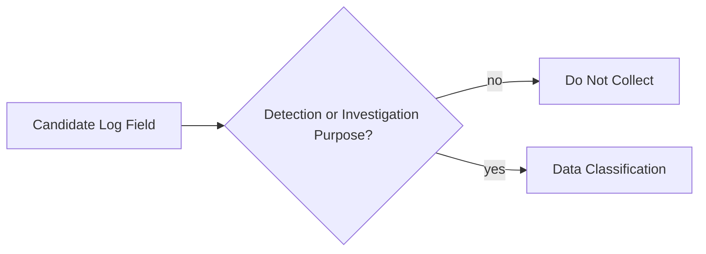

Secret이 아닌 필요한 정보만 최소화해 제한된 저장소로 보냅니다.

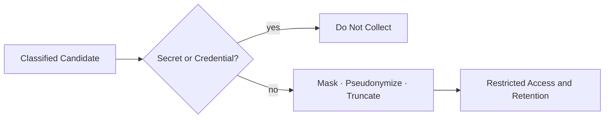

단순 SHA-256 Hash로 이메일이나 전화번호를 가명화하면 후보 값 대입으로 원문을 추측할 수 있습니다. 상관 분석이 꼭 필요하면 접근이 제한된 별도 Key 기반 HMAC(Hash-based Message Authentication Code, 해시 기반 메시지 인증 코드)을 검토하고, Key Rotation과 목적별 Domain Separation을 적용합니다.

## 8. URL, Header와 오류도 최소 정보만 기록한다

다음 값에는 의도하지 않은 Secret과 개인정보가 자주 섞입니다.

- Query String과 URL Fragment
- `Authorization`, `Cookie`, `Set-Cookie` Header
- Request·Response Body
- Database Exception과 SQL Parameter
- 임시 Download URL과 서명된 URL
- File Path, 내부 Hostname과 Network Address

```java
record SafeHttpEventFields(
    String method,
    String routeTemplate,
    int status,
    long requestBytes,
    String userAgentClass
) {}
```

실제 URL `/accounts/123?token=...` 대신 Route Template `/accounts/{accountId}`를 기록합니다. 오류 객체 전체를 자동 직렬화하지 않고 공개 가능한 Error Code와 내부 제한 Stack Trace를 분리합니다.

## 9. Interaction ID는 한 요청의 Event를 연결한다

한 사용자의 버튼 클릭이 API Gateway, Application, Queue Worker와 Database Audit Event로 이어질 수 있습니다. Interaction ID(상호작용 식별자)는 이 Event들이 같은 업무 상호작용에서 발생했음을 연결합니다.

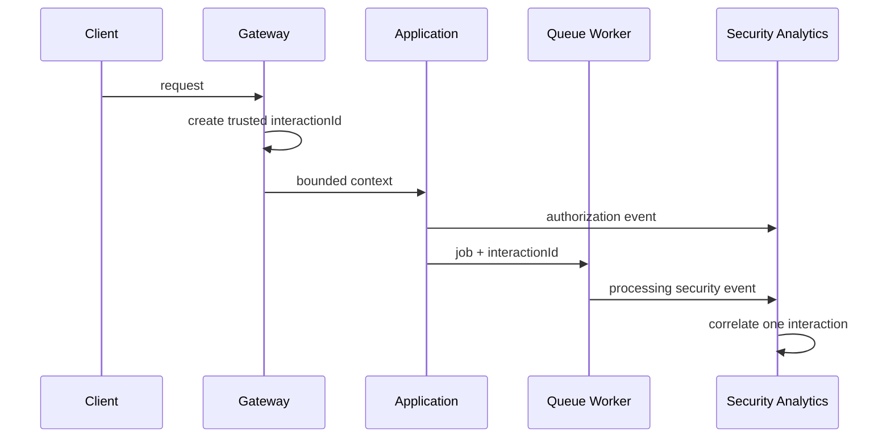

Client가 보낸 Correlation Header를 Log의 신뢰 식별자로 그대로 사용하지 않습니다. 형식과 길이를 검증한 외부 Reference와 Server가 생성한 내부 Interaction ID를 구분합니다. Trace ID는 성능 추적에 유용하지만 Security Event 보존·접근 정책과 항상 같지는 않으므로 목적을 분리합니다.

MDC(Mapped Diagnostic Context, 매핑된 진단 컨텍스트)를 사용할 때 Thread Pool과 비동기 경계에서 값이 다른 요청으로 누출되지 않도록 설정·복원·제거 수명주기를 Test합니다.

## 10. Spring Boot 구조화 Logging은 Format 계약으로 사용한다

Spring Boot의 현재 문서는 ECS(Elastic Common Schema, Elastic 공통 스키마), GELF(Graylog Extended Log Format, Graylog 확장 로그 형식)와 Logstash JSON 같은 구조화 Format을 지원합니다. 사용 가능한 기능과 Property는 적용한 Spring Boot Minor Version에서 확인해야 합니다.

```yaml
spring:
  application:
    name: example-security-service

logging:
  structured:
    format:
      console: ecs
```

위 설정은 구조화 Logging이 내장된 Spring Boot 3.4 이상 계열의 합성 예시입니다. 이전 Spring Boot 3 Minor Version에서는 승인된 JSON Encoder를 별도로 사용할 수 있습니다. 어느 방식을 사용하든 Event Schema와 민감정보 정책은 Logger 설정이 아니라 Application 계약으로 유지합니다.

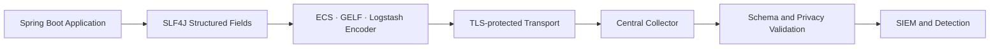

SLF4J(Simple Logging Facade for Java, 자바 단순 로깅 퍼사드)의 Fluent API에서 Key-Value를 사용해도 최종 Appender가 구조화 필드를 보존하는지 통합 Test로 확인합니다.

## 11. Diagnostic Log와 Audit Trail을 분리한다

Diagnostic Log는 장애 분석과 운영 관측이 목적이고, Audit Trail은 중요 행위의 책임 추적과 증거 보존이 목적입니다.

- **주목적** — Diagnostic Log는 장애·성능·운영 분석에, Audit Trail은 중요 행위·변경 추적에 사용합니다.
- **내용 변경** — Diagnostic Log는 Log Level에 따라 달라질 수 있지만 Audit의 필수 Event는 임의로 끌 수 없습니다.
- **보존** — Diagnostic Log는 운영 필요에 따라 비교적 짧게 보관할 수 있습니다. Audit Trail은 법·계약·위험 기준으로 별도 결정합니다.
- **접근** — Diagnostic Log는 운영자 중심의 권한을 적용하고 Audit Trail은 업무·보안·감사 역할별 최소 권한을 적용합니다.
- **무결성** — Diagnostic Log는 중앙 수집과 변조 방지를 적용합니다. Audit Trail은 Append-only·삭제 통제·증거 Chain을 더 강화합니다.

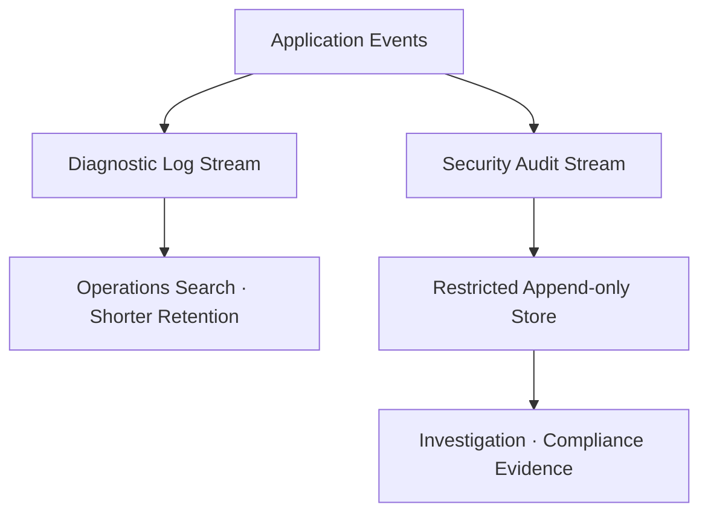

`DEBUG` Level을 끈다고 로그인 실패와 관리자 권한 변경 Audit Event까지 사라지면 안 됩니다. Audit 저장 실패가 중요 거래에 어떤 영향을 주는지도 업무 위험에 따라 명시적으로 결정합니다.

## 12. Log 무결성과 가용성을 별도로 보호한다

Log는 공격자의 흔적을 담기 때문에 삭제·변조·유출·Flooding의 표적이 됩니다.

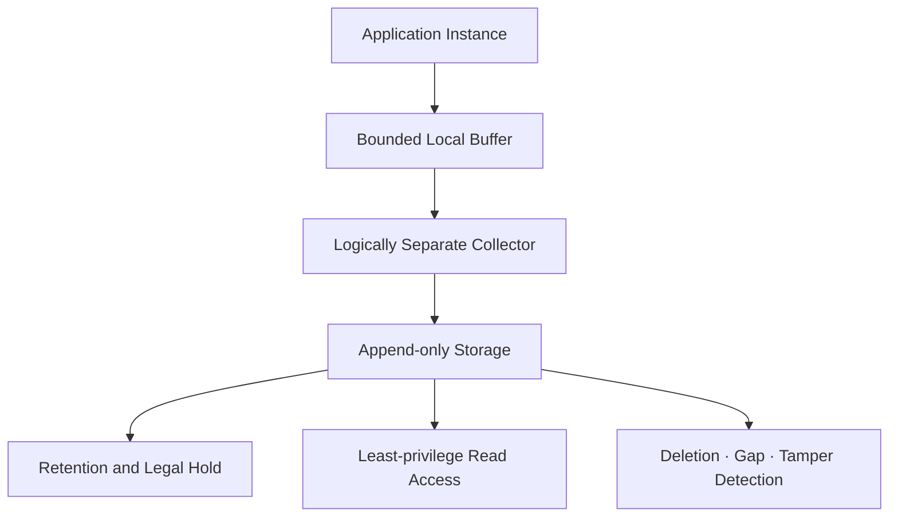

핵심 통제는 다음과 같습니다.

- Application 계정이 중앙 저장 Log를 수정·삭제하지 못하게 합니다.
- 전송 구간 인증과 암호화를 적용하고 허용된 Collector만 사용합니다.
- 저장소 접근과 검색 행위 자체를 Audit합니다.
- Retention과 삭제는 법적 근거·업무 목적·사고 조사 기간을 함께 반영합니다.
- Collector 중단, Event Sequence Gap, 급격한 Volume 감소도 Alert 대상입니다.
- Hash Chain은 보조 증거일 뿐, 공격자의 전체 삭제와 마지막 구간 절단을 단독으로 막지 못합니다.

## 13. 시간은 정확도와 신뢰도를 함께 남긴다

서버 간 Clock이 다르면 공격 순서를 재구성하기 어렵습니다. 모든 Logging Component의 Time Source를 동기화하고 UTC(Coordinated Universal Time, 협정 세계시) Offset을 포함한 ISO(International Organization for Standardization, 국제표준화기구) 8601 형식을 사용합니다.

```json
{
  "occurred_at": "2026-08-01T09:20:31.418Z",
  "observed_at": "2026-08-01T09:20:31.602Z",
  "clock_source": "server",
  "clock_confidence": "HIGH",
  "event_type": "AUTHZ_ACCESS_DENIED"
}
```

Mobile과 Offline Client가 전달한 Event Time은 조작·지연될 수 있습니다. `occurred_at`과 Server의 `observed_at`을 구분하고 외부 Clock에 대한 신뢰도를 표시합니다.

## 14. Detection Rule은 공격 가설을 실행 가능한 조건으로 만든다

좋은 탐지 규칙은 `오류가 많다`가 아니라 공격 가설, 필요한 Event, 집계 축, 시간 창, 예외와 대응을 명시합니다.

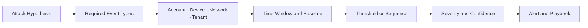

예를 들어 Credential Stuffing 탐지는 하나의 IP Address만 세지 않습니다.

- 여러 계정에 대한 실패를 발생시키는 Network·Device
- 한 계정에 분산되는 다수 Network의 실패
- 실패 직후 낯선 Device에서 성공한 로그인
- 성공 뒤 MFA 변경, Token 발급과 Data Export가 이어지는 Sequence

임계값은 합성 예제를 Blog에 고정하지 않습니다. 실제 Traffic Baseline, NAT(Network Address Translation, 네트워크 주소 변환), Mobile Network와 위험 등급을 기반으로 운영에서 조정합니다.

## 15. 한 Event보다 공격 Sequence를 탐지한다

개별 Event는 정상처럼 보여도 순서가 공격을 드러낼 수 있습니다.

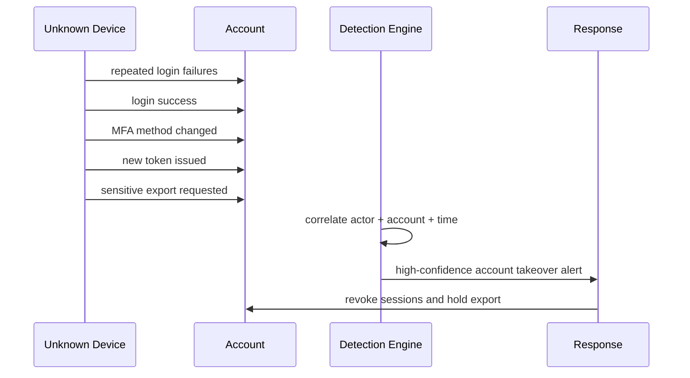

Sequence Rule에는 최대 허용 간격, 순서 변경, 중복 Event, 늦게 도착한 Event와 부분 실패의 의미를 정의합니다. Message 재전송 때문에 같은 Event가 두 번 들어와도 Alert 수가 폭증하지 않게 Event ID 기반 중복 제거를 적용합니다.

## 16. Alert는 조사 가능한 최소 문맥을 제공한다

Alert 제목만 `Suspicious activity detected`라면 담당자는 다시 처음부터 검색해야 합니다.

```json
{
  "alert_id": "synthetic-alert-001",
  "rule_id": "AUTHN_SEQUENCE_004",
  "rule_version": 7,
  "severity": "HIGH",
  "confidence": "MEDIUM",
  "tenant_ref": "tenant-example",
  "actor_ref": "actor-example",
  "first_seen": "2026-08-01T09:10:00Z",
  "last_seen": "2026-08-01T09:14:30Z",
  "event_count": 8,
  "playbook_id": "PB-AUTHN-002",
  "evidence_query_ref": "restricted-query-reference"
}
```

Alert Message에 원본 Token, Password, 전체 Request Body와 민감한 Stack Trace를 복사하지 않습니다. 접근 통제된 조사 화면의 Reference와 필요한 최소 문맥을 전달합니다.

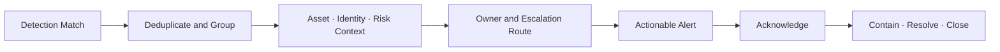

## 17. Severity와 Confidence를 분리해 경보 피로를 줄인다

Severity(심각도)는 실제라면 영향이 얼마나 큰지, Confidence(신뢰도)는 탐지가 실제 공격일 가능성이 얼마나 높은지를 나타냅니다.

- **Severity 높음·Confidence 높음** — 즉시 호출하고 승인된 자동 제한과 담당자 확인을 수행합니다.
- **Severity 높음·Confidence 낮음** — 신속하게 추가 증거를 수집하고 검토합니다.
- **Severity 낮음·Confidence 높음** — Ticket을 생성하거나 추세 분석 대상으로 관리합니다.
- **Severity 낮음·Confidence 낮음** — 저장·집계한 뒤 Rule 개선 후보로 관리합니다.

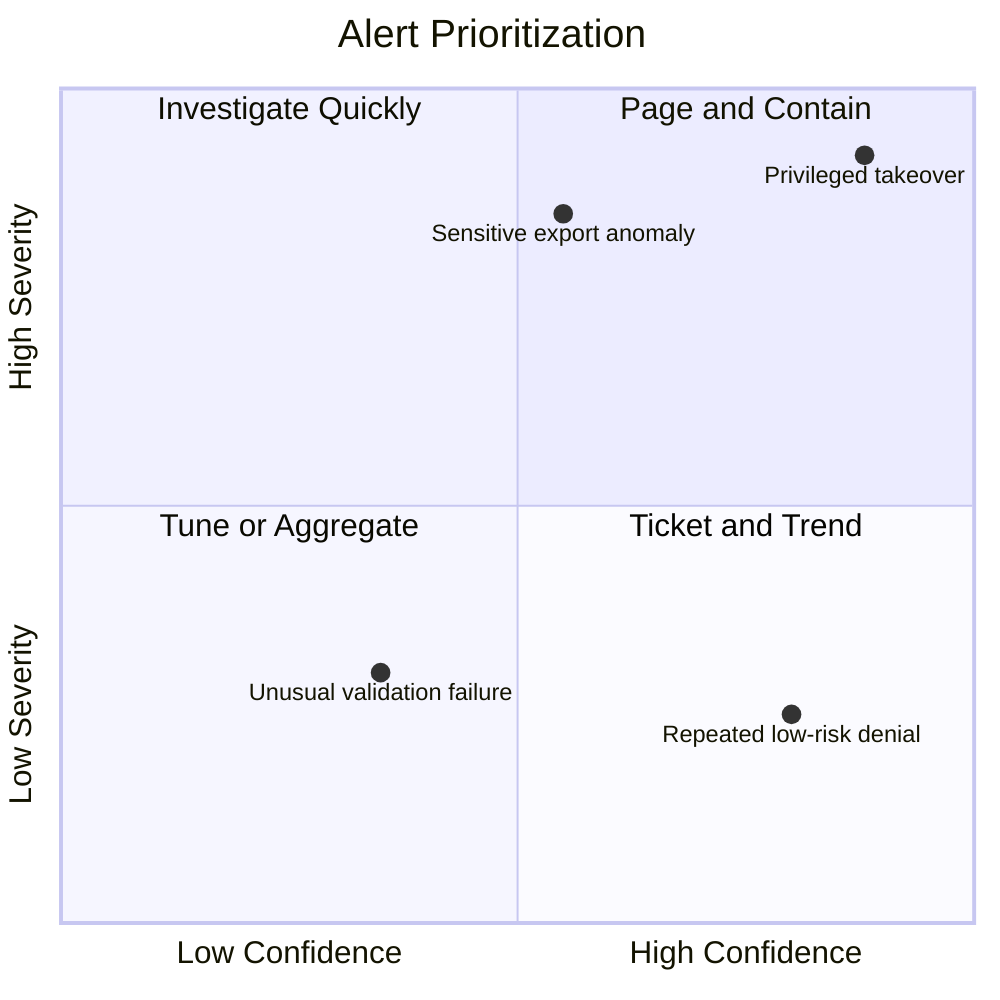

False Positive를 줄이려고 Security Event를 삭제하지 않습니다. 원본 Event는 보존하고 Rule의 집계, Suppression, Context와 Routing을 개선합니다. 반복 Alert를 묶더라도 최초·최종 시각, 총 Event 수와 영향 대상을 잃지 않습니다.

## 18. Playbook은 Alert를 행동으로 바꾼다

각 Alert에는 최소한 다음 내용이 연결돼야 합니다.

1. Owner와 Backup Owner
2. 의미와 예상 공격 경로
3. 확인할 Evidence와 접근 권한
4. True Positive·False Positive 판단 기준
5. 즉시 Containment와 승인 조건
6. 고객·법무·개인정보·경영진 Communication 기준
7. Recovery와 정상화 조건
8. Evidence 보존, 종료 기준과 사후 개선 항목

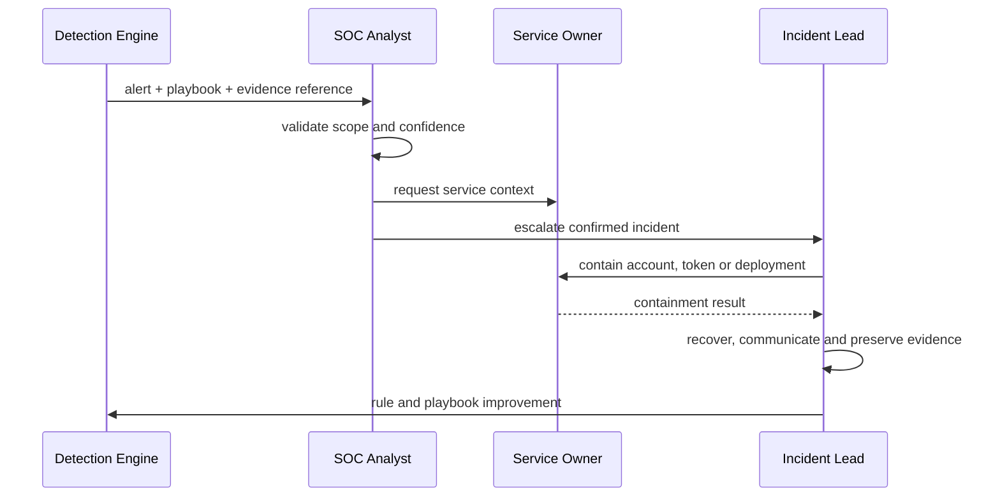

NIST SP 800-61 Revision 3은 Incident Response(사고 대응)를 별도 순간 작업이 아니라 Cybersecurity Risk Management(사이버보안 위험 관리) 전반에 통합하도록 권고합니다.

## 19. 자동 대응에는 제한과 되돌리기 계약이 필요하다

Alert가 발생했다고 계정을 영구 삭제하거나 전체 서비스를 중단해서는 안 됩니다. 자동 대응은 영향 범위가 제한되고 되돌릴 수 있어야 합니다.

탐지 결과는 신뢰 문맥을 보강한 뒤 사람 검토 또는 승인된 제한 조치로 전환합니다.

```mermaid
flowchart LR
    detected["Detected"] --> enriched["Enriched Context"]
    enriched -->|medium confidence| review["Human Review"]
    enriched -->|high confidence + policy| contain["Bounded Containment"]
    review -->|confirmed| contain
    review -->|benign| closed["Closed False Positive"]
```

제한 조치 이후에는 상태 확인과 사후 검토를 반드시 연결합니다.

```mermaid
flowchart LR
    contain["Bounded Containment"] --> recovered["Recovered"]
    contain --> escalated["Escalated"]
    recovered --> review["Post-incident Review"]
    escalated --> review
```

Session Revocation, 고위험 기능의 일시 Hold, 추가 인증 요구처럼 피해를 제한하는 조치를 우선합니다. 자동 대응 Policy Version과 실행 결과도 Security Event로 남깁니다.

## 20. Log Flooding과 수집 장애도 Threat Model에 포함한다

공격자는 대량 실패 요청으로 Disk, Network, Collector와 Analyst를 소진시킬 수 있습니다.

대량 악성 Event는 입력·집계·Queue 단계에서 먼저 제한합니다.

```mermaid
flowchart LR
    flood["High-volume Malicious Events"] --> bound["Request and Event Size Limits"]
    bound --> aggregate["Bounded Aggregation and Counters"]
    aggregate --> queue["Capacity-limited Buffer"]
```

Queue 압력과 수집 경로는 각각 경보와 격리 정책으로 연결합니다.

```mermaid
flowchart LR
    queue["Capacity-limited Buffer"] --> collector["Central Collector"]
    queue --> pressure["Backpressure and Health Signal"]
    pressure --> alert["Pipeline Degradation Alert"]
    collector --> quota["Tenant and Source Quotas"]
```

무조건 Sampling하면 중요한 공격 Event가 사라집니다. Event Type별 정책을 둡니다.

- 관리자 권한 변경, Key 변경과 Data Export는 Sampling하지 않습니다.
- 반복되는 동일 실패는 첫 Event, 마지막 Event, Count와 시간 범위를 보존해 집계할 수 있습니다.
- Queue가 가득 찼을 때 버릴 Event와 요청을 실패시킬 Event를 위험 기준으로 구분합니다.
- Log Pipeline 장애를 Application Health와 별도 Security Alert로 올립니다.

## 21. Logging 실패의 Fail-open과 Fail-closed 경계를 정한다

모든 Log 저장 실패에 전체 서비스를 중단하면 Logging System이 서비스 거부 공격 지점이 됩니다. 반대로 모든 실패를 무시하면 Audit가 필요한 중요 거래를 증거 없이 실행하게 됩니다.

- **일반 조회 Diagnostic Log** — 제한된 Buffer와 운영 경보를 사용하고 업무는 계속할 수 있습니다.
- **로그인 실패 Security Event** — 로컬 제한 Buffer와 중앙 수집 복구를 적용하며 손실 Counter를 필수로 남깁니다.
- **관리자 권한 변경 Audit** — 보존 가능한 Audit 경로가 없으면 변경 거부를 검토합니다.
- **고액·고위험 거래** — 법·위험 정책에 따라 Audit 성공과 업무 변경의 원자적 연결을 검토합니다.
- **Log 검색 UI 장애** — 원본 수집은 계속하고 조사 기능 장애를 별도 경보로 알립니다.

```mermaid
flowchart TD
    failure["Logging Dependency Failure"] --> classify{"Business and Audit Criticality"}
    classify -->|diagnostic| degrade["Bounded Buffer + Continue + Alert"]
    classify -->|security event| preserve["Durable Fallback + Loss Counter"]
    classify -->|mandatory audit| stop["Reject Protected Action"]
    degrade --> recover["Replay and Reconcile"]
    preserve --> recover
    stop --> recover
```

업무 Transaction과 원격 Log 전송을 하나의 분산 Transaction으로 억지로 묶기보다 Transactional Outbox, Append-only Audit Table 또는 검증된 Messaging Pattern을 사용합니다.

## 22. 멀티테넌트 Log는 수집부터 조회까지 격리한다

Tenant ID를 Event에 넣는 것만으로 격리가 완성되지 않습니다.

```mermaid
flowchart LR
    tenantA["Tenant A Event"] --> authA["Trusted Tenant Context"]
    tenantB["Tenant B Event"] --> authB["Trusted Tenant Context"]
    authA --> ingest["Schema and Authorization Gate"]
    authB --> ingest
    ingest --> partition["Tenant-aware Storage Policy"]
    partition --> query["Server-enforced Query Filter"]
    query --> export["Authorized Export + Audit"]
```

- Client가 보낸 Tenant 값 대신 인증된 Server Context를 사용합니다.
- Collector와 Storage의 Partition·Index·Encryption Policy를 검토합니다.
- 검색 API가 모든 Query에 Server-side Tenant Filter를 강제합니다.
- Support와 SOC의 Cross-tenant 권한은 별도 Role·승인·Audit를 요구합니다.
- Log Export와 장기 보관에도 Tenant 권한과 삭제 정책을 유지합니다.

## 23. Negative Test로 Log Forging과 민감정보 유출을 막는다

### Log Injection Test

- Actor·Filename·User-Agent에 CR, LF, Tab과 Unicode Line Separator를 넣어도 한 Event인가?
- Quote, Backslash, JSON Delimiter와 매우 긴 문자열이 Schema를 깨지 않는가?
- Log Viewer가 HTML·Terminal 제어 문자를 실행하지 않고 표시하는가?
- 공격 값이 `event_type`, `severity` 같은 예약 필드를 덮어쓸 수 없는가?

### Sensitive Data Test

- Password, OTP, Access Token, Refresh Token과 Cookie Canary가 어떤 Log에도 나타나지 않는가?
- Query String과 Request Body가 기본적으로 제외되는가?
- Exception과 Stack Trace가 외부 응답·Alert Message로 복사되지 않는가?
- Masking 전 원본 값이 Debug Logger나 Queue에 남지 않는가?

### Detection and Alert Test

- 로그인 실패, 인가 거부, 업무 순서 위반 합성 Event가 기대 Rule을 작동시키는가?
- Alert가 Owner에게 도착하고 Acknowledge·Escalation Timer가 동작하는가?
- Event 중복·순서 변경·늦은 도착에도 Alert가 폭증하거나 사라지지 않는가?
- Collector 중단과 Queue 포화가 별도 Alert를 생성하는가?

```mermaid
flowchart LR
    canary["Synthetic CRLF · Token · Attack Sequence"] --> app["Application Test"]
    app --> collector["Test Collector"]
    collector --> assert["Schema · Privacy · Integrity Assertions"]
    assert --> rule["Detection Rule Test"]
    rule --> alert["Alert Delivery Test"]
    alert --> playbook["Playbook Exercise"]
```

Production에서 실제 공격을 기다리지 않고 Synthetic Event와 안전한 Canary를 정기적으로 주입해 End-to-End 경로를 검증합니다.

## 24. 관측할 것은 공격 수뿐 아니라 탐지 체인의 건강 상태다

다음 지표를 함께 봅니다.

- Security Event 생성량과 Schema 거부율
- Application Instance별 마지막 Event 수신 시각
- 수집 지연, Queue 깊이와 Drop·Retry Count
- Rule 평가 지연과 실패율
- Alert 생성·전달·Acknowledge·Escalation 시간
- Rule별 True Positive·False Positive·중복 Alert 비율
- Playbook 실행률, Containment 시간과 재발률
- Retention·삭제 Job과 접근 감사 상태

```mermaid
flowchart TD
    generation["Event Generation Health"] --> dashboard["Detection Pipeline Health"]
    ingestion["Ingestion Lag and Drops"] --> dashboard
    rules["Rule Evaluation Health"] --> dashboard
    delivery["Alert Delivery and Ack"] --> dashboard
    response["Containment and Recovery"] --> dashboard
    dashboard --> owner["Named Operational Owner"]
```

Mean Time to Detect 같은 평균 하나만 보면 장기 미탐지와 일부 치명적 지연이 가려질 수 있습니다. 위험 등급별 분포와 최악 구간, 미확인 Alert Age를 함께 확인합니다.

## 25. 흔한 오해를 Review에서 제거한다

- **Log를 많이 남기면 안전하다?** Noise·비용·민감정보 유출이 증가합니다. Threat 기반 필수 Event와 최소 필드만 남깁니다.
- **JSON이면 Log Injection이 없다?** 제어 문자·길이·Viewer Injection 위험이 남습니다. 검증·정규화·Format Encoder와 안전한 Viewer를 함께 적용합니다.
- **모든 Request Body를 남겨야 조사 가능하다?** Token·PII·업무 비밀의 2차 유출이 발생합니다. 허용 필드·분류·가명 Reference만 사용합니다.
- **중앙 수집이면 변조할 수 없다?** 과도한 권한·삭제·전송 공격이 남습니다. 분리된 권한·Append-only와 Gap 탐지를 적용합니다.
- **Alert가 많을수록 탐지가 좋다?** 경보 피로로 중요한 공격이 묻힙니다. Severity·Confidence·Grouping·Tuning으로 품질을 관리합니다.
- **임계값은 한 번 정하면 된다?** Traffic과 공격 방식이 변합니다. Version·Owner·검증 주기와 만료를 관리합니다.
- **자동 차단이 항상 빠르고 좋다?** 오탐으로 사용자와 업무를 중단할 수 있습니다. 제한된 가역 조치·승인·Rollback을 사용합니다.
- **Log Pipeline 장애는 운영 장애다?** 공격자가 의도적으로 시야를 차단할 수 있습니다. Security Alert와 별도 대응 절차를 둡니다.

## 26. Code Review Checklist

### Event Contract

- [ ] Threat Model에서 필수 Security Event Inventory를 도출했다.
- [ ] 성공·실패·거부·우회 시도를 일관된 Event Type으로 기록한다.
- [ ] Event Schema, Field Type, 최대 길이와 Privacy 등급이 Version 관리된다.
- [ ] Server가 신뢰한 Tenant·Actor·Interaction Context를 사용한다.
- [ ] Diagnostic Log와 Audit Trail의 목적·보존·권한을 구분한다.

### Log Forging와 Encoding

- [ ] 외부 입력을 문자열 연결로 Log Message에 넣지 않는다.
- [ ] CR·LF·제어 문자와 길이를 제한하고 Unicode 정책을 적용한다.
- [ ] JSON·Database·Viewer 등 최종 Format에 맞는 Encoder를 사용한다.
- [ ] 외부 값이 예약된 Event Field 이름과 Severity를 덮어쓸 수 없다.
- [ ] Log Viewer도 HTML·Terminal Injection을 방어한다.

### 민감정보

- [ ] Password, OTP, Token, Cookie, Key와 Connection String을 기록하지 않는다.
- [ ] URL Query, Header, Body와 Stack Trace의 기본 제외 정책이 있다.
- [ ] PII·PHI의 목적, Masking·가명화, 접근 권한과 Retention이 승인됐다.
- [ ] Alert와 Ticket에 원본 민감정보를 복제하지 않는다.
- [ ] Canary 기반 자동 Test로 Secret 유출을 검사한다.

### Collection과 Protection

- [ ] 구조화 Log가 중앙 Collector에서 Schema 그대로 보존된다.
- [ ] 전송 인증·암호화, Append-only 저장과 최소 권한을 적용한다.
- [ ] Application 계정이 중앙 Log를 수정·삭제할 수 없다.
- [ ] Time Source, UTC Offset과 외부 Event Time의 신뢰도를 관리한다.
- [ ] 수집 중단·지연·Drop·Gap·Volume 급감이 Alert 대상이다.

### Detection과 Alerting

- [ ] Rule에 공격 가설, Event, 집계 축, Window와 Owner가 있다.
- [ ] Severity와 Confidence를 분리하고 Alert Grouping을 적용한다.
- [ ] Rule Version, 예외, 변경 승인과 주기적 검토가 있다.
- [ ] Alert에는 최소 문맥, Evidence Reference와 Playbook이 연결된다.
- [ ] Acknowledge, Escalation, Containment와 종료 상태를 추적한다.

### 운영과 대응

- [ ] 고 Volume Event의 집계·Quota·Backpressure 정책이 있다.
- [ ] Logging 장애의 Fail-open·Fail-closed 경계를 업무별로 정했다.
- [ ] 자동 대응은 영향이 제한되고 되돌릴 수 있다.
- [ ] 멀티테넌트 수집·저장·검색·Export가 격리된다.
- [ ] Synthetic Attack과 Tabletop Exercise로 End-to-End 대응을 검증한다.

## 마무리

Security Logging and Alerting Failures를 막는 핵심은 Log File을 생성하는 것이 아닙니다.

```mermaid
flowchart LR
    threat["Threat and Abuse Case"] --> contract["Privacy-safe Event Contract"]
    contract --> protected["Protected Central Collection"]
    protected --> detection["Tested Detection Rule"]
    detection --> alert["Prioritized Actionable Alert"]
    alert --> playbook["Owned Response Playbook"]
    playbook --> feedback["Contain · Recover · Improve"]
    feedback --> threat
```

안전한 시스템은 다음 질문에 답할 수 있어야 합니다.

- 어떤 Security Control의 성공·실패·우회 시도가 기록되는가?
- 공격자가 Log 줄과 필드를 위조하거나 Viewer를 공격할 수 없는가?
- Log와 Alert에 Password, Token과 개인정보가 들어가지 않는가?
- Event가 중앙에서 변조·삭제·유출되지 않고 얼마나 보존되는가?
- 어떤 공격 가설이 어떤 Rule과 Alert로 이어지는가?
- Alert를 누가 받고 어떤 Playbook으로 언제까지 대응하는가?
- 수집·탐지·전달 경로 자체가 멈췄을 때 이를 알아챌 수 있는가?

Security Logging은 기록, Monitoring은 관찰, Detection은 판단, Alerting은 전달, Playbook은 행동입니다. 이 다섯 단계를 하나의 검증 가능한 운영 계약으로 연결해야 A09 대응이 실제 보안 통제가 됩니다.

다음 글에서는 OWASP Top 10:2025 A10 Mishandling of Exceptional Conditions를 기준으로 Fail Closed, Transaction Rollback, Partial Failure와 안전한 오류 응답을 다룹니다.

## 공식 참고자료

- [OWASP Top 10:2025 A09 Security Logging and Alerting Failures](https://owasp.org/Top10/2025/A09_2025-Security_Logging_and_Alerting_Failures/)
- [OWASP Logging Cheat Sheet](https://cheatsheetseries.owasp.org/cheatsheets/Logging_Cheat_Sheet.html)
- [OWASP Application Logging Vocabulary Cheat Sheet](https://cheatsheetseries.owasp.org/cheatsheets/Logging_Vocabulary_Cheat_Sheet.html)
- [OWASP Java Security Cheat Sheet: Log Injection](https://cheatsheetseries.owasp.org/cheatsheets/Java_Security_Cheat_Sheet.html#log-injection)
- [CWE-117 Improper Output Neutralization for Logs](https://cwe.mitre.org/data/definitions/117.html)
- [OWASP ASVS 5.0 V16 Security Events](https://cornucopia.owasp.org/taxonomy/asvs-5.0/16-security-logging-and-error-handling/03-security-events)
- [Spring Boot Reference: Structured Logging](https://docs.spring.io/spring-boot/reference/features/logging.html#features.logging.structured)
- [NIST SP 800-61 Revision 3 Incident Response Recommendations](https://csrc.nist.gov/pubs/sp/800/61/r3/final)
