# Exceptional Conditions Secure Coding: Fail Closed·Rollback·안전한 오류 응답

정상 경로가 안전하다는 사실만으로 시스템이 안전해지지는 않습니다. Database Timeout, 권한 Service 장애, 예상하지 못한 Status Code, Disk 부족과 Null 값처럼 정상 전제를 깨는 상황에서 시스템이 **어떤 상태를 남기고 무엇을 허용하는지**가 실제 보안 경계를 결정합니다.

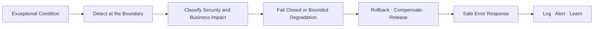

이 글은 2026년 8월 기준 OWASP(Open Worldwide Application Security Project, 오픈 월드와이드 애플리케이션 보안 프로젝트) Top 10:2025 A10 Mishandling of Exceptional Conditions를 바탕으로 Java 21·Spring Boot 3 환경의 합성 예제를 설명합니다. 실제 고객, 계정, 거래, 내부 URL, 운영 임계값과 장애 기록은 사용하지 않습니다.

## 1. 먼저 용어와 실패 의미를 구분한다

- **Exceptional Condition** — 정상 전제를 벗어나 별도 판단이 필요한 예외적 조건입니다.
- **Exception** — 실행 중 발생한 비정상 상황을 전달하는 Java 예외 객체입니다.
- **Error Handling** — 오류를 탐지·분류·복구·전달하는 처리 과정입니다.
- **Fail Closed** — 안전성을 확신하지 못하면 보호 작업을 허용하지 않는 안전 실패입니다.
- **Fail Open** — 검사 실패를 성공처럼 취급해 작업을 허용하는 위험한 실패입니다.
- **Rollback (Transaction Rollback)** — Transaction 변경을 이전 일관 상태로 되돌립니다.
- **Compensation (Compensating Action)** — 이미 확정된 분산 작업의 의미를 상쇄합니다.
- **Partial Failure** — 여러 단계 중 일부만 성공한 상태입니다.
- **Idempotency** — 같은 요청을 반복해도 결과 의미가 한 번 실행과 같습니다.
- **Deadline** — 작업 전체가 끝나야 하는 절대 마감 시각입니다.
- **Timeout** — 특정 대기 단계에 허용한 최대 시간입니다.
- **RFC (Request for Comments)** — 인터넷 표준과 기술 규약을 공개하는 문서 체계입니다.
- **Problem Details for HTTP APIs** — HTTP API 오류를 기계 판독 가능하게 표현하는 표준 형식입니다.
- **SLO (Service Level Objective)** — 서비스 수준 목표입니다.

Exception은 Java 문법의 객체이고, Exceptional Condition은 입력·상태·환경·외부 의존성에서 발생하는 더 넓은 문제입니다. 모든 Exceptional Condition이 Exception으로 표현되는 것도 아니며, `false`, 빈 결과, 알 수 없는 Enum, HTTP `200`의 잘못된 Body처럼 정상 반환처럼 보이는 실패도 있습니다.

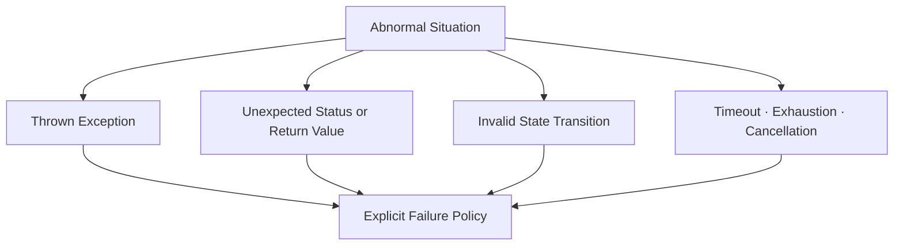

## 2. A10은 오류 화면이 아니라 시스템 상태를 다룬다

OWASP Top 10:2025 A10은 2025년에 새로 추가된 범주입니다. 단순히 예쁜 오류 페이지를 만들라는 뜻이 아니라 다음 세 실패를 함께 다룹니다.

1. 비정상 상황을 예방하지 못합니다.
2. 발생한 비정상 상황을 탐지하지 못합니다.
3. 탐지한 뒤에도 안전하게 복구하거나 중단하지 못합니다.

대표 약점에는 다음 항목이 포함됩니다.

- **CWE-209 · Generation of Error Message Containing Sensitive Information** — 오류 응답에 민감정보가 노출됩니다.
- **CWE-234 · Failure to Handle Missing Parameter** — 필수 입력 누락을 처리하지 못합니다.
- **CWE-248 · Uncaught Exception** — 예외가 처리되지 않은 채 경계를 벗어납니다.
- **CWE-252 · Unchecked Return Value** — 반환된 오류 상태를 무시합니다.
- **CWE-390 · Detection of Error Condition Without Action** — 오류를 탐지하고도 조치하지 않습니다.
- **CWE-460 · Improper Cleanup on Thrown Exception** — 예외 경로에서 Resource를 정리하지 못합니다.
- **CWE-636 · Not Failing Securely** — 장애를 안전하지 않은 Fail Open으로 바꿉니다.
- **CWE-703 · Improper Check or Handling of Exceptional Conditions** — 예외적 조건을 부적절하게 검사·처리합니다.

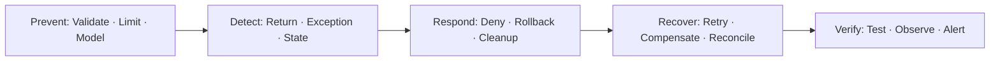

## 3. Exceptional Condition Inventory를 먼저 만든다

`예외가 나면 500을 반환한다`는 정책은 너무 늦고 넓습니다. 신뢰 경계마다 예상 가능한 비정상 조건과 안전한 결과를 표로 만듭니다.

- **HTTP 입력** — 필수 Parameter 누락·중복·초과 크기는 상태 변경 전에 `400` 또는 `413`으로 거부합니다.
- **인증·인가** — Policy Service Timeout이나 알 수 없는 결과에서는 보호 작업을 거부하고 제한된 재시도만 허용합니다.
- **업무 상태** — 허용되지 않은 전이와 Version 충돌은 상태 변경 없이 `409`로 처리합니다.
- **Database** — Deadlock·Lock Timeout·Constraint 위반은 전체 Transaction을 Rollback합니다.
- **외부 API** — Timeout·Schema 불일치·예상 밖 Status를 성공으로 변환하지 않고 `UNKNOWN`으로 다룹니다.
- **Message** — 중복·순서 역전·Poison Message에는 멱등 처리·격리·Dead Letter 정책을 적용합니다.
- **파일·Stream** — 너무 큰 입력·중간 끊김·Close 실패에서는 입력을 제한하고 임시 파일과 Resource를 정리합니다.
- **Cache** — Miss·Stale·Backend 장애가 인가 결정에 영향을 주면 Fail Closed합니다.
- **운영** — Disk 부족·Queue 포화·Clock 이상에서는 보호 기능을 제한하고 별도 경보를 발생시킵니다.

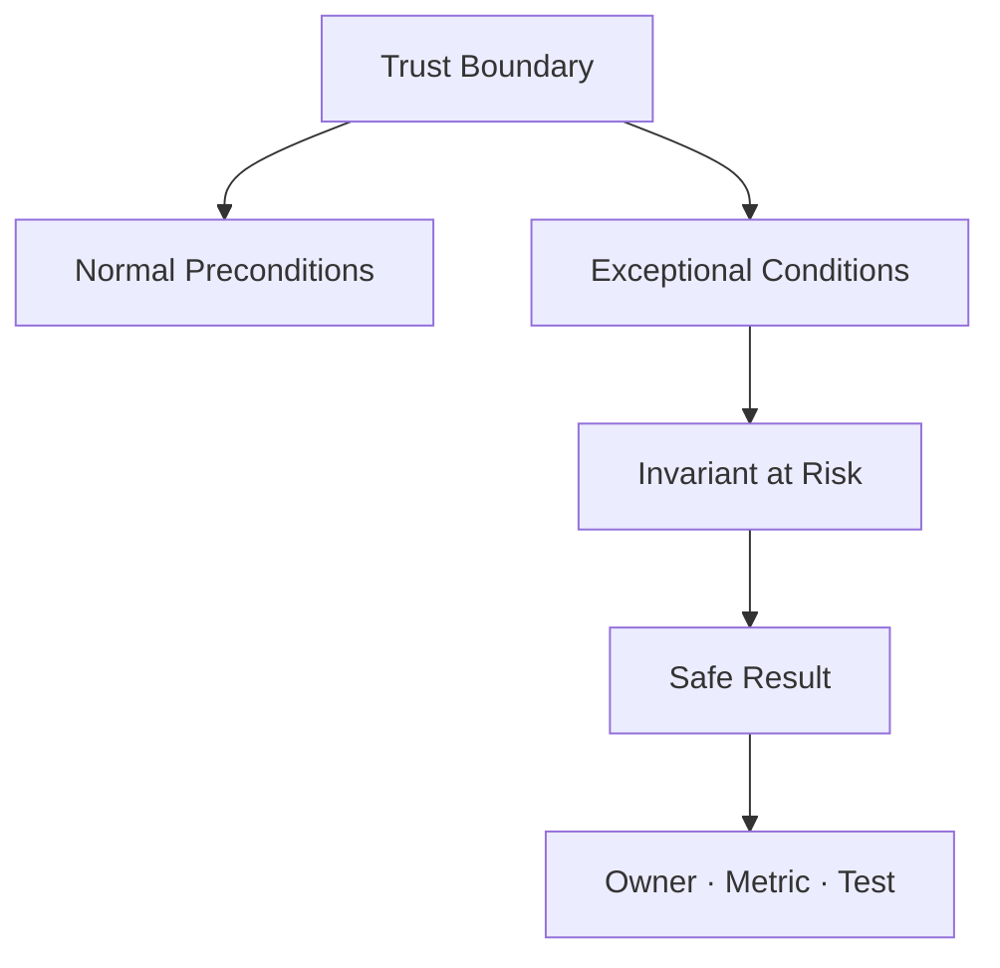

Inventory에는 발생 원인만 적지 않습니다. 지켜야 할 불변식(Invariant), 사용자에게 보일 결과, 내부 복구, 관측 Event, 재시도 허용 여부와 Owner까지 연결합니다.

## 4. Fail Closed는 모든 장애에 서비스를 끄라는 뜻이 아니다

Fail Closed는 **보안 결정을 확신하지 못하면 보호 작업을 허용하지 않는다**는 원칙입니다. 일반 조회의 추천 점수 계산이 실패한 상황과 관리자 권한 검사가 실패한 상황에 같은 정책을 적용할 필요는 없습니다.

보안·무결성 판단에 영향을 주는 실패는 보호 작업을 거부합니다.

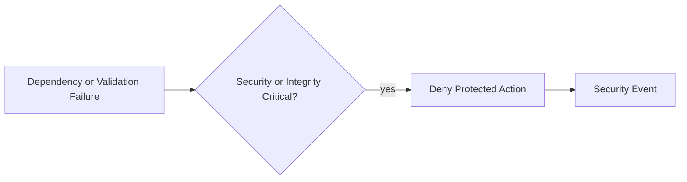

비핵심 기능만 사전에 승인된 범위 안에서 명시적으로 저하할 수 있습니다.

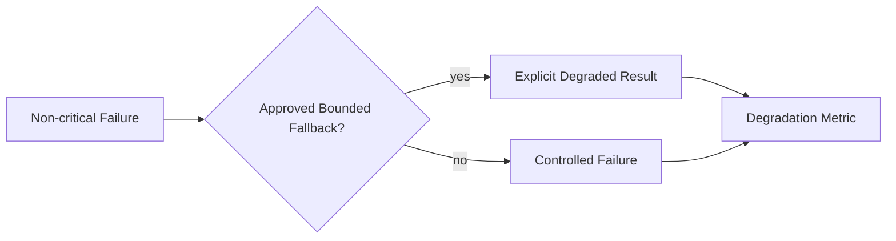

다음 구분이 중요합니다.

- 권한을 확인할 수 없음: `ALLOW`가 아니라 `DENY` 또는 재시도 가능한 실패입니다.
- 결제 금액을 확정할 수 없음: 이전 Cache 가격으로 조용히 승인하지 않습니다.
- 추천 기능 장애: 승인된 기본 정렬로 제한적으로 저하할 수 있습니다.
- Audit 의무가 있는 관리자 변경: 보존 가능한 Audit 경로가 없으면 변경을 거부할 수 있습니다.

Fail Closed의 범위와 사용자 영향은 Threat Model과 업무 위험에 따라 결정합니다. 무조건 전체 서비스를 중단하면 공격자가 의존성을 흔들어 서비스 거부를 만들 수 있습니다.

## 5. 입력 경계에서 일찍 거부하고 상태 변경을 시작하지 않는다

필수 Parameter 누락, 범위 초과와 알 수 없는 값은 업무 변경을 시작하기 전에 거부합니다.

```java
record TransferRequest(
    @jakarta.validation.constraints.NotBlank String targetRef,
    @jakarta.validation.constraints.NotNull
    @jakarta.validation.constraints.DecimalMin("0.01")
    java.math.BigDecimal amount,
    @jakarta.validation.constraints.NotBlank String operationKey
) {}
```

```java
@PostMapping("/transfers")
ResponseEntity<TransferOperationView> transfer(
        @jakarta.validation.Valid @RequestBody TransferRequest request) {
    TransferOperation operation = service.start(request);
    java.net.URI statusUri = java.net.URI.create(
        "/transfer-operations/" + operation.operationRef());

    return ResponseEntity.accepted()
        .location(statusUri)
        .body(TransferOperationView.from(operation));
}
```

`202 Accepted`는 처리가 끝났다는 뜻이 아닙니다. 위 예제는 Server가 생성한 URL-safe `operationRef`의 상태 조회 URI를 `Location` Header로 제공하고, Body에도 같은 Operation 상태를 반환합니다. 동기 방식으로 완료 결과를 즉시 반환한다면 `200 OK` 또는 Resource 생성 의미의 `201 Created`가 더 정확합니다.

Validation Annotation만으로 업무 불변식이 완성되지는 않습니다. Server가 인증된 Actor·Tenant를 결정하고, Currency·한도·대상 상태와 `operationKey`의 재사용 의미를 Transaction 안에서 다시 검사해야 합니다.

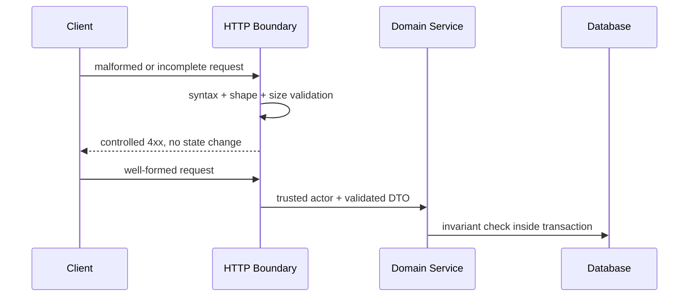

## 6. 빈 Catch와 넓은 Catch는 실패 의미를 지운다

다음 코드는 오류를 감지하지만 아무 행동도 하지 않습니다.

```java
try {
    policyClient.verify(command);
} catch (Exception ignored) {
    // 계속 진행
}
execute(command);
```

이 코드는 Policy Service 장애, Programming Bug와 Cancellation을 모두 `허용`으로 바꿉니다. Catch에는 최소한 다음 중 하나가 있어야 합니다.

- 복구 가능한 구체적 대안 수행
- 현재 작업 Rollback 후 의미 있는 Domain Exception 전달
- 제한된 재시도나 격리 Queue로 이동
- 사용자용 안전한 오류와 내부 관측 Event 생성
- Process를 안전하지 않은 상태로 계속할 수 없다면 중단

```java
try {
    policyClient.verify(command);
} catch (PolicyUnavailableException ex) {
    throw new AuthorizationDecisionUnavailableException(command.operationRef(), ex);
}
```

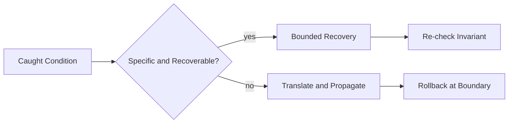

`catch (Exception)`은 최상위 경계의 마지막 안전망에서는 사용할 수 있지만, 중간 계층에서 모든 실패를 같은 성공·빈 값으로 바꾸면 원인과 Rollback 신호를 잃습니다. `Error`와 무분별한 `Throwable` Catch는 JVM(Java Virtual Machine, 자바 가상 머신)의 심각한 실패까지 정상 복구처럼 취급할 수 있으므로 피합니다.

## 7. 계층 경계에서 Exception을 의미 있는 계약으로 변환한다

Database Driver Exception을 Controller까지 그대로 노출하지 않고, 그렇다고 `null`이나 빈 List로 숨기지도 않습니다.

```java
final class TransferConflictException extends RuntimeException {
    private final String operationRef;

    TransferConflictException(String operationRef, Throwable cause) {
        super("transfer state conflict", cause);
        this.operationRef = operationRef;
    }

    String operationRef() {
        return operationRef;
    }
}
```

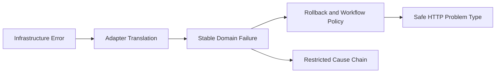

외부 계약에는 안정된 Error Code와 재시도 의미를 제공하고, 내부 원인은 접근이 제한된 Log와 Trace에 Correlation Reference로 연결합니다. 원인 Chain을 보존하되 사용자 응답에 Class Name, SQL, File Path와 Stack Trace를 넣지 않습니다.

## 8. Global Handler는 마지막 안전망이지 업무 정책의 대체물이 아니다

Spring MVC는 `@RestControllerAdvice`와 `ProblemDetail`로 오류 응답 형식을 중앙화할 수 있습니다.

```java
@RestControllerAdvice
class ApiExceptionHandler {

    @ExceptionHandler(TransferConflictException.class)
    ResponseEntity<ProblemDetail> conflict(
            TransferConflictException ex,
            jakarta.servlet.http.HttpServletRequest request) {
        ProblemDetail body = ProblemDetail.forStatusAndDetail(
            HttpStatus.CONFLICT,
            "The transfer state changed. Refresh and retry with a new operation key.");
        body.setType(java.net.URI.create("https://errors.example.invalid/transfer-conflict"));
        body.setTitle("Transfer state conflict");
        body.setProperty("code", "TRANSFER_STATE_CONFLICT");
        body.setProperty("interactionRef", trustedInteractionRef(request));
        return ResponseEntity.status(HttpStatus.CONFLICT).body(body);
    }

    @ExceptionHandler(Exception.class)
    ResponseEntity<ProblemDetail> unexpected(
            Exception ex,
            jakarta.servlet.http.HttpServletRequest request) {
        String interactionRef = trustedInteractionRef(request);
        safeSecurityEvents.tryUnexpectedFailure(interactionRef, ex);

        ProblemDetail body = ProblemDetail.forStatusAndDetail(
            HttpStatus.INTERNAL_SERVER_ERROR,
            "The request could not be completed.");
        body.setType(java.net.URI.create("https://errors.example.invalid/unexpected"));
        body.setTitle("Unexpected server error");
        body.setProperty("code", "UNEXPECTED_FAILURE");
        body.setProperty("interactionRef", interactionRef);
        return ResponseEntity.internalServerError().body(body);
    }
}
```

`example.invalid`는 공개 예제용 예약 Domain입니다. 실제 환경에서는 조직이 통제하는 안정된 Problem Type URI와 문서를 사용합니다.

`safeSecurityEvents.tryUnexpectedFailure()`는 민감정보를 제거한 제한된 Event 기록을 시도하되 Handler로 Exception을 다시 던지지 않는 계약입니다. 기록 실패는 독립적인 Pipeline Health Metric과 Alert로 감지합니다. Global Handler 안에서 Log·Event 전송 실패가 다시 오류 응답을 깨뜨리는 재귀 실패를 만들지 않아야 합니다.

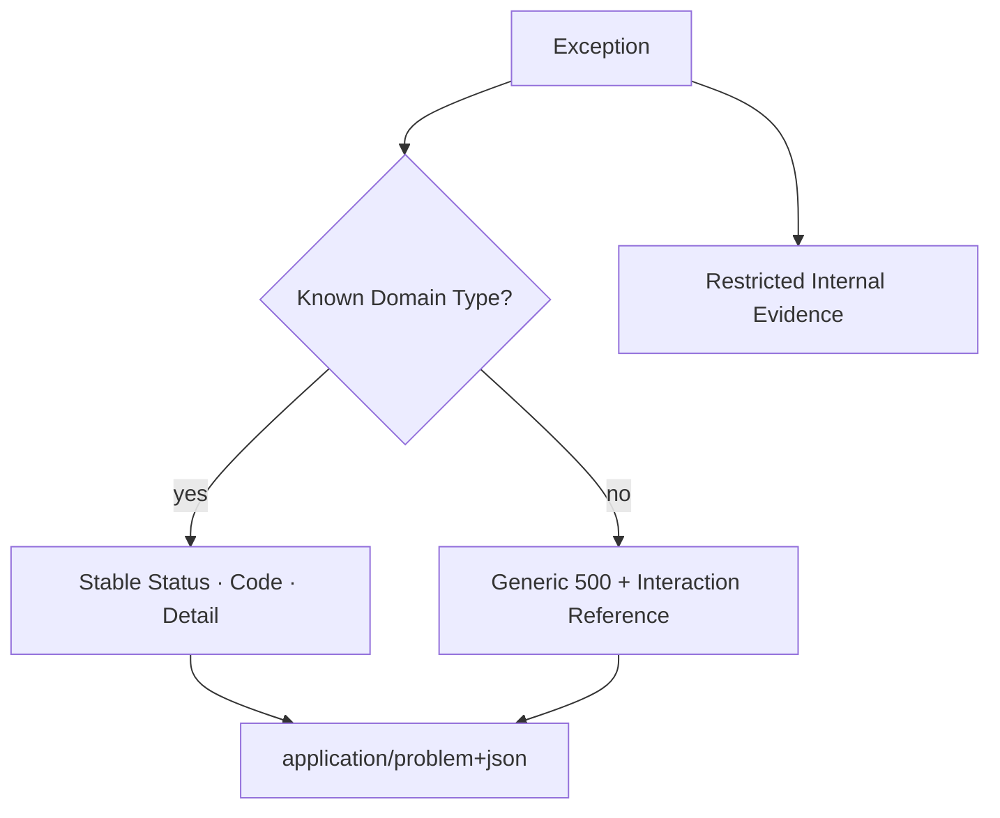

Global Handler는 누락된 예외가 Container 기본 페이지와 Stack Trace로 노출되는 것을 막습니다. 하지만 모든 예외를 여기서 업무적으로 복구하려 하면 Transaction 상태와 실패 지점을 알 수 없습니다. 복구는 실패가 발생한 경계에 가깝게, 최종 표현은 중앙에서 일관되게 처리합니다.

## 9. RFC 9457 Problem Details를 Debug Dump로 사용하지 않는다

RFC(Request for Comments) 9457은 HTTP API 오류를 위한 Problem Details 형식을 정의하며 RFC 7807을 대체합니다.

```json
{
  "type": "https://errors.example.invalid/transfer-conflict",
  "title": "Transfer state conflict",
  "status": 409,
  "detail": "The transfer state changed. Refresh and retry.",
  "instance": "/problems/interaction-example",
  "code": "TRANSFER_STATE_CONFLICT",
  "retryable": false
}
```

안전한 응답 계약은 다음을 지킵니다.

- `type`은 안정된 문제 종류 식별자입니다.
- `status`와 실제 HTTP Status가 모순되지 않습니다.
- `detail`은 사용자 행동에 필요한 정보만 제공합니다.
- `instance`나 별도 Reference는 민감한 내부 객체 ID를 노출하지 않습니다.
- Exception Class, Stack Trace, SQL, Hostname, Secret과 인증 판단 근거를 넣지 않습니다.
- `retryable`은 실제 Server 정책과 Idempotency 계약이 있을 때만 제공합니다.

오류 응답 차이로 계정 존재, 권한 수준과 내부 상태를 추측할 수 없는지도 Negative Test합니다.

## 10. Transaction Rollback 기본 규칙을 오해하지 않는다

Spring의 선언적 Transaction은 기본적으로 `RuntimeException`과 `Error`에서 Rollback하지만 Checked Exception에서는 자동 Rollback하지 않습니다. 중요한 변경이 Checked Exception을 던질 수 있다면 규칙을 명시합니다.

```java
@Transactional(rollbackFor = {
    TransferRejectedException.class,
    AuditWriteException.class
})
public TransferResult transfer(TransferCommand command)
        throws TransferRejectedException, AuditWriteException {
    debit(command.sourceRef(), command.amount());
    credit(command.targetRef(), command.amount());
    auditOutbox.append(command.operationRef(), "TRANSFER_COMPLETED");
    return new TransferResult(command.operationRef(), "COMPLETED");
}
```

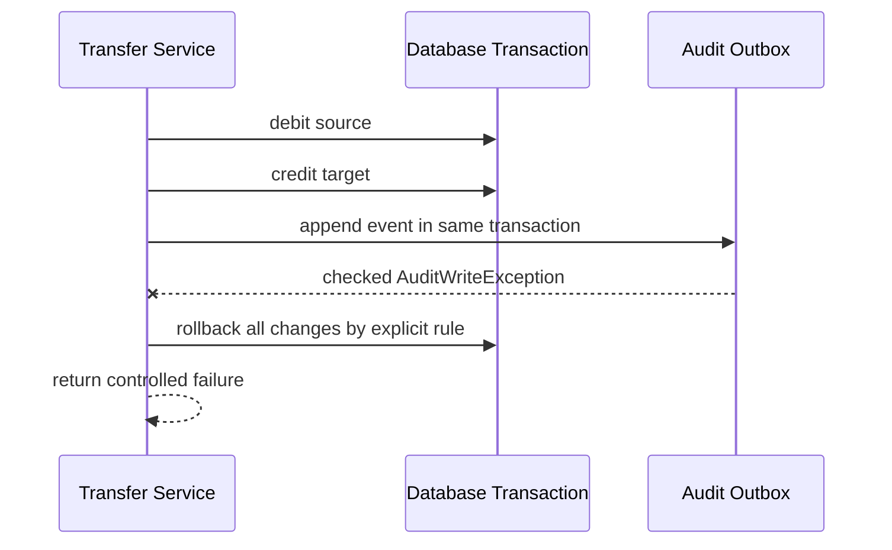

`rollbackForClassName` 같은 문자열 Pattern보다 Type 기반 `rollbackFor`가 의도하지 않은 이름 일치를 줄입니다. Rollback 규칙은 Exception 분류 체계와 함께 Test합니다.

## 11. Exception을 삼키면 Transaction이 Commit될 수 있다

다음 코드는 내부 실패를 잡고 성공 결과를 반환하므로 Transaction Proxy가 정상 완료로 판단할 수 있습니다.

```java
@Transactional
public TransferResult unsafeTransfer(TransferCommand command) {
    try {
        debit(command.sourceRef(), command.amount());
        credit(command.targetRef(), command.amount());
        return new TransferResult(command.operationRef(), "COMPLETED");
    } catch (RuntimeException ex) {
        return new TransferResult(command.operationRef(), "FAILED");
    }
}
```

실패를 반환 값으로 바꿔야 한다면 Transaction을 명시적으로 Rollback-only로 표시하거나, 더 단순하게 Exception을 Transaction 경계 밖으로 전파한 뒤 외부 계층에서 결과로 변환합니다.

```java
@Transactional
public TransferResult safeTransfer(TransferCommand command) {
    debit(command.sourceRef(), command.amount());
    credit(command.targetRef(), command.amount());
    return new TransferResult(command.operationRef(), "COMPLETED");
}
```

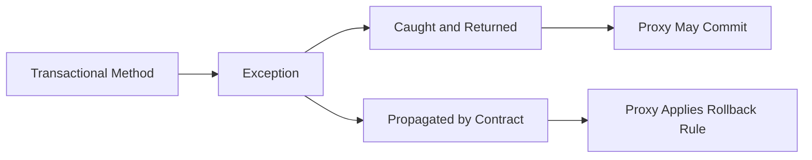

같은 Class 내부에서 `this.method()`로 호출하면 Proxy 기반 `@Transactional`이 적용되지 않는 Self-invocation 경계도 통합 Test합니다.

## 12. Local Transaction과 Remote Side Effect를 혼동하지 않는다

Database Transaction은 이미 성공한 외부 결제, Email, Object Storage와 다른 Service 호출을 자동으로 되돌리지 못합니다.

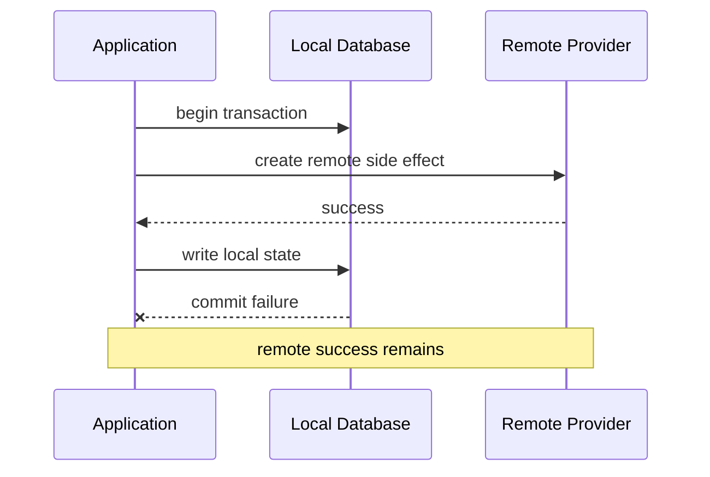

안전한 설계는 다음 중 하나를 명시적으로 선택합니다.

- Transactional Outbox로 Commit된 상태만 후속 Message로 전달
- Remote Provider의 Idempotency Key와 상태 조회 API 사용
- Saga 상태 기계와 승인된 Compensation 정의
- 불확실한 결과를 `UNKNOWN`으로 보존하고 Reconciliation 수행

정상 경로는 Local Transaction과 Outbox를 함께 Commit한 뒤 Remote 확인으로 완료됩니다.

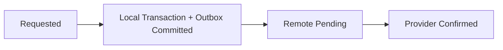

전송 후 Timeout은 실패로 단정하지 않고 조회·보상 가능한 상태로 남깁니다.

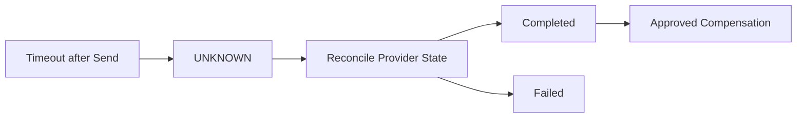

Timeout을 곧바로 실패로 간주해 같은 Remote 작업을 새 Key로 반복하면 중복 Side Effect가 생길 수 있습니다.

## 13. Retry는 실패를 숨기는 반복문이 아니다

재시도는 일시적 실패이고, 작업이 멱등이며, 남은 Deadline과 Retry Budget이 있을 때만 수행합니다.

```java
record RetryDecision(
    boolean retryable,
    int attempt,
    int maxAttempts,
    java.time.Instant deadline
) {
    boolean mayRetry(java.time.Clock clock) {
        return retryable
            && attempt < maxAttempts
            && clock.instant().isBefore(deadline);
    }
}
```

먼저 재시도 가능한 일시적 실패인지와 중복 실행을 막을 수 있는지 판정합니다.

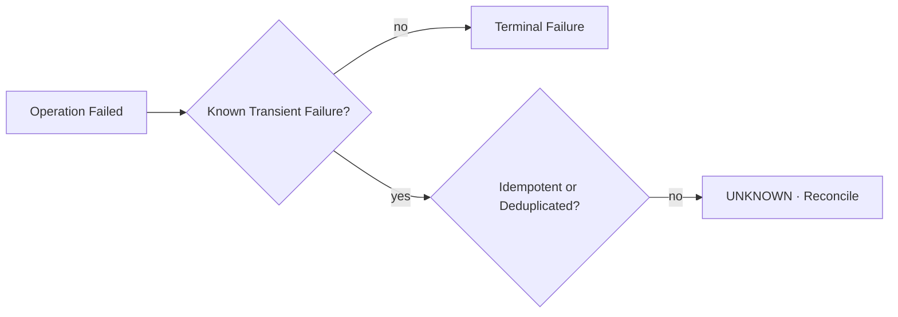

그 조건을 통과한 요청만 남은 Budget과 Deadline 안에서 재시도합니다.

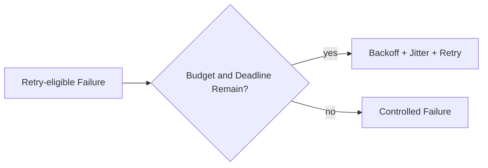

Authentication 실패, 입력 오류, 권한 거부와 Constraint 위반을 재시도하지 않습니다. 재시도 횟수는 `최초 1회 + 재시도 N회` 중 어떤 의미인지 문서화하고 Metric에서도 같은 의미를 사용합니다.

## 14. Timeout, Deadline과 Cancellation을 끝까지 전달한다

각 계층이 독립적으로 3초씩 기다리면 전체 요청은 예상을 크게 넘을 수 있습니다. 상위 Deadline에서 남은 시간을 계산해 하위 호출에 전달합니다.

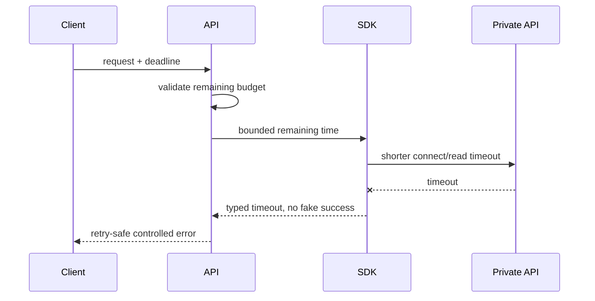

Cancellation을 잡아 일반 성공으로 바꾸지 않습니다. 이미 Side Effect를 시작했다면 단순히 Thread를 멈추는 것보다 상태를 `UNKNOWN`으로 기록하고 결과를 조회해야 할 수 있습니다. Timeout 후에도 Background 작업이 계속되는지, Connection과 Thread가 회수되는지 Test합니다.

## 15. Resource는 try-with-resources로 예외 경로에서도 정리한다

Java의 try-with-resources는 `AutoCloseable` Resource를 정상·예외 경로 모두에서 닫습니다.

```java
String readManifest(java.nio.file.Path path) throws java.io.IOException {
    final int maxBytes = 1_048_576;
    final int maxLines = 1_000;
    final int maxCodePointsPerLine = 4_096;

    byte[] bytes;
    try (var input = java.nio.file.Files.newInputStream(path)) {
        bytes = input.readNBytes(maxBytes + 1);
    }
    if (bytes.length > maxBytes) {
        throw new java.io.IOException("manifest exceeds byte limit");
    }

    var decoder = java.nio.charset.StandardCharsets.UTF_8.newDecoder()
        .onMalformedInput(java.nio.charset.CodingErrorAction.REPORT)
        .onUnmappableCharacter(java.nio.charset.CodingErrorAction.REPORT);
    String text = decoder.decode(java.nio.ByteBuffer.wrap(bytes)).toString();
    String[] lines = text.split("\\R", -1);

    if (lines.length > maxLines) {
        throw new java.io.IOException("manifest exceeds line limit");
    }
    for (String line : lines) {
        if (line.codePointCount(0, line.length()) > maxCodePointsPerLine) {
            throw new java.io.IOException("manifest line exceeds length limit");
        }
    }
    return text;
}
```

`Files.size()`만 먼저 확인하면 검사 후 파일이 바뀌는 TOCTOU(Time of Check to Time of Use, 검사 시점과 사용 시점 차이) 경계가 남습니다. 예제는 실제 읽기 자체를 `maxBytes + 1`로 제한하고, 잘못된 UTF-8과 행 수·행별 Code Point 길이도 거부합니다.

Body 처리 실패와 `close()`가 모두 실패하면 본문 처리 Exception이 기본으로 전파되고 Close Exception은 Suppressed Exception으로 연결될 수 있습니다. 내부 조사에서 `getSuppressed()`를 확인하되 외부 응답에 그대로 노출하지 않습니다.

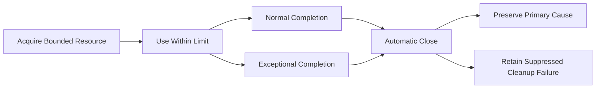

InputStream, JDBC(Java Database Connectivity, 자바 데이터베이스 연결) 객체, 파일 Lock, 임시 파일과 Executor 수명도 같은 관점으로 점검합니다.

## 16. 부분 변경 사이에도 업무 불변식을 지킨다

Exception을 잘 처리해도 상태 전이가 원자적이지 않으면 공격자가 중간 상태를 이용할 수 있습니다.

```java
@Transactional
public ApprovalView approve(String requestRef, long expectedVersion) {
    Approval approval = repository.findForUpdate(requestRef)
        .orElseThrow(ApprovalNotFoundException::new);

    approval.requireVersion(expectedVersion);
    approval.requireState(ApprovalState.PENDING);
    approval.markApproved();
    outbox.append(approval.toApprovedEvent());
    return ApprovalView.from(approval);
}
```

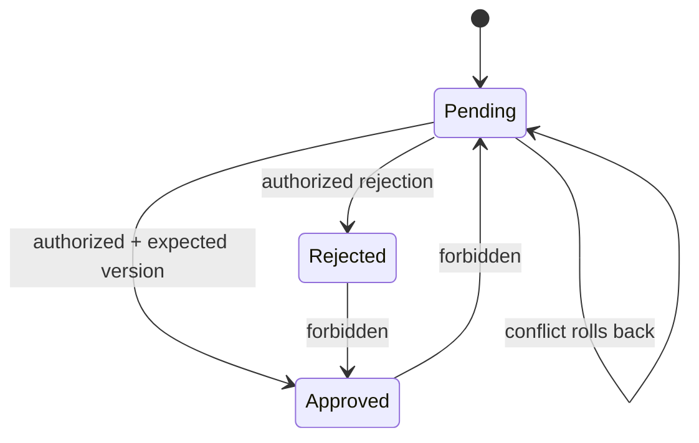

Lock Timeout과 Optimistic Lock 충돌을 성공으로 바꾸지 않습니다. `409 Conflict`와 새로운 상태 조회를 안내하고, Client의 맹목적 자동 재시도가 중복 승인을 만들지 않게 Operation Key를 사용합니다.

## 17. 외부 응답의 Status와 Body를 모두 검증한다

HTTP `200`이라도 필수 필드가 없거나 알 수 없는 상태라면 성공이 아닙니다. 반대로 `404`, `409`, `429`, `503`은 서로 다른 정책이 필요합니다.

```java
enum ProviderResultType {
    CONFIRMED, REJECTED, RATE_LIMITED, UNAVAILABLE, UNKNOWN
}

private static final java.time.Duration MAX_PROVIDER_RETRY_AFTER =
    java.time.Duration.ofSeconds(30);

ProviderResult mapProviderResponse(
        int status,
        org.springframework.http.HttpHeaders headers,
        ProviderBody body,
        java.time.Clock clock) {
    return switch (status) {
        case 200 -> validateConfirmedBody(body);
        case 409 -> ProviderResult.rejected("CONFLICT");
        case 429 -> ProviderResult.rateLimited(validatedRetryAfter(
            headers.getFirst(org.springframework.http.HttpHeaders.RETRY_AFTER),
            clock,
            MAX_PROVIDER_RETRY_AFTER));
        case 503 -> ProviderResult.unavailable();
        default -> ProviderResult.unknown("UNEXPECTED_STATUS");
    };
}
```

`Retry-After`는 Response Body가 아니라 HTTP Header에서 읽습니다. 검증 함수는 Delta Seconds와 HTTP Date 형식을 구분하고, 누락·음수·과도한 값과 과거 시각을 안전한 기본 정책으로 처리한 뒤 Client의 최대 대기시간과 전체 Deadline 이하로 제한해야 합니다.

외부 응답의 형식과 의미를 차례로 검증합니다.

```mermaid
flowchart LR
    response["Remote Response"] --> status["Validate Status"]
    status --> schema["Validate Content Type and Schema"]
    schema --> semantic["Validate Business Meaning"]
```

검증된 성공만 내부 성공 상태로 확정합니다.

```mermaid
flowchart LR
    semantic["Validated Meaning"] --> trusted{"Trusted Success?"}
    trusted -->|yes| success["Commit Success State"]
    trusted -->|no| unknown["Reject or Mark UNKNOWN"]
```

알 수 없는 Enum을 기본 `SUCCESS` Branch로 보내지 않고 Unknown으로 처리합니다. `Retry-After`도 무제한으로 신뢰하지 않고 Client Policy의 최대값과 전체 Deadline으로 제한합니다.

## 18. Exceptional Condition을 Resource 제한으로 예방한다

OWASP A10은 Rate Limit, Resource Quota와 Throttling으로 예외 상황 자체를 예방할 것을 권고합니다.

```mermaid
flowchart LR
    request["Incoming Work"] --> size["Payload and Collection Limits"]
    size --> rate["Rate and Concurrency Limits"]
    rate --> queue["Bounded Queue"]
    queue --> worker["Timeout-bound Worker"]
    worker --> output["Bounded Output"]
    queue --> reject["Explicit Overload Response"]
```

다음 항목에 무제한을 두지 않습니다.

- Request Body, Header, Collection과 중첩 깊이
- 업로드 파일, 압축 해제 크기와 Entry 수
- 동시 요청, Queue, Thread, Connection과 Retry
- Export Row, Page Size와 생성 파일 크기
- 정규식 실행, 재귀, 반복 횟수와 외부 호출 수

과부하 시 무한 Queue보다 명시적 거부와 `Retry-After` 정책이 상태 예측과 복구에 유리합니다.

## 19. 보안 결정 Service의 장애를 허용으로 바꾸지 않는다

인가·Fraud·Risk·Key 상태 확인은 `true/false`만으로 표현하면 장애와 거부를 혼동하기 쉽습니다.

```java
sealed interface AuthorizationDecision {
    record Allow(String policyVersion) implements AuthorizationDecision {}
    record Deny(String reasonCode) implements AuthorizationDecision {}
    record Unavailable(String failureRef) implements AuthorizationDecision {}
}
```

```java
void requireAllowed(AuthorizationDecision decision) {
    switch (decision) {
        case AuthorizationDecision.Allow ignored -> { }
        case AuthorizationDecision.Deny deny ->
            throw new AccessDeniedException(deny.reasonCode());
        case AuthorizationDecision.Unavailable unavailable ->
            throw new AuthorizationDecisionUnavailableException(
                unavailable.failureRef());
    }
}
```

```mermaid
flowchart LR
    policy["Policy Evaluation"] --> allow["ALLOW"]
    policy --> deny["DENY"]
    policy --> unavailable["UNAVAILABLE"]
    allow --> execute["Execute Protected Action"]
    deny --> reject["Reject"]
    unavailable --> reject
```

Unavailable을 Deny와 구분하면 사용자 메시지와 운영 경보를 다르게 만들 수 있지만, 보호 작업을 실행하지 않는다는 보안 결과는 같습니다.

## 20. Fallback은 승인된 의미만 제공해야 한다

Circuit Breaker가 열렸다고 `Collections.emptyList()`나 `true`를 반환하면 실제 실패를 정상 결과로 위장할 수 있습니다.

- **인가** — 장애 시 `ALLOW`하지 않고 거부하거나 재시도 가능한 실패로 처리합니다.
- **가격** — 오래된 값으로 결제를 승인하지 않습니다. 조회 화면에는 Stale임을 표시하고 결제 시 다시 확인합니다.
- **사용자 Profile** — 다른 Tenant의 Cache를 사용하지 않습니다. Tenant-scoped Cache만 사용하거나 오류를 반환합니다.
- **검색 추천** — 빈 결과를 정상 데이터처럼 위장하지 않습니다. `DEGRADED` 상태와 승인된 기본 정렬을 표시합니다.
- **외부 결제** — Timeout을 확정 실패로 바꾸지 않습니다. `UNKNOWN`으로 저장한 뒤 Provider 상태를 조회합니다.

Fallback은 먼저 문서화·승인 여부를 확인합니다.

```mermaid
flowchart LR
    dependency["Dependency Failure"] --> fallback{"Documented Fallback?"}
    fallback -->|no| error["Controlled Error"]
    fallback -->|yes| review["Review Security Invariants"]
```

보안 불변식을 보존하는 경우에만 제한된 저하로 전환합니다.

```mermaid
flowchart LR
    review["Approved Fallback"] --> invariant{"Preserves Security Invariants?"}
    invariant -->|no| error["Controlled Error"]
    invariant -->|yes| degrade["Explicit Degraded Result"]
    degrade --> observe["Metric · Alert · Expiry"]
```

Fallback에는 적용 조건, 최대 지속 시간, 데이터 신선도, 사용자 표시, Owner와 종료 기준이 있어야 합니다.

## 21. 오류 응답, Log와 Alert의 정보를 분리한다

BLOG-59에서 설명한 Security Logging과 연결하면 세 대상의 정보가 다릅니다.

- **Client 오류 응답** — 안정된 Code, 행동 가능한 Detail과 Interaction Reference만 포함하고 Stack Trace·내부 Class·SQL·Secret은 제외합니다.
- **내부 Diagnostic Log** — 제한된 Cause, Service·Instance와 Interaction ID를 남기되 Password·Token·전체 Body는 제외합니다.
- **Security Event·Alert** — Event Type, Outcome, Severity, 영향 범위와 Playbook을 제공하되 원본 Credential과 불필요한 개인정보는 제외합니다.

```mermaid
flowchart LR
    failure["One Failure"] --> client["Minimal Client Problem"]
    failure --> log["Restricted Diagnostic Evidence"]
    failure --> event["Structured Security Event"]
    event --> alert["Actionable Alert + Playbook"]
```

같은 Exception을 세 곳에 그대로 복사하지 않습니다. 민감정보 정책과 보존 기간, 접근 권한을 각 목적에 맞게 분리합니다.

## 22. 멀티테넌트 오류 경계에서 존재 정보도 격리한다

오류 Message와 Status 차이만으로 다른 Tenant의 Object 존재를 추측할 수 있습니다.

```mermaid
sequenceDiagram
    participant C as Tenant Client
    participant A as API
    participant R as Tenant-scoped Repository

    C->>A: request object outside tenant
    A->>R: query with trusted tenant scope
    R-->>A: no authorized object
    A-->>C: stable non-disclosing response
    A->>A: internal security event with trusted context
```

Repository Query부터 Tenant Scope를 강제하고, `존재하지만 권한 없음`과 `존재하지 않음`을 외부에 구분할 필요가 없는 API에서는 일관된 응답을 사용합니다. 내부 Log에도 공격자가 보낸 Tenant ID를 신뢰 필드로 사용하지 않습니다.

## 23. Negative Test와 Fault Injection으로 예외 경로를 실행한다

정상 Unit Test만으로는 A10 대응을 검증할 수 없습니다.

### 입력과 반환 값

- 필수 Parameter 누락·추가·중복과 최대 크기 초과를 거부하는가?
- 알 수 없는 Enum, `null`, 빈 Body와 잘못된 Content Type을 안전하게 처리하는가?
- 외부 API의 예상 밖 Status와 Schema 불일치를 성공으로 바꾸지 않는가?
- Checked Exception과 RuntimeException이 의도한 Rollback을 발생시키는가?

### Transaction과 부분 실패

- Debit 후 Credit 실패 시 두 변경이 모두 Rollback되는가?
- Outbox 저장 실패 시 업무 상태가 Commit되지 않는가?
- Remote 성공 후 Local Commit 실패를 `UNKNOWN`과 Reconciliation으로 처리하는가?
- 중복 Message와 Retry가 Side Effect를 한 번만 만들게 하는가?

### Resource와 운영

- Timeout, Connection Reset, Disk Full, Queue Full과 Thread Interrupt를 주입했는가?
- 예외 후 Stream, Connection, Lock, 임시 파일과 Thread가 회수되는가?
- Log Pipeline 장애가 보호 작업의 Fail-open을 만들지 않는가?
- 오류 폭증이 Alert Flood와 2차 서비스 거부로 이어지지 않는가?

```mermaid
flowchart LR
    fault["Injected Fault"] --> boundary["Target Boundary"]
    boundary --> assertState["State Invariant Assertion"]
    boundary --> assertResponse["Safe Response Assertion"]
    boundary --> assertResource["Resource Release Assertion"]
    boundary --> assertEvent["Log and Alert Assertion"]
```

Test는 Exception Type만 확인하지 않고 Database 상태, Remote 호출 횟수, Outbox, 응답 Body, 민감정보 Canary와 Resource Metric을 함께 검증합니다.

## 24. 예외 체인의 건강 상태를 관측한다

다음 지표를 오류 수와 함께 봅니다.

- Exception Type·Problem Code별 발생률과 위험 등급
- 예상하지 못한 `500`과 Global Handler 도달 비율
- Rollback·Commit·Unknown·Compensation 상태 수
- Timeout, Cancellation, Retry, Retry Exhaustion과 Deadline 초과
- Connection·Thread·Queue·File Descriptor 사용량과 회수 지연
- 외부 Provider의 예상 밖 Status·Schema 오류율
- Fallback 활성 시간과 만료 초과
- 오류 응답의 민감정보 Canary 탐지
- 동일 오류의 급증, Tenant 편중과 Alert Acknowledge 시간

```mermaid
flowchart TD
    exceptions["Exception and Problem Codes"] --> health["Exceptional Condition Health"]
    rollback["Rollback · Unknown · Compensation"] --> health
    resource["Resource Saturation and Leaks"] --> health
    fallback["Fallback Duration"] --> health
    security["Fail-open and Data Leak Tests"] --> health
    health --> owner["Named Owner and Playbook"]
```

평균 오류율만 보면 일부 Tenant와 고위험 기능의 집중 실패를 놓칠 수 있습니다. 위험 등급·Operation·Tenant·Provider별 분포와 가장 오래된 `UNKNOWN` 상태를 함께 확인합니다.

## 25. 흔한 오해를 Review에서 제거한다

- **Global Handler가 있으면 예외 처리가 끝난다?** 응답 형식만 통일할 뿐 상태를 복구하지는 못합니다. 발생 경계의 복구와 최상위 안전망을 함께 둡니다.
- **Catch하면 장애를 처리한 것이다?** 빈 Catch는 실패 의미와 Rollback을 지웁니다. 구체적 복구·전파·중단 중 하나를 수행합니다.
- **Timeout은 실패다?** Remote Side Effect가 이미 성공했을 수 있습니다. `UNKNOWN` 상태와 Reconciliation으로 확인합니다.
- **Retry를 늘리면 안정적이다?** 중복 실행·부하 증폭·Deadline 초과를 만들 수 있습니다. 멱등성·Budget·Backoff·Jitter를 함께 설계합니다.
- **Database Rollback이 전체 Workflow를 되돌린다?** Remote Side Effect는 남습니다. Outbox·Saga·Compensation으로 경계를 연결합니다.
- **`@Transactional`이면 모든 Exception이 Rollback된다?** Checked Exception의 기본 규칙이 다릅니다. Type 기반 Rollback 규칙을 명시하고 Test합니다.
- **자세한 오류가 사용자에게 친절하다?** 정찰 정보·PII·Secret이 노출될 수 있습니다. 안정된 Problem Code와 최소 Detail만 제공합니다.
- **Fallback은 무조건 가용성을 높인다?** Fail-open과 Stale 결정이 생길 수 있습니다. 불변식을 지키는 제한된 저하만 허용합니다.
- **모든 장애에 Fail Closed하면 안전하다?** 의존성 장애가 전체 서비스 거부로 확대될 수 있습니다. 보호 작업과 비핵심 기능을 구분합니다.

## 26. Code Review Checklist

### Exceptional Condition Contract

- [ ] 신뢰 경계별 Exceptional Condition Inventory가 있다.
- [ ] Exception뿐 아니라 오류 Return, 예상 밖 Status와 잘못된 상태를 다룬다.
- [ ] 각 조건에 지켜야 할 Invariant와 안전한 결과가 정의돼 있다.
- [ ] Fail Closed와 제한된 Degradation의 경계가 승인돼 있다.
- [ ] Unknown 상태와 수동·자동 Reconciliation 절차가 있다.

### Exception Handling

- [ ] 빈 Catch와 의미 없는 `catch (Exception)`이 없다.
- [ ] 계층별 Exception이 안정된 Domain Failure로 변환된다.
- [ ] 원인 Chain과 Suppressed Exception을 내부 조사에 보존한다.
- [ ] Cancellation·Interrupt를 성공이나 일반 오류로 삼키지 않는다.
- [ ] Global Handler는 안전한 마지막 응답만 담당한다.

### Transaction과 상태

- [ ] Checked Exception의 Rollback 규칙을 명시하고 Test했다.
- [ ] Exception을 삼켜 의도하지 않은 Commit이 발생하지 않는다.
- [ ] Self-invocation과 Transaction Proxy 경계를 통합 Test했다.
- [ ] Local Transaction과 Remote Side Effect의 범위를 구분한다.
- [ ] Outbox·Saga·Compensation과 Idempotency 계약이 있다.

### Timeout·Retry·Resource

- [ ] 전체 Deadline과 하위 Timeout이 일관되게 전달된다.
- [ ] Retry 대상·최대 시도·Backoff·Jitter와 Budget이 정의돼 있다.
- [ ] Timeout 후 결과가 불확실한 작업을 중복 실행하지 않는다.
- [ ] try-with-resources와 종료 수명주기로 Resource를 회수한다.
- [ ] 입력·동시성·Queue·출력과 외부 호출에 상한이 있다.

### 오류 응답과 관측

- [ ] RFC 9457 Problem Type·Status·Code가 안정적으로 관리된다.
- [ ] 응답에 Stack Trace, SQL, 내부 경로, Secret과 불필요한 PII가 없다.
- [ ] 계정·Object·Tenant 존재 여부가 오류 차이로 노출되지 않는다.
- [ ] Client 응답, Diagnostic Log와 Security Alert의 정보를 분리한다.
- [ ] Fault Injection이 상태·응답·Resource·Event를 함께 검증한다.

## 마무리

Mishandling of Exceptional Conditions를 막는 핵심은 Exception을 많이 Catch하는 것이 아닙니다.

```mermaid
flowchart LR
    expect["Expect Abnormal Conditions"] --> detect["Detect at the Right Boundary"]
    detect --> decide["Fail Closed or Bounded Degradation"]
    decide --> restore["Rollback · Cleanup · Compensate"]
    restore --> communicate["Safe Problem Response"]
    communicate --> observe["Log · Alert · Reconcile"]
    observe --> expect
```

안전한 시스템은 다음 질문에 답할 수 있어야 합니다.

- 권한·무결성 결정을 내릴 수 없을 때 보호 작업을 거부하는가?
- 입력 누락, 예상 밖 Return과 외부 Status를 성공으로 오해하지 않는가?
- Exception Type별 Transaction Rollback 규칙이 실제로 동작하는가?
- Remote Side Effect와 Local Commit의 부분 실패를 어떻게 복구하는가?
- Timeout과 Retry가 중복 실행과 부하 증폭을 만들지 않는가?
- 예외 경로에서도 Connection, Stream, Lock과 임시 Resource가 정리되는가?
- 사용자 오류 응답에 공격 정찰 정보와 민감정보가 들어가지 않는가?
- 장애·Rollback·Unknown·Fallback 상태가 Log, Alert와 Playbook으로 연결되는가?

예외 처리는 오류 문구를 만드는 부가 기능이 아니라 **실패했을 때도 보안 불변식과 데이터 일관성을 지키는 실행 계약**입니다. 예방, 탐지, Fail Closed, Rollback, Resource 정리, 안전한 응답과 복구를 한 흐름으로 연결해야 A10 대응이 실제 보안 통제가 됩니다.

## 공식 참고자료

- [OWASP Top 10:2025 A10 Mishandling of Exceptional Conditions](https://owasp.org/Top10/2025/A10_2025-Mishandling_of_Exceptional_Conditions/)
- [OWASP Error Handling Cheat Sheet](https://cheatsheetseries.owasp.org/cheatsheets/Error_Handling_Cheat_Sheet.html)
- [OWASP Logging Cheat Sheet](https://cheatsheetseries.owasp.org/cheatsheets/Logging_Cheat_Sheet.html)
- [RFC 9457 Problem Details for HTTP APIs](https://www.rfc-editor.org/rfc/rfc9457.html)
- [Spring Framework: Error Responses](https://docs.spring.io/spring-framework/reference/web/webmvc/mvc-ann-rest-exceptions.html)
- [Spring Framework: Declarative Transaction Management](https://docs.spring.io/spring-framework/reference/data-access/transaction/declarative.html)
- [Spring `@Transactional` API](https://docs.spring.io/spring-framework/docs/current/javadoc-api/org/springframework/transaction/annotation/Transactional.html)
- [Java Language Specification 21: try-with-resources](https://docs.oracle.com/javase/specs/jls/se21/html/jls-14.html#jls-14.20.3)
- [CWE-754 Improper Check for Unusual or Exceptional Conditions](https://cwe.mitre.org/data/definitions/754.html)
- [CWE-755 Improper Handling of Exceptional Conditions](https://cwe.mitre.org/data/definitions/755.html)
- [CWE-636 Not Failing Securely](https://cwe.mitre.org/data/definitions/636.html)
- [CWE-209 Generation of Error Message Containing Sensitive Information](https://cwe.mitre.org/data/definitions/209.html)
