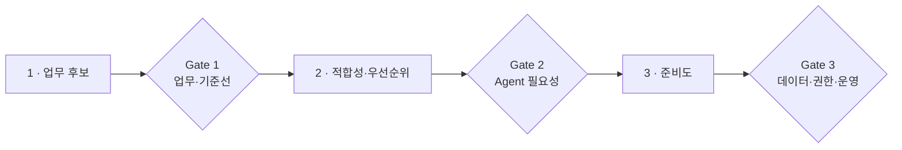
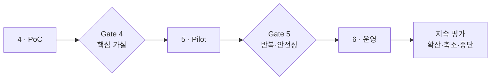
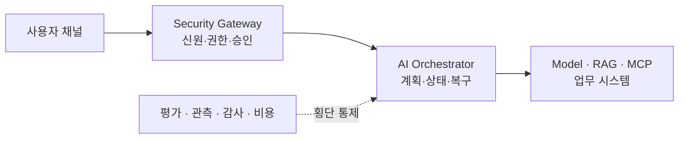

# 기업 AI Agent 도입 로드맵: 업무 발굴부터 PoC·운영 전환까지 6단계

기업에서 AI Agent 도입을 검토하면 “어떤 LLM·RAG·MCP·멀티 Agent를 써야 하는가?”부터 묻기 쉽습니다. 모두 필요한 질문이지만 첫 번째 질문은 아닙니다.

기업 AI Agent 도입의 출발점은 **어떤 모델을 선택할지**가 아니라 **누구의 어떤 업무를 어떤 조건에서 개선할지**입니다. 업무와 책임 경계가 정해지지 않은 상태에서 기술부터 선택하면, 시연은 빠르게 만들 수 있어도 운영 전환 단계에서 범위·권한·품질·비용을 다시 설계하게 됩니다.

AI Agent는 요청을 이해하고 정보를 검색하며, 상황에 따라 계획하고 기업 시스템의 Tool을 호출합니다. 잘못된 판단이 실제 시스템 변경으로 이어질 수 있으므로 데이터·API·권한·승인·복구·감사와 운영 책임을 함께 다뤄야 합니다.

```text
요청 이해 → 정보 검색 → 계획 → Tool 호출 → 결과 확인
```

이 글에서는 기업 AI Agent 도입을 다음 여섯 단계로 정리합니다.

1. 업무 후보 발굴
2. Agent 적합성 판단과 후보 우선순위화
3. 준비도와 위험 진단
4. 성공 기준과 PoC 설계
5. 제한된 Pilot과 운영형 구현
6. 운영 전환과 단계적 확산

목표는 같은 기술을 강요하는 것이 아니라, **기술 구매 전에 문제와 증거를 정의하고 단계별 통과 조건을 확인하며 투자 범위를 넓히는 것**입니다.

1분 요약은 간단합니다. **업무와 기준선을 먼저 정하고, Agent가 꼭 필요한지 확인한 뒤, 데이터·권한 준비도를 통과한 후보만 PoC로 검증합니다. PoC의 증거가 충분하면 제한된 Pilot으로 옮기고, 운영 준비도를 통과한 범위만 단계적으로 확산합니다.**

## 1. AI Agent 도입은 모델 선정이 아니라 업무 설계에서 시작한다

모델은 바뀌지만 업무 목표와 책임 구조는 프로젝트의 기준점으로 남습니다. “사내 AI Agent 구축” 같은 요구는 다음처럼 업무 단위로 바꿔야 검증할 수 있습니다.

- **사내 문서를 잘 찾아주는 AI** → 권한 범위 안의 규정·매뉴얼을 검색하고 근거 문서와 함께 답변하는 업무 후보로 구체화합니다.
- **회의 업무 자동화** → 녹취록에서 결정 사항을 추출하고 담당자가 승인한 후 업무 후보를 등록하는 흐름으로 구체화합니다.
- **고객 지원 AI** → 상담 이력을 요약하고 정책에 맞는 답변 초안을 상담원에게 제안하는 범위로 한정합니다.
- **개발·영업 지원 AI** → 이슈·승인 자료를 조회해 보고서·제안서 초안을 만들고 담당자가 확정하는 업무로 정의합니다.

[Google Cloud의 업무 사례 정의 지침](https://docs.cloud.google.com/docs/ai-ml/generative-ai/evaluate-define-generative-ai-use-case)은 측정 가능한 목표와 사용자 기대에서 출발하도록 설명합니다. [Microsoft의 AI Agent 비즈니스 계획 지침](https://learn.microsoft.com/en-us/azure/cloud-adoption-framework/ai-agents/business-strategy-plan)도 Agent가 불필요한 업무를 구분하고 가치·실현 가능성·사용자 수용성을 함께 평가하도록 권합니다. 특정 Cloud 선택이 아니라 다음 공통 원칙을 참고한 것입니다.

```text
기술 후보에서 업무를 찾지 않는다.
업무 목표에서 필요한 기술을 선택한다.
```

## 2. 모든 AI 업무에 Agent가 필요한 것은 아니다

AI Agent는 목표를 해석하고, 상황에 따라 단계를 구성하며, Tool을 호출하는 데 강점이 있습니다. 하지만 실행 자유도가 커질수록 예측 가능성·비용·보안·테스트 부담도 증가합니다.

업무에 맞는 가장 단순한 구조부터 검토해야 합니다.

- **규칙과 순서가 고정된 업무**: 일반 애플리케이션·Workflow를 우선 검토합니다. 필수값 검증과 정해진 승인 단계가 대표적입니다.
- **문서를 찾아 답변하면 충분한 업무**: 검색·RAG를 우선 검토합니다. 규정 검색과 제품 매뉴얼 질의가 대표적입니다.
- **문장을 분류·요약·추출하는 업무**: 단일 LLM 호출 또는 AI Pipeline을 검토합니다. 상담 분류와 회의 요약이 대표적입니다.
- **상황에 따라 여러 정보와 Tool을 조합하는 업무**: AI Agent를 검토합니다. 회의 검색→업무 후보 생성→승인 후 등록 같은 흐름입니다.
- **여러 전문 역할이 독립적으로 협업하는 업무**: 제한된 Multi-agent를 검토합니다. 조사·검증·종합 역할 분리가 대표적입니다.

실행 단계가 요청마다 달라지고, 여러 데이터·업무 시스템을 선택하며, 중간 결과에 따라 다음 행동이 바뀌거나 중단·재개 상태가 필요할수록 Agent의 필요성이 커집니다.

RAG·Workflow·Agent는 서로 배타적인 선택지가 아닙니다. 실제 시스템은 RAG로 근거를 찾고, Workflow로 승인 순서를 고정하며, 필요한 경우에만 Agent 계층이 상황에 맞게 Tool과 다음 단계를 조정하는 혼합 구조가 일반적입니다. 여기서 판단할 것은 **자율적으로 조정하는 계층이 필요한가**입니다.

정해진 조건문과 Workflow로 충분한 업무를 Agent로 만들면 테스트하기 어렵고 비용만 늘어날 수 있습니다. Agent 도입의 첫 번째 설계 능력은 **Agent를 어디에 쓰지 않을지 결정하는 능력**입니다.

## 3. 전체 로드맵은 여섯 단계와 다섯 개 Stage Gate로 운영한다

아래 여섯 단계와 다섯 개 Stage Gate는 특정 기관의 공식 표준 모형이 아닙니다. NIST·Microsoft·Google·OWASP의 공개 지침을 기업 구축 의사결정에 맞게 종합한 실무 프레임입니다. NIST AI RMF의 네 기능도 고정된 순차 단계가 아니라 수명주기에서 반복 적용하는 위험관리 기능입니다.

단계를 일정표로만 관리하면 “무엇을 확인해야 다음 투자로 넘어가는지”가 흐려집니다. 그래서 단계 사이에 다음 투자 여부를 판단하는 **단계 전환 Gate(Stage Gate)**를 둡니다.

1. **업무 후보 — Stage Gate 1**: 업무와 기준선이 명확한지 판단하고 흐름·문제·사용자·기준선을 산출합니다.
2. **적합성·우선순위 — Stage Gate 2**: RAG·Workflow를 조정할 Agent 계층이 필요한지 판단하고 대안 비교·우선순위를 산출합니다.
3. **준비도 — Stage Gate 3**: 데이터·API·권한·담당자가 준비됐는지 판단하고 통합·보안·운영 진단을 산출합니다.
4. **PoC — Stage Gate 4**: 핵심 가설이 재현 가능한 증거로 통과했는지 판단하고 성공 계약·평가 결과를 산출합니다.
5. **Pilot — Stage Gate 5**: 실제 조건에서 안전하게 반복 가능한지 판단하고 운영형 구조·사용자 결과를 산출합니다.
6. **운영 — 지속 평가**: 품질·비용·위험을 보며 확산할지 판단하고 SLO·Runbook·확산 계획을 관리합니다.



*도입 전반부 — 업무 후보에서 준비도 Gate까지 불확실성을 줄입니다.*



*도입 후반부 — PoC 증거를 실제 조건의 Pilot과 지속 평가로 연결합니다.*

Stage Gate는 형식적인 승인 절차가 아니라, 불확실성이 큰 상태에서 한 번에 전체 구축비를 투자하지 않도록 하는 위험 통제입니다. 각 Stage Gate에는 평균 점수로 상쇄할 수 없는 **필수 차단 기준**을 둘 수 있습니다.

## 4. 1단계 — 업무 후보를 사용자 행동과 결과로 작성한다

업무 후보는 “챗봇”, “RAG”, “Agent” 같은 기술 이름이 아니라 현재 행동과 바꿀 결과로 작성합니다.

```text
사용자 + 현재 업무와 병목 + AI가 도울 행동
  + 사람이 유지할 책임 + 기대 결과
```

예를 들어 “회의 업무 자동화” 대신 “프로젝트 관리자가 녹취록을 다시 읽고 후속 업무를 등록하는 과정에서 담당자·기한 누락을 줄이기 위해, AI가 결정 사항과 업무 후보를 구조화하고 사람이 등록을 승인한다”라고 씁니다. AI와 사람의 책임을 먼저 나누면 권한·화면·평가 기준을 설계하기 쉬워집니다.

업무 인터뷰에서는 다음을 확인합니다.

- 이 업무를 실제로 수행하는 사용자는 누구인가?
- 현재 시작 조건과 종료 조건은 무엇인가?
- 자주 발생하는 예외와 잘못 처리했을 때의 영향은 무엇인가?
- 현재 소요 시간·대기 시간·재작업을 측정할 수 있는가?
- 반드시 사람이 판단할 단계와 결과를 기록할 시스템은 무엇인가?

기준선이 없다면 “AI 적용 후 좋아졌다”는 판단도 하기 어렵습니다. 정확한 수치가 아직 없더라도 현재 처리 단계, 빈도, 병목과 실패 유형은 기록해야 합니다.

## 5. 2단계 — Agent 적합성과 가치·실현 가능성·위험으로 우선순위를 정한다

아이디어가 여러 개라면 가장 화려한 사례가 아니라 **가치는 크고, 검증 가능하며, 실패 영향은 통제할 수 있는 사례**부터 선택합니다.

- **업무 가치**: 시간 절감, 품질 향상, 누락 감소, 처리량과 사용자 경험을 확인합니다.
- **데이터 준비도**: 접근 가능성, 품질, 대표성, 최신성과 사용 권리를 확인합니다.
- **실현 가능성**: 데이터, API, 인증, 테스트 환경과 담당자를 확인합니다.
- **Agent 적합성**: 비정형 해석, 상황별 계획과 Tool 조합 필요성을 확인합니다.
- **안전성**: 개인정보, 권한, 외부 전송과 잘못된 행동의 영향을 확인합니다.
- **운영 가능성**: 사용자 수용성, 평가, 장애 대응, 비용과 변경 관리를 확인합니다.

점수 합계 하나로 자동 결정하지는 않습니다. 특히 보안·규제·권한 위험을 업무 가치와 평균내면 안 됩니다.

`우선순위 점수`는 가치와 학습 효과를 비교하는 도구이고, `진행 가능 여부`는 필수 차단 기준을 별도로 통과해 결정합니다.

초기 후보는 사람이 검토할 수 있는 읽기·초안 제안으로 시작하고, 데이터·API Owner와 비교 기준선이 명확하며, 실패 영향이 제한적이고 인접 업무로 확장 가능한 것이 좋습니다.

자동 송금, 인사 평가 확정, 법적 통지, 대량 삭제처럼 영향이 큰 업무는 첫 PoC에서 완전 자율 실행을 목표로 삼지 않는 편이 안전합니다.

## 6. 3단계 — 데이터·통합·권한·운영 준비도를 진단한다

좋은 아이디어라도 준비되지 않은 조직 조건에서는 PoC가 실제 운영 가능성을 설명하지 못합니다.

[Microsoft의 AI 도입 계획 지침](https://learn.microsoft.com/en-us/azure/cloud-adoption-framework/ai/plan)은 기술·데이터·인프라 준비도를 평가하고 업무 가치와 실현 가능성으로 사례를 우선순위화하도록 설명합니다. NIST AI RMF의 `Govern`, `Map`, `Measure`, `Manage`는 고정 순서가 아니라 수명주기에서 반복하는 위험관리 기능입니다([NIST AI RMF Core](https://airc.nist.gov/airmf-resources/airmf/5-sec-core/)).

실제 진단에서는 다섯 영역을 함께 봅니다.

- **데이터**: 위치·최신성·대표성·품질·사용 권리·보존 정책과 사용자/조직/Tenant 권한을 확인합니다.
- **통합**: API·Event·Database 계약, 인증, 테스트 환경, Timeout·멱등성·Rate Limit을 확인합니다.
- **권한·안전**: 신원 전달, 객체 인가, 행동 위험도, 사람 승인, 감사와 Negative Test를 확인합니다.
- **기술·인프라**: 환경 제약, 지연·가용성, Version, 관측, 배포·Rollback·Secret 관리를 확인합니다.
- **조직·운영**: 업무·데이터 Owner, 현업 평가자, 보안·법무 검토와 장애·비용 책임을 확인합니다.

AI Agent는 Tool과 외부 시스템을 사용하므로 실행 경계를 더 분명히 해야 합니다. 검색 문서와 Tool 출력도 신뢰할 수 없는 입력으로 다루고, Prompt Injection을 완전히 제거할 수 있다는 전제 대신 **영향을 최소 권한·허용 목록·승인·격리·출력 검증으로 제한**해야 합니다. [OWASP의 Agentic AI 위협과 완화 지침](https://genai.owasp.org/resource/agentic-ai-threats-and-mitigations/)도 Agent의 목표·Memory·Tool·다른 Agent 상호작용에서 발생하는 위험을 별도로 다룹니다.

진단 결과는 “가능/불가능” 한 줄보다 다음 형태가 유용합니다.

- **준비됨**: PoC 시작에 필요한 조건을 확보했습니다. 성공 기준과 실험 설계로 진행합니다.
- **조건부 준비**: 일부 보완 후 시작할 수 있습니다. 데이터·API·정책 선행 작업을 수행합니다.
- **탐색 필요**: 핵심 사실을 확인하지 못했습니다. 짧은 Discovery를 수행합니다.
- **보류**: 현재 위험이나 비용이 가치보다 큽니다. 범위를 축소하거나 다른 후보를 선택합니다.

## 7. 4단계 — 성공 계약을 먼저 만들고 PoC는 가장 큰 가설만 검증한다

PoC는 작은 제품이 아니라 **불확실성을 줄이는 실험**입니다.

따라서 기능 목록보다 먼저 성공 계약 (Success Contract)을 작성합니다.

```yaml
objective: 회의 후속 업무 초안 생성의 실무 적용 가능성 검증
scope:
  users: [제한된 검증 참여자]
  data: 승인된 대표 Sample v1
  actions: [조회, 초안 제안]
hypotheses:
  - 결정 사항과 후속 업무를 검토 가능한 구조로 추출한다
evidence:
  - versioned_dataset_and_human_review
  - authorization_negative_test_suite
blocking_criteria:
  - 정의된 권한 Negative Test Suite에서 교차 조직 노출 관측 0건
  - 승인 없는 실제 업무 등록 없음
decision: pass | conditional | fail
```

`교차 조직 노출 관측 0건`은 모든 상황에서의 절대적 무결함을 뜻하지 않습니다. 고정한 Dataset·정책·시스템 Version과 명시된 공격·권한 시험 범위에서 관측된 결과이며, 범위나 Version이 바뀌면 다시 검증합니다.

좋은 PoC는 다음 질문에 답합니다.

- 선택한 업무에 AI 또는 Agent가 실제로 도움이 되는가?
- 대표 데이터와 실패 사례에서 결과를 재현할 수 있는가?
- API·인증을 연결하고 금지된 데이터와 행동을 차단할 수 있는가?
- 예상 지연과 비용이 다음 단계 검토 범위 안에 있는가?
- 운영형 구현에 새로 필요한 항목은 무엇인가?

PoC에서 모든 운영 기능을 만들 필요는 없습니다. 하지만 운영 전환에 필요한 공백을 숨겨서는 안 됩니다.

```text
PoC 결과
  = 검증한 가설
  + 사용한 데이터와 조건
  + 통과·미달 증거
  + 알려진 한계
  + Pilot 전 선행 과제
```

여기서는 다음 투자 판단에 필요한 최소 계약만 다룹니다. PoC와 운영 시스템의 차이는 [AI PoC가 운영 단계에서 멈추는 이유](https://aiarchitect.tistory.com/15), 지표·인수 조건 작성법은 [AI 프로젝트 성공 기준 8가지](https://aiarchitect.tistory.com/20)에서 더 자세히 설명했습니다.

## 8. PoC에서 반드시 포함할 실패 사례와 Negative Test

정상 질문 몇 개가 잘 동작하는 것만으로는 Agent의 안전성을 설명할 수 없습니다.

- **데이터·검색**: 빈 문서, 오래되거나 충돌하는 문서, 권한 없는 문서와 근거 없는 답변을 시험합니다.
- **입력·보안**: 모호하거나 긴 요청, 간접 Prompt Injection, Secret·외부 전송 유도를 시험합니다.
- **Tool·권한**: 잘못된 인자, 다른 사용자·조직·Tenant 객체와 승인 없는 쓰기를 시험합니다.
- **운영·복구**: Timeout, Rate Limit, 중복·부분 성공, 취소·재시작·재개를 시험합니다.

실패 사례는 실제 운영에서 어떤 실패를 허용하고 어떻게 안전하게 종료할지 합의하는 과정입니다. 상세 위협·시험 항목은 [AI Agent 보안 설계](https://aiarchitect.tistory.com/8)를 함께 참고할 수 있습니다.

## 9. 5단계 — Pilot은 실제 사용자와 제한된 권한으로 운영한다

PoC가 기술 가설을 통과했다면 바로 전사 배포하지 않습니다. 제한된 사용자·데이터·업무 범위에서 Pilot을 운영합니다.

```text
PoC
  통제된 대표 데이터와 환경에서 핵심 가설 검증

Pilot
  실제 사용자·데이터에서 제한 운영하며 수용성과 반복성 확인

Production
  공식 업무 책임·SLO·변경·장애 대응 적용
```

Pilot에서는 자율성을 단계적으로 높입니다.

- **Shadow**: Agent는 결과를 만들지만 업무에는 반영하지 않고, 사람은 기존 결과와 비교합니다.
- **Assist**: Agent는 검색·요약·초안을 제안하고, 사람은 검토·수정·최종 처리합니다.
- **Approve**: Agent는 변경 계획과 인자를 제시하고, 사람이 승인한 뒤 실행을 허용합니다.
- **Bounded Auto**: Agent는 허용된 저위험 범위에서 자동 실행하고, 사람은 예외·정책·성과를 감독합니다.

첫 Pilot부터 완전 자율 실행을 목표로 삼을 필요는 없습니다. 읽기와 제안에서 시작하면 품질과 사용자 수용성을 관찰하면서 권한을 안전하게 조정할 수 있습니다.

### Pilot에서 추가로 확인할 것

- 실제 업무 분포에서 품질이 유지되는가?
- 사용자는 결과를 이해하고 적절히 검토하는가?
- 승인 요청이 형식 절차가 되지 않고 잘못된 결과를 신고·수정할 수 있는가?
- 업무 한 건당 전체 지연과 비용은 얼마인가?
- 실패한 실행을 중복 부작용 없이 재시도하고, 피드백을 평가 Dataset에 반영할 수 있는가?

## 10. 운영형 Architecture와 Stage Gate 5를 함께 설계한다

기업 AI Agent는 LLM 호출 코드만으로 구성되지 않습니다.

```text
사용자 채널
  → Security Gateway
    → AI Orchestrator
      ├─ Model Provider
      ├─ RAG / Knowledge Search
      ├─ MCP / Enterprise Tools
      └─ Workflow State / Queue
    → 기존 업무 시스템·Database·문서

횡단 통제
  Identity · Authorization · Approval · Audit
  Evaluation · Observability · Cost · Recovery
```

각 계층의 책임을 분리하면 모델이나 검색 엔진이 바뀌어도 보안·업무 계약을 유지하기 쉽습니다. Java Security Gateway와 Python AI 실행부는 [기업용 AI 백엔드 설계](https://aiarchitect.tistory.com/5), 상태와 복구는 [운영 가능한 AI Agent 만들기](https://aiarchitect.tistory.com/7), 객체 인가는 [엔터프라이즈 AI Agent 권한 설계](https://aiarchitect.tistory.com/19)에서 더 자세히 설명했습니다.



*운영형 Architecture — 실행 경로와 횡단 통제를 분리해 변경과 장애의 영향을 제한합니다.*

### Stage Gate 5 판단을 위한 Production Readiness 체크리스트

Pilot 기능이 동작해도 운영 책임을 받을 준비가 된 것은 아닙니다. [Google SRE의 Production Readiness Review](https://sre.google/sre-book/evolving-sre-engagement-model/)는 Architecture·의존성·계측·장애 대응·용량·변경 관리를 검토합니다. **이 글에서는 생성형 AI 특성을 반영해** 다음 여섯 항목을 핵심 기준으로 확장합니다.

1. **신원·권한·승인:** 사용자·Service·Tenant 신원을 전달하고 Tool 실행 시 객체 인가와 행동별 승인을 다시 확인한다.
2. **상태·복구:** Timeout·Retry·중복·부분 실패를 처리하고 안전하게 재개·종료한다.
3. **평가·변경:** 고정된 Dataset과 Model·Prompt·Tool·Index Version으로 회귀 평가하고 Rollback한다.
4. **관측·감사:** 원문 Prompt나 개인정보를 무조건 저장하지 않는다. Version·정책 판정·요청/실행 ID를 연결하고 민감정보를 마스킹하며 로그 접근·보존 정책을 적용한다.
5. **품질·SLO·비용:** End-to-end 품질·지연·안전과 성공한 업무 한 건의 전체 비용을 본다.
6. **운영 책임:** 장애 Owner, Runbook, Escalation과 변경 승인 경로가 있다.

[Google Cloud의 생성형 AI 운영 지침](https://docs.cloud.google.com/architecture/deploy-operate-generative-ai-applications)은 개별 모델이 아니라 전체 Chain을 Version 관리하고 End-to-end로 평가하며 운영 데이터 변화와 품질을 지속 관측하도록 설명합니다.

## 11. 6단계 — 운영 전환은 한 번의 Launch가 아니라 통제된 확산이다

운영 전환 후에는 대상 사용자, 데이터와 행동 권한을 한 번에 넓히지 않습니다.

```text
팀 1개
  → 업무 1개
    → 읽기·제안
      → 승인 기반 쓰기
        → 인접 업무
          → 다른 조직
```

확산 단위마다 새 사용자의 권한·데이터·실패 영향, 평가 Dataset의 대표성, 동시성·비용, 운영팀 수용 능력과 승인 정책을 다시 확인합니다.

NIST AI RMF의 `Map → Measure → Manage`는 일회성 단계가 아니라 운영 중에도 반복됩니다. 업무 환경, 모델, 데이터와 위험이 바뀌면 다시 상황을 정의하고 측정한 뒤 대응을 조정해야 합니다.

`운영 관측 → 실패·피드백 수집 → Dataset·정책 갱신 → 회귀 시험 → 제한 배포`를 반복합니다.

## 12. 조직 역할을 기술팀 한 곳에 몰아넣지 않는다

AI Agent는 업무·데이터·보안·운영을 함께 바꾸므로 AI 개발팀만으로 결정하기 어렵습니다.

- **Sponsor·업무 Owner·사용자**: 목적·투자·업무 규칙·성공 판단과 사용자 피드백을 책임집니다.
- **데이터 Owner**: 접근·품질·보존과 사용 권리를 책임집니다.
- **보안·개인정보 담당**: 신원, 권한, 위협, 감사와 규정을 책임집니다.
- **Architecture·AI·Backend 담당**: 시스템 경계, 통합, RAG·Model·Agent와 평가 구현을 책임집니다.
- **운영 담당**: 배포, 관측, 장애, 비용과 Runbook을 책임집니다.
- **구축 Partner**: 합의 범위의 설계·구현·검증과 인수 지원을 책임집니다.

외부 구축사가 모든 업무 결정을 대신할 수는 없고, 내부 조직이 모든 기술을 먼저 학습할 필요도 없습니다. 내부는 업무 목적·데이터 권한·최종 정책·인수를 책임지고, Partner는 진단·설계·구현·시험·운영 전환을 지원하며, 성공 기준·위험 수용·Pilot 판정은 공동 결정합니다.

## 13. 단계 계약으로 불확실성과 비용을 함께 관리한다

요구사항이 불확실한 AI 프로젝트를 처음부터 하나의 고정 범위로 계약하면, 확인되지 않은 가정이 가격과 일정 안에 숨어듭니다.

- **Discovery·진단**: 문제와 준비도가 불명확할 때 적합합니다. 업무 후보, 준비도, Architecture와 Roadmap을 산출합니다.
- **PoC**: 핵심 기술·품질 위험 검증에 적합합니다. 실행 결과, 평가 증거, 한계와 다음 단계를 산출합니다.
- **Pilot**: 제한 사용자·실데이터 검증에 적합합니다. 운영형 핵심 기능, 사용자 결과와 운영 Gap을 산출합니다.
- **Production**: 공식 업무 전환 단계입니다. 본 시스템, 시험, 배포, Runbook과 인수 자료를 산출합니다.
- **운영 개선**: 품질·비용·범위 최적화 단계입니다. Monitoring, 평가와 개선 Release를 산출합니다.

단계 계약은 확인된 사실과 남은 불확실성을 분리해 다음 투자 결정을 설명하는 방식입니다. 산정 항목은 [AI 프로젝트 견적이 모델 API 비용만으로 정해지지 않는 이유](https://aiarchitect.tistory.com/21)에서 자세히 다뤘습니다.

## 14. 자주 실패하는 도입 안티패턴

- **전사 Agent부터 선언**하지 말고 한 사용자·업무·데이터 범위에서 시작합니다.
- **최신 모델 Demo를 도입 계획으로 사용**하지 말고 데이터·통합·책임·총비용까지 검증합니다.
- **모든 업무를 Agent로 구현**하지 말고 Workflow·RAG·Agent 혼합 구조를 비교합니다.
- **정상 Sample만으로 PoC**하지 말고 실제 분포·권한·오류·예외를 포함합니다.
- **평균 품질로 보안 위험을 상쇄**하지 말고 필수 차단 기준을 독립 판정합니다.
- **승인 버튼만 추가**하지 말고 대상·행동·영향·인자를 확인한 뒤 승인 내용과 실제 실행의 일치를 검증합니다.
- **Pilot 후 즉시 전사 확산**하지 말고 확산 단위마다 Stage Gate를 재적용합니다.
- **구축 후 운영 담당을 지정**하지 말고 평가·장애·비용·변경 Owner를 설계 때 지정합니다.

## 15. 상담 전에 준비하면 좋은 열 가지

완성된 요구사항 문서는 필요하지 않습니다. 다음 내용을 아는 범위에서 정리하면 첫 진단의 품질이 높아집니다.

1. 개선할 업무·사용자와 현재 병목
2. 문서·데이터 위치와 Owner
3. 연결할 시스템·API와 인증 방식
4. 사용자·조직·Tenant 권한 구조
5. AI가 조회·제안·변경할 범위
6. 절대 허용할 수 없는 실패
7. Cloud·온프레미스·망 분리 등 환경 제약
8. PoC·Pilot·Production 중 원하는 단계
9. 희망 일정과 단계별 예산 범위
10. 내부 업무·기술·보안 담당자

모르는 항목은 `미확정`으로 표시해도 됩니다. 중요한 것은 불확실성을 숨기지 않고 Discovery에서 확인할 항목으로 만드는 것입니다.

## 16. 도입 로드맵 최종 체크리스트

- [ ] 기술 이름이 아니라 사용자 업무로 후보를 정의했다.
- [ ] 기준선·기대 결과와 더 단순한 기술 대안을 비교했다.
- [ ] 데이터·API·인증·테스트 환경과 Owner를 확인했다.
- [ ] 실제 업무 분포를 대표하는 Version 고정 평가 Dataset이 있다.
- [ ] 행동 위험도와 사람 승인·자동 실행 경계를 정했다.
- [ ] 보안·개인정보·운영 책임자를 지정했다.
- [ ] PoC 가설·필수 차단 기준과 실패·권한 Negative Test가 있다.
- [ ] Pilot 사용자·데이터·기간·권한이 제한되어 있다.
- [ ] 품질·지연·비용·안전·복구 기준이 있다.
- [ ] Version, Trace, Audit, Rollback과 Runbook이 있다.
- [ ] 확산 단위마다 Stage Gate를 다시 적용한다.

## 17. 마무리

기업 AI Agent 도입은 “좋은 모델을 연결하는 프로젝트”가 아닙니다.

```text
업무 목표
  → 적합한 기술 선택
    → 데이터·API·권한 준비
      → 증거 중심 PoC
        → 제한된 Pilot
          → 운영 통제와 단계적 확산
```

결론이 Workflow나 RAG와 사람 검토일 수도 있습니다. Agent가 필요하다면 실제 기업 시스템에 안전하게 연결하고 반복 운영할 구조가 필요합니다. 좋은 로드맵은 기능을 많이 약속하는 문서가 아니라, **업무 가치와 위험을 함께 놓고 다음 투자를 재현 가능한 증거로 결정하게 하는 문서**입니다.

기업 AI Agent·MCP·RAG 도입을 검토하고 있다면 현재 업무와 데이터·연동·보안 조건을 기준으로 `진단 → Architecture → PoC → 운영 전환` 범위를 단계적으로 설계할 수 있습니다.

[크몽에서 AI Agent·RAG·MCP 구축 상담하기](https://kmong.com/gig/798627)

첫 문의에는 실제 고객 문서·개인정보·기밀 데이터·접속 주소·API Key 같은 자격 증명을 첨부하지 마세요. 업무 유형과 제약을 비식별 요약으로 먼저 공유하고, 필요한 경우 보안·비밀유지 조건과 안전한 전달 방법을 합의한 뒤 자료 범위를 정하는 편이 좋습니다.

## 함께 읽으면 좋은 글

- [AI PoC가 운영 단계에서 멈추는 이유: 인증, 권한, 복구와 관측성](https://aiarchitect.tistory.com/15)
- [AI 프로젝트 성공 기준 8가지: 모델 정확도 전에 합의할 인수 기준](https://aiarchitect.tistory.com/20)
- [AI 프로젝트 견적이 모델 API 비용만으로 정해지지 않는 이유: 10개 산정 항목](https://aiarchitect.tistory.com/21)
- [기업용 AI 백엔드 설계: Java Security Gateway와 Python AI Orchestrator의 책임 분리](https://aiarchitect.tistory.com/5)
- [운영 가능한 AI Agent 만들기: Checkpoint, Retry, Idempotency와 Outbox](https://aiarchitect.tistory.com/7)
- [엔터프라이즈 AI Agent 권한 설계: 사용자·테넌트·Tool 인가와 감사 로그](https://aiarchitect.tistory.com/19)
- [AI Agent 승인 정책 설계: 읽기·쓰기·중요·파괴 작업을 구분하는 방법](https://aiarchitect.tistory.com/16)
- [AI Agent 보안 설계: Prompt Injection, Tool 권한과 데이터 유출을 막는 8개 경계](https://aiarchitect.tistory.com/8)

## 참고 자료

- [NIST AI Risk Management Framework Core](https://airc.nist.gov/airmf-resources/airmf/5-sec-core/)
- [NIST AI RMF Playbook](https://airc.nist.gov/airmf-resources/playbook/)
- [Microsoft Cloud Adoption Framework: Business plan for AI agents](https://learn.microsoft.com/en-us/azure/cloud-adoption-framework/ai-agents/business-strategy-plan)
- [Microsoft Cloud Adoption Framework: Plan for AI adoption](https://learn.microsoft.com/en-us/azure/cloud-adoption-framework/ai/plan)
- [Google Cloud: Evaluate and define your generative AI business use case](https://docs.cloud.google.com/docs/ai-ml/generative-ai/evaluate-define-generative-ai-use-case)
- [Google Cloud: Deploy and operate generative AI applications](https://docs.cloud.google.com/architecture/deploy-operate-generative-ai-applications)
- [Google SRE: The Evolving SRE Engagement Model](https://sre.google/sre-book/evolving-sre-engagement-model/)
- [OWASP: Agentic AI Threats and Mitigations](https://genai.owasp.org/resource/agentic-ai-threats-and-mitigations/)

> 이 글은 2026년 8월 2일 기준 NIST, Microsoft, Google과 OWASP의 공식 공개 자료 및 공개 가능한 기업 AI 시스템 설계·구현 경험을 바탕으로 작성했습니다. 예시 업무, ID, 데이터, 조직, 평가 계약과 단계는 설명용 합성 사례이며 특정 고객·회사·제품을 나타내지 않습니다. 실제 도입 범위와 통제 수준은 업무 영향, 데이터, 관련 법규, 조직 정책, 인프라와 운영 책임을 확인해 별도로 결정해야 합니다.
> NIST AIRC는 같은 날짜 기준 AI RMF 1.0 개정이 진행 중이라고 안내하고 있으므로, 향후 개정판이 공개되면 용어와 참조 절을 다시 확인해야 합니다.
