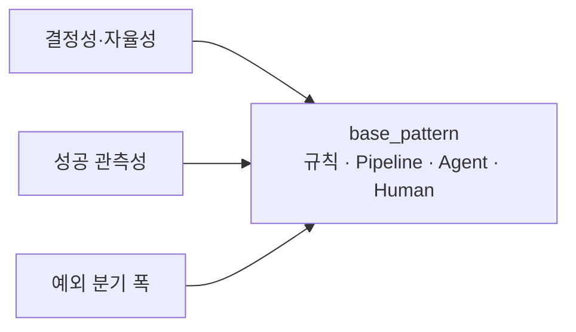
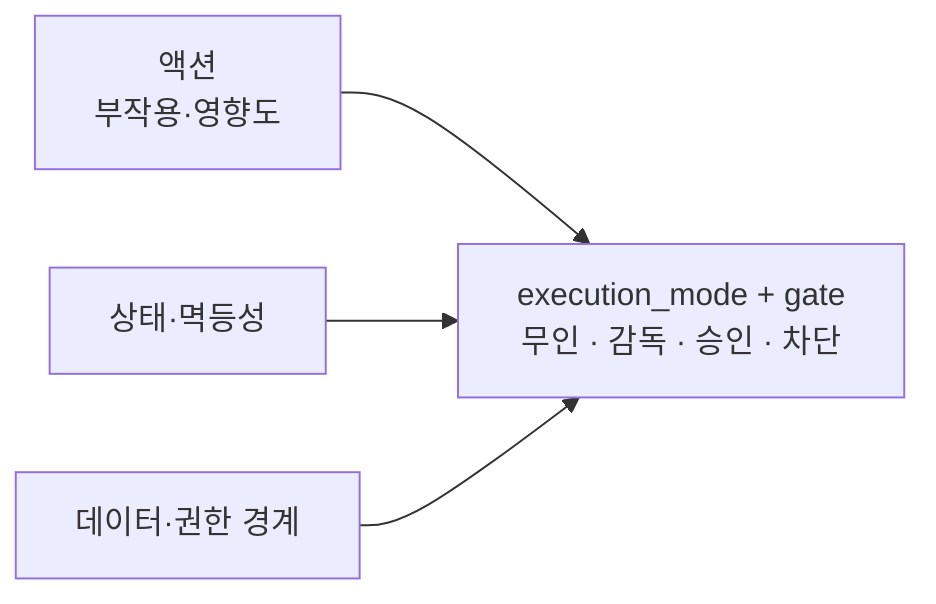
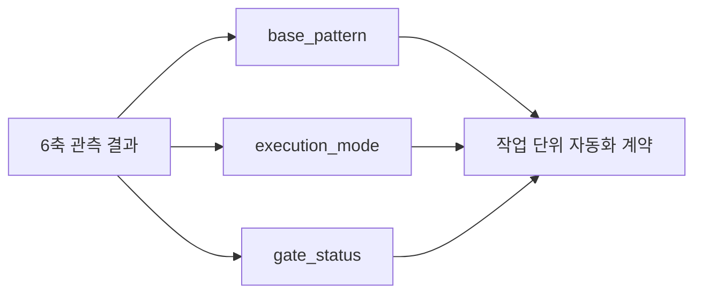

# 이 업무에 AI Agent가 맞는가: 자동화 적합도를 판정하는 기술 기준

기업 AI Agent 도입 로드맵에서 업무 후보를 발굴한 다음 단계가 **적합성 판단**입니다. [기업 AI Agent 도입 로드맵 6단계](https://aiarchitect.tistory.com/65)에서 2단계로 다룬 그 판단을, 이 글은 "가치가 큰가"가 아니라 **"이 업무의 시스템 속성이 어떤 자동화 방식을 정당화하는가"** 라는 기술 기준으로 다룹니다.

적합성 판단은 흔히 기대 효과·비용 절감 같은 가치 매트릭스로 흐릅니다. 그러나 가치가 크다고 Agent가 맞는 것은 아닙니다. 규칙으로 끝나는 업무에 Agent를 얹으면 비결정성만 늘고, **판단이 필요해도 단발 LLM 호출로 충분한 업무를 자율 Agent로 만들면** 통제 비용만 늘며, 결과의 업무적 정확성을 판정할 수 없는 업무는 자동화 자체가 검증 불가능합니다.

핵심 구분이 하나 있습니다 — **판단이 필요하다(LLM)** 와 **자율 실행이 필요하다(Agent)** 는 다른 층입니다. 분류·요약·초안 같은 단발 판단은 LLM 파이프라인으로 충분하고, 계획을 세우고 여러 Tool을 상황에 따라 호출하며 반복하는 업무에만 Agent가 정당화됩니다. 이 글에서 제시하는 축·패턴·게이트는 **표준이 아니라 저자가 제안하는 판정 모델**이며, 적합도를 여섯 개의 시스템 속성 축으로 판정한 뒤 그 결과를 `base_pattern`(어떤 구조) × `execution_mode`(어떤 실행 권한) × `gate_status`(통과·조건부·차단)의 조합으로 매핑합니다. 본문의 값·업무명은 합성 예시이며 특정 제품·회사와 무관하고, 상호 참조 링크만 실제 URL입니다.

## 1. 적합도는 가치가 아니라 시스템 속성으로 판정한다

"이 업무는 임팩트가 크니 Agent로 하자"는 판단은 자동화의 첫 질문이 아닙니다. 임팩트는 우선순위를 정할 뿐, **자동화가 안전하고 검증 가능한지**는 다른 문제입니다.

```text
가치 기준   :  "효과가 크다"           → 우선순위 판단(중요하지만 적합성은 아님)
속성 기준   :  "결정성·자율성·관측성·경계" → 자동화가 안전·검증 가능한지의 판단
```

가치 판단은 어떤 업무를 먼저 볼지 정할 때 쓰고, 적합도 판단은 그 업무를 **어떤 구조로, 어떤 실행 권한으로** 자동화할지(또는 하지 않을지)를 정할 때 씁니다. 이 글은 후자만 다룹니다.

## 2. 판정 6축 개요

적합도를 여섯 축으로 나눕니다. 각 축은 "좋다/나쁘다"가 아니라 **관측 가능한 질문**과 **부적합·주의 신호**를 가집니다.

| 축 | 핵심 질문 | 부적합·주의 신호 |
|---|---|---|
| 결정성·자율성 | 규칙·단발 판단·자율 실행 중 무엇이 필요한가 | 규칙에 Agent를 얹거나 단발 판단을 자율 Agent로 만듦 |
| 성공 관측성 | 결과의 업무적 정확성을 판정할 수 있는가 | 정확성 판정이 "잘 되면"처럼 미정의 |
| 액션(부작용·영향도) | 부작용(읽기/쓰기)과 영향도(보통/중요/파괴)가 무엇인가 | 파괴·비가역 액션을 무인 자동 실행 |
| 상태·멱등성 | 재시도·중복 실행에 안전한가 | 비멱등 쓰기인데 재시도 안전장치 없음 |
| 예외 분기 폭 | 예외·롱테일이 좁은가 넓은가 | 분기가 넓어 사람 판단이 대부분 |
| 데이터·권한 경계 | 접근 범위가 정의·격리되는가 | 경계 없이 전 범위 접근 |

여섯 축은 서로를 대체하지 않습니다. 가치가 커도 정확성을 판정할 수 없으면 자동화를 검증할 수 없고, 결정성이 높아도 권한 경계가 없으면 적합이 아니라 위험입니다.



*구조 판정 축 — 업무를 어떤 실행 구조로 만들지 결정합니다.*



*안전 판정 축 — 같은 구조라도 어디까지 자동 실행할지 제한합니다.*

## 3. 결정성과 자율성 — 규칙·단발 판단·자율 실행을 구분한다

첫 축은 세 갈래입니다.

- **규칙 결정 가능 (rule-decidable)**: 조건·임계값·룩업으로 결과가 정해짐 → 규칙 워크플로우. LLM은 결과를 흔들 뿐입니다.
- **판단·단발 (single-shot judgment)**: 비정형 입력을 한 번 해석하면 되는 분류·요약·초안 → **LLM 파이프라인**. Agent가 아닙니다.
- **판단·자율 (agentic)**: 계획을 세우고 상황에 따라 여러 Tool을 호출하며 중간 결과로 다음 행동을 정해야 함 → **제한된 Agent**.

즉 "판단이 필요하다"가 곧 "Agent가 필요하다"는 아닙니다. 자율 Agent는 다단계 계획과 Tool 호출 루프가 실제로 필요할 때만 정당화됩니다. 단발 판단을 자율 Agent로 만들면 계획·툴·복구·감사라는 통제 비용만 늘고 결과는 더 비결정적이 됩니다. Agent는 **자율성이 실제로 필요한 지점**에만 두고, 그 앞뒤의 정형 처리는 규칙으로 감쌉니다.

## 4. 성공 관측성 — 기계 검증·사람 평가·미정의

자동화하려면 결과가 옳은지를 판정할 수 있어야 합니다. 성공 관측성은 두 층입니다.

- **시스템 완료**: 작업이 끝났고 결과를 쓸 수 있는가 — [비동기 완료 상태 설계](https://aiarchitect.tistory.com/18)의 Readiness Predicate가 다루는 층입니다.
- **업무 정확성**: 그 결과가 업무적으로 옳은가 — [AI 프로젝트 성공 기준 8가지](https://aiarchitect.tistory.com/20)의 인수 기준이 다루는 층입니다.

적합도에서 중요한 것은 **업무 정확성**을 실행 시점에 어떻게 판정하느냐이고, 세 갈래로 나뉩니다.

- **기계 검증 가능 (machine-verifiable)**: 개별 산출물을 실행 시점에 **결정적 oracle**(규칙·대조·테스트)로 판정 가능 → 무인 자동 실행 후보. 오프라인 평가 데이터셋으로 평균 성능을 측정하는 것과는 다릅니다.
- **사람 평가 필요 (human-evaluable)**: 의미 정확성·누락·왜곡처럼 사람이 검토해야 판정 가능(일반 요약·자유서술이 여기에 속함) → 감독·제안 모드로 한정.
- **미정의 (undefined)**: 성공 기준이 아직 없음 → 자동화 대상이 아니라 성공 정의 대상. 게이트 **차단**.

정확성이 미정의인 업무를 자동화하면 PoC 결과도 판정할 수 없습니다([PoC가 운영에서 멈추는 함정](https://aiarchitect.tistory.com/15)).

## 5. 액션 — 부작용(읽기·쓰기)과 영향도(보통·중요·파괴)를 분리한다

액션은 한 등급으로 묶이지 않습니다. **부작용 유형**(외부 상태를 바꾸는가)과 **영향도·가역성**은 다른 축이므로 분리해서 판정하고, 여러 액션이 섞이면 **가장 높은 위험을 우선**합니다([승인 정책 설계](https://aiarchitect.tistory.com/16)).

- `side_effect`: `read`(조회·요약·분류) | `write`(레코드 추가·상태 변경). 외부 시스템 상태를 바꾸면 `external_state_change: true`로 표시합니다. "메모리에서 초안 생성"과 "외부에 초안 저장"은 위험도가 다릅니다.
- `impact`: `normal` | `important`(상태 변경·승인 요청) | `destructive`(삭제·비가역, soft delete면 가역).

| side_effect / impact | 예 | 권장 execution_mode |
|---|---|---|
| read / normal | 조회·요약·분류 | 무인(unattended), 사람 평가 필요 시 감독(supervised) |
| write / normal | 내부 초안 생성 | 무인 또는 감독 |
| write / important | 외부 상태 변경·승인 요청 | 승인 바인딩(approval_bound) |
| write / destructive | 삭제·비가역 처리 | 제안만(proposal_only), 사람 확정 필수 |

파괴·비가역 액션이 핵심 경로에 있으면 "무인 실행"은 금지되고 실행 권한이 **제안만**으로 내려갑니다. 이는 자동화 실패가 아니라 실행 권한 선택입니다.

## 6. 상태·멱등성 — 재시도·중복 실행에 안전한가

Agent·파이프라인은 타임아웃·재시도·중복 호출이 흔합니다. 이 축은 **입력 통제**와 **판정**을 분리해서 봅니다.

- 통제: 멱등 키, 지속 상태(durable state), 중복 방지·정합성 조정이 있는가([Checkpoint·Retry·Idempotency·Outbox](https://aiarchitect.tistory.com/7)).
- 판정: 위 통제로 재시도가 안전한가(`safe`) / 안전하지 않은가(`unsafe`) / 비멱등 쓰기가 없어 해당 없음(`not_applicable`).

`unsafe`는 부적합이 아니라 **선결 과제**입니다. 안전장치를 갖추기 전에는 게이트를 `conditional`로 두고 자동 실행 범위를 읽기·초안 수준으로 강등합니다.

## 7. 예외 분기 폭 — 롱테일이 넓으면 사람이 남는다

업무의 예외 분기가 좁으면 파이프라인·Agent가 대부분을 처리하고, 넓으면(롱테일) 사람 판단이 계속 필요합니다. 이는 **정상 경로 비율**과 **예외의 다양성**으로 판정합니다.

- 정상 경로가 분포의 대부분을 차지하고 예외가 유형화되는가 → 자동화 가능.
- 예외가 매번 새롭고 판단이 갈리는가 → `base_pattern`을 **사람 주도(human_led)** 로 두고 Agent는 보조.

넓은 롱테일을 "Agent가 알아서" 처리하리라 가정하면 운영에서 예외가 실패로 쌓입니다. 좁은 정상 경로부터 자동화하고 예외는 사람에게 에스컬레이션하는 경계를 먼저 그립니다. 사람 주도는 자동화 실패가 아니라 패턴 선택이며, 단발 판단이든 자율이든 롱테일이 넓으면 사람 주도가 우선합니다.

## 8. 데이터·권한 경계 — 경계 없는 접근은 적합이 아니라 위험

마지막 축은 **접근 경계**입니다. Agent가 어떤 데이터·시스템에, 누구의 권한으로 접근하는지가 정의·격리되지 않으면, 그 업무는 적합한 게 아니라 위험합니다.

- 테넌트·사용자·자원 단위로 접근이 격리되는가, 최소 권한이 적용되는가([엔터프라이즈 권한 설계](https://aiarchitect.tistory.com/19)).
- 민감 데이터 등급과 처리 규칙이 정의돼 있는가.

경계가 정의되지 않은 전 범위 접근은 자동화 편의가 아니라 유출·오작동의 표면입니다. 경계가 없으면 게이트를 **차단**하고 경계 설계를 선결합니다.

## 9. 판정 → base_pattern × execution_mode

여섯 축의 판정을 하나의 이분법(Agent냐 아니냐)이 아니라 **구조와 실행 권한의 조합**으로 매핑합니다. `base_pattern`(구조)과 `execution_mode`(실행 권한)는 **서로 직교**합니다 — 규칙 워크플로우에도 사람 확정이 붙을 수 있고, 사람 주도 업무에도 중요 액션 승인·멱등성 통제가 필요합니다.

| 결정성·자율성 | 업무 정확성 | side_effect/impact | 예외 분기 | base_pattern | execution_mode |
|---|---|---|---|---|---|
| 규칙 결정 가능 | — | write/normal | — | rule_workflow | unattended |
| 판단·단발 | 기계 검증 | read/normal | 좁음 | llm_pipeline | unattended |
| 판단·단발 | 사람 평가 | read·write/normal | 좁음 | llm_pipeline | supervised |
| 판단·자율 | 기계·사람 | write/important | 좁음 | bounded_agent | approval_bound |
| 판단·단발 또는 자율 | — | — | 넓음(롱테일) | human_led | proposal_only |
| — | 미정의 | — | — | null | (gate=blocked) |
| — | — | */destructive | — | (상위 base 유지) | proposal_only(무인 금지) |

업무를 통째로 "Agent"라 부르지 말고, 작업 단위로 축을 판정해 조합을 배분합니다.



*최종 판정 — 구조·실행 권한·게이트 상태를 분리해 한 축의 위험이 점수에 가려지지 않게 합니다.*

## 10. 적합도는 점수가 아니라 게이트다

적합도를 축별 점수 합산으로 다루면, 한 축의 치명적 부적합(정확성 미정의, 파괴 액션 무인, 미격리 경계)이 다른 높은 점수에 가려집니다. 그래서 적합도는 **게이트**로 다룹니다 — 결과를 `base_pattern` × `execution_mode` × `gate_status`로 기록하고, 블로킹 축은 점수로 상쇄하지 않습니다. 아래는 판정 결과를 기록하는 개념 예시입니다.

```json
{
  "task": "refund-triage",
  "axes": {
    "determinism_autonomy": "agentic",
    "success_observability": "machine-verifiable",
    "action": { "side_effect": "write", "impact": "important", "external_state_change": true },
    "state_idempotency": { "controls": { "idempotency_key": true, "durable_state": true }, "verdict": "safe" },
    "branching": "bounded",
    "data_authz_boundary": "scoped"
  },
  "base_pattern": "bounded_agent",
  "execution_mode": "approval_bound",
  "gate_status": "pass"
}
```

판정 규칙(의사코드)은 입력 검증 → 세 결정 → 차단 정규화 순서이며, 미등록 값은 fail-closed로 차단합니다.

```text
# 0) 입력 검증 — 필수 축 누락 또는 미등록 열거형이면 즉시 차단(fail-closed)
if any(required axis missing) or any(value not in its enum):
    return { base_pattern: null, execution_mode: null, gate_status: blocked }

# 1) base_pattern (구조) — 롱테일을 자율/단발보다 먼저 검사
if determinism_autonomy == rule_decidable:      base = rule_workflow
elif branching == long_tail:                    base = human_led
elif determinism_autonomy == single_shot:       base = llm_pipeline
else:                                           base = bounded_agent # 검증 통과했으므로 나머지는 agentic

# 2) execution_mode (실행 권한) — 최대 위험 우선
if impact == destructive:                       mode = proposal_only # 무인 금지, 사람 확정
elif base == human_led:                         mode = proposal_only
elif impact == important:                       mode = approval_bound
elif success_observability == human_evaluable:  mode = supervised
elif side_effect == write and external_state_change: mode = approval_bound
else:                                           mode = unattended    # 읽기·내부 쓰기 + 기계 검증

# 3) gate_status (선결·강등·차단)
if success_observability == undefined:          gate = blocked       # 성공 정의 먼저
elif data_authz_boundary == unscoped:           gate = blocked       # 경계 먼저
elif state_idempotency.verdict == unsafe:       gate = conditional   # 멱등 안전장치 선결(범위 강등)
else:                                           gate = pass

# 4) 차단 정규화 — 차단이면 구조·권한을 비운다
if gate == blocked:
    base = null; mode = null
```

세 결과는 의미가 다릅니다.

- **차단(blocked)**: 정확성 미정의·미격리 경계·필수 축 누락 → 선결 조건 미충족. `base_pattern`·`execution_mode`는 `null`로 기록하고 재설계합니다.
- **조건부(conditional)**: 멱등·상태 안전장치 미비 → 안전장치 선결, 그전까진 읽기·초안으로 강등.
- **제안만(proposal_only)**: 파괴 액션·사람 주도 → 무인만 금지, 사람 확정 경로는 가능.

몇 가지 판정 예시입니다.

| 업무 | 핵심 속성 | base_pattern | execution_mode | gate_status |
|---|---|---|---|---|
| 정형 티켓 분류 | 판단·단발, 기계 검증, read/normal | llm_pipeline | unattended | pass |
| 회의록 요약 | 판단·단발, 사람 평가, read/normal | llm_pipeline | supervised | pass |
| 야간 배치 정리 | 규칙 결정, write/destructive | rule_workflow | proposal_only | pass |
| 환불 처리 보조 | 판단·자율, write/important, 멱등 미비 | bounded_agent | approval_bound | conditional |
| 신규 정책 상담 | 정확성 미정의 + 경계 미격리 | null | null | blocked |

## 11. 안티패턴과 적합도 체크리스트

- **가치로 적합을 대신**: "임팩트가 크니 Agent" — 시스템 속성을 판정하지 않음.
- **규칙에 Agent를 얹음**: 조건 분기로 끝나는 일을 LLM에 맡겨 비결정성만 늘림.
- **단발 판단을 자율 Agent로**: 분류·요약이면 되는데 계획·툴 루프를 붙여 통제 비용만 늘림.
- **정확성 정의 없이 자동화**: "잘 되면 성공" — PoC 결과도 판정 불가.
- **파괴 액션 무인 실행**: 삭제·비가역 처리를 사람 확정 없이 자동화.
- **롱테일 낙관**: 넓은 예외를 "Agent가 알아서" 처리하리라 가정.

```text
[적합도 판정]
- [ ] 규칙·단발 판단·자율 실행을 구분했다(판단 필요 ≠ Agent 필요)
- [ ] 결과의 업무 정확성을 기계 검증·사람 평가·미정의로 분류했다
- [ ] 액션을 side_effect(읽기·쓰기)와 impact(보통·중요·파괴)로 분리하고 최대 위험을 우선했다
- [ ] 비멱등 쓰기의 통제(멱등 키·지속 상태)와 재시도 안전 판정을 확인했다
- [ ] 정상 경로 비율과 예외 롱테일로 사람 개입 경계를 그렸다
- [ ] 데이터·권한 경계(격리·최소 권한·데이터 등급)를 정의했다
- [ ] 판정을 base_pattern × execution_mode로 매핑하고 gate_status를 차단·조건부·통과로 정했다
```

## 맺음말

적합도 판정은 "이 업무가 가치 있는가"가 아니라 **"이 업무의 시스템 속성이 어떤 구조와 실행 권한을 정당화하는가"** 를 정하는 엔지니어링 판단입니다. 여섯 축으로 판정하고, 그 결과를 `base_pattern`(규칙 워크플로우·LLM 파이프라인·제한된 Agent·사람 주도)과 `execution_mode`(무인·감독·승인·제안)의 조합으로 매핑하며, 블로킹 축은 점수로 상쇄하지 않고 차단·조건부·강등으로 다루면, 적합성 판단은 취향이 아니라 일관되게 재현할 수 있는 기준이 됩니다(축의 열거형·판정 증거·우선순위가 완결될 때).

이렇게 적합으로 판정된 업무는 [도입 로드맵 6단계](https://aiarchitect.tistory.com/65)의 다음 단계로 넘어갑니다 — [데이터·API·권한 준비도를 검증 가능한 스펙으로 진단하는 3단계](https://aiarchitect.tistory.com/69), 그리고 성공 기준과 인수 조건을 정하는 4단계입니다.
