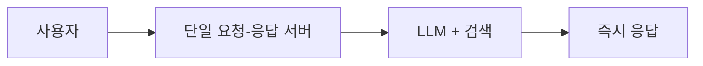
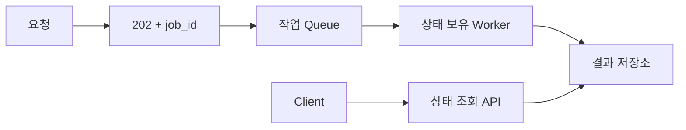
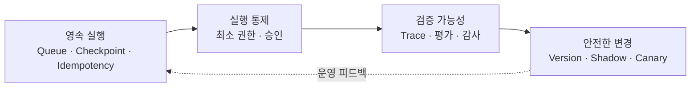

# AI Agent 도입 아키텍처 진화: PoC에서 운영까지 무엇을 바꾸는가

기업 AI Agent 도입 로드맵의 마지막 구간은 **운영 전환**입니다. [기업 AI Agent 도입 로드맵 6단계](https://aiarchitect.tistory.com/65)에서 5·6단계로 다룬 그 전환을, 이 글은 성공 사례담이 아니라 **아키텍처가 어떻게 바뀌는가**로 다룹니다. 무엇이 좋아졌는지가 아니라, **어떤 실패 모드가 어떤 구조 변경을 강제하는지**를 봅니다.

PoC와 운영은 최적화 대상이 다릅니다. PoC는 "이게 되는가"를 빠르게 보이도록 최적화하고, 운영은 "실패해도 안전한가·복구되는가·감사되는가"로 최적화합니다. 그래서 시연이 된 아키텍처를 그대로 켜면, 첫 타임아웃·재시도·권한 사고에서 구조를 다시 설계하게 됩니다([AI PoC가 운영 단계에서 멈추는 이유](https://aiarchitect.tistory.com/15)).

> 이 글은 공개된 분산 시스템·Agent 운영 패턴을 조합한 **교육용 가상 시나리오**입니다. 단일 또는 복수 고객 프로젝트를 재구성한 사례 연구가 아니며, 특정 고객·회사·제품이나 실제 운영 성과 수치를 나타내지 않습니다. 구조·값·이름은 모두 예시이고 상호 참조 링크만 실제 URL입니다.

## 1. 합성 시나리오 설정

논의를 구체화하기 위해 하나의 가상 업무를 둡니다 — **사내 문서 질의 + 제한된 액션 Agent**. 사용자가 자연어로 묻고, Agent가 권한 범위의 문서를 검색해 답하며, 일부 요청에서 티켓 생성 같은 쓰기 액션을 제안·실행합니다. 이 업무의 적합도 판정과 준비도 진단은 앞선 [적합도 판정 기술 기준](https://aiarchitect.tistory.com/70)·[준비도 진단 스펙](https://aiarchitect.tistory.com/69)에서 통과했다고 가정하고, 여기서는 **PoC 구조를 운영 구조로 바꾸는 과정**만 봅니다.

PoC 아키텍처는 대개 이렇게 단순합니다.

```text
[사용자] → [단일 요청-응답 서버] → [LLM 호출 + 검색] → [즉시 응답]
   상태는 프로세스 메모리, 권한은 관리자 토큰, 로그는 표준출력, 배포는 수동
```



*PoC 구조 — 빠른 가설 검증에는 유리하지만 상태·권한·복구 경계가 한 실행에 붙어 있습니다.*

이 구조가 운영에서 만나는 실패 모드를 하나씩 따라가며 바꿉니다. 각 절은 **실패 모드 → before → after → 보장할 불변조건**으로 봅니다.

## 2. 동기 → 비동기: 요청-응답에서 작업 큐로

- **실패 모드**: 검색·다단계 Tool 호출·모델 지연이 겹쳐 한 요청이 요청 시간 예산을 초과하면 게이트웨이 타임아웃에 걸립니다. 사용자는 재요청하고, 같은 작업이 중복 실행됩니다.
- **before**: HTTP 요청 안에서 전체 파이프라인을 동기로 실행하고 완료까지 커넥션을 붙잡음.
- **after**: 요청은 **작업(job)** 을 큐에 넣고 즉시 접수 ID를 반환. 워커가 비동기로 처리합니다. 이때 **작업 완료(`succeeded`)와 결과 사용 가능은 분리**하고, 완료 이벤트는 조회를 깨우는 **wake-up 신호**일 뿐 **조회 API가 진실의 원천(source of truth)** 입니다([비동기 완료 상태 설계](https://aiarchitect.tistory.com/18)의 Operation/Result 분리 패턴 적용).
- **불변조건**: 클라이언트는 이벤트가 아니라 조회 API의 상태로만 결과를 신뢰한다.

```text
POST /ask        → 202 Accepted { job_id }
GET  /jobs/{id}  → { state: queued|running|succeeded|failed,
                     result_state: pending|ready|failed, result_ref? }
# state:succeeded(작업 종료) ≠ result_state:ready(결과 사용 가능). 클라이언트는 result_state로 판단.
```



*운영 실행 경로 — 접수·실행·결과 사용 가능 상태를 분리해 타임아웃과 중복 요청을 통제합니다.*

## 3. 인메모리 상태 → 영속 상태: 재시작에 견디는 실행

- **실패 모드**: 워커가 재배포·크래시로 재시작되면 진행 중이던 다단계 작업이 사라집니다. 어디까지 했는지 알 수 없어 처음부터 다시 하거나, 부분 실행된 채 방치됩니다.
- **before**: 대화·계획·중간 결과가 프로세스 메모리에만 존재.
- **after**: 작업 상태를 **영속 저장소**에 체크포인트로 남기되, 각 Tool 실행을 `planned → executing → confirmed` 로 기록하고 **결과 불명(`unknown_outcome`)** 상태를 명시합니다. 동시 워커 중복 처리를 막기 위해 소유·만료를 나타내는 **lease**와 단조 증가하는 **fencing token**을 분리해 두고(상태 저장소는 더 낮은 fencing token의 쓰기를 거부), 체크포인트에는 **스키마 버전**을 붙입니다. 자격 증명 원문은 큐·체크포인트에 저장하지 않습니다([Checkpoint·Retry·Idempotency·Outbox](https://aiarchitect.tistory.com/7)).
- **불변조건**: 체크포인트만으로 "두 번 실행 안 됨"을 보장할 수는 없다. `executing`에서 결과가 불명확해지면 **자동으로 새로 실행하지 않고 `unknown_outcome`으로 전이**하고, 동일 `operation_id` 조회·멱등 재호출·수동 조정으로 결과를 확정한 뒤에만 다음 단계로 넘어간다.

```json
{ "job_id": "job-…", "step": "tool_call:create_ticket", "state": "executing", "operation_id": "op-…", "lease_owner": "worker-3", "lease_expires_at": "…", "fencing_token": 42, "schema_version": 2, "attempt": 1 }
```

## 4. 재시도·멱등성·아웃박스: at-least-once 위에서 중복 효과를 조건부로 억제

- **실패 모드**: 비동기·재시도를 붙이면 같은 쓰기 액션이 두 번 실행될 수 있습니다(커밋 후 응답 유실 → 재시도). 티켓이 두 장 생기고, 알림이 두 번 나갑니다.
- **before**: 재시도 없음(실패는 그냥 유실) 또는 무분별한 재시도(중복 실행).
- **after**: 분산 전달은 **at-least-once** 가 현실이므로 "정확히 한 번 전달"을 가정하지 않습니다. 대신 쓰기에 **멱등 키**를 부여하고 소비자에서 **중복 제거(dedup)** 해 **효과를 효과적으로 한 번(effectively-once)에 가깝게** 만듭니다. 단 이는 **조건부**입니다 — 재시도 간 안정적 멱등 키·요청 지문, 동시 요청을 막는 unique 제약 또는 원자적 키 예약, dedup 기록과 업무 부수효과의 원자적 처리, 재전달 창 이상인 dedup 보존, 외부 SaaS면 그 API의 멱등 계약 또는 `operation_id` 조회·조정이 있어야 성립합니다. 외부 부수효과(알림·후속 호출)는 **아웃박스(Outbox)** 로 분리해 업무 상태 커밋과 **같은 트랜잭션**으로 "발행할 이벤트"를 기록한 뒤 별도로 전달합니다. 아웃박스는 그 원자적 기록을 보장할 뿐, 외부 효과 자체를 한 번으로 만들지는 않으므로 소비자 dedup이 함께 필요합니다.
- **불변조건**: 위 조건을 갖추면 같은 멱등 키의 재시도가 부수효과를 한 번만 남긴다(조건 미충족 시 중복 가능).

| 관심사 | before(PoC) | after(운영) |
|---|---|---|
| 재시도 | 없음 또는 무한 | 지수 backoff+jitter·최대 횟수·데드라인 |
| 쓰기 중복 | 가능 | 멱등 키 + 소비자 dedup |
| 부수효과 | 인라인 실행 | 아웃박스로 분리(동일 트랜잭션 기록) |

## 5. 광범위 권한 → 최소 권한·승인 경계

- **실패 모드**: PoC의 관리자 토큰을 그대로 켜면, 프롬프트 인젝션이나 오작동이 곧바로 광범위한 시스템 변경으로 이어집니다.
- **before**: 단일 관리자 자격 증명, 모든 액션 무인 실행.
- **after**: 테넌트·사용자·자원 단위 **최소 권한**, 자격 증명은 브로커가 단기 토큰으로 주입([자격 증명 관리](https://aiarchitect.tistory.com/24)). 중요·파괴 액션은 사용자·테넌트·대상·정규화된 인자·정책 버전·만료에 묶인 **승인 바인딩**을 거치고 결정·승인·실행·감사가 하나의 체인으로 남습니다([엔터프라이즈 권한 설계](https://aiarchitect.tistory.com/19)). 비동기라면 **실행 직전에 권한을 재검증**합니다(승인 시점과 실행 시점이 다르므로).
- **불변조건**: 실행 시점에 유효한 최소 권한 없이, 그리고 정책상 승인이 필요한 쓰기는 유효한 승인 없이, 실행되지 않는다.

## 6. 단일 모델 호출 → 폴백·서킷 브레이커

- **실패 모드**: 단일 모델 제공자가 지연·오류·레이트리밋에 걸리면 서비스 전체가 함께 멈춥니다.
- **before**: 한 제공자에 직접 호출, 실패 시 사용자 에러.
- **after**: 제공자를 **교체 가능한 어댑터**로 두고([멀티 LLM Agent Core](https://aiarchitect.tistory.com/13)), 타임아웃·서킷 브레이커·폴백 경로와 **품질 저하 모드(graceful degradation)** 를 둡니다. 다만 모델 교체는 의미적으로 투명하지 않으므로 **capability 매트릭스·품질 평가·데이터 반출 정책·비용 한도**를 함께 정하고, **Tool 부수효과를 실행한 뒤에는 폴백으로 재실행하지 않습니다**(중복 효과 방지). 예: 액션 Agent가 불가하면 읽기 전용 답변으로 축소.
- **불변조건**: 폴백은 이미 확정된 부수효과를 재실행하지 않는다.

## 7. 로그 → 관측성: 추적·평가·감사

- **실패 모드**: "가끔 이상한 답을 한다"는 신고가 오는데, 표준출력 로그만으로는 어느 단계·어느 도구·어느 입력에서 틀어졌는지 재구성할 수 없습니다.
- **before**: 평문 로그, 단계별 추적 없음, 품질은 사람이 임의 확인.
- **after**: 요청→계획→도구 호출→응답을 잇는 **분산 추적(trace)**, 회귀를 잡는 **오프라인 평가 세트**, 누가·무엇을·언제 실행했는지의 **감사 이벤트**를 분리해 남깁니다. 단 trace·평가 세트에도 프롬프트·검색 결과·Tool 인자 같은 민감정보가 들어가므로, 로그뿐 아니라 **trace·평가 데이터의 마스킹·접근 권한·보존 기간**을 함께 정합니다.
- **불변조건**: 관측 데이터 어디에도 시크릿·미마스킹 PII가 남지 않는다.

## 8. 수동 배포 → 버전·롤백·섀도우

- **실패 모드**: 프롬프트·모델·도구 스키마를 바꿔 배포했는데 품질이 나빠져도, 되돌릴 버전과 절차가 없어 장애가 길어집니다.
- **before**: 프롬프트·설정을 손으로 바꿔 즉시 반영, 롤백 불가.
- **after**: 프롬프트·정책·도구 스키마를 **버전 아티팩트**로 관리하고, 이전 버전과의 호환을 확인한 **롤백** 절차를 둡니다. 새 버전 검증에는 **섀도우와 카나리를 구분**합니다 — 섀도우는 복제 트래픽을 흘리되 **쓰기 부수효과를 차단**하고, 카나리는 실제 일부 트래픽이므로 **중단 기준과 kill switch**가 필요합니다. 단, 롤백은 코드·설정을 되돌릴 뿐 **이미 발생한 외부 액션·데이터 변경을 되돌리지는 못하므로** 보상 트랜잭션을 따로 설계합니다.
- **불변조건**: 모든 활성 버전은 되돌릴 수 있고, 섀도우 트래픽은 외부 상태를 바꾸지 않는다.

## 9. 진화 요약: 관심사별 before → after

| 관심사 | PoC(before) | 운영(after) | 강제한 실패 모드 |
|---|---|---|---|
| 실행 모델 | 동기 요청-응답 | 비동기 작업 큐 | 타임아웃·중복 요청 |
| 상태 | 인메모리 | 영속 체크포인트(lease·상태머신) | 재시작 시 유실 |
| 재시도·효과 | 없음/무분별 | 멱등 키·dedup·아웃박스 | 쓰기 이중 실행 |
| 권한 | 관리자 토큰 | 최소 권한·승인 바인딩·실행 시 재검증 | 광범위 오작동·유출 |
| 모델 의존 | 단일 제공자 | 폴백·서킷 브레이커·저하 모드 | 제공자 장애 전파 |
| 관측성 | 평문 로그 | 추적·평가·감사(마스킹) | 원인 추적 불가 |
| 배포 | 수동 즉시 반영 | 버전·롤백·섀도우/카나리 | 되돌릴 수 없는 품질 저하 |

이 변경들은 개별 기능으로 보이지만 **안전성은 조합으로 성립합니다.** 비동기 큐는 영속 상태·lease·멱등성이 함께 있어야 안전하고, 아웃박스는 동일 트랜잭션·소비자 dedup이 전제이며, 폴백은 체크포인트·부수효과 경계를 확인해야 합니다. 그래서 **묶음 단위로 단계적으로** 켜되 각 묶음의 **선행 의존성을 먼저 충족**합니다.



*운영 진화 묶음 — 내구성, 권한, 관측, 배포를 순서대로 연결하고 운영 증거를 다음 변경에 반영합니다.*

## 10. PoC에서 미리 설계하면 재작업이 주는 것

운영 전환의 재작업은 흔히 "PoC에서 결정을 미룬 지점"에서 생깁니다. 다음은 PoC 단계에서 인터페이스만이라도 미리 그어두면 이후 구조 변경 범위를 줄일 수 있는 지점입니다.

- 작업 경계를 **동기 함수가 아니라 job 단위**로 나눠 두기(이후 큐·상태머신·취소·DLQ를 붙일 여지를 남김).
- 쓰기 액션에 **멱등 키 자리**를 처음부터 두기.
- 자격 증명을 코드가 아니라 **주입 지점**에서 받기(관리자 토큰 하드코딩 금지).
- 단계마다 **상관 ID(correlation id)** 를 로깅해 이후 추적으로 승격 가능하게 하기.

이 준비가 전환을 자동으로 끝내주지는 않지만, 후속 구조 변경을 "재설계"가 아니라 "확장"에 가깝게 만들어 줍니다.

## 맺음말

AI Agent의 운영 전환은 모델을 더 좋게 바꾸는 일이 아니라, **같은 판단을 안전하게 실행·복구·감사할 수 있는 구조로 바꾸는 일**입니다. 동기를 비동기로, 인메모리를 영속 상태로, 무분별한 재시도를 멱등성·아웃박스로, 관리자 토큰을 최소 권한·승인으로, 단일 모델을 폴백으로, 로그를 관측성으로, 수동 배포를 버전·롤백으로 — 각 변경은 특정 실패 모드가 강제하며 안전성은 조합으로 성립합니다.

그래서 운영 전환은 "언제 다 바꾸나"가 아니라 "어떤 실패 모드를 먼저 다루느냐"의 문제입니다. [적합도 판정](https://aiarchitect.tistory.com/70)과 [준비도 진단](https://aiarchitect.tistory.com/69)을 통과한 업무를, 이 진화 표를 지도 삼아 **예상 실패의 위험도와 선행 의존성 순으로(실제 장애가 나기 전에)** 운영화하면, 시연용 구조에서 운영용 구조로 옮겨가는 재작업을 줄일 수 있습니다.
