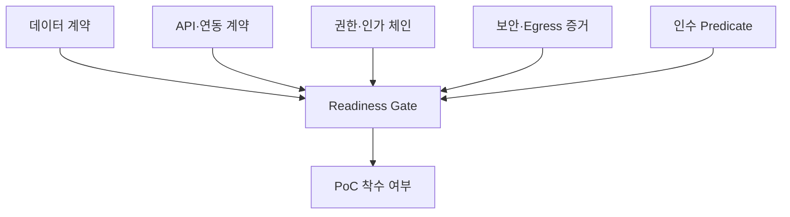
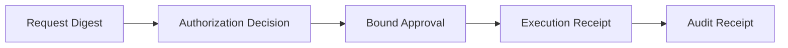
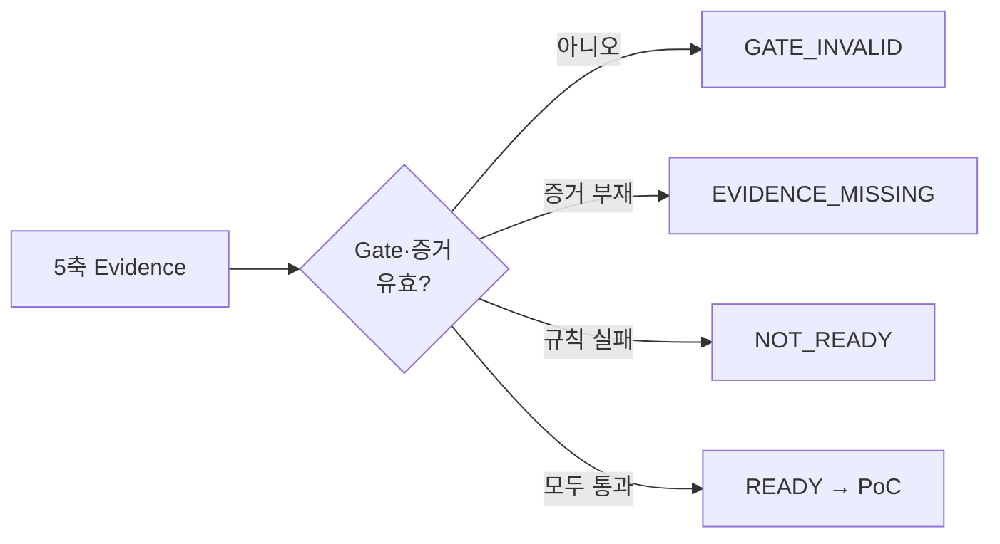

# AI Agent 도입 준비도 진단: 데이터·API·권한·보안·인수를 검증 가능한 스펙으로 만들기

기업 AI Agent 도입 로드맵에서 PoC 앞에 놓이는 단계가 **준비도 진단 (Readiness Assessment)** 입니다. [기업 AI Agent 도입 로드맵 6단계](https://aiarchitect.tistory.com/65)에서 3단계로 다룬 그 진단을, 이 글은 서류가 아니라 **검증 가능한 스펙**으로 구체화합니다.

준비도 진단은 흔히 "데이터 준비됐나요? / API 열려 있나요? / 권한 정리됐나요?"라는 문답 체크리스트로 끝납니다. 문제는 그 답이 대부분 자기보고라는 점입니다. "네, 준비됐습니다"는 검증이 아닙니다. 준비가 덜 된 채 PoC에 들어가면, 기술적 시연은 되지만 운영 전환에서 데이터·권한·인증을 다시 설계하게 됩니다.

이 글의 관점은 하나입니다 — **준비도는 "준비됐나요?"라는 질문이 아니라 "검증기가 통과시키고 그 증거가 남는가?"라는 검증이어야 한다.** 각 준비 항목을 사람이 눈으로 확인하는 문장이 아니라, 검증기 (Verifier) 가 판정하고 **증거 (Evidence)** 를 남기는 계약·매니페스트·술어로 바꿉니다. 본문의 JSON은 계약과 판정 구조를 보여주는 **개념 예시**이며(규칙 표현은 의사코드입니다), 실제 검증은 별도 검증기가 수행해 증거 artifact를 남깁니다. 값·경로·스키마는 모두 합성 예시이고 특정 제품·회사와 무관하며, 상호 참조와 공식 문서 링크만 실제 URL입니다.

## 1. 준비도는 서류가 아니라 검증 가능한 스펙이다

문서 체크리스트와 검증 가능한 스펙의 차이는 "판정 주체"에 있습니다.

```text
서류 체크리스트 :  "데이터 준비됨"  → 담당자의 주관적 예/아니오
검증 가능한 스펙 :  검증기가 계약·표본을 평가 → 증거 artifact + 판정 상태
```

검증 가능한 스펙으로 바꾸면 세 가지가 달라집니다.

- **재현성**: 입력 스냅샷·후보 리비전·스키마·정책·검증기 버전과 런타임 이미지·정규화 버전·표본 seed·외부 참조 스냅샷·평가 시각을 모두 고정하면, 사람이 바뀌어도 같은 판정이 나옵니다. 이 조건이 고정되지 않으면 재현성은 보장되지 않습니다.
- **fail-closed**: 근거가 없거나 계약을 만족하지 못하면 준비 완료로 올리지 않습니다. 모호하면 `READY`로 판정하지 않습니다.
- **게이트화**: 준비도는 PoC 착수를 여는 **게이트 (Gate)** 입니다. 통과하지 못한 후보는 준비 단계로 되돌립니다.

판정은 단일한 예/아니오가 아니라 네 개의 상태로 구분합니다: `READY`(통과), `NOT_READY`(규칙 실패), `EVIDENCE_MISSING`(증거 미비로 판정 보류 — 규칙 실패가 아님), `GATE_INVALID`(게이트 자체 결함). 상태 해소 규칙은 9절에서 정리합니다.

이 글은 준비도를 다섯 축으로 나누고, 각 축을 검증기·증거가 있는 산출물로 정의한 뒤, 그 결과를 하나의 Readiness Predicate로 종합해 게이트 판정에 연결합니다.

## 2. 준비도 5축: 데이터·연동·권한·보안·인수

도입 준비도를 다섯 축으로 나눕니다. 각 축은 "확인했다"가 아니라 **검증기 출력과 증거**를 남겨야 합니다.

| 축 | 핵심 질문 | 검증 산출물 | 연결 글 |
|---|---|---|---|
| 데이터 | 무엇을·어디까지·어떤 등급의 데이터를 쓰는가 | 데이터 계약 + 표본 검증 증거 | [성공 기준 8가지](https://aiarchitect.tistory.com/20) |
| 연동 | 외부 시스템을 안전하게 호출·재시도할 수 있는가 | 연동 계약(멱등성·타임아웃·재시도) + 계약 테스트 | [Checkpoint·Retry·Idempotency](https://aiarchitect.tistory.com/7) |
| 권한 | 누가·무엇을·어떤 승인으로 실행하는가 | 정책·결정·승인·실행·감사를 연결한 인가 체인 | [권한 설계](https://aiarchitect.tistory.com/19) · [자격 증명 관리](https://aiarchitect.tistory.com/24) |
| 보안 | 시크릿·유출면·외부 전송을 통제하는가 | 시크릿 핸들·Egress·유출면 스캔 증거 | [보안 8경계](https://aiarchitect.tistory.com/8) · [시크릿 가드](https://aiarchitect.tistory.com/50) |
| 인수 | 무엇을 만족해야 "된 것"인가 | Readiness Predicate(증거 봉투 바인딩) + 네거티브 테스트 | [비동기 완료 상태 설계](https://aiarchitect.tistory.com/18) |

다섯 축은 서로를 대체하지 않습니다. 데이터가 완벽해도 권한 경계가 없으면 준비된 것이 아니고, 권한이 정리돼도 인수 기준을 검증할 수 없으면 PoC 결과를 판정할 수 없습니다.



*준비도 5축 — 어느 한 축도 다른 축의 통과로 상쇄하지 않고 하나의 Gate에서 함께 판정합니다.*

## 3. 데이터 준비도 — 데이터 계약과 PII 분류를 스키마로

데이터 준비도는 "데이터가 있다"가 아니라 **데이터 계약 (Data Contract)** 으로 확인합니다. 계약은 선언이고, 검증은 검증기가 JSON Schema로 수행해 증거를 남깁니다. 아래 `fields`는 필드 형식을 요약한 **설명용 예시**이며, 실제 검증 스키마는 `$schema`·`type`·`required`·`enum`을 갖춘 JSON Schema로 따로 둡니다.

```json
{
  "dataset": "support_tickets",
  "source_system": "ticketing",
  "fields": {
    "ticket_id": "string",
    "tenant_id": "string",
    "created_at": "timestamp",
    "body": "text",
    "customer_tier": "enum[free,pro,enterprise]"
  },
  "pii_classification": { "body": "pii_possible", "handling": "mask_before_index" },
  "retention": { "raw_days": 30, "derived_days": 180, "deletable": true },
  "access_scope": { "tenant_isolation": true, "row_filter": "tenant_id = :caller_tenant" },
  "sample": { "period_days": 90, "min_rows": 500, "select_query_digest": "sha256:…", "artifact_digest": "sha256:…", "coverage_by_slice": { "free": 0.4, "pro": 0.35, "enterprise": 0.25 } }
}
```

숫자 값(30·90·500 등)은 예시 기준선이며 업무 특성과 재시도·보존 정책에 따라 정합니다. 세 가지를 검증기로 확인합니다.

- **스키마·등급 검증**: 실제 데이터가 JSON Schema를 만족하는가, `pii_possible` 필드에 마스킹·표식이 걸려 있는가. 검증기는 위반 목록과 통과 여부를 증거로 남깁니다.
- **대표성 (Representativeness)**: 표본이 운영 분포를 대표하는가를 자기평가(`true`)가 아니라 **슬라이스별 건수·비율, 추출 쿼리 다이제스트, 표본 artifact 다이제스트**로 남깁니다. 시연용으로 고른 깔끔한 30건은 준비가 아닙니다([PoC가 운영에서 멈추는 함정](https://aiarchitect.tistory.com/15)).
- **접근 경계**: 테넌트 격리와 행 수준 필터가 실제로 적용되는가. `row_filter`가 참조하는 `tenant_id`는 `fields`에 선언돼 있어야 합니다.

## 4. API·연동 준비도 — 멱등성·타임아웃·재시도를 계약으로

Agent는 외부 시스템의 Tool을 호출합니다. 연동 준비도는 "API가 있다"가 아니라, 그 호출이 **안전하게 실패하고 안전하게 재시도되는가**를 계약으로 확인합니다.

```json
{
  "tool": "create_refund",
  "endpoint": "POST /v1/refunds",
  "action_class": "write",
  "idempotency": {
    "required_for": "결과가 불명확한 상태에서 자동 재실행될 수 있는 비멱등 쓰기(타임아웃·큐 재전달·연결 단절·워커 재시작 등 at-least-once 경로)",
    "key_header": "Idempotency-Key",
    "key_scope": ["tenant", "subject", "operation"],
    "payload_fingerprint": "sha256(정규화된 요청 바디)",
    "same_key_different_payload": "reject",
    "ttl_seconds": 86400
  },
  "timeout": { "connect_ms": 1000, "read_ms": 5000, "absolute_deadline_ms": 8000, "cancellation": "propagate" },
  "retry": { "retryable": [502, 503, 504], "terminal": [400, 403, 409, 422], "honor_retry_after": true, "backoff": "exponential+jitter", "max_attempts": 3 }
}
```

- **멱등성 (Idempotency)**: [RFC 9110](https://www.rfc-editor.org/rfc/rfc9110.html#section-9.2.2)은 PUT·DELETE와 safe method를 메서드 의미상 멱등으로 정의합니다. POST는 메서드 자체로 멱등성이 보장되지 않지만, 서버가 작업 의미와 멱등 키로 멱등하게 설계할 수 있습니다. 따라서 멱등 키는 모든 쓰기가 아니라 **결과가 불명확한 채 자동 재실행될 수 있는 비멱등 쓰기**(타임아웃·큐 재전달·연결 단절·워커 재시작 등 at-least-once 경로)에 요구합니다. 키에는 테넌트·주체·작업 범위와 요청 지문을 묶고, 같은 키에 다른 payload가 오면 거부해야 재시도가 이중 실행을 만들지 않습니다([Checkpoint·Retry·Idempotency·Outbox](https://aiarchitect.tistory.com/7)).
- **타임아웃과 절대 데드라인**: connect/read뿐 아니라 재시도·backoff·큐 대기까지 포함한 **절대 데드라인**과 취소 전파(cancellation propagation)로 한 턴의 지연 상한을 고정합니다.
- **재시도 분류**: `5xx`라도 `501`·`505`는 재시도 대상이 아니고, `408`·`409`·갱신 가능한 `401`은 상황별 판단이 필요합니다. `409`는 충돌 해소 후 재제출이 가능하므로, 위 계약처럼 **종결로 분류하려면 그 정책을 명시**해야 합니다. `Retry-After` 준수, 지수 backoff+jitter, 최대 횟수, 전체 데드라인을 계약에 담습니다.
- **인증 스키마**: 단기 토큰·최소 스코프. 자격 증명은 [브로커 패턴](https://aiarchitect.tistory.com/24)으로 주입합니다.

## 5. 권한·인가 준비도 — 정책·결정·승인·실행·감사를 하나의 체인으로

권한 준비도는 "권한 정리됨"이 아니라 **하나의 요청에 묶인 산출물 체인**으로 확인합니다. 정책·결정·승인·실행·감사를 분리하되 **공통 식별자로 연결**합니다. 유효한 승인·영수증을 다른 요청에 재조합할 수 없도록 `request_digest → decision_id → approval_grant_id → execution_id → audit_event_id` 체인과 subject·tenant·resource identity를 함께 바인딩합니다.

```json
{
  "request": { "request_digest": "sha256:…", "subject": { "actor": "agent", "on_behalf_of": "user:u-123", "tenant": "t-42" }, "resource": "refunds", "resource_version": 7, "normalized_args_digest": "sha256:…" },
  "policy_manifest": { "resource": "refunds", "action_class": "important", "policy_version": "authz-2026-08", "requires": ["human_approval"] },
  "authorization_decision": { "decision_id": "dec-…", "request_digest": "sha256:…", "effect": "allow", "policy_version": "authz-2026-08", "evaluated_at": "…" },
  "approval_grant": { "approval_grant_id": "apr-…", "decision_id": "dec-…", "bound_to": { "normalized_args_digest": "sha256:…", "resource_version": 7, "policy_version": "authz-2026-08" }, "expires_at": "…", "max_uses": 1, "consume": "atomic", "signature": "…" },
  "execution_receipt": { "execution_id": "exec-…", "approval_grant_id": "apr-…", "request_digest": "sha256:…", "normalized_args_digest": "sha256:…", "resource_version": 7, "outcome_digest": "sha256:…" },
  "audit_receipt": { "audit_event_id": "evt-…", "decision_id": "dec-…", "approval_grant_id": "apr-…", "execution_id": "exec-…", "recorded_at": "…" }
}
```

- **액션 등급 분리**: 읽기·쓰기·중요·파괴를 구분하고 등급별로 승인·자동화 수준을 다르게 둡니다([승인 정책 설계](https://aiarchitect.tistory.com/16), [권한 설계](https://aiarchitect.tistory.com/19)).
- **승인 바인딩 (Approval Binding)**: 승인은 결정 ID, 정규화된 Tool·인자 지문, 자원·정책 버전, 만료·사용 횟수, 서명에 묶여야 합니다. `max_uses`는 동시 실행 시 **원자적으로 소비**돼야 하며, 모델 출력의 `"approved": true`로 대체하면 안 됩니다([보안 8경계](https://aiarchitect.tistory.com/8)).
- **실행·감사 영수증**: `execution_id`는 불변·유일한 주키이며 실행당 영수증은 하나입니다. `execution_receipt`가 승인 grant·요청·인자·자원 버전·실행 결과를 참조하고, 인가 규칙이 `request_digest`·`normalized_args_digest`·`resource_version`의 동등성을 강제해야, 감사 영수증과 함께 "승인된 요청과 실제 실행이 같다"를 검증할 수 있습니다.



*인가 증거 체인 — 승인한 요청과 실제 실행·감사 기록이 같은 작업임을 공통 식별자로 증명합니다.*

## 6. 보안 경계 준비도 — 시크릿 핸들·유출면·Egress 게이트

보안은 도입 이후가 아니라 준비도의 독립된 한 축(다섯 축 중 넷째)입니다. 세 가지를 검증합니다.

```json
{
  "secrets": { "mode": "handle_only", "raw_in_context": false, "rotation_days": 30 },
  "egress": {
    "default": "deny",
    "allowlist": ["api.internal.example", "llm-provider.example"],
    "data_class_enforced": true,
    "field_masking_verified": true,
    "redirect_revalidated": true,
    "resolved_ip_checked": true,
    "on_block": "fail_closed"
  },
  "leak_surfaces": { "guarded": ["commit", "file_write", "log", "tool_args", "external_send"] }
}
```

- **값이 아니라 핸들 (Handle, not Value)**: Agent 컨텍스트에 시크릿 원문을 넣지 않고 핸들만 노출하며, 핸들에 대상 서비스·허용 작업·수명을 묶습니다([시크릿 가드 설계](https://aiarchitect.tistory.com/50)).
- **Egress 게이트 (송신 게이트)**: 도메인 허용 목록은 미승인 목적지로의 전송을 **줄일** 뿐, 승인된 LLM·API로의 민감정보 반출까지 막지는 못합니다. 그래서 데이터 등급 적용(`data_class_enforced`), 필드 수준 마스킹(`field_masking_verified`), 리다이렉트 재검사(`redirect_revalidated`), IP 검증(`resolved_ip_checked` — 모든 A/AAAA 주소를 연결 시점과 리다이렉트 후 재해석해 목적지별 허용 CIDR·주소 등급과 대조하고, 검증한 IP로 연결을 고정해 DNS 재바인딩의 검사-사용 시차(TOCTOU)를 닫음)을 함께 검증하고, 이 네 통제는 보안 Predicate에서 강제합니다([Prompt Injection 방어](https://aiarchitect.tistory.com/23)).
- **유출면 점검**: 커밋·파일 쓰기·로그·도구 인자·외부 전송의 다섯 표면에 마스킹·가드가 걸려 있는지 스캔 증거로 확인합니다.

## 7. 인수 기준을 Readiness Predicate로

인수 준비도의 핵심은 "무엇을 만족하면 준비된 것인가"를 **증거에 바인딩된 술어**로 만드는 것입니다. 이것을 **Readiness Predicate (준비도 술어)** 라고 부릅니다. 다섯 축의 검증기 출력과 증거를 모아 하나의 판정으로 종합합니다.

증거는 단순 문자열 참조가 아니라, 무엇을·어떤 입력으로·누가 검사했는지를 바인딩한 **증거 봉투 (Evidence Envelope)** 여야 합니다. Predicate는 봉투의 유효성(`evidence_validation`)까지 규칙으로 검사하므로, 다른 후보나 오래된 artifact를 재사용할 수 없습니다.

```json
{
  "check_id": "DATA-1",
  "candidate_revision": "refund-assistant@42",
  "input_digest": "sha256:…",
  "result": "PASS",
  "verifier_version": "readiness-1.4",
  "verifier_image_digest": "sha256:…",
  "suite_manifest_digest": "sha256:…",
  "schema_or_policy_version": "data-v3",
  "normalization_version": "norm-2",
  "sample_seed": "…",
  "external_reference_snapshot_digest": "sha256:…",
  "generated_at": "…",
  "expires_at": "…",
  "artifact_digest": "sha256:…",
  "issuer": "readiness-ci",
  "key_id": "key-2026-08",
  "signature_algorithm": "ed25519",
  "attestation": "sig:…"
}
```

`attestation`은 `attestation` 필드를 제외한 정규화 봉투 payload 전체(`suite_manifest_digest` 포함)를 서명하므로, 봉투와 검증기 suite가 함께 바인딩됩니다. Predicate는 각 축의 규칙(`rule`)을 평가하고 증거 봉투를 검증·참조합니다. 규칙은 의사코드이며 실제로는 CEL·Rego·JSON Logic 같은 정책 엔진으로 평가합니다. 규칙의 `decision`·`approval`·`execution`·`audit`는 각각 5절의 `authorization_decision`·`approval_grant`·`execution_receipt`·`audit_receipt`의 별칭입니다.

```json
{
  "predicate": "adoption_readiness",
  "candidate_revision": "refund-assistant@42",
  "evaluated_against": { "policy_version": "authz-2026-08", "verifier_suite": "readiness-1.4", "suite_manifest_digest": "sha256:…" },
  "evidence_validation": "봉투 무결성(integrity) = check_id 일치 AND candidate_revision==후보 AND input_digest==현재 정규화 입력 AND suite_manifest_digest·스키마·정책·정규화 버전 일치 AND artifact_digest 일치 AND 서명 검증(key_id가 신뢰 키 목록에 있고 미폐기, issuer·signature_algorithm 확인) AND now∈[generated_at,expires_at]. 무결성 불통과면 EVIDENCE_MISSING. 무결한 봉투의 result∈{PASS,FAIL}는 규칙 판정의 입력이며 EVIDENCE_MISSING로 흡수하지 않는다",
  "checks": {
    "data":        { "rule": "schema_valid AND pii_masked AND sample.min_coverage_met", "evidence": ["DATA-1", "DATA-2"] },
    "integration": { "rule": "writes.all(idempotent_or_naturally_safe) AND absolute_deadline_defined AND retry_taxonomy_valid", "evidence": ["INTEG-1", "INTEG-2"] },
    "authz":       { "rule": "policy_present AND decision.effect=='allow' AND policy_manifest.resource==request.resource AND decision.policy_version==policy_manifest.policy_version AND approval.bound_to.policy_version==decision.policy_version AND approval.signature_valid AND now<approval.expires_at AND approval.max_uses_consumed_atomically AND (policy_manifest.requires⊇['human_approval'] ⇒ approval.human_verified) AND decision.request_digest==request.request_digest AND approval.decision_id==decision.decision_id AND approval.bound_to.normalized_args_digest==request.normalized_args_digest AND approval.bound_to.resource_version==request.resource_version AND execution.approval_grant_id==approval.approval_grant_id AND execution.request_digest==request.request_digest AND execution.normalized_args_digest==request.normalized_args_digest AND execution.resource_version==request.resource_version AND unique(execution_id) AND audit.chain_linked", "evidence": ["AUTHZ-1"] },
    "security":    { "rule": "secrets.handle_only AND egress.default_deny AND egress.data_class_enforced AND egress.field_masking_verified AND egress.redirect_revalidated AND egress.resolved_ip_checked AND leak_surfaces.guarded", "evidence": ["SEC-1"] },
    "acceptance":  { "rule": "success_metric.schema_valid AND negative_cases.schema_valid", "evidence": ["ACPT-1"] }
  },
  "gate_self_check": { "rule": "negative_tests.detect_all_injected_failures", "evidence": ["GATE-1"], "on_fail": "GATE_INVALID" },
  "state_resolution": {
    "priority": ["GATE_INVALID", "EVIDENCE_MISSING", "NOT_READY", "READY"],
    "GATE_INVALID": "게이트 정의·검증기 오류, 또는 무결한 GATE-1 result==FAIL(주입 실패 미검출)",
    "EVIDENCE_MISSING": "필수 봉투 부재·만료·무결성 불통과(서명·다이제스트·버전 불일치) — 규칙 실패가 아니라 판정 보류",
    "NOT_READY": "무결한 봉투가 result==FAIL 또는 check.rule 거짓을 보고",
    "READY": "모든 필수 봉투 무결 AND 모든 result==PASS AND 모든 check.rule 참"
  },
  "produces": "GATE-DECISION-1"
}
```

이 술어는 [비동기 완료 상태 설계의 Readiness Predicate](https://aiarchitect.tistory.com/18)와 같은 원리입니다 — 상태를 "아마 됐을 것"으로 추정하지 않고, **모든 증거 봉투가 무결하고, 모든 result==PASS이며, 모든 규칙이 참일 때만** 준비 완료로 판정합니다. 데이터 축의 판정 사슬 예시는 다음과 같습니다.

```text
data_contract(선언)
  → verifier(readiness-1.4): schema_valid=true, pii_masked=true, violations=[]
  → evidence 봉투 DATA-1: candidate=refund-assistant@42, input_digest, result=PASS, 서명
  → evidence_validation 통과(후보·입력·버전·서명·신선도) AND checks.data.rule = 참
  → 판정 기여: data = PASS
```

성공 지표는 [AI 프로젝트 성공 기준 8가지](https://aiarchitect.tistory.com/20)에서 정의한 인수 기준과 연결하고, Predicate 평가 결과 자체는 입력이 아니라 별도 산출물 `GATE-DECISION-1`로 남깁니다.

## 8. Negative Test — "준비 안 됨"을 걸러내는 테스트

준비도 스펙은 "준비됨"을 확인하는 것만으로 부족합니다. 정의된 실패 사례에서 **게이트가 실제로 걸러내는지를 증거로 남기는** **네거티브 테스트 (Negative Test)** 가 있어야 검증이 완성됩니다. 각 테스트는 실패를 주입하고, 관찰 지점에서 기대한 게이트 동작이 나오는지 확인합니다. 게이트가 주입 실패를 검출하지 못하면 그 자체가 `GATE_INVALID`입니다.

| 축 | 실패 주입 | 관찰 지점 | 기대 게이트 동작 | 미검출 시 |
|---|---|---|---|---|
| 데이터 | PII 필드 마스킹 제거 | violations, `data.pii_masked` | `NOT_READY` | `GATE_INVALID` |
| 연동 | 멱등 키 없이 쓰기 + 커밋 후 응답 유실 → 자동 재시도 | 재시도 횟수, 자원 side-effect 건수(2회) | `NOT_READY`(이중 실행 감지) | `GATE_INVALID` |
| 연동 | 종결로 계약한 409를 retryable로 오분류 | 재시도 횟수, backoff 로그 | `NOT_READY`(불필요 재시도·계약 위반) | `GATE_INVALID` |
| 권한 | 감사·실행 영수증 체인을 끊음 | `audit.chain_linked`, `execution_id` 부재 | `NOT_READY` | `GATE_INVALID` |
| 권한 | 동일 grant를 병렬 재사용(max_uses 초과) | grant 원자 소비, 중복 실행 | `NOT_READY`/차단 | `GATE_INVALID` |
| 보안 | 시크릿 원문을 Agent 컨텍스트에 주입 | `secrets.raw_in_context`, 핸들 위반 | `NOT_READY` | `GATE_INVALID` |
| 보안 | 유출면(로그·커밋·도구 인자 등)에 시크릿 노출 | `leak_surfaces.guarded`, 마스킹 로그 | `NOT_READY` | `GATE_INVALID` |
| 보안 | Egress allowlist 밖 목적지 전송 | 게이트 reason code, 차단 로그 | 차단(fail-closed) | `GATE_INVALID` |
| 보안 | 데이터 등급 미적용 전송 | `egress.data_class_enforced` | `NOT_READY` | `GATE_INVALID` |
| 보안 | 필드 마스킹 누락 전송 | `egress.field_masking_verified` | `NOT_READY` | `GATE_INVALID` |
| 보안 | 리다이렉트로 목적지 우회 | `egress.redirect_revalidated` | 차단(fail-closed) | `GATE_INVALID` |
| 보안 | 미허용 IP로 해석되는 도메인 | `egress.resolved_ip_checked` | 차단(fail-closed) | `GATE_INVALID` |
| 인수 | 성공 지표 스키마 미충족 | `acceptance.success_metric.schema_valid` | `NOT_READY` | `GATE_INVALID` |

네거티브 테스트가 모든 주입 실패를 검출해야 준비도 게이트를 신뢰할 수 있습니다. 실패를 넣었는데 게이트가 준비 완료로 판정한다면, 그 게이트는 서류와 다르지 않습니다.

## 9. 준비도 게이트 — 4상태 판정과 다음 단계 매핑

다섯 축의 검증 결과를 게이트 상태로 해소합니다. 위에서 아래로 우선순위를 적용해 하나의 상태만 남깁니다. `READY`가 아닌 모든 상태에서는 PoC 착수를 막고, 준비도 테스트 중 실제 외부 효과는 격리합니다.

| 상태 | 의미 | 다음 단계 |
|---|---|---|
| `GATE_INVALID` | 게이트·검증기 오류 또는 무결한 GATE-1 result==FAIL(주입 실패 미검출) | 게이트 자체를 먼저 수정 |
| `EVIDENCE_MISSING` | 봉투 부재·만료·무결성 불통과로 판정 보류(규칙 실패 아님) | 검증기·증거 수집을 먼저 수행 |
| `NOT_READY` | 무결한 봉투가 result==FAIL 또는 축 규칙 거짓을 보고 | 실패한 축을 준비로 되돌림 |
| `READY` | 모든 봉투 무결 + 모든 result==PASS + 다섯 축 규칙 참 | PoC 착수 |

핵심은 **`READY`가 아닌 상태를 정상 결과로 취급하는 것**입니다. 준비도 게이트의 목적은 통과시키는 것이 아니라, 준비 안 된 후보를 PoC에서 걸러 재작업 비용을 앞단으로 옮기는 것입니다. 통과율이 늘 100%인 게이트는 차단 조건이 실제로 작동하는지 의심해 볼 필요가 있습니다.



*4상태 판정 — 통과 외의 상태도 원인과 다음 행동이 다른 정상적인 게이트 결과로 관리합니다.*

## 10. 안티패턴 — 준비도를 서류로만 확인할 때

- **자기보고 준비도**: "준비됐습니다"를 근거로 통과. 검증기 출력·증거 봉투가 없습니다.
- **깨끗한 표본 함정**: 시연용으로 고른 깔끔한 데이터로 준비도를 통과. 운영 분포·경계 사례가 빠져 있습니다.
- **권한 나중에**: PoC는 관리자 권한으로 돌리고 권한 경계는 운영에서 붙이기. 준비도에서 검증하지 않은 격리는 운영 유출 경로가 됩니다.
- **멱등성 생략**: 읽기 위주 PoC라 재시도 안전성을 미루다가, 첫 비멱등 쓰기에서 이중 실행.
- **판정 불가능한 인수 기준**: "잘 동작하면 성공" 같은 문장. 기계가 판정할 수 없으면 PoC 결과도 판정할 수 없습니다.
- **네거티브 테스트 부재**: "준비됨"만 확인하고 "준비 안 됨이 걸러지는지"는 확인하지 않음. 게이트가 실제로 막는지 모릅니다.

## 11. 도입 준비도 진단 체크리스트

문장이 아니라 **검증기·증거 봉투에 묶인** 체크리스트입니다. 각 검사는 대응하는 검증기와 증거 artifact가 있어야 통과이며, Predicate 평가 결과는 `GATE-DECISION-1`로 별도 산출됩니다.

| 검사 ID | 검증기 | 증거 artifact | 실패 시 판정 |
|---|---|---|---|
| DATA-1 | JSON Schema 검증 + PII 마스킹 스캔 | data-report | `NOT_READY` |
| DATA-2 | 표본 대표성(슬라이스 건수·추출 쿼리·다이제스트) | sample-manifest | `NOT_READY` |
| INTEG-1 | 멱등 키·이중 실행 계약 테스트 | contract-test | `NOT_READY` |
| INTEG-2 | 타임아웃 데드라인·재시도 분류 테스트 | contract-test | `NOT_READY` |
| AUTHZ-1 | 정책·결정·승인·실행·감사 체인 연결 확인 | authz-eval | `NOT_READY` |
| SEC-1 | 시크릿 핸들·Egress 4통제·유출면 스캔 | sec-scan | `NOT_READY` |
| ACPT-1 | 성공 지표·네거티브 케이스 스키마 검증 | acceptance-schema | `NOT_READY` |
| GATE-1 | 네거티브 테스트 주입 실패 전수 검출 | neg-test | `GATE_INVALID` |

## 맺음말

도입 준비도 진단은 발주를 위한 서류 작업이 아니라, **PoC에 들어가도 되는지를 판정하는 엔지니어링 게이트**입니다. 데이터·연동·권한·보안·인수 다섯 축을 데이터 계약·연동 계약·인가 체인·보안 매니페스트·Readiness Predicate라는 검증 가능한 산출물로 바꾸고, 각 판정을 증거 봉투에 바인딩하고, 네거티브 테스트로 게이트가 실제로 막는지 확인하면, 준비도는 "준비됐나요?"라는 질문에서 "검증기가 통과시키고 증거가 남는가?"라는 검증으로 바뀝니다.

이렇게 만든 준비도 게이트는 [도입 로드맵 6단계](https://aiarchitect.tistory.com/65)의 3단계를 실행 가능한 형태로 채웁니다. 통과한 후보만 PoC로 보내고 나머지는 준비로 되돌리면, 운영 전환에서 재설계하는 비용을 도입 앞단으로 옮기는 것을 목표로 할 수 있습니다.
